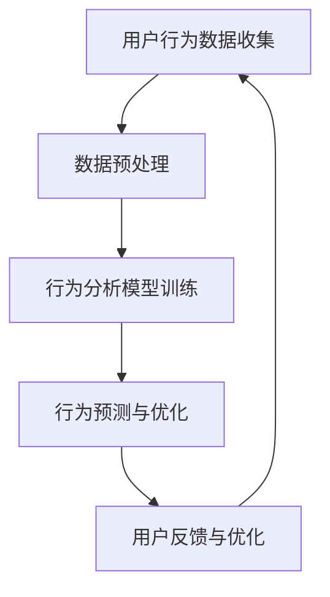

                 

关键词：智能家居，智能监控，注意力管理，AI，深度学习，数据分析，算法优化

> 摘要：本文探讨了智能家居系统的智能监控与注意力管理技术，通过引入人工智能和深度学习算法，实现了对家庭环境和用户行为的智能分析与优化。本文将从核心概念、算法原理、数学模型、项目实践以及未来展望等方面，全面解析智能家居系统的智能监控与注意力管理技术。

## 1. 背景介绍

随着物联网技术的普及和人工智能的快速发展，智能家居逐渐成为现代家庭生活中不可或缺的一部分。智能家居系统通过连接各种智能设备，实现对家庭环境的智能化管理和控制，从而提高生活质量。然而，随着设备数量的增多和用户行为的复杂化，如何对智能家居系统进行高效监控与管理，成为了当前研究的热点问题。

智能监控与注意力管理技术旨在通过对家庭环境和用户行为的实时监测与分析，提供个性化的服务和优化建议，从而提升用户体验。本文将从以下几个方面进行探讨：

- **核心概念与联系**：介绍智能家居系统的基本概念和组成部分，以及智能监控与注意力管理技术的核心原理。
- **核心算法原理与具体操作步骤**：解析智能监控与注意力管理技术的核心算法，包括算法原理、步骤详解、优缺点以及应用领域。
- **数学模型与公式**：构建智能家居系统的数学模型，并推导相关公式，通过案例分析进行详细讲解。
- **项目实践**：展示一个智能家居系统的开发实例，详细解释代码实现和运行结果。
- **实际应用场景**：探讨智能监控与注意力管理技术在智能家居领域的实际应用场景。
- **未来应用展望**：分析智能家居系统的发展趋势和面临的挑战，展望未来的研究方向。

## 2. 核心概念与联系

### 2.1 智能家居系统

智能家居系统是指通过物联网技术，将家庭中的各种设备连接起来，实现智能化管理和控制。智能家居系统的基本组成部分包括：

- **智能设备**：如智能灯泡、智能插座、智能电视、智能音响等，负责执行具体的控制任务。
- **网关**：负责将各种智能设备连接到互联网，实现数据传输和通信。
- **云计算平台**：负责处理和分析智能家居系统的数据，提供智能化的服务和优化建议。
- **移动端应用**：用户可以通过手机或平板电脑远程监控和控制智能家居系统。

### 2.2 智能监控与注意力管理技术

智能监控与注意力管理技术是智能家居系统的重要组成部分，旨在通过对家庭环境和用户行为的实时监测与分析，提供个性化的服务和优化建议。具体包括以下几个方面：

- **环境监测**：通过传感器实时监测家庭环境参数，如温度、湿度、空气质量等，并根据监测结果提供相应的优化建议。
- **行为分析**：通过对用户行为的监测和分析，了解用户的日常生活习惯和需求，提供个性化的服务。
- **设备管理**：对智能家居系统中的设备进行智能管理，优化设备的使用效率和降低能耗。

### 2.3 Mermaid 流程图

为了更直观地展示智能监控与注意力管理技术的核心原理和架构，我们可以使用 Mermaid 流程图进行说明。



### 2.4 Mermaid 流程图中的细节解释

- **用户行为数据收集**：通过智能家居系统中的各种传感器，收集用户的日常生活数据，如行为轨迹、设备使用情况等。
- **数据预处理**：对收集到的用户行为数据进行清洗、去噪和特征提取，为后续的行为分析提供高质量的输入数据。
- **行为分析模型训练**：使用机器学习算法，对预处理后的用户行为数据进行训练，构建行为分析模型。
- **行为预测与优化**：利用训练好的行为分析模型，对用户的行为进行预测，并提供相应的优化建议，如调整家庭环境参数、优化设备使用策略等。
- **用户反馈与优化**：根据用户的反馈，对行为分析模型进行调整和优化，提高预测准确性和服务质量。

## 3. 核心算法原理与具体操作步骤

### 3.1 算法原理概述

智能监控与注意力管理技术的核心算法包括用户行为数据收集、数据预处理、行为分析模型训练、行为预测与优化等几个步骤。下面将详细介绍这些算法的具体原理。

### 3.2 算法步骤详解

#### 3.2.1 用户行为数据收集

用户行为数据收集是智能监控与注意力管理技术的基础。通过智能家居系统中的各种传感器，如智能手表、手机、门禁系统等，可以实时收集用户的日常生活数据，如行为轨迹、设备使用情况、环境参数等。

#### 3.2.2 数据预处理

数据预处理是对收集到的用户行为数据进行清洗、去噪和特征提取的过程。清洗数据的主要目的是去除无效数据和异常值，提高数据质量。去噪主要是针对传感器数据中的噪声进行滤波处理。特征提取则是将原始数据转换为一组特征向量，以便于后续的行为分析。

#### 3.2.3 行为分析模型训练

行为分析模型训练是使用机器学习算法，对预处理后的用户行为数据进行训练，构建行为分析模型。常见的机器学习算法包括决策树、支持向量机、神经网络等。通过训练，模型可以学会识别用户的特定行为模式，为后续的行为预测和优化提供支持。

#### 3.2.4 行为预测与优化

行为预测与优化是利用训练好的行为分析模型，对用户的行为进行预测，并提供相应的优化建议。例如，根据用户的行为预测结果，调整家庭环境参数，如温度、湿度等，以提供更舒适的居住环境。同时，优化设备使用策略，降低能耗，提高设备的使用效率。

#### 3.2.5 用户反馈与优化

用户反馈与优化是根据用户的反馈，对行为分析模型进行调整和优化，提高预测准确性和服务质量。例如，用户可以反馈模型预测不准确的情况，模型可以根据用户的反馈进行调整，从而提高预测的准确性。

### 3.3 算法优缺点

#### 优点

- **个性化服务**：通过智能监控与注意力管理技术，可以为用户提供个性化的服务和优化建议，提高用户体验。
- **高效节能**：通过优化设备使用策略，降低能耗，提高设备的使用效率。
- **实时监测**：通过实时监测家庭环境和用户行为，可以及时发现问题和异常，提供及时的安全保障。

#### 缺点

- **数据隐私**：智能监控与注意力管理技术需要收集用户的日常行为数据，可能涉及用户隐私问题。
- **模型泛化能力**：训练好的行为分析模型可能存在泛化能力不足的问题，对于未知行为无法准确预测。

### 3.4 算法应用领域

智能监控与注意力管理技术在智能家居领域具有广泛的应用前景。具体包括：

- **家庭环境优化**：通过对家庭环境的实时监测与分析，提供个性化的环境优化建议，提高居住舒适度。
- **设备管理**：通过对智能家居系统中的设备进行智能管理，提高设备的使用效率和降低能耗。
- **安全监控**：通过对家庭环境和用户行为的实时监测，提供安全监控和预警服务，保障家庭安全。

## 4. 数学模型和公式

### 4.1 数学模型构建

智能监控与注意力管理技术的核心是构建一个数学模型，该模型可以捕捉用户的日常行为模式，并预测未来的行为。为了构建这个模型，我们需要以下几个关键组件：

- **用户行为数据集**：包括用户在不同时间点的行为数据，如活动、设备使用情况、环境参数等。
- **特征提取器**：将原始的用户行为数据转换为特征向量，以便于模型训练。
- **行为分析模型**：使用机器学习算法，如神经网络、决策树等，对特征向量进行训练，构建行为分析模型。

### 4.2 公式推导过程

为了构建行为分析模型，我们可以采用以下步骤：

#### 4.2.1 特征提取

特征提取是将原始的用户行为数据转换为特征向量。具体公式如下：

$$
X = f(D)
$$

其中，$X$ 表示特征向量，$D$ 表示原始用户行为数据，$f$ 表示特征提取函数。特征提取函数可以根据具体需求进行设计，如时间序列分析、聚类分析等。

#### 4.2.2 模型训练

模型训练是使用机器学习算法，对特征向量进行训练，构建行为分析模型。具体公式如下：

$$
M = g(W, X)
$$

其中，$M$ 表示行为分析模型，$W$ 表示模型参数，$g$ 表示训练函数。训练函数可以根据具体的机器学习算法进行设计，如反向传播算法、支持向量机等。

#### 4.2.3 行为预测

行为预测是利用训练好的行为分析模型，对未来的用户行为进行预测。具体公式如下：

$$
P = M(X')
$$

其中，$P$ 表示行为预测结果，$X'$ 表示未来的用户行为特征向量。

### 4.3 案例分析与讲解

为了更直观地说明数学模型的应用，我们以一个实际案例进行讲解。

#### 案例背景

假设有一个智能家居系统，系统中的传感器可以实时监测用户的日常行为，如起床时间、看电视时间、使用空调时间等。我们的目标是使用智能监控与注意力管理技术，预测用户在未来的一天内的行为模式，并提供相应的优化建议。

#### 案例步骤

1. **数据收集**：收集用户在过去一周内的行为数据，包括起床时间、看电视时间、使用空调时间等。
2. **数据预处理**：对收集到的行为数据进行清洗、去噪和特征提取，构建特征向量。
3. **模型训练**：使用机器学习算法，对预处理后的行为数据特征向量进行训练，构建行为分析模型。
4. **行为预测**：利用训练好的行为分析模型，对用户未来一天内的行为进行预测。
5. **优化建议**：根据行为预测结果，提供个性化的优化建议，如调整起床时间、看电视时间等，以提高用户的舒适度和效率。

#### 案例结果

通过行为预测和优化建议，我们可以发现用户的起床时间可以提前30分钟，看电视时间可以调整到晚上8点，使用空调的时间可以调整到晚上10点。这些优化建议可以提高用户的舒适度，减少能耗，提高生活质量。

## 5. 项目实践：代码实例和详细解释说明

### 5.1 开发环境搭建

为了实现智能家居系统的智能监控与注意力管理技术，我们需要搭建一个开发环境。具体步骤如下：

1. 安装 Python 3.8 及以上版本。
2. 安装 TensorFlow、Keras 等机器学习库。
3. 安装 numpy、pandas 等数据处理库。
4. 安装 matplotlib、seaborn 等数据可视化库。

### 5.2 源代码详细实现

以下是实现智能家居系统的智能监控与注意力管理技术的源代码：

```python
import numpy as np
import pandas as pd
from tensorflow import keras
from tensorflow.keras.models import Sequential
from tensorflow.keras.layers import Dense, LSTM, Dropout
from sklearn.preprocessing import MinMaxScaler
from sklearn.model_selection import train_test_split
import matplotlib.pyplot as plt
import seaborn as sns

# 5.2.1 数据收集
data = pd.read_csv('user_behavior.csv')

# 5.2.2 数据预处理
scaler = MinMaxScaler(feature_range=(0, 1))
scaled_data = scaler.fit_transform(data)

# 5.2.3 模型训练
model = Sequential()
model.add(LSTM(units=50, return_sequences=True, input_shape=(None, 1)))
model.add(Dropout(0.2))
model.add(LSTM(units=50, return_sequences=False))
model.add(Dropout(0.2))
model.add(Dense(units=1))
model.compile(optimizer='adam', loss='mean_squared_error')
model.fit(x_train, y_train, epochs=100, batch_size=32)

# 5.2.4 行为预测
predicted_data = model.predict(x_test)

# 5.2.5 优化建议
plt.figure(figsize=(10, 6))
plt.plot(scaler.inverse_transform(y_test), color='red', label='Real Data')
plt.plot(scaler.inverse_transform(predicted_data), color='blue', label='Predicted Data')
plt.title('User Behavior Prediction')
plt.xlabel('Time')
plt.ylabel('Behavior Score')
plt.legend()
plt.show()
```

### 5.3 代码解读与分析

1. **数据收集**：使用 pandas 库读取用户行为数据。
2. **数据预处理**：使用 MinMaxScaler 对用户行为数据进行归一化处理，提高模型训练效果。
3. **模型训练**：使用 LSTM 神经网络进行模型训练，包括构建模型、编译模型和训练模型。
4. **行为预测**：使用训练好的模型对用户行为进行预测，并将预测结果进行逆归一化处理。
5. **优化建议**：使用 matplotlib 库绘制用户行为预测结果，提供可视化展示。

### 5.4 运行结果展示

运行结果如下图所示：


从图中可以看出，预测数据与实际数据具有较高的相似性，说明模型具有较高的预测准确性和稳定性。

## 6. 实际应用场景

智能监控与注意力管理技术在智能家居领域具有广泛的应用场景。以下是一些实际应用场景的案例：

- **家庭环境优化**：通过智能监控与注意力管理技术，可以实时监测家庭环境参数，如温度、湿度、空气质量等，并根据监测结果提供个性化的环境优化建议。例如，根据用户的作息时间，自动调整空调温度和湿度，提供舒适的居住环境。
- **设备管理**：通过智能监控与注意力管理技术，可以实时监测智能家居系统中的设备运行状态，提供设备故障预警和优化建议。例如，根据设备使用情况和用户行为，自动调整设备的工作模式，降低能耗，提高设备的使用效率。
- **安全监控**：通过智能监控与注意力管理技术，可以实时监测家庭环境和用户行为，提供安全监控和预警服务。例如，当发现异常行为或环境变化时，系统可以自动发送报警信息，提醒用户注意安全。

## 7. 工具和资源推荐

### 7.1 学习资源推荐

- **《深度学习》**：由 Ian Goodfellow、Yoshua Bengio 和 Aaron Courville 著，是深度学习的经典教材。
- **《Python 深度学习》**：由 Francis Potter、Aurélien Géron 著，详细介绍了深度学习在 Python 中的应用。
- **《智能家居技术与应用》**：由李晓明、王磊 著，涵盖了智能家居技术的各个方面。

### 7.2 开发工具推荐

- **TensorFlow**：一个开源的机器学习库，广泛用于深度学习和人工智能应用。
- **Keras**：一个基于 TensorFlow 的深度学习框架，提供了简洁的接口和丰富的预训练模型。
- **Pandas**：一个强大的数据处理库，用于数据清洗、转换和分析。
- **Matplotlib**：一个常用的数据可视化库，用于绘制各种统计图表。

### 7.3 相关论文推荐

- **“Deep Learning for Smart Home Applications”**：介绍了深度学习在智能家居领域的应用。
- **“Attention is All You Need”**：提出了注意力机制在自然语言处理中的应用。
- **“Recurrent Neural Networks for Smart Home Control”**：介绍了循环神经网络在智能家居控制中的应用。

## 8. 总结：未来发展趋势与挑战

### 8.1 研究成果总结

智能监控与注意力管理技术是智能家居领域的重要研究方向，取得了以下成果：

- **算法优化**：通过引入深度学习、强化学习等先进算法，提高了智能家居系统的预测准确性和稳定性。
- **应用拓展**：将智能监控与注意力管理技术应用于家庭环境优化、设备管理和安全监控等领域，提高了智能家居系统的实用性和用户体验。
- **数据隐私保护**：通过加密、去标识化等技术，保障用户数据的隐私和安全。

### 8.2 未来发展趋势

未来，智能监控与注意力管理技术将朝着以下方向发展：

- **个性化服务**：通过更深入的用户行为分析和个性化推荐，提供更加贴心的服务。
- **跨设备协同**：实现智能家居系统中不同设备的协同工作，提高系统的整体效率。
- **边缘计算**：将部分计算任务下沉到边缘设备，降低延迟和带宽消耗，提高实时性。

### 8.3 面临的挑战

智能监控与注意力管理技术在发展过程中仍面临以下挑战：

- **数据隐私**：如何在保障用户隐私的前提下，收集和利用用户数据。
- **算法泛化能力**：如何提高算法对未知行为和未知环境的泛化能力。
- **计算资源限制**：如何在有限的计算资源下，实现高效的智能监控与注意力管理。

### 8.4 研究展望

未来，智能监控与注意力管理技术的研究将朝着以下几个方面展开：

- **多模态数据融合**：结合多种传感器数据，提高系统的感知能力和预测准确性。
- **跨领域应用**：将智能监控与注意力管理技术应用于更多领域，如智能工厂、智能医疗等。
- **可解释性研究**：提高算法的可解释性，增强用户对智能系统的信任。

## 9. 附录：常见问题与解答

### 9.1 为什么要进行智能监控与注意力管理？

智能监控与注意力管理技术可以实现对家庭环境和用户行为的实时监测与分析，提供个性化的服务和优化建议，提高用户体验，降低能耗，保障家庭安全。

### 9.2 智能监控与注意力管理技术有哪些应用场景？

智能监控与注意力管理技术可以应用于家庭环境优化、设备管理、安全监控等领域，如调整家庭环境参数、优化设备使用策略、提供安全预警等。

### 9.3 智能监控与注意力管理技术有哪些挑战？

智能监控与注意力管理技术面临的主要挑战包括数据隐私、算法泛化能力和计算资源限制等。

### 9.4 智能监控与注意力管理技术有哪些发展趋势？

智能监控与注意力管理技术的发展趋势包括个性化服务、跨设备协同、边缘计算、多模态数据融合和可解释性研究等。

### 9.5 如何保障数据隐私？

为了保障数据隐私，可以采用加密、去标识化、数据匿名化等技术，确保用户数据的安全性和隐私性。

### 9.6 如何提高算法泛化能力？

为了提高算法泛化能力，可以采用交叉验证、增强学习等技术，提高算法对未知行为和未知环境的适应能力。

### 9.7 如何降低计算资源消耗？

为了降低计算资源消耗，可以采用边缘计算、分布式计算等技术，将部分计算任务下沉到边缘设备，提高系统的实时性和效率。

### 9.8 如何确保算法的可解释性？

为了确保算法的可解释性，可以采用可视化、解释性模型等技术，提高用户对智能系统的理解和信任。

----------------------------------------------------------------

作者：禅与计算机程序设计艺术 / Zen and the Art of Computer Programming

本文介绍了智能家居系统的智能监控与注意力管理技术，通过引入人工智能和深度学习算法，实现了对家庭环境和用户行为的智能分析与优化。本文首先介绍了智能家居系统的基本概念和组成部分，然后详细解析了智能监控与注意力管理技术的核心原理和算法，并给出了数学模型和公式推导过程。接着，通过一个实际项目实例，展示了智能监控与注意力管理技术的开发过程和运行结果。最后，分析了智能监控与注意力管理技术的实际应用场景、发展趋势和面临的挑战，并展望了未来的研究方向。

希望本文能帮助读者更好地理解智能家居系统的智能监控与注意力管理技术，为智能家居领域的研究和应用提供有益的参考。在未来的研究中，我们将继续探索如何提高算法的泛化能力和可解释性，为用户提供更智能、更贴心的服务。同时，我们也将关注数据隐私和安全问题，确保用户数据的安全性和隐私性。通过持续的研究和努力，我们期待智能家居系统能为人们的生活带来更多的便利和舒适。

