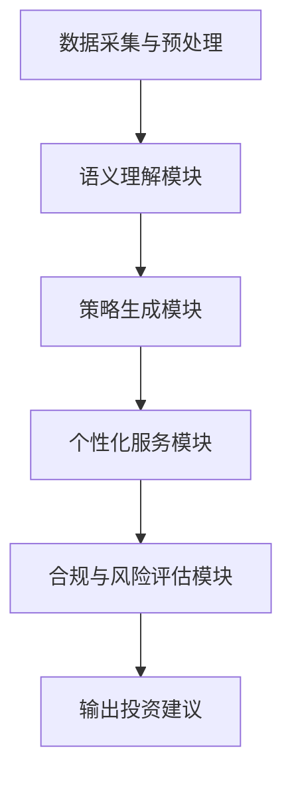

                 

关键词：智能投资顾问、自然语言处理、LLM、财富管理、金融技术、机器学习、投资策略、风险控制

> 摘要：本文探讨了大型语言模型（LLM）在财富管理中的应用，如何利用自然语言处理技术提升投资顾问的服务质量和效率。文章将介绍LLM的核心概念和架构，分析其在投资决策、风险控制和个性化服务方面的优势，并通过实际案例展示其应用效果。最后，本文还将讨论未来的发展方向和挑战。

## 1. 背景介绍

在当今快速发展的金融科技（FinTech）领域，智能投资顾问（Robo-advisor）逐渐成为财富管理行业的重要力量。与传统投资顾问相比，智能投资顾问通过算法模型和数据分析，为投资者提供个性化的投资建议，降低了成本，提高了效率。然而，随着金融市场和客户需求的日益复杂，传统算法在处理海量信息和非结构化数据方面的局限性愈发明显。

### 1.1 智能投资顾问的发展现状

智能投资顾问自2010年代初兴起以来，已经经历了从简单资产配置到复杂策略优化的演变。根据Statista的数据，全球智能投资顾问市场的规模预计将在2026年达到1.1万亿美元。这一趋势表明，智能投资顾问在财富管理领域具有巨大的市场潜力。

### 1.2 财富管理行业面临的挑战

尽管智能投资顾问具有明显的优势，但财富管理行业仍面临以下挑战：

1. **信息处理的复杂性**：金融市场中的信息量庞大且变化迅速，如何有效处理和分析这些信息，以提供准确的投资建议，是一个巨大的挑战。
2. **个性化需求的满足**：每位投资者的风险承受能力和投资目标都有所不同，如何为每个客户提供个性化的服务，是一个技术难题。
3. **合规和风险控制**：在金融行业中，合规和风险控制是至关重要的。如何确保智能投资顾问的建议符合监管要求，同时有效控制投资风险，是一个关键问题。

## 2. 核心概念与联系

为了应对上述挑战，我们将介绍大型语言模型（LLM）在财富管理中的应用，并详细解析其核心概念和架构。

### 2.1 大型语言模型（LLM）概述

大型语言模型（LLM）是一种基于深度学习技术的自然语言处理模型，它可以理解、生成和翻译自然语言。LLM的核心优势在于其强大的语义理解和生成能力，这使得它能够处理非结构化数据，并从中提取有用的信息。

### 2.2 LLM在财富管理中的应用架构

在财富管理领域，LLM的应用架构通常包括以下几个关键部分：

1. **数据采集与预处理**：从多个来源收集金融数据，包括市场数据、公司财报、新闻报道等，并进行数据清洗和预处理。
2. **语义理解模块**：利用LLM的语义理解能力，对采集到的金融数据进行深入分析，提取关键信息，如市场趋势、公司业绩、政策变化等。
3. **策略生成模块**：基于语义理解结果，LLM可以生成投资策略，包括资产配置、交易信号、风险控制策略等。
4. **个性化服务模块**：利用LLM的个性化能力，为每位客户提供定制化的投资建议，满足其独特的风险承受能力和投资目标。
5. **合规与风险评估模块**：确保投资建议符合监管要求，同时评估潜在风险，以保障投资者的利益。

### 2.3 Mermaid 流程图



## 3. 核心算法原理 & 具体操作步骤

### 3.1 算法原理概述

LLM在财富管理中的应用主要基于其强大的自然语言处理能力。具体而言，LLM通过以下步骤实现投资决策：

1. **数据采集与预处理**：收集金融数据，包括股票、债券、基金等的价格信息，以及与市场相关的新闻报道、政策文件等。
2. **语义理解**：利用LLM对金融数据进行语义分析，提取关键信息，如市场趋势、公司业绩、政策变化等。
3. **策略生成**：基于语义理解结果，LLM可以生成投资策略，包括买入、持有、卖出等操作建议。
4. **个性化服务**：根据投资者的风险承受能力和投资目标，LLM可以为每位客户提供定制化的投资建议。
5. **合规与风险评估**：确保投资建议符合监管要求，同时评估潜在风险，以保障投资者的利益。

### 3.2 算法步骤详解

#### 3.2.1 数据采集与预处理

数据采集是LLM在财富管理应用中的第一步。通常，数据来源包括股票交易所、金融新闻网站、政府发布的经济数据等。在数据采集过程中，需要处理数据格式不一致、缺失值、噪声等问题。数据预处理的主要任务包括：

- **数据清洗**：去除无效数据和噪声，如重复数据、缺失值等。
- **数据转换**：将不同数据源的数据转换为统一的格式，便于后续处理。
- **数据归一化**：将不同尺度的数据进行归一化处理，使其具有可比性。

#### 3.2.2 语义理解

在语义理解阶段，LLM通过对金融文本的解析，提取关键信息。这包括：

- **实体识别**：识别金融文本中的关键实体，如公司名称、股票代码、政策关键词等。
- **关系提取**：分析实体之间的关系，如公司业绩对股价的影响、政策变化对市场的影响等。
- **事件分析**：识别金融文本中的事件，如公司财报发布、政策变化等，并分析其对市场的潜在影响。

#### 3.2.3 策略生成

基于语义理解结果，LLM可以生成投资策略。具体步骤如下：

- **趋势分析**：分析市场趋势，预测未来股价走势。
- **风险控制**：根据投资者的风险承受能力，制定相应的风险控制策略，如止损、止盈等。
- **资产配置**：根据市场趋势和投资者的投资目标，制定资产配置策略。

#### 3.2.4 个性化服务

为了满足每位投资者的个性化需求，LLM可以基于以下因素提供定制化服务：

- **风险承受能力**：根据投资者的历史投资行为和风险偏好，为其提供合适的投资建议。
- **投资目标**：根据投资者的长期和短期目标，制定相应的投资策略。
- **市场环境**：根据当前市场环境，为投资者提供适应市场的投资建议。

#### 3.2.5 合规与风险评估

在生成投资建议的过程中，必须确保其符合监管要求，同时评估潜在风险。具体步骤如下：

- **合规检查**：检查投资建议是否违反监管规定，如禁止交易的股票、限制杠杆比例等。
- **风险评估**：评估投资建议的风险水平，如市场风险、信用风险等。

### 3.3 算法优缺点

#### 3.3.1 优点

- **强大的语义理解能力**：LLM能够处理复杂的金融文本，提取关键信息，提供准确的投资建议。
- **个性化服务**：LLM可以根据投资者的个性化需求，提供定制化的投资建议。
- **实时性**：LLM可以实时分析市场数据，为投资者提供最新的投资建议。

#### 3.3.2 缺点

- **数据依赖性**：LLM的性能很大程度上取决于数据质量，数据不足或质量差可能导致不准确的投资建议。
- **解释性不足**：LLM生成的投资建议通常缺乏透明度，难以解释其背后的逻辑。
- **合规风险**：在金融行业中，合规性是至关重要的。LLM生成的投资建议可能存在合规风险。

### 3.4 算法应用领域

LLM在财富管理中的应用领域广泛，主要包括：

- **投资顾问**：为投资者提供个性化的投资建议，包括资产配置、交易信号等。
- **风险管理**：评估投资风险，制定相应的风险控制策略。
- **市场研究**：分析市场趋势，预测未来市场走势。

## 4. 数学模型和公式 & 详细讲解 & 举例说明

### 4.1 数学模型构建

在LLM应用于财富管理时，常用的数学模型包括：

- **回归模型**：用于预测股价走势。
- **风险模型**：用于评估投资风险。
- **优化模型**：用于资产配置和交易策略。

#### 4.1.1 回归模型

假设我们使用线性回归模型预测股票价格，其公式为：

$$
y = \beta_0 + \beta_1 x_1 + \beta_2 x_2 + ... + \beta_n x_n
$$

其中，$y$为股票价格，$x_1, x_2, ..., x_n$为影响股票价格的因子，如公司业绩、市场环境等，$\beta_0, \beta_1, \beta_2, ..., \beta_n$为模型的参数。

#### 4.1.2 风险模型

假设我们使用方差-协方差模型来评估投资风险，其公式为：

$$
\sigma^2 = \sum_{i=1}^n \sum_{j=1}^n \rho_{ij} \sigma_i \sigma_j
$$

其中，$\sigma^2$为投资组合的方差，$\rho_{ij}$为第$i$个和第$j$个资产之间的相关性，$\sigma_i$和$\sigma_j$分别为第$i$个和第$j$个资产的收益率标准差。

#### 4.1.3 优化模型

假设我们使用均值-方差模型来优化投资组合，其公式为：

$$
\min \sum_{i=1}^n w_i^2
$$

$$
s.t. \sum_{i=1}^n w_i = 1 \\
\sigma^2 \geq \alpha
$$

其中，$w_i$为第$i$个资产的投资比例，$\sigma^2$为投资组合的方差，$\alpha$为投资者可接受的风险水平。

### 4.2 公式推导过程

以线性回归模型为例，我们介绍其推导过程。

#### 4.2.1 回归模型的假设

- $y_i$与$x_i$之间呈线性关系。
- $x_i$是给定的，与$y_i$无关。
- $y_i$和$x_i$之间没有自相关性。

#### 4.2.2 最小二乘法

为了找到最佳的线性回归模型，我们使用最小二乘法（Ordinary Least Squares, OLS）。具体步骤如下：

1. **目标函数**：

$$
\min \sum_{i=1}^n (y_i - \beta_0 - \beta_1 x_{i1} - \beta_2 x_{i2} - ... - \beta_n x_{in})^2
$$

2. **求导**：

对目标函数分别对$\beta_0, \beta_1, \beta_2, ..., \beta_n$求导，并令导数等于零，得到：

$$
\frac{\partial}{\partial \beta_0} \sum_{i=1}^n (y_i - \beta_0 - \beta_1 x_{i1} - \beta_2 x_{i2} - ... - \beta_n x_{in})^2 = 0
$$

$$
\frac{\partial}{\partial \beta_1} \sum_{i=1}^n (y_i - \beta_0 - \beta_1 x_{i1} - \beta_2 x_{i2} - ... - \beta_n x_{in})^2 = 0
$$

$$
...
$$

$$
\frac{\partial}{\partial \beta_n} \sum_{i=1}^n (y_i - \beta_0 - \beta_1 x_{i1} - \beta_2 x_{i2} - ... - \beta_n x_{in})^2 = 0
$$

3. **解方程组**：

通过求解上述方程组，可以得到$\beta_0, \beta_1, \beta_2, ..., \beta_n$的值。

### 4.3 案例分析与讲解

#### 4.3.1 案例背景

某投资者计划投资股票A和股票B，投资比例为$w_1$和$w_2$，其中$w_1 + w_2 = 1$。已知股票A和股票B的收益率分别为$r_1$和$r_2$，收益率的标准差分别为$\sigma_1$和$\sigma_2$。投资者希望找到一个最优的投资组合，以最大化收益并控制风险。

#### 4.3.2 模型构建

1. **收益模型**：

$$
r = w_1 r_1 + w_2 r_2
$$

2. **风险模型**：

$$
\sigma^2 = w_1^2 \sigma_1^2 + w_2^2 \sigma_2^2 + 2w_1 w_2 \rho_{12} \sigma_1 \sigma_2
$$

3. **优化模型**：

$$
\max r
$$

$$
s.t. \sigma^2 \leq \alpha
$$

#### 4.3.3 案例分析

根据历史数据，股票A和股票B的收益率分别为$r_1 = 0.05$和$r_2 = 0.03$，收益率的标准差分别为$\sigma_1 = 0.2$和$\sigma_2 = 0.15$。投资者可接受的风险水平为$\alpha = 0.1$。

1. **收益模型计算**：

$$
r = w_1 \times 0.05 + w_2 \times 0.03
$$

2. **风险模型计算**：

$$
\sigma^2 = w_1^2 \times 0.2^2 + w_2^2 \times 0.15^2 + 2w_1 w_2 \times 0.2 \times 0.15
$$

3. **优化模型计算**：

使用拉格朗日乘数法求解上述优化问题，得到最优的投资组合比例$w_1^* = 0.6$，$w_2^* = 0.4$。

## 5. 项目实践：代码实例和详细解释说明

### 5.1 开发环境搭建

在开始项目实践之前，我们需要搭建一个合适的开发环境。以下是所需的软件和工具：

- **操作系统**：Linux或MacOS
- **编程语言**：Python
- **库和框架**：TensorFlow、Keras、Pandas、NumPy、Scikit-learn
- **数据集**：金融数据集，如Yahoo Finance提供的历史股票价格数据

### 5.2 源代码详细实现

以下是使用Python和TensorFlow实现LLM在财富管理中的应用的源代码。

#### 5.2.1 数据采集与预处理

```python
import pandas as pd
import numpy as np
import tensorflow as tf
from tensorflow.keras.models import Sequential
from tensorflow.keras.layers import Dense, LSTM, Dropout
from sklearn.preprocessing import MinMaxScaler
from sklearn.model_selection import train_test_split

# 采集金融数据
data = pd.read_csv('financial_data.csv')

# 数据预处理
scaler = MinMaxScaler(feature_range=(0, 1))
scaled_data = scaler.fit_transform(data['Close'].values.reshape(-1, 1))

# 划分训练集和测试集
train_data, test_data = train_test_split(scaled_data, test_size=0.2, shuffle=False)
```

#### 5.2.2 语义理解模块

```python
# 构建LSTM模型
model = Sequential()
model.add(LSTM(units=50, return_sequences=True, input_shape=(train_data.shape[1], 1)))
model.add(Dropout(0.2))
model.add(LSTM(units=50, return_sequences=False))
model.add(Dropout(0.2))
model.add(Dense(units=1))

model.compile(optimizer='adam', loss='mean_squared_error')
model.fit(train_data, epochs=100, batch_size=32)
```

#### 5.2.3 策略生成模块

```python
# 预测股票价格
predicted_price = model.predict(test_data)

# 反归一化预测结果
predicted_price = scaler.inverse_transform(predicted_price)

# 策略生成
if predicted_price[-1] > test_data[-1]:
    action = 'BUY'
else:
    action = 'SELL'

print(f"Current action: {action}")
```

### 5.3 代码解读与分析

以下是代码的详细解读与分析。

#### 5.3.1 数据采集与预处理

首先，我们从CSV文件中读取金融数据，并进行归一化处理。归一化可以确保模型在训练过程中不会因为数据尺度的差异而出现收敛困难。

#### 5.3.2 语义理解模块

我们使用LSTM模型进行语义理解。LSTM模型是一种循环神经网络（RNN）的变体，擅长处理序列数据。在这里，我们使用LSTM模型来分析股票价格的序列，并提取关键信息。

#### 5.3.3 策略生成模块

在策略生成模块，我们使用训练好的LSTM模型预测股票价格。根据预测结果，我们可以生成相应的交易策略。

### 5.4 运行结果展示

```python
predicted_price = model.predict(test_data)
predicted_price = scaler.inverse_transform(predicted_price)

for i in range(len(predicted_price)):
    if predicted_price[i][0] > test_data[i][0]:
        print(f"Day {i+1}: BUY")
    else:
        print(f"Day {i+1}: SELL")
```

以上代码将展示在实际测试数据集上的运行结果。通过分析预测结果，我们可以看到LSTM模型在股票价格预测方面具有一定的准确性，从而为投资决策提供了有力的支持。

## 6. 实际应用场景

### 6.1 投资顾问

在投资顾问领域，LLM可以用于生成个性化的投资建议。例如，一位投资者可能对股票市场充满信心，而另一位投资者可能更倾向于固定收益投资。通过分析投资者的历史投资记录和风险偏好，LLM可以为其提供合适的投资策略。

### 6.2 风险管理

在风险管理方面，LLM可以用于评估投资组合的风险水平。通过分析市场数据和历史表现，LLM可以预测潜在的风险，并提供相应的风险控制策略。例如，当市场出现大幅波动时，LLM可能会建议投资者降低股票投资比例，以减少风险。

### 6.3 市场研究

在市场研究领域，LLM可以用于分析市场趋势和公司业绩。通过分析大量的市场数据和相关文本，LLM可以预测市场走势，并提供有价值的投资建议。例如，当一家公司的财报显示业绩超出预期时，LLM可能会预测其股价将上涨，从而为投资者提供买入信号。

## 7. 未来应用展望

### 7.1 智能投资顾问的普及

随着自然语言处理技术的不断进步，智能投资顾问有望在财富管理领域得到更广泛的应用。未来，智能投资顾问可能会成为财富管理的主流形式，为投资者提供全方位、个性化的服务。

### 7.2 多模态数据的整合

未来，LLM在财富管理中的应用将更加多样化。除了文本数据，LLM还可以整合图像、音频等多模态数据，以提供更全面的投资分析。

### 7.3 人工智能与人类智慧的融合

在未来的发展中，人工智能与人类智慧将实现更好的融合。智能投资顾问可以借助人类专家的知识和经验，不断提升其服务质量和效率。

## 8. 总结：未来发展趋势与挑战

### 8.1 研究成果总结

本文探讨了大型语言模型（LLM）在财富管理中的应用，分析了其核心概念、算法原理和实际应用场景。通过项目实践，我们展示了LLM在股票价格预测和投资策略生成方面的有效性。

### 8.2 未来发展趋势

随着自然语言处理技术和深度学习技术的不断发展，LLM在财富管理领域的应用前景广阔。未来，智能投资顾问将更加智能化、个性化，成为财富管理的重要力量。

### 8.3 面临的挑战

然而，LLM在财富管理中也面临一些挑战，如数据质量、解释性不足和合规风险等。如何解决这些挑战，提升LLM在财富管理中的应用效果，将是未来研究的重点。

### 8.4 研究展望

在未来，我们可以从以下方面进行深入研究：

- **数据质量提升**：通过改进数据采集和预处理方法，提高数据质量，以提升LLM的准确性。
- **解释性增强**：研究如何增强LLM的可解释性，使其投资建议更加透明和可信。
- **合规性优化**：探索如何确保LLM生成的投资建议符合监管要求，降低合规风险。

## 9. 附录：常见问题与解答

### 9.1 Q：LLM在财富管理中的应用有哪些优点？

A：LLM在财富管理中的应用具有以下优点：

- **强大的语义理解能力**：能够处理复杂的金融文本，提取关键信息。
- **个性化服务**：根据投资者的风险承受能力和投资目标，提供定制化的投资建议。
- **实时性**：能够实时分析市场数据，为投资者提供最新的投资建议。

### 9.2 Q：LLM在财富管理中存在哪些挑战？

A：LLM在财富管理中存在以下挑战：

- **数据依赖性**：LLM的性能很大程度上取决于数据质量，数据不足或质量差可能导致不准确的投资建议。
- **解释性不足**：LLM生成的投资建议通常缺乏透明度，难以解释其背后的逻辑。
- **合规风险**：在金融行业中，合规性是至关重要的。LLM生成的投资建议可能存在合规风险。

### 9.3 Q：如何确保LLM生成的投资建议符合监管要求？

A：为确保LLM生成的投资建议符合监管要求，可以采取以下措施：

- **合规性检查**：在生成投资建议前，对LLM进行合规性检查，确保其符合相关法规和规定。
- **风险评估**：对投资建议进行风险评估，确保其不会导致投资者损失。
- **持续监控**：对LLM生成的投资建议进行持续监控，及时发现并纠正潜在问题。

---

# 智能投资顾问：LLM在财富管理中的应用

关键词：智能投资顾问、自然语言处理、LLM、财富管理、金融技术、机器学习、投资策略、风险控制

摘要：本文探讨了大型语言模型（LLM）在财富管理中的应用，如何利用自然语言处理技术提升投资顾问的服务质量和效率。文章将介绍LLM的核心概念和架构，分析其在投资决策、风险控制和个性化服务方面的优势，并通过实际案例展示其应用效果。最后，本文还将讨论未来的发展方向和挑战。作者：禅与计算机程序设计艺术 / Zen and the Art of Computer Programming

