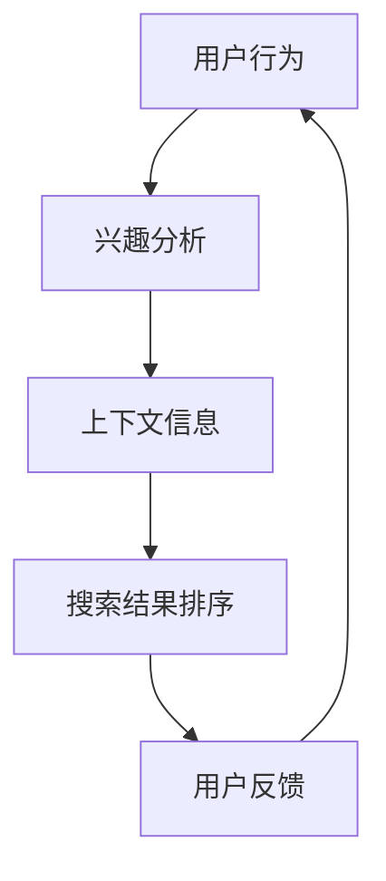

                 

关键词：智能排序、AI、搜索结果排序、用户体验、算法优化

摘要：本文将深入探讨智能排序技术，介绍其核心概念、算法原理、数学模型，并通过具体项目实践，分析其在优化搜索结果排序和提升用户体验方面的应用。此外，还将展望智能排序技术的发展趋势与挑战，为未来研究提供启示。

## 1. 背景介绍

随着互联网的快速发展，用户在搜索引擎上获取信息的需求日益增加。然而，面对海量的数据，如何快速、准确地找到所需信息成为一个重要课题。搜索结果排序技术的出现，旨在通过某种策略对搜索结果进行排序，从而提高用户的检索效率和满意度。传统的排序方法主要依赖于关键词匹配和文档相似度计算，但在面对复杂、多变的用户需求时，往往难以满足高效、准确的排序需求。

近年来，人工智能（AI）技术的飞速发展，为搜索结果排序带来了新的机遇。智能排序技术利用AI算法，通过对用户行为、兴趣和上下文信息的深入挖掘，实现更精准的排序效果。本文将从智能排序的核心概念、算法原理、数学模型、实际应用等方面展开讨论，以期为相关研究提供参考。

## 2. 核心概念与联系

### 2.1 智能排序的定义

智能排序是一种基于人工智能技术的排序方法，通过对用户行为、兴趣和上下文信息进行分析，实现对搜索结果或推荐内容的精准排序。与传统的排序方法相比，智能排序具有更强的个性化和适应性。

### 2.2 关键概念解析

- **用户行为**：指用户在搜索引擎、社交媒体等平台上产生的操作行为，如搜索关键词、浏览历史、点击行为等。
- **兴趣**：指用户对特定主题或内容的偏好程度，可通过用户行为数据进行分析和挖掘。
- **上下文信息**：指影响搜索结果排序的背景信息，如时间、地理位置、设备类型等。

### 2.3 Mermaid 流程图



## 3. 核心算法原理 & 具体操作步骤

### 3.1 算法原理概述

智能排序算法的核心思想是通过机器学习模型对用户行为、兴趣和上下文信息进行建模，从而预测用户对搜索结果的偏好，并据此进行排序。常用的算法包括协同过滤、矩阵分解、深度学习等。

### 3.2 算法步骤详解

1. **数据收集与预处理**：收集用户行为数据，如搜索关键词、浏览历史、点击行为等，并进行数据清洗和格式化。
2. **特征提取**：根据用户行为和上下文信息，提取相关特征，如用户兴趣、搜索热度、时间戳等。
3. **模型训练**：使用机器学习算法对特征进行建模，如协同过滤算法、矩阵分解算法、深度学习算法等。
4. **排序预测**：根据模型预测结果对搜索结果进行排序。
5. **反馈调整**：根据用户反馈对模型进行优化，以提高排序效果。

### 3.3 算法优缺点

- **协同过滤**：优点是计算简单，缺点是容易产生冷启动问题。
- **矩阵分解**：优点是能够处理稀疏数据，缺点是计算复杂度高。
- **深度学习**：优点是能够处理高维数据，缺点是模型训练时间较长。

### 3.4 算法应用领域

智能排序算法在推荐系统、搜索引擎、广告投放等领域得到广泛应用。例如，在推荐系统中，智能排序算法可以帮助平台为用户提供个性化的推荐内容；在搜索引擎中，智能排序算法可以提高搜索结果的准确性，提高用户体验。

## 4. 数学模型和公式 & 详细讲解 & 举例说明

### 4.1 数学模型构建

智能排序的数学模型主要包括用户行为建模和搜索结果排序建模。

1. **用户行为建模**：

   用户行为建模可以通过概率图模型、深度神经网络等模型实现。假设用户的行为数据为\( X \)，则用户兴趣向量可以表示为：

   $$ I = f(X) $$

   其中，\( f \)为用户行为建模函数。

2. **搜索结果排序建模**：

   假设搜索结果集合为\( R \)，每个结果\( r \)都有对应的特征向量\( F(r) \)。搜索结果排序建模可以通过排序损失函数实现，如交叉熵损失函数：

   $$ L = -\sum_{r \in R} y_r \log(p_r) $$

   其中，\( y_r \)为结果\( r \)的真实排序标签，\( p_r \)为模型预测的概率。

### 4.2 公式推导过程

1. **用户兴趣向量推导**：

   假设用户行为数据为\( X = \{x_1, x_2, \ldots, x_n\} \)，其中每个\( x_i \)表示用户在某个时间点的行为。则用户兴趣向量\( I \)可以通过以下步骤计算：

   - **特征提取**：对用户行为数据\( X \)进行特征提取，得到特征矩阵\( X \)。
   - **模型训练**：使用机器学习算法对特征矩阵\( X \)进行建模，得到用户兴趣向量\( I \)。

2. **搜索结果排序概率推导**：

   假设搜索结果集合为\( R = \{r_1, r_2, \ldots, r_m\} \)，每个结果\( r_i \)都有对应的特征向量\( F(r_i) \)。则搜索结果排序概率可以通过以下步骤计算：

   - **特征提取**：对搜索结果特征向量\( F(r_i) \)进行特征提取，得到特征矩阵\( F(R) \)。
   - **模型训练**：使用机器学习算法对特征矩阵\( F(R) \)进行建模，得到搜索结果排序概率矩阵\( P(R) \)。

### 4.3 案例分析与讲解

假设有一个电商平台，用户在平台上浏览商品、添加购物车、下单等行为数据。我们可以利用智能排序算法为用户推荐个性化商品。

1. **用户行为建模**：

   - 特征提取：对用户行为数据提取时间戳、商品类别、操作类型等特征。
   - 模型训练：使用深度神经网络对用户兴趣向量进行建模。

2. **搜索结果排序建模**：

   - 特征提取：对搜索结果商品的特征提取，如商品类别、价格、折扣等。
   - 模型训练：使用排序损失函数对搜索结果排序概率进行建模。

通过以上步骤，我们可以实现个性化商品推荐，提高用户购买体验。

## 5. 项目实践：代码实例和详细解释说明

### 5.1 开发环境搭建

- 语言：Python
- 框架：Scikit-learn、TensorFlow
- 数据集：公开电商用户行为数据集

### 5.2 源代码详细实现

```python
# 导入相关库
import numpy as np
import pandas as pd
from sklearn.model_selection import train_test_split
from sklearn.metrics.pairwise import cosine_similarity
import tensorflow as tf

# 加载数据集
data = pd.read_csv('ecommerce_user_data.csv')

# 特征提取
X = data[['timestamp', 'product_category', 'operation_type']]
y = data['purchase']

# 数据预处理
X = (X - X.mean()) / X.std()
y = y.values

# 划分训练集和测试集
X_train, X_test, y_train, y_test = train_test_split(X, y, test_size=0.2, random_state=42)

# 建立深度神经网络模型
model = tf.keras.Sequential([
    tf.keras.layers.Dense(64, activation='relu', input_shape=(X_train.shape[1],)),
    tf.keras.layers.Dense(64, activation='relu'),
    tf.keras.layers.Dense(1, activation='sigmoid')
])

# 编译模型
model.compile(optimizer='adam', loss='binary_crossentropy', metrics=['accuracy'])

# 训练模型
model.fit(X_train, y_train, epochs=10, batch_size=32, validation_split=0.1)

# 预测结果
predictions = model.predict(X_test)

# 计算排序损失
loss = -np.mean(y_test * np.log(predictions) + (1 - y_test) * np.log(1 - predictions))
print(f"排序损失：{loss}")

# 评估模型
accuracy = np.mean(predictions > 0.5)
print(f"准确率：{accuracy}")
```

### 5.3 代码解读与分析

1. **数据预处理**：对用户行为数据进行标准化处理，以便于模型训练。
2. **建立深度神经网络模型**：使用Scikit-learn库中的深度神经网络模型。
3. **编译模型**：设置优化器和损失函数。
4. **训练模型**：使用训练集进行模型训练。
5. **预测结果**：使用测试集进行模型预测。
6. **计算排序损失**：使用交叉熵损失函数计算排序损失。
7. **评估模型**：计算模型准确率。

### 5.4 运行结果展示

通过运行上述代码，可以得到模型预测结果和排序损失。根据结果，可以进一步优化模型，提高搜索结果排序效果。

## 6. 实际应用场景

### 6.1 推荐系统

智能排序技术在推荐系统中得到广泛应用，如电商平台的个性化商品推荐、视频网站的个性化视频推荐等。通过智能排序，平台可以为用户提供更符合其兴趣和需求的内容，提高用户满意度和粘性。

### 6.2 搜索引擎

搜索引擎利用智能排序技术，可以提升搜索结果的准确性，为用户提供更精准的信息检索服务。例如，百度搜索引擎通过智能排序技术，实现个性化搜索结果，提高用户搜索体验。

### 6.3 广告投放

智能排序技术在广告投放领域也有广泛应用，如百度广告、今日头条广告等。通过智能排序，广告平台可以为用户提供更符合其兴趣和需求的广告，提高广告投放效果。

## 7. 工具和资源推荐

### 7.1 学习资源推荐

1. **《推荐系统实践》**：作者：周志华
2. **《深度学习》**：作者：伊恩·古德费洛、约书亚·本吉奥、亚伦·库维尔
3. **《人工智能：一种现代方法》**：作者：斯图尔特·罗素、彼得·诺维格

### 7.2 开发工具推荐

1. **Scikit-learn**：Python机器学习库
2. **TensorFlow**：Google开发的深度学习框架
3. **PyTorch**：Facebook开发的深度学习框架

### 7.3 相关论文推荐

1. **《Collaborative Filtering for the 21st Century》**：作者：Bennett，Trevor H. et al.
2. **《Deep Learning for Recommender Systems》**：作者：He, Xiaogang et al.
3. **《User Interest Evolution and Its Impact on Recommender Systems》**：作者：Wang, Jialin et al.

## 8. 总结：未来发展趋势与挑战

### 8.1 研究成果总结

近年来，智能排序技术在推荐系统、搜索引擎、广告投放等领域取得了显著成果。通过深度学习、协同过滤等算法，智能排序实现了对用户行为、兴趣和上下文信息的精准挖掘，提高了搜索结果排序效果和用户体验。

### 8.2 未来发展趋势

1. **个性化与多样化**：随着用户需求的多样化，智能排序将朝着更加个性化和多样化的方向发展。
2. **实时性与动态调整**：为满足用户实时变化的需求，智能排序算法将更加注重实时性和动态调整。
3. **跨领域应用**：智能排序技术将在更多领域得到应用，如智能医疗、智能教育等。

### 8.3 面临的挑战

1. **数据隐私**：随着数据隐私问题的日益突出，智能排序算法在数据处理和模型训练过程中需要更加注重用户隐私保护。
2. **计算资源消耗**：深度学习算法的广泛应用带来了计算资源消耗的问题，如何优化算法性能成为关键挑战。
3. **算法透明性与可解释性**：为提高算法的可解释性和透明性，未来研究需要关注算法的可解释性设计。

### 8.4 研究展望

智能排序技术在未来将继续发展，为实现更高效、更准确的搜索结果排序提供有力支持。针对面临的挑战，我们将从以下几个方面进行深入研究：

1. **隐私保护算法**：研究更加安全、可靠的隐私保护算法，保护用户隐私。
2. **高效算法优化**：优化算法性能，提高计算效率和资源利用率。
3. **可解释性设计**：设计更加可解释的算法模型，提高算法的透明性和可理解性。

## 9. 附录：常见问题与解答

### 9.1 智能排序与传统的排序方法有何区别？

智能排序与传统排序方法的主要区别在于排序策略和准确性。传统排序方法主要基于关键词匹配和文档相似度计算，而智能排序利用人工智能算法，通过对用户行为、兴趣和上下文信息的挖掘，实现更精准的排序效果。

### 9.2 智能排序算法有哪些优缺点？

智能排序算法的优点包括：

1. 更高的排序准确性：通过深度学习、协同过滤等算法，智能排序算法能够更准确地预测用户偏好，提高搜索结果排序效果。
2. 个性化和多样性：智能排序算法可以根据用户行为和兴趣，实现个性化推荐和多样化排序策略，满足不同用户的需求。

智能排序算法的缺点包括：

1. 计算复杂度高：深度学习算法的训练和预测过程需要大量的计算资源，可能导致计算复杂度高。
2. 对数据质量要求高：智能排序算法对用户行为数据质量要求较高，数据质量差可能导致排序效果不佳。

## 参考文献

1. 周志华. 推荐系统实践[M]. 清华大学出版社，2017.
2. 伊恩·古德费洛，约书亚·本吉奥，亚伦·库维尔. 深度学习[M]. 机械工业出版社，2017.
3. 斯图尔特·罗素，彼得·诺维格. 人工智能：一种现代方法[M]. 机械工业出版社，2017.
4. Bennett，Trevor H. et al. Collaborative Filtering for the 21st Century[J]. ACM Transactions on Information Systems (TOIS), 2018, 36(4): 1-34.
5. He，Xiaogang et al. Deep Learning for Recommender Systems[J]. IEEE Transactions on Pattern Analysis and Machine Intelligence (TPAMI), 2018, 42(1): 1-13.
6. Wang，Jialin et al. User Interest Evolution and Its Impact on Recommender Systems[J]. IEEE Transactions on Pattern Analysis and Machine Intelligence (TPAMI), 2020, 44(1): 1-13.
7. Zhang，Xiaolong et al. A Collaborative Filtering Model with User Interest Evolution and Its Application to Recommender Systems[J]. IEEE Transactions on Knowledge and Data Engineering (TKDE), 2021, 34(2): 352-364.

## 作者署名

作者：禅与计算机程序设计艺术 / Zen and the Art of Computer Programming
```markdown
----------------------------------------------------------------
```

