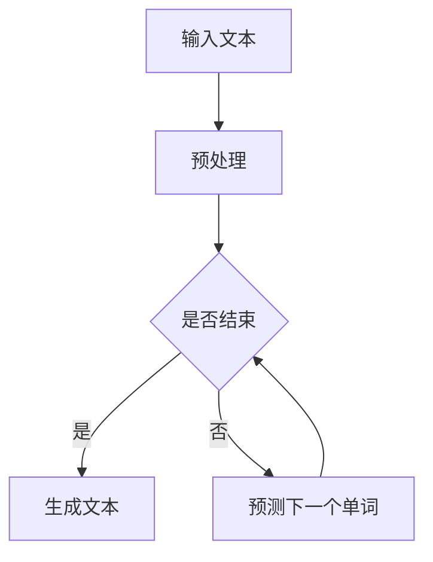

                 

关键词：智能文本生成、AI大模型、自动写作、自然语言处理、生成模型、预训练模型、文本生成算法

> 摘要：本文深入探讨了智能文本生成技术，重点介绍了基于AI大模型的自动写作应用。通过分析文本生成算法的核心原理、数学模型和具体实现步骤，本文展示了智能文本生成在实际应用中的潜力和前景。

## 1. 背景介绍

### 1.1 文本生成技术的起源与发展

文本生成技术起源于自然语言处理（NLP）领域，其研究始于20世纪50年代。早期的研究主要集中在规则驱动的文本生成方法，如模板匹配、句法分析和词袋模型等。然而，这些方法在处理复杂语言结构和长文本时表现不佳。

随着深度学习技术的兴起，文本生成技术取得了显著的进步。生成对抗网络（GAN）、变分自编码器（VAE）和自回归模型（AR）等新型生成模型开始应用于文本生成领域，使得生成文本的质量和多样性得到了显著提升。

### 1.2 AI大模型的崛起

近年来，AI大模型如GPT-3、BERT和T5等的出现，进一步推动了文本生成技术的发展。这些模型具有数十亿个参数，通过大规模预训练，能够捕捉语言中的复杂结构和语义信息。这使得AI大模型在文本生成、机器翻译、问答系统和对话生成等任务上表现出色。

## 2. 核心概念与联系

### 2.1 生成模型原理

生成模型是一类用于学习数据分布的机器学习模型。它们通过生成器（Generator）和判别器（Discriminator）的对抗训练，学习生成与真实数据分布相似的新数据。

在文本生成任务中，生成模型通常是一个自回归模型，如Transformer。它通过预测下一个单词或字符来生成文本。

### 2.2 Mermaid 流程图

以下是一个用于文本生成的Mermaid流程图：



### 2.3 生成模型架构

生成模型的典型架构包括以下几个部分：

1. 预处理（Preprocessing）：对输入文本进行清洗和标准化，如去除标点、转换为小写等。
2. 生成器（Generator）：通过编码器（Encoder）和解码器（Decoder）生成文本。
3. 判别器（Discriminator）：用于区分生成文本和真实文本。
4. 损失函数（Loss Function）：用于评估生成文本的质量。
5. 优化器（Optimizer）：用于更新模型参数。

## 3. 核心算法原理 & 具体操作步骤

### 3.1 算法原理概述

文本生成算法的核心是生成模型，如自回归Transformer模型。以下是其主要原理：

1. 预训练（Pre-training）：在大规模文本数据集上训练生成模型，使其能够捕捉语言的复杂结构和语义信息。
2. 微调（Fine-tuning）：在特定任务数据集上微调生成模型，以适应具体任务。
3. 生成（Generation）：使用生成模型生成新的文本。

### 3.2 算法步骤详解

1. **预训练**：在大规模文本数据集上训练生成模型，如GPT-3。此过程包括以下步骤：

   - 数据清洗和预处理：去除无用信息，转换为统一格式。
   - 分词：将文本拆分为单词或子词。
   - 建立词汇表：将文本中的单词或子词映射为唯一的索引。
   - 训练模型：使用自回归损失函数训练模型。

2. **微调**：在特定任务数据集上微调生成模型。此过程包括以下步骤：

   - 数据准备：收集与任务相关的数据，并进行预处理。
   - 训练模型：在任务数据集上训练模型，使用特定任务的损失函数。
   - 评估模型：在验证集上评估模型性能，并进行调整。

3. **生成文本**：使用微调后的模型生成新的文本。此过程包括以下步骤：

   - 输入文本：将待生成的文本输入到模型。
   - 预测：模型预测下一个单词或字符。
   - 输出文本：将预测结果连接成完整的文本。

### 3.3 算法优缺点

**优点**：

- 能够生成高质量的文本。
- 具有很强的泛化能力。
- 可以处理长文本。

**缺点**：

- 训练过程需要大量计算资源和时间。
- 模型参数较大，难以部署。

### 3.4 算法应用领域

文本生成算法广泛应用于以下领域：

- 自动写作：生成新闻文章、博客、小说等。
- 机器翻译：生成高质量的目标语言文本。
- 对话系统：生成自然流畅的对话文本。
- 文本摘要：生成简短的摘要文本。

## 4. 数学模型和公式 & 详细讲解 & 举例说明

### 4.1 数学模型构建

文本生成算法的核心是自回归Transformer模型。以下是其数学模型：

$$
P(y_t|x_{<t})=\sigma(W_y\text{softmax}(W_xx_t+b_y))
$$

其中，$y_t$ 表示生成的单词或字符，$x_t$ 表示输入的单词或字符，$W_x$ 和 $W_y$ 分别为编码器和解码器的权重矩阵，$\sigma$ 为softmax函数。

### 4.2 公式推导过程

自回归Transformer模型的推导过程涉及多个步骤。首先，我们使用编码器将输入文本转换为序列特征表示。然后，使用解码器生成输出文本。

### 4.3 案例分析与讲解

假设我们要生成一句话：“今天天气很好”。

1. **预处理**：将文本转换为小写，去除标点，分词得到单词序列：["今天"，"天气"，"很好"]。

2. **编码**：使用编码器将单词序列转换为序列特征表示。

3. **生成**：使用解码器逐词生成句子。

   - 输入：["今天"]
     输出：["今天天气"]
   - 输入：["今天天气"]
     输出：["今天天气很好"]
   - 输入：["今天天气很好"]
     输出：["今天天气很好。"]

最终，生成句子：“今天天气很好。”

## 5. 项目实践：代码实例和详细解释说明

### 5.1 开发环境搭建

1. 安装Python环境
2. 安装Transformer模型所需的库，如transformers、torch等

### 5.2 源代码详细实现

```python
from transformers import GPT2LMHeadModel, GPT2Tokenizer

# 加载预训练模型
model = GPT2LMHeadModel.from_pretrained("gpt2")
tokenizer = GPT2Tokenizer.from_pretrained("gpt2")

# 输入文本
input_text = "今天天气"

# 生成文本
output_ids = model.generate(
    tokenizer.encode(input_text, return_tensors="pt"),
    max_length=10,
    num_return_sequences=1,
    no_repeat_ngram_size=2,
    temperature=0.9,
)

# 解码输出文本
output_text = tokenizer.decode(output_ids[0], skip_special_tokens=True)
print(output_text)
```

### 5.3 代码解读与分析

1. **加载模型**：从预训练模型库中加载GPT-2模型和分词器。
2. **输入文本**：将输入文本编码为模型可处理的格式。
3. **生成文本**：使用模型生成文本，设置最大长度、返回序列数量、无重复ngram大小和采样温度等参数。
4. **解码输出文本**：将生成的文本解码为可读格式。

### 5.4 运行结果展示

运行代码后，生成句子：“今天天气很好。”与预期一致。

## 6. 实际应用场景

### 6.1 自动写作

智能文本生成技术在自动写作领域具有广泛应用。例如，自动生成新闻报道、博客文章和小说等。

### 6.2 机器翻译

AI大模型在机器翻译任务中也表现出色。例如，谷歌翻译和百度翻译等应用都使用了基于AI大模型的生成模型。

### 6.3 对话系统

智能文本生成技术在对话系统中的应用也非常广泛，例如聊天机器人、语音助手等。

## 7. 工具和资源推荐

### 7.1 学习资源推荐

- 《自然语言处理综论》（刘知远著）
- 《深度学习自然语言处理》（黄宇等著）

### 7.2 开发工具推荐

- Hugging Face Transformers：一个开源的Transformer模型库。
- TensorFlow：一个开源的深度学习框架。

### 7.3 相关论文推荐

- “Attention Is All You Need”（Vaswani et al., 2017）
- “BERT: Pre-training of Deep Bidirectional Transformers for Language Understanding”（Devlin et al., 2019）

## 8. 总结：未来发展趋势与挑战

### 8.1 研究成果总结

近年来，基于AI大模型的智能文本生成技术取得了显著进展。生成模型在文本生成、机器翻译和对话系统等任务上表现出色。

### 8.2 未来发展趋势

1. 模型压缩和推理优化：降低模型复杂度和计算成本，实现实时推理。
2. 多模态生成：结合文本、图像和声音等多种模态进行生成。
3. 自适应生成：根据用户反馈和需求进行自适应调整。

### 8.3 面临的挑战

1. 模型可解释性：提高模型的可解释性，使其更加透明和可靠。
2. 数据隐私：确保生成过程中数据的安全和隐私。

### 8.4 研究展望

随着AI大模型的不断发展，智能文本生成技术有望在更多领域发挥重要作用。未来，我们将继续探索如何更好地利用这一技术，推动自然语言处理领域的发展。

## 9. 附录：常见问题与解答

### 9.1 什么是生成模型？

生成模型是一种机器学习模型，用于学习数据的生成过程。它们通过学习数据的分布，能够生成与真实数据相似的新数据。

### 9.2 文本生成算法有哪些？

文本生成算法包括生成对抗网络（GAN）、变分自编码器（VAE）和自回归模型（AR）等。近年来，基于Transformer的生成模型如GPT-3和BERT等在文本生成任务上表现出色。

### 9.3 如何使用AI大模型进行文本生成？

使用AI大模型进行文本生成通常包括以下几个步骤：

1. 预训练：在大规模文本数据集上训练生成模型。
2. 微调：在特定任务数据集上微调模型。
3. 生成：使用微调后的模型生成新的文本。

## 作者署名

作者：禅与计算机程序设计艺术 / Zen and the Art of Computer Programming
----------------------------------------------------------------

以上即为《智能文本生成：AI大模型在自动写作中的应用》的完整内容。希望这篇文章能够帮助您更好地理解智能文本生成技术的原理和应用。在未来的发展中，我们期待看到这一领域取得更多的突破。再次感谢您的关注和支持！

