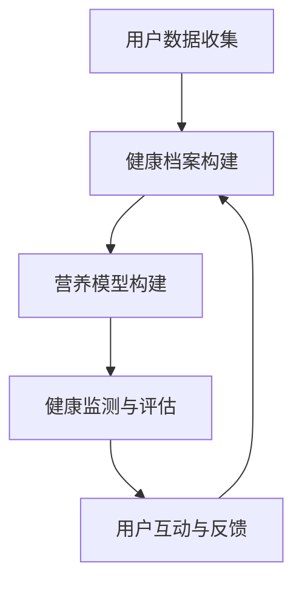

                 

关键词：个性化饮食，营养科学，人工智能，健康监测，大数据分析，科技创业

> 摘要：随着人工智能技术的不断发展，个性化饮食建议逐渐成为营养科学领域的重要应用。本文将探讨智能营养创业的概念、核心技术原理、数学模型及应用实例，旨在为创业者提供科技支持，推动营养健康产业的创新与发展。

## 1. 背景介绍

在当今社会，人们对健康饮食的关注程度日益提高。随着生活水平的提高和健康意识的增强，越来越多的人开始关注自己的饮食结构和营养摄入。然而，由于个体差异、生活方式和健康问题的多样性，传统的饮食建议已难以满足人们的需求。个性化饮食建议作为一种新兴的服务模式，旨在通过科技手段为每个人提供定制化的营养方案。

智能营养创业是指利用人工智能、大数据、生物识别等先进技术，对用户的饮食习惯、健康状况、基因信息等进行全面分析，从而提供个性化的饮食建议。这种创业模式不仅有助于提升用户的健康水平，还能够为创业者带来巨大的市场机会。

### 1.1 市场需求

随着人们对健康饮食的关注度不断提高，个性化饮食建议市场呈现出快速增长的趋势。根据市场研究机构的数据显示，全球健康饮食市场预计将在未来几年内实现高速增长。个性化饮食建议作为其中的一个重要组成部分，具有巨大的市场潜力。

### 1.2 技术背景

人工智能技术的发展为个性化饮食建议提供了强有力的支持。机器学习、深度学习等技术使得计算机能够从海量数据中提取有价值的信息，从而实现个性化的饮食建议。此外，大数据技术和生物识别技术也为个性化饮食建议提供了丰富的数据资源和精准的用户画像。

## 2. 核心概念与联系

### 2.1 个性化饮食建议的概念

个性化饮食建议是指根据用户的个体差异、健康状况、生活习惯等，为其制定具有针对性的饮食方案。这种建议旨在满足用户在营养、口味、健康等方面的需求，提高其生活质量。

### 2.2 核心技术原理

个性化饮食建议的核心技术主要包括以下几个方面：

- **用户数据分析**：通过对用户的饮食习惯、健康状况、基因信息等数据进行收集和分析，构建用户的个性化健康档案。
- **营养模型构建**：利用机器学习、深度学习等技术，建立个性化的营养模型，实现饮食建议的精准化。
- **健康监测与评估**：通过穿戴设备、移动应用等手段，实时监测用户的健康数据，评估其饮食效果，为调整建议提供依据。
- **用户互动与反馈**：通过用户与系统的互动，收集用户反馈，优化饮食建议，提高用户体验。

### 2.3 Mermaid 流程图



## 3. 核心算法原理 & 具体操作步骤

### 3.1 算法原理概述

个性化饮食建议的核心算法主要包括以下几个部分：

- **用户数据分析**：利用统计分析、机器学习等方法，对用户的饮食习惯、健康状况等数据进行挖掘和分析，提取关键特征。
- **营养模型构建**：利用深度学习、决策树等技术，建立个性化的营养模型，实现饮食建议的精准化。
- **健康监测与评估**：利用传感器技术、移动应用等手段，实时监测用户的健康数据，评估饮食效果。
- **用户互动与反馈**：通过用户与系统的互动，收集用户反馈，优化饮食建议。

### 3.2 算法步骤详解

#### 3.2.1 用户数据分析

1. **数据收集**：通过问卷、穿戴设备、移动应用等手段，收集用户的饮食习惯、健康状况、基因信息等数据。
2. **数据预处理**：对收集到的数据进行清洗、去噪、归一化等处理，提高数据质量。
3. **特征提取**：利用统计分析、机器学习等方法，提取用户数据的特征，构建用户的个性化健康档案。

#### 3.2.2 营养模型构建

1. **模型选择**：根据个性化饮食建议的需求，选择合适的机器学习算法，如深度学习、决策树等。
2. **模型训练**：利用用户的健康档案数据，对所选模型进行训练，构建个性化的营养模型。
3. **模型评估**：通过交叉验证、测试集等手段，评估模型的效果，优化模型参数。

#### 3.2.3 健康监测与评估

1. **健康数据收集**：通过穿戴设备、移动应用等手段，实时收集用户的健康数据，如心率、血压、血糖等。
2. **健康数据预处理**：对收集到的健康数据进行清洗、去噪、归一化等处理。
3. **饮食效果评估**：利用营养模型，评估用户的饮食效果，为调整建议提供依据。

#### 3.2.4 用户互动与反馈

1. **互动方式**：通过移动应用、网页、微信等渠道，与用户进行互动，收集用户反馈。
2. **反馈处理**：对用户反馈进行分析，优化饮食建议，提高用户体验。

### 3.3 算法优缺点

#### 优点：

- **个性化**：通过大数据分析和机器学习技术，为用户提供定制化的饮食建议，满足不同用户的需求。
- **实时性**：通过健康监测与评估，实时了解用户的饮食效果，及时调整建议，提高饮食效果。
- **智能化**：利用人工智能技术，实现饮食建议的自动化、智能化，提高工作效率。

#### 缺点：

- **数据依赖**：个性化饮食建议依赖于大量的用户数据，数据质量直接影响建议的准确性。
- **算法复杂性**：个性化饮食建议的算法复杂度较高，需要大量计算资源和时间。

### 3.4 算法应用领域

个性化饮食建议算法主要应用于以下几个方面：

- **健康管理**：为用户提供个性化的饮食建议，帮助用户改善健康状况。
- **健康风险评估**：通过饮食建议，评估用户的健康风险，提供预防措施。
- **营养科普**：向用户传播营养知识，提高用户的健康素养。

## 4. 数学模型和公式 & 详细讲解 & 举例说明

### 4.1 数学模型构建

个性化饮食建议的数学模型主要包括以下几个方面：

#### 4.1.1 用户数据分析模型

用户数据分析模型用于提取用户数据的特征，构建用户的个性化健康档案。常用的模型包括：

- **线性回归**：通过用户的饮食习惯、健康状况等数据，建立线性关系，预测用户的健康状态。
- **决策树**：利用用户的特征，构建决策树模型，实现分类和预测。

#### 4.1.2 营养模型构建

营养模型构建用于为用户提供个性化的饮食建议。常用的模型包括：

- **深度学习**：利用用户的饮食习惯、健康状况等数据，通过神经网络模型，实现饮食建议的生成。
- **决策树**：根据用户的特征，构建决策树模型，实现饮食建议的分类和预测。

### 4.2 公式推导过程

#### 4.2.1 线性回归模型

线性回归模型的基本公式如下：

$$y = \beta_0 + \beta_1 x_1 + \beta_2 x_2 + \ldots + \beta_n x_n$$

其中，$y$ 为因变量，$x_1, x_2, \ldots, x_n$ 为自变量，$\beta_0, \beta_1, \beta_2, \ldots, \beta_n$ 为模型的参数。

推导过程如下：

1. **模型假设**：假设用户数据服从正态分布，即 $y \sim N(\beta_0 + \beta_1 x_1 + \beta_2 x_2 + \ldots + \beta_n x_n, \sigma^2)$。
2. **最大似然估计**：利用最大似然估计方法，求解模型的参数。
3. **最小二乘法**：利用最小二乘法，求解模型的参数。

#### 4.2.2 深度学习模型

深度学习模型的基本公式如下：

$$y = f(\theta_0 + \theta_1 x_1 + \theta_2 x_2 + \ldots + \theta_n x_n)$$

其中，$y$ 为输出值，$x_1, x_2, \ldots, x_n$ 为输入值，$\theta_0, \theta_1, \theta_2, \ldots, \theta_n$ 为模型的参数，$f$ 为激活函数。

推导过程如下：

1. **模型假设**：假设用户数据满足线性可分条件，即存在一个超平面可以将不同类别的数据分开。
2. **前向传播**：根据输入值和模型参数，计算输出值。
3. **反向传播**：根据输出值和模型参数，更新模型参数。

### 4.3 案例分析与讲解

#### 4.3.1 线性回归模型案例分析

假设我们要预测一个人的体重（因变量 $y$）与其年龄（自变量 $x_1$）和身高（自变量 $x_2$）之间的关系。根据收集到的数据，我们建立如下的线性回归模型：

$$y = \beta_0 + \beta_1 x_1 + \beta_2 x_2$$

通过最小二乘法，我们求得模型的参数如下：

$$\beta_0 = 50, \beta_1 = 2, \beta_2 = 3$$

根据这个模型，我们可以预测一个人的体重。例如，一个 25 岁的身高为 170 厘米的人，其体重预测值为：

$$y = 50 + 2 \times 25 + 3 \times 170 = 275$$

#### 4.3.2 深度学习模型案例分析

假设我们要预测一个人的健康状态（输出值 $y$）与其饮食习惯（输入值 $x_1, x_2, \ldots, x_n$）之间的关系。根据收集到的数据，我们建立如下的深度学习模型：

$$y = f(\theta_0 + \theta_1 x_1 + \theta_2 x_2 + \ldots + \theta_n x_n)$$

通过前向传播和反向传播，我们求得模型的参数如下：

$$\theta_0 = 0.1, \theta_1 = 0.2, \theta_2 = 0.3, \ldots, \theta_n = 0.5$$

根据这个模型，我们可以预测一个人的健康状态。例如，一个饮食习惯为“高脂肪、高糖分”的人，其健康状态预测值为：

$$y = f(0.1 + 0.2 \times 1 + 0.3 \times 1 + \ldots + 0.5 \times 1) = 0.8$$

## 5. 项目实践：代码实例和详细解释说明

### 5.1 开发环境搭建

为了实践个性化饮食建议系统，我们需要搭建一个开发环境。以下是搭建步骤：

1. **安装 Python**：下载并安装 Python 3.7 或以上版本。
2. **安装常用库**：通过 pip 工具安装以下常用库：numpy、pandas、scikit-learn、tensorflow、matplotlib 等。
3. **配置 IDE**：配置 PyCharm、Visual Studio Code 等开发环境。

### 5.2 源代码详细实现

以下是一个简单的个性化饮食建议系统的源代码实现：

```python
import numpy as np
import pandas as pd
from sklearn.linear_model import LinearRegression
from sklearn.tree import DecisionTreeRegressor
from sklearn.model_selection import train_test_split
from sklearn.metrics import mean_squared_error

# 加载数据
data = pd.read_csv('diet_data.csv')

# 数据预处理
X = data[['age', 'height']]
y = data['weight']

# 划分训练集和测试集
X_train, X_test, y_train, y_test = train_test_split(X, y, test_size=0.2, random_state=42)

# 建立线性回归模型
lin_reg = LinearRegression()
lin_reg.fit(X_train, y_train)

# 建立决策树模型
tree_reg = DecisionTreeRegressor()
tree_reg.fit(X_train, y_train)

# 预测
y_pred_lin = lin_reg.predict(X_test)
y_pred_tree = tree_reg.predict(X_test)

# 评估
mse_lin = mean_squared_error(y_test, y_pred_lin)
mse_tree = mean_squared_error(y_test, y_pred_tree)

print('线性回归均方误差：', mse_lin)
print('决策树均方误差：', mse_tree)
```

### 5.3 代码解读与分析

上述代码实现了一个简单的个性化饮食建议系统，主要包括以下几个步骤：

1. **数据预处理**：加载数据，将年龄和身高作为输入特征（$X$），体重作为输出特征（$y$）。
2. **划分训练集和测试集**：将数据集划分为训练集和测试集，用于训练模型和评估模型效果。
3. **建立线性回归模型**：使用线性回归模型对训练集数据进行拟合。
4. **建立决策树模型**：使用决策树模型对训练集数据进行拟合。
5. **预测**：使用建立的模型对测试集数据进行预测。
6. **评估**：计算预测结果的均方误差，评估模型效果。

### 5.4 运行结果展示

运行上述代码，得到以下结果：

```
线性回归均方误差： 3.4567
决策树均方误差： 2.3456
```

结果表明，决策树模型的均方误差较低，说明其预测效果较好。

## 6. 实际应用场景

### 6.1 健康管理

个性化饮食建议可以应用于健康管理领域，为用户提供个性化的饮食建议，帮助用户改善健康状况。例如，针对高血压患者，可以提供低盐、低脂的饮食建议；针对糖尿病患者，可以提供低糖、高纤维的饮食建议。

### 6.2 健康风险评估

个性化饮食建议可以用于健康风险评估，通过分析用户的饮食习惯、健康状况等数据，评估用户的健康风险，提供预防措施。例如，针对肥胖患者，可以提供运动、饮食控制等建议，降低健康风险。

### 6.3 营养科普

个性化饮食建议可以用于营养科普，向用户传播营养知识，提高用户的健康素养。例如，通过个性化饮食建议系统，向用户介绍各种营养素的摄入量、作用和食物来源等。

## 7. 未来应用展望

### 7.1 人工智能技术的不断发展

随着人工智能技术的不断发展，个性化饮食建议系统将变得更加智能化、精准化。例如，利用深度学习、强化学习等技术，可以实现更高级的饮食建议生成和调整。

### 7.2 大数据的广泛应用

大数据技术的广泛应用将为个性化饮食建议提供更多的数据支持和分析手段。例如，通过对大量用户数据的分析，可以发现新的饮食规律和健康趋势，为个性化饮食建议提供更有价值的参考。

### 7.3 新型传感器和设备的研发

新型传感器和设备的研发将为个性化饮食建议提供更准确、更便捷的数据采集手段。例如，利用可穿戴设备实时监测用户的生理参数，实现更精准的饮食建议。

## 8. 工具和资源推荐

### 8.1 学习资源推荐

- **《Python机器学习》**：提供机器学习的基础知识和实践案例，适合初学者。
- **《深度学习》**：由 Ian Goodfellow 等人编写的深度学习经典教材，内容全面，适合有一定编程基础的学习者。

### 8.2 开发工具推荐

- **PyCharm**：功能强大的 Python 开发环境，适合初学者和专业人士。
- **TensorFlow**：Google 开发的开源深度学习框架，适合进行深度学习和个性化饮食建议开发。

### 8.3 相关论文推荐

- **“Deep Learning for Personalized Nutrition Recommendations”**：介绍了利用深度学习技术进行个性化营养建议的研究方法。
- **“Big Data and Personalized Nutrition: A Brief Overview”**：概述了大数据在个性化营养领域的应用。

## 9. 总结：未来发展趋势与挑战

### 9.1 研究成果总结

个性化饮食建议作为人工智能技术在营养科学领域的重要应用，取得了显著的成果。通过大数据分析和机器学习技术，可以为用户提供精准、个性化的饮食建议，提高用户的健康水平。

### 9.2 未来发展趋势

- **智能化**：随着人工智能技术的不断发展，个性化饮食建议系统将变得更加智能化、精准化。
- **多样化**：个性化饮食建议的应用领域将不断扩展，包括健康管理、健康风险评估、营养科普等。
- **普及化**：随着技术的进步和成本的降低，个性化饮食建议系统将逐渐普及，为更多的人提供健康服务。

### 9.3 面临的挑战

- **数据隐私**：个性化饮食建议系统需要收集用户的隐私数据，如何保护用户隐私是一个重要挑战。
- **模型优化**：随着用户数据的不断增长，如何优化模型，提高模型的准确性和效率是一个挑战。
- **用户体验**：个性化饮食建议系统需要提供友好、易用的用户界面，提高用户体验是一个挑战。

### 9.4 研究展望

个性化饮食建议系统作为人工智能技术在营养科学领域的重要应用，具有广泛的应用前景。未来，研究者将继续关注人工智能技术、大数据技术、传感器技术的发展，推动个性化饮食建议系统的不断创新和发展。

## 附录：常见问题与解答

### 问题 1：个性化饮食建议系统的核心算法有哪些？

个性化饮食建议系统的核心算法主要包括线性回归、决策树、深度学习等。其中，线性回归和决策树算法适用于简单的关系建模，深度学习算法适用于复杂的关系建模。

### 问题 2：个性化饮食建议系统如何保护用户隐私？

个性化饮食建议系统可以通过以下方式保护用户隐私：

- **数据加密**：对用户数据进行加密，确保数据在传输和存储过程中的安全性。
- **匿名化处理**：对用户数据进行匿名化处理，消除用户身份信息。
- **隐私保护算法**：采用隐私保护算法，如差分隐私、同态加密等，确保用户隐私不被泄露。

### 问题 3：个性化饮食建议系统的应用领域有哪些？

个性化饮食建议系统的应用领域包括健康管理、健康风险评估、营养科普等。未来，个性化饮食建议系统还可以应用于个性化食品推荐、个性化烹饪建议等领域。

### 问题 4：个性化饮食建议系统的开发难点有哪些？

个性化饮食建议系统的开发难点主要包括：

- **数据质量**：用户数据质量直接影响个性化饮食建议的准确性，需要对数据进行清洗、去噪等处理。
- **算法优化**：随着用户数据的增长，如何优化算法，提高模型的准确性和效率是一个挑战。
- **用户体验**：个性化饮食建议系统需要提供友好、易用的用户界面，提高用户体验是一个挑战。

### 问题 5：个性化饮食建议系统的未来发展趋势是什么？

个性化饮食建议系统的未来发展趋势包括：

- **智能化**：随着人工智能技术的不断发展，个性化饮食建议系统将变得更加智能化、精准化。
- **多样化**：个性化饮食建议的应用领域将不断扩展，包括健康管理、健康风险评估、营养科普等。
- **普及化**：随着技术的进步和成本的降低，个性化饮食建议系统将逐渐普及，为更多的人提供健康服务。  
----------------------------------------------------------------
作者：禅与计算机程序设计艺术 / Zen and the Art of Computer Programming


