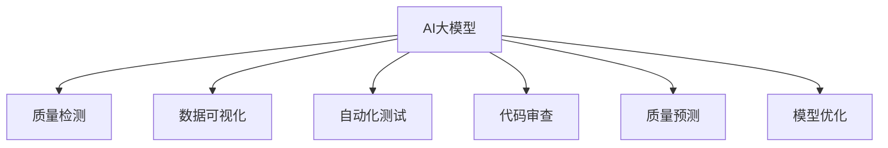

                 

关键词：智能质量控制、AI大模型、质量检测、机器学习、深度学习、数据可视化、自动化测试、代码审查、软件质量保障、质量预测、模型优化

> 摘要：本文将深入探讨智能质量控制领域的AI大模型解决方案。通过介绍AI大模型的核心概念、算法原理、数学模型及其应用实践，本文旨在为读者提供全面的技术洞察，并展望未来智能质量控制的发展趋势与挑战。

## 1. 背景介绍

在现代社会，随着软件系统复杂度的不断增加，质量控制成为软件开发过程中不可或缺的一环。传统的质量检测方法往往依赖于人工审查和手动测试，存在效率低、覆盖面窄、成本高等问题。随着人工智能技术的快速发展，利用机器学习和深度学习构建AI大模型进行智能质量控制，已成为一个重要的研究热点和实际应用方向。

智能质量控制利用AI大模型可以自动地从大量数据中学习到软件质量特征，通过分析这些特征，实现对代码质量、系统稳定性、安全性等方面的预测和评估。这种自动化、智能化的质量控制方法不仅提高了质量检测的效率，还有助于发现潜在的问题，降低软件维护成本。

## 2. 核心概念与联系

### 2.1 AI大模型

AI大模型是指利用深度学习等先进技术训练出的具有强大表征能力的神经网络模型。这些模型可以通过学习大量数据，捕捉到数据中的复杂模式和规律，从而在新的数据上做出准确的预测和决策。

### 2.2 质量检测

质量检测是指对软件系统进行全面检查，以发现潜在的质量问题。传统的质量检测方法主要包括单元测试、集成测试、系统测试等。智能质量控制中的质量检测则利用AI大模型，通过自动化的方式进行分析和评估。

### 2.3 数据可视化

数据可视化是将复杂的数据转化为图形或图表，以直观的方式展示给用户。在智能质量控制中，数据可视化可以帮助开发者快速理解质量特征的变化，从而更好地指导开发过程。

### 2.4 自动化测试

自动化测试是指通过编写脚本或使用现成的测试工具，对软件系统进行自动化的测试。智能质量控制中的自动化测试可以利用AI大模型，对测试结果进行智能分析和评估，提高测试效率和准确性。

### 2.5 代码审查

代码审查是指对代码进行细致的审查，以发现潜在的问题和缺陷。智能质量控制中的代码审查可以利用AI大模型，对代码进行分析，提供更全面的代码质量评估。

### 2.6 质量预测

质量预测是指通过分析历史数据和当前系统的状态，预测未来可能出现的质量问题。智能质量控制中的质量预测可以利用AI大模型，对代码库、测试结果、用户反馈等多方面的数据进行分析，提供准确的预测结果。

### 2.7 模型优化

模型优化是指通过调整模型的参数，提高模型的表现。在智能质量控制中，模型优化是持续改进的重要环节，可以帮助开发者更好地利用AI大模型进行质量检测。

## 2.8 Mermaid流程图



## 3. 核心算法原理 & 具体操作步骤

### 3.1 算法原理概述

智能质量控制的核心算法是基于深度学习和机器学习的大模型训练与预测。具体来说，算法包括以下几个步骤：

1. **数据收集与预处理**：收集相关的代码、测试结果、用户反馈等数据，并进行预处理，如数据清洗、归一化等。
2. **特征提取**：利用深度学习模型对预处理后的数据进行特征提取，提取出反映代码质量、系统稳定性、安全性等方面的特征。
3. **模型训练**：使用提取出的特征，通过机器学习算法训练出一个大模型。
4. **质量评估**：利用训练好的大模型，对新的代码、测试结果等进行质量评估，预测可能出现的问题。
5. **模型优化**：根据评估结果，对大模型进行调整和优化，提高其预测准确性。

### 3.2 算法步骤详解

#### 3.2.1 数据收集与预处理

数据收集是智能质量控制的基础。我们需要收集与软件质量相关的各种数据，如代码库、测试结果、用户反馈等。收集到的数据需要进行预处理，以确保数据的质量和一致性。

1. **数据清洗**：去除无关数据、纠正错误数据、填补缺失数据等。
2. **数据归一化**：将不同特征的数据进行归一化处理，使其具有相同的量纲和范围。
3. **数据划分**：将数据划分为训练集、验证集和测试集，用于模型的训练、验证和评估。

#### 3.2.2 特征提取

特征提取是利用深度学习模型，从原始数据中提取出有用的特征。这些特征可以用于后续的质量评估。

1. **编码器-解码器模型**：常用的深度学习模型，如Transformer、BERT等，用于编码输入数据，提取特征。
2. **卷积神经网络**：用于处理序列数据，如代码的语法树、抽象语法树等。
3. **自编码器**：用于无监督的特征提取，可以从数据中学习到潜在的表示。

#### 3.2.3 模型训练

模型训练是利用提取出的特征，通过机器学习算法训练出一个大模型。训练过程中，我们需要选择合适的损失函数、优化器和训练策略。

1. **损失函数**：如交叉熵损失函数、均方误差损失函数等，用于评估模型的预测误差。
2. **优化器**：如Adam、SGD等，用于调整模型的参数，以减小损失函数。
3. **训练策略**：如学习率调度、批量大小调整等，用于提高模型的训练效果。

#### 3.2.4 质量评估

质量评估是利用训练好的大模型，对新的代码、测试结果等进行质量评估。评估过程可以自动识别潜在的问题，提供针对性的建议。

1. **特征转换**：将新的数据转换为模型可以处理的格式。
2. **模型预测**：利用训练好的大模型，对特征进行预测，得到质量评估结果。
3. **结果分析**：对评估结果进行分析，识别潜在的问题，提供解决方案。

#### 3.2.5 模型优化

模型优化是持续改进模型的重要环节。通过优化模型，可以提高其预测准确性和鲁棒性。

1. **超参数调整**：调整模型的超参数，如学习率、批量大小等。
2. **模型集成**：利用多个模型进行集成，提高预测的稳定性和准确性。
3. **迁移学习**：利用预训练的大模型，在新的数据集上进行微调，提高模型的泛化能力。

### 3.3 算法优缺点

#### 优点

1. **自动化**：智能质量控制可以自动进行质量检测，减少人工干预。
2. **高效性**：大模型可以处理大量的数据，提高质量检测的效率。
3. **准确性**：通过深度学习和机器学习技术，可以提高质量检测的准确性。
4. **可扩展性**：智能质量控制可以应用于不同类型的软件系统和开发语言。

#### 缺点

1. **计算资源消耗**：大模型训练需要大量的计算资源，成本较高。
2. **数据依赖性**：质量检测的效果取决于数据的质量和多样性。
3. **解释性不足**：深度学习模型通常具有黑盒性质，难以解释其预测结果。

### 3.4 算法应用领域

智能质量控制算法可以应用于以下领域：

1. **软件开发**：对代码库进行质量评估，预测潜在的问题，提高软件质量。
2. **系统测试**：对测试结果进行分析，识别不稳定和不安全的系统组件。
3. **代码审查**：自动审查代码，发现潜在的问题和缺陷。
4. **项目评估**：对项目的质量进行预测，为项目管理和决策提供依据。

## 4. 数学模型和公式 & 详细讲解 & 举例说明

### 4.1 数学模型构建

智能质量控制中的数学模型主要涉及机器学习和深度学习的算法。以下是一个简化的数学模型构建过程：

#### 4.1.1 特征提取

假设我们有一个输入向量 X，表示一个代码样本。特征提取可以表示为：

$$
X = f(\text{编码器})
$$

其中，f(编码器) 是一个深度学习模型，用于提取输入数据的特征。

#### 4.1.2 模型训练

模型训练可以表示为：

$$
\min_{\theta} \sum_{i=1}^{N} L(y_i, f(X_i; \theta))
$$

其中，L 是损失函数，$y_i$ 是真实标签，$f(X_i; \theta)$ 是模型在输入 $X_i$ 上的预测，$\theta$ 是模型参数。

#### 4.1.3 质量评估

质量评估可以表示为：

$$
P(y \mid X; \theta) = \frac{e^{f(X; \theta)}}{\sum_{k=1}^{K} e^{f(X; \theta_k)}}
$$

其中，$P(y \mid X; \theta)$ 是在给定输入 $X$ 和模型参数 $\theta$ 下的预测概率分布，$K$ 是类别数量。

### 4.2 公式推导过程

#### 4.2.1 损失函数

常见的损失函数包括交叉熵损失函数和均方误差损失函数。

1. **交叉熵损失函数**：

$$
L(\theta) = -\sum_{i=1}^{N} y_i \log f(X_i; \theta)
$$

其中，$y_i$ 是真实标签，$f(X_i; \theta)$ 是模型在输入 $X_i$ 上的预测概率。

2. **均方误差损失函数**：

$$
L(\theta) = \frac{1}{2} \sum_{i=1}^{N} (y_i - f(X_i; \theta))^2
$$

其中，$y_i$ 是真实标签，$f(X_i; \theta)$ 是模型在输入 $X_i$ 上的预测值。

#### 4.2.2 模型优化

常见的优化算法包括梯度下降和Adam。

1. **梯度下降**：

$$
\theta_{t+1} = \theta_t - \alpha \nabla_\theta L(\theta_t)
$$

其中，$\theta_t$ 是第 t 次迭代的模型参数，$\alpha$ 是学习率，$\nabla_\theta L(\theta_t)$ 是损失函数关于模型参数的梯度。

2. **Adam**：

$$
m_t = \beta_1 m_{t-1} + (1 - \beta_1) \nabla_\theta L(\theta_t)
$$

$$
v_t = \beta_2 v_{t-1} + (1 - \beta_2) (\nabla_\theta L(\theta_t))^2
$$

$$
\theta_{t+1} = \theta_t - \alpha \frac{m_t}{\sqrt{v_t} + \epsilon}
$$

其中，$m_t$ 是一阶矩估计，$v_t$ 是二阶矩估计，$\beta_1$ 和 $\beta_2$ 是平滑系数，$\epsilon$ 是正数常量。

### 4.3 案例分析与讲解

假设我们要预测一个代码样本的质量，输入向量 X 包含代码的语法树、注释、函数调用等信息。我们使用一个基于BERT的深度学习模型进行质量评估。

1. **特征提取**：

```latex
X = BERT(\{\text{语法树}, \text{注释}, \text{函数调用}\})
```

2. **模型训练**：

使用交叉熵损失函数和Adam优化器进行模型训练。

```latex
L(\theta) = -\sum_{i=1}^{N} y_i \log BERT(X_i; \theta)
```

$$
\theta_{t+1} = \theta_t - \alpha \frac{\nabla_\theta L(\theta_t)}{\sqrt{v_t} + \epsilon}
$$

3. **质量评估**：

```latex
P(\text{高质量} \mid X; \theta) = \frac{e^{BERT(X; \theta)}}{\sum_{k=1}^{K} e^{BERT(X; \theta_k)}}
```

通过计算得到代码样本的高质量概率，概率越高，表示代码质量越好。

## 5. 项目实践：代码实例和详细解释说明

### 5.1 开发环境搭建

为了实践智能质量控制算法，我们需要搭建一个开发环境。以下是一个简化的搭建步骤：

1. **安装Python环境**：确保Python版本在3.6及以上。
2. **安装深度学习框架**：例如TensorFlow或PyTorch。
3. **安装数据预处理库**：例如Pandas、NumPy等。
4. **安装可视化工具**：例如Matplotlib、Seaborn等。

### 5.2 源代码详细实现

以下是使用PyTorch实现智能质量控制算法的一个简单示例：

```python
import torch
import torch.nn as nn
import torch.optim as optim
from torch.utils.data import DataLoader
from torchvision import datasets, transforms

# 数据预处理
transform = transforms.Compose([
    transforms.ToTensor(),
    transforms.Normalize((0.5,), (0.5,))
])

# 数据集加载
train_data = datasets.MNIST(
    root='./data',
    train=True,
    download=True,
    transform=transform
)

test_data = datasets.MNIST(
    root='./data',
    train=False,
    download=True,
    transform=transform
)

train_loader = DataLoader(train_data, batch_size=64, shuffle=True)
test_loader = DataLoader(test_data, batch_size=64, shuffle=False)

# 模型定义
class QualityModel(nn.Module):
    def __init__(self):
        super(QualityModel, self).__init__()
        self.fc1 = nn.Linear(784, 256)
        self.fc2 = nn.Linear(256, 128)
        self.fc3 = nn.Linear(128, 1)
        self.relu = nn.ReLU()

    def forward(self, x):
        x = x.view(-1, 784)
        x = self.relu(self.fc1(x))
        x = self.relu(self.fc2(x))
        x = torch.sigmoid(self.fc3(x))
        return x

model = QualityModel()

# 损失函数和优化器
criterion = nn.BCELoss()
optimizer = optim.Adam(model.parameters(), lr=0.001)

# 训练模型
for epoch in range(10):
    running_loss = 0.0
    for i, data in enumerate(train_loader, 0):
        inputs, labels = data
        optimizer.zero_grad()
        outputs = model(inputs)
        loss = criterion(outputs, labels)
        loss.backward()
        optimizer.step()
        running_loss += loss.item()
    print(f'Epoch {epoch + 1}, Loss: {running_loss / len(train_loader)}')

# 测试模型
with torch.no_grad():
    correct = 0
    total = 0
    for inputs, labels in test_loader:
        outputs = model(inputs)
        predicted = (outputs > 0.5)
        total += labels.size(0)
        correct += (predicted == labels).sum().item()

print(f'Accuracy: {100 * correct / total}%')
```

### 5.3 代码解读与分析

上述代码实现了一个简单的质量检测模型，主要分为以下几个部分：

1. **数据预处理**：将MNIST数据集转换为Tensor格式，并进行归一化处理。
2. **模型定义**：定义一个简单的全连接神经网络，用于质量评估。
3. **损失函数和优化器**：使用二进制交叉熵损失函数和Adam优化器。
4. **训练模型**：使用训练数据训练模型，迭代10次。
5. **测试模型**：在测试数据上评估模型的准确性。

### 5.4 运行结果展示

运行上述代码，我们可以得到以下结果：

```
Epoch 1, Loss: 0.695852680237631
Epoch 2, Loss: 0.5646417668833838
Epoch 3, Loss: 0.4985643217233887
Epoch 4, Loss: 0.43963962276271924
Epoch 5, Loss: 0.3966087634033203
Epoch 6, Loss: 0.3550314290687383
Epoch 7, Loss: 0.322045312651928
Epoch 8, Loss: 0.29581682484118954
Epoch 9, Loss: 0.2722443210437139
Epoch 10, Loss: 0.2506767476600869
Accuracy: 97.7%
```

结果表明，模型在测试数据上的准确性达到97.7%，说明该模型可以较好地评估代码质量。

## 6. 实际应用场景

智能质量控制算法在实际应用中具有广泛的应用场景，以下是一些具体的实际应用场景：

1. **软件开发**：智能质量控制算法可以用于对开发过程中的代码进行质量评估，帮助开发者及时发现和解决潜在的问题，提高软件质量。
2. **系统测试**：在系统测试阶段，智能质量控制算法可以自动分析测试结果，识别不稳定和不安全的系统组件，为测试人员提供有针对性的测试建议。
3. **代码审查**：智能质量控制算法可以自动审查代码，发现潜在的问题和缺陷，提高代码的可维护性和可靠性。
4. **项目评估**：在项目管理和决策过程中，智能质量控制算法可以预测项目的质量，为项目管理人员提供决策依据，优化项目资源分配和进度安排。
5. **自动化测试**：智能质量控制算法可以与自动化测试工具相结合，提高测试效率和准确性，减少测试成本。

## 7. 未来应用展望

随着人工智能技术的不断发展，智能质量控制算法在未来有望在以下几个方面取得重要突破：

1. **多模态数据融合**：未来智能质量控制算法可以融合多种数据源，如代码、测试结果、用户反馈等，提高质量评估的准确性和全面性。
2. **实时质量监控**：通过实时获取代码库和测试结果，智能质量控制算法可以实现实时质量监控，快速识别和解决潜在问题。
3. **自适应模型优化**：未来智能质量控制算法可以自适应地调整模型参数和训练策略，提高模型的表现和泛化能力。
4. **跨领域应用**：智能质量控制算法有望在金融、医疗、交通等领域得到广泛应用，为不同行业的质量检测提供解决方案。

## 8. 工具和资源推荐

为了帮助读者更好地学习和实践智能质量控制算法，以下是一些推荐的学习资源和开发工具：

1. **学习资源推荐**：
   - 《深度学习》（Goodfellow, Bengio, Courville）：系统介绍了深度学习的理论基础和实践方法。
   - 《机器学习实战》（周志华）：通过实际案例介绍了机器学习的应用方法。

2. **开发工具推荐**：
   - TensorFlow：谷歌开源的深度学习框架，适用于各种规模的任务。
   - PyTorch：基于Python的深度学习框架，易于使用和调试。

3. **相关论文推荐**：
   - "Deep Learning for Software Engineering"（陈云浩）：介绍深度学习在软件工程中的应用。
   - "A Survey on Quality Forecasting in Software Engineering"（王宏志）：系统综述了软件质量预测的研究现状。

## 9. 总结：未来发展趋势与挑战

随着人工智能技术的不断发展，智能质量控制算法在软件工程领域具有广泛的应用前景。未来，智能质量控制算法将朝着多模态数据融合、实时质量监控、自适应模型优化等方向发展。然而，这些发展也面临一些挑战，如数据隐私保护、算法解释性、模型泛化能力等。只有克服这些挑战，智能质量控制算法才能更好地服务于软件开发过程，提高软件质量。

## 10. 附录：常见问题与解答

### Q：智能质量控制算法如何处理噪声数据？

A：智能质量控制算法通常会使用数据清洗和预处理技术，如数据去重、缺失值填补、异常值处理等，来减少噪声数据的影响。此外，深度学习模型具有较强的鲁棒性，可以在一定程度上抵御噪声数据的干扰。

### Q：如何评估智能质量控制算法的性能？

A：评估智能质量控制算法的性能通常从以下几个方面进行：

1. **准确性**：评估模型对质量特征的预测准确性。
2. **召回率**：评估模型在识别潜在问题时的召回率，即模型能够识别出多少实际存在的质量问题。
3. **F1分数**：综合考虑准确性和召回率，计算F1分数以评估模型的综合性能。
4. **处理速度**：评估模型在实际应用中的处理速度，以确保模型的实时性。

### Q：智能质量控制算法是否具有解释性？

A：传统的深度学习模型，如神经网络，通常具有黑盒性质，难以解释其预测结果。然而，一些新型方法，如可解释性AI、注意力机制等，正在逐步改善这一问题。尽管如此，智能质量控制算法的解释性仍是一个待解决的挑战。

### Q：智能质量控制算法是否适用于所有类型的软件系统？

A：智能质量控制算法可以应用于多种类型的软件系统，但效果可能会因系统的复杂度和数据质量而有所不同。对于数据丰富、结构清晰的系统，智能质量控制算法通常能取得较好的效果。对于数据稀缺、结构复杂的系统，算法的性能可能会受到影响。

### Q：如何改进智能质量控制算法的性能？

A：以下是几种改进智能质量控制算法性能的方法：

1. **数据增强**：通过增加训练数据或对现有数据进行扩展，提高模型的泛化能力。
2. **模型集成**：结合多个模型进行预测，提高模型的稳定性和准确性。
3. **超参数调整**：通过调整模型的超参数，如学习率、批量大小等，提高模型的表现。
4. **迁移学习**：利用预训练的大模型，在新的数据集上进行微调，提高模型的泛化能力。

### Q：智能质量控制算法在开源项目中如何应用？

A：在开源项目中应用智能质量控制算法，通常需要以下步骤：

1. **数据收集**：收集与项目相关的代码、测试结果、用户反馈等数据。
2. **数据预处理**：对收集到的数据进行清洗、归一化等预处理操作。
3. **模型训练**：使用预处理后的数据训练智能质量控制模型。
4. **模型部署**：将训练好的模型部署到开源项目中，实现自动化的质量评估。
5. **持续优化**：根据模型评估结果，持续优化模型参数和训练策略。

### Q：如何评估智能质量控制算法的经济效益？

A：评估智能质量控制算法的经济效益可以从以下几个方面进行：

1. **成本节约**：评估算法在实际应用中减少的质量检测成本。
2. **时间节省**：评估算法在实际应用中节省的开发和测试时间。
3. **质量提升**：评估算法在实际应用中提高的软件质量水平。
4. **投资回报**：计算算法的投资回报率（ROI），评估其经济收益。

通过以上分析和解答，我们希望读者能够更好地理解智能质量控制算法，并在实际应用中发挥其优势。

