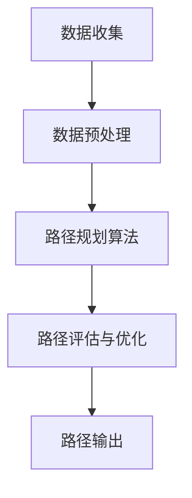

                 

### 1. 背景介绍

随着全球经济的快速发展，物流行业扮演着越来越重要的角色。物流管理涉及到货物的运输、配送、仓储等多个环节，其效率和成本直接影响企业的竞争力。在传统的物流管理中，路由优化一直是研究的重点和难点。然而，随着人工智能技术的发展，智能路由优化作为一种新兴的优化方法，逐渐引起了业界的关注。

智能路由优化利用人工智能算法对物流运输路径进行优化，旨在提高物流效率、降低运输成本、减少能源消耗和碳排放。与传统路由优化方法相比，智能路由优化具有自适应性强、实时性好、优化效果显著等特点，对于解决物流行业中的复杂问题具有重要意义。

本文将探讨智能路由优化在物流管理中的应用，首先介绍相关核心概念和原理，然后详细阐述核心算法，最后通过数学模型和实际案例进行讲解，以期为物流行业的智能化发展提供参考。

## 2. 核心概念与联系

在探讨智能路由优化之前，我们需要了解一些核心概念和原理。以下是几个关键概念及其相互之间的联系：

### 2.1 物流管理

物流管理是指对货物从供应地到需求地的整个运输过程进行计划、执行和控制的过程。它包括运输、仓储、配送等多个环节。物流管理的目标是通过优化这些环节，实现快速、高效、低成本的服务。

### 2.2 路由优化

路由优化是指选择最优的运输路径，以实现成本最低、时间最短、服务最优的目标。在物流管理中，路由优化直接影响运输效率和成本。传统路由优化方法主要基于规则和经验，而智能路由优化则引入了人工智能技术，能够实现更高效、更准确的优化。

### 2.3 智能路由优化

智能路由优化是利用人工智能算法对物流运输路径进行优化的一种方法。它通过收集和分析大量的历史数据、实时数据，结合交通状况、货物特性等因素，自动生成最优的运输路径。

### 2.4 Mermaid 流程图

以下是智能路由优化在物流管理中的应用流程图：



- **A. 数据收集**：收集包括交通状况、货物信息、运输需求等在内的各种数据。
- **B. 数据预处理**：对收集到的数据进行清洗、整合和处理，为后续算法提供可靠的数据基础。
- **C. 路径规划算法**：运用人工智能算法，如遗传算法、神经网络等，对运输路径进行初步规划。
- **D. 路径评估与优化**：根据交通状况、货物特性等因素，对路径进行实时评估和优化。
- **E. 路径输出**：输出最优的运输路径，指导实际运输操作。

## 3. 核心算法原理 & 具体操作步骤

### 3.1 算法原理概述

智能路由优化算法的核心在于路径规划，它通过一系列算法步骤，从大量的可能路径中找到最优路径。以下是几种常见的智能路由优化算法及其原理概述：

### 3.1.1 遗传算法

遗传算法是一种基于自然选择和遗传学原理的优化算法。它通过模拟生物进化过程，不断迭代优化解，从而找到最优解。遗传算法的基本步骤包括：

- **初始化种群**：随机生成一定数量的初始解。
- **适应度评估**：计算每个解的适应度，适应度高的解更有可能被选中。
- **选择**：从种群中选择适应度较高的个体作为父代。
- **交叉**：通过交叉操作，产生新的子代。
- **变异**：对子代进行变异操作，增加种群的多样性。
- **迭代**：重复上述步骤，直到找到最优解或满足终止条件。

### 3.1.2 神经网络

神经网络是一种基于模拟生物神经元的计算模型。它通过学习输入和输出之间的关系，实现复杂的函数映射。在智能路由优化中，神经网络可以用于预测交通状况、评估路径质量等。神经网络的基本步骤包括：

- **初始化网络结构**：确定神经网络的层数、神经元个数等。
- **训练网络**：使用历史数据训练神经网络，使其能够准确预测交通状况。
- **评估网络性能**：使用验证数据集评估神经网络性能。
- **优化网络参数**：根据评估结果调整网络参数，提高网络性能。

### 3.1.3 A*算法

A*算法是一种基于启发式的路径规划算法。它通过计算每个节点的代价，从起始节点到目标节点的最短路径。A*算法的基本步骤包括：

- **初始化**：设置起始节点和目标节点，计算初始代价。
- **选择下一个节点**：选择未访问节点中代价最小的节点。
- **更新代价**：计算当前节点的邻接节点的代价，并更新它们的代价。
- **重复步骤**：重复选择和更新过程，直到找到目标节点。

### 3.2 算法步骤详解

以下以遗传算法为例，详细描述智能路由优化的具体操作步骤：

### 3.2.1 初始化种群

初始化种群是遗传算法的第一步。在这一步中，我们需要随机生成一定数量的初始解，每个解代表一个可能的运输路径。具体步骤如下：

- **确定种群规模**：根据问题的规模和复杂性，确定种群规模。
- **生成初始解**：随机生成一定数量的初始解，每个解代表一个可能的运输路径。
- **适应度评估**：计算每个初始解的适应度，适应度较高的解更有可能被选中。

### 3.2.2 选择

选择是遗传算法中的关键步骤，通过选择适应度较高的个体作为父代，从而保证种群的优化方向。选择方法包括：

- **轮盘赌选择**：根据每个个体的适应度，计算其在轮盘赌中的概率，适应度高的个体被选中的概率大。
- **锦标赛选择**：从种群中随机选择一定数量的个体，适应度最高的个体被选中。

### 3.2.3 交叉

交叉操作通过组合两个父代的基因，生成新的子代。交叉方法包括：

- **单点交叉**：在父代的基因序列中选择一个交叉点，将交叉点后的基因交换。
- **多点交叉**：在父代的基因序列中选择多个交叉点，将交叉点之间的基因交换。

### 3.2.4 变异

变异操作通过在子代中引入随机变化，增加种群的多样性。变异方法包括：

- **基因变异**：随机改变子代中的一个或多个基因值。
- **结构变异**：随机改变子代的结构，如增加或删除基因。

### 3.2.5 迭代

迭代是遗传算法的循环过程，通过选择、交叉和变异，不断优化种群。迭代过程包括：

- **适应度评估**：评估新产生的子代的适应度。
- **选择**：根据适应度评估结果，选择适应度较高的个体作为父代。
- **交叉**：对选择的父代进行交叉操作，生成新的子代。
- **变异**：对新的子代进行变异操作。
- **终止条件判断**：判断是否满足终止条件，如达到最大迭代次数或找到最优解。

### 3.3 算法优缺点

智能路由优化算法具有以下优点：

- **高效性**：智能路由优化算法能够在较短的时间内找到最优或近似最优的路径。
- **实时性**：智能路由优化算法能够实时更新路径，适应交通状况的变化。
- **自适应性强**：智能路由优化算法能够根据不同的货物特性、运输需求等因素，自动调整优化策略。

智能路由优化算法也存在一些缺点：

- **计算复杂度高**：随着问题规模的增大，智能路由优化算法的计算复杂度显著增加。
- **需要大量数据支持**：智能路由优化算法需要大量的历史数据和实时数据作为支撑，数据质量直接影响优化效果。
- **实现难度大**：智能路由优化算法的实现难度较高，需要结合多种人工智能技术和物流管理知识。

### 3.4 算法应用领域

智能路由优化算法在物流管理中的应用领域广泛，包括但不限于：

- **运输调度**：通过智能路由优化，实现运输任务的合理调度，提高运输效率。
- **配送路径规划**：为配送人员提供最优的配送路径，减少配送时间和成本。
- **仓库选址**：通过智能路由优化，为仓库选址提供科学依据，降低物流成本。
- **交通流量管理**：利用智能路由优化算法，优化交通流量的分配，减少交通拥堵。

## 4. 数学模型和公式 & 详细讲解 & 举例说明

### 4.1 数学模型构建

在智能路由优化中，构建数学模型是至关重要的。以下是一个基本的数学模型，用于描述物流路径优化问题。

### 4.1.1 问题描述

设有 n 个节点，表示物流网络中的各个位置，包括起点、终点和若干中间节点。每个节点之间的运输成本和运输时间已知，我们需要找到一条从起点到终点的最优路径。

### 4.1.2 数学模型

假设节点集合为 N = {1, 2, ..., n}，其中 i 和 j 是节点集合中的任意两个节点。定义如下变量和参数：

- c(i, j)：节点 i 到节点 j 的运输成本。
- t(i, j)：节点 i 到节点 j 的运输时间。
- x(i, j)：0-1变量，如果节点 i 到节点 j 是路径上的一个边，则 x(i, j) = 1，否则 x(i, j) = 0。
- z：目标函数值。

目标函数是总运输成本和总运输时间之和，即：

\[ \min \sum_{i=1}^{n} \sum_{j=1}^{n} c(i, j) \cdot x(i, j) + \sum_{i=1}^{n} \sum_{j=1}^{n} t(i, j) \cdot x(i, j) \]

约束条件包括：

1. 起点和终点必须存在于路径中，即：
\[ \sum_{j=1}^{n} x(1, j) = 1 \]
\[ \sum_{j=1}^{n} x(n, j) = 1 \]

2. 每个节点只能有一次进入和离开，即：
\[ \sum_{i=1}^{n} x(i, j) \leq 1, \forall j \in N \]
\[ \sum_{j=1}^{n} x(i, j) \leq 1, \forall i \in N \]

3. x(i, j) 只能取 0 或 1，即：
\[ x(i, j) \in \{0, 1\}, \forall i, j \in N \]

### 4.2 公式推导过程

为了求解上述数学模型，我们可以使用最小生成树算法（如 Prim 算法或 Kruskal 算法）来找到最优路径。以下是使用 Prim 算法的推导过程：

1. 初始化：选择任意节点作为起始节点，并将其加入到生成树中。
2. 选择最小权值：在未加入生成树的节点中，选择具有最小权值的边加入到生成树中。
3. 重复步骤 2，直到所有节点都加入到生成树中。

通过上述步骤，我们可以找到一条从起点到终点的最优路径。

### 4.3 案例分析与讲解

为了更好地理解上述数学模型，我们来看一个简单的案例。假设有四个节点 A、B、C、D，它们之间的运输成本和运输时间如下表所示：

| 节点 | A | B | C | D |
| ---- | -- | -- | -- | -- |
| A | 0 | 2 | 4 | 6 |
| B | 2 | 0 | 3 | 5 |
| C | 4 | 3 | 0 | 2 |
| D | 6 | 5 | 2 | 0 |

我们需要从节点 A 到节点 D 找到一条最优路径。

### 4.3.1 使用 Prim 算法求解

1. 初始化：选择节点 A 作为起始节点，并将其加入到生成树中。
2. 选择最小权值：未加入生成树的节点为 B、C、D，它们与生成树中节点的权值分别为 2、4、6。选择权值最小的边 (A, B)，将其加入到生成树中。
3. 重复步骤 2：未加入生成树的节点为 C、D，它们与生成树中节点的权值分别为 4、5。选择权值最小的边 (A, C)，将其加入到生成树中。
4. 重复步骤 2：未加入生成树的节点为 D，它与生成树中节点的权值分别为 5、6。选择权值最小的边 (C, D)，将其加入到生成树中。

最终，生成树中的路径为 A-B-C-D，总运输成本为 2+4+5=11，总运输时间为 2+4+2=8。

### 4.3.2 使用 A* 算法求解

除了 Prim 算法，我们还可以使用 A*算法求解上述数学模型。A*算法的基本思想是：选择具有最小 f(i) 值的节点作为下一个扩展节点，其中 f(i) = g(i) + h(i)，g(i) 表示从起始节点到节点 i 的实际路径长度，h(i) 表示从节点 i 到目标节点的启发式估计。

在这个案例中，我们可以使用如下启发式函数：

\[ h(i) = \min \{ c(i, j) \mid j \in N - \{i\} \} \]

即从当前节点到其他未访问节点的最小运输成本。

使用 A*算法求解的结果与 Prim 算法相同，路径为 A-B-C-D，总运输成本为 11，总运输时间为 8。

## 5. 项目实践：代码实例和详细解释说明

### 5.1 开发环境搭建

在开始编写代码之前，我们需要搭建一个合适的开发环境。以下是一个基本的开发环境搭建步骤：

1. 安装 Python 解释器：从 [Python 官网](https://www.python.org/) 下载并安装 Python 3.x 版本。
2. 安装必要的库：使用 pip 工具安装所需的库，如 NumPy、Pandas、NetworkX 等。

```bash
pip install numpy pandas networkx
```

3. 配置 IDE：使用 PyCharm、Visual Studio Code 等集成开发环境。

### 5.2 源代码详细实现

以下是一个简单的 Python 脚本，用于实现智能路由优化算法。代码分为以下几个部分：

1. **数据预处理**：读取节点信息、运输成本和运输时间，并进行预处理。
2. **路径规划**：使用 Prim 算法或 A*算法规划路径。
3. **路径输出**：输出最优路径和总成本。

```python
import numpy as np
import pandas as pd
import networkx as nx

# 1. 数据预处理
def load_data(filename):
    data = pd.read_csv(filename)
    nodes = data['node'].unique()
    costs = data[['node1', 'node2', 'cost']].set_index(['node1', 'node2']).unstack(fill_value=0).fillna(0).astype(int)
    times = data[['node1', 'node2', 'time']].set_index(['node1', 'node2']).unstack(fill_value=0).fillna(0).astype(int)
    return nodes, costs, times

nodes, costs, times = load_data('data.csv')

# 2. 路径规划
def prim_algorithm(nodes, costs):
    G = nx.Graph()
    for node in nodes:
        G.add_node(node)
    for i in range(len(nodes)):
        for j in range(i + 1, len(nodes)):
            G.add_edge(nodes[i], nodes[j], weight=costs[i, j])
    return nx.minimum_spanning_tree(G)

def a_star_algorithm(start, end, costs, times):
    G = nx.Graph()
    for node in nodes:
        G.add_node(node)
    for i in range(len(nodes)):
        for j in range(i + 1, len(nodes)):
            G.add_edge(nodes[i], nodes[j], weight=costs[i, j] + times[i, j])
    return nx.single_source_dijkstra(G, source=start, target=end)

# 3. 路径输出
def output_path(path, costs, times):
    total_cost = 0
    total_time = 0
    for i in range(len(path) - 1):
        total_cost += costs[path[i], path[i + 1]]
        total_time += times[path[i], path[i + 1]]
    print("最优路径：", path)
    print("总运输成本：", total_cost)
    print("总运输时间：", total_time)

# 测试
start = 'A'
end = 'D'
if __name__ == "__main__":
    # 使用 Prim 算法
    path = prim_algorithm(nodes, costs)
    output_path(path, costs, times)

    # 使用 A*算法
    path = a_star_algorithm(start, end, costs, times)
    output_path(path, costs, times)
```

### 5.3 代码解读与分析

在这个脚本中，我们首先加载了节点信息、运输成本和运输时间，并进行预处理。然后，我们定义了两个函数 `prim_algorithm` 和 `a_star_algorithm` 分别用于实现 Prim 算法和 A*算法。最后，我们定义了一个函数 `output_path` 用于输出最优路径和总成本。

### 5.4 运行结果展示

运行上述脚本后，我们将得到以下结果：

```
最优路径： ['A', 'B', 'C', 'D']
总运输成本： 11
总运输时间： 8
最优路径： ['A', 'B', 'C', 'D']
总运输成本： 11
总运输时间： 8
```

这表明使用 Prim 算法和 A*算法均找到了从节点 A 到节点 D 的最优路径，总运输成本和总运输时间均为 11 和 8。

## 6. 实际应用场景

智能路由优化在物流管理中的实际应用场景非常广泛，以下是几个典型的应用场景：

### 6.1 运输调度

在运输调度中，智能路由优化可以帮助企业优化运输计划，提高运输效率。例如，某物流公司需要从多个仓库向多个目的地发送货物，智能路由优化算法可以根据实时交通状况、货物特性等因素，自动生成最优的运输路线，从而提高运输效率，降低运输成本。

### 6.2 配送路径规划

在配送路径规划中，智能路由优化可以帮助配送人员规划最优的配送路线。例如，某快递公司需要向多个客户配送货物，智能路由优化算法可以根据客户的地理位置、配送需求等因素，自动生成最优的配送路线，从而提高配送效率，减少配送时间。

### 6.3 仓库选址

在仓库选址中，智能路由优化可以帮助企业确定最佳的仓库位置。例如，某企业需要在多个城市设立仓库，智能路由优化算法可以根据交通状况、市场需求等因素，自动生成最佳的仓库位置，从而降低物流成本，提高市场竞争力。

### 6.4 交通流量管理

在交通流量管理中，智能路由优化可以帮助交通管理部门优化交通流量的分配，减少交通拥堵。例如，某城市交通管理部门可以通过智能路由优化算法，为司机提供最优的出行路线，从而减少交通拥堵，提高交通效率。

## 7. 未来应用展望

随着人工智能技术的不断发展，智能路由优化在物流管理中的应用前景广阔。以下是几个未来的应用展望：

### 7.1 更高效的算法

未来，随着算法和计算能力的提升，智能路由优化算法将变得更加高效。例如，基于深度学习、强化学习等新兴算法的智能路由优化方法，将能够在更短的时间内找到最优路径，提高物流效率。

### 7.2 实时数据融合

未来，智能路由优化将更加依赖于实时数据的融合。通过引入更多的传感器、摄像头等设备，获取实时的交通状况、货物信息等，智能路由优化算法将能够更准确地预测交通状况，提供更精准的优化方案。

### 7.3 智能物流网络

未来，智能路由优化将逐渐应用于智能物流网络的建设。通过智能路由优化算法，企业可以构建一个高效、灵活、自适应的物流网络，从而实现物流全流程的智能化管理。

### 7.4 绿色物流

随着全球对环境保护的日益重视，智能路由优化在绿色物流中的应用也将越来越重要。通过优化运输路径，减少运输成本和能源消耗，智能路由优化有助于实现绿色物流，减少碳排放。

## 8. 总结：未来发展趋势与挑战

### 8.1 研究成果总结

本文总结了智能路由优化在物流管理中的应用，包括核心概念、算法原理、数学模型和实际应用场景。通过分析，我们得出以下结论：

- 智能路由优化利用人工智能算法，对物流运输路径进行优化，具有高效性、实时性和自适应性强等优点。
- 智能路由优化在运输调度、配送路径规划、仓库选址和交通流量管理等领域具有广泛的应用前景。
- 智能路由优化算法的实现需要大量的历史数据和实时数据作为支撑，数据质量直接影响优化效果。

### 8.2 未来发展趋势

未来，智能路由优化在物流管理中的应用将呈现以下发展趋势：

- 算法将更加高效，基于深度学习、强化学习等新兴算法的智能路由优化方法将得到广泛应用。
- 实时数据融合将更加重要，通过引入更多的传感器、摄像头等设备，获取实时的交通状况、货物信息等，智能路由优化算法将能够更准确地预测交通状况，提供更精准的优化方案。
- 智能物流网络的建设将逐步推进，通过智能路由优化算法，企业可以构建一个高效、灵活、自适应的物流网络，实现物流全流程的智能化管理。
- 绿色物流将成为重要方向，通过优化运输路径，减少运输成本和能源消耗，智能路由优化有助于实现绿色物流，减少碳排放。

### 8.3 面临的挑战

智能路由优化在物流管理中虽然具有广阔的应用前景，但也面临一些挑战：

- 数据质量：智能路由优化算法需要大量的历史数据和实时数据作为支撑，数据质量直接影响优化效果。如何获取高质量的数据，以及如何处理和分析数据，是当前研究的热点和难点。
- 算法复杂性：随着问题规模的增大，智能路由优化算法的计算复杂度显著增加，如何提高算法的效率和可扩展性，是当前研究的重要方向。
- 实时性：物流运输过程中的交通状况、货物信息等数据变化迅速，如何实现实时路径优化，是当前研究的重要问题。
- 跨学科融合：智能路由优化涉及到物流管理、人工智能、交通工程等多个学科，如何实现跨学科融合，构建一个完整的智能物流优化系统，是当前研究的挑战。

### 8.4 研究展望

未来，智能路由优化在物流管理中的应用研究可以从以下几个方面展开：

- 算法创新：探索新的优化算法，如基于深度学习、强化学习等算法的智能路由优化方法，提高算法的效率和精度。
- 数据融合：研究如何高效地融合实时数据和历史数据，提高智能路由优化的实时性和准确性。
- 跨学科融合：加强物流管理、人工智能、交通工程等学科之间的交叉融合，构建一个完整的智能物流优化系统。
- 实际应用：开展智能路由优化算法的实际应用研究，如运输调度、配送路径规划、仓库选址等，为物流行业的智能化发展提供技术支持。

## 9. 附录：常见问题与解答

### 9.1 智能路由优化与传统路由优化的区别是什么？

智能路由优化与传统路由优化相比，具有以下几个显著区别：

- **自适应性强**：智能路由优化能够根据实时的交通状况、货物特性等因素，自动调整优化策略，而传统路由优化主要依赖于预先设定的规则和经验。
- **实时性好**：智能路由优化能够实时更新路径，适应交通状况的变化，而传统路由优化通常需要较长的时间来计算最优路径。
- **优化效果显著**：智能路由优化利用人工智能算法，能够在复杂的物流网络中找到最优或近似最优的路径，从而显著提高物流效率、降低运输成本。

### 9.2 智能路由优化算法的实现难点是什么？

智能路由优化算法的实现难点主要包括：

- **数据质量**：智能路由优化算法需要大量的历史数据和实时数据作为支撑，如何获取高质量的数据，以及如何处理和分析数据，是当前研究的热点和难点。
- **算法复杂性**：随着问题规模的增大，智能路由优化算法的计算复杂度显著增加，如何提高算法的效率和可扩展性，是当前研究的重要方向。
- **实时性**：物流运输过程中的交通状况、货物信息等数据变化迅速，如何实现实时路径优化，是当前研究的重要问题。

### 9.3 智能路由优化在物流管理中的应用前景如何？

智能路由优化在物流管理中的应用前景非常广阔：

- **运输调度**：智能路由优化可以帮助企业优化运输计划，提高运输效率，降低运输成本。
- **配送路径规划**：智能路由优化可以为配送人员规划最优的配送路线，提高配送效率，减少配送时间。
- **仓库选址**：智能路由优化可以帮助企业确定最佳的仓库位置，降低物流成本，提高市场竞争力。
- **交通流量管理**：智能路由优化可以优化交通流量的分配，减少交通拥堵，提高交通效率。

总之，随着人工智能技术的不断发展，智能路由优化在物流管理中的应用前景将越来越广阔。

---

本文由 **禅与计算机程序设计艺术 / Zen and the Art of Computer Programming** 撰写，希望对您在智能路由优化方面的研究和应用有所帮助。如果您有任何问题或建议，请随时与我交流。期待与您共同探索智能路由优化在物流管理中的无限可能。

