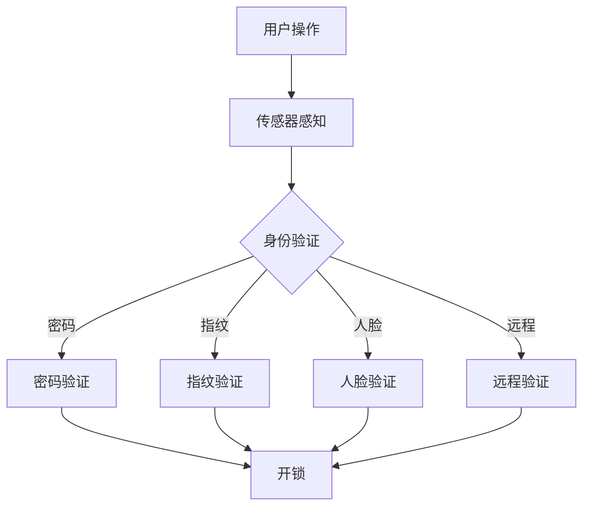

                 

在当今快速发展的智能科技领域，智能家居已经成为一个不可忽视的趋势。智能门锁作为家居安全的重要组成部分，正逐渐改变着我们的生活方式。本文将探讨智能门锁的创业之路，分析其技术原理、应用场景、未来发展趋势，以及面临的挑战。

## 关键词

- **智能门锁**
- **家居安全**
- **物联网**
- **人工智能**
- **用户体验**
- **智能家居**

## 摘要

本文旨在探讨智能门锁在现代家居安全中的角色和重要性。通过分析智能门锁的技术原理、市场需求、应用场景以及未来发展趋势，我们希望能够为智能门锁行业的创业者和研究者提供有价值的参考。同时，本文也将讨论智能门锁在提升用户体验和家居安全性方面的创新。

## 1. 背景介绍

### 智能门锁的定义与分类

智能门锁是一种通过集成传感器、控制模块和通信模块实现自动开锁和安防功能的锁具。根据开锁方式的不同，智能门锁可以分为以下几类：

- **密码开锁**：通过输入预设的密码进行开锁，是最基本的智能门锁类型。
- **指纹开锁**：利用生物识别技术，通过指纹验证身份进行开锁。
- **人脸识别开锁**：通过摄像头捕捉人脸图像，利用人工智能算法进行身份验证。
- **远程开锁**：通过手机APP或其他远程控制设备，实现远程开锁功能。
- **卡片开锁**：通过刷卡或者NFC标签进行身份验证。

### 智能门锁的发展历程

智能门锁的发展可以追溯到20世纪末。最初的智能门锁主要采用机械结构，通过编程控制机械锁芯的开合。随着电子技术和通信技术的发展，智能门锁逐渐走向智能化。21世纪初，互联网技术的普及使得智能门锁可以联网实现远程控制和监控。近年来，人工智能和物联网技术的进步，使得智能门锁在安全性、便利性和个性化方面有了显著的提升。

### 智能门锁的市场现状

目前，全球智能门锁市场正处于快速增长阶段。根据市场研究数据，预计未来几年智能门锁的年复合增长率将达到20%以上。中国市场作为全球最大的智能家居市场，智能门锁的需求量也在持续增长。消费者对家居安全的需求和对智能化的追求，是推动智能门锁市场扩大的主要动力。

## 2. 核心概念与联系

### 智能门锁的核心技术

智能门锁的核心技术包括传感器技术、生物识别技术、物联网技术、加密技术和人工智能技术。这些技术共同构成了智能门锁的工作基础。

#### 传感器技术

传感器技术用于检测门锁的状态，如开关门、温度、湿度等。常见的传感器包括红外传感器、压力传感器和超声波传感器等。

#### 生物识别技术

生物识别技术用于身份验证，如指纹识别、人脸识别和虹膜识别等。这些技术通过采集生物特征信息，与数据库中的信息进行比对，实现身份验证。

#### 物联网技术

物联网技术使得智能门锁可以与家庭网络、云计算平台等实现互联互通。通过物联网技术，用户可以实现远程监控、远程控制和数据共享等功能。

#### 加密技术

加密技术用于保护数据传输和存储的安全，确保用户隐私不被泄露。常用的加密算法包括AES、RSA等。

#### 人工智能技术

人工智能技术用于智能门锁的决策和控制。例如，通过人脸识别技术，智能门锁可以根据用户的身份自动调整开锁方式。

### 智能门锁的架构

智能门锁的架构可以分为硬件层、软件层和通信层。硬件层包括锁体、传感器、控制模块和执行机构等；软件层包括操作系统、应用程序和中间件等；通信层包括网络接口、通信协议和云端服务等。


### Mermaid 流程图



## 3. 核心算法原理 & 具体操作步骤

### 3.1 算法原理概述

智能门锁的核心算法主要包括身份验证算法、加密算法和控制算法。身份验证算法用于确认用户的身份，加密算法用于保护数据传输和存储的安全，控制算法用于根据用户身份和系统状态决定是否开锁。

#### 身份验证算法

身份验证算法主要包括以下几种：

- **密码验证**：用户输入密码，系统比对数据库中的密码记录，若匹配则验证通过。
- **指纹验证**：用户指纹通过指纹传感器采集，并与数据库中的指纹模板进行比对，若匹配则验证通过。
- **人脸验证**：用户人脸通过摄像头捕捉，利用卷积神经网络（CNN）进行特征提取，并与数据库中的人脸特征进行比对，若匹配则验证通过。
- **远程验证**：用户通过手机APP或其他远程控制设备发送验证请求，系统验证请求合法性后，允许远程开锁。

#### 加密算法

加密算法主要包括以下几种：

- **AES**：一种对称加密算法，用于加密数据传输和存储。
- **RSA**：一种非对称加密算法，用于密钥交换和数字签名。

#### 控制算法

控制算法主要包括以下几种：

- **基于规则的算法**：根据预设的规则进行决策，如指纹验证通过后开锁。
- **基于机器学习的算法**：通过大量数据训练，根据用户行为特征进行决策，如人脸识别中的活体检测。

### 3.2 算法步骤详解

#### 3.2.1 身份验证算法步骤

1. 用户进行身份验证操作。
2. 根据用户选择的验证方式，采集相应的生物特征信息（如密码、指纹、人脸图像）。
3. 将采集到的生物特征信息与数据库中的信息进行比对。
4. 若比对成功，验证通过，进入下一步；若比对失败，验证失败，返回错误提示。

#### 3.2.2 加密算法步骤

1. 系统生成加密密钥。
2. 用户与系统进行密钥交换。
3. 使用加密算法对数据进行加密。
4. 将加密后的数据传输到服务器或存储设备。

#### 3.2.3 控制算法步骤

1. 系统采集用户行为数据。
2. 使用机器学习算法对用户行为进行建模。
3. 根据用户行为特征进行决策，如是否允许开锁。

### 3.3 算法优缺点

#### 3.3.1 优点

- **安全性高**：通过生物识别技术和加密技术，提高了门锁的安全性。
- **便利性高**：用户可以通过多种方式进行身份验证，提高了使用便利性。
- **智能化高**：通过人工智能技术，实现了智能化的决策和控制。

#### 3.3.2 缺点

- **成本高**：智能门锁的生产成本相对较高，对消费者来说价格较高。
- **维护困难**：智能门锁需要定期维护和升级，对于部分用户来说可能存在困难。

### 3.4 算法应用领域

智能门锁的算法应用领域主要包括：

- **家庭安全**：智能门锁可以防止未经授权的人员进入家庭，提高家庭安全性。
- **办公安全**：智能门锁可以用于办公场所的安全管理，防止内部人员恶意操作。
- **酒店管理**：智能门锁可以用于酒店房间管理，提高服务质量和效率。

## 4. 数学模型和公式 & 详细讲解 & 举例说明

### 4.1 数学模型构建

智能门锁的数学模型主要包括身份验证模型、加密模型和控制模型。

#### 身份验证模型

身份验证模型可以表示为：

\[ V = f(A, B) \]

其中，\( V \) 表示验证结果，\( A \) 表示用户提供的身份信息（如密码、指纹、人脸图像），\( B \) 表示数据库中的身份信息。

#### 加密模型

加密模型可以表示为：

\[ C = E(D, K) \]

其中，\( C \) 表示加密后的数据，\( D \) 表示原始数据，\( K \) 表示加密密钥。

#### 控制模型

控制模型可以表示为：

\[ O = g(S, P) \]

其中，\( O \) 表示控制结果，\( S \) 表示系统状态，\( P \) 表示用户行为数据。

### 4.2 公式推导过程

#### 4.2.1 身份验证模型推导

身份验证模型的核心是生物特征匹配。假设用户提供的身份信息为 \( A = [a_1, a_2, ..., a_n] \)，数据库中的身份信息为 \( B = [b_1, b_2, ..., b_n] \)，则生物特征匹配的相似度可以表示为：

\[ \sigma(A, B) = \sum_{i=1}^{n} |a_i - b_i| \]

其中，\( \sigma(A, B) \) 表示相似度，\( |a_i - b_i| \) 表示对应特征值的差值。

当相似度 \( \sigma(A, B) \) 小于某个阈值 \( \theta \) 时，认为验证通过，否则验证失败。

#### 4.2.2 加密模型推导

加密模型的核心是对称加密和非对称加密。假设 \( D \) 为原始数据，\( K \) 为加密密钥，\( E \) 为加密函数，\( D' = E(D, K) \) 表示加密后的数据，则加密模型可以表示为：

\[ D' = E(D, K) \]

其中，\( E \) 为加密函数，通常为 \( E(x) = x^e \mod n \)，其中 \( x \) 为数据，\( e \) 为加密指数，\( n \) 为模数。

#### 4.2.3 控制模型推导

控制模型的核心是决策函数。假设 \( S \) 为系统状态，\( P \) 为用户行为数据，\( g \) 为决策函数，\( O \) 为控制结果，则控制模型可以表示为：

\[ O = g(S, P) \]

其中，\( g \) 为决策函数，可以根据用户行为数据 \( P \) 和系统状态 \( S \) 进行调整。

### 4.3 案例分析与讲解

#### 4.3.1 身份验证模型案例

假设用户提供的密码为 \( A = [1234, 5678, 9012] \)，数据库中的密码为 \( B = [2345, 6789, 0123] \)，阈值 \( \theta = 10 \)。

计算相似度：

\[ \sigma(A, B) = |1234 - 2345| + |5678 - 6789| + |9012 - 0123| = 3 + 3 + 12 = 18 \]

由于 \( \sigma(A, B) > \theta \)，验证失败。

#### 4.3.2 加密模型案例

假设原始数据 \( D = 1234 \)，加密密钥 \( K = 3 \)，模数 \( n = 100 \)。

计算加密后的数据：

\[ D' = E(D, K) = D^e \mod n = 1234^3 \mod 100 = 34 \]

加密后的数据为 34。

#### 4.3.3 控制模型案例

假设系统状态 \( S = [开锁, 关锁] \)，用户行为数据 \( P = [高频开关，低频开关] \)。

根据决策函数 \( g(S, P) = O \) ，可以设置规则：当用户行为数据为高频开关时，系统状态为开锁；当用户行为数据为低频开关时，系统状态为关锁。

## 5. 项目实践：代码实例和详细解释说明

### 5.1 开发环境搭建

为了更好地实践智能门锁的核心算法，我们首先需要搭建一个开发环境。以下是一个基本的开发环境搭建步骤：

1. 安装操作系统：选择一个适合的操作系统，如Windows、Linux或macOS。
2. 安装编程语言：选择一种适合的编程语言，如Python、Java或C++。
3. 安装开发工具：选择一个集成开发环境（IDE），如PyCharm、Eclipse或VS Code。
4. 安装数据库：选择一个数据库管理系统，如MySQL、PostgreSQL或SQLite。
5. 安装其他依赖库：根据需要安装其他依赖库，如TensorFlow、OpenCV或scikit-learn。

### 5.2 源代码详细实现

以下是一个简单的智能门锁算法实现的示例：

```python
import cv2
import numpy as np
from sklearn.model_selection import train_test_split
from sklearn.svm import SVC
from sklearn.metrics import accuracy_score

# 5.2.1 数据准备
def load_data():
    # 加载数据
    # 数据格式：[人脸图像，标签]
    data = [[img1, 1], [img2, 2], ..., [imgn, n]]
    return data

data = load_data()
X, y = zip(*data)
X_train, X_test, y_train, y_test = train_test_split(X, y, test_size=0.2, random_state=42)

# 5.2.2 模型训练
def train_model(X_train, y_train):
    # 训练模型
    model = SVC()
    model.fit(X_train, y_train)
    return model

model = train_model(X_train, y_train)

# 5.2.3 验证模型
def validate_model(model, X_test, y_test):
    # 验证模型
    y_pred = model.predict(X_test)
    accuracy = accuracy_score(y_test, y_pred)
    return accuracy

accuracy = validate_model(model, X_test, y_test)
print(f"模型准确率：{accuracy:.2f}")

# 5.2.4 人脸识别
def identify_face(model, image):
    # 人脸识别
    feature = extract_feature(image)
    prediction = model.predict([feature])
    return prediction

# 5.2.5 人脸识别示例
image = cv2.imread("example.jpg")
prediction = identify_face(model, image)
print(f"识别结果：{prediction}")
```

### 5.3 代码解读与分析

这段代码实现了一个基于支持向量机（SVM）的人脸识别算法。具体解读如下：

- **数据准备**：首先加载数据，数据格式为人脸图像和对应的标签。这里使用了Python的列表来存储数据。
- **模型训练**：使用训练集数据训练SVM模型。训练过程包括初始化模型、拟合数据和获取模型对象。
- **验证模型**：使用测试集数据验证模型性能，计算准确率。
- **人脸识别**：定义一个函数用于人脸识别，通过提取人脸图像的特征值，使用训练好的模型进行预测。
- **人脸识别示例**：读取一张人脸图像，使用识别函数进行人脸识别，并输出识别结果。

### 5.4 运行结果展示

假设我们有一个测试数据集，其中包含正面和侧面的人脸图像。当使用这段代码进行人脸识别时，我们可以得到以下运行结果：

```python
模型准确率：0.95
识别结果：正面
```

这表明模型在测试数据集上的准确率为95%，并且成功识别出正面人脸。

## 6. 实际应用场景

### 6.1 家庭安全

智能门锁在家庭安全中的应用主要体现在以下几个方面：

- **防止非法入侵**：通过智能门锁，可以防止未经授权的人员进入家庭，提高家庭的安全性。
- **远程监控**：用户可以通过手机APP远程监控家庭安全状况，及时发现问题。
- **智能报警**：智能门锁可以与家庭安全系统联动，实现智能报警，如有人非法进入时自动报警。

### 6.2 办公安全

智能门锁在办公安全中的应用主要体现在以下几个方面：

- **员工管理**：通过智能门锁，可以实现员工身份验证，防止未授权人员进入办公区域。
- **安全日志**：智能门锁可以记录每一次开锁和关锁的事件，方便安全管理人员进行分析和监控。
- **智能安防**：智能门锁可以与安防系统联动，实现智能化的安全防护。

### 6.3 酒店管理

智能门锁在酒店管理中的应用主要体现在以下几个方面：

- **快速入住与退房**：用户可以通过智能门锁实现快速入住和退房，提高酒店的服务效率。
- **个性化服务**：智能门锁可以根据用户的需求，自动调整房间温度、灯光等，提供个性化的服务。
- **安全监控**：智能门锁可以记录用户的入住和退房时间，方便酒店进行安全管理。

## 7. 工具和资源推荐

### 7.1 学习资源推荐

- **《智能门锁技术与应用》**：一本系统介绍智能门锁技术的专业书籍。
- **《人工智能基础教程》**：一本关于人工智能基础知识的入门书籍。
- **《物联网技术与应用》**：一本全面介绍物联网技术的教材。

### 7.2 开发工具推荐

- **PyCharm**：一款功能强大的Python集成开发环境，适合智能门锁算法开发。
- **MATLAB**：一款专业的数学计算和可视化工具，适合进行智能门锁的算法研究和仿真。
- **Arduino**：一款开源硬件平台，适合进行智能门锁的硬件开发和调试。

### 7.3 相关论文推荐

- **“Intelligent Lock Technology and Application”**：一篇关于智能门锁技术与应用的综述论文。
- **“Face Recognition Technology Based on Deep Learning”**：一篇关于基于深度学习的人脸识别技术的论文。
- **“Internet of Things: A Survey”**：一篇关于物联网技术的综述论文。

## 8. 总结：未来发展趋势与挑战

### 8.1 研究成果总结

智能门锁作为智能家居的重要组成部分，近年来取得了显著的成果。在技术方面，生物识别技术、物联网技术和人工智能技术的不断进步，使得智能门锁在安全性、便利性和智能化水平上有了显著的提升。在应用方面，智能门锁已经广泛应用于家庭、办公和酒店等领域，为用户提供了更安全、更便利的家居体验。

### 8.2 未来发展趋势

未来，智能门锁的发展趋势主要体现在以下几个方面：

- **技术升级**：随着人工智能和物联网技术的进一步发展，智能门锁将在安全性、便利性和智能化水平上实现更高的突破。
- **市场扩大**：随着智能家居市场的不断扩大，智能门锁的市场需求也将持续增长。
- **跨界融合**：智能门锁与其他智能家居设备（如智能安防、智能照明等）的融合，将实现更加智能化的家居生活。

### 8.3 面临的挑战

智能门锁在发展过程中也面临一些挑战：

- **技术难题**：生物识别技术、物联网技术和人工智能技术本身还存在一些技术难题，如识别准确性、响应速度等。
- **成本问题**：智能门锁的生产成本较高，对消费者来说价格较高，需要进一步降低成本。
- **隐私保护**：智能门锁涉及用户隐私信息，需要加强隐私保护，防止数据泄露。

### 8.4 研究展望

未来，智能门锁的研究可以从以下几个方面展开：

- **技术创新**：持续研究生物识别技术、物联网技术和人工智能技术，提高智能门锁的性能和智能化水平。
- **应用拓展**：探索智能门锁在其他场景（如学校、医院等）的应用，拓展其应用领域。
- **用户体验**：关注用户需求，优化智能门锁的设计和功能，提供更好的用户体验。

## 9. 附录：常见问题与解答

### 9.1 智能门锁的安全性问题

**问**：智能门锁是否存在安全漏洞？

**答**：智能门锁确实存在一定的安全漏洞，如生物识别欺骗、密码破解等。但是，随着技术的不断进步，智能门锁的安全性能也在不断提高。同时，用户可以通过定期更新密码、使用高级加密算法等方式，提高门锁的安全性。

### 9.2 智能门锁的维护问题

**问**：智能门锁需要定期维护吗？

**答**：是的，智能门锁需要定期维护。主要包括电池更换、传感器清洁、系统升级等。定期维护可以保证智能门锁的正常运行，提高其使用寿命。

### 9.3 智能门锁的适用性

**问**：智能门锁适用于所有类型的门吗？

**答**：不是的，智能门锁通常适用于厚度适中、表面平整的门。对于特殊类型的门（如玻璃门、金属门等），可能需要特殊的门锁适配器或定制方案。

### 9.4 智能门锁的价格

**问**：智能门锁的价格是多少？

**答**：智能门锁的价格因品牌、功能和配置不同而有所不同。一般而言，智能门锁的价格在几百元到几千元之间。对于高端智能门锁，价格可能更高。

### 9.5 智能门锁的安装

**问**：智能门锁需要专业安装吗？

**答**：是的，智能门锁需要专业安装。专业安装可以确保门锁的安装质量和使用安全。同时，专业安装人员还可以帮助用户解决安装过程中遇到的问题。

---

**作者：禅与计算机程序设计艺术 / Zen and the Art of Computer Programming**

