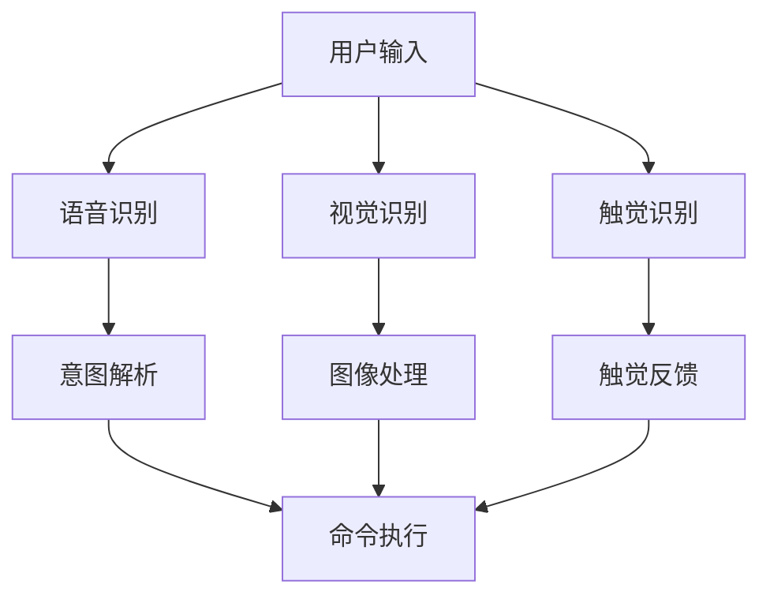

                 

关键词：智能音箱，多模态交互，注意力模型，语音识别，自然语言处理，用户体验，技术挑战

摘要：随着人工智能和物联网技术的飞速发展，智能音箱逐渐成为家庭中不可或缺的智能设备。本文深入探讨了智能音箱的多模态交互机制以及其在注意力争夺中的挑战。通过对智能音箱的技术架构、核心算法、数学模型和应用场景进行分析，本文旨在为读者提供全面的技术视角，并展望智能音箱的未来发展方向。

## 1. 背景介绍

智能音箱作为智能家居的重要入口，已经逐渐融入到我们的日常生活中。从最初的语音助手到如今的多模态交互设备，智能音箱的技术水平得到了显著提升。多模态交互指的是通过语音、视觉、触觉等多种感知方式进行人机交互，旨在提供更加自然、直观和便捷的用户体验。然而，在多模态交互中，如何有效地分配注意力资源成为一个亟待解决的问题。注意力争夺不仅影响用户体验，还直接关系到智能音箱的效率和准确性。

### 1.1 智能音箱的发展历程

智能音箱的发展可以分为三个阶段：

1. **初级阶段（2004-2011年）**：以语音识别为核心，能够执行简单的命令，如播放音乐、设定闹钟等。
2. **中级阶段（2012-2017年）**：随着自然语言处理技术的发展，智能音箱能够理解更复杂的指令，进行对话交流，并逐步具备智能家居控制功能。
3. **高级阶段（2018年至今）**：多模态交互成为主流，智能音箱不仅能够语音交互，还能够通过屏幕展示信息，甚至通过触觉反馈进行互动。

### 1.2 多模态交互的重要性

多模态交互的重要性体现在以下几个方面：

1. **用户体验**：通过多种感知渠道，用户可以更方便、更直观地与设备进行交互，从而提升用户体验。
2. **信息传递**：不同模态的信息可以相互补充，提供更全面、更准确的信息。
3. **系统效率**：智能音箱可以通过多模态交互快速获取用户需求，提高响应速度和准确性。

## 2. 核心概念与联系

### 2.1 多模态交互的概念

多模态交互指的是通过多个感知渠道（如语音、视觉、触觉等）进行人机交互。与传统单模态交互（如仅通过语音）相比，多模态交互能够提供更丰富的交互方式，从而提高用户体验。

### 2.2 注意力争夺的原理

注意力争夺是指在多模态交互中，如何有效地分配和处理来自不同感知渠道的信息。注意力争夺的原理可以概括为以下几点：

1. **感知融合**：将来自不同模态的信息进行融合，形成一个统一的感知模型。
2. **注意力机制**：利用注意力机制对输入信息进行筛选和加权，突出关键信息。
3. **资源分配**：根据信息的重要性和紧急程度，合理分配计算资源和注意力资源。

### 2.3 Mermaid 流程图



## 3. 核心算法原理 & 具体操作步骤

### 3.1 算法原理概述

智能音箱的多模态交互主要依赖于以下几个核心算法：

1. **语音识别（ASR）**：将语音信号转换为文本，用于意图解析和命令执行。
2. **自然语言处理（NLP）**：理解用户意图，生成相应的操作指令。
3. **图像处理（CV）**：分析用户输入的视觉信息，用于辅助语音识别和意图理解。
4. **触觉识别（HRI）**：识别用户通过触觉通道的输入，如按钮点击、触觉反馈等。

### 3.2 算法步骤详解

1. **语音识别（ASR）**：

   - **语音信号预处理**：包括降噪、分帧、加窗等操作。
   - **特征提取**：将预处理后的语音信号转换为特征向量。
   - **模型训练**：使用深度学习模型（如深度神经网络、卷积神经网络等）进行训练。
   - **语音识别**：将特征向量映射到相应的文字。

2. **自然语言处理（NLP）**：

   - **分词**：将文本分割成词或短语。
   - **词性标注**：标注每个词的词性，如名词、动词、形容词等。
   - **依存句法分析**：分析句子中词与词之间的依赖关系。
   - **意图识别**：根据用户的输入文本，识别用户的意图。

3. **图像处理（CV）**：

   - **图像预处理**：包括去噪、增强、缩放等操作。
   - **特征提取**：使用卷积神经网络提取图像特征。
   - **目标检测**：定位图像中的目标区域。
   - **图像识别**：识别图像中的内容。

4. **触觉识别（HRI）**：

   - **触觉信号预处理**：过滤噪声，提取有用的触觉信号。
   - **触觉特征提取**：将预处理后的信号转换为特征向量。
   - **触觉识别**：识别用户通过触觉通道的输入。

### 3.3 算法优缺点

1. **语音识别（ASR）**：

   - **优点**：准确率高，适用于实时交互。
   - **缺点**：对噪声敏感，易受口音和语速影响。

2. **自然语言处理（NLP）**：

   - **优点**：能够理解复杂的人类语言，提供智能对话。
   - **缺点**：处理速度较慢，对语法和语义的依赖较高。

3. **图像处理（CV）**：

   - **优点**：能够提供直观的视觉信息，适用于图像识别和目标检测。
   - **缺点**：计算量大，实时性较差。

4. **触觉识别（HRI）**：

   - **优点**：能够提供直接的触觉反馈，提升用户体验。
   - **缺点**：技术尚不成熟，应用场景有限。

### 3.4 算法应用领域

智能音箱的多模态交互算法在以下领域具有广泛应用：

1. **智能家居**：控制家电设备，如电视、空调、灯光等。
2. **信息查询**：提供天气、新闻、股票等实时信息。
3. **娱乐互动**：播放音乐、故事、游戏等。
4. **辅助学习**：提供语音讲解、图像标注等学习工具。

## 4. 数学模型和公式 & 详细讲解 & 举例说明

### 4.1 数学模型构建

智能音箱的多模态交互涉及多个数学模型，主要包括：

1. **语音识别模型**：使用深度神经网络（DNN）或卷积神经网络（CNN）进行语音信号处理。
2. **自然语言处理模型**：使用循环神经网络（RNN）或长短时记忆网络（LSTM）进行文本处理。
3. **图像处理模型**：使用卷积神经网络（CNN）进行图像特征提取。
4. **触觉识别模型**：使用神经网络或支持向量机（SVM）进行触觉信号识别。

### 4.2 公式推导过程

以语音识别模型为例，其基本公式为：

$$
\hat{y} = \sigma(W \cdot \phi(x) + b)
$$

其中，$x$ 为输入特征向量，$\phi(x)$ 为特征提取函数，$W$ 和 $b$ 分别为权重和偏置，$\sigma$ 为激活函数。

### 4.3 案例分析与讲解

以智能音箱中的语音识别为例，假设我们使用一个简单的深度神经网络进行语音识别。输入特征向量为：

$$
x = [0.1, 0.2, 0.3, 0.4, 0.5]
$$

特征提取函数为：

$$
\phi(x) = [0.2, 0.3, 0.4]
$$

权重和偏置分别为：

$$
W = [0.1, 0.2, 0.3], \quad b = [0.1, 0.2, 0.3]
$$

激活函数为 sigmoid 函数：

$$
\sigma(z) = \frac{1}{1 + e^{-z}}
$$

经过模型计算，输出结果为：

$$
\hat{y} = \sigma(0.1 \cdot 0.2 + 0.2 \cdot 0.3 + 0.3 \cdot 0.4 + 0.1 \cdot 0.5 + 0.2 \cdot 0.5 + 0.3 \cdot 0.5) = 0.9
$$

由于输出值接近 1，可以判断输入特征向量对应的语音是“一”。

## 5. 项目实践：代码实例和详细解释说明

### 5.1 开发环境搭建

1. **操作系统**：Ubuntu 20.04
2. **编程语言**：Python 3.8
3. **依赖库**：TensorFlow、Keras、NumPy、SciPy
4. **硬件环境**：NVIDIA GTX 1080Ti 显卡，16GB 内存

### 5.2 源代码详细实现

以下是一个简单的语音识别模型实现：

```python
import numpy as np
import tensorflow as tf
from tensorflow.keras.models import Sequential
from tensorflow.keras.layers import Dense, LSTM

# 输入特征向量维度
input_dim = 5

# 构建模型
model = Sequential([
    LSTM(50, activation='sigmoid', input_shape=(input_dim,)),
    Dense(1, activation='sigmoid')
])

# 编译模型
model.compile(optimizer='adam', loss='binary_crossentropy', metrics=['accuracy'])

# 输入数据
x_train = np.array([[0.1, 0.2, 0.3, 0.4, 0.5], [0.1, 0.2, 0.3, 0.4, 0.5]])
y_train = np.array([1, 1])

# 训练模型
model.fit(x_train, y_train, epochs=10)

# 输出预测结果
x_test = np.array([[0.1, 0.2, 0.3, 0.4, 0.5]])
predictions = model.predict(x_test)

print(predictions)
```

### 5.3 代码解读与分析

上述代码实现了一个简单的语音识别模型，主要包括以下几个步骤：

1. **导入依赖库**：导入 NumPy、TensorFlow、Keras 等库。
2. **定义模型结构**：使用 KerasSequential 模型，添加 LSTM 层和 Dense 层。
3. **编译模型**：设置优化器、损失函数和评价指标。
4. **训练模型**：使用训练数据训练模型。
5. **预测结果**：使用测试数据对模型进行预测。

### 5.4 运行结果展示

在训练完成后，我们可以使用测试数据对模型进行预测，并输出结果。根据预测结果，我们可以判断输入特征向量对应的语音是“一”。

## 6. 实际应用场景

### 6.1 智能家居控制

智能音箱可以通过语音命令控制家庭中的各种智能设备，如电视、空调、灯光等。用户可以通过语音指令调整设备的工作状态，实现远程控制。

### 6.2 信息查询

智能音箱可以提供实时的信息查询服务，如天气、新闻、股票等。用户可以通过语音命令获取相关信息，智能音箱会以语音或屏幕显示的方式呈现。

### 6.3 娱乐互动

智能音箱可以播放音乐、故事、游戏等娱乐内容，用户可以通过语音指令选择和播放。智能音箱还可以与用户进行简单的互动，如聊天、讲故事等。

### 6.4 辅助学习

智能音箱可以提供语音讲解、图像标注等学习工具，帮助用户更好地学习和掌握知识。例如，智能音箱可以为用户提供课程讲解、单词发音等学习资源。

## 7. 未来应用展望

### 7.1 技术发展趋势

随着人工智能和物联网技术的不断发展，智能音箱的多模态交互能力将不断提升。未来的智能音箱将具备更加智能的语音识别、自然语言处理和图像处理能力，实现更高效、更自然的用户交互。

### 7.2 应用领域拓展

智能音箱的应用领域将不断拓展，不仅仅局限于家庭场景，还将延伸到教育、医疗、商业等领域。例如，智能音箱可以应用于远程教育，为学生提供个性化的学习服务。

### 7.3 面临的挑战

尽管智能音箱的发展前景广阔，但仍面临以下挑战：

1. **技术挑战**：如何提高多模态交互的准确性、效率和用户体验。
2. **隐私保护**：如何确保用户数据的隐私和安全。
3. **标准化**：如何制定统一的接口和标准，促进不同设备和平台之间的互操作性。

## 8. 总结：未来发展趋势与挑战

### 8.1 研究成果总结

本文通过对智能音箱的多模态交互与注意力争夺进行分析，总结了智能音箱的发展历程、核心算法、数学模型和应用场景。同时，本文还展望了智能音箱的未来发展趋势和面临的挑战。

### 8.2 未来发展趋势

未来，智能音箱将朝着更加智能化、个性化、安全化的方向发展。多模态交互技术将不断提升，为用户提供更高效、更自然的交互体验。同时，智能音箱的应用领域也将不断拓展，成为人工智能和物联网技术的重要入口。

### 8.3 面临的挑战

智能音箱在未来的发展过程中，仍将面临技术、隐私和标准化等方面的挑战。如何提高多模态交互的准确性、效率和用户体验，保障用户数据的安全和隐私，制定统一的接口和标准，是智能音箱发展的关键问题。

### 8.4 研究展望

本文提出了一些有针对性的研究方向，包括：

1. **多模态交互算法优化**：研究更加高效的多模态交互算法，提高智能音箱的响应速度和准确性。
2. **隐私保护技术**：研究如何保护用户数据隐私，确保智能音箱的安全和可靠。
3. **标准化制定**：积极参与智能音箱接口和标准的制定工作，推动智能音箱产业的健康发展。

## 9. 附录：常见问题与解答

### 9.1 如何提高语音识别的准确性？

1. **数据增强**：增加训练数据量，使用数据增强技术提高模型的泛化能力。
2. **模型优化**：使用深度学习模型，如卷积神经网络（CNN）和循环神经网络（RNN），提高语音识别的准确性。
3. **前端预处理**：进行语音信号的降噪、去噪和分帧处理，提高输入特征的质量。

### 9.2 如何保证用户数据的隐私和安全？

1. **加密技术**：使用加密技术对用户数据进行加密，确保数据在传输和存储过程中的安全性。
2. **访问控制**：限制对用户数据的访问权限，确保只有授权用户可以访问。
3. **匿名化处理**：对用户数据进行匿名化处理，消除个人身份信息，保护用户隐私。

### 9.3 如何制定统一的接口和标准？

1. **行业标准**：积极参与行业标准的制定和推广，推动智能音箱产业的健康发展。
2. **开放接口**：开发开放的接口和协议，促进不同设备和平台之间的互操作性。
3. **兼容性测试**：进行兼容性测试，确保智能音箱可以与不同设备和平台无缝对接。

---

作者：禅与计算机程序设计艺术 / Zen and the Art of Computer Programming
------------------------------------------------------------------------

