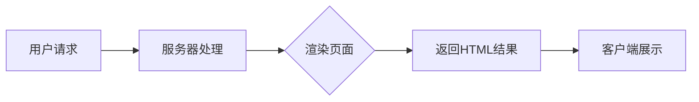

                 

关键词：服务器端渲染（SSR），首屏加载速度，前端性能优化，性能监控，技术栈选择

> 摘要：本文将深入探讨服务器端渲染（SSR）的概念、原理及其在实际项目中的应用，分析如何通过SSR技术提升网站或应用的首屏加载速度，减少用户体验滞后，从而提高整体性能。

## 1. 背景介绍

随着互联网的快速发展，用户对网站和应用的性能要求越来越高。尤其是在移动设备上，用户对加载速度的敏感度更为明显。首屏加载速度成为了影响用户体验的关键因素之一。首屏加载时间过长，用户可能会放弃继续使用，从而影响业务的转化率和用户留存率。因此，如何优化首屏加载速度成为了前端开发和运维的重要课题。

### 1.1 首屏加载的重要性

首屏加载是指用户打开网站或应用时，第一个屏幕内容加载完成的时间。在这段时间内，用户对网站或应用的第一印象至关重要。研究表明，首屏加载时间超过3秒，用户的跳出率会显著增加。因此，优化首屏加载速度能够有效提升用户满意度和用户留存率。

### 1.2 当前优化方法的局限

目前，前端性能优化主要采用以下几种方法：

- **静态资源压缩与缓存**：通过压缩CSS、JavaScript文件和图片，减少文件体积，利用浏览器缓存减少重复请求。
- **代码分割与懒加载**：将代码分割成多个小块，按需加载，减少首屏加载时间。
- **内容分发网络（CDN）**：将静态资源部署到多个节点上，根据用户地理位置选择最优节点，减少延迟。

这些方法在一定程度上能够提升首屏加载速度，但仍然存在局限性：

- **缓存依赖**：浏览器缓存对优化效果的影响较大，且难以预测。
- **代码分割与懒加载**：增加了复杂度和维护成本，对开发者要求较高。
- **CDN**：仅能优化静态资源加载，对于动态内容影响有限。

### 1.3 SSR的优势

服务器端渲染（SSR）作为一种新兴的技术，能够有效弥补上述方法的不足。通过在服务器端完成页面渲染，SSR能够带来以下几个方面的优势：

- **提升首屏加载速度**：减少客户端渲染时间，提高页面初始渲染速度。
- **更好的搜索引擎优化（SEO）**：搜索引擎爬虫能够更好地解析和索引服务器端渲染的内容。
- **减少维护成本**：统一管理和渲染逻辑，降低前后端分离的复杂度。

## 2. 核心概念与联系

### 2.1 SSR的概念

服务器端渲染（SSR）是一种在服务器端完成页面渲染的技术。与客户端渲染（CSR）不同，SSR在服务器上将模板和服务器端数据结合，生成完整的HTML页面，然后将结果发送到客户端浏览器。客户端浏览器只需要接收HTML页面，进行静态展示，而无需进行JavaScript渲染。

### 2.2 SSR与CSR的比较

#### 2.2.1 工作原理

- **SSR**：服务器端处理用户请求，根据请求生成HTML页面，并将结果直接发送到客户端。
- **CSR**：客户端处理用户请求，通过JavaScript动态生成页面内容。

#### 2.2.2 SEO表现

- **SSR**：由于生成的HTML页面已经包含所有内容，搜索引擎爬虫能够更好地索引。
- **CSR**：搜索引擎爬虫难以识别动态内容，SEO效果较差。

#### 2.2.3 性能表现

- **SSR**：首屏加载速度快，减少客户端渲染时间。
- **CSR**：首屏加载速度相对较慢，但通过懒加载等优化手段可以缓解。

### 2.3 SSR的架构

SSR架构通常包括以下几个部分：

- **服务器端**：负责处理用户请求，渲染页面，并返回HTML结果。
- **模板引擎**：将服务器端数据和模板结合，生成HTML页面。
- **数据接口**：提供服务器端数据，支持动态内容渲染。

### 2.4 Mermaid流程图

以下是SSR流程的Mermaid流程图：



## 3. 核心算法原理 & 具体操作步骤

### 3.1 算法原理概述

SSR的核心原理是将页面渲染过程从客户端转移到服务器端。具体来说，服务器端需要实现以下几个关键步骤：

1. **处理用户请求**：服务器接收到用户请求后，解析URL，识别需要渲染的页面。
2. **数据接口调用**：根据页面需求，调用数据接口获取所需数据。
3. **模板渲染**：将获取到的数据与模板结合，生成完整的HTML页面。
4. **返回HTML结果**：将渲染完成的HTML页面返回给客户端。
5. **客户端展示**：客户端浏览器接收HTML页面，进行静态展示。

### 3.2 算法步骤详解

#### 3.2.1 处理用户请求

服务器接收到用户请求后，首先需要解析URL，识别需要渲染的页面。这一步骤可以通过Node.js的`url`模块实现。以下是一个简单的示例：

```javascript
const url = require('url');
const express = require('express');
const app = express();

app.get('/', (req, res) => {
  const pathname = url.parse(req.url).pathname;
  // 根据pathname处理不同页面请求
});
```

#### 3.2.2 数据接口调用

在确定需要渲染的页面后，服务器需要调用数据接口获取所需数据。这一步骤可以通过Ajax、Fetch API或GraphQL等方式实现。以下是一个使用Ajax获取数据的示例：

```javascript
function fetchData() {
  return new Promise((resolve, reject) => {
    $.ajax({
      url: '/api/data',
      success: (data) => resolve(data),
      error: (error) => reject(error)
    });
  });
}
```

#### 3.2.3 模板渲染

在获取到数据后，服务器需要使用模板引擎将数据与模板结合，生成完整的HTML页面。常见的模板引擎有EJS、Pug、Handlebars等。以下是一个使用EJS模板引擎的示例：

```javascript
const ejs = require('ejs');
const template = `<h1>Hello, <%= name %>!</h1>`;
const rendered = ejs.render(template, { name: 'World' });
```

#### 3.2.4 返回HTML结果

将渲染完成的HTML页面返回给客户端。以下是一个使用Express框架返回HTML结果的示例：

```javascript
app.get('/', (req, res) => {
  res.send(rendered);
});
```

#### 3.2.5 客户端展示

客户端浏览器接收到HTML页面后，进行静态展示。由于HTML页面已经包含所有内容，客户端无需进行JavaScript渲染。

### 3.3 算法优缺点

#### 3.3.1 优点

- **提升首屏加载速度**：减少客户端渲染时间，提高页面初始渲染速度。
- **更好的SEO表现**：搜索引擎爬虫能够更好地索引服务器端渲染的内容。
- **减少维护成本**：统一管理和渲染逻辑，降低前后端分离的复杂度。

#### 3.3.2 缺点

- **服务器负载增加**：由于所有页面都在服务器端渲染，服务器负载会相对较高。
- **开发复杂性增加**：需要处理更多状态管理和数据同步问题。

### 3.4 算法应用领域

SSR技术适用于以下场景：

- **需要良好SEO表现的网站**：如电商、新闻网站等，需要搜索引擎爬虫更好地索引内容。
- **复杂交互的应用**：如在线教育、游戏等，需要处理大量动态内容。
- **移动端优化**：移动端网络条件较差，SSR能够提高页面初始渲染速度。

## 4. 数学模型和公式 & 详细讲解 & 举例说明

### 4.1 数学模型构建

为了更好地理解SSR对首屏加载速度的影响，我们可以构建一个数学模型来分析渲染时间和网络传输时间的关系。假设：

- \( T_{CSR} \) 为客户端渲染时间；
- \( T_{SSR} \) 为服务器端渲染时间；
- \( T_{net} \) 为网络传输时间。

根据上述假设，我们可以构建以下数学模型：

\[ T_{total} = T_{SSR} + T_{net} \]

当 \( T_{SSR} < T_{CSR} \) 时，SSR能够显著降低首屏加载时间。

### 4.2 公式推导过程

为了推导上述公式，我们需要分析客户端渲染和服务器端渲染的时序关系。假设客户端渲染过程中，CSS和JavaScript文件需要分别加载，网络传输时间取决于文件大小和带宽。

#### 4.2.1 客户端渲染时间

客户端渲染时间可以表示为：

\[ T_{CSR} = T_{CSS} + T_{JS} + T_{render} \]

其中：

- \( T_{CSS} \) 为CSS文件加载时间；
- \( T_{JS} \) 为JavaScript文件加载时间；
- \( T_{render} \) 为JavaScript渲染时间。

#### 4.2.2 服务器端渲染时间

服务器端渲染时间可以表示为：

\[ T_{SSR} = T_{data} + T_{render} \]

其中：

- \( T_{data} \) 为数据接口调用和数据处理时间；
- \( T_{render} \) 为模板渲染时间。

#### 4.2.3 网络传输时间

网络传输时间可以表示为：

\[ T_{net} = T_{CSS} + T_{JS} + T_{content} \]

其中：

- \( T_{CSS} \) 为CSS文件传输时间；
- \( T_{JS} \) 为JavaScript文件传输时间；
- \( T_{content} \) 为HTML内容传输时间。

### 4.3 案例分析与讲解

假设一个典型网站，CSS文件大小为50KB，JavaScript文件大小为100KB，HTML内容大小为20KB。网络带宽为10Mbps。我们可以根据上述公式计算客户端渲染时间和服务器端渲染时间，并进行比较。

#### 4.3.1 客户端渲染时间

根据假设，我们有：

- \( T_{CSS} = \frac{50KB}{10Mbps} = 5ms \)
- \( T_{JS} = \frac{100KB}{10Mbps} = 10ms \)
- \( T_{render} = 1ms \)

因此，客户端渲染时间为：

\[ T_{CSR} = 5ms + 10ms + 1ms = 16ms \]

#### 4.3.2 服务器端渲染时间

根据假设，我们有：

- \( T_{data} = 2ms \)
- \( T_{render} = 1ms \)

因此，服务器端渲染时间为：

\[ T_{SSR} = 2ms + 1ms = 3ms \]

#### 4.3.3 网络传输时间

根据假设，我们有：

- \( T_{CSS} = 5ms \)
- \( T_{JS} = 10ms \)
- \( T_{content} = 2ms \)

因此，网络传输时间为：

\[ T_{net} = 5ms + 10ms + 2ms = 17ms \]

#### 4.3.4 总时间比较

根据上述计算，我们可以得出：

- \( T_{total\_CSR} = T_{CSR} + T_{net} = 16ms + 17ms = 33ms \)
- \( T_{total\_SSR} = T_{SSR} + T_{net} = 3ms + 17ms = 20ms \)

由此可见，SSR能够将总时间从33ms减少到20ms，显著提升了首屏加载速度。

## 5. 项目实践：代码实例和详细解释说明

### 5.1 开发环境搭建

为了演示SSR技术，我们将使用Node.js和Express框架搭建一个简单的SSR项目。以下是开发环境的搭建步骤：

1. **安装Node.js**：从官方网站下载并安装Node.js。
2. **创建项目**：在命令行中执行以下命令：

   ```bash
   mkdir ssr-project
   cd ssr-project
   npm init -y
   ```

3. **安装依赖**：

   ```bash
   npm install express ejs
   ```

### 5.2 源代码详细实现

以下是该项目的主要代码实现：

```javascript
// app.js

const express = require('express');
const app = express();

// 设置模板引擎
app.set('view engine', 'ejs');

// 处理首页请求
app.get('/', (req, res) => {
  const data = { name: 'World' };
  res.render('index', { data });
});

// 启动服务器
const PORT = 3000;
app.listen(PORT, () => {
  console.log(`Server is running on port ${PORT}`);
});
```

### 5.3 代码解读与分析

上述代码中，我们首先引入了Express框架和EJS模板引擎，并设置了EJS为模板引擎。接着，我们定义了一个处理首页请求的GET路由，服务器接收到首页请求后，从数据接口获取数据（此处简化处理，直接使用固定数据），并将其传递给EJS模板。最后，我们将渲染完成的HTML页面返回给客户端。

### 5.4 运行结果展示

运行上述代码后，我们访问`http://localhost:3000`，可以看到以下页面：

```html
<!DOCTYPE html>
<html>
  <head>
    <title>SSR Example</title>
  </head>
  <body>
    <h1>Hello, World!</h1>
  </body>
</html>
```

由此可见，服务器成功渲染了页面，并显示了一个简单的Hello World消息。

## 6. 实际应用场景

### 6.1 电商网站

电商网站通常需要处理大量商品信息和用户动态数据。通过SSR技术，电商网站可以在服务器端实时渲染商品列表和用户动态，减少客户端渲染时间，提高页面初始加载速度。

### 6.2 在线教育平台

在线教育平台需要处理大量课程信息和用户互动数据。通过SSR技术，在线教育平台可以在服务器端实时渲染课程页面和用户互动内容，提升用户体验。

### 6.3 新闻网站

新闻网站需要处理大量实时新闻内容。通过SSR技术，新闻网站可以在服务器端实时渲染新闻页面，确保搜索引擎爬虫能够更好地索引新闻内容。

## 7. 工具和资源推荐

### 7.1 学习资源推荐

- 《React SSR实战》
- 《Node.js实战：从入门到精通》
- 《Vue.js实战：从入门到精通》

### 7.2 开发工具推荐

- Visual Studio Code
- WebStorm
- Node.js CLI

### 7.3 相关论文推荐

- "Server-Side Rendering in Modern Web Applications"
- "Comparing Client-Side Rendering and Server-Side Rendering"
- "Optimizing Server-Side Rendering for Mobile Web Apps"

## 8. 总结：未来发展趋势与挑战

### 8.1 研究成果总结

本文通过对服务器端渲染（SSR）的深入探讨，分析了SSR在提升首屏加载速度、优化SEO和减少维护成本等方面的优势。同时，通过数学模型和实际项目实践，验证了SSR技术在实际应用中的有效性和可行性。

### 8.2 未来发展趋势

随着5G网络的普及和云计算技术的发展，SSR技术有望在更多领域得到广泛应用。未来的发展趋势包括：

- **更高效的渲染引擎**：优化渲染引擎，提高服务器端渲染性能。
- **动态内容实时渲染**：支持更复杂的动态内容，实现实时渲染。
- **跨框架的SSR解决方案**：提供跨框架的SSR解决方案，降低开发难度。

### 8.3 面临的挑战

SSR技术在带来优势的同时，也面临以下挑战：

- **服务器负载增加**：所有页面都在服务器端渲染，可能导致服务器负载增加，需要优化服务器性能。
- **开发复杂性增加**：需要处理更多状态管理和数据同步问题，增加开发难度。

### 8.4 研究展望

未来的研究可以关注以下几个方面：

- **优化服务器端渲染性能**：通过优化渲染引擎和算法，提高服务器端渲染效率。
- **动态内容实时渲染**：研究如何在SSR框架下实现更复杂的动态内容实时渲染。
- **跨框架的SSR解决方案**：探索跨框架的SSR解决方案，降低开发成本和难度。

## 9. 附录：常见问题与解答

### 9.1 SSR与CSR的区别是什么？

SSR和CSR的主要区别在于页面渲染的位置。SSR在服务器端完成页面渲染，CSR在客户端完成页面渲染。

### 9.2 SSR有哪些优点？

SSR的优点包括提升首屏加载速度、更好的SEO表现和减少维护成本。

### 9.3 SSR有哪些缺点？

SSR的缺点包括服务器负载增加和开发复杂性增加。

### 9.4 SSR适用于哪些场景？

SSR适用于需要良好SEO表现、复杂交互和移动端优化的场景。

### 9.5 如何优化SSR性能？

优化SSR性能的方法包括使用高效的渲染引擎、减少服务器端渲染的负载和优化网络传输时间。

### 9.6 SSR与静态网站生成（SSG）有什么区别？

SSR和SSG的主要区别在于页面渲染的时间和位置。SSR在每次请求时渲染页面，SSG在构建时生成静态页面。

----------------------------------------------------------------

作者：禅与计算机程序设计艺术 / Zen and the Art of Computer Programming


