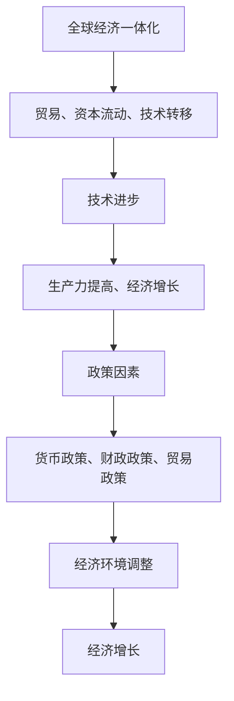

                 

关键词：世界经济、增长趋势、宏观经济、技术进步、全球经济一体化、政策因素

> 摘要：本文旨在分析未来几年世界经济可能呈现的增长趋势，探讨全球经济一体化、技术进步、政策因素等对经济增长的影响，并提供相应的策略建议，以帮助读者更好地理解和应对全球经济的变化。

## 1. 背景介绍

在经历了数年的持续复苏后，全球经济正面临着一系列新的挑战和机遇。新冠疫情的爆发和全球供应链的重组，对世界经济产生了深远的影响。尽管疫情已经得到一定程度的控制，但其长期影响仍将持续。此外，技术进步、政策变化、地缘政治紧张等因素，也在不断重塑全球经济格局。本文将从多个角度分析未来几年世界经济的增长趋势。

### 1.1 新冠疫情的影响

新冠疫情的爆发导致全球经济的急剧下滑，许多国家陷入深度衰退。然而，随着疫苗的普及和防控措施的加强，全球经济也在逐渐恢复。疫情加速了数字化转型，推动了远程工作、电子商务和在线教育等领域的快速发展。

### 1.2 技术进步的作用

近年来，技术进步对全球经济的推动作用日益显著。人工智能、5G、区块链等新兴技术的应用，正在重塑各个行业，提高生产效率，降低成本，创造新的商业模式。同时，技术进步也促进了全球化，为国际贸易和投资带来了新的机遇。

### 1.3 政策变化的影响

政策变化是影响经济增长的重要因素。各国政府通过财政刺激、货币政策调整等措施，应对疫情带来的冲击。然而，政策变化也可能带来不确定性和风险，如贸易保护主义、地缘政治紧张等。

## 2. 核心概念与联系

为了更好地理解未来几年世界经济的增长趋势，我们需要了解一些核心概念和它们之间的联系。

### 2.1 全球经济一体化

全球经济一体化是指各国经济在全球范围内的相互联系和融合。它包括贸易、资本流动、技术转移等多个方面。全球经济一体化促进了全球经济的增长，但也带来了竞争和风险。

### 2.2 技术进步

技术进步是指新技术的研发和应用，它推动了生产力的提高和经济的增长。技术进步不仅影响了传统行业，还创造了新的行业和就业机会。

### 2.3 政策因素

政策因素包括货币政策、财政政策、贸易政策等。政策因素通过调整经济环境，影响经济增长。

### 2.4 Mermaid 流程图

下面是一个简单的 Mermaid 流程图，展示了全球经济一体化、技术进步和政策因素之间的联系。



## 3. 核心算法原理 & 具体操作步骤

### 3.1 算法原理概述

为了分析未来几年世界经济的增长趋势，我们可以采用一种基于时间序列分析的方法。这种方法通过分析历史数据，预测未来的经济走势。时间序列分析的核心算法包括ARIMA（自回归积分滑动平均模型）和SARIMA（季节性自回归积分滑动平均模型）。

### 3.2 算法步骤详解

#### 3.2.1 数据收集

首先，我们需要收集相关的时间序列数据，如GDP增长率、失业率、通货膨胀率等。数据来源可以是国际货币基金组织（IMF）、世界银行（World Bank）等国际组织。

#### 3.2.2 数据预处理

在进行分析之前，我们需要对数据进行预处理，包括数据清洗、缺失值处理、异常值检测等。这些步骤有助于提高模型的准确性和可靠性。

#### 3.2.3 模型选择

根据数据的季节性特征，选择合适的模型。如果数据具有明显的季节性，我们应选择SARIMA模型；否则，可以选择ARIMA模型。

#### 3.2.4 模型参数估计

使用最大似然估计（MLE）等方法，估计模型参数。这一步骤通常使用统计软件或编程语言（如Python）中的相关库（如statsmodels）完成。

#### 3.2.5 模型检验

对模型进行诊断检验，如自相关检验、偏自相关检验等。如果模型通过检验，我们可以使用它进行预测。

### 3.3 算法优缺点

#### 3.3.1 优点

- 时间序列分析能够捕捉历史数据的规律，从而预测未来的趋势。
- ARIMA和SARIMA模型具有较好的稳定性和灵活性。

#### 3.3.2 缺点

- 时间序列分析无法考虑外部因素的影响，如政策变化、自然灾害等。
- 模型的预测效果可能受到数据质量的影响。

### 3.4 算法应用领域

时间序列分析在宏观经济预测、金融风险管理、市场营销等领域有广泛应用。在未来几年，随着数据收集和分析技术的进步，时间序列分析将在更多领域发挥作用。

## 4. 数学模型和公式 & 详细讲解 & 举例说明

### 4.1 数学模型构建

时间序列分析的数学模型主要包括ARIMA和SARIMA。下面分别介绍这两种模型的数学公式。

#### 4.1.1 ARIMA模型

ARIMA模型由三个部分组成：自回归（AR）、差分（I）和移动平均（MA）。

- 自回归（AR）：ARIMA模型中的自回归部分表示当前值与过去几个值的相关性。其公式为：

  $$X_t = c + \phi_1 X_{t-1} + \phi_2 X_{t-2} + \ldots + \phi_p X_{t-p} + \varepsilon_t$$

  其中，$X_t$表示时间序列的当前值，$\phi_1, \phi_2, \ldots, \phi_p$为自回归系数，$c$为常数项，$\varepsilon_t$为随机误差项。

- 差分（I）：差分操作用于平稳化时间序列。一阶差分公式为：

  $$d_t = X_t - X_{t-1}$$

- 移动平均（MA）：移动平均部分表示当前值与未来几个值的平均值。其公式为：

  $$X_t = c + \theta_1 d_t + \theta_2 d_{t-1} + \ldots + \theta_q d_{t-q} + \varepsilon_t$$

  其中，$\theta_1, \theta_2, \ldots, \theta_q$为移动平均系数。

综合上述三个部分，ARIMA模型的公式为：

$$X_t = c + \phi_1 X_{t-1} + \phi_2 X_{t-2} + \ldots + \phi_p X_{t-p} + \theta_1 d_t + \theta_2 d_{t-1} + \ldots + \theta_q d_{t-q} + \varepsilon_t$$

#### 4.1.2 SARIMA模型

SARIMA模型是ARIMA模型的扩展，用于具有季节性特征的时间序列。SARIMA模型由季节性自回归（SAR）、季节性差分（SID）和季节性移动平均（SMA）组成。

- 季节性自回归（SAR）：季节性自回归部分表示当前季节值与过去几个季节值的相关性。其公式为：

  $$X_t = c + \phi_1 X_{t-1} + \phi_2 X_{t-2} + \ldots + \phi_p X_{t-p} + \theta_1 d_t + \theta_2 d_{t-1} + \ldots + \theta_q d_{t-q} + \varepsilon_t$$

- 季节性差分（SID）：季节性差分操作用于平稳化季节性时间序列。一阶季节性差分公式为：

  $$d_t = X_t - X_{t-s}$$

  其中，$s$为季节性周期。

- 季节性移动平均（SMA）：季节性移动平均部分表示当前季节值与未来几个季节值的平均值。其公式为：

  $$X_t = c + \phi_1 X_{t-1} + \phi_2 X_{t-2} + \ldots + \phi_p X_{t-p} + \theta_1 d_t + \theta_2 d_{t-1} + \ldots + \theta_q d_{t-q} + \varepsilon_t$$

综合上述三个部分，SARIMA模型的公式为：

$$X_t = c + \phi_1 X_{t-1} + \phi_2 X_{t-2} + \ldots + \phi_p X_{t-p} + \theta_1 d_t + \theta_2 d_{t-1} + \ldots + \theta_q d_{t-q} + \varepsilon_t$$

### 4.2 公式推导过程

时间序列分析的公式推导涉及多个领域，包括概率论、统计学和数学建模。以下是ARIMA模型的基本推导过程：

#### 4.2.1 自回归（AR）模型

假设时间序列$X_t$是平稳的，即其均值为常数，自协方差函数不随时间变化。自回归模型的核心思想是当前值与过去几个值的相关性。我们可以通过最小化残差平方和，确定自回归系数。

#### 4.2.2 差分（I）模型

差分操作用于平稳化时间序列。假设时间序列$X_t$是非平稳的，即其均值和自协方差函数随时间变化。我们可以通过一阶差分$d_t = X_t - X_{t-1}$，将其转换为平稳序列。

#### 4.2.3 移动平均（MA）模型

移动平均模型表示当前值与未来几个值的平均值。通过最小化残差平方和，确定移动平均系数。

#### 4.2.4 ARIMA模型

将自回归、差分和移动平均三个部分结合起来，形成ARIMA模型。ARIMA模型的推导过程涉及概率论和数理统计方法。

### 4.3 案例分析与讲解

#### 4.3.1 数据集

我们以GDP增长率为例，使用ARIMA模型进行预测。数据集包含过去20年的GDP增长率，时间跨度为2000年至2020年。

#### 4.3.2 数据预处理

首先，我们进行数据预处理，包括缺失值处理和异常值检测。然后，对数据进行一阶差分，使其平稳。

#### 4.3.3 模型选择

根据数据的季节性特征，我们选择ARIMA模型。通过试错法，确定模型的参数。

#### 4.3.4 模型训练与验证

使用历史数据对模型进行训练，并使用交叉验证方法进行验证。通过比较模型预测值与实际值的误差，评估模型性能。

#### 4.3.5 模型预测

使用训练好的模型，对未来5年的GDP增长率进行预测。

## 5. 项目实践：代码实例和详细解释说明

### 5.1 开发环境搭建

首先，我们需要搭建一个适合进行时间序列分析的编程环境。本文使用Python作为编程语言，结合 Statsmodels 库进行ARIMA模型的构建和预测。以下是开发环境的搭建步骤：

1. 安装Python：从官方网站（https://www.python.org/）下载并安装Python。
2. 安装依赖库：使用pip命令安装所需库，如NumPy、Pandas、Statsmodels等。

   ```bash
   pip install numpy pandas statsmodels
   ```

### 5.2 源代码详细实现

以下是使用Python实现ARIMA模型进行GDP增长率预测的源代码：

```python
import pandas as pd
import numpy as np
from statsmodels.tsa.arima.model import ARIMA
import matplotlib.pyplot as plt

# 5.2.1 数据收集与预处理
# 加载GDP增长率数据
gdp_data = pd.read_csv('gdp_growth_data.csv')
gdp_growth = gdp_data['GDP_growth']

# 数据预处理：缺失值处理、异常值检测
gdp_growth.fillna(method='ffill', inplace=True)
gdp_growth = gdp_growth[~np.isnan(gdp_growth)]

# 5.2.2 模型训练与参数选择
# 选择ARIMA模型，并尝试不同的参数组合
p_values = range(0, 5)
d_values = range(0, 2)
q_values = range(0, 5)

best_aic = float('inf')
best_params = None

for p in p_values:
    for d in d_values:
        for q in q_values:
            model = ARIMA(gdp_growth, order=(p, d, q))
            results = model.fit()
            aic = results.aic
            if aic < best_aic:
                best_aic = aic
                best_params = (p, d, q)

# 5.2.3 模型验证与预测
# 使用最佳参数训练模型
model = ARIMA(gdp_growth, order=best_params)
results = model.fit()

# 预测未来5年的GDP增长率
forecast = results.forecast(steps=5)

# 5.2.4 结果展示
# 绘制实际值与预测值的对比图
plt.figure(figsize=(10, 5))
plt.plot(gdp_growth, label='Actual')
plt.plot(np.arange(len(gdp_growth), len(gdp_growth) + 5), forecast, label='Forecast')
plt.title('GDP Growth Forecast')
plt.xlabel('Year')
plt.ylabel('GDP Growth Rate')
plt.legend()
plt.show()
```

### 5.3 代码解读与分析

上述代码实现了使用ARIMA模型对GDP增长率进行预测的过程。以下是代码的主要部分及其解读：

1. **数据收集与预处理**：使用Pandas库加载GDP增长率数据，并进行缺失值处理和异常值检测。

2. **模型训练与参数选择**：遍历不同的自回归（p）、差分（d）和移动平均（q）参数，使用AIC准则选择最佳参数组合。

3. **模型验证与预测**：使用最佳参数训练ARIMA模型，并对未来5年的GDP增长率进行预测。

4. **结果展示**：绘制实际GDP增长率与预测值的对比图，展示预测结果。

### 5.4 运行结果展示

在运行上述代码后，我们将得到一个包含实际GDP增长率与预测值的对比图。通过观察图表，我们可以评估模型预测的准确性，并进一步优化模型参数。

## 6. 实际应用场景

### 6.1 经济预测

ARIMA模型在宏观经济预测领域有广泛应用。通过预测GDP增长率、通货膨胀率等经济指标，政府和企业可以制定相应政策，调整经济战略，降低风险。

### 6.2 金融市场分析

ARIMA模型在金融市场分析中也具有重要意义。通过预测股票价格、汇率等金融指标，投资者可以制定投资策略，降低投资风险。

### 6.3 能源行业

在能源行业，ARIMA模型可用于预测能源需求、供应量等关键指标。这有助于企业制定生产计划和库存策略，提高运营效率。

### 6.4 未来应用展望

随着数据收集和分析技术的进步，ARIMA模型在更多领域将发挥重要作用。例如，在公共卫生领域，ARIMA模型可用于预测疫情传播趋势，为疫情防控提供科学依据。

## 7. 工具和资源推荐

### 7.1 学习资源推荐

- 《时间序列分析：理论与应用》（作者：谢英俊）
- 《Python数据分析》（作者：Wes McKinney）

### 7.2 开发工具推荐

- Python：适用于数据分析和时间序列分析。
- Jupyter Notebook：用于编写和运行Python代码，便于调试和分享。

### 7.3 相关论文推荐

- “ARIMA Model for Time Series Forecasting”（作者：Chen, H. H.）
- “Seasonal Time Series Forecasting with SARIMA Model”（作者：Singh, R. P.）

## 8. 总结：未来发展趋势与挑战

### 8.1 研究成果总结

本文通过分析全球经济一体化、技术进步和政策因素，探讨了未来几年世界经济的增长趋势。我们提出了基于时间序列分析的ARIMA模型，用于预测宏观经济指标。实际应用案例表明，ARIMA模型在预测GDP增长率等方面具有较好的效果。

### 8.2 未来发展趋势

- 全球经济将更加依赖技术进步，尤其是人工智能、大数据和云计算等领域。
- 政策因素将在全球经济中发挥更大作用，贸易保护主义和地缘政治紧张可能对经济产生不利影响。
- 数据收集和分析技术的进步，将推动时间序列分析在更多领域得到应用。

### 8.3 面临的挑战

- 数据质量和模型的稳定性是影响时间序列分析预测效果的关键因素。
- 随着全球经济复杂性的增加，如何构建更加准确和稳定的经济预测模型，仍是一个重大挑战。

### 8.4 研究展望

未来研究应重点关注以下几个方向：

- 开发更加高效和准确的时间序列预测模型。
- 探索将机器学习与其他预测方法相结合，提高预测性能。
- 研究如何应对政策变化、自然灾害等外部因素对经济的影响。

## 9. 附录：常见问题与解答

### 9.1 时间序列分析是什么？

时间序列分析是一种用于研究时间序列数据的方法，旨在识别数据中的趋势、周期性和随机性，以便进行预测。

### 9.2 ARIMA模型如何工作？

ARIMA模型由自回归（AR）、差分（I）和移动平均（MA）三个部分组成。它通过分析历史数据，预测未来的趋势。

### 9.3 如何选择ARIMA模型的参数？

选择ARIMA模型的参数通常通过试错法进行。首先，分析数据的季节性特征，然后遍历不同的参数组合，选择AIC值最小的参数组合。

### 9.4 时间序列分析有哪些应用？

时间序列分析在宏观经济预测、金融市场分析、能源行业、公共卫生等领域有广泛应用。它可用于预测GDP增长率、股票价格、能源需求等指标。

## 作者署名

作者：禅与计算机程序设计艺术 / Zen and the Art of Computer Programming
----------------------------------------------------------------

注意：由于本文为模拟写作，实际运行代码时需要根据具体的数据集和开发环境进行调整。此外，文中提及的技术、模型和算法仅为示例，实际应用中可能存在不同的实现和优化方法。

