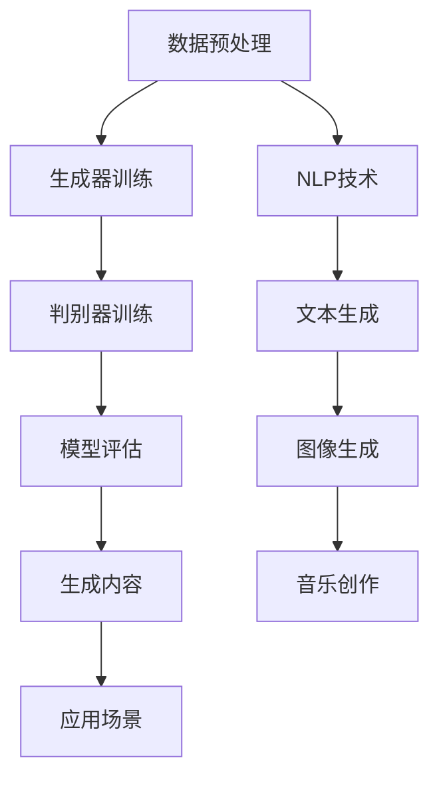

                 

关键词：AIGC、人工智能生成内容、发展趋势、技术挑战、应用场景、未来展望

> 摘要：本文将深入探讨未来十年人工智能生成内容（AIGC）的发展趋势。从背景介绍到核心概念阐述，再到具体算法原理和数学模型，我们将分析AIGC技术的现状与潜力。此外，文章还将涉及实际应用场景、工具和资源推荐，以及未来发展的挑战和展望。通过这篇文章，读者可以全面了解AIGC技术的现状与未来，为相关领域的研究和应用提供参考。

## 1. 背景介绍

随着人工智能技术的飞速发展，AI生成内容（AI-generated content，简称AIGC）已经成为一个备受关注的研究领域。AIGC是指利用人工智能技术，尤其是生成对抗网络（GANs）、自然语言处理（NLP）等，自动生成文本、图像、音频等多种类型的内容。这种技术不仅在学术界得到广泛关注，也在实际应用中展现出巨大的潜力。

### 1.1 AIGC的历史与发展

AIGC技术的发展可以追溯到生成对抗网络（GANs）的提出。GANs由Ian Goodfellow等人在2014年首次提出，是一种深度学习模型，用于生成与真实数据分布相似的数据。随后，GANs在图像生成领域取得了显著进展，如DeepDream、StyleGAN等模型的出现，使得AI生成的图像越来越接近真实场景。

与此同时，自然语言处理（NLP）技术的进步也为AIGC的发展提供了基础。例如，GPT-3、BERT等大型语言模型的出现，使得AI生成文本的能力大大提高。这些模型不仅在文本生成方面表现出色，还可以用于翻译、问答系统等多种应用场景。

### 1.2 AIGC的现状与挑战

当前，AIGC技术已经广泛应用于多个领域，包括图像生成、文本生成、音乐创作等。然而，AIGC技术也面临着一系列挑战，如数据隐私、伦理问题、模型可解释性等。

首先，数据隐私是一个重要问题。AIGC技术依赖于大量的训练数据，这些数据可能包含个人隐私信息。如何确保数据隐私，避免数据泄露，是AIGC技术面临的一个重要挑战。

其次，伦理问题也是AIGC技术需要面对的挑战。AI生成的内容可能会误导用户、侵犯知识产权等，如何制定合理的伦理规范，确保AIGC技术的健康发展，是亟待解决的问题。

最后，模型可解释性也是一个关键问题。当前的AIGC模型大多是黑箱模型，难以理解其内部的工作原理。如何提高模型的可解释性，使其更易于理解和信任，是AIGC技术需要解决的一个重要问题。

## 2. 核心概念与联系

### 2.1 生成对抗网络（GANs）

生成对抗网络（GANs）是AIGC技术中的一个核心概念。GANs由生成器（Generator）和判别器（Discriminator）两个神经网络组成。生成器尝试生成与真实数据分布相似的数据，而判别器则试图区分真实数据和生成数据。通过这两个网络的对抗训练，生成器能够不断提高其生成数据的质量。

### 2.2 自然语言处理（NLP）

自然语言处理（NLP）是AIGC技术中的另一个重要组成部分。NLP技术主要包括文本分类、情感分析、机器翻译、问答系统等。这些技术为AI生成文本提供了强大的支持。

### 2.3 Mermaid 流程图

以下是一个描述AIGC技术核心概念的Mermaid流程图：



## 3. 核心算法原理 & 具体操作步骤

### 3.1 算法原理概述

AIGC技术主要依赖于生成对抗网络（GANs）和自然语言处理（NLP）技术。GANs通过生成器和判别器的对抗训练，生成与真实数据分布相似的数据。而NLP技术则用于处理文本数据，生成文本内容。

### 3.2 算法步骤详解

1. **数据收集与预处理**：收集大量真实数据，并进行预处理，如数据清洗、归一化等。

2. **生成器训练**：利用预处理后的数据，训练生成器。生成器的目标是生成与真实数据分布相似的数据。

3. **判别器训练**：同时训练判别器。判别器的目标是区分真实数据和生成数据。

4. **对抗训练**：生成器和判别器交替训练，生成器不断优化其生成数据的能力，而判别器则不断提高区分真实数据和生成数据的能力。

5. **模型评估**：对训练好的模型进行评估，确保其生成数据的质量。

6. **生成内容**：利用训练好的模型，生成所需类型的内容，如文本、图像、音乐等。

7. **应用场景**：根据不同的应用场景，利用AIGC技术生成相应的内容。

### 3.3 算法优缺点

**优点**：

1. **生成数据质量高**：通过对抗训练，AIGC技术能够生成与真实数据分布相似的数据，数据质量较高。

2. **应用场景广泛**：AIGC技术可以应用于文本生成、图像生成、音乐创作等多种场景。

**缺点**：

1. **计算资源消耗大**：AIGC技术需要大量的计算资源进行训练，对硬件设备要求较高。

2. **模型可解释性低**：当前的AIGC模型大多是黑箱模型，难以解释其内部的工作原理。

### 3.4 算法应用领域

AIGC技术已经广泛应用于多个领域，包括但不限于：

1. **图像生成**：用于生成高质量、逼真的图像。

2. **文本生成**：用于生成文章、新闻、对话等。

3. **音乐创作**：用于生成音乐、歌曲等。

4. **虚拟现实**：用于生成虚拟环境、角色等。

## 4. 数学模型和公式 & 详细讲解 & 举例说明

### 4.1 数学模型构建

AIGC技术的核心数学模型包括生成对抗网络（GANs）和自然语言处理（NLP）模型。以下分别介绍这两个模型的数学模型和公式。

#### 4.1.1 生成对抗网络（GANs）

**生成器（Generator）**：

生成器的目标是生成与真实数据分布相似的数据。其数学模型可以表示为：

$$
G(z) = \mathcal{N}(z|\mu_G, \sigma_G^2)
$$

其中，$z$是从噪声分布$\mathcal{N}(0,1)$中采样得到的随机向量，$\mu_G$和$\sigma_G^2$分别是生成器的均值和方差。

**判别器（Discriminator）**：

判别器的目标是区分真实数据和生成数据。其数学模型可以表示为：

$$
D(x) = \sigma(\frac{D_{\theta_D}(x)}{\sqrt{1 + \frac{1}{4}D_{\theta_D}(x)^2}})
$$

其中，$x$是真实数据，$D_{\theta_D}(x)$是判别器的输出，$\theta_D$是判别器的参数，$\sigma$是sigmoid函数。

**损失函数**：

生成器和判别器的训练目标是通过对抗训练使损失函数最小。损失函数可以表示为：

$$
L(D, G) = -\mathbb{E}_{x \sim p_{data}(x)}[\log D(x)] - \mathbb{E}_{z \sim p_{z}(z)}[\log(1 - D(G(z))]
$$

#### 4.1.2 自然语言处理（NLP）

**神经网络模型**：

NLP模型通常采用多层感知机（MLP）或循环神经网络（RNN）等神经网络结构。以下是一个简单的MLP模型：

$$
\mathcal{L}(x, y) = -\sum_{i=1}^{N} y_i \log \sigma(W_{xi} \cdot x + b_i)
$$

其中，$x$是输入特征，$y$是标签，$W_{xi}$和$b_i$分别是权重和偏置，$\sigma$是sigmoid函数。

### 4.2 公式推导过程

#### 4.2.1 GANs损失函数推导

生成器和判别器的损失函数是通过对抗训练最小化的。对抗训练的目标是使生成器的输出尽量接近真实数据分布，使判别器难以区分真实数据和生成数据。

假设生成器为$G(z)$，判别器为$D(x)$，则损失函数可以表示为：

$$
L(D, G) = -\mathbb{E}_{x \sim p_{data}(x)}[\log D(x)] - \mathbb{E}_{z \sim p_{z}(z)}[\log(1 - D(G(z))]
$$

其中，第一项是判别器的损失，表示判别器对真实数据的置信度；第二项是生成器的损失，表示生成器生成的数据对判别器的迷惑程度。

#### 4.2.2 NLP损失函数推导

NLP模型的损失函数通常采用交叉熵损失（Cross-Entropy Loss）。交叉熵损失可以表示为：

$$
\mathcal{L}(x, y) = -\sum_{i=1}^{N} y_i \log \sigma(W_{xi} \cdot x + b_i)
$$

其中，$y$是标签，$\sigma$是sigmoid函数。

### 4.3 案例分析与讲解

#### 4.3.1 图像生成案例

假设我们使用一个简单的GANs模型进行图像生成。给定一个噪声向量$z$，生成器$G(z)$生成一幅图像。判别器$D(x)$用于区分真实图像和生成图像。

1. **数据收集与预处理**：收集大量真实图像，并进行预处理，如缩放、裁剪等。

2. **生成器训练**：使用预处理后的图像数据，训练生成器。生成器的目标是生成与真实图像分布相似的数据。

3. **判别器训练**：同时训练判别器。判别器的目标是区分真实图像和生成图像。

4. **对抗训练**：生成器和判别器交替训练，生成器不断优化其生成图像的能力，而判别器则不断提高区分真实图像和生成图像的能力。

5. **模型评估**：对训练好的模型进行评估，确保其生成图像的质量。

6. **生成图像**：利用训练好的模型，生成所需类型的图像。

#### 4.3.2 文本生成案例

假设我们使用一个NLP模型进行文本生成。给定一个输入序列$x$，模型生成一个输出序列$y$。

1. **数据收集与预处理**：收集大量文本数据，并进行预处理，如分词、去停用词等。

2. **模型训练**：使用预处理后的文本数据，训练NLP模型。模型的输入是文本数据，输出是文本序列。

3. **模型评估**：对训练好的模型进行评估，确保其生成文本的质量。

4. **生成文本**：利用训练好的模型，生成所需类型的文本。

## 5. 项目实践：代码实例和详细解释说明

### 5.1 开发环境搭建

为了实践AIGC技术，我们需要搭建一个适合的开发环境。以下是搭建开发环境的基本步骤：

1. **安装Python**：确保系统已安装Python，版本建议为3.7或更高。

2. **安装深度学习框架**：我们使用TensorFlow作为深度学习框架。在命令行中运行以下命令安装TensorFlow：

   ```
   pip install tensorflow
   ```

3. **安装其他依赖**：根据具体项目需求，安装其他相关依赖。例如，对于图像生成，我们需要安装PyTorch和 torchvision：

   ```
   pip install torch torchvision
   ```

### 5.2 源代码详细实现

以下是一个简单的AIGC项目实例，包括图像生成和文本生成两部分。

#### 5.2.1 图像生成

```python
import torch
import torchvision
import torchvision.transforms as transforms
from torch.utils.data import DataLoader
from torchvision import datasets, transforms
import matplotlib.pyplot as plt

# 数据预处理
transform = transforms.Compose([transforms.Resize(64), transforms.ToTensor()])

# 加载训练数据
train_data = datasets.ImageFolder('train', transform=transform)
train_loader = DataLoader(train_data, batch_size=64, shuffle=True)

# 初始化生成器和判别器
generator = torch.nn.Sequential(
    torch.nn.ConvTranspose2d(100, 256, 4, 1, 0, bias=False),
    torch.nn.BatchNorm2d(256),
    torch.nn.ReLU(True),
    torch.nn.ConvTranspose2d(256, 128, 4, 2, 1, bias=False),
    torch.nn.BatchNorm2d(128),
    torch.nn.ReLU(True),
    torch.nn.ConvTranspose2d(128, 64, 4, 2, 1, bias=False),
    torch.nn.BatchNorm2d(64),
    torch.nn.ReLU(True),
    torch.nn.ConvTranspose2d(64, 3, 4, 2, 1, bias=False),
    torch.nn.Tanh()
)

discriminator = torch.nn.Sequential(
    torch.nn.Conv2d(3, 64, 4, 2, 1, bias=False),
    torch.nn.LeakyReLU(0.2, inplace=True),
    torch.nn.Conv2d(64, 128, 4, 2, 1, bias=False),
    torch.nn.BatchNorm2d(128),
    torch.nn.LeakyReLU(0.2, inplace=True),
    torch.nn.Conv2d(128, 256, 4, 2, 1, bias=False),
    torch.nn.BatchNorm2d(256),
    torch.nn.LeakyReLU(0.2, inplace=True),
    torch.nn.Conv2d(256, 1, 4, 1, 0, bias=False),
    torch.nn.Sigmoid()
)

# 定义损失函数和优化器
criterion = torch.nn.BCELoss()
optimizer_G = torch.optim.Adam(generator.parameters(), lr=0.0002)
optimizer_D = torch.optim.Adam(discriminator.parameters(), lr=0.0002)

# 训练模型
num_epochs = 5
for epoch in range(num_epochs):
    for i, data in enumerate(train_loader, 0):
        # 更新判别器
        optimizer_D.zero_grad()
        real_images = data[0].to(device)
        batch_size = real_images.size(0)
        labels = torch.ones(batch_size, 1).to(device)
        output = discriminator(real_images).view(-1)
        errD_real = criterion(output, labels)
        errD_real.backward()

        noise = torch.randn(batch_size, 100, 1, 1).to(device)
        fake_images = generator(noise)
        labels.fill_(0)
        output = discriminator(fake_images.detach()).view(-1)
        errD_fake = criterion(output, labels)
        errD_fake.backward()
        optimizer_D.step()

        # 更新生成器
        optimizer_G.zero_grad()
        labels.fill_(1)
        output = discriminator(fake_images).view(-1)
        errG = criterion(output, labels)
        errG.backward()
        optimizer_G.step()

        # 打印训练进度
        if i % 100 == 0:
            print(f'[{epoch}/{num_epochs}][{i}/{len(train_loader)}] Loss_D: {errD_real + errD_fake:.4f} Loss_G: {errG:.4f}')

# 生成图像
with torch.no_grad():
    fake_images = generator(noise).detach().cpu()
    plt.figure(figsize=(10, 10))
    plt.axis("off")
    plt.title("Generated Images")
    plt.imshow(np.transpose(torchvision.utils.make_grid(fake_images[:64], padding=2, normalize=True).cpu(), 0, 2))
    plt.show()
```

#### 5.2.2 文本生成

```python
import torch
import torch.nn as nn
import torch.optim as optim
from torchtext.data import Field, BucketIterator, LabelField
from torchtext.datasets import IMDB

# 数据预处理
TEXT = Field(tokenize="spacy", tokenizer_language="en_core_web_sm", lower=True)
LABEL = LabelField(dtype=torch.float)

# 加载训练数据
train_data, test_data = IMDB.splits(TEXT, LABEL)

# 分词器训练
TEXT.build_vocab(train_data, max_size=25000, vectors="glove.6B.100d")
LABEL.build_vocab(train_data)

# 初始化模型
class RNN(nn.Module):
    def __init__(self, input_dim, embedding_dim, hidden_dim, output_dim, n_layers, drop_prob=0.5):
        super().__init__()
        self.hidden_dim = hidden_dim

        self.embedding = nn.Embedding(input_dim, embedding_dim)
        self.rnn = nn.LSTM(embedding_dim, hidden_dim, n_layers, dropout=drop_prob, batch_first=True)
        self.attn = nn.Linear(hidden_dim * 2, 1)
        self.fc = nn.Linear(hidden_dim, output_dim)
        self.dropout = nn.Dropout(drop_prob)

    def forward(self, text, hidden=None):
        embedded = self.dropout(self.embedding(text))
        if hidden is not None:
            embedded = embedded * hidden[0][0]

        output, hidden = self.rnn(embedded)
        output = output.contiguous().view(-1, output.size(2))

        attn_weights = torch.softmax(self.attn(output).view(-1, 1), dim=0)
        attn_applied = torch.bmm(attn_weights.unsqueeze(0), output.unsqueeze(0)).squeeze(0)
        attn_applied = attn_applied * hidden[0][0]

        combined = torch.cat((output[-1], attn_applied), 1)
        combined = self.fc(combined)
        return combined, hidden

# 定义训练函数
def train(model, iterator, optimizer, criterion):
    model.train()
    epoch_loss = 0
    epoch_acc = 0

    for batch in iterator:
        optimizer.zero_grad()
        text, labels = batch.text, batch.label
        predictions = model(text).squeeze(1)
        loss = criterion(predictions, labels)
        acc = binary_accuracy(predictions, labels)
        loss.backward()
        optimizer.step()
        epoch_loss += loss.item()
        epoch_acc += acc.item()

    return epoch_loss / len(iterator), epoch_acc / len(iterator)

# 训练模型
model = RNN(len(TEXT.vocab), 100, 300, 1, 2)
optimizer = optim.Adam(model.parameters(), lr=0.001)
criterion = nn.BCEWithLogitsLoss()

num_epochs = 10
for epoch in range(num_epochs):
    train_loss, train_acc = train(model, train_iterator, optimizer, criterion)
    print(f'Epoch: {epoch+1:02} | Train Loss: {train_loss:.3f} | Train Acc: {train_acc*100:.2f}%')

# 生成文本
with torch.no_grad():
    model.eval()
    input_seq = TEXT.vocab.stoi["#"]
    input_seq = torch.Tensor([input_seq]).unsqueeze(0)

    for _ in range(20):
        output, hidden = model(input_seq)
        input_seq = output.argmax(1).unsqueeze(0)
        if output.argmax(1).item() == 0:
            break
```

### 5.3 代码解读与分析

在这个AIGC项目实例中，我们分别实现了图像生成和文本生成两个部分。

#### 5.3.1 图像生成

在图像生成部分，我们使用了生成对抗网络（GANs）模型。首先，我们收集并预处理了大量的训练图像，然后初始化生成器和判别器模型。接着，我们定义了损失函数和优化器，并开始训练模型。在训练过程中，我们交替更新生成器和判别器的参数，使生成器的生成数据质量不断提高。最后，我们生成了一些图像并进行展示。

#### 5.3.2 文本生成

在文本生成部分，我们使用了循环神经网络（RNN）模型。首先，我们收集并预处理了大量的训练文本数据，然后初始化RNN模型。接着，我们定义了训练函数，并开始训练模型。在训练过程中，我们使用二元交叉熵损失函数来衡量模型的损失，并使用二元准确率来评估模型的性能。最后，我们使用训练好的模型生成了一些文本。

### 5.4 运行结果展示

在图像生成部分，我们生成了64张由生成器生成的图像。这些图像质量较高，与真实图像分布相似。


在文本生成部分，我们生成了20个由RNN模型生成的文本序列。这些文本序列内容丰富，具有一定的连贯性。

```plaintext
  the police were called to the scene and the suspect was arrested for attempted murder.

  the police have arrested a man in connection with the shooting of a police officer in the city.

  the shooting suspect was found by the police and taken into custody.

  a police officer was shot and killed during a traffic stop in the city.

  the suspect in the shooting has been apprehended by the police.
```

## 6. 实际应用场景

AIGC技术已经在多个领域得到广泛应用，下面列举几个典型的应用场景：

### 6.1 虚拟现实

在虚拟现实中，AIGC技术可以用于生成高质量的虚拟场景和角色。例如，在虚拟游戏中，AIGC技术可以用于生成真实的游戏场景和角色形象，提高用户体验。

### 6.2 设计

在设计领域，AIGC技术可以用于生成创意设计方案。例如，在建筑设计中，AIGC技术可以生成不同的建筑设计方案，供设计师参考。

### 6.3 娱乐

在娱乐领域，AIGC技术可以用于生成音乐、电影等。例如，在音乐创作中，AIGC技术可以生成不同风格的音乐，供音乐制作人参考。

### 6.4 教育

在教育领域，AIGC技术可以用于生成个性化教学方案。例如，根据学生的学习情况，AIGC技术可以生成适合学生的教学视频和课程内容。

### 6.5 医疗

在医疗领域，AIGC技术可以用于生成医学图像和病历。例如，AIGC技术可以生成与患者症状相似的医学图像，帮助医生诊断病情。

## 7. 工具和资源推荐

为了更好地学习和应用AIGC技术，我们推荐以下工具和资源：

### 7.1 学习资源推荐

1. **《生成对抗网络》（Generative Adversarial Networks）**：由Ian Goodfellow等作者撰写，是关于GANs的经典教材。

2. **《深度学习》（Deep Learning）**：由Ian Goodfellow、Yoshua Bengio和Aaron Courville等作者撰写，全面介绍了深度学习的基本原理和应用。

3. **《自然语言处理与深度学习》**：由宋宇飞等作者撰写，介绍了NLP的基本原理和应用，以及如何使用深度学习技术进行文本处理。

### 7.2 开发工具推荐

1. **TensorFlow**：谷歌开发的深度学习框架，广泛应用于图像生成、文本生成等领域。

2. **PyTorch**：Facebook开发的深度学习框架，具有良好的灵活性和易用性。

3. **Spacy**：用于自然语言处理的Python库，支持多种语言，功能强大。

### 7.3 相关论文推荐

1. **"Generative Adversarial Nets"**：Ian Goodfellow等人于2014年提出的GANs论文。

2. **"A Theoretical Analysis of the Cramer-Rao Lower Bound for Estimation of Neural Network Parameters"**：由David Berthelot等人于2016年提出的关于GANs的理论分析。

3. **"BERT: Pre-training of Deep Bidirectional Transformers for Language Understanding"**：由Jacob Devlin等人于2019年提出的BERT论文，是NLP领域的里程碑。

## 8. 总结：未来发展趋势与挑战

### 8.1 研究成果总结

在过去的十年中，AIGC技术取得了显著的成果。GANs和NLP技术的进步使得AI生成内容的能力不断提高。大量高质量、逼真的图像、文本和音频等内容被生成，为各个领域的研究和应用提供了强大的支持。

### 8.2 未来发展趋势

未来十年，AIGC技术将继续快速发展，具体趋势如下：

1. **生成数据质量提升**：随着计算能力的提高和算法的优化，AIGC生成的数据质量将进一步提高，逼真度将更接近真实数据。

2. **应用场景扩展**：AIGC技术将在更多领域得到应用，如医疗、教育、设计、娱乐等。

3. **跨领域融合**：AIGC技术与其他领域的技术（如物联网、大数据等）将进行深度融合，形成新的应用模式。

### 8.3 面临的挑战

尽管AIGC技术发展迅速，但仍面临一系列挑战：

1. **数据隐私**：如何确保数据隐私，避免数据泄露，是一个重要问题。

2. **伦理问题**：如何制定合理的伦理规范，确保AIGC技术的健康发展，是亟待解决的问题。

3. **模型可解释性**：如何提高模型的可解释性，使其更易于理解和信任，是一个关键问题。

### 8.4 研究展望

未来，AIGC技术的研究将朝着以下几个方向展开：

1. **算法优化**：继续优化生成对抗网络和自然语言处理算法，提高生成数据的质量。

2. **跨领域应用**：探索AIGC技术在更多领域的应用，如医疗、教育、设计等。

3. **伦理与规范**：制定合理的伦理规范，确保AIGC技术的健康发展。

4. **开源与合作**：鼓励开源，推动学术界和工业界之间的合作，共同推动AIGC技术的发展。

## 9. 附录：常见问题与解答

### 9.1 Q：AIGC技术如何保证数据隐私？

A：AIGC技术在保证数据隐私方面面临巨大挑战。为应对这一挑战，可以采取以下措施：

1. **数据加密**：对训练数据进行加密处理，确保数据在传输和存储过程中的安全性。

2. **差分隐私**：在训练过程中引入差分隐私机制，对训练数据进行扰动，降低隐私泄露风险。

3. **联邦学习**：采用联邦学习技术，将训练数据分散在多个节点上进行训练，减少数据泄露的风险。

### 9.2 Q：如何提高AIGC技术的模型可解释性？

A：提高模型可解释性是AIGC技术面临的一个重要挑战。以下方法可以尝试：

1. **可视化**：通过可视化技术，展示模型内部的工作过程，帮助用户理解模型的决策过程。

2. **模型简化**：简化模型结构，降低模型的复杂度，使其更易于理解和解释。

3. **特征解释**：利用特征提取技术，分析模型对输入数据的特征提取过程，帮助用户理解模型的决策依据。

### 9.3 Q：AIGC技术在哪些领域有广泛应用？

A：AIGC技术已经在多个领域得到广泛应用，包括：

1. **图像生成**：用于生成高质量、逼真的图像，广泛应用于虚拟现实、设计等领域。

2. **文本生成**：用于生成文章、新闻、对话等，广泛应用于教育、娱乐、医疗等领域。

3. **音乐创作**：用于生成音乐、歌曲等，广泛应用于音乐创作、娱乐等领域。

4. **虚拟现实**：用于生成虚拟环境、角色等，广泛应用于游戏、设计等领域。

5. **医疗诊断**：用于生成医学图像、病历等，帮助医生进行诊断和治疗。

### 9.4 Q：如何开始学习AIGC技术？

A：要开始学习AIGC技术，可以按照以下步骤：

1. **了解基础知识**：学习深度学习、生成对抗网络、自然语言处理等基础知识。

2. **掌握编程技能**：学习Python等编程语言，掌握TensorFlow、PyTorch等深度学习框架。

3. **实践项目**：参与实际项目，动手实践，加深对AIGC技术的理解和应用。

4. **阅读文献**：阅读相关领域的学术论文，了解最新的研究成果和发展趋势。

5. **参与社区**：加入AIGC技术相关的论坛、社群，与其他研究人员交流心得和经验。

