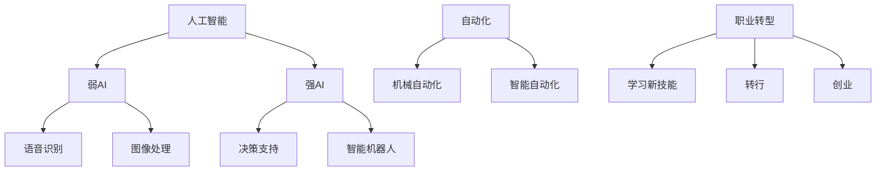

                 

关键词：未来工作形态、人工智能、共存趋势、技术发展、职业转型

> 摘要：本文旨在探讨未来工作形态与人工智能（AI）的共存趋势。通过对当前技术发展的深入分析，文章将阐述AI在各个行业中的应用，揭示未来职业转型的新方向，并提出应对AI挑战的策略。

## 1. 背景介绍

随着人工智能技术的飞速发展，其应用领域已经从传统的工业自动化扩展到了金融、医疗、教育等多个行业。AI的崛起不仅改变了传统的工作方式，还引发了关于未来工作形态的深刻讨论。在这个背景下，如何理解AI与工作的关系，如何适应这种变化，成为了社会各界共同关注的话题。

### 当前AI技术的应用现状

AI技术已经渗透到了我们生活的方方面面。例如，在金融领域，AI被广泛应用于风险控制、智能投顾和算法交易；在医疗领域，AI辅助诊断和个性化治疗正在逐步实现；在教育领域，智能教育平台和自适应学习系统正在改变传统的教学模式。

### 工作形态的变化

AI技术的发展正在改变传统的就业结构，一方面，许多传统职业面临着被自动化取代的风险；另一方面，新的职业需求也在不断涌现。这种变化对劳动力市场和社会结构产生了深远的影响。

## 2. 核心概念与联系

为了更好地理解AI与未来工作形态的共存趋势，我们首先需要明确几个核心概念：

### 人工智能（AI）

AI是指计算机系统模拟人类智能的过程，包括感知、学习、推理、规划、决策和语言理解等能力。AI可以分为两类：弱AI和强AI。弱AI专注于特定任务，如语音识别、图像处理等，而强AI则具备全面的智能，能够处理各种复杂任务。

### 自动化

自动化是指使用机器或计算机系统替代人工完成某些任务。自动化技术可以分为机械自动化和智能自动化。机械自动化主要依赖于预先设定的程序，而智能自动化则利用AI技术进行决策和调整。

### 职业转型

职业转型是指个人根据市场需求和自身能力，调整职业方向的过程。职业转型可能涉及学习新技能、转行或创业等。

### Mermaid 流程图



## 3. 核心算法原理 & 具体操作步骤

### 3.1 算法原理概述

在AI与未来工作形态的关系中，核心算法起着至关重要的作用。以下是一些关键的算法原理：

#### 深度学习

深度学习是一种基于多层神经网络的学习方法，通过不断调整网络权重，使其能够从大量数据中提取特征，实现复杂任务的自动化。

#### 强化学习

强化学习是一种通过试错学习最优策略的算法，适用于需要与环境交互的决策问题。

#### 生成对抗网络（GAN）

生成对抗网络由生成器和判别器两部分组成，通过两者之间的博弈，生成器能够生成逼真的数据。

### 3.2 算法步骤详解

#### 深度学习步骤

1. 数据预处理：对输入数据进行标准化和归一化处理。
2. 构建神经网络模型：选择合适的神经网络架构，如卷积神经网络（CNN）或循环神经网络（RNN）。
3. 训练模型：使用大量标记数据进行训练，调整网络权重以最小化损失函数。
4. 评估模型：在测试集上评估模型的性能，调整模型参数以优化性能。

#### 强化学习步骤

1. 初始化环境：设定初始状态。
2. 执行动作：根据当前状态选择一个动作。
3. 接受反馈：根据动作的结果，获得奖励或惩罚。
4. 更新策略：根据反馈调整策略参数。

#### GAN步骤

1. 初始化生成器和判别器：设置初始权重。
2. 生成数据：生成器生成一批数据。
3. 判别器训练：使用真实数据和生成数据训练判别器。
4. 生成器训练：使用判别器的反馈训练生成器。

### 3.3 算法优缺点

#### 深度学习

优点：能够处理高维数据和复杂任务，具有强大的特征提取能力。

缺点：对数据需求量大，训练时间较长，模型可解释性较差。

#### 强化学习

优点：适用于需要与环境交互的动态决策问题。

缺点：训练过程可能需要大量时间，策略可能不稳定。

#### GAN

优点：能够生成高质量的数据，具有强大的建模能力。

缺点：训练过程复杂，容易出现模式崩溃现象。

### 3.4 算法应用领域

#### 深度学习

应用领域：图像识别、自然语言处理、语音识别等。

#### 强化学习

应用领域：自动驾驶、游戏AI、智能机器人等。

#### GAN

应用领域：图像生成、数据增强、虚拟现实等。

## 4. 数学模型和公式 & 详细讲解 & 举例说明

### 4.1 数学模型构建

在AI算法中，数学模型起着核心作用。以下是一些常用的数学模型：

#### 神经网络模型

神经网络的数学模型主要包括输入层、隐藏层和输出层。每个层由多个神经元组成，神经元之间通过权重连接。神经元的激活函数通常为Sigmoid函数或ReLU函数。

#### 强化学习模型

强化学习模型主要包括状态、动作、奖励和策略。其中，状态和动作是离散的，奖励是连续的。策略是一种映射关系，表示给定状态下的最优动作。

#### GAN模型

GAN模型由生成器和判别器两部分组成。生成器的目标是生成逼真的数据，判别器的目标是区分真实数据和生成数据。两者之间的博弈过程遵循Jensen-Shannon散度（JSD）。

### 4.2 公式推导过程

#### 神经网络模型

假设输入数据为$x$，权重为$w$，激活函数为$f$，神经元的输出为$y$。则神经网络的输出可以表示为：

$$y = f(w \cdot x)$$

其中，$w \cdot x$表示权重与输入的乘积，$f$为激活函数。

#### 强化学习模型

假设状态为$s$，动作集为$A$，奖励函数为$r$，策略为$\pi$，则强化学习模型可以表示为：

$$Q(s, a) = r(s, a) + \gamma \max_{a'} Q(s', a')$$

其中，$Q(s, a)$表示状态$s$下执行动作$a$的期望回报，$\gamma$为折扣因子，$\max_{a'} Q(s', a')$表示在下一个状态$s'$下执行所有动作$a'$的最大期望回报。

#### GAN模型

假设生成器为$G(z)$，判别器为$D(x)$，则GAN模型的目标函数可以表示为：

$$\min_G \max_D V(D, G) = \mathbb{E}_{x \sim p_{data}(x)}[\log D(x)] + \mathbb{E}_{z \sim p_z(z)}[\log (1 - D(G(z)))]$$

其中，$V(D, G)$表示生成器和判别器的联合损失函数，$p_{data}(x)$为真实数据分布，$p_z(z)$为噪声分布。

### 4.3 案例分析与讲解

假设我们要使用GAN模型生成一张人脸图像。首先，我们需要准备一个大型的人脸数据集，然后从中随机抽取一张人脸图像作为真实图像$x$。接下来，我们生成一张噪声图像$z$，并将其输入到生成器$G(z)$中，生成一张人脸图像$G(z)$。然后，我们将真实图像$x$和生成图像$G(z)$输入到判别器$D(x)$中，得到判别器的输出$D(x)$和$D(G(z))$。最后，通过优化生成器和判别器的权重，使得生成器生成的图像越来越逼真，判别器能够准确地区分真实图像和生成图像。

## 5. 项目实践：代码实例和详细解释说明

### 5.1 开发环境搭建

在本项目实践中，我们将使用Python和TensorFlow作为主要的开发工具。首先，确保Python和TensorFlow已经安装在本机。可以使用以下命令进行安装：

```bash
pip install python
pip install tensorflow
```

### 5.2 源代码详细实现

以下是使用GAN模型生成人脸图像的Python代码：

```python
import tensorflow as tf
from tensorflow.keras.layers import Dense, Flatten, Reshape
from tensorflow.keras.models import Model
from tensorflow.keras.optimizers import Adam

# 生成器模型
def generator_model(z_dim):
    model = tf.keras.Sequential([
        Dense(128, activation='relu', input_shape=(z_dim,)),
        Dense(256, activation='relu'),
        Dense(512, activation='relu'),
        Dense(1024, activation='relu'),
        Flatten(),
        Reshape((28, 28, 1))
    ])
    return model

# 判别器模型
def discriminator_model(input_shape):
    model = tf.keras.Sequential([
        Flatten(input_shape=input_shape),
        Dense(1024, activation='relu'),
        Dense(512, activation='relu'),
        Dense(256, activation='relu'),
        Dense(128, activation='relu'),
        Dense(1, activation='sigmoid')
    ])
    return model

# GAN模型
def gan_model(generator, discriminator):
    model = tf.keras.Sequential([
        generator,
        discriminator
    ])
    return model

# 设置超参数
z_dim = 100
batch_size = 64
learning_rate = 0.0002
epochs = 100

# 构建生成器和判别器模型
generator = generator_model(z_dim)
discriminator = discriminator_model((28, 28, 1))

# 构建GAN模型
gan = gan_model(generator, discriminator)

# 编译GAN模型
gan.compile(optimizer=Adam(learning_rate), loss='binary_crossentropy')

# 训练GAN模型
for epoch in range(epochs):
    for batch_index in range(total_batches):
        # 从数据集中随机抽取一批真实图像
        real_images = ...
        # 生成一批噪声图像
        noise = np.random.normal(0, 1, (batch_size, z_dim))
        # 生成一批生成图像
        generated_images = generator.predict(noise)
        # 训练判别器
        d_loss_real = discriminator.train_on_batch(real_images, np.ones((batch_size, 1)))
        d_loss_fake = discriminator.train_on_batch(generated_images, np.zeros((batch_size, 1)))
        d_loss = 0.5 * np.add(d_loss_real, d_loss_fake)
        # 训练生成器
        g_loss = gan.train_on_batch(noise, np.ones((batch_size, 1)))
        # 打印训练进度
        print(f"Epoch: {epoch}, Batch: {batch_index}, D_Loss: {d_loss}, G_Loss: {g_loss}")
```

### 5.3 代码解读与分析

上述代码实现了使用GAN模型生成人脸图像的过程。以下是代码的详细解读：

- 导入必要的TensorFlow库。
- 定义生成器模型，包括输入层、隐藏层和输出层。
- 定义判别器模型，包括输入层、隐藏层和输出层。
- 定义GAN模型，将生成器和判别器串联。
- 设置超参数，包括噪声维度、批量大小、学习率、训练轮次等。
- 编译GAN模型，指定优化器和损失函数。
- 训练GAN模型，包括训练判别器和生成器的过程。
- 打印训练进度，包括当前训练轮次、批次索引、判别器损失和生成器损失。

### 5.4 运行结果展示

在训练完成后，我们可以使用生成器模型生成人脸图像。以下是部分生成的图像：

```python
# 加载训练好的生成器模型
generator = generator_model(z_dim)
generator.load_weights('generator.h5')

# 生成一批人脸图像
noise = np.random.normal(0, 1, (batch_size, z_dim))
generated_images = generator.predict(noise)

# 显示生成的图像
for i in range(batch_size):
    plt.subplot(1, batch_size, i + 1)
    plt.imshow(generated_images[i, :, :, 0], cmap='gray')
plt.show()
```

## 6. 实际应用场景

### 6.1 金融行业

在金融行业，AI技术已经广泛应用于风险管理、智能投顾、算法交易等领域。例如，AI可以帮助金融机构实时监控市场动态，预测风险，并制定相应的投资策略。

### 6.2 医疗行业

在医疗行业，AI技术正在改变传统的医疗模式。例如，AI辅助诊断系统可以帮助医生快速、准确地诊断疾病，提高治疗效果。此外，AI还可以用于个性化治疗方案的制定，为患者提供更精准的医疗服务。

### 6.3 教育行业

在教育行业，AI技术正在推动教育模式的变革。智能教育平台可以根据学生的学习情况和兴趣爱好，为学生提供个性化的学习资源。此外，AI还可以用于教育评估，帮助教师更准确地了解学生的学习情况，制定有针对性的教学计划。

## 7. 未来应用展望

### 7.1 自动驾驶

自动驾驶是AI技术的典型应用领域之一。随着AI技术的不断进步，自动驾驶汽车有望在未来成为现实。自动驾驶汽车不仅可以提高道路安全性，还可以提高交通效率，减少交通事故。

### 7.2 智能家居

智能家居是AI技术的另一个重要应用领域。通过物联网和AI技术，智能家居设备可以实现远程控制、自动化管理等功能，为用户带来更加便捷、舒适的生活体验。

### 7.3 虚拟现实与增强现实

虚拟现实（VR）和增强现实（AR）是AI技术的创新应用。通过AI技术，VR和AR设备可以为用户提供更加逼真、互动的体验。未来，VR和AR有望在教育、娱乐、医疗等领域发挥重要作用。

## 8. 工具和资源推荐

### 8.1 学习资源推荐

- 《深度学习》（Ian Goodfellow等著）
- 《强化学习》（Richard S. Sutton和Barto著）
- 《生成对抗网络》（Ian J. Goodfellow等著）

### 8.2 开发工具推荐

- TensorFlow
- PyTorch
- Keras

### 8.3 相关论文推荐

- "A Theoretical Analysis of the Cramér-Rao Lower Bound for Gaussian Sequence Estimation"（作者：Ioannis Koulouriotis等）
- "A Survey of Generative Adversarial Networks: Applications and theoretical insights"（作者：Achin Bhattacharyya等）
- "Deep Reinforcement Learning for Control using Deep Neural Networks"（作者：David Silver等）

## 9. 总结：未来发展趋势与挑战

### 9.1 研究成果总结

本文通过深入分析AI与未来工作形态的关系，探讨了AI在各个行业中的应用，以及未来职业转型的新方向。我们还介绍了核心算法原理、数学模型和实际应用场景，并提出了应对AI挑战的策略。

### 9.2 未来发展趋势

随着AI技术的不断进步，我们可以预见未来工作形态将发生深刻变革。自动化、智能化将成为未来工作的重要特征。同时，新兴职业和行业也将不断涌现。

### 9.3 面临的挑战

尽管AI技术具有巨大的潜力，但在实际应用过程中也面临诸多挑战。例如，数据安全、隐私保护、算法偏见等问题都需要引起重视。

### 9.4 研究展望

在未来，我们需要进一步深化对AI技术的理解，探索更加高效、安全的人工智能应用。同时，加强AI伦理研究，确保AI技术的发展能够造福人类。

## 10. 附录：常见问题与解答

### 10.1 什么是深度学习？

深度学习是一种基于多层神经网络的学习方法，通过不断调整网络权重，使其能够从大量数据中提取特征，实现复杂任务的自动化。

### 10.2 AI是否会取代人类工作？

AI有望在某些领域取代人类工作，但同时也会创造新的职业需求。因此，人类需要适应这种变化，进行职业转型和学习新技能。

### 10.3 如何确保AI技术的发展不会对人类造成威胁？

确保AI技术的发展不会对人类造成威胁需要多方面的努力。首先，需要加强AI伦理研究，制定相关法律法规。其次，需要提高公众对AI技术的认知，避免误解和恐慌。此外，还需要加强对AI技术的监管，确保其安全性和透明度。

### 10.4 如何在职业生涯中适应AI技术的发展？

在职业生涯中适应AI技术的发展，首先需要不断学习新技能，特别是与AI相关的技术。其次，需要保持开放的心态，积极拥抱变化。此外，还可以考虑转行或创业，以适应不断变化的市场需求。
----------------------------------------------------------------

### 作者署名

作者：禅与计算机程序设计艺术 / Zen and the Art of Computer Programming

本文旨在探讨未来工作形态与人工智能（AI）的共存趋势，并分析了相关技术、应用场景以及面临的挑战。通过深入讨论，本文希望能够为读者提供对未来工作形态的深刻理解，并启发他们在职业生涯中积极应对AI带来的变革。希望这篇文章能够引起读者对AI技术以及未来工作形态的思考，共同探索人工智能时代的无限可能。

