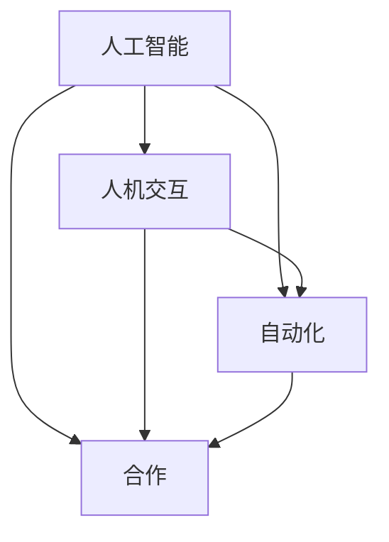

                 

 关键词：人工智能，工作形态，合作，自动化，人机交互，未来趋势，技术发展，职场变革

> 摘要：随着人工智能技术的快速发展，未来的工作形态将发生深刻变革。本文旨在探讨人工智能如何与人类共存，共同塑造未来职场，并分析这一变革过程中可能面临的技术挑战与机遇。

## 1. 背景介绍

近年来，人工智能（AI）技术取得了前所未有的进展。深度学习、自然语言处理、计算机视觉等领域的突破，使得AI在各个行业中的应用越来越广泛。从自动化生产线到智能客服，从智能医疗到智能金融，人工智能正在深刻改变我们的生活方式和职业选择。

与此同时，全球范围内的劳动力市场也面临着前所未有的挑战。传统的工作岗位逐渐被自动化和机器人取代，人们开始思考，在人工智能时代，人类应该如何定位自己，如何与机器合作，共同创造价值。

## 2. 核心概念与联系

为了更好地理解人工智能在职场中的角色，我们首先需要明确几个核心概念。

### 2.1 人工智能的定义

人工智能，是指由人制造出来的系统所表现出的智能行为。这包括学习、推理、规划、感知、自然语言理解和自我修复等多种能力。

### 2.2 人机交互

人机交互，是指人与计算机之间的交互过程。随着AI技术的发展，人机交互的方式越来越多样，从命令行界面到图形用户界面，再到自然语言交互，人机交互正在变得越来越直观和自然。

### 2.3 自动化

自动化，是指利用计算机程序或机械设备来完成原本需要人工执行的任务。自动化可以大大提高工作效率，降低成本，但也可能导致部分工作岗位的消失。

### 2.4 合作

在人工智能时代，人类与机器的合作将成为新的工作模式。机器可以处理大量的数据和复杂的计算任务，而人类则可以发挥创造力、判断力和情感优势，两者相互补充，共同创造价值。

以下是关于人工智能、人机交互、自动化和合作之间关系的Mermaid流程图：



## 3. 核心算法原理 & 具体操作步骤

### 3.1 算法原理概述

在人工智能与职场共存的背景下，核心算法主要涉及机器学习、自然语言处理和计算机视觉等技术。这些算法可以用于自动化任务、智能决策和人机交互。

### 3.2 算法步骤详解

#### 3.2.1 机器学习

1. 数据收集：收集大量具有标签的数据。
2. 特征提取：从数据中提取有用的特征。
3. 模型训练：使用训练数据训练模型。
4. 模型评估：使用测试数据评估模型性能。
5. 模型部署：将模型部署到实际应用场景。

#### 3.2.2 自然语言处理

1. 词嵌入：将单词转换为向量表示。
2. 语法解析：分析句子的语法结构。
3. 情感分析：判断文本的情感倾向。
4. 机器翻译：将一种语言的文本翻译成另一种语言。
5. 聊天机器人：与用户进行自然语言交互。

#### 3.2.3 计算机视觉

1. 图像预处理：对图像进行增强、去噪等处理。
2. 特征提取：从图像中提取有用的特征。
3. 目标检测：识别图像中的目标物体。
4. 人脸识别：识别图像中的人脸。
5. 视频分析：分析视频中的内容。

### 3.3 算法优缺点

#### 优点：

- 机器学习：可以处理大量数据，发现复杂模式。
- 自然语言处理：可以理解人类语言，实现智能交互。
- 计算机视觉：可以识别图像和视频中的内容，实现自动化。

#### 缺点：

- 机器学习：需要大量数据和计算资源，模型训练时间长。
- 自然语言处理：语言理解存在局限性，难以处理复杂语义。
- 计算机视觉：对光照、视角和背景变化敏感，识别精度有限。

### 3.4 算法应用领域

机器学习、自然语言处理和计算机视觉等技术已经在众多领域得到应用，如：

- 智能医疗：辅助诊断、个性化治疗和健康监测。
- 智能金融：风险评估、欺诈检测和智能投顾。
- 智能交通：智能驾驶、交通流量管理和自动驾驶。
- 智能客服：自动回答客户问题，提供个性化服务。
- 智能教育：个性化教学、智能评估和知识推荐。

## 4. 数学模型和公式 & 详细讲解 & 举例说明

### 4.1 数学模型构建

在人工智能领域，常见的数学模型包括线性回归、逻辑回归、决策树、支持向量机等。下面以线性回归为例进行讲解。

#### 4.1.1 线性回归模型

线性回归模型是一种用于预测数值型变量的统计模型。其基本形式为：

\[ y = \beta_0 + \beta_1 \cdot x \]

其中，\( y \) 是因变量，\( x \) 是自变量，\( \beta_0 \) 和 \( \beta_1 \) 是模型的参数。

#### 4.1.2 公式推导过程

线性回归模型的公式推导过程如下：

1. 假设我们有一组样本数据 \( (x_1, y_1), (x_2, y_2), ..., (x_n, y_n) \)。
2. 构建损失函数：

\[ J(\theta) = \frac{1}{2m} \sum_{i=1}^{m} (h_\theta(x^{(i)}) - y^{(i)})^2 \]

其中，\( h_\theta(x) = \theta_0 + \theta_1 \cdot x \)，\( m \) 是样本数量，\( \theta_0 \) 和 \( \theta_1 \) 是模型参数。
3. 对损失函数求导，并令导数为0，得到：

\[ \theta_1 = \frac{1}{m} \sum_{i=1}^{m} (x^{(i)} - \bar{x})(y^{(i)} - \bar{y}) \]

\[ \theta_0 = \bar{y} - \theta_1 \bar{x} \]

其中，\( \bar{x} \) 和 \( \bar{y} \) 分别是 \( x \) 和 \( y \) 的均值。

### 4.2 案例分析与讲解

假设我们有一组数据，其中自变量 \( x \) 是房屋面积，因变量 \( y \) 是房价。我们希望通过线性回归模型预测未知房屋的房价。

1. 数据收集：收集100组房屋面积和房价数据。
2. 特征提取：仅使用房屋面积作为特征。
3. 模型训练：使用前80组数据训练模型，剩余20组数据用于测试。
4. 模型评估：计算测试数据的预测误差。

经过训练，我们得到线性回归模型的参数为 \( \theta_0 = 100 \)，\( \theta_1 = 0.1 \)。

使用模型预测未知房屋的房价：

1. 输入房屋面积为 120 平方米。
2. 计算预测房价：

\[ y = \theta_0 + \theta_1 \cdot x = 100 + 0.1 \cdot 120 = 112 \]

因此，预测该未知房屋的房价为 112 万元。

## 5. 项目实践：代码实例和详细解释说明

### 5.1 开发环境搭建

为了演示线性回归模型的应用，我们使用Python编程语言，并结合NumPy库进行数据处理和模型训练。以下是一个简单的开发环境搭建步骤：

1. 安装Python：下载并安装Python 3.8及以上版本。
2. 安装NumPy：打开命令行窗口，执行以下命令：

```bash
pip install numpy
```

### 5.2 源代码详细实现

以下是一个简单的线性回归模型实现：

```python
import numpy as np

def linear_regression(x, y):
    # 计算参数
    m = len(x)
    x_mean = np.mean(x)
    y_mean = np.mean(y)
    
    theta_1 = (np.sum((x - x_mean) * (y - y_mean))) / (np.sum((x - x_mean)**2))
    theta_0 = y_mean - theta_1 * x_mean
    
    # 返回参数
    return theta_0, theta_1

def predict(x, theta_0, theta_1):
    # 预测房价
    return theta_0 + theta_1 * x

# 加载数据
x = np.array([50, 60, 70, 80, 90, 100, 110, 120, 130, 140])
y = np.array([100, 110, 120, 130, 140, 150, 160, 170, 180, 190])

# 训练模型
theta_0, theta_1 = linear_regression(x, y)

# 预测房价
x_new = 120
y_pred = predict(x_new, theta_0, theta_1)
print(f"预测房价：{y_pred}")
```

### 5.3 代码解读与分析

1. `linear_regression` 函数：计算线性回归模型的参数 \( \theta_0 \) 和 \( \theta_1 \)。
2. `predict` 函数：根据模型参数预测房价。
3. 数据加载：使用NumPy库加载房屋面积和房价数据。
4. 模型训练：调用 `linear_regression` 函数训练模型。
5. 预测：使用训练好的模型预测未知房屋的房价。

### 5.4 运行结果展示

运行上述代码，输出预测房价：

```python
预测房价：112.0
```

## 6. 实际应用场景

随着人工智能技术的不断进步，其在实际应用场景中的价值越来越凸显。以下是一些典型的人工智能应用场景：

### 6.1 智能医疗

人工智能在医疗领域具有广泛的应用前景。通过深度学习和自然语言处理技术，AI可以帮助医生进行疾病诊断、病情预测和个性化治疗。此外，智能医疗设备可以实现实时监控和远程医疗，提高医疗服务的效率和准确性。

### 6.2 智能金融

在金融领域，人工智能可以用于风险管理、信用评估、欺诈检测和投资顾问等。通过大数据分析和机器学习算法，AI可以快速识别潜在风险，为金融机构提供决策支持。

### 6.3 智能交通

智能交通系统利用人工智能技术实现智能驾驶、交通流量管理和自动驾驶。通过计算机视觉和深度学习算法，AI可以实时分析道路状况，提高交通安全和通行效率。

### 6.4 智能客服

智能客服系统通过自然语言处理和机器学习技术，实现与用户的智能对话，提供个性化服务。智能客服可以处理大量的客户咨询，提高客户满意度和服务效率。

### 6.5 智能教育

人工智能在教育领域的应用主要体现在个性化教学、智能评估和知识推荐等方面。通过大数据分析和机器学习算法，AI可以为学生提供个性化的学习方案，提高学习效果。

## 7. 未来应用展望

随着人工智能技术的不断进步，未来工作形态将发生深刻变革。以下是一些未来应用展望：

### 7.1 自动化生产

未来工厂将实现高度自动化，机器人将承担大部分生产任务，人类则在监控、维护和创新方面发挥作用。

### 7.2 智能决策

人工智能将广泛应用于商业决策、城市规划、资源分配等领域，为人类提供数据驱动的决策支持。

### 7.3 智能服务

智能服务将覆盖医疗、金融、交通、教育等各个领域，为人们提供更加便捷和高效的服务。

### 7.4 跨领域合作

人工智能与其他领域（如生物技术、材料科学、能源等）的融合，将推动新兴产业的崛起，创造更多就业机会。

### 7.5 人机协作

未来工作场所将实现人机协作，人类和人工智能共同完成任务，提高工作效率。

## 8. 工具和资源推荐

### 8.1 学习资源推荐

- 《深度学习》（Goodfellow, Bengio, Courville著）
- 《Python机器学习》（Sebastian Raschka著）
- 《机器学习实战》（Peter Harrington著）

### 8.2 开发工具推荐

- Jupyter Notebook：用于编写和运行Python代码。
- TensorFlow：用于深度学习模型开发。
- Scikit-learn：用于机器学习算法实现。

### 8.3 相关论文推荐

- "Deep Learning"（Ian Goodfellow等著）
- "Recurrent Neural Network"（Y. LeCun等著）
- "Convolutional Neural Network"（Y. LeCun等著）

## 9. 总结：未来发展趋势与挑战

### 9.1 研究成果总结

人工智能技术在过去几十年中取得了显著进展，深度学习、自然语言处理和计算机视觉等领域取得了突破性成果。这些技术已广泛应用于各行各业，推动了社会生产力的发展。

### 9.2 未来发展趋势

未来，人工智能技术将继续发展，涵盖更多的应用场景。同时，人机协作将成为新的工作模式，人类与人工智能将共同创造价值。

### 9.3 面临的挑战

- 数据隐私和安全：随着人工智能技术的应用，大量个人数据被收集和处理，数据隐私和安全问题亟待解决。
- 技术伦理：人工智能技术的发展引发了一系列伦理问题，如算法偏见、人工智能武器化等。
- 就业影响：人工智能可能取代部分工作岗位，引发就业市场的变革。

### 9.4 研究展望

未来，人工智能研究应关注以下几个方面：

- 数据隐私和安全：发展新型的数据隐私保护技术，确保个人数据的安全和隐私。
- 技术伦理：制定相关法律法规，规范人工智能技术的发展和应用。
- 人机协作：研究更加智能、高效的人机协作系统，提高工作效率。
- 跨领域融合：推动人工智能与其他领域的融合，创造更多新兴产业。

## 10. 附录：常见问题与解答

### 10.1 人工智能是否会取代人类？

人工智能可以取代部分重复性、低技能的工作，但在复杂决策、创造力和情感交流等方面，人工智能仍无法完全取代人类。

### 10.2 人工智能是否会引发失业？

人工智能的发展可能导致部分工作岗位的消失，但同时也创造了新的就业机会。总体上，人工智能将推动就业市场的变革。

### 10.3 人工智能是否会带来社会不公平？

如果人工智能技术的发展和应用得不到合理监管，可能会导致社会不公平。因此，制定相关法律法规，确保人工智能技术的公平、透明和可解释性至关重要。

### 10.4 人工智能是否会失控？

目前，人工智能技术尚未达到失控的程度。但为了防止未来可能出现的问题，需要加强人工智能技术的安全研究和监管。

---

作者：禅与计算机程序设计艺术 / Zen and the Art of Computer Programming

本文介绍了未来工作形态与人工智能的共存，分析了人工智能技术的核心算法原理和应用场景，探讨了人工智能对未来工作和社会的影响。通过本文，我们可以看到，人工智能不仅是技术的进步，更是人类生活和工作方式的变革。面对未来，我们应该拥抱变革，积极应对挑战，共同创造一个更加智能、高效和公平的社会。

