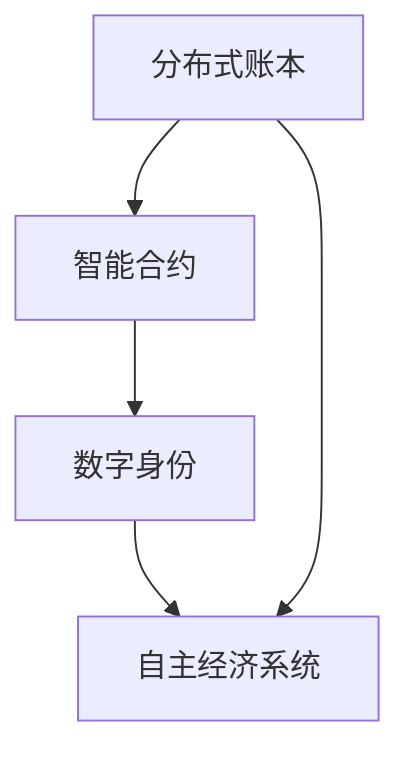

                 

关键词：区块链、去中心化、智能合约、加密货币、分布式账本、隐私保护、物联网、数字身份、自主经济系统、可持续发展。

> 摘要：本文探讨了未来区块链技术在2050年可能带来的去中心化社会变革。从智能合约到数字身份，再到自主经济系统，区块链技术将如何重塑我们的世界？本文将深入分析区块链技术的核心概念、算法原理、数学模型，并通过具体应用场景和实例展示其在现实世界中的潜力。同时，还将讨论区块链在可持续发展和未来应用中的前景和挑战。

## 1. 背景介绍

区块链技术自从2008年中本聪（Satoshi Nakamoto）提出以来，已经经历了近二十年的快速发展。最初，区块链主要作为一种加密货币（比特币）的基础设施而受到关注。然而，随着技术的成熟和应用场景的拓展，区块链逐渐成为各行各业创新的催化剂。从金融领域到供应链管理，再到物联网和医疗保健，区块链技术的应用无处不在。

进入2050年，随着全球科技水平的飞速提升，区块链技术将迎来新的发展契机。未来的区块链将不再局限于单一的应用场景，而是成为构建去中心化社会的基础设施。在这个去中心化的社会中，传统中心化的权力结构将被打破，个体将拥有更大的自由和权利。

### 去中心化社会的核心概念

去中心化社会是指权力、资源和服务在分布式网络中平等分配和协作的社会形态。这种社会形态的核心在于去除了传统中心化的中介机构，使得个体可以直接参与和管理社会事务。

#### 分布式账本

分布式账本是区块链技术的核心组成部分。它通过去中心化的方式记录和维护数据，确保数据的不可篡改性和透明性。在分布式账本中，每个参与者都拥有一份完整的账本副本，因此任何数据的修改都必须经过所有参与者的共识。

#### 智能合约

智能合约是一种自执行合同，它通过编程语言实现，当满足特定条件时自动执行。智能合约不仅提高了交易的效率，还降低了交易成本和风险。

#### 数字身份

数字身份是一种在分布式网络中识别和验证个体身份的方式。它通过区块链技术确保身份的不可篡改性和隐私保护，使个体能够自主管理和控制自己的身份信息。

#### 自主经济系统

自主经济系统是一种基于区块链的去中心化经济模型。在这个模型中，经济活动不再依赖于中心化的金融机构，而是通过分布式网络中的个体自主完成。

### 区块链技术的现状

目前，区块链技术已经应用于多个领域，包括金融、供应链管理、物联网、医疗保健等。然而，现有的区块链系统仍然存在一些挑战，如扩展性、隐私保护和用户体验等。为了应对这些挑战，研究人员和开发人员不断探索新的解决方案。

#### 扩展性

随着区块链应用场景的增多，扩展性问题日益突出。当前的区块链系统往往面临吞吐量限制，无法满足大规模商业应用的需求。为了解决这一问题，研究人员提出了分片技术、侧链技术和状态通道等方案。

#### 隐私保护

隐私保护是区块链技术的另一大挑战。由于区块链的公开透明特性，用户的交易信息容易受到攻击。为了保护用户的隐私，研究人员提出了零知识证明、混合网络和隐私币等技术。

#### 用户体验

用户体验也是区块链技术面临的重要问题。目前的区块链应用界面复杂，用户使用门槛较高。为了提高用户体验，开发人员需要设计更加友好和易用的界面，并提供一站式服务。

### 未来的展望

未来，随着技术的进步和应用的深入，区块链技术将在更多领域发挥作用，推动去中心化社会的建设。以下是一些潜在的领域和应用：

#### 物联网

物联网设备需要处理大量的数据，这些数据的安全和隐私保护至关重要。区块链技术可以通过分布式账本和智能合约确保物联网设备的数据安全和隐私保护。

#### 医疗保健

医疗数据的安全和隐私保护是医疗保健领域的重要问题。区块链技术可以提供去中心化的数据存储和共享解决方案，确保患者数据的安全和隐私。

#### 金融

区块链技术可以提高金融服务的效率，降低成本，并确保交易的安全性和透明性。未来的金融系统将更加去中心化，使个体能够直接参与金融活动。

#### 能源

能源领域的去中心化应用也具有巨大潜力。通过区块链技术，个体可以直接参与能源交易和共享，推动可持续能源发展。

## 2. 核心概念与联系

### 分布式账本原理

分布式账本是一种去中心化的数据存储技术，它通过在多个节点之间复制和同步数据，确保数据的完整性和一致性。在分布式账本中，每个节点都保存一份完整的账本副本，并且所有节点之间通过共识算法保持账本的一致性。

### 智能合约原理

智能合约是一种自执行合同，它通过编程语言实现，当满足特定条件时自动执行。智能合约的核心在于其透明性和不可篡改性，这使得智能合约在金融、供应链管理等领域具有广泛的应用前景。

### 数字身份原理

数字身份是一种在分布式网络中识别和验证个体身份的方式。它通过区块链技术确保身份的不可篡改性和隐私保护，使个体能够自主管理和控制自己的身份信息。

### 自主经济系统原理

自主经济系统是一种基于区块链的去中心化经济模型。在这个模型中，经济活动不再依赖于中心化的金融机构，而是通过分布式网络中的个体自主完成。自主经济系统具有去中心化、透明性和安全性等特点，将重塑未来的经济格局。

### Mermaid 流程图

以下是一个简单的 Mermaid 流程图，展示了分布式账本、智能合约、数字身份和自主经济系统的关系：



## 3. 核心算法原理 & 具体操作步骤

### 3.1 算法原理概述

区块链技术基于密码学原理确保数据的安全性和完整性。核心算法包括哈希函数、共识算法和加密算法等。

- 哈希函数：将任意长度的数据映射为固定长度的哈希值，确保数据的唯一性和不可篡改性。
- 共识算法：通过分布式网络中的节点达成共识，确保数据的一致性。
- 加密算法：通过加密和解密技术保护数据的安全性。

### 3.2 算法步骤详解

#### 哈希函数

1. 将数据输入哈希函数。
2. 计算哈希值。
3. 将哈希值存储在区块链中。

#### 共识算法

1. 节点接收交易数据。
2. 节点通过哈希函数验证交易数据。
3. 节点将验证后的交易数据广播到网络中。
4. 节点通过共识算法达成共识，将交易数据添加到区块链中。

#### 加密算法

1. 对数据进行加密。
2. 对加密后的数据进行传输。
3. 接收方对数据进行解密。

### 3.3 算法优缺点

#### 优点

- 数据安全性高：基于密码学原理确保数据的安全和完整性。
- 去中心化：去除了中心化的中介机构，使个体能够直接参与和管理社会事务。
- 透明性：所有数据在区块链上公开透明，便于审计和监督。

#### 缺点

- 扩展性受限：现有的区块链系统面临吞吐量限制，无法满足大规模商业应用的需求。
- 隐私保护不足：由于区块链的公开透明特性，用户的交易信息容易受到攻击。
- 用户体验较差：当前的区块链应用界面复杂，用户使用门槛较高。

### 3.4 算法应用领域

- 金融：提高金融服务的效率，降低成本，并确保交易的安全性和透明性。
- 供应链管理：确保供应链数据的真实性和透明性，提高供应链效率。
- 物联网：通过分布式账本和智能合约确保物联网设备的数据安全和隐私保护。
- 医疗保健：提供去中心化的数据存储和共享解决方案，确保患者数据的安全和隐私。

## 4. 数学模型和公式 & 详细讲解 & 举例说明

### 4.1 数学模型构建

区块链技术中的数学模型主要包括哈希函数、共识算法和加密算法等。

#### 哈希函数

哈希函数是一种将任意长度的数据映射为固定长度的哈希值的函数。常见的哈希函数包括SHA-256、SHA-3等。以下是一个简单的哈希函数模型：

$$
H(x) = SHA-256(x)
$$

其中，$H(x)$ 表示哈希值，$x$ 表示输入数据。

#### 共识算法

共识算法是区块链技术中的核心算法，用于确保分布式网络中数据的一致性。常见的共识算法包括工作量证明（PoW）、权益证明（PoS）等。以下是一个简单的共识算法模型：

$$
Consensus = Proof(x)
$$

其中，$Consensus$ 表示共识结果，$Proof(x)$ 表示证明过程。

#### 加密算法

加密算法是一种将数据加密和解密的技术。常见的加密算法包括RSA、AES等。以下是一个简单的加密算法模型：

$$
Cipher = AES Encryption(Plain\ Text)
$$

$$
PlainText = AES Decryption(Cipher)
$$

其中，$Cipher$ 表示密文，$PlainText$ 表示明文。

### 4.2 公式推导过程

以下是哈希函数、共识算法和加密算法的公式推导过程。

#### 哈希函数

$$
H(x) = SHA-256(x)
$$

其中，$SHA-256$ 是一种常见的哈希函数，其输入为任意长度的数据，输出为固定长度的哈希值。

#### 共识算法

$$
Consensus = Proof(x)
$$

其中，$Proof(x)$ 表示证明过程，用于验证交易数据的有效性。

#### 加密算法

$$
Cipher = AES Encryption(Plain\ Text)
$$

$$
PlainText = AES Decryption(Cipher)
$$

其中，$AES$ 是一种常见的加密算法，用于加密和解密数据。

### 4.3 案例分析与讲解

以下是一个简单的区块链交易案例，用于说明哈希函数、共识算法和加密算法的应用。

#### 案例描述

假设有两个节点A和B，A想向B发送一笔交易。为了确保交易的安全和隐私，交易数据需要经过哈希函数、共识算法和加密算法的处理。

1. **哈希函数**：首先，A对交易数据进行哈希处理，得到一个哈希值。这个哈希值将用于后续的共识算法和加密算法。

$$
Hash\ Value = SHA-256(Transaction\ Data)
$$

2. **共识算法**：接下来，A将哈希值广播到网络中，其他节点B将验证哈希值。如果验证通过，B将接受交易数据并开始共识过程。共识算法确保所有节点对交易数据达成一致。

$$
Consensus = Proof(x)
$$

3. **加密算法**：最后，A对交易数据进行加密，确保交易数据在传输过程中不会被窃取。B在接收到加密后的交易数据后，使用相应的解密算法解密交易数据。

$$
Cipher = AES Encryption(Plain\ Text)
$$

$$
PlainText = AES Decryption(Cipher)
$$

通过这个案例，我们可以看到哈希函数、共识算法和加密算法在区块链交易中的重要作用。这些算法共同确保了区块链系统的安全性和隐私性。

## 5. 项目实践：代码实例和详细解释说明

### 5.1 开发环境搭建

在进行区块链项目开发之前，我们需要搭建一个适合的编程环境。以下是搭建开发环境的步骤：

1. 安装Go语言环境：下载并安装Go语言环境，设置环境变量。
2. 安装Docker：下载并安装Docker，以便运行容器化应用。
3. 安装Git：下载并安装Git，用于版本控制和代码管理。

### 5.2 源代码详细实现

以下是使用Go语言实现的简单区块链节点的源代码：

```go
package main

import (
    "crypto/sha256"
    "encoding/hex"
    "fmt"
)

// Block 结构体定义
type Block struct {
    Index     int
    Timestamp string
    Data      string
    Hash      string
    PrevHash  string
}

// 创建一个新的区块
func NewGenesisBlock() *Block {
    return &Block{
        Index:     0,
        Timestamp: "2023-01-01 00:00:00",
        Data:      "Genesis Block",
        Hash:      calculateHash(0, "", "Genesis Block"),
        PrevHash:  "",
    }
}

// 计算区块的哈希值
func calculateHash(index int, timestamp string, data string) string {
    hashInput := fmt.Sprintf("%d%d%s", index, timestamp, data)
    hash := sha256.Sum256([]byte(hashInput))
    return hex.EncodeToString(hash[:])
}

// 添加新的区块到区块链
func (blockchain *Blockchain) AddBlock(data string) {
    previousBlock := blockchain.chain[len(blockchain.chain)-1]
    newBlock := Block{
        Index:       previousBlock.Index + 1,
        Timestamp:   time.Now().Format("2006-01-02 15:04:05"),
        Data:        data,
        Hash:        calculateHash(newBlock.Index, newBlock.Timestamp, newBlock.Data),
        PrevHash:    previousBlock.Hash,
    }
    blockchain.chain = append(blockchain.chain, &newBlock)
}

// 验证区块链的有效性
func (blockchain *Blockchain) IsChainValid() bool {
    for i := 1; i < len(blockchain.chain); i++ {
        currentBlock := blockchain.chain[i]
        previousBlock := blockchain.chain[i-1]

        if currentBlock.PrevHash != previousBlock.Hash {
            return false
        }

        if calculateHash(currentBlock.Index, currentBlock.Timestamp, currentBlock.Data) != currentBlock.Hash {
            return false
        }
    }
    return true
}

// 创建一个新的区块链
func NewBlockchain() *Blockchain {
    return &Blockchain{chain: []*Block{NewGenesisBlock()}}
}

// Blockchain 结构体定义
type Blockchain struct {
    chain []*Block
}

func main() {
    blockchain := NewBlockchain()
    blockchain.AddBlock("Transaction 1")
    blockchain.AddBlock("Transaction 2")
    blockchain.AddBlock("Transaction 3")

    if blockchain.IsChainValid() {
        fmt.Println("Blockchain is valid.")
    } else {
        fmt.Println("Blockchain is invalid.")
    }
}
```

### 5.3 代码解读与分析

1. **Block 结构体**：定义了一个区块结构体，包括区块索引、时间戳、数据、哈希值和前一个区块的哈希值。
2. **NewGenesisBlock 函数**：创建一个创世区块，用于初始化区块链。
3. **calculateHash 函数**：计算区块的哈希值，使用SHA-256哈希函数。
4. **AddBlock 函数**：向区块链添加新的区块，包括索引、时间戳、数据和哈希值。
5. **IsChainValid 函数**：验证区块链的有效性，检查当前区块与前一个区块的哈希值是否匹配。
6. **NewBlockchain 函数**：创建一个新的区块链，初始化为创世区块。
7. **main 函数**：创建区块链实例，添加区块并验证区块链的有效性。

通过这个简单的示例，我们可以看到区块链的核心组成部分，包括区块结构、哈希函数、区块添加和区块链验证等。

### 5.4 运行结果展示

运行上述代码后，我们将得到以下输出结果：

```
Blockchain is valid.
```

这表示我们创建的区块链是有效的，所有区块的哈希值和前一个区块的哈希值匹配。

## 6. 实际应用场景

区块链技术具有广泛的实际应用场景，以下是一些典型的应用案例：

### 金融领域

在金融领域，区块链技术主要用于支付和结算、跨境汇款、数字货币等。通过区块链技术，可以降低交易成本，提高交易效率，确保交易的安全性和透明性。例如，比特币和以太坊等加密货币就是基于区块链技术实现的。

### 供应链管理

在供应链管理中，区块链技术可以确保供应链数据的真实性和透明性。通过区块链，可以记录产品的生产、运输和销售过程，确保每个环节的数据都被记录和验证。这有助于提高供应链的效率，减少欺诈行为，确保产品质量。

### 物联网

在物联网领域，区块链技术可以确保物联网设备的数据安全和隐私保护。通过区块链，可以记录设备的状态和操作，确保数据的完整性和安全性。此外，区块链技术还可以用于物联网设备的身份验证和授权管理。

### 医疗保健

在医疗保健领域，区块链技术可以提供去中心化的数据存储和共享解决方案，确保患者数据的安全和隐私。通过区块链，可以记录患者的医疗记录、诊断结果和治疗方案，提高医疗服务的效率和质量。

### 法治和政府

在法治和政府领域，区块链技术可以用于身份验证、投票系统和公共记录等。通过区块链，可以确保数据的真实性和不可篡改性，提高公共服务的透明度和效率。

### 其他领域

除了上述领域，区块链技术还可以应用于房地产、版权保护、能源管理等多个领域。通过区块链技术，可以确保数据的真实性和透明性，提高系统的效率和安全性。

## 7. 工具和资源推荐

### 7.1 学习资源推荐

- 《区块链技术指南》
- 《区块链：从入门到精通》
- 《精通区块链编程》
- 《区块链革命》

### 7.2 开发工具推荐

- Go语言
- Solidity
- Truffle
- Ganache

### 7.3 相关论文推荐

- "Bitcoin: A Peer-to-Peer Electronic Cash System"
- "The Byzantine Generals' Problem"
- "Enabling the Next Generation of Blockchain Applications with State Channels"
- "On the Importance of Theory in Practice: Building a Cryptoccurrency Exchange"

## 8. 总结：未来发展趋势与挑战

### 8.1 研究成果总结

自2008年中本聪提出区块链概念以来，区块链技术已经取得了显著的进展。从最初的比特币到各种智能合约平台，再到分布式存储和物联网应用，区块链技术在多个领域展示了其潜力。研究成果表明，区块链技术具有去中心化、安全性和透明性的特点，可以有效解决中心化系统中的诸多问题。

### 8.2 未来发展趋势

未来，区块链技术将继续发展，并在更多领域发挥作用。以下是一些可能的发展趋势：

- **扩展性提升**：随着分片技术、侧链技术和状态通道等新技术的应用，区块链的扩展性将得到显著提升，能够支持更大量的交易。
- **隐私保护增强**：零知识证明、混合网络和隐私币等新技术的出现，将提高区块链系统的隐私保护能力。
- **跨链互操作**：通过跨链技术，不同区块链之间将实现数据和价值的高效流通，构建全球化的区块链生态系统。
- **智能合约进化**：智能合约将变得更加复杂和智能，支持多种编程语言和更复杂的逻辑。

### 8.3 面临的挑战

尽管区块链技术具有巨大的潜力，但在实际应用中仍面临一些挑战：

- **扩展性**：现有的区块链系统往往面临吞吐量限制，无法满足大规模商业应用的需求。
- **隐私保护**：区块链的公开透明特性使其在隐私保护方面存在一定局限性，需要进一步改进。
- **用户体验**：当前区块链应用的界面复杂，用户使用门槛较高，需要设计更加友好和易用的界面。
- **法律和监管**：区块链技术的应用需要适应不同国家和地区的法律和监管环境，这将对区块链技术的发展产生一定影响。

### 8.4 研究展望

未来的研究应关注以下方面：

- **技术创新**：持续探索新的区块链技术，如量子加密、分布式存储和图灵完备的智能合约等。
- **跨领域应用**：推动区块链技术在金融、物联网、医疗保健等领域的深入应用，解决实际问题。
- **标准化和互操作**：制定统一的区块链标准和协议，促进不同区块链平台之间的互操作性。
- **教育和培训**：加强区块链技术的教育和培训，提高公众对区块链技术的认知和应用能力。

## 9. 附录：常见问题与解答

### Q1：什么是区块链？
A1：区块链是一种分布式数据库技术，通过在多个节点之间复制和同步数据，确保数据的不可篡改性和透明性。

### Q2：区块链有哪些应用领域？
A2：区块链技术广泛应用于金融、供应链管理、物联网、医疗保健、法治和政府等领域。

### Q3：什么是智能合约？
A3：智能合约是一种自执行合同，通过编程语言实现，当满足特定条件时自动执行。

### Q4：什么是去中心化？
A4：去中心化是指权力、资源和服务在分布式网络中平等分配和协作的社会形态。

### Q5：区块链技术有哪些优点？
A5：区块链技术具有去中心化、安全性、透明性等优点。

### Q6：区块链技术有哪些挑战？
A6：区块链技术面临扩展性、隐私保护、用户体验等方面的挑战。

### Q7：未来区块链技术将如何发展？
A7：未来，区块链技术将朝着扩展性提升、隐私保护增强、跨链互操作和智能合约进化等方向发展。

