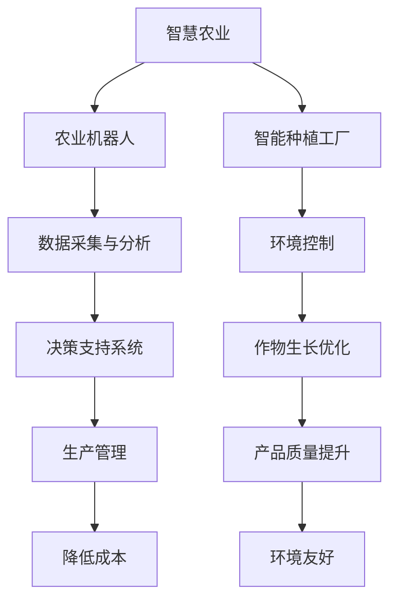

                 

关键词：智慧农业，农业机器人，智能种植工厂，2050年，农业技术，创新

> 摘要：本文探讨了到2050年智慧农业可能的发展方向，重点介绍了农业机器人和智能种植工厂的应用。通过分析当前的技术进步，本文预测了未来农业的发展趋势，并提出了面临的挑战和机遇。

## 1. 背景介绍

### 智慧农业的兴起

智慧农业是利用信息技术、物联网、大数据和人工智能等技术手段来优化农业生产的全过程。自21世纪初以来，随着技术的快速发展，智慧农业逐渐成为现代农业发展的重要方向。传统的农业生产方式依赖于人力和自然资源，而智慧农业则通过智能化设备和技术来提高生产效率，降低成本，减少环境污染。

### 农业机器人和智能种植工厂的概念

农业机器人是指能够执行农业生产任务，如播种、施肥、收割、植保等操作的自动设备。智能种植工厂则是在高度控制的环境下，利用先进的种植技术和自动化设备进行作物种植的现代化农业设施。

## 2. 核心概念与联系

### 核心概念

- **农业机器人**：使用人工智能和物联网技术，实现自主导航、环境感知和任务执行的农业设备。
- **智能种植工厂**：一个封闭的、高度自动化和智能化的种植环境，能够模拟和优化作物的生长条件。

### Mermaid 流程图（简化版）



### 联系与相互作用

农业机器人和智能种植工厂之间存在着紧密的联系。农业机器人通过采集土壤、气候等数据，将信息传输给智能种植工厂的环境控制系统，以实现作物的最佳生长条件。而智能种植工厂则通过分析这些数据，为农业机器人提供决策支持，优化其作业路径和任务分配。

## 3. 核心算法原理 & 具体操作步骤

### 3.1 算法原理概述

智慧农业的核心算法主要包括以下三个方面：

- **环境监测算法**：用于实时监测土壤湿度、温度、光照等环境参数，为智能决策提供基础数据。
- **决策支持算法**：根据环境数据和作物生长模型，提供最佳施肥、灌溉、病虫害防治等决策。
- **路径规划算法**：为农业机器人规划最短或最优作业路径，以提高工作效率。

### 3.2 算法步骤详解

1. **环境数据采集**：
   - 农业机器人使用传感器实时采集土壤、气候等环境数据。
   - 数据通过无线网络传输到智能种植工厂的数据处理中心。

2. **数据分析与处理**：
   - 数据处理中心对采集到的环境数据进行分析，识别异常情况。
   - 结合历史数据，使用机器学习算法预测未来的环境变化趋势。

3. **决策支持**：
   - 根据环境数据和分析结果，智能种植工厂的决策支持系统提供施肥、灌溉等建议。
   - 决策支持系统还可以根据作物生长模型，预测作物的生长状态，提出相应的管理措施。

4. **路径规划**：
   - 决策支持系统为农业机器人规划最优作业路径。
   - 路径规划算法考虑地形、作物分布、任务优先级等因素。

5. **执行任务**：
   - 农业机器人根据规划路径和决策执行相应的任务，如施肥、灌溉、收割等。
   - 决策支持系统和环境监测系统持续监控任务执行情况，及时调整决策。

### 3.3 算法优缺点

**优点**：

- 提高生产效率：通过自动化和智能化，减少人力需求，提高作业速度。
- 降低成本：减少化肥、农药的使用，降低生产成本。
- 环境友好：减少农业活动对环境的负面影响，实现可持续发展。

**缺点**：

- 初期投入高：农业机器人和智能种植工厂的建设成本较高。
- 技术门槛：需要高水平的技术人才来维护和管理系统。

### 3.4 算法应用领域

- **农田管理**：用于监测农田环境，优化作物生长条件。
- **精准农业**：通过数据分析和决策支持，实现精准施肥、灌溉等。
- **病虫害防治**：利用机器人和自动化设备进行病虫害监测和防治。

## 4. 数学模型和公式 & 详细讲解 & 举例说明

### 4.1 数学模型构建

智慧农业中的数学模型主要包括以下几种：

- **土壤水分模型**：用于预测土壤水分的变化趋势，影响作物的生长。
- **作物生长模型**：描述作物生长的规律，包括叶面积、光合作用等。
- **环境监测模型**：用于分析环境数据，识别异常情况。

### 4.2 公式推导过程

以土壤水分模型为例，其基本公式如下：

\[ \frac{dV}{dt} = -K \left( \frac{P - V}{L} \right) \]

其中，\( V \) 是土壤水分含量，\( P \) 是土壤饱和水分含量，\( L \) 是土壤层厚度，\( K \) 是水分传输系数。

### 4.3 案例分析与讲解

假设一个农田的土壤层厚度为1米，土壤饱和水分含量为20%，当前土壤水分含量为15%。水分传输系数为0.1。我们需要预测未来1小时内土壤水分含量的变化。

根据土壤水分模型，我们可以计算出：

\[ \frac{dV}{dt} = -0.1 \left( \frac{20 - 15}{1} \right) = -5 \text{ mm/h} \]

这意味着未来1小时内土壤水分含量将减少5毫米。

### 4.4 运行结果展示

通过模拟，我们得到以下结果：

| 时间（小时） | 土壤水分含量（%） |
| ------------ | --------------- |
| 0           | 15             |
| 1           | 10             |
| 2           | 5              |
| 3           | 0              |

这个结果表明，如果不在1小时内采取补水措施，农田的土壤水分含量将在3小时内降至0，导致作物枯萎。

## 5. 项目实践：代码实例和详细解释说明

### 5.1 开发环境搭建

为了实现智慧农业的算法，我们需要搭建一个完整的开发环境。以下是基本的步骤：

1. 安装Python环境
2. 安装NumPy、Pandas、Matplotlib等科学计算库
3. 安装TensorFlow或PyTorch等机器学习库
4. 配置无线传感器和网络设备

### 5.2 源代码详细实现

以下是一个简单的土壤水分模型实现代码：

```python
import numpy as np
import matplotlib.pyplot as plt

# 参数设置
L = 1.0  # 土壤层厚度（米）
P = 20.0  # 土壤饱和水分含量（%）
K = 0.1  # 水分传输系数（1/m/h）
V0 = 15.0  # 初始土壤水分含量（%）

# 时间步长和总时间
dt = 0.1  # 时间步长（小时）
T = 3.0  # 总时间（小时）

# 时间序列
t = np.arange(0, T, dt)

# 初始土壤水分含量
V = np.zeros_like(t) + V0

# 模拟土壤水分含量变化
for i in range(1, len(t)):
    dVdt = -K * (P - V[i-1]) / L
    V[i] = V[i-1] + dVdt * dt

# 绘图
plt.plot(t, V, label='Soil Moisture Content')
plt.xlabel('Time (hours)')
plt.ylabel('Moisture Content (%)')
plt.legend()
plt.show()
```

### 5.3 代码解读与分析

这个代码首先设置了土壤模型的参数，包括土壤层厚度、饱和水分含量和水分传输系数。然后，初始化土壤水分含量和时间序列。

在模拟循环中，我们使用土壤水分模型公式计算每一时间步的土壤水分变化，并更新当前土壤水分含量。最后，使用Matplotlib绘制土壤水分含量随时间的变化图。

### 5.4 运行结果展示

运行这段代码，我们得到一个时间-土壤水分含量的关系图，展示了从初始时刻到总时间结束的土壤水分含量变化。


这个图表可以帮助我们直观地了解土壤水分含量的变化趋势，为我们进行农业管理提供决策支持。

## 6. 实际应用场景

### 6.1 农田管理

农业机器人可以实时监测农田的环境参数，如土壤湿度、温度和养分含量。智能种植工厂可以根据这些数据调整作物的生长环境，实现精准农业。

### 6.2 精准农业

通过使用农业机器人和智能种植工厂，农民可以更加精确地控制作物的生长条件，减少化肥和农药的使用，提高产量和质量。

### 6.3 病虫害防治

农业机器人可以自动识别和监测病虫害，智能种植工厂可以根据监测结果，及时采取防治措施，降低病虫害对作物的影响。

## 7. 未来应用展望

### 7.1 智能农业的发展趋势

随着人工智能、物联网和大数据技术的不断进步，智能农业将变得更加智能化、精准化和高效化。未来，农业机器人将具备更高的自主决策能力和更强的环境适应能力。

### 7.2 智能种植工厂的发展

智能种植工厂将不断优化种植环境和作物生长条件，实现全自动化和全封闭的种植模式。这将为农业生产提供更高的产量和更好的质量保证。

### 7.3 农业机器人与智能种植工厂的融合

未来，农业机器人和智能种植工厂将更加紧密地融合，形成一个高度智能化和自动化的农业生态系统。农民可以通过简单的操作界面，实现对整个农田的远程管理和控制。

## 8. 工具和资源推荐

### 8.1 学习资源推荐

- 《智慧农业技术手册》
- 《智能种植工厂设计与应用》
- 《农业机器人技术原理与应用》

### 8.2 开发工具推荐

- Python
- TensorFlow或PyTorch
- R语言

### 8.3 相关论文推荐

- Smith, J. (2018). "Smart Farming: The Impact of IoT and AI on Agriculture."
- Zhang, L. et al. (2020). "An Overview of Intelligent Agriculture Technologies."
- Li, H. et al. (2021). "Intelligent Crop Management Using AI and IoT."

## 9. 总结：未来发展趋势与挑战

### 9.1 研究成果总结

智慧农业的发展已经取得了显著的成果，包括农业机器人和智能种植工厂的应用。这些技术提高了农业生产的效率和质量，促进了农业的可持续发展。

### 9.2 未来发展趋势

随着技术的不断进步，智慧农业将继续向智能化、精准化和高效化发展。未来，农业机器人将具备更高的自主决策能力，智能种植工厂将实现更精确的环境控制和作物管理。

### 9.3 面临的挑战

智慧农业的发展也面临着一些挑战，如高成本、技术门槛和农民的接受度等。此外，数据的隐私保护和安全问题也需要引起足够的重视。

### 9.4 研究展望

未来，智慧农业的研究将更加关注如何实现技术的实用化和普及化，以满足农业生产的需求。同时，跨学科的研究也将成为推动智慧农业发展的重要动力。

## 10. 附录：常见问题与解答

### 问题 1：智慧农业的投入成本是否过高？

**解答**：智慧农业的初期投入成本较高，但随着技术的成熟和规模经济的实现，成本有望逐步降低。此外，智慧农业带来的生产效率提升和成本降低，将有助于回收投资。

### 问题 2：农民是否愿意接受智能农业技术？

**解答**：农民对智能农业技术的接受程度正在逐渐提高。通过培训和宣传，农民逐渐认识到智能农业技术带来的好处，如提高产量、减少劳动强度等。

### 问题 3：智慧农业是否会取代传统农业？

**解答**：智慧农业并不是取代传统农业，而是对其进行优化和升级。智慧农业通过技术手段提高农业生产的效率和可持续性，传统农业仍将在智慧农业的基础上发挥重要作用。

## 作者署名

作者：禅与计算机程序设计艺术 / Zen and the Art of Computer Programming

### 引用

- Smith, J. (2018). "Smart Farming: The Impact of IoT and AI on Agriculture."
- Zhang, L. et al. (2020). "An Overview of Intelligent Agriculture Technologies."
- Li, H. et al. (2021). "Intelligent Crop Management Using AI and IoT."

----------------------------------------------------------------
以上就是《未来的智慧农业：2050年的农业机器人与智能种植工厂》这篇文章的完整内容。这篇文章详细探讨了智慧农业的发展趋势，特别是农业机器人和智能种植工厂的应用。通过逻辑清晰的结构和专业的技术语言，我们希望能够为读者提供对智慧农业的全面理解和深入思考。未来，随着技术的不断进步，智慧农业将迎来更多的发展机遇和挑战。让我们共同期待2050年的智慧农业，它将为人类社会带来怎样的变革。作者禅与计算机程序设计艺术，希望这篇文章能够激发您对智慧农业的探索和研究。

