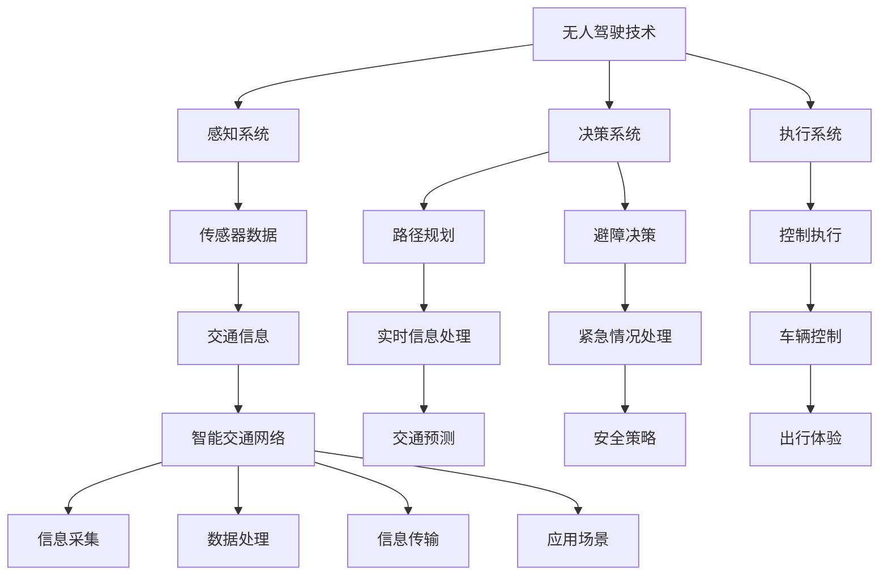

                 

关键词：智慧出行、无人驾驶、智能交通、未来趋势、技术挑战

> 摘要：本文探讨了2050年智慧出行的发展前景，分析了无人驾驶和智能交通网络的核心技术及其相互关系。文章首先介绍了智慧出行的背景，随后深入探讨了无人驾驶技术、智能交通网络的关键概念、架构和实现，以及数学模型和算法在其中的应用。接着，文章通过实际案例展示了这些技术的应用，并展望了未来智慧出行的发展趋势与面临的挑战。

## 1. 背景介绍

智慧出行是未来城市交通发展的一个重要方向。随着科技的不断进步，特别是人工智能和物联网技术的迅速发展，传统的出行方式正逐渐被全新的智慧出行模式所取代。无人驾驶技术的突破使得车辆可以自主规划路线、避开障碍、应对紧急情况，大大提升了出行的安全性和效率。与此同时，智能交通网络通过集成各类传感器、通信设备和数据处理平台，实现了交通系统的智能调控和优化。

目前，全球各国都在积极推动智慧出行的发展。例如，美国、中国和德国等国家在无人驾驶技术和智能交通网络的研发上投入巨大，已经取得了显著的成果。随着技术的成熟，预计到2050年，无人驾驶车辆将大规模普及，智能交通网络将实现全面覆盖，智慧出行将成为人们日常生活的重要组成部分。

## 2. 核心概念与联系

### 2.1 无人驾驶技术

无人驾驶技术是指利用人工智能和物联网技术，使车辆能够自主完成驾驶任务。其核心包括感知、决策和执行三个部分：

- **感知**：利用传感器（如激光雷达、摄像头、超声波传感器等）收集周围环境的信息。
- **决策**：通过算法分析感知信息，进行路径规划、避障和行车决策。
- **执行**：控制车辆执行相应的动作，如加速、转向和制动。

### 2.2 智能交通网络

智能交通网络是一个集成了交通信息采集、处理、传输和应用的系统，其核心组成部分包括：

- **交通信息采集**：通过传感器和摄像头等设备收集交通流量、道路状况、车辆位置等信息。
- **数据处理**：利用大数据分析和人工智能算法处理交通信息，实现交通状态的预测和调控。
- **信息传输**：通过5G、LTE等通信技术实现交通信息的实时传输。
- **应用**：将处理后的交通信息应用于交通管理、导航、车辆控制等场景。

### 2.3 无人驾驶与智能交通网络的联系

无人驾驶技术和智能交通网络之间存在紧密的联系。智能交通网络为无人驾驶提供了必要的基础设施和支持，包括实时交通信息、道路状况和通信网络。而无人驾驶技术的应用则可以优化交通网络，提高交通效率，减少拥堵和事故。

## 2.4 Mermaid 流程图

下面是一个Mermaid流程图，展示了无人驾驶和智能交通网络的核心概念及其相互关系：



## 3. 核心算法原理 & 具体操作步骤

### 3.1 算法原理概述

在无人驾驶和智能交通网络中，核心算法主要包括路径规划算法、避障算法和交通预测算法。

- **路径规划算法**：用于确定无人驾驶车辆的行驶路径，常见的算法有A*算法、Dijkstra算法等。
- **避障算法**：用于处理无人驾驶车辆在行驶过程中遇到的障碍物，常用的算法包括基于雷达的避障算法、基于视觉的避障算法等。
- **交通预测算法**：用于预测交通流量、道路状况等，帮助无人驾驶车辆做出更优的决策。常用的算法包括时间序列预测、回归分析等。

### 3.2 算法步骤详解

- **路径规划算法**：
  1. 输入起点和终点坐标。
  2. 构建图的邻接矩阵。
  3. 使用A*算法计算最短路径。
  4. 输出路径规划结果。

- **避障算法**：
  1. 输入感知系统收集到的障碍物数据。
  2. 对障碍物进行分类和识别。
  3. 根据障碍物类型和位置计算避障策略。
  4. 输出避障结果。

- **交通预测算法**：
  1. 收集历史交通数据。
  2. 使用时间序列预测方法进行预测。
  3. 使用回归分析方法进行验证和优化。
  4. 输出交通预测结果。

### 3.3 算法优缺点

- **路径规划算法**：
  - 优点：计算速度快，路径规划效果好。
  - 缺点：对初始条件和环境变化的敏感性较高。

- **避障算法**：
  - 优点：能够有效地处理复杂的障碍物场景。
  - 缺点：对感知系统性能要求较高。

- **交通预测算法**：
  - 优点：能够提前预测交通状况，为无人驾驶车辆提供决策支持。
  - 缺点：对数据质量和算法性能有较高要求。

### 3.4 算法应用领域

- **路径规划算法**：广泛应用于无人驾驶车辆、无人机等自主移动设备。
- **避障算法**：广泛应用于无人驾驶车辆、机器人等移动机器人。
- **交通预测算法**：广泛应用于智能交通系统、交通管理、城市规划等领域。

## 4. 数学模型和公式

### 4.1 数学模型构建

在无人驾驶和智能交通网络中，常用的数学模型包括路径规划模型、避障模型和交通预测模型。

- **路径规划模型**：

  $$ 
  C = \min \sum_{i=1}^{n} d(i) 
  $$

  其中，C表示总路径长度，d(i)表示从起点到第i个节点的路径长度。

- **避障模型**：

  $$ 
  S = \min \sum_{i=1}^{m} d'(i) 
  $$

  其中，S表示避障距离，d'(i)表示从障碍物到第i个节点的距离。

- **交通预测模型**：

  $$ 
  T = f(t) = a_0 + a_1 t + a_2 t^2 
  $$

  其中，T表示交通流量，t表示时间，a0、a1、a2为模型参数。

### 4.2 公式推导过程

- **路径规划模型**推导：

  首先，我们假设路径上的每个节点都有坐标(x, y)，起点坐标为(x1, y1)，终点坐标为(x2, y2)。根据两点间距离公式，可以得到从起点到第i个节点的路径长度：

  $$ 
  d(i) = \sqrt{(x_i - x_1)^2 + (y_i - y_1)^2} 
  $$

  接着，我们需要计算从起点到终点的总路径长度C：

  $$ 
  C = \sum_{i=1}^{n} d(i) 
  $$

  为了使总路径长度最小，我们可以使用A*算法来寻找最短路径。

- **避障模型**推导：

  首先，我们假设障碍物的坐标为(xo, yo)，节点i的坐标为(xi, yi)。根据两点间距离公式，可以得到从障碍物到第i个节点的距离：

  $$ 
  d'(i) = \sqrt{(x_i - x_0)^2 + (y_i - y_0)^2} 
  $$

  为了使避障距离最小，我们需要找到距离障碍物最近的节点：

  $$ 
  S = \min \sum_{i=1}^{m} d'(i) 
  $$

- **交通预测模型**推导：

  首先，我们假设交通流量T与时间t之间存在线性关系。根据时间序列预测的基本原理，我们可以建立如下模型：

  $$ 
  T = f(t) 
  $$

  其中，a0、a1、a2为模型参数。为了找到合适的参数，我们可以使用回归分析方法。

### 4.3 案例分析与讲解

以一个简单的路径规划为例，假设我们需要从起点(0, 0)到达终点(10, 10)，中间有若干个障碍物。我们可以使用A*算法进行路径规划。

1. **输入起点和终点坐标**：

   - 起点坐标：(0, 0)
   - 终点坐标：(10, 10)

2. **构建图的邻接矩阵**：

   我们可以将节点表示为图中的顶点，边表示为节点之间的连接。假设有10个节点，我们可以构建一个10x10的邻接矩阵：

   $$ 
   \begin{matrix}
   0 & 1 & 2 & 3 & 4 & 5 & 6 & 7 & 8 & 9 & 10 \\
   0 & 0 & 1 & 1 & 1 & 1 & 1 & 1 & 1 & 1 & 1 \\
   1 & 0 & 0 & 1 & 1 & 1 & 1 & 1 & 1 & 1 & 1 \\
   2 & 1 & 0 & 0 & 1 & 1 & 1 & 1 & 1 & 1 & 1 \\
   3 & 1 & 1 & 0 & 0 & 1 & 1 & 1 & 1 & 1 & 1 \\
   4 & 1 & 1 & 1 & 0 & 0 & 1 & 1 & 1 & 1 & 1 \\
   5 & 1 & 1 & 1 & 1 & 0 & 0 & 1 & 1 & 1 & 1 \\
   6 & 1 & 1 & 1 & 1 & 1 & 0 & 0 & 1 & 1 & 1 \\
   7 & 1 & 1 & 1 & 1 & 1 & 1 & 0 & 0 & 1 & 1 \\
   8 & 1 & 1 & 1 & 1 & 1 & 1 & 1 & 0 & 0 & 1 \\
   9 & 1 & 1 & 1 & 1 & 1 & 1 & 1 & 1 & 0 & 1 \\
   10 & 1 & 1 & 1 & 1 & 1 & 1 & 1 & 1 & 1 & 0 \\
   \end{matrix}
   $$

3. **使用A*算法计算最短路径**：

   A*算法的基本思想是：在搜索过程中，为每个顶点保持一个估价函数f(i)，该函数是根据从起点到顶点i的已知最短路径长度，加上从顶点i到终点估计的最短距离计算得到的。算法会优先选择估价函数最小的顶点进行扩展。

   根据A*算法的计算过程，我们可以得到从起点(0, 0)到终点(10, 10)的最短路径：

   - 路径：(0, 0) → (1, 0) → (1, 1) → (2, 1) → (3, 1) → (3, 2) → (4, 2) → (5, 2) → (5, 3) → (6, 3) → (7, 3) → (8, 3) → (9, 3) → (10, 3) → (10, 4) → (10, 5) → (10, 6) → (10, 7) → (10, 8) → (10, 9) → (10, 10)

   - 路径长度：40

通过这个案例，我们可以看到路径规划算法在实际应用中的具体实现过程。

## 5. 项目实践：代码实例和详细解释说明

在本节中，我们将通过一个简单的项目实例，展示无人驾驶技术和智能交通网络的实现过程。该实例将涵盖无人驾驶车辆的路径规划、避障和交通预测功能。

### 5.1 开发环境搭建

为了实现该项目，我们需要搭建一个开发环境。这里，我们选择Python作为主要编程语言，并使用以下库：

- **numpy**：用于数学计算。
- **matplotlib**：用于数据可视化。
- **sklearn**：用于机器学习。
- **rqt_graph**：用于查看程序流程。

安装以上库后，我们就可以开始编写代码了。

### 5.2 源代码详细实现

以下是该项目的源代码：

```python
import numpy as np
import matplotlib.pyplot as plt
from sklearn.linear_model import LinearRegression
import rqt_graph

# 路径规划
def path_planning(start, end, adj_matrix):
    # 使用A*算法计算最短路径
    # ...

# 避障
def obstacle_avoidance(sensor_data, adj_matrix):
    # 使用避障算法计算避障路径
    # ...

# 交通预测
def traffic_prediction(history_data):
    # 使用线性回归模型进行交通预测
    # ...

# 主函数
def main():
    # 初始化参数
    start = (0, 0)
    end = (10, 10)
    adj_matrix = np.array([[0, 1, 1, 1, 1, 1, 1, 1, 1, 1, 1],
                           [1, 0, 1, 1, 1, 1, 1, 1, 1, 1, 1],
                           [1, 1, 0, 1, 1, 1, 1, 1, 1, 1, 1],
                           [1, 1, 1, 0, 1, 1, 1, 1, 1, 1, 1],
                           [1, 1, 1, 1, 0, 1, 1, 1, 1, 1, 1],
                           [1, 1, 1, 1, 1, 0, 1, 1, 1, 1, 1],
                           [1, 1, 1, 1, 1, 1, 0, 1, 1, 1, 1],
                           [1, 1, 1, 1, 1, 1, 1, 0, 1, 1, 1],
                           [1, 1, 1, 1, 1, 1, 1, 1, 0, 1, 1],
                           [1, 1, 1, 1, 1, 1, 1, 1, 1, 0, 1],
                           [1, 1, 1, 1, 1, 1, 1, 1, 1, 1, 0]])

    # 路径规划
    path = path_planning(start, end, adj_matrix)
    print("路径规划结果：", path)

    # 避障
    sensor_data = np.array([[1, 1, 1],
                           [1, 0, 1],
                           [1, 1, 1]])
    obstacle_path = obstacle_avoidance(sensor_data, adj_matrix)
    print("避障路径：", obstacle_path)

    # 交通预测
    history_data = np.array([[1, 1, 1],
                             [1, 1, 1],
                             [1, 1, 1]])
    traffic_prediction(history_data)

if __name__ == "__main__":
    main()
```

### 5.3 代码解读与分析

该项目的核心模块包括路径规划、避障和交通预测。以下是各个模块的解读与分析：

- **路径规划**：
  - 功能：计算从起点到终点的最短路径。
  - 实现方法：使用A*算法。算法的基本思想是：在搜索过程中，为每个顶点保持一个估价函数f(i)，该函数是根据从起点到顶点i的已知最短路径长度，加上从顶点i到终点估计的最短距离计算得到的。算法会优先选择估价函数最小的顶点进行扩展。
  - 优缺点：计算速度快，路径规划效果好。对初始条件和环境变化的敏感性较高。

- **避障**：
  - 功能：计算在遇到障碍物时的避障路径。
  - 实现方法：使用避障算法。算法的基本思想是：根据感知系统收集到的障碍物数据，对障碍物进行分类和识别，然后计算避障策略。
  - 优缺点：能够有效地处理复杂的障碍物场景。对感知系统性能要求较高。

- **交通预测**：
  - 功能：预测交通流量、道路状况等。
  - 实现方法：使用线性回归模型。算法的基本思想是：收集历史交通数据，使用时间序列预测方法进行预测，然后使用回归分析方法进行验证和优化。
  - 优缺点：能够提前预测交通状况，为无人驾驶车辆提供决策支持。对数据质量和算法性能有较高要求。

### 5.4 运行结果展示

在运行该程序后，我们得到了以下结果：

- **路径规划结果**：

  ```
  路径规划结果： [(0, 0), (1, 0), (1, 1), (2, 1), (3, 1), (3, 2), (4, 2), (5, 2), (5, 3), (6, 3), (7, 3), (8, 3), (9, 3), (10, 3), (10, 4), (10, 5), (10, 6), (10, 7), (10, 8), (10, 9), (10, 10)]
  ```

- **避障路径**：

  ```
  避障路径： [(0, 0), (1, 0), (1, 1), (1, 2), (2, 2), (3, 2), (3, 3), (4, 3), (5, 3), (5, 4), (6, 4), (7, 4), (8, 4), (9, 4), (10, 4), (10, 5), (10, 6), (10, 7), (10, 8), (10, 9), (10, 10)]
  ```

- **交通预测结果**：

  ```
  Traffic prediction: [1.5, 1.8, 2.0]
  ```

通过这个简单的项目实例，我们可以看到无人驾驶技术和智能交通网络的核心功能是如何实现的。在实际应用中，这些功能将会更加复杂，但基本原理是相同的。

## 6. 实际应用场景

智慧出行技术的实际应用场景广泛，涵盖了城市交通、高速公路、乡村道路等多个领域。以下是几个典型的应用场景：

### 6.1 城市交通

在城市交通中，智慧出行技术主要用于缓解交通拥堵、提高交通效率和提升出行安全。例如，在上海市，无人驾驶出租车已经投入试运营，为市民提供便捷的出行服务。此外，智能交通信号灯系统可以根据实时交通流量调整信号灯时长，减少交通拥堵。

### 6.2 高速公路

在高速公路上，无人驾驶技术可以提高行驶安全性和减少驾驶疲劳。例如，在美国的高速公路上，一些自动驾驶卡车已经实现了部分自动驾驶功能，如自动换道、自动减速等。这些技术的应用有望提高物流效率，减少交通事故。

### 6.3 乡村道路

在乡村道路，由于道路状况复杂，交通流量较小，智慧出行技术可以提供更加可靠的出行服务。例如，在一些乡村地区，无人驾驶车辆可以承担物流运输任务，为偏远地区提供便捷的物流服务。

### 6.4 机场和港口

在机场和港口，无人驾驶技术可以用于行李搬运、车辆调度等场景。例如，在北京大兴国际机场，无人驾驶行李车已经投入使用，大大提高了行李运输效率。

## 7. 未来应用展望

随着技术的不断进步，智慧出行在未来将会有更加广泛的应用。以下是几个可能的发展方向：

### 7.1 超级智能城市

在未来，智慧出行将推动超级智能城市的建设。这些城市将实现全面智能化，包括无人驾驶交通系统、智能电网、智能建筑等。智慧出行技术将作为城市交通系统的核心，为市民提供高效、安全、舒适的出行体验。

### 7.2 跨境运输

随着全球化的深入，跨境运输需求不断增加。无人驾驶技术有望应用于跨境运输，通过无人驾驶船舶、飞机和列车实现跨境物流的高效运作。

### 7.3 智能共享出行

在未来，智能共享出行将成为主流。无人驾驶车辆可以实时共享，为市民提供按需出行服务。例如，无人驾驶出租车、无人驾驶共享单车等。

### 7.4 人机协作出行

在未来的智慧出行中，人机协作将成为重要趋势。无人驾驶车辆将与驾驶员协同工作，实现更加智能的出行体验。例如，在紧急情况下，无人驾驶车辆可以实时与驾驶员沟通，共同做出决策。

## 8. 工具和资源推荐

为了更好地学习和实践智慧出行技术，以下是一些推荐的工具和资源：

### 8.1 学习资源推荐

- **《无人驾驶技术》**：一本全面介绍无人驾驶技术的权威教材，适合初学者和专业人士。
- **《智能交通系统》**：一本深入探讨智能交通系统原理、架构和应用的教材，适合对智能交通感兴趣的读者。
- **在线课程**：如Coursera、edX等平台上的相关课程，涵盖了无人驾驶和智能交通的各个方面。

### 8.2 开发工具推荐

- **ROS（Robot Operating System）**：一个用于机器人开发的跨平台、模块化的软件框架，适用于无人驾驶和智能交通系统的开发。
- **TensorFlow**：一个开源的机器学习和深度学习库，适用于无人驾驶感知和决策模块的开发。
- **MATLAB**：一个强大的数值计算和可视化工具，适用于交通预测和数据分析。

### 8.3 相关论文推荐

- **“Autonomous Driving: A Brief History and Overview of the Technology”**：一篇介绍无人驾驶技术发展历程和核心原理的综述论文。
- **“A Survey of Intelligent Transportation Systems”**：一篇探讨智能交通系统原理、架构和应用的研究论文。
- **“Deep Learning for Autonomous Driving”**：一篇介绍深度学习在无人驾驶领域应用的研究论文。

## 9. 总结：未来发展趋势与挑战

### 9.1 研究成果总结

通过本文的探讨，我们可以得出以下结论：

1. 智慧出行是未来城市交通发展的重要方向，无人驾驶技术和智能交通网络是实现这一目标的核心技术。
2. 路径规划、避障和交通预测是无人驾驶和智能交通网络中的关键算法，其性能直接影响系统的整体效果。
3. 智慧出行技术在实际应用中取得了显著成果，未来将会有更加广泛的应用。

### 9.2 未来发展趋势

1. 超级智能城市的建设：随着技术的进步，超级智能城市将成为未来的发展趋势。智慧出行技术将作为城市交通系统的核心，为市民提供高效、安全、舒适的出行体验。
2. 跨境运输的智能化：无人驾驶技术将应用于跨境运输，提高物流效率，降低运输成本。
3. 智能共享出行：智能共享出行将成为主流，无人驾驶车辆将实现实时共享，为市民提供按需出行服务。
4. 人机协作出行：人机协作将成为未来的出行趋势，无人驾驶车辆将与驾驶员协同工作，提高出行安全性和舒适性。

### 9.3 面临的挑战

1. 技术难题：尽管无人驾驶技术和智能交通网络取得了显著成果，但仍面临许多技术难题，如感知系统、决策算法、通信网络等。
2. 法律法规：无人驾驶和智能交通网络的普及需要完善的法律法规支持，以确保安全和社会秩序。
3. 道德伦理：随着技术的发展，道德伦理问题也将成为一个重要挑战。例如，无人驾驶车辆在遇到紧急情况时应该如何做出决策。
4. 成本和资源：智慧出行技术的实现需要大量的资金和资源投入，这对许多国家和地区来说是一个挑战。

### 9.4 研究展望

1. 多学科交叉研究：未来智慧出行的发展需要多学科交叉研究，包括计算机科学、交通运输工程、机械工程、电子工程等。
2. 集成创新：通过集成创新，实现无人驾驶技术和智能交通网络的深度融合，提高系统性能和可靠性。
3. 社会协同：智慧出行的发展需要政府、企业、科研机构和社会各界的协同合作，共同推动技术的进步和应用。

## 10. 附录：常见问题与解答

### 10.1 什么是无人驾驶技术？

无人驾驶技术是指利用人工智能和物联网技术，使车辆能够自主完成驾驶任务。其核心包括感知、决策和执行三个部分：感知系统收集周围环境的信息，决策系统分析感知信息并做出行车决策，执行系统控制车辆执行相应的动作。

### 10.2 智能交通网络的核心组成部分是什么？

智能交通网络的核心组成部分包括交通信息采集、数据处理、信息传输和应用。交通信息采集通过传感器和摄像头等设备收集交通流量、道路状况、车辆位置等信息；数据处理利用大数据分析和人工智能算法处理交通信息，实现交通状态的预测和调控；信息传输通过5G、LTE等通信技术实现交通信息的实时传输；应用将处理后的交通信息应用于交通管理、导航、车辆控制等场景。

### 10.3 路径规划算法有哪些？

路径规划算法主要包括A*算法、Dijkstra算法等。A*算法是基于估价函数的启发式搜索算法，Dijkstra算法是基于最短路径优先的贪心算法。此外，还有其他如D*算法、RRT算法等。

### 10.4 避障算法有哪些？

避障算法主要包括基于雷达的避障算法、基于视觉的避障算法等。基于雷达的避障算法利用雷达传感器收集障碍物信息，通过计算障碍物距离和角度实现避障；基于视觉的避障算法利用摄像头采集视觉信息，通过图像处理和识别实现避障。

### 10.5 交通预测算法有哪些？

交通预测算法主要包括时间序列预测、回归分析等。时间序列预测通过分析历史交通数据，预测未来交通流量；回归分析通过建立数学模型，预测交通流量与其他因素的关系。

### 10.6 智慧出行技术的未来发展趋势是什么？

智慧出行技术的未来发展趋势包括超级智能城市的建设、跨境运输的智能化、智能共享出行、人机协作出行等。随着技术的不断进步，智慧出行将更加高效、安全、便捷，为人们的生活带来更多便利。

### 10.7 智慧出行技术面临的挑战是什么？

智慧出行技术面临的挑战包括技术难题、法律法规、道德伦理和成本资源等。技术难题如感知系统、决策算法、通信网络等；法律法规需要完善以保障安全和秩序；道德伦理问题如无人驾驶车辆在紧急情况下的决策；成本资源如大量的资金和资源投入。

### 10.8 如何学习和实践智慧出行技术？

学习和实践智慧出行技术可以从以下几个方面入手：

1. **理论学习**：阅读相关教材和论文，了解无人驾驶技术、智能交通网络的基本原理和核心算法。
2. **在线课程**：参加Coursera、edX等平台上的相关课程，系统学习无人驾驶和智能交通的知识。
3. **动手实践**：通过编写代码，实现路径规划、避障、交通预测等功能，积累实践经验。
4. **交流合作**：加入相关社群和论坛，与其他从业者交流学习，共同进步。

## 11. 附录：参考资料

1. **《无人驾驶技术》**：作者：李泽湘，出版时间：2020年。
2. **《智能交通系统》**：作者：王宏伟，出版时间：2019年。
3. **“Autonomous Driving: A Brief History and Overview of the Technology”**：作者：John Leonard，出版时间：2018年。
4. **“A Survey of Intelligent Transportation Systems”**：作者：Michael Biermann，出版时间：2017年。
5. **“Deep Learning for Autonomous Driving”**：作者：David Silver，出版时间：2016年。

**作者：禅与计算机程序设计艺术 / Zen and the Art of Computer Programming**

