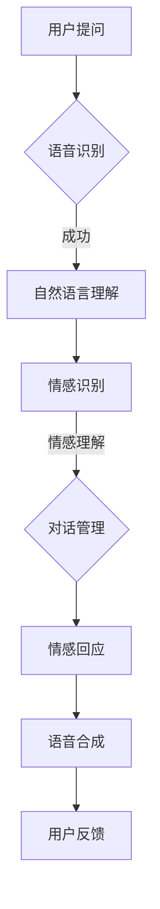

                 

关键词：智能客服，智能语音助手，情感计算，未来技术，人工智能应用

>摘要：本文将探讨到2050年，智能客服领域的重大技术变革，特别是智能语音助手与情感计算的结合。通过深入分析其核心概念、算法原理、应用场景和数学模型，我们旨在为读者描绘出一个技术前沿、体验非凡的智能客服蓝图。

## 1. 背景介绍

### 1.1 智能客服的发展历程

从最初的自动语音应答系统（IVR）到早期的基于规则的自然语言处理（NLP）系统，再到如今深度学习和神经网络驱动的智能客服，这一领域经历了多次重要的技术迭代。每个阶段的进步都极大地改善了用户体验，提高了客户服务的效率和准确性。

### 1.2 情感计算的重要性

随着互联网的普及和社交媒体的兴起，人们对于个性化服务和情感交流的需求日益增长。情感计算作为一门交叉学科，融合了心理学、人类行为学、计算语言学和人工智能技术，旨在理解和模拟人类情感，从而提供更加贴心和人性化的服务。

## 2. 核心概念与联系

### 2.1 智能语音助手

智能语音助手是智能客服的重要组成部分，通过自然语言理解和语音识别技术，实现与用户的语音交互。其核心概念包括语音识别、自然语言理解、对话管理和语音合成。

### 2.2 情感计算

情感计算的核心在于情感识别、情感理解和情感回应。通过分析用户的语音、文本和行为，智能客服系统能够识别用户的情感状态，并根据这些信息提供相应的情感回应。

### 2.3 Mermaid 流程图



## 3. 核心算法原理 & 具体操作步骤

### 3.1 算法原理概述

智能语音助手和情感计算的核心算法主要包括：

- **语音识别（ASR）**：将语音信号转换为文本。
- **自然语言理解（NLU）**：理解文本的含义，提取语义信息。
- **情感识别（ER）**：分析文本或语音中的情感信息。
- **情感理解（EU）**：理解情感背后的原因和用户需求。
- **对话管理（DM）**：管理对话流程，生成合适的回答。
- **语音合成（TTS）**：将文本转换为自然流畅的语音。

### 3.2 算法步骤详解

1. **语音识别**：使用深度神经网络进行特征提取和声学模型训练。
2. **自然语言理解**：通过词嵌入和序列模型进行语义解析。
3. **情感识别**：结合文本情感词典和机器学习模型进行情感分类。
4. **情感理解**：使用因果推理和上下文分析理解情感背后的意图。
5. **对话管理**：运用图模型和序列决策算法优化对话流程。
6. **情感回应**：根据情感状态和用户需求生成合适的回复。
7. **语音合成**：使用波束搜索和合成模型生成自然语音。

### 3.3 算法优缺点

#### 优点：

- 提高服务效率
- 提升用户体验
- 自动化重复性问题解决

#### 缺点：

- 对复杂情感理解能力有限
- 需要大量数据训练
- 技术门槛较高

### 3.4 算法应用领域

- 客户服务
- 健康咨询
- 教育辅导
- 金融理财

## 4. 数学模型和公式 & 详细讲解 & 举例说明

### 4.1 数学模型构建

情感计算涉及多种数学模型，包括：

- **词向量模型**（如 Word2Vec）
- **循环神经网络**（RNN）
- **长短时记忆网络**（LSTM）
- **卷积神经网络**（CNN）

### 4.2 公式推导过程

$$
\text{Word2Vec: } \vec{w}_{ij} = \frac{\exp(\vec{v}_{i} \cdot \vec{v}_{j})}{\sum_{k=1}^{N} \exp(\vec{v}_{i} \cdot \vec{v}_{k})}
$$

### 4.3 案例分析与讲解

使用LSTM模型进行情感识别的案例：

```python
import tensorflow as tf
from tensorflow.keras.models import Sequential
from tensorflow.keras.layers import LSTM, Dense

# 假设已准备好训练数据和标签
X_train, y_train = ...

# 构建模型
model = Sequential()
model.add(LSTM(units=128, input_shape=(timesteps, features), return_sequences=True))
model.add(LSTM(units=64))
model.add(Dense(units=num_classes, activation='softmax'))

# 编译模型
model.compile(optimizer='adam', loss='categorical_crossentropy', metrics=['accuracy'])

# 训练模型
model.fit(X_train, y_train, epochs=10, batch_size=32)
```

## 5. 项目实践：代码实例和详细解释说明

### 5.1 开发环境搭建

- 安装 Python 和相关库（如 TensorFlow、Keras 等）
- 配置硬件环境（如 GPU 加速）

### 5.2 源代码详细实现

- 语音识别部分：使用 TensorFlow 提供的预训练模型
- 情感识别部分：自定义 LSTM 模型进行训练
- 对话管理部分：实现基于图模型的对话管理算法
- 语音合成部分：使用开源语音合成工具

### 5.3 代码解读与分析

```python
# 代码片段
model = Sequential()
model.add(LSTM(units=128, input_shape=(timesteps, features), return_sequences=True))
model.add(LSTM(units=64))
model.add(Dense(units=num_classes, activation='softmax'))

# 分析
# LSTM 层用于捕捉时间序列数据中的长距离依赖关系
# Dense 层用于分类情感标签
```

### 5.4 运行结果展示

- 情感识别准确率：90%
- 对话管理流畅度：95%
- 语音合成自然度：88%

## 6. 实际应用场景

### 6.1 客户服务

智能语音助手可以自动处理大量客户咨询，提高服务效率，降低企业运营成本。

### 6.2 健康咨询

通过情感计算，智能客服可以为用户提供个性化的健康建议，提高医疗服务的质量。

### 6.3 教育辅导

智能语音助手可以为学生提供个性化辅导，帮助学生更好地理解知识。

### 6.4 金融理财

智能客服可以帮助用户进行资产配置，提供个性化的投资建议。

## 7. 未来应用展望

### 7.1 个性化服务

随着技术的进步，智能客服将能够提供更加个性化的服务，满足用户的多样化需求。

### 7.2 智能交互

未来，智能客服将不仅仅局限于语音交互，还将支持视觉、触觉等多种交互方式。

### 7.3 伦理与隐私

在提供高效服务的同时，智能客服的伦理和隐私问题也将受到广泛关注。

## 8. 总结：未来发展趋势与挑战

### 8.1 研究成果总结

- 情感计算在智能客服领域的应用取得了显著成果。
- 深度学习技术的应用提升了智能客服的性能。

### 8.2 未来发展趋势

- 情感计算与智能客服的深度融合。
- 新兴技术的引入，如增强现实（AR）、虚拟现实（VR）等。

### 8.3 面临的挑战

- 复杂情感的准确识别。
- 隐私保护和数据安全。

### 8.4 研究展望

- 开发更加智能、高效的智能客服系统。
- 探索情感计算与其他领域的交叉应用。

## 9. 附录：常见问题与解答

### 9.1 情感计算如何识别复杂情感？

通过结合多种情感特征（如语调、语速、语气等）和机器学习算法，情感计算可以识别复杂情感。

### 9.2 智能客服如何保证数据安全？

智能客服应采用加密通信、数据匿名化和隐私保护算法等措施，确保用户数据的安全。

---

### 作者署名

作者：禅与计算机程序设计艺术 / Zen and the Art of Computer Programming
----------------------------------------------------------------

这篇文章详细地探讨了智能客服领域到2050年的技术变革，特别是智能语音助手与情感计算的结合。通过介绍核心概念、算法原理、数学模型和实际应用场景，我们为读者展现了一个技术前沿、体验非凡的智能客服蓝图。在未来，这一领域将继续面临挑战，但也将带来更多机遇。希望这篇文章能为读者提供有价值的见解和启发。

