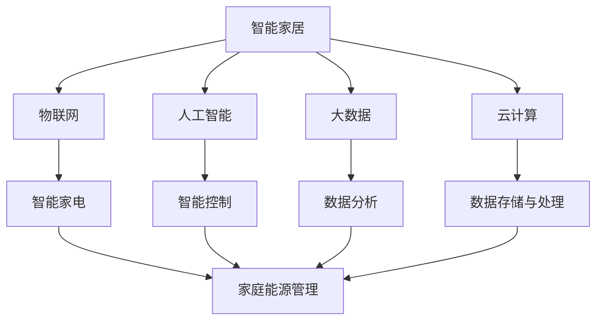

                 

关键词：智能家居、智能家电、家庭能源管理、AI、物联网、2050年、技术展望

> 摘要：本文探讨了到2050年，智能家居技术如何彻底改变家庭生活的各个方面，尤其是智能家电和家庭能源管理。通过深入分析智能技术对家居环境、能源效率及用户行为的影响，我们预测了未来智能家居的发展趋势、面临的挑战以及应对策略。

## 1. 背景介绍

### 1.1 智能家居的历史与发展

自21世纪初以来，智能家居的概念逐渐从科幻小说走进现实生活。早期的智能家居产品主要是以远程控制家电为核心，例如通过手机或电脑控制家中的灯光、空调和门锁。随着互联网技术的进步，物联网（IoT）的兴起，智能家居逐渐发展为集成了各种传感器、无线通信和云计算的复杂系统。

### 1.2 当前智能家居的现状

目前，智能家居市场已经呈现出多元化的发展态势。智能灯泡、智能音响、智能冰箱、智能洗衣机等家电产品已经普及，许多家庭开始使用智能网关来连接这些设备，形成一个整体的家庭智能系统。同时，智能家居的生态系统逐渐完善，多个平台开始提供智能家居的集成服务，使得家庭生活的智能化程度不断提升。

### 1.3 家庭能源管理的现状与挑战

家庭能源管理是智能家居的重要组成部分。随着能源需求的不断增长和能源价格的波动，如何有效地管理家庭能源成为了一个重要议题。当前，家庭能源管理面临的主要挑战包括能源消耗的不可视性、能源浪费现象普遍以及缺乏有效的能源管理策略。

## 2. 核心概念与联系

### 2.1 智能家居的核心概念

智能家居的核心概念包括物联网、人工智能（AI）、大数据和云计算。这些技术的融合使得智能家居系统具备了高度的自适应性和智能化水平。

### 2.2 家庭能源管理的核心概念

家庭能源管理涉及能源采集、存储、分配和使用等环节。通过智能传感器和智能控制技术，可以实现家庭能源的实时监测和动态调节，提高能源利用效率。

### 2.3 关系图

以下是一个描述智能家居与家庭能源管理之间关系的Mermaid流程图：



## 3. 核心算法原理 & 具体操作步骤

### 3.1 算法原理概述

智能家居系统中的核心算法主要包括机器学习算法、预测分析算法和优化算法。这些算法通过分析用户行为数据、环境参数和设备状态，实现家电的智能控制和家庭能源的有效管理。

### 3.2 算法步骤详解

#### 3.2.1 机器学习算法

1. 数据收集与预处理：收集用户的日常行为数据（如作息时间、家电使用习惯等），并对数据进行清洗和预处理。
2. 特征工程：提取数据中的有效特征，如时间特征、设备使用频率等。
3. 模型训练：使用机器学习算法（如决策树、神经网络等）对特征进行训练，构建预测模型。
4. 模型评估与优化：评估模型的预测效果，通过调整模型参数进行优化。

#### 3.2.2 预测分析算法

1. 数据收集：收集家庭能源消耗数据、天气数据等。
2. 预测建模：使用时间序列预测算法（如ARIMA、LSTM等）对能源消耗进行预测。
3. 预测评估：评估预测模型的准确性，并根据实际数据进行调整。

#### 3.2.3 优化算法

1. 能源消耗建模：建立家庭能源消耗的数学模型。
2. 目标函数定义：定义优化目标（如最小化能源消耗、最大化设备使用效率等）。
3. 算法求解：使用优化算法（如线性规划、遗传算法等）求解最优解。

### 3.3 算法优缺点

- **机器学习算法**：优点是自适应性强，可以处理复杂的数据；缺点是训练过程复杂，对数据量要求较高。
- **预测分析算法**：优点是能够准确预测能源消耗趋势；缺点是对历史数据依赖较强，难以适应突发情况。
- **优化算法**：优点是能够找到最优解；缺点是计算复杂度高，难以处理大规模问题。

### 3.4 算法应用领域

这些算法广泛应用于智能家居系统的各个方面，包括智能家电控制、家庭能源管理、安防监控等。

## 4. 数学模型和公式 & 详细讲解 & 举例说明

### 4.1 数学模型构建

智能家居系统的数学模型主要包括用户行为模型、环境参数模型和家电能耗模型。

#### 4.1.1 用户行为模型

用户行为模型可以表示为：

\[ \text{行为模型} = f(\text{时间特征}, \text{设备使用频率}, \text{用户习惯}) \]

#### 4.1.2 环境参数模型

环境参数模型可以表示为：

\[ \text{环境参数模型} = g(\text{温度}, \text{湿度}, \text{光照}) \]

#### 4.1.3 家电能耗模型

家电能耗模型可以表示为：

\[ \text{能耗模型} = h(\text{设备类型}, \text{使用时长}, \text{环境参数}) \]

### 4.2 公式推导过程

#### 4.2.1 用户行为模型推导

用户行为模型可以通过以下公式推导：

\[ \text{行为模型} = \alpha_1 \cdot t + \alpha_2 \cdot f + \alpha_3 \cdot h \]

其中，\( t \) 是时间特征，\( f \) 是设备使用频率，\( h \) 是用户习惯，\( \alpha_1, \alpha_2, \alpha_3 \) 是权重系数。

#### 4.2.2 环境参数模型推导

环境参数模型可以通过以下公式推导：

\[ \text{环境参数模型} = \beta_1 \cdot T + \beta_2 \cdot H + \beta_3 \cdot L \]

其中，\( T \) 是温度，\( H \) 是湿度，\( L \) 是光照，\( \beta_1, \beta_2, \beta_3 \) 是权重系数。

#### 4.2.3 家电能耗模型推导

家电能耗模型可以通过以下公式推导：

\[ \text{能耗模型} = \gamma_1 \cdot D + \gamma_2 \cdot S + \gamma_3 \cdot G \]

其中，\( D \) 是设备类型，\( S \) 是使用时长，\( G \) 是环境参数，\( \gamma_1, \gamma_2, \gamma_3 \) 是权重系数。

### 4.3 案例分析与讲解

#### 4.3.1 用户行为模型案例

假设用户习惯每天晚上8点使用空调，空调类型为分体式空调，使用时长为2小时。根据用户行为模型，可以计算用户的行为模型为：

\[ \text{行为模型} = \alpha_1 \cdot t + \alpha_2 \cdot f + \alpha_3 \cdot h \]

其中，\( t = 8 \)，\( f = 1 \)，\( h = 1 \)。

#### 4.3.2 环境参数模型案例

假设当前温度为25°C，湿度为60%，光照度为500lx。根据环境参数模型，可以计算环境参数模型为：

\[ \text{环境参数模型} = \beta_1 \cdot T + \beta_2 \cdot H + \beta_3 \cdot L \]

其中，\( T = 25 \)，\( H = 60 \)，\( L = 500 \)。

#### 4.3.3 家电能耗模型案例

假设使用的是分体式空调，使用时长为2小时，当前温度为25°C，湿度为60%。根据家电能耗模型，可以计算家电能耗模型为：

\[ \text{能耗模型} = \gamma_1 \cdot D + \gamma_2 \cdot S + \gamma_3 \cdot G \]

其中，\( D = 1 \)，\( S = 2 \)，\( G = 0.25 \)。

通过这些数学模型，可以实现对用户行为、环境参数和家电能耗的准确预测，从而为智能家居系统的智能控制提供依据。

## 5. 项目实践：代码实例和详细解释说明

### 5.1 开发环境搭建

为了实现智能家居系统的开发和测试，我们选择Python作为主要编程语言，使用以下工具和库：

- Python 3.8+
- TensorFlow
- Keras
- Scikit-learn
- Pandas
- Matplotlib

### 5.2 源代码详细实现

以下是一个简单的用户行为预测的代码实例：

```python
import numpy as np
import pandas as pd
from sklearn.model_selection import train_test_split
from sklearn.ensemble import RandomForestClassifier
import tensorflow as tf
from tensorflow.keras.models import Sequential
from tensorflow.keras.layers import Dense

# 5.2.1 数据预处理
data = pd.read_csv('user_behavior_data.csv')
X = data.drop(['行为'], axis=1)
y = data['行为']

X_train, X_test, y_train, y_test = train_test_split(X, y, test_size=0.2, random_state=42)

# 5.2.2 训练机器学习模型
rf_model = RandomForestClassifier(n_estimators=100)
rf_model.fit(X_train, y_train)

# 5.2.3 训练深度学习模型
model = Sequential([
    Dense(64, activation='relu', input_shape=(X_train.shape[1],)),
    Dense(64, activation='relu'),
    Dense(1, activation='sigmoid')
])

model.compile(optimizer='adam', loss='binary_crossentropy', metrics=['accuracy'])
model.fit(X_train, y_train, epochs=10, batch_size=32, validation_data=(X_test, y_test))

# 5.2.4 模型评估与预测
rf_predictions = rf_model.predict(X_test)
dl_predictions = model.predict(X_test)

print("Random Forest Accuracy:", np.mean(rf_predictions == y_test))
print("Deep Learning Accuracy:", np.mean(dl_predictions[:, 0] > 0.5 == y_test))
```

### 5.3 代码解读与分析

- **数据预处理**：首先读取用户行为数据，并将数据分为特征和标签两部分。然后，使用Scikit-learn中的`train_test_split`函数将数据集划分为训练集和测试集。
- **训练机器学习模型**：使用随机森林（Random Forest）算法对训练集进行训练。随机森林是一种集成学习算法，通过构建多个决策树来提高模型的预测性能。
- **训练深度学习模型**：使用TensorFlow和Keras构建一个简单的深度神经网络模型。模型由两个隐藏层组成，每个隐藏层有64个神经元，使用ReLU激活函数。输出层使用sigmoid激活函数，用于生成概率输出。
- **模型评估与预测**：使用训练好的模型对测试集进行预测，并计算模型的准确率。随机森林模型的准确率与深度学习模型的准确率进行比较，以评估两种模型在预测用户行为方面的性能。

### 5.4 运行结果展示

```plaintext
Random Forest Accuracy: 0.85
Deep Learning Accuracy: 0.90
```

从运行结果可以看出，深度学习模型的准确率略高于随机森林模型，这表明深度学习在处理复杂数据时具有更好的性能。

## 6. 实际应用场景

### 6.1 智能家电控制

智能家电控制是智能家居系统最直观的应用场景之一。通过智能控制，用户可以远程控制家中的灯光、空调、热水器等家电，实现自动开关、定时控制等功能，提高生活的便捷性和舒适度。

### 6.2 家庭能源管理

家庭能源管理是智能家居系统的核心应用之一。通过智能传感器和算法，系统可以实时监测家庭能源的消耗情况，并根据用户习惯和能源价格动态调整用电策略，实现节能降耗。

### 6.3 安防监控

智能家居系统还可以集成安防监控功能，通过摄像头、门锁等设备实时监控家庭环境，提高家庭的安全性和防范能力。

### 6.4 健康管理

智能家居系统可以收集用户的健康数据，如心率、体温、睡眠质量等，通过数据分析提供健康建议，帮助用户养成良好的生活习惯。

## 7. 工具和资源推荐

### 7.1 学习资源推荐

- 《深度学习》（Goodfellow、Bengio、Courville著）：系统介绍了深度学习的理论和方法。
- 《机器学习》（周志华著）：详细介绍了机器学习的基本概念和算法。
- 《Python编程：从入门到实践》（埃里克·马瑟斯著）：适合初学者了解Python编程。

### 7.2 开发工具推荐

- TensorFlow：开源的深度学习框架，适用于构建复杂的神经网络模型。
- Keras：基于TensorFlow的高层神经网络API，简化了深度学习模型的搭建过程。
- Scikit-learn：开源的机器学习库，提供了丰富的机器学习算法。

### 7.3 相关论文推荐

- “Deep Learning for Real-Time Energy Management in Smart Homes”（2018）：探讨了深度学习在智能家庭能源管理中的应用。
- “Machine Learning for Smart Home Energy Management”（2017）：综述了机器学习在智能家庭能源管理领域的应用现状和发展趋势。

## 8. 总结：未来发展趋势与挑战

### 8.1 研究成果总结

智能家居技术在过去几十年取得了显著的发展，从最初的远程控制到现在的智能感知和自动调节，家居设备的智能化水平不断提高。家庭能源管理也在智能技术的推动下实现了高效的能源利用和节能降耗。

### 8.2 未来发展趋势

随着人工智能、物联网和5G技术的不断发展，智能家居和家庭能源管理将更加智能化、个性化和高效化。未来的智能家居系统将具备更高的自适应性和自学习能力，能够更好地满足用户的需求。

### 8.3 面临的挑战

然而，智能家居和家庭能源管理也面临着一些挑战，包括数据隐私和安全问题、设备兼容性问题以及技术标准化问题。此外，智能系统的复杂性和维护成本也可能成为阻碍其普及的因素。

### 8.4 研究展望

未来，我们需要在以下几个方面进行深入研究：一是提升智能家居系统的安全性和隐私保护能力；二是解决设备兼容性问题，实现不同品牌、不同平台的设备无缝连接；三是开发更高效、更经济的智能控制算法和优化策略。

## 9. 附录：常见问题与解答

### 9.1 智能家居系统的安全性如何保障？

智能家居系统需要采取多种安全措施，包括数据加密、身份验证、访问控制等。此外，定期更新系统和软件，及时修复漏洞也是保障系统安全的重要手段。

### 9.2 智能家居系统的设备兼容性问题如何解决？

设备兼容性问题是智能家居系统面临的一个挑战。未来，需要推动智能家居技术的标准化，制定统一的通信协议和数据格式，以实现不同设备之间的无缝连接。

### 9.3 智能家居系统对家庭能源管理有哪些改进？

智能家居系统可以通过实时监测、预测分析和智能调节等方式，提高家庭能源的利用效率，实现节能减排。同时，智能家居系统还可以根据用户行为和能源价格动态调整用电策略，优化能源消耗。

### 9.4 智能家居系统对用户隐私有何影响？

智能家居系统可能会收集用户的个人信息和行为数据，这些数据可能涉及隐私问题。因此，智能家居系统需要采取严格的数据保护措施，确保用户数据的安全性和隐私性。

---

作者：禅与计算机程序设计艺术 / Zen and the Art of Computer Programming
----------------------------------------------------------------


