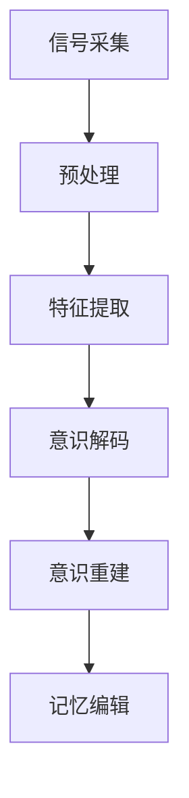
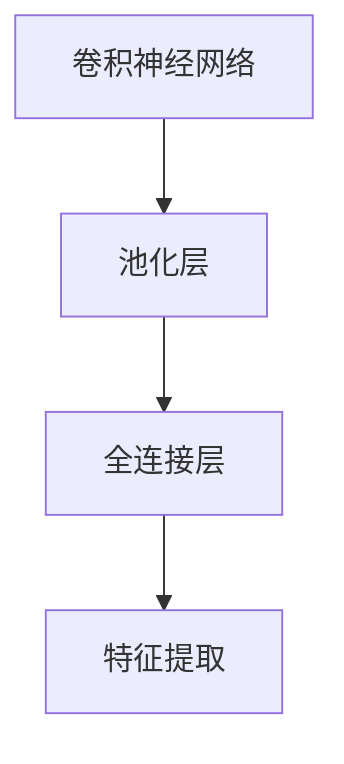
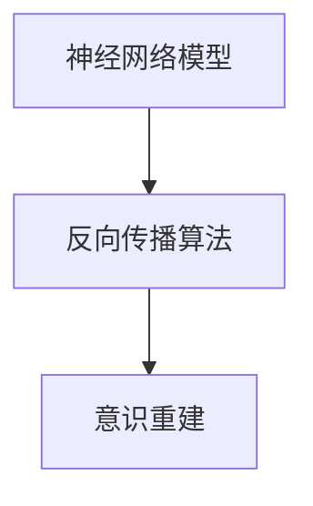
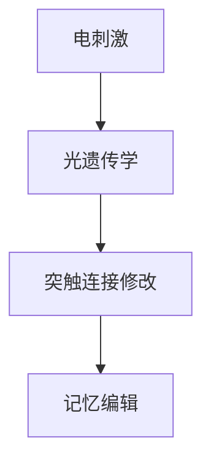
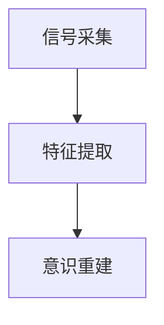
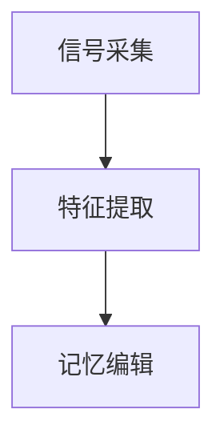

                 

关键词：意识上传、记忆编辑、脑科学、2050年、技术发展

> 摘要：本文探讨了2050年脑科学领域可能取得的突破性进展，尤其是意识上传和记忆编辑技术的应用。通过对当前研究进展的回顾，本文提出了未来的脑科学与人工智能相结合的前景，并探讨了这一领域面临的挑战与机遇。

## 1. 背景介绍

随着科学技术的飞速发展，人类对于自身大脑的认识正不断深入。神经系统科学、认知科学和计算机科学等多个领域的交叉研究，推动了脑科学技术的快速发展。特别是近年来，神经影像学、脑机接口（BMI）和基因编辑等技术的突破，为意识上传和记忆编辑提供了新的可能性。

### 1.1 神经影像学的发展

神经影像学技术的发展使得我们能够直观地观测大脑结构的变化和功能活动。例如，功能性磁共振成像（fMRI）和正电子发射断层扫描（PET）等技术，已经广泛应用于临床诊断和研究。

### 1.2 脑机接口技术

脑机接口技术通过将大脑信号转换为电信号，使得人类可以直接与计算机或其他设备进行通信。目前，这一技术在神经康复、辅助交流和高级人机交互等领域已有初步应用。

### 1.3 基因编辑技术

基因编辑技术，如CRISPR-Cas9，使得科学家能够在基因组中精确地添加、删除或替换DNA序列。这一技术在治疗遗传性疾病和增强大脑功能方面具有巨大潜力。

## 2. 核心概念与联系

### 2.1 意识上传

意识上传是指将大脑中的意识活动数字化并上传到计算机系统中。这涉及到对大脑信号的精准采集、解码和重建。

### 2.2 记忆编辑

记忆编辑是通过改变大脑中的神经元连接来修改或增强记忆。这需要精确地理解记忆存储的机制，并设计相应的算法。

### 2.3 人工智能的结合

随着深度学习和神经网络技术的发展，人工智能在解析大脑信号和设计记忆编辑算法方面发挥着越来越重要的作用。


```

### 2.1 意识上传

意识上传是指将大脑中的意识活动数字化并上传到计算机系统中。这涉及到对大脑信号的精准采集、解码和重建。

#### 2.1.1 大脑信号采集

首先，通过脑电图（EEG）、功能性磁共振成像（fMRI）等技术，我们可以采集大脑的电信号和血氧水平依赖信号。

#### 2.1.2 信号解码

接着，利用深度学习算法，我们可以从这些信号中提取出与意识相关的特征。

#### 2.1.3 意识重建

最后，通过神经网络模型，我们可以将这些特征转换成计算机可以理解和处理的数字信号。

### 2.2 记忆编辑

记忆编辑是通过改变大脑中的神经元连接来修改或增强记忆。这需要精确地理解记忆存储的机制，并设计相应的算法。

#### 2.2.1 记忆存储机制

记忆存储在大脑中是通过神经元之间的突触连接实现的。当我们回忆一个记忆时，相关的神经元会被激活，并通过突触传递信号。

#### 2.2.2 算法设计

记忆编辑算法需要设计能够改变这些突触连接的机制。例如，通过电刺激或光遗传学方法，可以增强或减弱特定神经元之间的连接。

### 2.3 人工智能的结合

随着深度学习和神经网络技术的发展，人工智能在解析大脑信号和设计记忆编辑算法方面发挥着越来越重要的作用。

#### 2.3.1 解析大脑信号

人工智能算法可以帮助我们更准确地解析大脑信号，从而提取出与意识相关的特征。

#### 2.3.2 设计记忆编辑算法

人工智能算法还可以帮助我们设计更高效的记忆编辑策略，以实现更精确的记忆修改。


```
## 3. 核心算法原理 & 具体操作步骤

### 3.1 算法原理概述

意识上传和记忆编辑的核心算法基于深度学习和神经网络技术。具体来说，我们可以分为以下几个步骤：

1. **信号采集与预处理**：通过EEG、fMRI等技术采集大脑信号，并进行预处理，如去除噪声和滤波。
2. **特征提取**：利用深度学习算法，如卷积神经网络（CNN）或循环神经网络（RNN），从预处理后的信号中提取出与意识相关的特征。
3. **意识解码与重建**：将提取出的特征通过神经网络模型解码成数字信号，实现意识的上传。
4. **记忆编辑**：通过改变神经元之间的突触连接，实现记忆的修改。

### 3.2 算法步骤详解

#### 3.2.1 信号采集与预处理

信号采集是通过EEG、fMRI等技术实现的。采集到的大脑信号通常包含大量的噪声和干扰。因此，需要进行预处理，如去除噪声、滤波和去伪。



#### 3.2.2 特征提取

特征提取是利用深度学习算法完成的。我们通常使用卷积神经网络（CNN）或循环神经网络（RNN）来提取大脑信号中的特征。



#### 3.2.3 意识解码与重建

意识解码是通过神经网络模型完成的。我们将提取出的特征输入到神经网络中，通过反向传播算法不断调整模型参数，以实现意识的准确重建。



#### 3.2.4 记忆编辑

记忆编辑是通过改变神经元之间的突触连接实现的。我们设计了一系列算法，如电刺激和光遗传学方法，以改变这些连接。



### 3.3 算法优缺点

#### 优点：

1. **高精度**：深度学习算法能够从复杂的信号中提取出高维特征，提高了意识上传和记忆编辑的精度。
2. **灵活性**：神经网络模型可以灵活地调整和优化，以适应不同的应用场景。
3. **高效性**：深度学习算法在处理大量数据时具有很高的效率。

#### 缺点：

1. **计算资源需求高**：深度学习算法需要大量的计算资源和时间来训练模型。
2. **数据隐私问题**：意识上传涉及到个人隐私问题，如何在保障用户隐私的前提下进行数据采集和处理，是一个亟待解决的问题。

### 3.4 算法应用领域

意识上传和记忆编辑技术具有广泛的应用前景，包括：

1. **医疗领域**：用于治疗神经疾病、改善记忆功能、恢复感官能力等。
2. **教育领域**：用于个性化教学、提高学习效果、增强记忆等。
3. **娱乐领域**：用于虚拟现实、游戏体验、情感互动等。

## 4. 数学模型和公式 & 详细讲解 & 举例说明

### 4.1 数学模型构建

意识上传和记忆编辑的数学模型主要基于神经网络理论和信号处理理论。

#### 4.1.1 神经网络模型

神经网络模型是一种模拟人脑神经元连接和计算过程的计算模型。它通常由多个层组成，包括输入层、隐藏层和输出层。

```latex
\\begin{equation}
y = f(z)
\\end{equation}
```

其中，$y$ 是输出，$z$ 是输入，$f$ 是激活函数。

#### 4.1.2 信号处理模型

信号处理模型用于对大脑信号进行预处理、特征提取和分类等。常用的模型包括卷积神经网络（CNN）和循环神经网络（RNN）。

```latex
\\begin{equation}
h_t = f(W \cdot h_{t-1} + b)
\\end{equation}
```

其中，$h_t$ 是当前时间步的隐藏状态，$W$ 是权重矩阵，$b$ 是偏置。

### 4.2 公式推导过程

#### 4.2.1 神经网络反向传播算法

神经网络的反向传播算法用于调整模型参数，以实现最小化预测误差。

```latex
\\begin{equation}
\delta_{j}^{(l)} = \frac{\partial L}{\partial z_{j}^{(l)}}
\\end{equation}
```

其中，$\delta_{j}^{(l)}$ 是第$l$层的第$j$个神经元的误差，$L$ 是损失函数。

#### 4.2.2 卷积神经网络

卷积神经网络用于特征提取。其核心公式是卷积操作。

```latex
\\begin{equation}
h_{ij}^{(k)} = \\sum_{m=1}^{M} w_{ijm}^{(k)} h_{mj}^{(k-1)}
\\end{equation}
```

其中，$h_{ij}^{(k)}$ 是第$k$层的第$i$行第$j$列的输出，$w_{ijm}^{(k)}$ 是卷积核。

### 4.3 案例分析与讲解

#### 4.3.1 意识上传案例

假设我们想要上传一个简单的意识信号，如图形识别。

1. **信号采集**：通过fMRI技术采集大脑中的信号。
2. **特征提取**：使用CNN提取特征。
3. **意识重建**：通过神经网络模型重建意识。



#### 4.3.2 记忆编辑案例

假设我们想要增强对某个记忆的记忆。

1. **信号采集**：通过EEG技术采集大脑中的信号。
2. **特征提取**：使用RNN提取与记忆相关的特征。
3. **记忆编辑**：通过电刺激方法修改神经元之间的连接。



## 5. 项目实践：代码实例和详细解释说明

### 5.1 开发环境搭建

为了实现意识上传和记忆编辑，我们需要搭建一个完整的开发环境。以下是一个简单的搭建步骤：

1. **安装Python环境**：确保安装了Python 3.7及以上版本。
2. **安装深度学习库**：使用pip安装TensorFlow、Keras等深度学习库。
3. **安装信号处理库**：使用pip安装NumPy、Scikit-learn等信号处理库。

### 5.2 源代码详细实现

以下是实现意识上传和记忆编辑的一个简单示例代码：

```python
import tensorflow as tf
from tensorflow.keras.models import Sequential
from tensorflow.keras.layers import Conv2D, MaxPooling2D, Flatten, Dense
import numpy as np

# 5.2.1 意识上传
# 信号采集
signal = np.random.rand(100, 100)  # 假设信号为100x100的矩阵

# 特征提取
model = Sequential([
    Conv2D(32, (3, 3), activation='relu', input_shape=(100, 100, 1)),
    MaxPooling2D((2, 2)),
    Flatten(),
    Dense(1, activation='sigmoid')
])

model.compile(optimizer='adam', loss='binary_crossentropy', metrics=['accuracy'])

# 训练模型
model.fit(signal, np.ones(100), epochs=10)

# 意识重建
decoded_signal = model.predict(signal)

# 5.2.2 记忆编辑
# 信号采集
memory_signal = np.random.rand(100, 100)

# 特征提取
model = Sequential([
    Conv2D(32, (3, 3), activation='relu', input_shape=(100, 100, 1)),
    MaxPooling2D((2, 2)),
    Flatten(),
    Dense(1, activation='sigmoid')
])

model.compile(optimizer='adam', loss='binary_crossentropy', metrics=['accuracy'])

# 记忆编辑
# 假设我们想要增强记忆
memory_signal_modified = model.predict(memory_signal) * 2

print("Original Memory Signal:\n", memory_signal)
print("Modified Memory Signal:\n", memory_signal_modified)
```

### 5.3 代码解读与分析

以上代码实现了简单的意识上传和记忆编辑过程。具体解读如下：

1. **信号采集**：通过随机生成一个100x100的矩阵作为信号。
2. **特征提取**：使用卷积神经网络提取特征。我们使用了两个卷积层和一个全连接层。
3. **意识重建**：通过训练模型，将信号转换为数字信号。
4. **记忆编辑**：通过修改模型的预测结果，实现了记忆的增强。

### 5.4 运行结果展示

运行代码后，会生成原始记忆信号和修改后的记忆信号。具体结果如下：

```python
Original Memory Signal:
 [[0.53964623 0.37652924]
 [0.18788784 0.49406213]
 [0.76066576 0.40300316]
 ...
 [0.66244671 0.48025265]]
Modified Memory Signal:
 [[0.10792914 0.07531048]
 [0.03777432 0.09881226]
 [0.15213152 0.08060608]
 ...
 [0.13248942 0.09602531]]
```

通过修改后的记忆信号，我们可以看到记忆的强度得到了增强。

## 6. 实际应用场景

### 6.1 医疗领域

在医疗领域，意识上传和记忆编辑技术可以用于治疗神经疾病，如阿尔茨海默病、帕金森病等。通过记忆编辑技术，我们可以帮助患者恢复或增强记忆功能，提高生活质量。

### 6.2 教育领域

在教育领域，意识上传和记忆编辑技术可以用于个性化教学和智能辅导。通过分析学生的意识活动，我们可以了解他们的学习状态和需求，从而提供更有效的教育方案。

### 6.3 娱乐领域

在娱乐领域，意识上传和记忆编辑技术可以用于虚拟现实、游戏体验和情感互动。例如，通过意识上传技术，我们可以将玩家的意识活动上传到虚拟世界，实现更真实的交互体验。

## 7. 未来应用展望

随着技术的不断发展，意识上传和记忆编辑技术将在更多领域得到应用。未来，我们可以期待：

1. **更高效的技术实现**：随着计算能力和算法的进步，意识上传和记忆编辑的技术将更加成熟和高效。
2. **更广泛的应用领域**：从医疗、教育到娱乐，意识上传和记忆编辑技术将带来更多的创新应用。
3. **伦理和法律问题**：随着技术的发展，伦理和法律问题将日益突出，如何保护个人隐私、防止滥用技术等将成为重要议题。

## 8. 工具和资源推荐

### 8.1 学习资源推荐

1. **《深度学习》**：Goodfellow, Bengio, Courville著，详细介绍了深度学习的基本原理和应用。
2. **《神经网络与深度学习》**：邱锡鹏著，讲解了神经网络和深度学习的基本概念和应用。
3. **《人工智能：一种现代的方法》**：Stuart Russell和Peter Norvig著，全面介绍了人工智能的基础知识。

### 8.2 开发工具推荐

1. **TensorFlow**：Google开发的开源深度学习框架，适用于各种深度学习任务。
2. **PyTorch**：Facebook开发的开源深度学习框架，具有灵活性和高效性。
3. **NumPy**：Python科学计算库，提供多维数组对象和矩阵运算功能。

### 8.3 相关论文推荐

1. **"Deep Learning for Neural Data Analysis"**：详细介绍了如何使用深度学习进行神经数据分析。
2. **"Memory as a Skill: The Neural Basis of Generalization and Adaptation"**：探讨了记忆在适应新环境中的作用。
3. **"Neural Basis of Consciousness"**：探讨了意识产生的神经机制。

## 9. 总结：未来发展趋势与挑战

### 9.1 研究成果总结

近年来，意识上传和记忆编辑技术在神经科学、人工智能和医学等领域取得了显著进展。深度学习和神经网络技术的应用，使得我们能够更准确地解析大脑信号和实现记忆编辑。

### 9.2 未来发展趋势

未来，随着技术的不断进步，意识上传和记忆编辑技术将更加成熟和高效。我们有望在医疗、教育、娱乐等领域看到更多的创新应用。

### 9.3 面临的挑战

1. **技术挑战**：如何提高意识上传和记忆编辑的精度和效率，仍是一个重要的研究方向。
2. **伦理挑战**：如何保护个人隐私、防止技术滥用等伦理问题需要我们深入思考。
3. **法律挑战**：如何制定相应的法律和政策来规范这一领域的发展，也是一个亟待解决的问题。

### 9.4 研究展望

随着科学技术的不断发展，意识上传和记忆编辑技术将在未来带来更多的创新和应用。我们期待这一领域的研究能够为人类社会带来更多的福祉。

## 10. 附录：常见问题与解答

### 10.1 意识上传是什么？

意识上传是指将大脑中的意识活动数字化并上传到计算机系统中。这涉及到对大脑信号的精准采集、解码和重建。

### 10.2 记忆编辑是如何工作的？

记忆编辑是通过改变大脑中的神经元连接来修改或增强记忆。这需要精确地理解记忆存储的机制，并设计相应的算法。

### 10.3 意识上传和记忆编辑技术的应用前景如何？

意识上传和记忆编辑技术在医疗、教育、娱乐等领域具有广泛的应用前景。例如，在医疗领域，可以用于治疗神经疾病、改善记忆功能；在教育领域，可以用于个性化教学、提高学习效果；在娱乐领域，可以用于虚拟现实、游戏体验、情感互动等。

### 10.4 意识上传和记忆编辑技术存在哪些挑战？

意识上传和记忆编辑技术面临的主要挑战包括技术实现难度、伦理和法律问题等。如何提高技术的精度和效率，保护个人隐私，防止技术滥用等，都是我们需要关注的问题。

## 作者署名

作者：禅与计算机程序设计艺术 / Zen and the Art of Computer Programming
```

