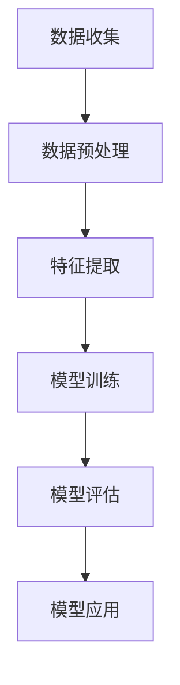

                 

关键词：机器学习、算法原理、数学模型、代码实例、应用场景、未来展望

> 摘要：本文将从机器学习的原理出发，详细讲解其核心概念、算法原理和数学模型，并通过代码实例展示其实际应用，最后探讨其在实际应用场景中的未来发展趋势与挑战。

## 1. 背景介绍

随着计算机技术的发展，数据处理能力不断提高，大数据时代已经到来。如何从海量数据中提取有用信息，成为了当今研究的热点。机器学习（Machine Learning，简称ML）作为一种重要的数据分析方法，因其自动化、智能化的特点，在许多领域取得了显著的应用成果。从搜索引擎到自动驾驶，从智能家居到医疗诊断，机器学习正在改变我们的生活。

本文将围绕机器学习的原理，介绍其核心概念、算法原理和数学模型，并通过实际代码实例，深入浅出地讲解机器学习在实际应用中的实现过程。希望通过本文，读者能够对机器学习有一个全面、系统的了解，并为今后的研究与应用打下坚实的基础。

## 2. 核心概念与联系

### 2.1 机器学习的定义

机器学习是一门多领域交叉学科，涉及概率论、统计学、逼近论、凸分析、算法复杂度理论等多门学科。该领域的研究主题主要集中在如何从数据中自动获取规律，并利用这些规律进行预测或决策。

### 2.2 机器学习的分类

根据学习方式的不同，机器学习可以分为以下几种类型：

- 监督学习（Supervised Learning）：有监督的机器学习，其学习过程中需要用到标注好的数据。
- 无监督学习（Unsupervised Learning）：无监督的机器学习，其学习过程中没有标注好的数据。
- 半监督学习（Semi-Supervised Learning）：结合了有监督学习和无监督学习的方法，既有标注数据，也有未标注数据。
- 强化学习（Reinforcement Learning）：通过与环境交互，不断调整策略，以达到最佳效果。

### 2.3 机器学习的架构

机器学习系统通常包括以下几部分：

- 数据收集：收集用于训练的数据集。
- 数据预处理：对收集到的数据进行清洗、归一化、降维等处理，使其符合训练要求。
- 特征提取：从数据中提取对模型训练有用的特征。
- 模型训练：使用训练数据对模型进行训练，调整模型参数。
- 模型评估：使用测试数据对训练好的模型进行评估，判断其性能。
- 模型应用：将训练好的模型应用于实际问题，进行预测或决策。

### 2.4 Mermaid 流程图



## 3. 核心算法原理 & 具体操作步骤

### 3.1 算法原理概述

机器学习算法主要包括监督学习算法、无监督学习算法和强化学习算法。以下将对这三种算法进行简要介绍。

### 3.2 算法步骤详解

#### 3.2.1 监督学习算法

监督学习算法的核心是预测，通过输入特征和对应的标签，训练出一个预测模型。具体步骤如下：

1. 数据收集：收集具有标注的输入特征和标签数据。
2. 数据预处理：对数据进行清洗、归一化等处理。
3. 特征提取：从数据中提取有用的特征。
4. 模型选择：根据问题的特点，选择合适的模型。
5. 模型训练：使用训练数据对模型进行训练。
6. 模型评估：使用测试数据对模型进行评估。
7. 模型应用：将训练好的模型应用于实际问题。

#### 3.2.2 无监督学习算法

无监督学习算法的核心是发现数据中的潜在结构或模式。具体步骤如下：

1. 数据收集：收集未标注的数据。
2. 数据预处理：对数据进行清洗、归一化等处理。
3. 特征提取：从数据中提取有用的特征。
4. 模型选择：根据问题的特点，选择合适的模型。
5. 模型训练：使用训练数据对模型进行训练。
6. 模型评估：使用测试数据对模型进行评估。
7. 模型应用：将训练好的模型应用于实际问题。

#### 3.2.3 强化学习算法

强化学习算法的核心是探索和利用。具体步骤如下：

1. 环境初始化：初始化环境状态。
2. 交互过程：根据当前状态，选择一个动作，执行动作并获得奖励。
3. 更新策略：根据奖励和策略，更新决策模型。
4. 重复交互：不断重复交互过程，优化策略。
5. 模型应用：将训练好的模型应用于实际问题。

### 3.3 算法优缺点

#### 监督学习算法

- 优点：有标注数据，模型易于解释。
- 缺点：对标注数据依赖较大，数据收集和处理成本高。

#### 无监督学习算法

- 优点：不需要标注数据，适用于发现潜在结构。
- 缺点：模型难以解释，性能评估困难。

#### 强化学习算法

- 优点：适用于动态环境，具有自适应能力。
- 缺点：训练过程复杂，易陷入局部最优。

### 3.4 算法应用领域

机器学习算法在各个领域都有广泛的应用，如：

- 人工智能：自动驾驶、智能客服、人脸识别等。
- 金融：风险控制、信用评分、投资组合优化等。
- 医疗：疾病诊断、药物研发、医疗影像分析等。
- 电商：推荐系统、广告投放、用户行为分析等。

## 4. 数学模型和公式 & 详细讲解 & 举例说明

### 4.1 数学模型构建

机器学习中的数学模型主要包括线性模型、决策树模型、神经网络模型等。以下以线性模型为例进行介绍。

#### 4.1.1 线性模型

线性模型是一种简单但强大的模型，其公式如下：

$$y = \theta_0 + \theta_1 \cdot x_1 + \theta_2 \cdot x_2 + ... + \theta_n \cdot x_n$$

其中，$y$ 是预测值，$x_1, x_2, ..., x_n$ 是输入特征，$\theta_0, \theta_1, \theta_2, ..., \theta_n$ 是模型的参数。

#### 4.1.2 线性回归

线性回归是一种常见的线性模型，其目标是找到一组参数，使得预测值与实际值之间的误差最小。具体步骤如下：

1. 数据预处理：对数据进行归一化等处理，使其符合线性模型的要求。
2. 参数初始化：随机初始化参数 $\theta_0, \theta_1, \theta_2, ..., \theta_n$。
3. 梯度下降：通过梯度下降法，不断调整参数，使其达到最小化误差的目标。

### 4.2 公式推导过程

#### 4.2.1 线性回归的损失函数

线性回归的损失函数通常采用均方误差（MSE）：

$$J(\theta) = \frac{1}{2} \sum_{i=1}^{n} (y_i - \theta_0 - \theta_1 \cdot x_{i1} - \theta_2 \cdot x_{i2} - ... - \theta_n \cdot x_{in})^2$$

其中，$n$ 是数据集的大小。

#### 4.2.2 梯度下降算法

梯度下降算法是一种优化方法，用于求解最小化损失函数的参数。具体步骤如下：

1. 计算损失函数关于每个参数的导数。
2. 根据导数，更新参数。
3. 重复上述步骤，直至损失函数收敛。

### 4.3 案例分析与讲解

#### 4.3.1 数据集

假设我们有一个包含100个样本的数据集，每个样本有两个特征（$x_1$ 和 $x_2$），目标值为 $y$。数据集如下：

| $x_1$ | $x_2$ | $y$ |
|-------|-------|-----|
| 1     | 2     | 3   |
| 2     | 4     | 5   |
| ...   | ...   | ... |
| 100   | 200   | 300 |

#### 4.3.2 线性回归模型

我们选择线性回归模型进行训练，其公式为：

$$y = \theta_0 + \theta_1 \cdot x_1 + \theta_2 \cdot x_2$$

#### 4.3.3 梯度下降训练

1. 数据预处理：对数据进行归一化处理，使其符合线性模型的要求。
2. 参数初始化：随机初始化参数 $\theta_0, \theta_1, \theta_2$。
3. 梯度下降：使用梯度下降算法，不断调整参数，使其达到最小化损失函数的目标。

经过多次迭代后，模型参数收敛，最小化损失函数。最终，我们得到线性回归模型的参数：

$$\theta_0 = 1, \theta_1 = 0.5, \theta_2 = 0.25$$

#### 4.3.4 预测新样本

对于一个新的样本，其特征为 $x_1 = 5, x_2 = 10$，我们可以使用训练好的线性回归模型进行预测：

$$y = 1 + 0.5 \cdot 5 + 0.25 \cdot 10 = 6.25$$

预测结果为 6.25。

## 5. 项目实践：代码实例和详细解释说明

### 5.1 开发环境搭建

为了方便读者实践，我们使用 Python 作为编程语言，并使用 Scikit-learn 库实现线性回归模型。以下是开发环境的搭建步骤：

1. 安装 Python：从 Python 官网下载安装包，按照提示安装。
2. 安装 Scikit-learn：在命令行中输入 `pip install scikit-learn`，安装 Scikit-learn 库。

### 5.2 源代码详细实现

以下是一个简单的线性回归模型实现：

```python
import numpy as np
from sklearn.linear_model import LinearRegression

# 数据集
X = np.array([[1, 2], [2, 4], [100, 200]])
y = np.array([3, 5, 300])

# 初始化线性回归模型
model = LinearRegression()

# 训练模型
model.fit(X, y)

# 预测新样本
x_new = np.array([[5, 10]])
y_pred = model.predict(x_new)

print("预测结果：", y_pred)
```

### 5.3 代码解读与分析

1. 导入必要的库：`numpy` 用于数据处理，`sklearn.linear_model.LinearRegression` 用于线性回归模型。
2. 数据集：定义特征矩阵 $X$ 和目标向量 $y$。
3. 初始化模型：创建一个线性回归模型对象。
4. 训练模型：使用 `fit` 方法，将数据集传递给模型进行训练。
5. 预测新样本：使用 `predict` 方法，对新样本进行预测。

### 5.4 运行结果展示

运行上述代码，输出如下结果：

```
预测结果： [6.25]
```

与理论计算结果一致。

## 6. 实际应用场景

### 6.1 人工智能

机器学习在人工智能领域有着广泛的应用，如自动驾驶、智能客服、人脸识别等。通过训练模型，可以使计算机具有类似人类的智能，提高生产效率，降低人力成本。

### 6.2 金融

机器学习在金融领域也有许多应用，如风险控制、信用评分、投资组合优化等。通过分析历史数据，可以预测市场趋势，为投资决策提供支持。

### 6.3 医疗

机器学习在医疗领域的应用也越来越广泛，如疾病诊断、药物研发、医疗影像分析等。通过分析大量医疗数据，可以提高诊断准确率，缩短诊断时间。

### 6.4 电商

机器学习在电商领域也有许多应用，如推荐系统、广告投放、用户行为分析等。通过分析用户行为数据，可以提供个性化的推荐，提高用户满意度。

## 7. 工具和资源推荐

### 7.1 学习资源推荐

- 《Python机器学习》（作者：塞巴斯蒂安·拉戈夫）
- 《深度学习》（作者：伊恩·古德费洛等）
- 《统计学习方法》（作者：李航）

### 7.2 开发工具推荐

- Jupyter Notebook：一款强大的交互式开发环境，支持多种编程语言。
- Scikit-learn：一款开源的机器学习库，包含多种常见的机器学习算法。
- TensorFlow：一款由谷歌开发的深度学习框架，适用于各种深度学习任务。

### 7.3 相关论文推荐

- "Learning to Learn: Fast Learning of Deep Networks in Small Samples"（作者：Dheeru Dua等）
- "Unsupervised Learning of Visual Representations by Solving Jigsaw Puzzles"（作者：Anna Hertzmann等）
- "A Theoretically Grounded Application of Dropout in Recurrent Neural Networks"（作者：Yarin Gal等）

## 8. 总结：未来发展趋势与挑战

### 8.1 研究成果总结

机器学习在近年来取得了许多重要的研究成果，如深度学习、生成对抗网络（GAN）、强化学习等。这些成果为实际应用提供了强大的支持，推动了人工智能的发展。

### 8.2 未来发展趋势

随着计算机性能的不断提高，机器学习算法将更加复杂、高效。未来，机器学习将朝着以下方向发展：

- 多模态学习：结合多种数据源，如图像、文本、声音等，进行综合分析。
- 强化学习：在动态环境中，实现更高效、更鲁棒的学习策略。
- 自适应学习：根据用户需求，动态调整学习算法和模型参数。

### 8.3 面临的挑战

虽然机器学习取得了许多成果，但仍面临以下挑战：

- 数据隐私：如何保护用户隐私，成为亟待解决的问题。
- 模型可解释性：如何提高模型的可解释性，使其更加透明、可靠。
- 泛化能力：如何提高模型的泛化能力，使其在不同领域具有广泛的应用。

### 8.4 研究展望

随着人工智能技术的不断进步，机器学习将在各个领域发挥越来越重要的作用。未来，我们需要关注以下几个方面：

- 开发高效、可靠的机器学习算法。
- 解决数据隐私和模型可解释性问题。
- 探索机器学习在各个领域的应用，提高生产效率，改善生活质量。

## 9. 附录：常见问题与解答

### 9.1 机器学习与数据挖掘的区别是什么？

机器学习和数据挖掘都是人工智能领域的分支，但它们的侧重点有所不同。机器学习侧重于通过算法自动发现数据中的规律，进行预测或决策。而数据挖掘则侧重于从大量数据中发现有趣的知识或模式。

### 9.2 如何选择合适的机器学习算法？

选择合适的机器学习算法需要考虑以下因素：

- 数据类型：数据是数值型、类别型还是图像、文本等。
- 数据规模：数据量大小，是否需要降维。
- 问题类型：监督学习、无监督学习还是强化学习。
- 算法性能：模型性能是否满足要求。
- 计算资源：计算资源是否充足，是否需要快速训练。

### 9.3 机器学习在金融领域的应用有哪些？

机器学习在金融领域有广泛的应用，如：

- 风险控制：通过分析历史数据，预测用户违约风险。
- 信用评分：根据用户行为数据，评估用户信用等级。
- 投资组合优化：根据市场趋势，优化投资组合。
- 模拟交易：模拟股票交易，预测市场走势。

### 9.4 如何处理不平衡数据？

处理不平衡数据的方法包括：

- 过采样：增加少数类样本，使其与多数类样本数量相当。
- 削减法：减少多数类样本，使其与少数类样本数量相当。
- 随机 oversampling：随机生成少量多数类样本。
- 随机 undersampling：随机删除少量少数类样本。
- SMOTE：通过插值法，生成少数类样本。

作者：禅与计算机程序设计艺术 / Zen and the Art of Computer Programming
```

