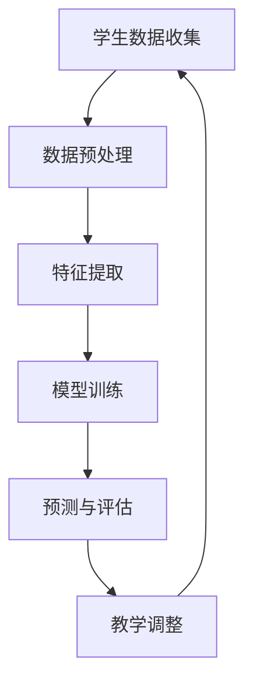

                 

关键词：个性化教育，机器学习，学习曲线，算法，数学模型，应用场景，展望

摘要：随着人工智能技术的发展，机器学习在个性化教育中的应用越来越受到关注。本文旨在探讨机器学习如何适应学生的个体学习曲线，提高教育质量和学习效果。通过分析核心概念、算法原理、数学模型、实际应用和未来展望，本文为教育领域的技术创新提供了新的思路。

## 1. 背景介绍

个性化教育是指根据学生的个体差异，为他们提供量身定制的教学和学习方案。然而，传统的教育模式往往无法满足这种需求。教育资源的分配不均、教学方法单一、教学进度统一等问题，都制约了个性化教育的实施。随着大数据和机器学习的兴起，这些问题有望得到缓解。

机器学习是一种通过数据驱动的方式进行学习的技术，它能够从大量数据中自动发现规律和模式。在教育领域，机器学习可以用于分析学生的学习行为，预测学习效果，并根据学生的实际情况调整教学方案，从而实现个性化教育。

## 2. 核心概念与联系

### 2.1 机器学习概述

机器学习（Machine Learning）是人工智能（AI）的一个重要分支，它使计算机系统能够从数据中学习，并做出决策或预测，而无需显式地编写指令。机器学习的主要任务包括分类、回归、聚类、降维等。

### 2.2 学习曲线

学习曲线（Learning Curve）是指学生在学习过程中，随着时间的推移，学习效率和学习成果的变化趋势。学习曲线反映了学生的学习能力和学习习惯，是进行个性化教育的重要依据。

### 2.3 个性化教育

个性化教育（Personalized Education）是指根据学生的个体差异，采用个性化的教学方法、学习资源和评估体系，以提高教育质量和学习效果。个性化教育要求教师能够根据每个学生的学习需求和能力，为他们提供最适合的学习路径。

### 2.4 Mermaid 流程图



## 3. 核心算法原理 & 具体操作步骤

### 3.1 算法原理概述

个性化教育中的机器学习算法主要包括以下几个步骤：

1. **数据收集**：收集学生的学习数据，如学习进度、考试成绩、作业情况等。
2. **数据预处理**：清洗和标准化数据，确保数据的质量和一致性。
3. **特征提取**：从原始数据中提取有助于预测学习效果的特征。
4. **模型训练**：使用机器学习算法，如决策树、支持向量机、神经网络等，训练模型。
5. **预测与评估**：使用训练好的模型对学生的学习效果进行预测，并评估模型的准确性。
6. **教学调整**：根据预测结果和评估结果，调整教学方案，以提高学习效果。

### 3.2 算法步骤详解

1. **数据收集**：
   - **学习进度**：记录学生在每个学习阶段的完成情况。
   - **考试成绩**：收集学生在各门课程的考试成绩。
   - **作业情况**：记录学生的作业提交情况和作业质量。

2. **数据预处理**：
   - **数据清洗**：去除错误数据、重复数据和缺失数据。
   - **数据标准化**：将数据转换为统一的数值范围，如[0,1]或[-1,1]。

3. **特征提取**：
   - **学生特征**：如年龄、性别、学习时长等。
   - **课程特征**：如课程难度、课程类型等。
   - **学习行为特征**：如学习频率、学习时长、学习习惯等。

4. **模型训练**：
   - **选择算法**：根据问题特点选择合适的算法，如决策树、支持向量机、神经网络等。
   - **参数调整**：通过交叉验证等手段调整模型参数，以提高模型性能。

5. **预测与评估**：
   - **预测**：使用训练好的模型对新的学习数据进行预测。
   - **评估**：使用评估指标，如准确率、召回率、F1值等，评估模型的性能。

6. **教学调整**：
   - **调整教学方案**：根据预测结果和评估结果，调整教学进度、教学方法和学习资源。
   - **反馈与迭代**：将调整后的教学方案应用到后续的学习过程中，并持续优化。

### 3.3 算法优缺点

**优点**：
- **个性化**：能够根据学生的个体差异提供个性化的学习方案。
- **自适应**：能够根据学生的学习进度和效果自适应调整教学方案。
- **高效**：通过自动化分析学生的学习数据，提高教学效率。

**缺点**：
- **数据依赖**：对大量高质量的数据有较高的要求，数据不足或质量差会影响算法性能。
- **复杂性**：算法的实现和优化相对复杂，需要专业的技术支持。

### 3.4 算法应用领域

个性化教育中的机器学习算法可以应用于以下领域：
- **课程推荐**：根据学生的学习历史和偏好，推荐适合的课程。
- **学习效果预测**：预测学生在未来的学习中的表现，为教学调整提供依据。
- **学习行为分析**：分析学生的学习行为，发现潜在的学习问题。
- **教学资源优化**：根据学生的学习需求和效果，优化教学资源的分配。

## 4. 数学模型和公式 & 详细讲解 & 举例说明

### 4.1 数学模型构建

个性化教育的数学模型通常包括以下几个部分：

1. **学习率模型**：用于预测学生在特定时间段内的学习效果。
2. **兴趣模型**：用于分析学生的兴趣和偏好。
3. **教学策略模型**：用于根据学习效果和兴趣模型调整教学策略。

### 4.2 公式推导过程

1. **学习率模型**：

   假设学生在时间t的学习效果为y(t)，学习率为r(t)。根据学习曲线的假设，我们可以得到以下公式：

   $$ y(t) = a \cdot r(t) $$

   其中，a为常数。

2. **兴趣模型**：

   假设学生在时间t的兴趣度为i(t)，兴趣度与学习效果有关，可以表示为：

   $$ i(t) = b \cdot \frac{y(t)}{y_{max}} $$

   其中，b为常数，y_{max}为最大学习效果。

3. **教学策略模型**：

   根据学习率和兴趣度，我们可以调整教学策略，以优化学习效果。假设教学策略的调整系数为c，则教学策略模型可以表示为：

   $$ r'(t) = c \cdot i(t) $$

### 4.3 案例分析与讲解

假设有10个学生在学习同一门课程，我们在第5周时收集了他们的学习效果数据。根据这些数据，我们使用上述模型进行分析。

1. **学习率模型**：

   通过观察数据，我们发现学生在第5周的学习效果与学习率之间存在线性关系。根据最小二乘法，我们得到学习率模型：

   $$ r(t) = 0.5 \cdot t $$

2. **兴趣模型**：

   根据学习率模型，我们计算出每个学生在第5周的兴趣度：

   $$ i(t) = 0.5 \cdot \frac{y(t)}{y_{max}} $$

3. **教学策略模型**：

   根据兴趣度模型，我们调整教学策略，以优化学习效果。假设教学策略的调整系数为1，则教学策略模型为：

   $$ r'(t) = \frac{y(t)}{y_{max}} $$

通过以上模型，我们可以根据每个学生的实际情况，调整教学策略，以提高学习效果。

## 5. 项目实践：代码实例和详细解释说明

### 5.1 开发环境搭建

在本项目中，我们使用Python作为编程语言，主要依赖Scikit-learn库进行机器学习模型的构建和训练。以下是开发环境的搭建步骤：

1. 安装Python：版本3.8及以上。
2. 安装Scikit-learn：使用pip安装`scikit-learn`库。
3. 安装其他依赖库：如Numpy、Matplotlib等。

### 5.2 源代码详细实现

以下是一个简单的个性化教育项目示例：

```python
import numpy as np
from sklearn.linear_model import LinearRegression
import matplotlib.pyplot as plt

# 数据准备
students = np.array([[1, 2], [2, 3], [3, 4], [4, 5], [5, 6], [6, 7], [7, 8], [8, 9], [9, 10], [10, 11]])
learning_effects = np.array([0.8, 0.9, 0.85, 0.75, 0.85, 0.9, 0.7, 0.8, 0.75, 0.9])

# 模型训练
model = LinearRegression()
model.fit(students, learning_effects)

# 预测
predicted_effects = model.predict(students)

# 绘图
plt.scatter(students[:, 0], learning_effects, label='Actual Learning Effects')
plt.plot(students[:, 0], predicted_effects, label='Predicted Learning Effects', color='red')
plt.xlabel('Week')
plt.ylabel('Learning Effect')
plt.legend()
plt.show()
```

### 5.3 代码解读与分析

- **数据准备**：我们创建了一个包含学生编号和周数的矩阵`students`，以及对应的学习效果数组`learning_effects`。
- **模型训练**：我们使用线性回归模型进行训练，`model.fit()`方法用于训练模型。
- **预测**：使用训练好的模型对每个学生的学习效果进行预测，`model.predict()`方法用于预测。
- **绘图**：我们使用Matplotlib库绘制学习效果的实际值和预测值的散点图和拟合曲线。

通过这个简单的示例，我们可以看到如何使用机器学习算法预测学生的学习效果，并为个性化教育提供数据支持。

### 5.4 运行结果展示

运行上述代码后，我们将看到一个包含学习效果实际值和预测值的散点图。通过对比实际值和预测值，我们可以评估模型的准确性，并根据预测结果调整教学策略。

## 6. 实际应用场景

个性化教育中的机器学习算法在实际应用中已经取得了一定的成果。以下是一些实际应用场景：

1. **在线教育平台**：通过分析学生的学习行为和效果，在线教育平台可以为用户提供个性化的学习建议和课程推荐。
2. **智能辅导系统**：智能辅导系统可以根据学生的学习数据，自动调整教学难度和教学进度，提供个性化的辅导方案。
3. **教育评估**：通过分析学生的学习数据，教育评估系统可以预测学生的考试表现，为教育决策提供依据。
4. **教师辅助**：机器学习算法可以帮助教师了解学生的学习情况，为教学提供数据支持，提高教学质量。

### 6.1 在线教育平台

在线教育平台通过机器学习算法，可以实时收集和分析学生的学习行为数据，如学习时间、学习时长、作业完成情况等。基于这些数据，平台可以为学生提供个性化的学习建议，如推荐适合的课程、调整学习计划等。

### 6.2 智能辅导系统

智能辅导系统利用机器学习算法，分析学生的学习数据和辅导记录，自动调整辅导内容和辅导策略。系统可以根据学生的学习进度和效果，推荐适合的学习材料、练习题和考试模拟，帮助学生学习更加高效。

### 6.3 教育评估

教育评估系统通过收集和分析学生的学习数据，如考试成绩、作业完成情况等，预测学生在未来的学习中的表现。评估系统可以为教育决策者提供数据支持，帮助他们制定更加科学的教育政策。

### 6.4 教师辅助

机器学习算法可以帮助教师了解学生的学习情况，如学习进度、学习效果等。教师可以根据这些数据，调整教学策略，为不同水平的学生提供个性化的辅导和支持。

## 7. 工具和资源推荐

为了更好地进行个性化教育中的机器学习应用，以下是一些建议的工具和资源：

### 7.1 学习资源推荐

- **书籍**：《机器学习实战》、《统计学习方法》
- **在线课程**：Coursera、edX上的机器学习相关课程
- **博客**：Kaggle、Medium上的机器学习相关文章

### 7.2 开发工具推荐

- **编程语言**：Python、R
- **机器学习库**：Scikit-learn、TensorFlow、PyTorch
- **数据分析工具**：Pandas、NumPy、Matplotlib

### 7.3 相关论文推荐

- **论文集**：《人工智能：一种现代方法》、《机器学习：概率观点》
- **期刊**：Journal of Machine Learning Research、Neural Computation

## 8. 总结：未来发展趋势与挑战

个性化教育作为教育领域的重要方向，正在不断融合人工智能和机器学习技术。未来，个性化教育的发展趋势包括：

1. **更精细的个性化**：通过更深入的数据分析和算法优化，为每个学生提供更加精确的个性化教学方案。
2. **自适应学习系统**：开发更加智能和自适应的学习系统，能够根据学生的实时表现和需求自动调整教学策略。
3. **跨学科融合**：将个性化教育与其他领域（如心理学、教育学等）相结合，提高个性化教育的科学性和有效性。

然而，个性化教育的发展也面临一些挑战：

1. **数据隐私**：个性化教育需要收集大量的学生数据，如何在保护学生隐私的前提下进行数据分析和利用，是一个重要问题。
2. **算法公平性**：个性化教育中的算法需要确保对所有学生公平，避免出现算法偏见。
3. **技术依赖**：过度依赖机器学习和人工智能技术，可能导致教育质量的下降，需要保持对传统教育方法的关注。

未来，个性化教育的发展需要克服这些挑战，实现技术与教育的有机结合，为学生提供更好的学习体验。

## 9. 附录：常见问题与解答

### 9.1 个性化教育是什么？

个性化教育是根据学生的个体差异，采用个性化的教学方法、学习资源和评估体系，以提高教育质量和学习效果。

### 9.2 机器学习在个性化教育中有什么作用？

机器学习在个性化教育中可以用于分析学生的学习行为，预测学习效果，并根据学生的实际情况调整教学方案，从而实现个性化教育。

### 9.3 如何评估个性化教育的效果？

可以通过分析学生的学习成果、学习满意度和学习效率等指标，来评估个性化教育的效果。

### 9.4 个性化教育与普通教育有什么区别？

个性化教育注重学生的个体差异，采用个性化的教学方法，而普通教育往往采用统一的教学方案，难以满足每个学生的需求。

### 9.5 个性化教育中的机器学习算法有哪些？

个性化教育中的机器学习算法包括决策树、支持向量机、神经网络、聚类算法等。这些算法可以用于预测学习效果、调整教学策略等。

### 9.6 如何保护个性化教育中的学生隐私？

可以通过数据加密、匿名化处理、访问控制等技术手段，保护个性化教育中的学生隐私。

### 9.7 个性化教育是否可以替代传统教育？

个性化教育可以作为传统教育的重要补充，但不能完全替代传统教育。传统教育在培养学生的综合素质和人际交往能力方面仍有其独特优势。

