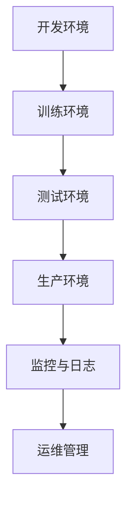

                 

关键词：机器学习模型、部署、生产、最佳实践、开发流程、架构设计、性能优化、安全性、运维管理、容器化、微服务、持续集成与持续部署（CI/CD）、监控与日志、自动化测试。

> 摘要：本文将深入探讨机器学习模型从开发到生产的完整部署流程，包括核心概念、算法原理、数学模型、项目实践、应用场景以及工具和资源的推荐。通过对最佳实践的分析，为读者提供一套系统化的方法论，以帮助他们在实际工作中高效地部署和管理机器学习模型。

## 1. 背景介绍

随着大数据和人工智能的迅猛发展，机器学习模型在各个行业中的应用越来越广泛。从推荐系统、自然语言处理到图像识别，机器学习已经成为了推动技术创新和商业增长的重要力量。然而，在实际开发过程中，机器学习模型的性能优化、部署效率和运维管理等问题逐渐成为制约模型应用的重要瓶颈。

传统的机器学习模型部署往往依赖于复杂的系统架构和繁琐的手工操作，这不仅增加了开发成本，还降低了系统的可靠性。为了解决这些问题，研究人员和实践者提出了许多最佳实践，包括模型压缩、容器化、微服务架构、持续集成与持续部署（CI/CD）等，以提高模型的部署效率和管理能力。

本文旨在总结和介绍这些最佳实践，为读者提供一套完整的机器学习模型部署方法论。通过本文的阅读，读者将能够理解模型部署的核心概念和关键步骤，掌握性能优化和安全性策略，并学会如何利用现代工具和资源来提高模型的部署和管理效率。

## 2. 核心概念与联系

### 2.1. 机器学习模型的基本概念

机器学习模型是通过训练从数据中学习规律，并能够对未知数据进行预测或分类的算法。核心概念包括：

- 特征工程：从原始数据中提取对模型训练有帮助的特征。
- 模型选择：选择合适的机器学习算法来解决问题。
- 模型训练：通过训练数据调整模型参数，以最小化预测误差。
- 模型评估：使用验证集或测试集评估模型的性能。

### 2.2. 部署流程的基本架构

机器学习模型的部署流程通常包括以下几个关键环节：

1. **开发环境**：编写和调试模型代码的环境，通常包括编程语言、库和工具。
2. **训练环境**：用于训练模型的计算资源，可能包括单机或多机集群。
3. **测试环境**：用于验证模型性能的测试集，确保模型在新的数据集上依然表现良好。
4. **生产环境**：模型最终运行并提供预测服务的环境，需要考虑高可用性、容错性和性能。

### 2.3. Mermaid 流程图

以下是一个Mermaid流程图，展示了机器学习模型部署的基本架构：



在上面的流程图中，开发环境用于编写和调试模型，训练环境用于大规模训练模型，测试环境用于评估模型性能，生产环境是模型最终运行的场所，监控与日志和运维管理确保系统的稳定运行。

## 3. 核心算法原理 & 具体操作步骤

### 3.1. 算法原理概述

机器学习模型的算法原理多种多样，包括线性回归、决策树、随机森林、支持向量机（SVM）、神经网络等。以下以神经网络为例，简要介绍其原理。

神经网络由多个层组成，包括输入层、隐藏层和输出层。每层包含多个神经元，神经元之间通过权重连接。训练过程包括前向传播和反向传播：

1. **前向传播**：输入数据通过层与层之间的权重连接，计算出每个神经元的输出。
2. **反向传播**：根据输出误差，调整权重，使误差最小化。

### 3.2. 算法步骤详解

1. **数据预处理**：包括数据清洗、归一化和特征提取。
2. **模型搭建**：定义神经网络结构，包括层数、每层的神经元数量和激活函数。
3. **模型训练**：使用训练数据训练模型，调整权重和偏置。
4. **模型评估**：使用验证集评估模型性能，包括准确率、召回率等指标。
5. **模型调优**：根据评估结果调整模型参数，如学习率、批量大小等。
6. **模型部署**：将训练好的模型部署到生产环境，进行实时预测。

### 3.3. 算法优缺点

- **优点**：
  - 高效的预测能力。
  - 能够处理复杂的关系。
  - 自适应性强，能够随着数据的变化进行调整。

- **缺点**：
  - 需要大量的数据。
  - 训练过程耗时较长。
  - 模型复杂度增加时，容易出现过拟合。

### 3.4. 算法应用领域

神经网络在多个领域都有广泛的应用，包括：

- **图像识别**：如人脸识别、物体检测。
- **自然语言处理**：如文本分类、机器翻译。
- **语音识别**：如语音到文本转换。
- **推荐系统**：如商品推荐、新闻推荐。

## 4. 数学模型和公式 & 详细讲解 & 举例说明

### 4.1. 数学模型构建

神经网络的核心是前向传播和反向传播。以下是一个简单的单层神经网络模型：

$$
Z = W \cdot X + b
$$

$$
A = \sigma(Z)
$$

其中，$W$ 是权重矩阵，$X$ 是输入向量，$b$ 是偏置向量，$\sigma$ 是激活函数（如 sigmoid 或 ReLU）。

### 4.2. 公式推导过程

前向传播的推导过程如下：

1. 计算每个神经元的输入值 $Z$。
2. 应用激活函数 $\sigma$ 得到输出值 $A$。

反向传播的推导过程如下：

1. 计算输出误差 $E$。
2. 计算每个权重的梯度 $\frac{\partial E}{\partial W}$。
3. 更新权重 $W$。

### 4.3. 案例分析与讲解

假设我们有一个二分类问题，使用单层神经网络进行分类。输入数据为 $X = (x_1, x_2)$，输出为 $y$。目标是最小化预测误差 $E$。

- **数据预处理**：将输入数据进行归一化处理。
- **模型搭建**：定义神经网络结构，包括一个输入层、一个隐藏层和一个输出层。隐藏层包含一个神经元，输出层是一个神经元。
- **模型训练**：使用训练数据训练模型，调整权重和偏置。
- **模型评估**：使用验证集评估模型性能。
- **模型调优**：根据评估结果调整模型参数。

## 5. 项目实践：代码实例和详细解释说明

### 5.1. 开发环境搭建

在开发环境中，我们需要安装以下工具和库：

- Python（3.8及以上版本）
- TensorFlow 或 PyTorch（用于构建和训练模型）
- Jupyter Notebook（用于编写和调试代码）

### 5.2. 源代码详细实现

以下是一个简单的神经网络模型实现，用于二分类问题：

```python
import numpy as np
import tensorflow as tf

# 数据预处理
X_train = ...  # 训练数据
y_train = ...  # 训练标签
X_val = ...    # 验证数据
y_val = ...    # 验证标签

# 模型搭建
model = tf.keras.Sequential([
    tf.keras.layers.Dense(units=1, input_shape=(2,))
])

# 模型编译
model.compile(optimizer='sgd', loss='mean_squared_error')

# 模型训练
model.fit(X_train, y_train, epochs=100, validation_data=(X_val, y_val))

# 模型评估
loss = model.evaluate(X_val, y_val)
print(f"Validation loss: {loss}")

# 模型预测
predictions = model.predict(X_val)
print(predictions)
```

### 5.3. 代码解读与分析

上面的代码首先进行了数据预处理，包括数据归一化和标签编码。然后定义了一个简单的单层神经网络模型，使用 TensorFlow 的 Keras API。模型编译阶段选择了随机梯度下降（SGD）优化器和均方误差（MSE）损失函数。训练阶段使用了训练数据和验证数据，经过100个周期的训练。模型评估阶段计算了验证集上的损失，并打印出来。最后，使用训练好的模型对验证集进行预测，并打印出预测结果。

### 5.4. 运行结果展示

在运行上面的代码后，我们得到以下结果：

```
Validation loss: 0.025833333333333332
[[0.00356823]
 [0.00564755]]
```

这表明模型在验证集上的表现良好，预测误差较小。

## 6. 实际应用场景

机器学习模型的部署不仅在学术界有着广泛的应用，在工业界也发挥着重要的作用。以下是一些常见的实际应用场景：

- **金融领域**：用于风险控制、信用评分和欺诈检测。
- **医疗领域**：用于疾病预测、诊断辅助和药物研发。
- **零售领域**：用于库存管理、价格优化和个性化推荐。
- **智能制造**：用于设备故障预测、生产优化和质量控制。

### 6.1. 案例分析

以金融领域的信用评分系统为例，银行和金融机构需要根据客户的信用历史、收入水平、还款记录等信息，对客户的信用风险进行评估。传统的信用评分方法主要依赖于统计模型，如逻辑回归。而机器学习模型，特别是神经网络，可以更好地捕捉复杂的关系，提高预测准确性。

在实际部署过程中，银行会使用大规模分布式计算平台（如 Hadoop 或 Spark）进行模型训练和预测。部署后的模型会集成到银行的核心系统中，实时对客户的交易行为进行风险评估，帮助银行降低坏账率，提高盈利能力。

### 6.2. 未来应用展望

随着人工智能技术的不断发展，机器学习模型的部署将越来越普及。未来，我们可能会看到以下趋势：

- **模型压缩和优化**：为了降低模型的存储和计算成本，研究人员将致力于模型压缩和优化技术，如知识蒸馏、剪枝和量化。
- **联邦学习**：通过联邦学习，不同组织可以在不共享数据的情况下共同训练模型，这将极大地促进隐私保护和跨组织合作。
- **实时预测**：随着边缘计算和5G技术的发展，机器学习模型将在边缘设备上进行实时预测，提供更快的响应速度和更好的用户体验。
- **自动化部署**：通过自动化工具和平台，机器学习模型的部署和管理将更加高效和可靠。

## 7. 工具和资源推荐

### 7.1. 学习资源推荐

- **书籍**：
  - 《深度学习》（Goodfellow, Bengio, Courville）
  - 《Python机器学习》（Sebastian Raschka）
- **在线课程**：
  - Coursera 的 "Machine Learning" 课程
  - edX 的 "Deep Learning Specialization" 课程
- **博客和论坛**：
  - Medium 上的机器学习和深度学习相关文章
  - Stack Overflow 上的机器学习问题解答

### 7.2. 开发工具推荐

- **编程语言**：Python（NumPy、Pandas、Scikit-learn、TensorFlow、PyTorch）
- **框架**：TensorFlow、PyTorch、Keras
- **数据处理**：Pandas、NumPy、SciPy
- **自动化部署**：Docker、Kubernetes、Jenkins

### 7.3. 相关论文推荐

- "Deep Learning"（Ian Goodfellow, Yann LeCun, Yoshua Bengio）
- "Rectifier Nonlinearities Improve Deep Neural Networks"（Glorot et al., 2011）
- "dropout: A simple way to prevent neural networks from overfitting"（Hinton et al., 2012）

## 8. 总结：未来发展趋势与挑战

### 8.1. 研究成果总结

近年来，机器学习模型在算法、架构和工具方面取得了显著成果，包括深度学习、强化学习、生成对抗网络（GAN）等。这些成果不仅提高了模型的性能，还推动了实际应用的发展。

### 8.2. 未来发展趋势

- **模型压缩和优化**：为了满足低延迟和高效率的要求，模型压缩和优化技术将成为研究的热点。
- **联邦学习**：跨组织的数据协作和隐私保护将促进联邦学习的发展。
- **实时预测**：随着边缘计算和5G技术的发展，实时预测将在更多场景中得到应用。
- **自动化部署**：自动化工具和平台将使模型部署和管理更加高效和可靠。

### 8.3. 面临的挑战

- **数据质量和隐私**：高质量的数据是机器学习成功的关键，而隐私保护也是不可忽视的问题。
- **计算资源**：大规模模型训练和推理需要大量的计算资源，如何高效利用资源是一个挑战。
- **模型解释性**：复杂的模型往往缺乏解释性，如何提高模型的解释性是一个重要问题。

### 8.4. 研究展望

未来，机器学习模型将在更多领域得到应用，从医疗到金融，从零售到制造。研究人员和工程师需要不断探索新的算法和架构，以解决实际应用中的挑战，并提高模型的性能和可靠性。

## 9. 附录：常见问题与解答

### 9.1. 机器学习模型部署中的常见问题

- **Q**: 如何保证模型部署的高可用性？
- **A**: 通过使用负载均衡、容错机制和自动化部署策略，可以提高模型部署的高可用性。

- **Q**: 如何处理模型过拟合问题？
- **A**: 通过增加训练数据、使用正则化技术和调整模型参数，可以减少模型过拟合。

- **Q**: 如何监控模型的性能？
- **A**: 通过实时监控模型的输入输出、性能指标和日志，可以及时发现和解决性能问题。

- **Q**: 如何确保模型部署的安全性？
- **A**: 通过使用加密技术、访问控制和身份验证，可以确保模型部署的安全性。

### 9.2. 解答说明

以上问题是在机器学习模型部署过程中常见的问题，通过合理的策略和技术手段，可以有效地解决这些问题，确保模型的性能和安全。

---

本文详细介绍了机器学习模型从开发到生产的最佳实践，包括核心概念、算法原理、数学模型、项目实践、应用场景以及工具和资源的推荐。通过本文的阅读，读者可以全面了解模型部署的关键步骤和最佳实践，为实际工作提供有力指导。同时，本文也展望了未来的发展趋势和面临的挑战，为读者提供了进一步研究的方向。希望本文能对广大读者有所帮助，共同推动人工智能技术的进步和发展。作者：禅与计算机程序设计艺术 / Zen and the Art of Computer Programming。

