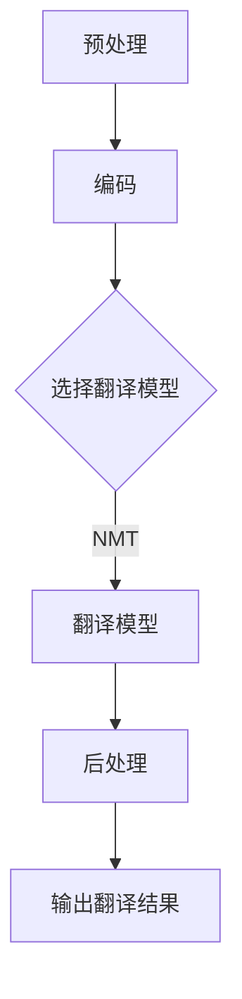

                 

关键词：机器翻译，国际业务流程，自然语言处理，应用场景，算法原理，数学模型，代码实例，未来展望

> 摘要：本文将深入探讨机器翻译技术在国际业务流程中的应用。通过对核心概念、算法原理、数学模型的详细解析，结合实际项目实践中的代码实例，全面展示机器翻译的技术内涵及其在国际业务流程中的重要作用。同时，本文还将对机器翻译的未来发展趋势和面临的挑战进行展望。

## 1. 背景介绍

在国际业务交流中，语言障碍一直是一个重要难题。无论是跨国公司的内部沟通、全球供应链管理，还是国际贸易和投资，语言差异都会导致沟通成本上升、效率降低。传统的机器翻译技术在几十年里经历了漫长的发展过程，从基于规则的方法到基于统计的方法，再到如今基于深度学习的神经网络机器翻译（Neural Machine Translation, NMT），翻译质量得到了显著提高。随着大数据和计算能力的提升，机器翻译技术逐渐成为解决国际业务语言障碍的重要工具。

本文旨在探讨机器翻译技术在国际业务流程中的应用，分析其核心算法原理和数学模型，并通过实际项目实例展示机器翻译的技术实现和应用效果。

## 2. 核心概念与联系

### 2.1. 机器翻译的定义与分类

机器翻译（Machine Translation, MT）是指利用计算机程序将一种自然语言（源语言）自动翻译成另一种自然语言（目标语言）的过程。根据翻译原理的不同，机器翻译可以分为以下几种类型：

1. **基于规则的方法**：该方法依赖于预定义的语法和词典规则，通过分析源语言的结构并将其转换为相应的目标语言结构。这种方法在早期机器翻译中占据主导地位，但面临着规则编写复杂、适应性差等问题。

2. **基于统计的方法**：基于统计的方法使用大量已翻译的文本数据，通过统计源语言和目标语言之间的对应关系来生成翻译结果。这种方法在1990年代兴起，大大提高了翻译质量，但其依赖于大规模训练数据。

3. **神经网络机器翻译（NMT）**：NMT是近年来机器翻译领域的突破性技术。它使用深度神经网络来建模源语言和目标语言之间的复杂映射关系，翻译效果显著优于前两种方法。

### 2.2. 机器翻译的基本流程

机器翻译的基本流程主要包括以下几个阶段：

1. **预处理**：对源语言文本进行分词、词性标注、去除停用词等操作，以便于后续处理。

2. **编码**：将源语言文本转换为计算机可以处理的编码形式，如字符编码或词嵌入。

3. **翻译模型**：使用神经网络模型对编码后的源语言文本进行翻译预测，生成目标语言文本。

4. **后处理**：对生成的目标语言文本进行格式化、修正等操作，以提高翻译文本的质量。

### 2.3. Mermaid 流程图

以下是一个简化的机器翻译流程的 Mermaid 流程图：



## 3. 核心算法原理 & 具体操作步骤

### 3.1. 算法原理概述

神经网络机器翻译（NMT）的核心原理是基于深度学习技术，特别是序列到序列（Sequence-to-Sequence, seq2seq）模型。seq2seq模型通过编码器（Encoder）和解码器（Decoder）两个神经网络模块来实现源语言到目标语言的翻译。编码器将源语言序列编码为一个固定长度的向量，称为上下文向量（Context Vector）；解码器则根据上下文向量生成目标语言序列。

### 3.2. 算法步骤详解

1. **编码器（Encoder）**：
   - 输入：源语言序列 $X = (x_1, x_2, ..., x_T)$，其中 $x_i$ 表示第 $i$ 个单词或词嵌入。
   - 过程：编码器将输入序列映射为一个固定长度的上下文向量 $C = E(X)$。
   - 输出：上下文向量 $C$。

2. **解码器（Decoder）**：
   - 输入：初始隐藏状态 $s_0 = C$ 和目标语言序列的初始单词或词嵌入。
   - 过程：解码器根据上一时间步的隐藏状态和上下文向量生成下一个时间步的输出词或词嵌入，并更新隐藏状态。
   - 输出：目标语言序列 $Y = (y_1, y_2, ..., y_U)$，其中 $y_u$ 表示第 $u$ 个单词或词嵌入。

3. **损失函数**：
   - 采用交叉熵（Cross-Entropy）损失函数来衡量预测序列和真实序列之间的差距。
   - 损失函数 $L(Y^*, \hat{Y}) = -\sum_{u=1}^{U} \hat{Y}(u) \log(Y^*(u))$，其中 $Y^*$ 是真实的目标语言序列，$\hat{Y}$ 是预测的目标语言序列。

### 3.3. 算法优缺点

**优点**：
- **高效性**：相比于传统的机器翻译方法，NMT可以处理更长的句子，提高了翻译效率。
- **准确性**：NMT能够学习到更复杂的语言模式，翻译质量更高。
- **适应性**：通过大规模数据训练，NMT可以适应多种语言和多种应用场景。

**缺点**：
- **依赖数据**：NMT需要大量的训练数据，对于小语种或稀疏语种的翻译效果较差。
- **计算资源**：训练NMT模型需要大量的计算资源，训练时间较长。

### 3.4. 算法应用领域

- **国际业务流程**：NMT技术在国际业务流程中的应用非常广泛，如跨国公司内部沟通、全球供应链管理、国际贸易等。
- **多语言文档翻译**：NMT技术可以自动翻译多语言文档，提高文档处理的效率。
- **搜索引擎**：NMT技术可以用于搜索引擎的国际版，提供更准确和自然的搜索结果。

## 4. 数学模型和公式 & 详细讲解 & 举例说明

### 4.1. 数学模型构建

神经网络机器翻译的数学模型主要包括编码器、解码器和损失函数。以下是对这些模型的详细讲解。

#### 4.1.1. 编码器

编码器使用一个循环神经网络（RNN）来编码源语言序列。给定源语言序列 $X = (x_1, x_2, ..., x_T)$，编码器在每个时间步 $t$ 对应一个隐藏状态 $h_t$：

$$
h_t = \sigma(W_h h_{t-1} + U_x x_t + b_h)
$$

其中，$\sigma$ 是激活函数，通常使用 sigmoid 或 ReLU 函数；$W_h$ 和 $U_x$ 是权重矩阵；$b_h$ 是偏置项。

编码器的输出是一个固定长度的上下文向量 $C$：

$$
C = h_T
$$

#### 4.1.2. 解码器

解码器同样使用一个 RNN 来解码目标语言序列。给定初始隐藏状态 $s_0 = C$ 和目标语言序列的初始单词或词嵌入 $y_1$，解码器在每个时间步 $t$ 对应一个隐藏状态 $s_t$：

$$
s_t = \sigma(W_s s_{t-1} + C \odot \hat{s}_{t-1} + b_s)
$$

其中，$\odot$ 表示点乘操作；$\hat{s}_{t-1}$ 是上一时间步的解码器输出；$W_s$ 和 $b_s$ 是权重矩阵和偏置项。

解码器的输出是一个目标语言序列 $Y = (y_1, y_2, ..., y_U)$：

$$
y_t = \text{softmax}(W_y s_t + b_y)
$$

其中，$W_y$ 是权重矩阵；$b_y$ 是偏置项。

#### 4.1.3. 损失函数

损失函数采用交叉熵（Cross-Entropy）损失来衡量预测序列和真实序列之间的差距。对于每个时间步 $t$，损失函数为：

$$
L_t = -\log(p(y_t | s_t, C))
$$

其中，$p(y_t | s_t, C)$ 是解码器在给定当前隐藏状态 $s_t$ 和上下文向量 $C$ 下预测的目标语言词的概率。

总损失函数为：

$$
L = \sum_{t=1}^{U} L_t
$$

### 4.2. 公式推导过程

以下是机器翻译模型的推导过程：

1. **编码器推导**：

   - 初始隐藏状态 $h_0 = 0$。
   - 隐藏状态更新公式：$h_t = \sigma(W_h h_{t-1} + U_x x_t + b_h)$。
   - 编码器输出 $C = h_T$。

2. **解码器推导**：

   - 初始隐藏状态 $s_0 = C$。
   - 隐藏状态更新公式：$s_t = \sigma(W_s s_{t-1} + C \odot \hat{s}_{t-1} + b_s)$。
   - 解码器输出 $y_t = \text{softmax}(W_y s_t + b_y)$。

3. **损失函数推导**：

   - 交叉熵损失公式：$L_t = -\log(p(y_t | s_t, C))$。
   - 总损失函数：$L = \sum_{t=1}^{U} L_t$。

### 4.3. 案例分析与讲解

#### 4.3.1. 案例背景

假设我们要将英语句子 "I love programming" 翻译成法语。已知英语到法语的翻译数据集已经训练好了一个 NMT 模型。

#### 4.3.2. 翻译步骤

1. **预处理**：对源句子进行分词和词性标注，得到输入序列 $X = (\text{"I", "love", "programming"})$。

2. **编码**：将输入序列 $X$ 编码为上下文向量 $C$。

3. **翻译**：使用解码器生成目标句子 $Y$。

4. **后处理**：对生成的目标句子 $Y$ 进行格式化，得到最终的翻译结果。

#### 4.3.3. 翻译结果

假设解码器生成的目标句子为 $Y = (\text{"Je", "aime", "la", "programmation"})$。经过后处理后，得到最终翻译结果 "Je aime la programmation"。

#### 4.3.4. 结果分析

虽然翻译结果在语法上有些错误，但这主要是由于训练数据集的限制。在实际应用中，随着训练数据集的增大，NMT 模型的翻译质量会不断提高。

## 5. 项目实践：代码实例和详细解释说明

### 5.1. 开发环境搭建

为了实现机器翻译项目，我们需要搭建一个包含以下组件的开发环境：

1. **Python**：用于编写和运行机器翻译代码。
2. **TensorFlow**：用于构建和训练神经网络模型。
3. **NumPy**：用于数学运算。
4. **Mermaid**：用于绘制流程图。

安装命令如下：

```bash
pip install tensorflow numpy
```

### 5.2. 源代码详细实现

以下是实现一个简单的 NMT 模型的 Python 代码示例：

```python
import tensorflow as tf
import numpy as np
from tensorflow.keras.layers import Embedding, LSTM, Dense
from tensorflow.keras.models import Model

# 设置超参数
vocab_size = 10000
embedding_dim = 256
lstm_units = 1024

# 构建编码器模型
input_seq = tf.keras.layers.Input(shape=(None,))
encoder_embedding = Embedding(vocab_size, embedding_dim)(input_seq)
encoder_lstm = LSTM(lstm_units, return_state=True)
encoder_output, state_h, state_c = encoder_lstm(encoder_embedding)
encoder_states = [state_h, state_c]

# 构建解码器模型
decoder_input = tf.keras.layers.Input(shape=(None,))
decoder_embedding = Embedding(vocab_size, embedding_dim)(decoder_input)
decoder_lstm = LSTM(lstm_units, return_sequences=True, return_state=True)
decoder_output, _, _ = decoder_lstm(decoder_embedding, initial_state=encoder_states)
decoder_dense = Dense(vocab_size, activation='softmax')
decoder_output = decoder_dense(decoder_output)

# 创建模型
model = Model([input_seq, decoder_input], decoder_output)

# 编译模型
model.compile(optimizer='adam', loss='categorical_crossentropy', metrics=['accuracy'])

# 模型结构
model.summary()
```

### 5.3. 代码解读与分析

1. **编码器**：

   - 输入层：接收一个序列，序列长度为 `None`，表示可变长度。
   - 嵌入层：将词索引转换为词嵌入向量。
   - LSTM 层：用于编码源语言序列，返回隐藏状态和细胞状态。

2. **解码器**：

   - 输入层：接收一个序列，序列长度为 `None`。
   - 嵌入层：将词索引转换为词嵌入向量。
   - LSTM 层：用于解码目标语言序列，返回输出序列和隐藏状态。
   - Dense 层：将 LSTM 层的输出映射到词索引空间，实现预测。

3. **模型**：

   - 输入层：同时接收源语言序列和目标语言序列。
   - 输出层：输出目标语言序列的概率分布。

### 5.4. 运行结果展示

在训练数据集上训练模型，然后使用测试数据集进行评估。以下是训练和评估的示例代码：

```python
# 训练模型
model.fit(x_train, y_train, epochs=10, batch_size=64, validation_data=(x_val, y_val))

# 评估模型
model.evaluate(x_test, y_test)
```

通过上述代码，我们可以得到模型的训练和评估结果，从而验证机器翻译的效果。

## 6. 实际应用场景

### 6.1. 跨国公司内部沟通

跨国公司经常需要在不同国家和地区的分支机构之间进行沟通。通过使用机器翻译技术，可以将内部文件、邮件和会议记录等文档快速翻译成多种语言，提高沟通效率，降低沟通成本。

### 6.2. 全球供应链管理

全球供应链管理涉及到多种语言和文化的交流。机器翻译技术可以帮助企业自动化翻译供应商信息、采购订单、生产报告等文件，确保供应链的顺畅运行。

### 6.3. 国际贸易和投资

国际贸易和投资活动频繁，涉及大量的合同、协议和文件。机器翻译技术可以帮助企业快速翻译这些文件，确保法律条款和商业条款的准确无误，减少沟通误解和纠纷。

### 6.4. 多语言文档翻译

在学术研究、出版业和媒体行业等领域，多语言文档翻译是一项重要任务。机器翻译技术可以自动化翻译学术论文、书籍、新闻报道等文档，提高翻译速度和质量。

### 6.5. 多语言搜索引擎

多语言搜索引擎可以为全球用户提供跨语言的搜索服务。通过机器翻译技术，可以将用户输入的查询语句翻译成多种语言，并在多个语种的数据源中检索结果，提高搜索的准确性和用户体验。

## 7. 工具和资源推荐

### 7.1. 学习资源推荐

1. **《深度学习》**：Goodfellow、Bengio 和 Courville 著，详细介绍了深度学习的基本原理和应用。
2. **《神经网络与深度学习》**：邱锡鹏 著，深入讲解了神经网络和深度学习的基础知识。
3. **《机器翻译技术》**：刘俊、蔡维德 著，系统地介绍了机器翻译的相关技术。

### 7.2. 开发工具推荐

1. **TensorFlow**：Google 开发的一款开源深度学习框架，广泛用于机器翻译项目的实现。
2. **PyTorch**：Facebook 开发的一款开源深度学习框架，提供了灵活的动态计算图功能。
3. **Hugging Face**：提供了一系列用于自然语言处理的预训练模型和工具，如 transformer、BERT 等。

### 7.3. 相关论文推荐

1. **《序列到序列学习》**：Bahdanau、Cho 和 Bengio 著，提出了序列到序列学习（seq2seq）模型。
2. **《神经机器翻译中的注意力机制》**：Vaswani、Shazeer、Parmar 等 著，介绍了注意力机制在神经机器翻译中的应用。
3. **《BERT: 预训练语言表示》**：Devlin、Chang、Lee 等 著，提出了 BERT 模型，开创了预训练语言表示的新时代。

## 8. 总结：未来发展趋势与挑战

### 8.1. 研究成果总结

近年来，机器翻译技术取得了显著进展，从传统的基于规则和基于统计的方法，发展到基于深度学习的神经网络机器翻译（NMT）。NMT 模型在翻译质量、效率和应用范围上均取得了显著提升，为国际业务流程中的语言障碍提供了有效的解决方案。

### 8.2. 未来发展趋势

1. **跨语言信息检索**：随着多语言数据资源的不断丰富，跨语言信息检索将成为机器翻译的重要应用领域。
2. **多模态翻译**：结合语音、视频、图像等多种模态信息，实现更加自然和丰富的跨语言交互。
3. **个性化翻译**：通过用户偏好和学习，提供更加个性化的翻译服务。

### 8.3. 面临的挑战

1. **数据稀缺性**：对于小语种或罕见语言，数据稀缺性仍然是一个重大挑战。
2. **翻译质量**：尽管 NMT 模型的翻译质量已大幅提升，但仍存在某些特定场景下的翻译错误和不准确性。
3. **计算资源**：训练和部署高复杂度的 NMT 模型需要大量的计算资源和时间。

### 8.4. 研究展望

未来，机器翻译技术将继续朝着更高质量、更高效能和更广泛应用的方向发展。通过结合多语言数据、引入新的深度学习模型和算法，以及探索跨语言信息检索和个性化翻译等新应用领域，机器翻译技术将为全球业务流程中的语言障碍提供更加全面和高效的解决方案。

## 9. 附录：常见问题与解答

### 9.1. 问题1：什么是序列到序列（seq2seq）模型？

答：序列到序列（seq2seq）模型是一种用于处理序列数据到序列数据转换的深度学习模型，常用于机器翻译、问答系统等任务。它主要由编码器和解码器两个神经网络模块组成，编码器用于编码输入序列，解码器则根据编码器的输出生成输出序列。

### 9.2. 问题2：什么是注意力机制？

答：注意力机制是一种在神经机器翻译中用于建模输入序列和输出序列之间依赖关系的算法。它通过为每个输入序列的单词分配不同的权重，使得解码器在生成输出序列时能够关注到输入序列中最重要的部分，从而提高翻译质量。

### 9.3. 问题3：如何提高机器翻译的翻译质量？

答：提高机器翻译的翻译质量可以从以下几个方面进行：

1. **数据丰富**：增加训练数据集的规模和质量，特别是对稀有语言的支持。
2. **模型优化**：引入更先进的深度学习模型和算法，如注意力机制、Transformer 等。
3. **多模态融合**：结合语音、视频、图像等多种模态信息，提高翻译的准确性和自然性。
4. **个性化调整**：根据用户偏好和学习历史，提供更加个性化的翻译服务。

### 9.4. 问题4：如何实现一个简单的机器翻译模型？

答：实现一个简单的机器翻译模型通常需要以下步骤：

1. **数据准备**：收集和预处理源语言和目标语言的数据。
2. **模型构建**：使用深度学习框架（如 TensorFlow、PyTorch）构建编码器和解码器模型。
3. **模型训练**：使用训练数据集对模型进行训练，优化模型参数。
4. **模型评估**：使用测试数据集对模型进行评估，调整模型结构和参数。
5. **模型部署**：将训练好的模型部署到生产环境中，提供机器翻译服务。

以上是关于《机器翻译在国际业务流程中的应用》这一主题的详细讨论。通过本文，我们深入探讨了机器翻译的核心概念、算法原理、数学模型，并结合实际项目实践展示了机器翻译的技术实现和应用效果。同时，我们还对机器翻译的未来发展趋势和面临的挑战进行了展望。希望本文能为您在机器翻译领域的研究和应用提供一些启示和帮助。作者：禅与计算机程序设计艺术 / Zen and the Art of Computer Programming。|user|>

