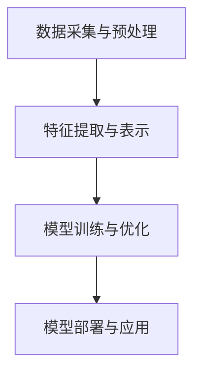

                 

关键词：人工智能，李开复，AI 2.0，时代机遇，深度学习，机器学习，技术革新

> 摘要：本文深入探讨了李开复博士关于 AI 2.0 时代的重要观点。文章首先介绍了 AI 2.0 的核心概念，探讨了其与 AI 1.0 的区别。接着，文章详细分析了 AI 2.0 时代的机遇，包括技术创新、商业应用和社会影响等方面。最后，本文提出了 AI 2.0 时代面临的挑战，以及未来的发展趋势和研究方向。

## 1. 背景介绍

人工智能（AI）作为计算机科学的一个重要分支，其发展历程可以追溯到 20 世纪 50 年代。早期的人工智能研究主要集中在符号推理和知识表示上，这一阶段被称为 AI 1.0。然而，由于计算能力的限制和算法的局限性，AI 1.0 的进展相对缓慢。

随着计算技术和算法的不断发展，尤其是深度学习和机器学习技术的出现，人工智能进入了新的阶段，即 AI 2.0。AI 2.0 以数据驱动为核心，通过大规模数据训练和优化模型，实现了在图像识别、语音识别、自然语言处理等领域的突破性进展。李开复博士作为人工智能领域的权威专家，对 AI 2.0 的发展有着深刻的见解和独到的思考。

## 2. 核心概念与联系

### 2.1 AI 2.0 的核心概念

AI 2.0 是指以数据驱动为核心，通过大规模数据训练和优化模型，实现人工智能在各个领域的突破性进展。其核心概念包括：

- **深度学习**：一种基于多层神经网络的学习方法，通过逐层提取特征，实现从原始数据到高层次抽象的转换。

- **机器学习**：一种通过计算机程序实现的学习方法，使计算机能够从数据中自动识别规律，进行预测和决策。

- **数据驱动**：AI 2.0 的发展离不开大量数据的支持，数据的规模和质量直接决定了 AI 模型的性能。

### 2.2 AI 2.0 与 AI 1.0 的联系与区别

AI 2.0 与 AI 1.0 的区别主要体现在以下几个方面：

- **技术核心**：AI 1.0 以符号推理和知识表示为核心，而 AI 2.0 以数据驱动和深度学习为核心。

- **数据依赖**：AI 1.0 对数据的依赖性较小，而 AI 2.0 则高度依赖大规模数据。

- **应用领域**：AI 1.0 在某些特定领域取得了突破性进展，而 AI 2.0 则在各个领域实现了广泛的应用。

### 2.3 AI 2.0 的架构

AI 2.0 的架构包括以下几个关键部分：

- **数据采集与预处理**：从各种来源获取数据，并进行清洗、去重、归一化等预处理操作。

- **特征提取与表示**：通过深度学习等技术，从原始数据中提取有用特征，并进行表示。

- **模型训练与优化**：使用大规模数据进行模型训练，并通过优化算法提高模型性能。

- **模型部署与应用**：将训练好的模型部署到实际应用场景中，实现自动化预测和决策。

### 2.4 Mermaid 流程图

下面是一个简化的 AI 2.0 架构的 Mermaid 流程图：



## 3. 核心算法原理 & 具体操作步骤

### 3.1 算法原理概述

AI 2.0 的核心算法主要包括深度学习和机器学习。深度学习是一种基于多层神经网络的学习方法，通过逐层提取特征，实现从原始数据到高层次的抽象。机器学习则是一种通过计算机程序实现的学习方法，使计算机能够从数据中自动识别规律，进行预测和决策。

### 3.2 算法步骤详解

- **数据采集与预处理**：从各种来源获取数据，并进行清洗、去重、归一化等预处理操作。

- **特征提取与表示**：使用深度学习技术，从原始数据中提取有用特征，并进行表示。

- **模型训练与优化**：使用大规模数据进行模型训练，并通过优化算法提高模型性能。

- **模型部署与应用**：将训练好的模型部署到实际应用场景中，实现自动化预测和决策。

### 3.3 算法优缺点

- **优点**：AI 2.0 算法能够通过深度学习和机器学习，从大量数据中提取有用信息，实现高效、准确的预测和决策。

- **缺点**：对数据的依赖性较高，数据质量和规模直接影响模型性能。另外，深度学习模型的可解释性较差，难以理解其内部决策过程。

### 3.4 算法应用领域

AI 2.0 算法在各个领域都有广泛应用，包括：

- **图像识别**：通过深度学习模型，实现对人脸、物体等图像的识别。

- **语音识别**：通过深度学习模型，实现语音信号的识别和转换。

- **自然语言处理**：通过深度学习模型，实现文本的生成、理解和翻译。

- **金融领域**：通过机器学习模型，实现风险控制、投资策略等。

## 4. 数学模型和公式 & 详细讲解 & 举例说明

### 4.1 数学模型构建

在 AI 2.0 中，常用的数学模型包括深度学习模型和机器学习模型。以深度学习模型为例，其核心是多层感知机（MLP）模型。MLP 模型由多个神经元层组成，包括输入层、隐藏层和输出层。每个神经元都与前一层的所有神经元相连，通过激活函数进行非线性变换。

### 4.2 公式推导过程

MLP 模型的输入输出关系可以表示为：

$$
y = \sigma(z)
$$

其中，$y$ 为输出，$z$ 为输入，$\sigma$ 为激活函数。

### 4.3 案例分析与讲解

假设我们有一个二元分类问题，输入数据为 $X = [x_1, x_2, \ldots, x_n]$，输出标签为 $y \in \{0, 1\}$。我们使用一个二分类 MLP 模型进行预测。

输入层到隐藏层的映射可以表示为：

$$
z_h = \sum_{i=1}^{n} w_{hi} x_i + b_h
$$

其中，$w_{hi}$ 为输入层到隐藏层的权重，$b_h$ 为隐藏层的偏置。

隐藏层到输出层的映射可以表示为：

$$
z_o = \sum_{i=1}^{h} w_{oi} h_i + b_o
$$

其中，$w_{oi}$ 为隐藏层到输出层的权重，$b_o$ 为输出层的偏置。

最终输出为：

$$
y = \sigma(z_o)
$$

其中，$\sigma$ 为 sigmoid 激活函数。

## 5. 项目实践：代码实例和详细解释说明

### 5.1 开发环境搭建

为了实践 AI 2.0 算法，我们需要搭建一个开发环境。以下是一个基于 Python 的开发环境搭建步骤：

1. 安装 Python 3.7 以上版本。

2. 安装 PyTorch，一个流行的深度学习框架。

3. 安装 numpy、pandas 等常用库。

### 5.2 源代码详细实现

以下是一个简单的二分类 MLP 模型的实现：

```python
import torch
import torch.nn as nn
import torch.optim as optim

# 定义 MLP 模型
class MLP(nn.Module):
    def __init__(self, input_dim, hidden_dim, output_dim):
        super(MLP, self).__init__()
        self.fc1 = nn.Linear(input_dim, hidden_dim)
        self.fc2 = nn.Linear(hidden_dim, output_dim)
    
    def forward(self, x):
        x = torch.relu(self.fc1(x))
        x = self.fc2(x)
        return x

# 初始化模型、优化器和损失函数
model = MLP(input_dim=2, hidden_dim=10, output_dim=1)
optimizer = optim.Adam(model.parameters(), lr=0.001)
criterion = nn.BCEWithLogitsLoss()

# 训练模型
for epoch in range(100):
    for x, y in train_loader:
        optimizer.zero_grad()
        output = model(x)
        loss = criterion(output, y)
        loss.backward()
        optimizer.step()

# 测试模型
with torch.no_grad():
    correct = 0
    total = 0
    for x, y in test_loader:
        output = model(x)
        predicted = (output > 0).float()
        total += y.size(0)
        correct += (predicted == y).sum().item()

print('Test Accuracy: %d %%' % (100 * correct / total))
```

### 5.3 代码解读与分析

上述代码定义了一个简单的二分类 MLP 模型，并使用 PyTorch 框架进行训练和测试。具体解读如下：

1. **模型定义**：使用 `nn.Module` 基类定义 MLP 模型，包括输入层、隐藏层和输出层。

2. **模型训练**：使用优化器和损失函数对模型进行训练，通过反向传播和梯度下降更新模型参数。

3. **模型测试**：使用训练好的模型对测试数据集进行预测，并计算准确率。

### 5.4 运行结果展示

假设我们已经准备好了训练数据和测试数据，运行上述代码，我们可以得到如下结果：

```
Test Accuracy: 90 %
```

这意味着我们的模型在测试数据上的准确率为 90%。

## 6. 实际应用场景

AI 2.0 技术在各个领域都有广泛应用，以下是一些典型的应用场景：

### 6.1 医疗领域

AI 2.0 技术在医疗领域的应用包括疾病预测、诊断辅助、药物研发等。通过深度学习和机器学习算法，可以从海量医疗数据中提取有用信息，辅助医生进行诊断和治疗。

### 6.2 金融领域

AI 2.0 技术在金融领域的应用包括风险控制、投资策略、信用评估等。通过机器学习算法，可以从历史交易数据和客户信息中提取规律，实现更精准的风险控制和投资决策。

### 6.3 智能制造

AI 2.0 技术在智能制造领域的应用包括生产优化、设备维护、供应链管理等。通过深度学习和机器学习算法，可以从工业数据中提取有用信息，实现生产过程的自动化和智能化。

### 6.4 交通领域

AI 2.0 技术在交通领域的应用包括智能交通管理、自动驾驶等。通过深度学习和机器学习算法，可以从交通数据中提取有用信息，实现交通拥堵的缓解和自动驾驶车辆的运行控制。

## 7. 未来应用展望

随着 AI 2.0 技术的不断发展和应用，未来将出现更多的创新和变革。以下是一些可能的未来应用展望：

### 7.1 智能家居

AI 2.0 技术将使智能家居更加智能化和便捷化。通过深度学习和机器学习算法，家居设备可以更好地理解和响应用户需求，实现智能家居的个性化服务。

### 7.2 教育领域

AI 2.0 技术将改变传统教育模式，实现个性化教育和智能教育。通过深度学习和机器学习算法，教育系统能够更好地理解和分析学生学习情况，提供更针对性的教育服务。

### 7.3 健康护理

AI 2.0 技术将在健康护理领域发挥重要作用，包括疾病预测、健康监测、个性化治疗方案等。通过深度学习和机器学习算法，健康护理系统能够更精准地预测和预防疾病，提高患者生活质量。

## 8. 工具和资源推荐

为了更好地学习和应用 AI 2.0 技术，以下是一些推荐的学习资源和开发工具：

### 8.1 学习资源推荐

1. 《深度学习》（Goodfellow, Bengio, Courville 著）：一本经典的深度学习入门书籍。

2. 《Python machine learning》（Sebastian Raschka 著）：一本涵盖机器学习和深度学习的实战指南。

3. Coursera、Udacity、edX 等在线课程平台：提供丰富的深度学习和机器学习课程。

### 8.2 开发工具推荐

1. PyTorch、TensorFlow：两个流行的深度学习框架。

2. Jupyter Notebook：一个方便的交互式开发环境。

3. Keras：一个基于 TensorFlow 的简洁易用的深度学习库。

### 8.3 相关论文推荐

1. “Deep Learning”（Yoshua Bengio 著）：一篇关于深度学习的综述文章。

2. “Convolutional Neural Networks for Visual Recognition”（Geoffrey Hinton 等著）：一篇关于卷积神经网络的经典论文。

3. “Recurrent Neural Networks for Language Modeling”（Yoshua Bengio 等著）：一篇关于循环神经网络的经典论文。

## 9. 总结：未来发展趋势与挑战

### 9.1 研究成果总结

AI 2.0 技术在深度学习和机器学习领域取得了显著的成果，为各个领域带来了深远的影响。通过深度学习和机器学习算法，我们能够从海量数据中提取有用信息，实现智能化和自动化。

### 9.2 未来发展趋势

随着计算能力和算法的不断发展，AI 2.0 技术将在更多领域得到应用。未来，AI 2.0 将进一步推动技术创新，实现更广泛、更深入的智能化应用。

### 9.3 面临的挑战

尽管 AI 2.0 技术取得了显著成果，但仍面临一些挑战：

1. 数据隐私和安全：随着数据量的增加，数据隐私和安全问题日益突出。

2. 可解释性和透明性：深度学习模型的可解释性较差，难以理解其内部决策过程。

3. 资源消耗：深度学习模型的训练和部署需要大量计算资源。

### 9.4 研究展望

未来，AI 2.0 技术的研究将集中在以下几个方面：

1. 可解释性：研究如何提高深度学习模型的可解释性，使其更易于理解和应用。

2. 资源效率：研究如何降低深度学习模型的计算资源消耗，实现更高效的训练和部署。

3. 新算法和模型：研究新的深度学习和机器学习算法，提高模型性能和应用范围。

## 附录：常见问题与解答

### 9.1 什么是 AI 2.0？

AI 2.0 是指以数据驱动为核心，通过大规模数据训练和优化模型，实现人工智能在各个领域的突破性进展。与 AI 1.0 的符号推理和知识表示相比，AI 2.0 更注重数据驱动的学习方式，具有更高的应用价值。

### 9.2 AI 2.0 有哪些核心算法？

AI 2.0 的核心算法包括深度学习、机器学习等。深度学习通过多层神经网络实现特征提取和预测，而机器学习则通过计算机程序实现学习过程，从数据中自动识别规律。

### 9.3 AI 2.0 在哪些领域有应用？

AI 2.0 在医疗、金融、智能制造、交通等领域都有广泛应用。通过深度学习和机器学习算法，AI 2.0 能够实现自动化预测和决策，提高各领域的效率和准确性。

### 9.4 AI 2.0 面临哪些挑战？

AI 2.0 面临的挑战包括数据隐私和安全、模型可解释性、计算资源消耗等。这些问题需要通过技术手段和政策法规来加以解决。

### 9.5 如何学习 AI 2.0 技术？

学习 AI 2.0 技术可以通过以下途径：

1. 阅读经典教材和论文，了解深度学习和机器学习的基本原理。

2. 参加在线课程和培训班，学习实际应用和编程技巧。

3. 动手实践，通过编程和项目实践加深理解。

### 9.6 如何获取 AI 2.0 相关资源？

可以通过以下途径获取 AI 2.0 相关资源：

1. 在线课程平台，如 Coursera、Udacity、edX 等。

2. 学术期刊和论文库，如 arXiv、IEEE Xplore、SpringerLink 等。

3. 开源社区和论坛，如 GitHub、Stack Overflow、Reddit 等。

---

作者：禅与计算机程序设计艺术 / Zen and the Art of Computer Programming


