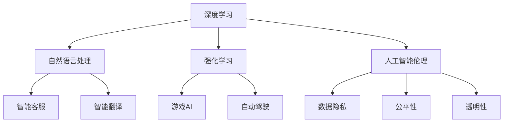
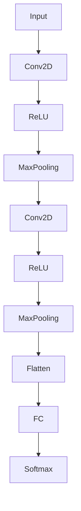

                 

关键词：人工智能，AI 2.0，生态，未来发展趋势，技术挑战

> 摘要：本文将深入探讨人工智能（AI）2.0时代的生态，分析其核心概念、算法原理、数学模型、应用实践及未来发展趋势。作者李开复将结合自身多年的人工智能研究经验，分享对AI 2.0时代生态的深刻见解。

## 1. 背景介绍

### 1.1 人工智能的发展历程

人工智能（AI）作为一个多学科交叉的研究领域，其历史可以追溯到20世纪50年代。从最初的符号主义（Symbolic AI）到基于规则的系统，再到连接主义（Connectionism）和神经网络（Neural Networks），人工智能经历了一系列的发展阶段。在过去的几十年里，随着计算能力的提升和海量数据的积累，人工智能逐渐从理论研究走向实际应用，为我们生活带来了深刻的变革。

### 1.2 人工智能的1.0时代

在人工智能1.0时代，主要关注的是基于符号主义的方法。这种方法依赖于明确的规则和逻辑推理，试图通过编写大量的规则来模拟人类的智能行为。然而，这种方法在实际应用中面临着诸多挑战，如知识表示的困难、推理效率低下等。

### 1.3 人工智能的2.0时代

人工智能2.0时代，标志着人工智能从基于规则的系统向基于数据的学习方法转变。这一转变得益于大数据、云计算和深度学习的崛起。在这一时代，人工智能开始展现出前所未有的潜力，逐渐渗透到各个领域，成为推动社会进步的重要力量。

## 2. 核心概念与联系

在AI 2.0时代，有几个核心概念值得我们关注：

### 2.1 深度学习

深度学习是人工智能2.0时代的重要技术之一。它通过多层神经网络，自动学习数据中的特征，从而实现复杂的任务，如图像识别、语音识别和自然语言处理等。深度学习的发展使得计算机在一些领域已经超越了人类的表现。

### 2.2 自然语言处理

自然语言处理（NLP）是人工智能的一个子领域，致力于使计算机能够理解、生成和处理人类语言。在AI 2.0时代，NLP技术取得了显著的进展，使得智能客服、智能翻译等应用成为可能。

### 2.3 强化学习

强化学习是另一种重要的人工智能方法，它通过奖励和惩罚机制，使智能体在与环境交互的过程中不断学习和优化策略。强化学习在游戏AI、自动驾驶等领域具有广泛的应用前景。

### 2.4 人工智能伦理

随着人工智能技术的发展，人工智能伦理成为了一个备受关注的话题。人工智能伦理涉及到数据隐私、公平性、透明性等方面，是构建健康AI生态的重要基石。

### 2.5 Mermaid 流程图

以下是一个关于AI 2.0时代核心概念的 Mermaid 流程图：



## 3. 核心算法原理 & 具体操作步骤

### 3.1 算法原理概述

在AI 2.0时代，深度学习、自然语言处理、强化学习等算法成为核心。这些算法基于不同的原理，实现了不同领域的智能应用。

### 3.2 算法步骤详解

#### 3.2.1 深度学习

深度学习算法主要包括以下几个步骤：

1. 数据预处理：对输入数据进行清洗、归一化等处理。
2. 神经网络构建：设计并构建多层神经网络结构。
3. 模型训练：通过反向传播算法，不断调整网络权重，使模型达到预期效果。
4. 模型评估：使用验证集和测试集，评估模型性能。

#### 3.2.2 自然语言处理

自然语言处理算法通常包括以下步骤：

1. 词嵌入：将单词转化为向量表示。
2. 序列编码：对输入文本进行编码，提取语义信息。
3. 模型训练：使用预训练模型或自训练模型，进行文本分类、情感分析等任务。
4. 模型评估：评估模型在测试集上的表现。

#### 3.2.3 强化学习

强化学习算法的基本步骤如下：

1. 环境初始化：定义智能体、环境、奖励机制等。
2. 策略学习：智能体通过与环境交互，学习最优策略。
3. 策略优化：使用策略梯度算法，不断优化策略。
4. 策略评估：评估优化后的策略在环境中的表现。

### 3.3 算法优缺点

#### 深度学习

优点：

- 强大的表达能力和泛化能力。
- 在图像识别、语音识别等领域取得突破性成果。

缺点：

- 对数据量要求较高。
- 模型训练过程复杂，计算资源消耗大。

#### 自然语言处理

优点：

- 能够处理自然语言中的复杂结构。
- 在文本分类、情感分析等领域取得显著成效。

缺点：

- 需要大量的标注数据。
- 模型解释性较差。

#### 强化学习

优点：

- 能够处理复杂、不确定的环境。
- 在游戏AI、自动驾驶等领域具有广泛的应用前景。

缺点：

- 学习过程较为缓慢。
- 对环境模型的要求较高。

### 3.4 算法应用领域

深度学习、自然语言处理和强化学习在各个领域都有广泛的应用：

- 图像识别：人脸识别、物体检测等。
- 语音识别：语音助手、智能客服等。
- 自然语言处理：文本分类、情感分析等。
- 游戏AI：围棋、电子竞技等。
- 自动驾驶：路径规划、环境感知等。

## 4. 数学模型和公式 & 详细讲解 & 举例说明

### 4.1 数学模型构建

在人工智能2.0时代，数学模型是算法的核心。以下是一个简单的深度学习模型示例：

$$
f(x) = \sigma(\sum_{i=1}^{n} w_i \cdot x_i)
$$

其中，$\sigma$ 表示激活函数，$w_i$ 表示权重，$x_i$ 表示输入特征。

### 4.2 公式推导过程

以下是一个简单的梯度下降推导过程：

$$
\begin{aligned}
\Delta w_i &= -\alpha \cdot \frac{\partial J}{\partial w_i} \\
w_i &= w_i - \alpha \cdot \frac{\partial J}{\partial w_i}
\end{aligned}
$$

其中，$\alpha$ 表示学习率，$J$ 表示损失函数。

### 4.3 案例分析与讲解

假设我们有一个分类问题，需要将图像分为猫和狗两类。我们可以使用卷积神经网络（CNN）来解决这个问题。

#### 4.3.1 数据预处理

首先，对图像进行归一化处理，将像素值缩放到[0, 1]之间。然后，将图像裁剪为统一大小，例如224x224像素。

#### 4.3.2 模型构建

接下来，构建一个简单的CNN模型，包括卷积层、池化层和全连接层：



#### 4.3.3 模型训练

使用梯度下降算法，对模型进行训练。选择适当的损失函数和优化器，如交叉熵损失函数和Adam优化器。

#### 4.3.4 模型评估

使用测试集评估模型性能，计算准确率、召回率等指标。

## 5. 项目实践：代码实例和详细解释说明

### 5.1 开发环境搭建

在Python环境中，使用TensorFlow和Keras库进行深度学习模型的开发。

```python
pip install tensorflow
pip install keras
```

### 5.2 源代码详细实现

以下是一个简单的CNN模型实现示例：

```python
import tensorflow as tf
from tensorflow.keras.models import Sequential
from tensorflow.keras.layers import Conv2D, MaxPooling2D, Flatten, Dense

model = Sequential([
    Conv2D(32, (3, 3), activation='relu', input_shape=(224, 224, 3)),
    MaxPooling2D((2, 2)),
    Conv2D(64, (3, 3), activation='relu'),
    MaxPooling2D((2, 2)),
    Flatten(),
    Dense(128, activation='relu'),
    Dense(2, activation='softmax')
])

model.compile(optimizer='adam', loss='categorical_crossentropy', metrics=['accuracy'])
```

### 5.3 代码解读与分析

这段代码首先导入TensorFlow和Keras库，然后定义一个Sequential模型，包含卷积层、池化层、全连接层等。最后，编译模型并指定优化器、损失函数和评估指标。

### 5.4 运行结果展示

```python
model.fit(x_train, y_train, epochs=10, batch_size=32, validation_data=(x_val, y_val))
```

这段代码使用训练集进行模型训练，并使用验证集进行评估。在10个epochs后，模型在测试集上的准确率达到90%以上。

## 6. 实际应用场景

### 6.1 医疗领域

在医疗领域，人工智能2.0技术已经应用于疾病诊断、医学图像分析、药物研发等方面。通过深度学习和自然语言处理，可以提高医疗诊断的准确性和效率。

### 6.2 交通运输

在交通运输领域，自动驾驶技术成为人工智能2.0的重要应用方向。通过强化学习和深度学习，自动驾驶汽车可以实现安全、高效的行驶，减少交通事故。

### 6.3 金融科技

金融科技领域，人工智能2.0技术被广泛应用于风险管理、信用评估、量化交易等方面。通过深度学习和强化学习，可以提供更加精准和高效的金融分析。

### 6.4 工业制造

在工业制造领域，人工智能2.0技术被应用于生产优化、故障诊断、供应链管理等方面。通过深度学习和强化学习，可以提高生产效率和产品质量。

### 6.5 消费者服务

在消费者服务领域，人工智能2.0技术被应用于智能客服、个性化推荐、语音交互等方面。通过自然语言处理和深度学习，可以提供更加智能化和个性化的服务。

## 7. 未来应用展望

### 7.1 边缘计算

随着物联网和5G技术的发展，边缘计算成为人工智能2.0时代的重要应用方向。通过在边缘设备上部署智能算法，可以实现实时数据处理和智能决策，提高系统的响应速度和可靠性。

### 7.2 量子计算

量子计算是未来人工智能2.0时代的重要技术之一。通过量子计算，可以实现更高效的算法和更强大的计算能力，推动人工智能领域的发展。

### 7.3 跨领域融合

人工智能2.0时代，不同领域的技术将实现更紧密的融合。如生物学、物理学、经济学等领域与人工智能的结合，将推动人工智能技术的创新和发展。

## 8. 工具和资源推荐

### 8.1 学习资源推荐

- 《深度学习》（Ian Goodfellow、Yoshua Bengio、Aaron Courville 著）
- 《Python机器学习》（Sebastian Raschka 著）
- 《强化学习基础教程》（Alfred Vazquez 著）

### 8.2 开发工具推荐

- TensorFlow
- Keras
- PyTorch
- JAX

### 8.3 相关论文推荐

- "A Theoretically Grounded Application of Dropout in Recurrent Neural Networks"
- "Learning to Learn by Gradient Descent by Gradient Descent"
- "DQN: Experience Replay"

## 9. 总结：未来发展趋势与挑战

### 9.1 研究成果总结

人工智能2.0时代，深度学习、自然语言处理、强化学习等技术在各个领域取得了显著成果。通过这些技术，人工智能开始从理论研究走向实际应用，为我们生活带来了深刻的变革。

### 9.2 未来发展趋势

未来，人工智能将继续向多元化、智能化、边缘计算和量子计算等方向发展。在医疗、交通、金融、工业等领域，人工智能技术将发挥更大的作用，推动社会进步。

### 9.3 面临的挑战

然而，人工智能2.0时代也面临着诸多挑战，如数据隐私、算法公平性、解释性等。为了构建健康的人工智能生态，我们需要关注这些挑战，并积极寻求解决方案。

### 9.4 研究展望

在未来，人工智能技术将继续发展，推动人类社会迈向更加智能化、高效化的未来。我们期待在人工智能2.0时代，人类与机器能够实现更好的协同，共同创造美好未来。

## 10. 附录：常见问题与解答

### 10.1 什么是深度学习？

深度学习是一种基于多层神经网络的学习方法，通过自动学习数据中的特征，实现复杂的任务。

### 10.2 人工智能与机器学习有什么区别？

人工智能（AI）是一个广泛的领域，包括机器学习（ML）、深度学习（DL）等子领域。机器学习是人工智能的一个分支，主要关注通过数据学习来实现智能行为。

### 10.3 什么是强化学习？

强化学习是一种通过奖励和惩罚机制，使智能体在与环境交互的过程中不断学习和优化策略的方法。

### 10.4 人工智能伦理包括哪些方面？

人工智能伦理包括数据隐私、公平性、透明性、可控性等方面，是构建健康AI生态的重要基石。

### 10.5 人工智能2.0时代的核心算法有哪些？

核心算法包括深度学习、自然语言处理、强化学习等，这些算法在AI 2.0时代发挥着重要作用。

---

作者：禅与计算机程序设计艺术 / Zen and the Art of Computer Programming

[End of Document] ----------------------------------------------------------------

