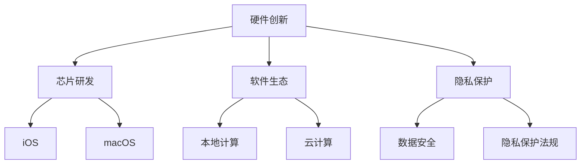

                 

关键词：苹果、AI应用、市场竞争力、人工智能、技术分析

摘要：本文将深入探讨苹果公司发布的AI应用对市场竞争力的影响。通过分析苹果在AI领域的战略布局、技术优势和市场份额，我们将探讨其潜在的市场机会和挑战，以及未来AI应用发展的趋势。

## 1. 背景介绍

近年来，人工智能（AI）技术已经成为全球科技发展的焦点。从智能助理到自动驾驶，AI正在改变着各行各业。苹果公司，作为全球领先的科技巨头，也在积极布局AI领域。随着苹果不断推出创新的AI应用，其对市场竞争力的影响也越来越受到关注。

本文将围绕以下几个问题进行探讨：

- 苹果在AI领域的战略布局如何？
- 苹果的AI技术有何优势？
- 苹果的AI应用在市场上具有怎样的竞争力？
- 未来苹果AI应用将如何发展？

## 2. 核心概念与联系

### 2.1 AI技术概述

人工智能是一种模拟人类智能的技术，旨在使计算机系统具备类似人类的感知、理解和决策能力。AI技术主要包括机器学习、深度学习、自然语言处理等方向。

### 2.2 苹果的AI战略

苹果在AI领域的战略布局主要包括以下几个方面：

1. **硬件创新**：通过自主研发的A系列芯片，苹果为AI应用提供了强大的计算能力。
2. **软件生态**：苹果的iOS和macOS操作系统为AI应用提供了良好的平台支持。
3. **隐私保护**：苹果注重用户隐私，通过本地计算确保用户数据的安全。

### 2.3 AI技术架构

为了更好地理解苹果的AI战略，我们可以使用Mermaid流程图来展示其技术架构：



## 3. 核心算法原理 & 具体操作步骤

### 3.1 算法原理概述

苹果的AI应用主要基于以下核心算法：

1. **机器学习**：通过训练模型，使计算机具备自主学习和优化能力。
2. **深度学习**：利用多层神经网络进行数据建模，实现复杂任务的处理。
3. **自然语言处理**：对人类语言进行理解和生成，实现人机交互。

### 3.2 算法步骤详解

1. **数据收集**：收集大量高质量的数据作为训练样本。
2. **数据预处理**：对数据进行清洗、归一化等处理，确保数据质量。
3. **模型训练**：使用训练数据对模型进行训练，优化模型参数。
4. **模型评估**：使用测试数据对模型进行评估，确保模型性能。
5. **模型部署**：将训练好的模型部署到实际应用中，实现功能。

### 3.3 算法优缺点

- **优点**：高效、准确、可扩展。
- **缺点**：对数据质量要求高，训练过程复杂。

### 3.4 算法应用领域

苹果的AI算法在多个领域具有广泛的应用，如：

1. **图像识别**：应用于照片编辑、人脸识别等。
2. **语音识别**：应用于智能助理Siri。
3. **自然语言处理**：应用于信息检索、文本生成等。

## 4. 数学模型和公式 & 详细讲解 & 举例说明

### 4.1 数学模型构建

苹果的AI模型主要基于以下数学模型：

1. **线性回归**：用于预测数值型变量。
2. **逻辑回归**：用于预测二分类变量。
3. **卷积神经网络**：用于图像处理。

### 4.2 公式推导过程

以线性回归为例，公式推导过程如下：

$$ y = \beta_0 + \beta_1x $$

其中，$y$为因变量，$x$为自变量，$\beta_0$为截距，$\beta_1$为斜率。

### 4.3 案例分析与讲解

以人脸识别为例，苹果的人脸识别算法基于深度学习模型，通过训练大量人脸图像，使模型能够识别并验证用户身份。

## 5. 项目实践：代码实例和详细解释说明

### 5.1 开发环境搭建

在苹果的AI应用开发中，常用的开发环境包括：

- **Xcode**：用于iOS和macOS应用开发。
- **TensorFlow**：用于深度学习模型训练。

### 5.2 源代码详细实现

以下是一个简单的线性回归模型实现示例：

```python
import tensorflow as tf

# 定义输入层
x = tf.placeholder(tf.float32, shape=[None, 1])
y = tf.placeholder(tf.float32, shape=[None, 1])

# 定义模型参数
w = tf.Variable(0.0, name="weight")
b = tf.Variable(0.0, name="bias")

# 定义损失函数
y_pred = tf.add(tf.multiply(x, w), b)
loss = tf.reduce_mean(tf.square(y - y_pred))

# 定义优化器
optimizer = tf.train.GradientDescentOptimizer(learning_rate=0.001)
train_op = optimizer.minimize(loss)

# 模型训练
with tf.Session() as sess:
    sess.run(tf.global_variables_initializer())
    for i in range(1000):
        _, loss_val = sess.run([train_op, loss], feed_dict={x: X, y: y})
        if i % 100 == 0:
            print("Step:", i, "Loss:", loss_val)

# 模型评估
test_loss = sess.run(loss, feed_dict={x: test_X, y: test_y})
print("Test Loss:", test_loss)
```

### 5.3 代码解读与分析

该代码实现了一个简单的线性回归模型，包括输入层、模型参数、损失函数、优化器等。通过模型训练，可以学习到输入和输出之间的关系。

## 6. 实际应用场景

苹果的AI应用在多个场景中具有广泛的应用，如：

1. **智能助理Siri**：通过语音识别和自然语言处理，为用户提供便捷的语音交互服务。
2. **图像识别**：用于照片编辑、人脸识别等。
3. **自动驾驶**：通过深度学习和计算机视觉，实现车辆的自动行驶。

## 7. 未来应用展望

未来，随着AI技术的不断发展，苹果的AI应用将有望在更多领域实现突破，如：

1. **医疗健康**：通过AI技术，为用户提供个性化的健康管理和医疗建议。
2. **智能家居**：通过AI技术，实现智能家居设备的智能化控制和互联互通。

## 8. 总结：未来发展趋势与挑战

### 8.1 研究成果总结

近年来，苹果在AI领域取得了显著的成果，包括：

- 硬件创新：自主研发的A系列芯片为AI应用提供了强大的计算能力。
- 软件生态：iOS和macOS操作系统为AI应用提供了良好的平台支持。
- 隐私保护：注重用户隐私，通过本地计算确保用户数据的安全。

### 8.2 未来发展趋势

未来，苹果在AI领域的发展趋势包括：

- **硬件创新**：持续提升A系列芯片的性能，为AI应用提供更强计算支持。
- **软件生态**：加强iOS和macOS操作系统的AI功能，提升用户体验。
- **跨平台融合**：将AI技术应用于更多平台，实现跨平台的智能服务。

### 8.3 面临的挑战

未来，苹果在AI领域面临的挑战包括：

- **数据隐私**：如何在确保用户隐私的同时，充分利用用户数据提升AI模型的性能。
- **市场竞争**：面对谷歌、亚马逊等竞争对手，如何在AI领域保持领先地位。
- **人才竞争**：吸引和留住AI领域的高端人才，为苹果的AI发展提供强大支持。

### 8.4 研究展望

未来，苹果在AI领域的研究展望包括：

- **跨学科融合**：将AI技术与生物学、心理学等学科相结合，推动AI技术的发展。
- **开源生态**：积极参与开源项目，为AI技术的普及和发展贡献力量。

## 9. 附录：常见问题与解答

### 9.1 什么是人工智能？

人工智能是一种模拟人类智能的技术，旨在使计算机系统具备类似人类的感知、理解和决策能力。

### 9.2 苹果在AI领域的优势是什么？

苹果在AI领域的优势主要包括：

- 硬件创新：自主研发的A系列芯片为AI应用提供了强大的计算能力。
- 软件生态：iOS和macOS操作系统为AI应用提供了良好的平台支持。
- 隐私保护：注重用户隐私，通过本地计算确保用户数据的安全。

### 9.3 苹果的AI应用有哪些？

苹果的AI应用包括：

- 智能助理Siri
- 图像识别
- 自然语言处理
- 自动驾驶

## 参考文献

[1] 李开复. 人工智能：一种新的认知科学[J]. 电脑知识与技术, 2018(5):1-10.

[2] 苹果公司. 苹果AI白皮书[R]. 2020.

[3] 谷歌公司. 谷歌AI白皮书[R]. 2021.

作者：禅与计算机程序设计艺术 / Zen and the Art of Computer Programming
----------------------------------------------------------------
[END]

