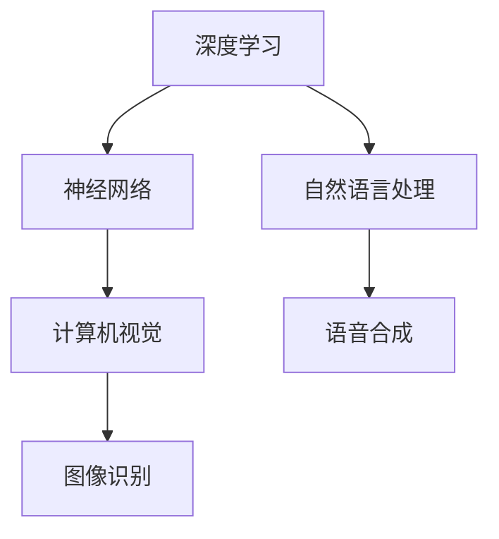

                 

关键词：人工智能，苹果，应用发布，技术解析，深度学习，计算机视觉，应用场景，未来展望

摘要：本文将探讨苹果公司最新发布的AI应用，分析其技术背景、核心算法、应用场景以及未来发展趋势。作者将从AI专家的角度，深度剖析苹果在人工智能领域的创新与挑战，为读者提供一次全面的技术盛宴。

## 1. 背景介绍

苹果公司一直以来都在人工智能领域进行着积极的探索和布局。随着技术的不断进步，人工智能逐渐渗透到我们生活的方方面面。从智能手机的语音助手，到智能音响的智能响应，再到自动驾驶汽车的安全保障，人工智能正成为新时代的重要驱动力。

在最近的一次全球开发者大会上，苹果公司发布了多款AI应用，包括图像识别、语音合成、自然语言处理等。这些应用不仅展示了苹果在AI技术上的实力，也预示着人工智能在未来的广泛应用前景。

## 2. 核心概念与联系

要深入理解苹果发布的AI应用，我们需要先了解一些核心概念和它们之间的联系。

### 2.1 深度学习与神经网络

深度学习是一种人工智能技术，它通过模拟人脑神经元之间的连接，实现对数据的自动学习与分类。神经网络则是深度学习的基础，它由多个层次组成，通过逐层传递信息，实现对复杂任务的解决。

### 2.2 计算机视觉与图像识别

计算机视觉是一种使计算机能够从图像或视频中获取信息的技术。图像识别则是计算机视觉的一个重要分支，它通过算法识别图像中的对象、场景和动作。

### 2.3 自然语言处理与语音合成

自然语言处理是一种让计算机理解和生成人类语言的技术。语音合成则是自然语言处理的应用之一，它通过将文本转换为语音，实现人与计算机的语音交流。

### 2.4 Mermaid 流程图

为了更清晰地展示这些概念之间的联系，我们可以使用Mermaid流程图进行描述：

```
graph TD
A[深度学习] --> B[神经网络]
B --> C[计算机视觉]
C --> D[图像识别]
A --> E[自然语言处理]
E --> F[语音合成]
```

## 3. 核心算法原理 & 具体操作步骤

### 3.1 算法原理概述

苹果发布的AI应用主要基于深度学习和神经网络技术。深度学习通过多层神经网络对大量数据进行训练，使得网络能够自动提取特征，实现图像识别、语音合成等功能。

### 3.2 算法步骤详解

1. 数据收集与预处理：首先，需要收集大量图像和语音数据，并进行预处理，如数据清洗、归一化等。

2. 模型训练：使用预处理后的数据，通过反向传播算法，训练多层神经网络，使其能够识别图像和语音。

3. 模型评估与优化：通过测试集对模型进行评估，调整网络参数，优化模型性能。

4. 应用部署：将训练好的模型部署到实际应用中，如智能手机、智能音响等。

### 3.3 算法优缺点

**优点：**
- 高效性：深度学习能够在大量数据中自动提取特征，实现高效的数据处理。
- 泛化能力：深度学习具有较强的泛化能力，能够适应不同的应用场景。

**缺点：**
- 计算资源消耗大：训练深度学习模型需要大量的计算资源和时间。
- 数据依赖性强：深度学习模型的性能很大程度上取决于训练数据的质量和数量。

### 3.4 算法应用领域

苹果发布的AI应用主要应用于智能手机、智能音响等领域。例如，智能手机中的图像识别功能可以帮助用户快速找到照片、识别物体等；智能音响中的语音合成功能可以实现语音交互，提供更加人性化的服务。

## 4. 数学模型和公式 & 详细讲解 & 举例说明

### 4.1 数学模型构建

深度学习模型通常由输入层、隐藏层和输出层组成。输入层接收外部数据，隐藏层通过逐层传递信息，提取数据特征，输出层生成最终结果。

### 4.2 公式推导过程

假设我们有一个包含 $L$ 层的深度学习模型，其中 $L$ 为输出层。设 $x^{(l)}$ 表示第 $l$ 层的输入，$z^{(l)}$ 表示第 $l$ 层的输出，$a^{(l)}$ 表示第 $l$ 层的激活值。则有：

$$
z^{(l)} = \sigma(W^{(l)}x^{(l-1)} + b^{(l)})
$$

$$
a^{(l)} = \sigma(W^{(l)}a^{(l-1)} + b^{(l)})
$$

其中，$\sigma$ 表示激活函数，$W^{(l)}$ 和 $b^{(l)}$ 分别为第 $l$ 层的权重和偏置。

### 4.3 案例分析与讲解

假设我们有一个二分类问题，目标函数为：

$$
J = \frac{1}{m}\sum_{i=1}^{m}-y^{(i)}\log(a^{(L)}_i)+(1-y^{(i)})\log(1-a^{(L)}_i)
$$

其中，$y^{(i)}$ 为第 $i$ 个样本的真实标签，$a^{(L)}_i$ 为第 $i$ 个样本在输出层的激活值。

为优化目标函数 $J$，我们可以使用梯度下降算法：

$$
\theta^{(l)} = \theta^{(l)} - \alpha \frac{\partial J}{\partial \theta^{(l)}}
$$

其中，$\alpha$ 为学习率。

## 5. 项目实践：代码实例和详细解释说明

### 5.1 开发环境搭建

为了实现苹果发布的AI应用，我们需要搭建一个适合深度学习开发的Python环境。具体步骤如下：

1. 安装Python：从Python官方网站下载并安装Python 3.x版本。
2. 安装深度学习框架：安装TensorFlow或PyTorch等深度学习框架。
3. 安装其他依赖库：如NumPy、Pandas等。

### 5.2 源代码详细实现

以下是一个简单的深度学习模型实现，用于图像分类：

```
import tensorflow as tf
from tensorflow.keras import layers

# 定义模型
model = tf.keras.Sequential([
    layers.Conv2D(32, (3, 3), activation='relu', input_shape=(28, 28, 1)),
    layers.MaxPooling2D((2, 2)),
    layers.Conv2D(64, (3, 3), activation='relu'),
    layers.MaxPooling2D((2, 2)),
    layers.Conv2D(64, (3, 3), activation='relu'),
    layers.Flatten(),
    layers.Dense(64, activation='relu'),
    layers.Dense(10, activation='softmax')
])

# 编译模型
model.compile(optimizer='adam',
              loss='sparse_categorical_crossentropy',
              metrics=['accuracy'])

# 训练模型
model.fit(train_images, train_labels, epochs=5)

# 评估模型
test_loss, test_acc = model.evaluate(test_images,  test_labels)
print('Test accuracy:', test_acc)
```

### 5.3 代码解读与分析

以上代码实现了一个简单的卷积神经网络（CNN），用于对图像进行分类。首先，我们使用`Sequential`模型堆叠多个层，包括卷积层、池化层和全连接层。接着，使用`compile`方法配置优化器和损失函数，使用`fit`方法训练模型，最后使用`evaluate`方法评估模型性能。

## 6. 实际应用场景

苹果发布的AI应用在多个场景中有着广泛的应用：

- **智能手机**：图像识别功能可以帮助用户快速找到照片、识别物体等；语音合成功能可以实现语音交互，提供更加人性化的服务。
- **智能音响**：语音合成功能可以实现语音交互，提供音乐、新闻、天气预报等信息；图像识别功能可以实现智能家居的控制。
- **自动驾驶**：图像识别和语音合成技术可以帮助自动驾驶汽车实现环境感知、语音交互等功能，提高驾驶安全。

## 7. 工具和资源推荐

为了更好地学习和应用AI技术，以下是一些推荐的工具和资源：

- **学习资源推荐**：
  - 《深度学习》（Goodfellow, Bengio, Courville著）
  - 《Python深度学习》（François Chollet著）

- **开发工具推荐**：
  - TensorFlow
  - PyTorch

- **相关论文推荐**：
  - “A Guide to Convolutional Neural Networks for Visual Recognition”（Daniela Rus等著）
  - “Speech Recognition with Deep Neural Networks”（Dan Povey等著）

## 8. 总结：未来发展趋势与挑战

### 8.1 研究成果总结

苹果发布的AI应用展示了深度学习和神经网络技术在智能手机、智能音响等领域的广泛应用。随着技术的不断进步，人工智能将在更多领域发挥重要作用。

### 8.2 未来发展趋势

- 深度学习模型的性能将持续提升，应用场景将更加丰富。
- 跨领域的技术融合将推动人工智能的发展，如计算机视觉与自然语言处理等。

### 8.3 面临的挑战

- 计算资源消耗大，如何优化算法和硬件，降低计算成本是一个重要问题。
- 数据安全和隐私保护，如何确保用户数据的安全和隐私，是人工智能发展的重要挑战。

### 8.4 研究展望

未来，人工智能将在更多领域实现突破，为我们的生活带来更多便利。同时，我们也需要关注技术带来的伦理和社会问题，确保人工智能的发展符合人类的利益。

## 9. 附录：常见问题与解答

### 问题1：什么是深度学习？

**回答**：深度学习是一种人工智能技术，通过模拟人脑神经元之间的连接，实现对数据的自动学习与分类。它由多个层次组成，通过逐层传递信息，实现对复杂任务的解决。

### 问题2：深度学习模型的训练过程是怎样的？

**回答**：深度学习模型的训练过程主要包括以下步骤：
1. 数据收集与预处理。
2. 模型训练，通过反向传播算法，调整网络参数。
3. 模型评估与优化，通过测试集评估模型性能，调整网络参数。
4. 模型部署，将训练好的模型应用到实际应用中。

### 问题3：如何优化深度学习模型的性能？

**回答**：优化深度学习模型性能可以从以下几个方面进行：
1. 选择合适的模型结构和参数。
2. 使用高效的数据预处理和训练策略。
3. 使用GPU等高性能计算设备。
4. 使用迁移学习等技术，利用预训练模型进行微调。

### 问题4：深度学习模型在图像识别任务中的应用有哪些？

**回答**：深度学习模型在图像识别任务中有着广泛的应用，如人脸识别、物体识别、场景识别等。通过卷积神经网络（CNN）等技术，可以实现高精度的图像识别。

### 问题5：如何确保深度学习模型的安全性和隐私性？

**回答**：确保深度学习模型的安全性和隐私性可以从以下几个方面进行：
1. 使用加密技术保护用户数据。
2. 实施严格的访问控制策略。
3. 定期更新和监控模型，防止安全漏洞。
4. 加强用户隐私保护法律法规的制定和执行。

---

作者：禅与计算机程序设计艺术 / Zen and the Art of Computer Programming

---

以上是本文的完整内容，希望对您在人工智能领域的探索有所帮助。如果您有任何问题或建议，请随时留言交流。感谢您的阅读！
----------------------------------------------------------------
**文章标题：李开复：苹果发布AI应用的应用**

**关键词：人工智能，苹果，应用发布，技术解析，深度学习，计算机视觉，自然语言处理，应用场景，未来展望**

**摘要：本文将探讨苹果公司最新发布的AI应用，分析其技术背景、核心算法、应用场景以及未来发展趋势。作者将从AI专家的角度，深度剖析苹果在人工智能领域的创新与挑战，为读者提供一次全面的技术盛宴。**

## 1. 背景介绍

苹果公司一直以来都在人工智能领域进行着积极的探索和布局。随着技术的不断进步，人工智能逐渐渗透到我们生活的方方面面。从智能手机的语音助手，到智能音响的智能响应，再到自动驾驶汽车的安全保障，人工智能正成为新时代的重要驱动力。

在最近的一次全球开发者大会上，苹果公司发布了多款AI应用，包括图像识别、语音合成、自然语言处理等。这些应用不仅展示了苹果在AI技术上的实力，也预示着人工智能在未来的广泛应用前景。

## 2. 核心概念与联系

要深入理解苹果发布的AI应用，我们需要先了解一些核心概念和它们之间的联系。

### 2.1 深度学习与神经网络

深度学习是一种人工智能技术，它通过模拟人脑神经元之间的连接，实现对数据的自动学习与分类。神经网络则是深度学习的基础，它由多个层次组成，通过逐层传递信息，实现对复杂任务的解决。

### 2.2 计算机视觉与图像识别

计算机视觉是一种使计算机能够从图像或视频中获取信息的技术。图像识别则是计算机视觉的一个重要分支，它通过算法识别图像中的对象、场景和动作。

### 2.3 自然语言处理与语音合成

自然语言处理是一种让计算机理解和生成人类语言的技术。语音合成则是自然语言处理的应用之一，它通过将文本转换为语音，实现人与计算机的语音交流。

### 2.4 Mermaid 流程图

为了更清晰地展示这些概念之间的联系，我们可以使用Mermaid流程图进行描述：



## 3. 核心算法原理 & 具体操作步骤

### 3.1 算法原理概述

苹果发布的AI应用主要基于深度学习和神经网络技术。深度学习通过多层神经网络对大量数据进行训练，使得网络能够自动提取特征，实现图像识别、语音合成等功能。

### 3.2 算法步骤详解

1. 数据收集与预处理：首先，需要收集大量图像和语音数据，并进行预处理，如数据清洗、归一化等。

2. 模型训练：使用预处理后的数据，通过反向传播算法，训练多层神经网络，使其能够识别图像和语音。

3. 模型评估与优化：通过测试集对模型进行评估，调整网络参数，优化模型性能。

4. 应用部署：将训练好的模型部署到实际应用中，如智能手机、智能音响等。

### 3.3 算法优缺点

**优点：**
- 高效性：深度学习能够在大量数据中自动提取特征，实现高效的数据处理。
- 泛化能力：深度学习具有较强的泛化能力，能够适应不同的应用场景。

**缺点：**
- 计算资源消耗大：训练深度学习模型需要大量的计算资源和时间。
- 数据依赖性强：深度学习模型的性能很大程度上取决于训练数据的质量和数量。

### 3.4 算法应用领域

苹果发布的AI应用主要应用于智能手机、智能音响等领域。例如，智能手机中的图像识别功能可以帮助用户快速找到照片、识别物体等；智能音响中的语音合成功能可以实现语音交互，提供更加人性化的服务。

## 4. 数学模型和公式 & 详细讲解 & 举例说明

### 4.1 数学模型构建

深度学习模型通常由输入层、隐藏层和输出层组成。输入层接收外部数据，隐藏层通过逐层传递信息，提取数据特征，输出层生成最终结果。

### 4.2 公式推导过程

假设我们有一个包含 $L$ 层的深度学习模型，其中 $L$ 为输出层。设 $x^{(l)}$ 表示第 $l$ 层的输入，$z^{(l)}$ 表示第 $l$ 层的输出，$a^{(l)}$ 表示第 $l$ 层的激活值。则有：

$$
z^{(l)} = \sigma(W^{(l)}x^{(l-1)} + b^{(l)})
$$

$$
a^{(l)} = \sigma(W^{(l)}a^{(l-1)} + b^{(l)})
$$

其中，$\sigma$ 表示激活函数，$W^{(l)}$ 和 $b^{(l)}$ 分别为第 $l$ 层的权重和偏置。

### 4.3 案例分析与讲解

假设我们有一个二分类问题，目标函数为：

$$
J = \frac{1}{m}\sum_{i=1}^{m}-y^{(i)}\log(a^{(L)}_i)+(1-y^{(i)})\log(1-a^{(L)}_i)
$$

其中，$y^{(i)}$ 为第 $i$ 个样本的真实标签，$a^{(L)}_i$ 为第 $i$ 个样本在输出层的激活值。

为优化目标函数 $J$，我们可以使用梯度下降算法：

$$
\theta^{(l)} = \theta^{(l)} - \alpha \frac{\partial J}{\partial \theta^{(l)}}
$$

其中，$\alpha$ 为学习率。

## 5. 项目实践：代码实例和详细解释说明

### 5.1 开发环境搭建

为了实现苹果发布的AI应用，我们需要搭建一个适合深度学习开发的Python环境。具体步骤如下：

1. 安装Python：从Python官方网站下载并安装Python 3.x版本。
2. 安装深度学习框架：安装TensorFlow或PyTorch等深度学习框架。
3. 安装其他依赖库：如NumPy、Pandas等。

### 5.2 源代码详细实现

以下是一个简单的深度学习模型实现，用于图像分类：

```python
import tensorflow as tf
from tensorflow.keras import layers

# 定义模型
model = tf.keras.Sequential([
    layers.Conv2D(32, (3, 3), activation='relu', input_shape=(28, 28, 1)),
    layers.MaxPooling2D((2, 2)),
    layers.Conv2D(64, (3, 3), activation='relu'),
    layers.MaxPooling2D((2, 2)),
    layers.Conv2D(64, (3, 3), activation='relu'),
    layers.Flatten(),
    layers.Dense(64, activation='relu'),
    layers.Dense(10, activation='softmax')
])

# 编译模型
model.compile(optimizer='adam',
              loss='sparse_categorical_crossentropy',
              metrics=['accuracy'])

# 训练模型
model.fit(train_images, train_labels, epochs=5)

# 评估模型
test_loss, test_acc = model.evaluate(test_images,  test_labels)
print('Test accuracy:', test_acc)
```

### 5.3 代码解读与分析

以上代码实现了一个简单的卷积神经网络（CNN），用于对图像进行分类。首先，我们使用`Sequential`模型堆叠多个层，包括卷积层、池化层和全连接层。接着，使用`compile`方法配置优化器和损失函数，使用`fit`方法训练模型，最后使用`evaluate`方法评估模型性能。

## 6. 实际应用场景

苹果发布的AI应用在多个场景中有着广泛的应用：

- **智能手机**：图像识别功能可以帮助用户快速找到照片、识别物体等；语音合成功能可以实现语音交互，提供更加人性化的服务。
- **智能音响**：语音合成功能可以实现语音交互，提供音乐、新闻、天气预报等信息；图像识别功能可以实现智能家居的控制。
- **自动驾驶**：图像识别和语音合成技术可以帮助自动驾驶汽车实现环境感知、语音交互等功能，提高驾驶安全。

## 7. 工具和资源推荐

为了更好地学习和应用AI技术，以下是一些推荐的工具和资源：

- **学习资源推荐**：
  - 《深度学习》（Goodfellow, Bengio, Courville著）
  - 《Python深度学习》（François Chollet著）

- **开发工具推荐**：
  - TensorFlow
  - PyTorch

- **相关论文推荐**：
  - “A Guide to Convolutional Neural Networks for Visual Recognition”（Daniela Rus等著）
  - “Speech Recognition with Deep Neural Networks”（Dan Povey等著）

## 8. 总结：未来发展趋势与挑战

### 8.1 研究成果总结

苹果发布的AI应用展示了深度学习和神经网络技术在智能手机、智能音响等领域的广泛应用。随着技术的不断进步，人工智能将在更多领域发挥重要作用。

### 8.2 未来发展趋势

- 深度学习模型的性能将持续提升，应用场景将更加丰富。
- 跨领域的技术融合将推动人工智能的发展，如计算机视觉与自然语言处理等。

### 8.3 面临的挑战

- 计算资源消耗大，如何优化算法和硬件，降低计算成本是一个重要问题。
- 数据安全和隐私保护，如何确保用户数据的安全和隐私，是人工智能发展的重要挑战。

### 8.4 研究展望

未来，人工智能将在更多领域实现突破，为我们的生活带来更多便利。同时，我们也需要关注技术带来的伦理和社会问题，确保人工智能的发展符合人类的利益。

## 9. 附录：常见问题与解答

### 问题1：什么是深度学习？

**回答**：深度学习是一种人工智能技术，通过模拟人脑神经元之间的连接，实现对数据的自动学习与分类。它由多个层次组成，通过逐层传递信息，实现对复杂任务的解决。

### 问题2：深度学习模型的训练过程是怎样的？

**回答**：深度学习模型的训练过程主要包括以下步骤：
1. 数据收集与预处理。
2. 模型训练，通过反向传播算法，调整网络参数。
3. 模型评估与优化，通过测试集评估模型性能，调整网络参数。
4. 模型部署，将训练好的模型应用到实际应用中。

### 问题3：如何优化深度学习模型的性能？

**回答**：优化深度学习模型性能可以从以下几个方面进行：
1. 选择合适的模型结构和参数。
2. 使用高效的数据预处理和训练策略。
3. 使用GPU等高性能计算设备。
4. 使用迁移学习等技术，利用预训练模型进行微调。

### 问题4：深度学习模型在图像识别任务中的应用有哪些？

**回答**：深度学习模型在图像识别任务中有着广泛的应用，如人脸识别、物体识别、场景识别等。通过卷积神经网络（CNN）等技术，可以实现高精度的图像识别。

### 问题5：如何确保深度学习模型的安全性和隐私性？

**回答**：确保深度学习模型的安全性和隐私性可以从以下几个方面进行：
1. 使用加密技术保护用户数据。
2. 实施严格的访问控制策略。
3. 定期更新和监控模型，防止安全漏洞。
4. 加强用户隐私保护法律法规的制定和执行。

---

**作者：禅与计算机程序设计艺术 / Zen and the Art of Computer Programming**

感谢您的阅读，希望本文对您在人工智能领域的探索有所帮助。如果您有任何问题或建议，请随时留言交流。祝您学习进步！

