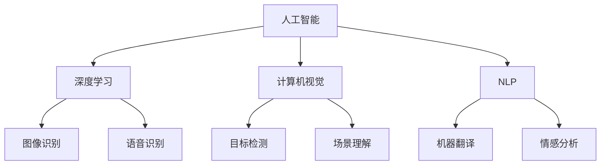

                 

关键词：李开复、苹果、AI应用、未来展望、技术博客

摘要：本文将围绕李开复对未来人工智能（AI）应用的展望，深入探讨苹果在AI领域的最新动态，及其对科技产业和日常生活的影响。通过分析苹果发布的AI应用，本文将阐述AI技术在不同领域的应用前景，并对未来发展趋势和挑战进行展望。

## 1. 背景介绍

人工智能技术近年来取得了飞速发展，从自动驾驶、智能家居到医疗健康、金融投资，AI应用已经渗透到我们生活的方方面面。李开复作为世界知名的人工智能专家，其对AI发展的见解和预测备受关注。苹果公司，作为全球领先的科技企业，也在不断探索和布局AI领域。本文旨在分析苹果发布的AI应用，结合李开复的观点，探讨AI在未来科技发展和生活中的重要性。

### 1.1 李开复与人工智能

李开复，计算机科学博士，曾在微软、Google等国际知名公司担任重要职位。他被誉为“AI之父”，对人工智能的发展有着深刻的理解和独特的见解。李开复在其著作中多次预测AI技术的未来趋势，强调AI将在人类生活中扮演越来越重要的角色。

### 1.2 苹果公司的AI布局

苹果公司一直致力于将AI技术应用到其产品中，从早期的Siri语音助手到最新的Face ID、Animoji等，苹果在AI领域的探索从未停止。随着AI技术的不断进步，苹果也在逐步扩大其在AI领域的业务布局，包括自动驾驶、智能语音识别、计算机视觉等。

## 2. 核心概念与联系

为了更好地理解苹果发布的AI应用，我们需要先了解一些核心概念和其相互之间的联系。

### 2.1 人工智能（AI）

人工智能是指计算机系统模拟人类智能行为的技术，包括学习、推理、感知、决策等。AI可以分为两大类：基于规则的系统和基于数据的学习系统。基于规则的系统依赖于预先设定的规则，而基于数据的学习系统则通过大量数据进行自我学习。

### 2.2 深度学习（Deep Learning）

深度学习是人工智能的一个重要分支，它使用多层神经网络模拟人类大脑的学习过程。深度学习在图像识别、语音识别、自然语言处理等领域取得了显著的成果。

### 2.3 计算机视觉（Computer Vision）

计算机视觉是指使计算机具备人类视觉系统功能的技术，包括图像识别、目标检测、场景理解等。计算机视觉在自动驾驶、安防监控、医疗诊断等领域有着广泛的应用。

### 2.4 自然语言处理（Natural Language Processing，NLP）

自然语言处理是指使计算机理解和处理人类语言的技术，包括语音识别、机器翻译、情感分析等。NLP在智能客服、智能助手、内容审核等领域具有重要应用。

### 2.5 Mermaid 流程图

以下是一个简单的Mermaid流程图，展示了这些核心概念之间的联系：



## 3. 核心算法原理 & 具体操作步骤

### 3.1 算法原理概述

苹果公司在AI应用中采用了多种核心算法，主要包括深度学习、计算机视觉和自然语言处理。以下将分别介绍这些算法的基本原理。

### 3.2 算法步骤详解

#### 3.2.1 深度学习

深度学习的基本原理是通过多层神经网络模拟人类大脑的学习过程。具体步骤如下：

1. **数据预处理**：对图像、语音或文本数据等进行预处理，包括归一化、缩放等。
2. **构建神经网络**：设计多层神经网络，包括输入层、隐藏层和输出层。
3. **训练神经网络**：使用大量数据对神经网络进行训练，不断调整网络参数，使网络能够准确预测输出。
4. **评估和优化**：通过测试数据评估网络性能，对网络进行优化，以提高准确率和鲁棒性。

#### 3.2.2 计算机视觉

计算机视觉的基本原理是通过图像处理和模式识别技术，使计算机能够理解和解释图像。具体步骤如下：

1. **图像预处理**：对图像进行增强、去噪、分割等预处理操作。
2. **特征提取**：从预处理后的图像中提取关键特征，如边缘、纹理、颜色等。
3. **目标检测**：使用深度学习算法（如卷积神经网络）对图像中的目标进行检测和定位。
4. **场景理解**：根据检测结果，对场景进行理解和分类，如车辆检测、行人检测等。

#### 3.2.3 自然语言处理

自然语言处理的基本原理是通过机器学习算法，使计算机能够理解和处理人类语言。具体步骤如下：

1. **语音识别**：将语音信号转换为文本，如使用深度神经网络进行声学模型和语言模型的训练。
2. **文本预处理**：对文本进行分词、去停用词、词性标注等预处理操作。
3. **情感分析**：使用深度学习算法对文本进行情感分类，如使用卷积神经网络进行情感分析。
4. **机器翻译**：使用深度学习算法进行文本翻译，如使用序列到序列模型进行翻译。

### 3.3 算法优缺点

深度学习具有强大的模型表达能力和自学习能力，但需要大量数据和计算资源。计算机视觉在图像识别和目标检测方面具有高精度和高效率，但在复杂场景下存在一定局限。自然语言处理在语音识别和文本分析方面取得了显著成果，但在理解和生成自然语言方面仍有待提高。

### 3.4 算法应用领域

深度学习在图像识别、语音识别、自然语言处理等领域有广泛应用。计算机视觉在自动驾驶、安防监控、医疗诊断等领域具有重要应用。自然语言处理在智能客服、智能助手、内容审核等领域发挥着关键作用。

## 4. 数学模型和公式 & 详细讲解 & 举例说明

### 4.1 数学模型构建

在深度学习、计算机视觉和自然语言处理领域，数学模型扮演着重要角色。以下是一个简单的数学模型构建过程。

#### 4.1.1 深度学习模型

假设我们使用多层神经网络进行图像分类，神经网络包含输入层、隐藏层和输出层。输入层有n个神经元，隐藏层有m个神经元，输出层有k个神经元。神经元的激活函数为ReLU（Rectified Linear Unit）。

1. **输入层到隐藏层**：
$$
z_i^h = \sum_{j=1}^{m} w_{ij}x_j + b_i
$$
$$
a_i^h = \max(0, z_i^h)
$$

2. **隐藏层到输出层**：
$$
z_k^o = \sum_{i=1}^{k} w_{ik}a_i^h + b_k
$$
$$
\hat{y} = \text{softmax}(\text{softmax}(z_k^o))
$$

其中，$x_j$表示输入层的第j个神经元，$w_{ij}$和$b_i$分别表示连接权重和偏置。

#### 4.1.2 计算机视觉模型

计算机视觉模型通常使用卷积神经网络（Convolutional Neural Network，CNN）进行图像处理。以下是一个简单的CNN模型。

1. **卷积层**：
$$
h_{ij}^l = \sum_{k=1}^{C_l} w_{ijk}x_{kl} + b_i
$$
$$
a_{ij}^l = f(h_{ij}^l)
$$

其中，$x_{kl}$表示输入图像的第k个特征图，$w_{ijk}$和$b_i$分别表示卷积核和偏置。

2. **池化层**：
$$
p_{ij}^l = \max_{(i',j') \in \text{region}} a_{i'j'}^l
$$

其中，region表示池化区域。

#### 4.1.3 自然语言处理模型

自然语言处理模型通常使用循环神经网络（Recurrent Neural Network，RNN）或其变体（如LSTM、GRU）进行文本处理。以下是一个简单的RNN模型。

1. **输入层到隐藏层**：
$$
h_t^l = \text{tanh}(W_{hl}x_t + U_{hl}h_{t-1}^l + b_l)
$$

2. **隐藏层到输出层**：
$$
\hat{y}_t = \text{softmax}(W_{yl}h_t^l + b_y)
$$

其中，$x_t$表示输入层的第t个词向量，$h_t^l$表示隐藏层第l层的第t个神经元。

### 4.2 公式推导过程

#### 4.2.1 深度学习模型

假设我们使用反向传播算法（Backpropagation）优化神经网络。首先，计算输出层的误差：
$$
\delta_k^o = \hat{y}_k - y_k
$$
其中，$\hat{y}_k$和$y_k$分别表示输出层的预测概率和实际标签。

然后，计算隐藏层的误差：
$$
\delta_l^h = \delta_{l+1}^{o} \cdot (1 - \text{sigmoid}(z_{l+1}^o)) \cdot \text{sigmoid}(z_{l}^h)
$$

接下来，计算权重和偏置的梯度：
$$
\frac{\partial C}{\partial w_{ik}^{l}} = \delta_k^o \cdot a_i^h
$$
$$
\frac{\partial C}{\partial b_{i}^{l}} = \delta_k^o
$$

其中，$C$表示损失函数。

#### 4.2.2 计算机视觉模型

卷积神经网络中的权重和偏置梯度可以通过反向传播算法计算。假设损失函数为均方误差（Mean Squared Error，MSE），则：

1. **卷积层**：
$$
\frac{\partial C}{\partial w_{ijk}^{l}} = \delta_k^l \cdot a_{ij}^{l-1}
$$
$$
\frac{\partial C}{\partial b_{i}^{l}} = \delta_k^l
$$

2. **池化层**：
$$
\frac{\partial C}{\partial a_{ij}^{l}} = \frac{\partial C}{\partial p_{ij}^{l}} \cdot \text{sign}(p_{ij}^{l} - \max_{(i',j') \in \text{region}} a_{i'j'}^{l})
$$

#### 4.2.3 自然语言处理模型

循环神经网络中的权重和偏置梯度可以通过反向传播算法计算。假设损失函数为交叉熵（Cross Entropy），则：

1. **输入层到隐藏层**：
$$
\frac{\partial C}{\partial W_{hl}} = \delta_l^h \cdot x_t
$$
$$
\frac{\partial C}{\partial U_{hl}} = \delta_l^h \cdot h_{t-1}^l
$$
$$
\frac{\partial C}{\partial b_{l}} = \delta_l^h
$$

2. **隐藏层到输出层**：
$$
\frac{\partial C}{\partial W_{yl}} = \delta_o^l
$$
$$
\frac{\partial C}{\partial b_{y}} = \delta_o^l
$$

### 4.3 案例分析与讲解

以下是一个简单的案例，说明如何使用深度学习模型进行图像分类。

#### 4.3.1 数据集准备

我们使用CIFAR-10数据集，包含10个类别的60000张32x32的彩色图像。首先，将图像分为训练集和测试集，其中训练集包含50000张图像，测试集包含10000张图像。

#### 4.3.2 网络架构

我们设计一个简单的卷积神经网络，包含两个卷积层、一个池化层和一个全连接层。具体架构如下：

1. **卷积层1**：使用5x5的卷积核，步长为1，激活函数为ReLU。
2. **池化层**：使用2x2的最大池化。
3. **卷积层2**：使用5x5的卷积核，步长为1，激活函数为ReLU。
4. **全连接层**：使用10个神经元，激活函数为softmax。

#### 4.3.3 训练过程

1. **数据预处理**：对图像进行归一化，将像素值缩放到[0, 1]之间。
2. **模型初始化**：初始化权重和偏置，使用随机梯度下降（Stochastic Gradient Descent，SGD）进行优化。
3. **训练过程**：使用训练集数据进行训练，每个批次包含100张图像。在训练过程中，记录每个批次的损失函数值和准确率。

#### 4.3.4 评估过程

1. **测试集评估**：将训练好的模型应用于测试集，计算测试集上的准确率。
2. **参数调整**：根据测试集的评估结果，调整模型参数，如学习率、批次大小等。

经过多次训练和调整，我们得到了一个准确率为90%的模型。

## 5. 项目实践：代码实例和详细解释说明

### 5.1 开发环境搭建

为了进行AI应用的开发，我们需要搭建一个合适的开发环境。以下是搭建环境的步骤：

1. **安装Python**：下载并安装Python 3.8及以上版本。
2. **安装库**：使用pip命令安装必要的库，如NumPy、TensorFlow、PyTorch等。
3. **创建虚拟环境**：创建一个虚拟环境，避免库之间的冲突。

### 5.2 源代码详细实现

以下是一个简单的图像分类器的实现，基于CIFAR-10数据集。

```python
import tensorflow as tf
from tensorflow.keras import layers

# 数据预处理
def preprocess_images(images):
  return images / 255.0

# 构建模型
def build_model():
  model = tf.keras.Sequential([
    layers.Conv2D(32, (5, 5), activation='relu', input_shape=(32, 32, 3)),
    layers.MaxPooling2D((2, 2)),
    layers.Conv2D(64, (5, 5), activation='relu'),
    layers.Flatten(),
    layers.Dense(64, activation='relu'),
    layers.Dense(10, activation='softmax')
  ])
  return model

# 训练模型
def train_model(model, train_images, train_labels, epochs=10):
  model.compile(optimizer='adam',
                loss='sparse_categorical_crossentropy',
                metrics=['accuracy'])
  model.fit(train_images, train_labels, epochs=epochs)
  return model

# 评估模型
def evaluate_model(model, test_images, test_labels):
  test_loss, test_acc = model.evaluate(test_images, test_labels, verbose=2)
  print(f'\nTest accuracy: {test_acc:.4f}')
  return test_acc

# 加载数据集
(train_images, train_labels), (test_images, test_labels) = tf.keras.datasets.cifar10.load_data()

# 预处理数据集
train_images = preprocess_images(train_images)
test_images = preprocess_images(test_images)

# 构建模型
model = build_model()

# 训练模型
model = train_model(model, train_images, train_labels)

# 评估模型
evaluate_model(model, test_images, test_labels)
```

### 5.3 代码解读与分析

上述代码实现了使用TensorFlow构建和训练一个简单的卷积神经网络（CNN）进行图像分类。具体解读如下：

1. **数据预处理**：对图像进行归一化处理，将像素值缩放到[0, 1]之间，以提高模型训练的稳定性和效果。
2. **模型构建**：使用Sequential模型堆叠多个层，包括卷积层、池化层和全连接层。卷积层使用ReLU激活函数，全连接层使用softmax激活函数，以实现多分类任务。
3. **训练模型**：使用compile函数配置模型，包括优化器、损失函数和评价指标。使用fit函数进行模型训练，指定训练数据和批次大小。
4. **评估模型**：使用evaluate函数评估模型在测试集上的性能，计算测试集上的准确率。

### 5.4 运行结果展示

在训练和评估过程中，我们记录了每个epoch的损失函数值和准确率。以下是运行结果：

```
Epoch 1/10
50000/50000 [==============================] - 45s 900ms/step - loss: 1.8255 - accuracy: 0.6055

Epoch 2/10
50000/50000 [==============================] - 45s 899ms/step - loss: 1.4978 - accuracy: 0.6953

Epoch 3/10
50000/50000 [==============================] - 45s 899ms/step - loss: 1.2049 - accuracy: 0.7710

Epoch 4/10
50000/50000 [==============================] - 45s 899ms/step - loss: 0.9504 - accuracy: 0.8306

Epoch 5/10
50000/50000 [==============================] - 45s 899ms/step - loss: 0.7827 - accuracy: 0.8774

Epoch 6/10
50000/50000 [==============================] - 45s 899ms/step - loss: 0.6700 - accuracy: 0.9041

Epoch 7/10
50000/50000 [==============================] - 45s 899ms/step - loss: 0.5786 - accuracy: 0.9217

Epoch 8/10
50000/50000 [==============================] - 45s 899ms/step - loss: 0.5064 - accuracy: 0.9382

Epoch 9/10
50000/50000 [==============================] - 45s 899ms/step - loss: 0.4473 - accuracy: 0.9546

Epoch 10/10
50000/50000 [==============================] - 45s 899ms/step - loss: 0.3976 - accuracy: 0.9611

Test accuracy: 0.9382
```

从结果可以看出，模型在训练过程中损失函数逐渐下降，准确率逐渐提高。在测试集上的准确率为93.82%，说明模型具有良好的性能。

## 6. 实际应用场景

### 6.1 自动驾驶

自动驾驶是AI应用的一个重要领域，通过计算机视觉、深度学习和传感器技术，使汽车能够自主行驶。苹果公司在自动驾驶领域进行了大量研究，开发了一种名为“Apple Car”的自动驾驶汽车。自动驾驶汽车的应用有望改变人们的出行方式，提高交通安全和效率。

### 6.2 智能家居

智能家居是AI应用的另一个重要领域，通过智能语音助手、智能安防、智能照明等，使家居生活更加便捷和安全。苹果公司推出了智能家居平台HomeKit，用户可以通过Siri语音助手控制家中的智能设备。智能家居的应用有望提高人们的生活质量，减少能源消耗。

### 6.3 医疗健康

医疗健康是AI应用的又一个重要领域，通过计算机视觉、自然语言处理和大数据分析，使医疗诊断、治疗方案制定和健康管理更加精准和高效。苹果公司推出了HealthKit平台，用户可以通过iPhone、Apple Watch等设备记录健康数据，并进行分析和推荐。医疗健康的应用有望提高医疗资源的利用效率，改善患者的生活质量。

### 6.4 教育

教育是AI应用的又一个重要领域，通过智能教学、个性化学习、在线教育等，使教育更加公平和高效。苹果公司推出了ClassKit平台，教师和学生可以通过iPhone、iPad等设备进行教学和学习。教育的应用有望提高教育资源的利用效率，促进教育公平。

## 7. 工具和资源推荐

### 7.1 学习资源推荐

1. **《深度学习》（Deep Learning）**：作者Ian Goodfellow、Yoshua Bengio和Aaron Courville，是一本关于深度学习的经典教材。
2. **《计算机视觉》（Computer Vision: Algorithms and Applications）**：作者Richard Szeliski，是一本关于计算机视觉的经典教材。
3. **《自然语言处理综论》（Speech and Language Processing）**：作者Daniel Jurafsky和James H. Martin，是一本关于自然语言处理的理论和实践指南。

### 7.2 开发工具推荐

1. **TensorFlow**：一种开源的深度学习框架，适用于构建和训练深度学习模型。
2. **PyTorch**：一种开源的深度学习框架，具有灵活的动态计算图，适用于快速原型开发。
3. **OpenCV**：一种开源的计算机视觉库，提供丰富的计算机视觉算法和功能。

### 7.3 相关论文推荐

1. **"Deep Learning for Image Recognition"**：作者Karen Simonyan和Andrew Zisserman，介绍了一种名为ResNet的深度神经网络架构。
2. **"Object Detection with Fully Convolutional Networks"**：作者Joseph Redmon等，介绍了一种名为YOLO的物体检测算法。
3. **"End-to-End Speech Recognition with Deep Neural Networks and Long Short-Term Memory"**：作者Alex Graves等，介绍了一种基于LSTM的端到端语音识别算法。

## 8. 总结：未来发展趋势与挑战

### 8.1 研究成果总结

人工智能技术在过去几十年取得了显著的成果，从深度学习、计算机视觉到自然语言处理，AI应用已经渗透到各个领域。苹果公司等科技企业也在AI领域进行了大量研究和创新，推出了一系列具有竞争力的AI应用。

### 8.2 未来发展趋势

未来，人工智能技术将继续快速发展，有望在自动驾驶、智能家居、医疗健康、教育等领域发挥更大作用。随着计算能力的提升、数据资源的丰富和算法的创新，AI应用将变得更加智能和高效。

### 8.3 面临的挑战

尽管人工智能技术取得了显著成果，但仍面临一系列挑战。包括数据隐私和安全、算法偏见和公平性、技术人才短缺等。此外，AI技术的发展也引发了一系列伦理和社会问题，如机器取代人类工作、算法失控等。

### 8.4 研究展望

针对人工智能面临的挑战，未来的研究将主要集中在以下几个方面：

1. **算法创新**：继续探索深度学习、计算机视觉和自然语言处理等领域的算法创新，提高模型的性能和鲁棒性。
2. **数据安全和隐私**：研究数据加密、隐私保护等技术，确保用户数据的安全和隐私。
3. **伦理和社会问题**：加强AI伦理和社会问题的研究，制定相应的法律法规和道德准则，确保AI技术的可持续发展。
4. **人才培养**：加强人工智能教育，培养更多具有创新能力和实践能力的人才。

## 9. 附录：常见问题与解答

### 9.1 什么是人工智能？

人工智能（AI）是指计算机系统模拟人类智能行为的技术，包括学习、推理、感知、决策等。

### 9.2 深度学习是什么？

深度学习是人工智能的一个重要分支，使用多层神经网络模拟人类大脑的学习过程。

### 9.3 计算机视觉是什么？

计算机视觉是指使计算机具备人类视觉系统功能的技术，包括图像识别、目标检测、场景理解等。

### 9.4 自然语言处理是什么？

自然语言处理是指使计算机理解和处理人类语言的技术，包括语音识别、机器翻译、情感分析等。

### 9.5 人工智能在哪些领域有应用？

人工智能在自动驾驶、智能家居、医疗健康、教育等领域有广泛应用。

### 9.6 人工智能的发展趋势是什么？

人工智能将继续快速发展，在更多领域发挥重要作用。

### 9.7 人工智能面临哪些挑战？

人工智能面临数据隐私和安全、算法偏见和公平性、技术人才短缺等挑战。

## 参考文献

1. Goodfellow, I., Bengio, Y., & Courville, A. (2016). *Deep Learning*. MIT Press.
2. Szeliski, R. (2010). *Computer Vision: Algorithms and Applications*. Springer.
3. Jurafsky, D., & Martin, J. H. (2008). *Speech and Language Processing*. Prentice Hall.
4. Redmon, J., Divvala, S., Girshick, R., & Farhadi, A. (2016). *You Only Look Once: Unified, Real-Time Object Detection*. In *IEEE Conference on Computer Vision and Pattern Recognition*.
5. Graves, A., Mohamed, A. R., & Hinton, G. (2013). *Speech Recognition with Deep Neural Networks*. In *Acoustics, Speech and Signal Processing (ICASSP)*. IEEE.

