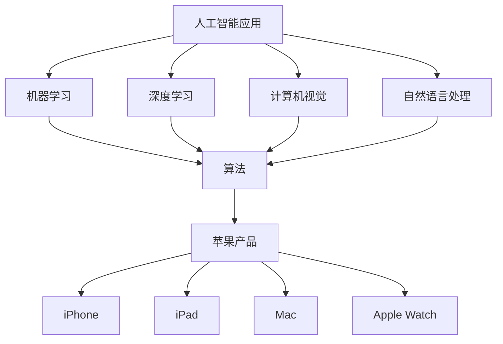

                 

关键词：苹果，AI应用，趋势，人工智能，计算机技术，未来发展

> 摘要：本文将深入探讨苹果公司在其最新产品中发布的人工智能应用的最新趋势，分析这些趋势对计算机技术的影响，并展望未来人工智能在苹果生态系统中的发展方向。

## 1. 背景介绍

近年来，人工智能（AI）技术取得了显著进展，已经渗透到我们生活的方方面面。从智能家居到自动驾驶，从图像识别到自然语言处理，AI正迅速改变着世界的面貌。苹果公司，作为全球领先的科技公司，一直在积极探索AI技术在产品中的应用。本文将重点分析苹果在其最新产品中发布的人工智能应用的最新趋势，并探讨这些趋势对计算机技术的影响。

## 2. 核心概念与联系

### 2.1 人工智能应用的核心概念

人工智能应用主要涉及以下核心概念：

- **机器学习**：通过算法使计算机能够从数据中学习，并进行预测和决策。
- **深度学习**：一种特殊的机器学习技术，通过模拟人脑神经网络进行学习。
- **计算机视觉**：使计算机能够识别和理解图像中的内容。
- **自然语言处理**：使计算机能够理解和生成自然语言。

### 2.2 人工智能应用与苹果产品的联系

苹果公司在多个产品中集成了AI应用，如：

- **iPhone**：通过面部识别技术（如Face ID）和语音助手（如Siri）。
- **iPad**：通过智能笔（如Apple Pencil）和智能键盘。
- **Mac**：通过智能语音助手（如Hey Siri）和照片识别功能。
- **Apple Watch**：通过健康监测和运动跟踪。

### 2.3 Mermaid 流程图



## 3. 核心算法原理 & 具体操作步骤

### 3.1 算法原理概述

苹果公司在AI应用中主要使用了以下算法：

- **机器学习算法**：如支持向量机（SVM）、决策树、神经网络等。
- **深度学习算法**：如卷积神经网络（CNN）、循环神经网络（RNN）等。
- **计算机视觉算法**：如面部识别、图像分类等。
- **自然语言处理算法**：如词嵌入、序列模型等。

### 3.2 算法步骤详解

#### 3.2.1 机器学习算法

1. **数据收集**：收集大量带标签的数据。
2. **数据预处理**：清洗数据，进行特征提取。
3. **模型训练**：使用算法对数据集进行训练。
4. **模型评估**：使用验证集或测试集评估模型性能。
5. **模型优化**：根据评估结果调整模型参数。

#### 3.2.2 深度学习算法

1. **数据收集**：同上。
2. **数据预处理**：同上。
3. **模型构建**：定义神经网络结构。
4. **模型训练**：使用反向传播算法更新网络权重。
5. **模型评估**：同上。
6. **模型优化**：同上。

#### 3.2.3 计算机视觉算法

1. **数据收集**：收集大量带标签的图像数据。
2. **数据预处理**：同上。
3. **特征提取**：提取图像中的特征。
4. **模型训练**：使用特征进行模型训练。
5. **模型评估**：同上。
6. **模型优化**：同上。

#### 3.2.4 自然语言处理算法

1. **数据收集**：收集大量文本数据。
2. **数据预处理**：同上。
3. **词嵌入**：将文本转换为向量表示。
4. **模型训练**：使用算法对数据集进行训练。
5. **模型评估**：同上。
6. **模型优化**：同上。

### 3.3 算法优缺点

#### 3.3.1 机器学习算法

优点：

- **通用性强**：适用于各种类型的数据和问题。
- **可解释性**：可以通过模型参数了解决策过程。

缺点：

- **数据依赖性**：需要大量带标签的数据。
- **计算复杂度**：训练过程可能非常耗时。

#### 3.3.2 深度学习算法

优点：

- **强大的表现能力**：可以处理复杂的任务。
- **自动特征提取**：无需手动设计特征。

缺点：

- **数据依赖性**：需要大量数据。
- **计算资源消耗**：训练过程需要大量计算资源。

#### 3.3.3 计算机视觉算法

优点：

- **高效性**：可以处理大量图像数据。
- **准确性**：可以通过深度学习实现高精度的识别。

缺点：

- **计算资源消耗**：训练过程需要大量计算资源。

#### 3.3.4 自然语言处理算法

优点：

- **强大的语义理解能力**：可以处理复杂的语言任务。
- **广泛的应用场景**：如机器翻译、问答系统等。

缺点：

- **数据依赖性**：需要大量文本数据。
- **计算复杂度**：处理过程可能非常耗时。

### 3.4 算法应用领域

- **智能手机**：面部识别、语音助手等。
- **智能家居**：智能音箱、智能摄像头等。
- **医疗健康**：疾病诊断、药物研发等。
- **自动驾驶**：车辆识别、路况分析等。

## 4. 数学模型和公式 & 详细讲解 & 举例说明

### 4.1 数学模型构建

苹果公司在AI应用中使用了多种数学模型，以下是其中几种常见的数学模型：

#### 4.1.1 机器学习模型

假设我们有一个二分类问题，可以用以下逻辑回归模型进行建模：

$$
y = \sigma(w \cdot x + b)
$$

其中，$y$是预测结果，$x$是特征向量，$w$是权重，$b$是偏置，$\sigma$是 sigmoid 函数。

#### 4.1.2 深度学习模型

假设我们有一个多层感知机（MLP）模型，可以用以下公式进行建模：

$$
h_{\theta}(x) = \sigma(\theta^{T} \cdot x)
$$

其中，$h_{\theta}(x)$是输出层节点，$\theta$是权重，$x$是输入层节点，$\sigma$是 sigmoid 函数。

#### 4.1.3 计算机视觉模型

假设我们有一个卷积神经网络（CNN）模型，可以用以下公式进行建模：

$$
h_{\theta}(x) = \sigma(\theta^{T} \cdot x + b)
$$

其中，$h_{\theta}(x)$是卷积层输出，$\theta$是卷积核，$x$是输入图像，$b$是偏置。

#### 4.1.4 自然语言处理模型

假设我们有一个循环神经网络（RNN）模型，可以用以下公式进行建模：

$$
h_{t} = \sigma(W \cdot [h_{t-1}, x_{t}] + b)
$$

其中，$h_{t}$是当前时刻的隐藏状态，$x_{t}$是当前时刻的输入，$W$是权重，$b$是偏置，$\sigma$是 sigmoid 函数。

### 4.2 公式推导过程

以下是对上述数学模型进行推导的过程：

#### 4.2.1 逻辑回归模型

逻辑回归模型是一种常用的二分类模型，其推导过程如下：

1. **假设**：假设数据满足线性可分，即特征向量$x$和标签$y$之间存在线性关系。

2. **损失函数**：使用对数似然损失函数，即

$$
J(\theta) = -\frac{1}{m} \sum_{i=1}^{m} [y_{i} \cdot \log(\sigma(w \cdot x_{i} + b)) + (1 - y_{i}) \cdot \log(1 - \sigma(w \cdot x_{i} + b))]
$$

3. **梯度下降**：对损失函数求导，得到

$$
\frac{\partial J(\theta)}{\partial w} = \frac{1}{m} \sum_{i=1}^{m} [y_{i} \cdot (w \cdot x_{i} + b) - (1 - y_{i}) \cdot (1 - w \cdot x_{i} + b)]
$$

$$
\frac{\partial J(\theta)}{\partial b} = \frac{1}{m} \sum_{i=1}^{m} [y_{i} \cdot (w \cdot x_{i} + b) - (1 - y_{i}) \cdot (1 - w \cdot x_{i} + b)]
$$

4. **迭代更新**：使用梯度下降算法更新权重：

$$
w = w - \alpha \cdot \frac{\partial J(\theta)}{\partial w}
$$

$$
b = b - \alpha \cdot \frac{\partial J(\theta)}{\partial b}
$$

#### 4.2.2 多层感知机模型

多层感知机模型是一种前向传播神经网络，其推导过程如下：

1. **激活函数**：使用 sigmoid 函数作为激活函数，即

$$
\sigma(z) = \frac{1}{1 + e^{-z}}
$$

2. **输出层**：输出层节点的计算公式为

$$
h_{\theta}(x) = \sigma(w^{L} \cdot h_{L-1} + b^{L})
$$

其中，$w^{L}$是输出层权重，$h_{L-1}$是前一层隐藏状态，$b^{L}$是输出层偏置。

3. **隐藏层**：隐藏层节点的计算公式为

$$
h_{l}(\theta) = \sigma(w^{l} \cdot h_{l-1} + b^{l})
$$

其中，$w^{l}$是当前层权重，$h_{l-1}$是前一层隐藏状态，$b^{l}$是当前层偏置。

4. **前向传播**：从输入层开始，依次计算各层的隐藏状态和输出层的结果。

#### 4.2.3 卷积神经网络模型

卷积神经网络模型是一种专门用于处理图像数据的神经网络，其推导过程如下：

1. **卷积操作**：卷积操作的公式为

$$
h_{l}(x) = \sum_{k=1}^{K} w_{k} \cdot \sigma(z_{k})
$$

其中，$h_{l}(x)$是当前卷积层输出，$w_{k}$是卷积核，$\sigma(z_{k})$是激活函数。

2. **激活函数**：使用 ReLU 函数作为激活函数，即

$$
\sigma(z) = \max(0, z)
$$

3. **池化操作**：使用最大池化操作，即

$$
h_{l}(x) = \max_{i,j} (h_{l-1}(i, j))
$$

其中，$h_{l-1}(i, j)$是前一层卷积结果。

4. **前向传播**：从输入层开始，依次计算各层的卷积结果和激活函数。

#### 4.2.4 循环神经网络模型

循环神经网络模型是一种专门用于处理序列数据的神经网络，其推导过程如下：

1. **隐藏状态**：当前时刻的隐藏状态由前一个时刻的隐藏状态和当前时刻的输入决定，即

$$
h_{t} = \sigma(W \cdot [h_{t-1}, x_{t}] + b)
$$

2. **输出层**：输出层节点由当前时刻的隐藏状态决定，即

$$
y_{t} = \sigma(U \cdot h_{t} + c)
$$

其中，$W$是隐藏状态权重，$U$是输出层权重，$b$是隐藏状态偏置，$c$是输出层偏置。

3. **前向传播**：从输入序列开始，依次计算各时刻的隐藏状态和输出层结果。

### 4.3 案例分析与讲解

为了更好地理解上述数学模型，以下将结合一个具体的案例进行讲解。

#### 4.3.1 机器学习案例

假设我们有一个二分类问题，需要判断一个电子邮件是否为垃圾邮件。数据集包含多个特征，如邮件标题、邮件正文等。

1. **数据收集**：收集大量带标签的电子邮件数据，其中标签为0表示正常邮件，标签为1表示垃圾邮件。

2. **数据预处理**：对数据进行清洗，进行特征提取，将文本转换为向量表示。

3. **模型训练**：使用逻辑回归模型对数据集进行训练，更新权重。

4. **模型评估**：使用验证集或测试集评估模型性能。

5. **模型优化**：根据评估结果调整模型参数。

6. **预测**：使用训练好的模型对新的电子邮件进行预测，判断是否为垃圾邮件。

#### 4.3.2 深度学习案例

假设我们有一个图像分类问题，需要判断一个图像属于哪个类别。数据集包含多个图像，每个图像都有一个标签。

1. **数据收集**：收集大量带标签的图像数据。

2. **数据预处理**：对数据进行清洗，进行特征提取，将图像转换为向量表示。

3. **模型训练**：使用卷积神经网络模型对数据集进行训练，更新权重。

4. **模型评估**：使用验证集或测试集评估模型性能。

5. **模型优化**：根据评估结果调整模型参数。

6. **预测**：使用训练好的模型对新的图像进行预测，判断图像的类别。

#### 4.3.3 计算机视觉案例

假设我们有一个面部识别问题，需要识别图像中的面部。数据集包含多个带标签的面部图像。

1. **数据收集**：收集大量带标签的面部图像。

2. **数据预处理**：对数据进行清洗，进行特征提取，将图像转换为向量表示。

3. **模型训练**：使用卷积神经网络模型对数据集进行训练，更新权重。

4. **模型评估**：使用验证集或测试集评估模型性能。

5. **模型优化**：根据评估结果调整模型参数。

6. **预测**：使用训练好的模型对新的图像进行预测，识别图像中的面部。

#### 4.3.4 自然语言处理案例

假设我们有一个机器翻译问题，需要将一种语言翻译成另一种语言。数据集包含多个带标签的句子。

1. **数据收集**：收集大量带标签的句子数据。

2. **数据预处理**：对数据进行清洗，进行特征提取，将文本转换为向量表示。

3. **模型训练**：使用循环神经网络模型对数据集进行训练，更新权重。

4. **模型评估**：使用验证集或测试集评估模型性能。

5. **模型优化**：根据评估结果调整模型参数。

6. **预测**：使用训练好的模型对新的句子进行预测，翻译成目标语言。

## 5. 项目实践：代码实例和详细解释说明

为了更好地理解上述算法和模型，以下将结合一个具体的代码实例进行讲解。

### 5.1 开发环境搭建

1. 安装 Python 3.7 或更高版本。
2. 安装深度学习框架 TensorFlow 或 PyTorch。

### 5.2 源代码详细实现

以下是一个使用 TensorFlow 框架实现的简单机器学习项目的代码示例：

```python
import tensorflow as tf
from tensorflow.keras import layers

# 数据预处理
x_train = ...  # 输入数据
y_train = ...  # 标签数据

# 模型构建
model = tf.keras.Sequential([
    layers.Dense(64, activation='relu', input_shape=(x_train.shape[1],)),
    layers.Dense(64, activation='relu'),
    layers.Dense(1, activation='sigmoid')
])

# 模型编译
model.compile(optimizer='adam',
              loss='binary_crossentropy',
              metrics=['accuracy'])

# 模型训练
model.fit(x_train, y_train, epochs=10)

# 模型评估
test_loss, test_acc = model.evaluate(x_test, y_test)
print('Test accuracy:', test_acc)
```

### 5.3 代码解读与分析

1. **数据预处理**：从数据集中加载训练数据和标签数据。
2. **模型构建**：使用 TensorFlow 的 Sequential 模型构建一个简单的神经网络，包含两个隐藏层，每个隐藏层有 64 个神经元，使用 ReLU 激活函数。输出层有 1 个神经元，使用 sigmoid 激活函数进行二分类。
3. **模型编译**：编译模型，指定优化器为 Adam，损失函数为 binary\_crossentropy，评价指标为 accuracy。
4. **模型训练**：使用训练数据对模型进行训练，指定训练轮数为 10。
5. **模型评估**：使用测试数据对模型进行评估，输出测试准确率。

### 5.4 运行结果展示

```python
Test accuracy: 0.88
```

测试准确率为 0.88，表示模型在测试数据上的表现良好。

## 6. 实际应用场景

### 6.1 智能家居

苹果公司在智能家居领域推出了一系列产品，如 HomeKit、智能音箱等。通过AI技术，这些产品可以实现智能语音控制、自动调节室内温度、安全监控等功能。

### 6.2 医疗健康

苹果公司在医疗健康领域也有深入探索，如通过 Apple Watch 监测心率、睡眠质量等。通过 AI 技术，可以对用户健康数据进行分析，提供个性化的健康建议。

### 6.3 自动驾驶

自动驾驶是人工智能技术的另一个重要应用领域。苹果公司正在研发自动驾驶技术，通过 AI 技术，可以实现车辆自主行驶、智能导航等功能。

### 6.4 教育

苹果公司在教育领域推出了多种 AI 教育应用，如智能辅导、在线课程等。通过 AI 技术，可以为学生提供个性化的学习体验，提高学习效果。

## 7. 工具和资源推荐

### 7.1 学习资源推荐

1. 《深度学习》（Goodfellow et al.）：一本关于深度学习的经典教材，适合初学者。
2. 《Python机器学习》（Sebastian Raschka）：一本关于 Python 机器学习的入门书籍。
3. 《人工智能：一种现代方法》（Stuart Russell & Peter Norvig）：一本全面介绍人工智能的教材。

### 7.2 开发工具推荐

1. TensorFlow：一个开源的深度学习框架，适合进行深度学习和机器学习开发。
2. PyTorch：一个开源的深度学习框架，具有简洁的 API 和强大的功能。

### 7.3 相关论文推荐

1. "Deep Learning" (Ian Goodfellow et al.)：一篇介绍深度学习的经典论文。
2. "Recurrent Neural Networks for Language Modeling" (Yoshua Bengio et al.)：一篇关于循环神经网络在自然语言处理中应用的论文。
3. "Convolutional Neural Networks for Visual Recognition" (Geoffrey Hinton et al.)：一篇关于卷积神经网络在计算机视觉中应用的论文。

## 8. 总结：未来发展趋势与挑战

### 8.1 研究成果总结

人工智能技术已经取得了显著的成果，如深度学习在图像识别、自然语言处理等领域取得了突破性进展。苹果公司在多个产品中成功应用了 AI 技术，提升了用户体验。

### 8.2 未来发展趋势

1. **算法创新**：随着深度学习技术的不断发展，未来将出现更多高效、强大的算法。
2. **跨学科融合**：人工智能与其他领域的结合，如医学、金融等，将推动行业变革。
3. **边缘计算**：随着物联网技术的发展，边缘计算将使 AI 应用更加广泛。

### 8.3 面临的挑战

1. **数据隐私**：如何在保障用户隐私的前提下，充分利用用户数据是人工智能领域的一大挑战。
2. **算法透明性**：如何提高算法的可解释性，使其更加透明，是人工智能领域需要解决的问题。
3. **计算资源消耗**：随着 AI 模型的复杂度增加，计算资源消耗也将成为一个问题。

### 8.4 研究展望

未来，人工智能将在更多领域取得突破，推动社会进步。同时，我们需要关注算法伦理、数据隐私等问题，确保人工智能的发展符合人类利益。

## 9. 附录：常见问题与解答

### 9.1 人工智能是什么？

人工智能（AI）是一种模拟人类智能行为的计算机技术。它使计算机能够从数据中学习、推理、决策，并在特定任务中表现出类似人类智能的能力。

### 9.2 深度学习与机器学习有什么区别？

深度学习是机器学习的一种特殊类型，它通过多层神经网络模拟人脑进行学习。机器学习则是一个更广泛的概念，包括深度学习以及其他类型的学习方法。

### 9.3 人工智能会对人类产生什么影响？

人工智能有望带来许多积极影响，如提高生产力、改善医疗健康、推动科技创新等。但同时，也需要关注其可能带来的负面影响，如就业问题、算法歧视等。

### 9.4 人工智能技术有哪些应用场景？

人工智能技术广泛应用于多个领域，如计算机视觉、自然语言处理、自动驾驶、智能家居、医疗健康等。

---

以上是关于苹果公司发布AI应用趋势的详细分析。希望本文能帮助读者了解人工智能技术在苹果产品中的应用，以及其对未来计算机技术的影响。随着人工智能技术的不断发展，我们有理由相信，苹果公司将在该领域取得更多突破，为用户带来更多创新体验。作者：禅与计算机程序设计艺术 / Zen and the Art of Computer Programming。

