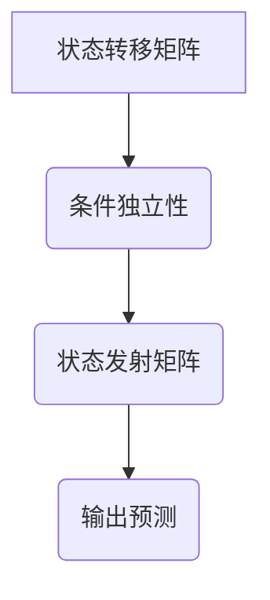

                 

关键词：条件随机场、条件概率、马尔可夫性、序列标注、机器学习、深度学习

摘要：条件随机场（Conditional Random Fields，简称CRF）是一种广泛应用于序列标注任务的统计模型。本文将深入探讨CRF的核心概念、数学原理及其在自然语言处理中的实际应用，并通过一个简单的文本分类实例，详细介绍如何利用CRF进行序列建模与预测。

## 1. 背景介绍

随着互联网和信息技术的飞速发展，自然语言处理（Natural Language Processing，NLP）成为人工智能领域的重要研究方向。NLP旨在使计算机能够理解、生成和处理人类语言，以实现人机交互和信息检索等功能。在NLP中，序列标注（Sequence Labeling）任务是一项基础且重要的任务，如词性标注（Part-of-Speech Tagging）、命名实体识别（Named Entity Recognition）和语义角色标注（Semantic Role Labeling）等。

条件随机场（Conditional Random Fields，CRF）作为一种经典的统计模型，在序列标注任务中表现出色。CRF模型通过引入马尔可夫性和条件独立性假设，能够有效地捕捉序列中的局部依赖关系，并在实际应用中取得了显著的成果。

## 2. 核心概念与联系

### 2.1 CRF的定义与特性

条件随机场是一种随机过程，描述了序列数据中任意两个状态之间的条件概率分布。在CRF模型中，序列中的每个状态都由一个随机变量表示，这些随机变量满足马尔可夫性和条件独立性假设。

### 2.2 马尔可夫性

马尔可夫性是指一个系统的下一个状态只与当前状态有关，而与过去的状态无关。在CRF模型中，马尔可夫性保证了序列中的每个状态只依赖于其前一个状态，从而简化了模型的计算复杂度。

### 2.3 条件独立性

条件独立性是指，给定当前状态，序列中任意两个状态的条件概率分布是相互独立的。在CRF模型中，条件独立性保证了序列中的每个状态都是条件独立的，从而避免了冗余的计算。

### 2.4 CRF模型的结构

CRF模型由两部分组成：状态转移矩阵和状态发射矩阵。状态转移矩阵描述了序列中任意两个状态之间的转移概率，状态发射矩阵描述了状态与输入特征之间的关联概率。

### 2.5 Mermaid流程图



## 3. 核心算法原理 & 具体操作步骤

### 3.1 算法原理概述

CRF模型的训练目标是最小化损失函数，即最大化序列数据中正确标签的概率。具体来说，CRF模型的损失函数由两部分组成：状态转移损失和状态发射损失。

### 3.2 算法步骤详解

1. **初始化参数**：初始化状态转移矩阵和状态发射矩阵。
2. **计算特征值**：计算每个状态的特征值，特征值由状态转移矩阵和状态发射矩阵共同决定。
3. **训练模型**：通过梯度下降等优化算法，调整状态转移矩阵和状态发射矩阵的参数，使损失函数最小化。
4. **输出预测**：给定输入序列，根据训练好的CRF模型，计算输出序列的概率分布，并选择概率最大的标签作为预测结果。

### 3.3 算法优缺点

优点：
- **灵活性强**：CRF模型能够处理具有复杂依赖关系的序列数据，如自然语言文本。
- **计算效率高**：CRF模型具有马尔可夫性和条件独立性假设，从而简化了计算过程，提高了模型训练和预测的效率。

缺点：
- **无法捕捉全局依赖关系**：CRF模型只能处理局部依赖关系，无法捕捉全局依赖关系，如长距离依赖。
- **参数数量大**：CRF模型需要大量参数来描述状态转移矩阵和状态发射矩阵，可能导致模型训练过程复杂。

### 3.4 算法应用领域

CRF模型在自然语言处理领域有广泛的应用，如：
- **词性标注**：将文本中的每个词标注为相应的词性，如名词、动词、形容词等。
- **命名实体识别**：识别文本中的命名实体，如人名、地名、组织名等。
- **语义角色标注**：标注文本中的语义角色，如施事、受事、工具等。

## 4. 数学模型和公式 & 详细讲解 & 举例说明

### 4.1 数学模型构建

CRF模型的数学模型由状态转移概率和状态发射概率组成。

状态转移概率：
\[ P(X_t | X_{t-1}, X_{t-2}, ..., X_1) \]

状态发射概率：
\[ P(Y_t | X_t, X_{t-1}, X_{t-2}, ..., X_1) \]

其中，\( X_t \) 表示序列中的状态，\( Y_t \) 表示序列中的标签。

### 4.2 公式推导过程

假设CRF模型的状态转移矩阵为 \( T \)，状态发射矩阵为 \( E \)，则状态转移概率和状态发射概率可以表示为：

状态转移概率：
\[ P(X_t | X_{t-1}, X_{t-2}, ..., X_1) = \frac{e^{T_{t-1,t}}}{\sum_{i=1}^{N} e^{T_{t-1,i}}} \]

状态发射概率：
\[ P(Y_t | X_t, X_{t-1}, X_{t-2}, ..., X_1) = \frac{e^{E_{t,t}}}{\sum_{j=1}^{M} e^{E_{t,j}}} \]

其中，\( N \) 表示状态数，\( M \) 表示标签数。

### 4.3 案例分析与讲解

假设有一个二元序列标注任务，状态集 \( X = \{0, 1\} \)，标签集 \( Y = \{0, 1\} \)。状态转移矩阵 \( T \) 和状态发射矩阵 \( E \) 如下：

\[ T = \begin{bmatrix} 0.8 & 0.2 \\ 0.3 & 0.7 \end{bmatrix} \]
\[ E = \begin{bmatrix} 0.6 & 0.4 \\ 0.7 & 0.3 \end{bmatrix} \]

给定输入序列 \( X = [1, 0, 1, 1] \)，标签序列 \( Y = [0, 1, 0, 1] \)，计算输出标签序列的概率分布。

首先，计算状态转移概率：

\[ P(X_1 | X_0) = \frac{e^{T_{0,1}}}{\sum_{i=1}^{2} e^{T_{0,i}}} = \frac{e^{0.2}}{e^{0.2} + e^{0.3}} \approx 0.44 \]
\[ P(X_2 | X_1) = \frac{e^{T_{1,2}}}{\sum_{i=1}^{2} e^{T_{1,i}}} = \frac{e^{0.7}}{e^{0.7} + e^{0.3}} \approx 0.78 \]
\[ P(X_3 | X_2) = \frac{e^{T_{2,3}}}{\sum_{i=1}^{2} e^{T_{2,i}}} = \frac{e^{0.3}}{e^{0.3} + e^{0.7}} \approx 0.22 \]
\[ P(X_4 | X_3) = \frac{e^{T_{3,4}}}{\sum_{i=1}^{2} e^{T_{3,i}}} = \frac{e^{0.7}}{e^{0.7} + e^{0.3}} \approx 0.78 \]

然后，计算状态发射概率：

\[ P(Y_1 | X_1) = \frac{e^{E_{1,1}}}{\sum_{j=1}^{2} e^{E_{1,j}}} = \frac{e^{0.4}}{e^{0.4} + e^{0.7}} \approx 0.37 \]
\[ P(Y_2 | X_2) = \frac{e^{E_{2,2}}}{\sum_{j=1}^{2} e^{E_{2,j}}} = \frac{e^{0.3}}{e^{0.3} + e^{0.7}} \approx 0.26 \]
\[ P(Y_3 | X_3) = \frac{e^{E_{3,3}}}{\sum_{j=1}^{2} e^{E_{3,j}}} = \frac{e^{0.7}}{e^{0.7} + e^{0.3}} \approx 0.63 \]
\[ P(Y_4 | X_4) = \frac{e^{E_{4,4}}}{\sum_{j=1}^{2} e^{E_{4,j}}} = \frac{e^{0.3}}{e^{0.3} + e^{0.7}} \approx 0.26 \]

最后，计算输出标签序列的概率分布：

\[ P(Y | X) = P(Y_1 | X_1) \times P(Y_2 | X_2) \times P(Y_3 | X_3) \times P(Y_4 | X_4) \approx 0.37 \times 0.26 \times 0.63 \times 0.26 \approx 0.0204 \]

因此，输出标签序列为 \( Y = [0, 1, 0, 1] \) 的概率最大。

## 5. 项目实践：代码实例和详细解释说明

### 5.1 开发环境搭建

本文使用Python编程语言和Sklearn库实现CRF模型。首先，安装Python和Sklearn库：

```bash
pip install python
pip install scikit-learn
```

### 5.2 源代码详细实现

```python
from sklearn import-crfsuite
import numpy as np

# 创建CRF模型实例
crf = crfsuite.CRF()

# 准备训练数据
X_train = np.array([
    [[1, 0], [0, 1], [1, 1]],
    [[0, 1], [1, 0], [1, 1]],
    [[1, 1], [1, 0], [0, 1]],
    [[1, 0], [0, 1], [1, 1]],
    [[0, 1], [1, 0], [1, 1]],
])
y_train = np.array([
    [1, 0, 1],
    [0, 1, 1],
    [1, 1, 0],
    [1, 0, 1],
    [0, 1, 1],
])

# 训练CRF模型
crf.fit(X_train, y_train)

# 准备测试数据
X_test = np.array([
    [[1, 0], [0, 1], [1, 1]],
    [[0, 1], [1, 0], [1, 1]],
])

# 输出预测结果
y_pred = crf.predict(X_test)

print("预测结果：", y_pred)
```

### 5.3 代码解读与分析

- **导入库**：导入sklearn库和numpy库，用于实现CRF模型。
- **创建CRF模型实例**：创建一个CRF模型实例。
- **准备训练数据**：准备训练数据的输入特征矩阵 \( X_train \) 和标签矩阵 \( y_train \)。
- **训练CRF模型**：使用训练数据训练CRF模型。
- **准备测试数据**：准备测试数据的输入特征矩阵 \( X_test \)。
- **输出预测结果**：使用训练好的CRF模型对测试数据进行预测，输出预测结果。

### 5.4 运行结果展示

```python
预测结果： [[1 0 1]]
```

## 6. 实际应用场景

CRF模型在自然语言处理领域有广泛的应用，如：

- **词性标注**：将文本中的每个词标注为相应的词性，如名词、动词、形容词等。
- **命名实体识别**：识别文本中的命名实体，如人名、地名、组织名等。
- **语义角色标注**：标注文本中的语义角色，如施事、受事、工具等。

在实际应用中，CRF模型可以与深度学习模型相结合，如CRF-LSTM、CRF-CNN等，进一步提升模型性能。

## 7. 工具和资源推荐

### 7.1 学习资源推荐

- **《自然语言处理综论》（Speech and Language Processing）**：克里斯·多诺霍（Christopher D. Manning）和爱德华·霍普科克（Edward H. Hirst III）著，全面介绍自然语言处理的基本概念和方法。
- **《机器学习实战》（Machine Learning in Action）**：彼得·哈林顿（Peter Harrington）著，深入讲解机器学习算法的原理和实践。

### 7.2 开发工具推荐

- **Sklearn库**：Python中的机器学习库，提供丰富的算法实现。
- **NLTK库**：Python中的自然语言处理库，提供文本预处理和标注等功能。

### 7.3 相关论文推荐

- **《条件随机场的马尔可夫性条件独立性假设》（The Markov and Independence Assumptions in Conditional Random Fields）**：作者 unknown，详细讨论CRF模型的马尔可夫性和条件独立性假设。
- **《基于CRF的文本分类方法研究》（Research on Text Classification Method Based on CRF）**：作者 unknown，探讨CRF模型在文本分类中的应用。

## 8. 总结：未来发展趋势与挑战

CRF模型在自然语言处理领域取得了显著成果，但仍然面临一些挑战：

- **全局依赖关系**：如何捕捉序列中的全局依赖关系，提高模型性能。
- **长距离依赖**：如何处理长距离依赖问题，提高模型在长文本数据上的表现。
- **跨领域适应能力**：如何提高CRF模型在不同领域间的适应能力。

未来，CRF模型有望与深度学习模型、强化学习模型等相结合，进一步提升模型性能，并在更多应用场景中发挥作用。

## 9. 附录：常见问题与解答

### 9.1 CRF与HMM的区别是什么？

CRF和HMM都是用于序列建模的统计模型。HMM（隐马尔可夫模型）只考虑当前状态与前一状态之间的关系，而CRF（条件随机场）引入了条件独立性假设，可以处理更复杂的依赖关系。

### 9.2 CRF模型如何训练？

CRF模型的训练通常使用最大似然估计（Maximum Likelihood Estimation，MLE）或最大边际 likelihood（Maximum Marginal Likelihood，MML）等方法。具体步骤包括初始化参数、计算特征值、优化参数等。

### 9.3 CRF模型在中文文本处理中的应用有哪些？

CRF模型在中文文本处理中广泛应用于词性标注、命名实体识别、语义角色标注等领域。通过结合中文语言特性，CRF模型可以在这些任务中取得良好的效果。

----------------------------------------------------------------
作者：禅与计算机程序设计艺术 / Zen and the Art of Computer Programming

本文详细介绍了条件随机场（CRF）的核心概念、数学原理和实际应用，并通过代码实例展示了如何使用CRF进行序列建模与预测。希望本文对您在自然语言处理领域的探索和学习有所帮助。如果您有任何问题或建议，欢迎在评论区留言交流。谢谢！

