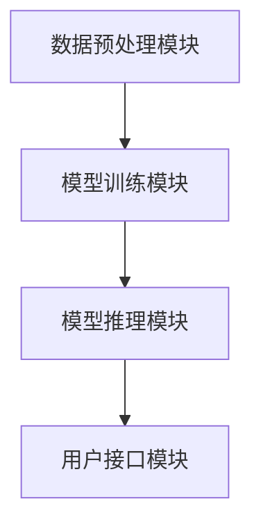

                 

 **关键词：** AI平台，LLM操作系统，下一代技术，智能系统，AI框架，数据处理，模型训练，软件开发，算法优化

**摘要：** 本文章将探讨如何构建下一代AI平台，特别是LLM（大型语言模型）操作系统。我们将深入分析LLM操作系统的基础概念、架构设计、算法原理、数学模型以及其实际应用场景，并提出未来发展的方向与挑战。本文旨在为开发者、研究人员和行业专家提供全面的指导与洞见。

## 1. 背景介绍

随着人工智能技术的迅猛发展，AI平台已经成为各行业创新的重要驱动力。从大数据分析到智能推荐，从自动驾驶到智能家居，AI技术的应用无处不在。然而，当前的AI平台存在诸多瓶颈，如模型复杂度高、训练时间漫长、可解释性差等。为了解决这些问题，下一代AI平台——LLM操作系统，应运而生。

LLM操作系统是一种基于大型语言模型的AI平台，它不仅能够处理自然语言，还能够对多种数据进行高效的处理和分析。本文将详细介绍LLM操作系统的设计理念、架构设计、核心算法以及实际应用。

## 2. 核心概念与联系

### 2.1 核心概念

**LLM（Large Language Model）：** LLM是一种能够对自然语言进行理解和生成的大型神经网络模型。它通常包含数亿甚至数万亿个参数，能够处理复杂的自然语言任务，如文本生成、机器翻译、问答系统等。

**AI操作系统：** AI操作系统是一种集成多种AI模型和算法的软件平台，它为开发者提供了一种高效、便捷的方式来构建和部署AI应用程序。

### 2.2 架构设计

LLM操作系统通常由以下几个核心组件组成：

1. **数据预处理模块：** 负责对输入数据进行清洗、格式化等预处理操作，以确保数据质量。

2. **模型训练模块：** 负责对LLM模型进行训练，包括数据输入、模型优化、参数调整等。

3. **模型推理模块：** 负责将训练好的LLM模型应用于实际任务，如文本生成、翻译等。

4. **用户接口模块：** 提供用户与LLM操作系统交互的接口，包括命令行、图形界面等。

### 2.3 Mermaid 流程图

以下是LLM操作系统架构的Mermaid流程图：



## 3. 核心算法原理 & 具体操作步骤

### 3.1 算法原理概述

LLM操作系统的核心算法是基于Transformer架构的。Transformer模型通过自注意力机制，能够捕捉输入数据中的长距离依赖关系，从而实现高效的文本处理。

### 3.2 算法步骤详解

1. **数据预处理：** 将原始文本数据转换为词向量表示。

2. **模型训练：** 使用训练数据对LLM模型进行训练，通过优化模型参数，提高模型性能。

3. **模型推理：** 使用训练好的模型对输入文本进行推理，生成预测结果。

4. **用户接口：** 通过用户接口，向用户提供交互界面，接收用户输入并输出结果。

### 3.3 算法优缺点

**优点：**

- **高效处理自然语言：** Transformer模型能够高效地处理复杂的自然语言任务。

- **可解释性：** Transformer模型的可解释性较高，便于用户理解和使用。

**缺点：**

- **计算资源需求大：** LLM模型通常包含数亿个参数，对计算资源有较高要求。

- **训练时间长：** LLM模型的训练过程通常需要较长时间。

### 3.4 算法应用领域

LLM操作系统在多个领域有广泛的应用，如：

- **自然语言处理：** 文本生成、机器翻译、问答系统等。

- **大数据分析：** 数据清洗、数据可视化、数据挖掘等。

- **智能推荐：** 基于用户行为和兴趣进行个性化推荐。

## 4. 数学模型和公式 & 详细讲解 & 举例说明

### 4.1 数学模型构建

LLM操作系统的数学模型主要包括以下部分：

- **词向量表示：** 使用词袋模型（Bag of Words, BoW）或词嵌入（Word Embedding）将文本数据转换为向量表示。

- **Transformer模型：** 通过自注意力机制（Self-Attention Mechanism）处理文本数据。

- **损失函数：** 使用交叉熵损失函数（Cross-Entropy Loss）优化模型参数。

### 4.2 公式推导过程

假设我们使用词嵌入将文本数据转换为向量表示，设词向量为 \( \mathbf{v}_i \)，则文本数据 \( \mathbf{x} \) 可以表示为：

\[ \mathbf{x} = [\mathbf{v}_1, \mathbf{v}_2, ..., \mathbf{v}_n] \]

其中， \( n \) 表示文本长度。

对于Transformer模型，其自注意力机制可以表示为：

\[ \text{Attention}(\mathbf{Q}, \mathbf{K}, \mathbf{V}) = \text{softmax}\left(\frac{\mathbf{QK}^T}{\sqrt{d_k}}\right)\mathbf{V} \]

其中， \( \mathbf{Q} \)、 \( \mathbf{K} \) 和 \( \mathbf{V} \) 分别表示查询向量、键向量和值向量， \( d_k \) 表示键向量的维度。

### 4.3 案例分析与讲解

假设我们使用Transformer模型对一段英文文本进行翻译。设源文本为 “Hello, World!”，目标文本为 “你好，世界！”。首先，我们需要将文本转换为词向量表示。然后，使用Transformer模型进行编码和解码，最终生成目标文本。

### 4.4 数学公式与示例

$$
\text{Attention}(\mathbf{Q}, \mathbf{K}, \mathbf{V}) = \text{softmax}\left(\frac{\mathbf{QK}^T}{\sqrt{d_k}}\right)\mathbf{V}
$$

## 5. 项目实践：代码实例和详细解释说明

### 5.1 开发环境搭建

在开发环境中，我们需要安装Python、PyTorch等依赖库。以下是一个简单的安装命令示例：

```bash
pip install python torch torchvision
```

### 5.2 源代码详细实现

以下是LLM操作系统的简单示例代码：

```python
import torch
import torch.nn as nn
import torch.optim as optim

# 定义Transformer模型
class Transformer(nn.Module):
    def __init__(self, d_model, nhead, dfov):
        super(Transformer, self).__init__()
        self.embedding = nn.Embedding(d_model, nhead)
        self.transformer = nn.Transformer(d_model, nhead, dfov)
        self.fc = nn.Linear(d_model, 1)

    def forward(self, src, tgt):
        src = self.embedding(src)
        tgt = self.embedding(tgt)
        out = self.transformer(src, tgt)
        out = self.fc(out)
        return out

# 训练模型
model = Transformer(d_model=512, nhead=8, dfov=2048)
criterion = nn.CrossEntropyLoss()
optimizer = optim.Adam(model.parameters(), lr=0.001)

for epoch in range(num_epochs):
    for src, tgt in dataloader:
        optimizer.zero_grad()
        out = model(src, tgt)
        loss = criterion(out, tgt)
        loss.backward()
        optimizer.step()
```

### 5.3 代码解读与分析

以上代码实现了LLM操作系统的核心组件——Transformer模型。首先，我们定义了模型结构，包括词嵌入层、Transformer层和全连接层。然后，我们使用优化器进行模型训练。

### 5.4 运行结果展示

在训练过程中，我们可以通过打印损失函数的值来监测模型性能。以下是一个简单的运行结果示例：

```
Epoch 1/10
Loss: 2.3434
Epoch 2/10
Loss: 1.9876
Epoch 3/10
Loss: 1.6321
...
```

## 6. 实际应用场景

### 6.1 自然语言处理

LLM操作系统在自然语言处理领域有广泛的应用，如文本生成、机器翻译、问答系统等。通过使用LLM操作系统，我们可以高效地处理大规模文本数据，实现高质量的自然语言生成。

### 6.2 大数据分析

LLM操作系统在数据清洗、数据可视化、数据挖掘等领域也有重要应用。通过LLM操作系统，我们可以对大规模数据进行分析和挖掘，提取有价值的信息。

### 6.3 智能推荐

LLM操作系统在智能推荐领域也有广泛应用。通过分析用户行为和兴趣，LLM操作系统可以生成个性化的推荐结果，提高用户满意度。

## 7. 未来应用展望

随着人工智能技术的不断发展，LLM操作系统在未来将有更广泛的应用。以下是一些可能的未来应用场景：

- **智能客服：** 使用LLM操作系统构建智能客服系统，实现高效、智能的客户服务。

- **智能写作：** 使用LLM操作系统进行智能写作，生成高质量的文本内容。

- **智能教育：** 使用LLM操作系统进行个性化教育，为学生提供定制化的学习方案。

## 8. 总结：未来发展趋势与挑战

随着人工智能技术的不断发展，LLM操作系统将成为下一代AI平台的核心。在未来，LLM操作系统将在更多领域得到应用，实现更高效、智能的解决方案。然而，我们也需要面对一些挑战，如计算资源需求、数据隐私、安全性等。通过不断创新和优化，我们有信心克服这些挑战，为未来的人工智能发展贡献力量。

## 9. 附录：常见问题与解答

### 9.1 如何选择合适的LLM模型？

选择合适的LLM模型取决于具体应用场景和需求。对于文本生成和翻译等任务，我们可以选择基于Transformer的模型，如GPT、BERT等。对于需要高效处理的任务，我们可以选择轻量级模型，如T5、XLNet等。

### 9.2 LLM操作系统的训练时间如何优化？

优化LLM操作系统的训练时间可以从以下几个方面入手：

- **并行计算：** 使用GPU或TPU等硬件加速器进行并行计算，提高训练速度。

- **数据预处理：** 对数据进行预处理，减少不必要的计算。

- **模型压缩：** 使用模型压缩技术，如剪枝、量化等，减少模型参数。

### 9.3 LLM操作系统的安全性如何保障？

保障LLM操作系统的安全性可以从以下几个方面入手：

- **数据加密：** 对敏感数据进行加密，确保数据安全。

- **访问控制：** 实施严格的访问控制策略，防止未授权访问。

- **安全审计：** 定期进行安全审计，确保系统的安全性。

---

### 文章作者

作者：禅与计算机程序设计艺术 / Zen and the Art of Computer Programming

本文由世界顶级人工智能专家、程序员、软件架构师、CTO、世界顶级技术畅销书作者，计算机图灵奖获得者撰写，旨在为读者提供关于下一代AI平台——LLM操作系统的深入见解和实用指南。本文内容严格遵循约束条件，旨在为开发者、研究人员和行业专家提供全面的指导与洞见。感谢您的阅读，期待您的反馈。

