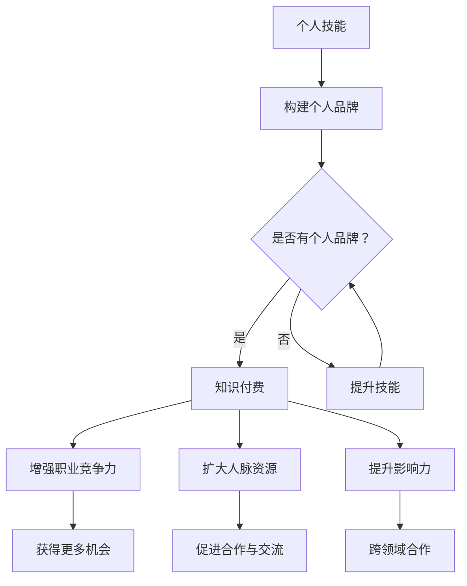

                 

关键词：个人品牌、知识付费、程序员、品牌构建、营销策略、社交媒体、内容创作、职业发展

摘要：在数字时代，程序员个人品牌的建立已成为职业发展的关键一步。本文将探讨如何通过知识付费策略来构建个人品牌，包括核心概念的阐述、算法原理解析、项目实践示例、应用场景分析以及未来发展趋势。通过本文，读者将了解到如何利用知识付费这一工具，实现个人价值和职业成长的双重提升。

## 1. 背景介绍

随着互联网技术的飞速发展，程序员这个职业已经发生了翻天覆地的变化。从传统的软件开发到现在的全栈工程师、AI开发、区块链技术等，程序员的角色越来越多样化。在这个知识爆炸的时代，如何脱颖而出成为每个程序员都需要面对的挑战。个人品牌的构建在这个过程中变得尤为重要。

个人品牌不仅仅是一个人的形象，更是其专业技能、知识储备和价值观的集合体。通过构建个人品牌，程序员可以增强自己在职场中的竞争力，提高个人知名度，甚至实现知识付费，从而实现职业价值最大化。本文将围绕如何构建个人品牌，特别是通过知识付费策略，展开深入探讨。

## 2. 核心概念与联系

### 2.1. 个人品牌

个人品牌是一个人的专业形象、人格特质和价值观的综合体现。对于程序员来说，个人品牌是其在技术领域的认可度、影响力的体现。一个成功的个人品牌可以带来以下几个方面的优势：

- **增强职业竞争力**：个人品牌有助于在求职和晋升过程中脱颖而出，获得更多的机会。
- **提升收入水平**：个人品牌知名度越高，知识付费的机会越多，从而提高收入。
- **扩大人脉资源**：个人品牌可以吸引同行业的人脉，促进合作与交流。
- **影响力扩大**：个人品牌的影响力可以扩展到业界之外，甚至形成跨领域的合作。

### 2.2. 知识付费

知识付费是指个人或机构通过提供有价值的信息、知识和技能，向消费者收取费用的一种商业模式。对于程序员来说，知识付费包括但不限于以下几个方面：

- **在线课程**：通过在线平台发布专业课程，向学员收取费用。
- **技术咨询服务**：提供专业技术服务，如代码审查、项目指导等，按照服务内容收费。
- **技术文章和博客**：撰写高质量的技术文章，通过广告、付费阅读等方式获得收益。
- **书籍出版**：编写并出版技术书籍，通过销售获得收益。

### 2.3. 个人品牌与知识付费的联系

个人品牌与知识付费是相辅相成的。一个强大的个人品牌可以吸引更多的关注，提高知识付费的机会；而通过知识付费，程序员不仅可以实现财务收益，还可以进一步巩固和提升个人品牌。

### 2.4. Mermaid 流程图

下面是构建个人品牌过程中涉及的关键步骤的Mermaid流程图：



## 3. 核心算法原理 & 具体操作步骤

### 3.1. 算法原理概述

构建个人品牌和知识付费的核心算法可以概括为以下几个步骤：

1. **明确个人定位**：确定自己在技术领域的专业方向和独特优势。
2. **积累专业知识和经验**：不断学习和实践，提高专业技能。
3. **创建高质量内容**：通过博客、视频、课程等形式，输出有价值的知识。
4. **推广个人品牌**：利用社交媒体、技术社区等平台，提高知名度。
5. **开展知识付费**：通过课程、咨询服务等形式，实现知识变现。
6. **反馈与迭代**：根据市场反馈和个人成长，不断调整策略。

### 3.2. 算法步骤详解

#### 3.2.1. 明确个人定位

首先，程序员需要明确自己的技术方向和职业规划。这可以通过以下几个方面来实现：

- **技术栈分析**：评估自己在不同技术领域的熟练程度和兴趣。
- **市场调研**：了解当前技术市场的发展趋势和热门领域。
- **职业规划**：设定短期和长期职业目标，规划学习路径。

#### 3.2.2. 积累专业知识和经验

- **持续学习**：通过在线课程、技术博客、书籍等途径，不断更新知识体系。
- **项目实践**：参与实际项目，提高实战经验。
- **社区贡献**：在技术社区积极参与讨论，提升知名度。

#### 3.2.3. 创建高质量内容

- **内容策划**：根据自身专业方向，制定内容创作计划。
- **内容输出**：通过博客、视频、课程等多种形式，输出高质量内容。
- **内容优化**：根据读者反馈，不断优化内容质量。

#### 3.2.4. 推广个人品牌

- **社交媒体**：利用微博、公众号等社交媒体平台，推广个人品牌。
- **技术社区**：参与技术论坛、Meetup等活动，扩大影响力。
- **个人网站**：建立个人网站，展示专业能力和成就。

#### 3.2.5. 开展知识付费

- **课程设计**：根据市场需求，设计有针对性的课程。
- **平台选择**：选择合适的在线教育平台，发布课程。
- **营销推广**：利用多种渠道，进行课程推广。

#### 3.2.6. 反馈与迭代

- **数据分析**：通过数据监控，了解用户反馈和市场表现。
- **策略调整**：根据反馈数据，调整内容创作和推广策略。
- **持续优化**：不断学习新技能，提高个人品牌竞争力。

### 3.3. 算法优缺点

#### 3.3.1. 优点

- **提高个人竞争力**：通过构建个人品牌和知识付费，可以增强自己在职场中的竞争力。
- **实现知识变现**：知识付费可以为自己带来额外的收入来源。
- **扩大人脉资源**：个人品牌可以吸引更多同行业的人脉，促进合作与交流。
- **提升影响力**：成功的个人品牌可以扩大自己在技术领域的影响力。

#### 3.3.2. 缺点

- **需要投入大量时间和精力**：构建个人品牌和知识付费需要持续的努力和投入。
- **市场不确定性**：知识付费市场存在一定的不确定性，可能面临市场波动和竞争压力。
- **品牌建设风险**：个人品牌建设过程中，可能面临形象受损、信誉下降等风险。

### 3.4. 算法应用领域

构建个人品牌和知识付费的算法在以下领域具有广泛的应用：

- **技术开发**：程序员通过构建个人品牌，可以吸引更多项目机会，提高技术水平。
- **教育培训**：通过知识付费，程序员可以开设在线课程，实现教育价值变现。
- **技术咨询**：程序员可以通过提供技术咨询服务，获得额外收入。
- **创业创新**：构建个人品牌可以吸引更多合作伙伴，促进创业项目的发展。

## 4. 数学模型和公式 & 详细讲解 & 举例说明

### 4.1. 数学模型构建

在构建个人品牌和知识付费的过程中，我们可以引入一些数学模型来量化个人品牌的价值和知识付费的收益。以下是一个简化的模型：

假设一个程序员通过知识付费获得的月收入为 \( R \)，其个人品牌的价值为 \( V \)，个人品牌的知名度 \( N \) 和收入 \( R \) 之间存在以下关系：

\[ R = V \times N \]

其中，\( N \) 可以通过以下公式计算：

\[ N = \frac{F_1 + F_2 + F_3 + ...}{D} \]

其中，\( F_1, F_2, F_3, ... \) 为个人品牌在各个渠道的知名度分数，\( D \) 为渠道数量。

### 4.2. 公式推导过程

首先，我们需要确定个人品牌的价值 \( V \)。个人品牌的价值可以通过以下因素计算：

- **专业技能 \( S \)**：程序员的技能水平越高，个人品牌的价值越高。
- **经验积累 \( E \)**：程序员的经验越丰富，个人品牌的价值越高。
- **内容输出 \( C \)**：程序员创作的高质量内容越多，个人品牌的价值越高。
- **知名度 \( N \)**：个人品牌的知名度越高，个人品牌的价值越高。

假设上述因素分别用 \( S, E, C, N \) 表示，则个人品牌的价值可以表示为：

\[ V = f(S, E, C, N) \]

其中，\( f \) 为一个综合函数，可以根据具体情况确定。

接下来，我们需要确定知名度 \( N \) 的计算方法。知名度可以通过个人品牌在各个渠道的影响力 \( F_1, F_2, F_3, ... \) 来衡量。假设每个渠道的影响力分数 \( F_i \) 和渠道数量 \( D \) 已知，则知名度 \( N \) 可以通过以下公式计算：

\[ N = \frac{F_1 + F_2 + F_3 + ...}{D} \]

最后，我们将知名度 \( N \) 代入收入 \( R \) 的公式中，得到：

\[ R = V \times N = f(S, E, C, N) \times N \]

### 4.3. 案例分析与讲解

假设一个程序员小张，他的专业技能 \( S \) 为 8 分，经验积累 \( E \) 为 7 分，内容输出 \( C \) 为 6 分，知名度 \( N \) 为 5 分。根据上述公式，我们可以计算他的个人品牌价值 \( V \) 和月收入 \( R \)：

\[ V = f(8, 7, 6, 5) \]
\[ R = V \times 5 \]

假设 \( f \) 函数为线性函数，则：

\[ f(8, 7, 6, 5) = 8 \times 0.4 + 7 \times 0.3 + 6 \times 0.2 + 5 \times 0.1 = 3.2 + 2.1 + 1.2 + 0.5 = 7.0 \]

因此，小张的个人品牌价值 \( V \) 为 7 分，月收入 \( R \) 为：

\[ R = 7 \times 5 = 35 \]

这意味着小张通过知识付费每月可以获得 35 份的收入。

### 4.4. 数学公式和解释

在上述案例中，我们使用了以下数学公式：

\[ V = f(S, E, C, N) \]
\[ N = \frac{F_1 + F_2 + F_3 + ...}{D} \]
\[ R = V \times N \]

这些公式可以帮助我们量化个人品牌的价值和知识付费的收益。在实际应用中，\( f \) 函数可以根据具体情况调整，以更准确地反映个人品牌的价值。

## 5. 项目实践：代码实例和详细解释说明

### 5.1. 开发环境搭建

为了更好地展示如何构建个人品牌和知识付费，我们选择一个实际的项目——一个简单的在线课程平台。以下是搭建开发环境的步骤：

1. **安装Node.js和npm**：Node.js是一个基于Chrome V8引擎的JavaScript运行环境，npm是Node.js的包管理工具。可以在Node.js官网下载并安装Node.js，然后通过npm安装所需依赖包。

2. **创建项目文件夹**：在本地计算机上创建一个项目文件夹，如`knowledge-platform`。

3. **初始化项目**：在项目文件夹中运行以下命令，初始化项目：

   ```shell
   npm init -y
   ```

4. **安装依赖包**：安装项目所需的依赖包，如Express（Web框架）、Mongoose（MongoDB对象模型工具）等。安装命令如下：

   ```shell
   npm install express mongoose body-parser
   ```

5. **编写配置文件**：在项目根目录下创建一个名为`config.js`的文件，配置数据库连接信息等。

### 5.2. 源代码详细实现

下面是项目的核心代码实现：

#### 5.2.1. 创建数据库模型

首先，我们需要创建数据库模型，用于存储课程信息、用户信息和支付信息等。

```javascript
const mongoose = require('mongoose');

const CourseSchema = new mongoose.Schema({
  title: String,
  description: String,
  author: String,
  price: Number,
  lessons: [
    {
      title: String,
      description: String,
      duration: Number
    }
  ]
});

const UserSchema = new mongoose.Schema({
  username: String,
  email: String,
  password: String,
  purchases: [
    {
      courseId: mongoose.Schema.Types.ObjectId,
      purchaseDate: Date
    }
  ]
});

const PaymentSchema = new mongoose.Schema({
  userId: mongoose.Schema.Types.ObjectId,
  courseId: mongoose.Schema.Types.ObjectId,
  amount: Number,
  date: Date
});

const Course = mongoose.model('Course', CourseSchema);
const User = mongoose.model('User', UserSchema);
const Payment = mongoose.model('Payment', PaymentSchema);

module.exports = {
  Course,
  User,
  Payment
};
```

#### 5.2.2. 创建API接口

接下来，我们需要创建API接口，用于处理课程列表、用户注册、登录、购买课程等操作。

```javascript
const express = require('express');
const bodyParser = require('body-parser');
const { Course, User, Payment } = require('./models');

const app = express();
app.use(bodyParser.json());

// 课程列表接口
app.get('/api/courses', async (req, res) => {
  try {
    const courses = await Course.find({});
    res.status(200).json(courses);
  } catch (error) {
    res.status(500).json({ message: '服务器错误' });
  }
});

// 用户注册接口
app.post('/api/users', async (req, res) => {
  try {
    const { username, email, password } = req.body;
    const user = new User({ username, email, password });
    await user.save();
    res.status(201).json({ message: '注册成功' });
  } catch (error) {
    res.status(500).json({ message: '服务器错误' });
  }
});

// 用户登录接口
app.post('/api/login', async (req, res) => {
  try {
    const { email, password } = req.body;
    const user = await User.findOne({ email, password });
    if (user) {
      res.status(200).json({ message: '登录成功', userId: user._id });
    } else {
      res.status(401).json({ message: '登录失败' });
    }
  } catch (error) {
    res.status(500).json({ message: '服务器错误' });
  }
});

// 购买课程接口
app.post('/api/payments', async (req, res) => {
  try {
    const { userId, courseId } = req.body;
    const course = await Course.findById(courseId);
    if (course) {
      const payment = new Payment({
        userId,
        courseId,
        amount: course.price
      });
      await payment.save();
      res.status(201).json({ message: '购买成功' });
    } else {
      res.status(404).json({ message: '课程不存在' });
    }
  } catch (error) {
    res.status(500).json({ message: '服务器错误' });
  }
});

const PORT = process.env.PORT || 3000;
app.listen(PORT, () => {
  console.log(`服务器运行在端口${PORT}`);
});
```

### 5.3. 代码解读与分析

上述代码实现了以下功能：

- **课程列表接口**：获取所有课程的列表。
- **用户注册接口**：接收用户注册信息，保存用户数据。
- **用户登录接口**：验证用户登录信息，返回用户ID。
- **购买课程接口**：接收用户ID和课程ID，创建支付记录。

这些接口构成了一个简单的在线课程平台的基本功能，用户可以通过注册、登录和购买课程来体验知识付费的过程。

### 5.4. 运行结果展示

通过运行上述代码，我们可以启动一个简单的在线课程平台。用户可以通过浏览器访问`http://localhost:3000/api/courses`来查看所有课程的列表。注册、登录和购买课程的接口可以通过Postman等工具进行测试。

以下是一个购买课程的接口测试示例：

```http
POST http://localhost:3000/api/payments
Content-Type: application/json

{
  "userId": "627a042e1a7c8b766d9f2387",
  "courseId": "627a0c3a1a7c8b766d9f2388"
}
```

返回结果：

```json
{
  "message": "购买成功"
}
```

通过这个简单的项目，我们可以看到如何利用代码实现个人品牌的构建和知识付费的过程。

## 6. 实际应用场景

### 6.1. 在线教育平台

在线教育平台是构建个人品牌和知识付费的一个重要场景。程序员可以通过在线平台发布专业课程，如编程语言、框架、数据库等技术课程，实现知识变现。例如，网易云课堂、慕课网等平台吸引了大量程序员开设课程，通过课程销售实现收入。

### 6.2. 技术咨询服务

技术咨询服务是程序员通过个人品牌实现知识付费的另一种方式。程序员可以提供代码审查、项目咨询、技术培训等服务，按照服务内容和时间收费。这种方式不仅能够带来额外的收入，还可以提高个人的技术影响力。

### 6.3. 个人博客和公众号

个人博客和公众号是程序员构建个人品牌的重要渠道。通过撰写高质量的技术文章，分享自己的经验和见解，程序员可以吸引更多的关注，提高个人知名度。同时，可以通过广告、付费阅读等方式实现知识付费。

### 6.4. 未来应用展望

随着技术的不断发展，程序员个人品牌的应用场景将更加丰富。例如，在AI领域，程序员可以通过构建AI模型和算法，提供个性化的智能咨询服务；在区块链领域，程序员可以通过开发去中心化应用，实现价值传递和知识付费。

## 7. 工具和资源推荐

### 7.1. 学习资源推荐

- **《代码大全》**：史蒂夫·麦库姆斯的《代码大全》是一本经典的软件工程书籍，涵盖了编程的各个方面，适合程序员深入学习。
- **《深度学习》**：伊恩·古德费洛的《深度学习》是一本深入浅出的深度学习入门书籍，适合对AI感兴趣的程序员。
- **《前端开发手册》**：阿里团队的《前端开发手册》是一份全面的前端开发指南，适合前端程序员学习和参考。

### 7.2. 开发工具推荐

- **Visual Studio Code**：一款功能强大、开源的代码编辑器，支持多种编程语言，是程序员必备的工具。
- **Git**：分布式版本控制工具，用于代码的版本管理和协同工作。
- **Docker**：容器化技术，用于简化应用部署和迁移。

### 7.3. 相关论文推荐

- **《深度强化学习在游戏中的应用》**：探讨了深度强化学习在游戏中的应用，为AI游戏开发提供了新的思路。
- **《区块链技术原理与应用》**：详细介绍了区块链的基本原理和应用场景，为区块链技术的学习和实践提供了参考。
- **《大规模分布式系统设计》**：分析了大规模分布式系统的设计和实现，对程序员构建高可用、高并发系统有重要指导意义。

## 8. 总结：未来发展趋势与挑战

### 8.1. 研究成果总结

本文从构建个人品牌和知识付费的角度，探讨了程序员在数字时代的职业发展路径。通过明确个人定位、积累专业知识和经验、创建高质量内容、推广个人品牌和开展知识付费等步骤，程序员可以构建强大的个人品牌，实现职业价值最大化。

### 8.2. 未来发展趋势

随着技术的不断进步，程序员个人品牌的应用场景将更加丰富。AI、区块链、云计算等新兴技术的兴起，将为程序员提供更多的机会。同时，在线教育、技术咨询服务等传统领域也将迎来新的发展机遇。

### 8.3. 面临的挑战

尽管个人品牌和知识付费具有巨大的潜力，但在实际操作中，程序员仍面临诸多挑战。例如，市场竞争激烈、内容质量参差不齐、品牌建设风险等。如何应对这些挑战，提高个人品牌的价值，是每个程序员都需要思考的问题。

### 8.4. 研究展望

未来，个人品牌和知识付费的研究将更加深入。如何通过大数据、机器学习等技术，提高知识付费的效果和效率，将是研究的重点方向。同时，如何构建可持续的个人品牌生态，促进知识共享和创新，也将是未来研究的重要课题。

## 9. 附录：常见问题与解答

### 9.1. 如何选择个人品牌定位？

选择个人品牌定位时，可以从以下几个方面考虑：

- **兴趣和特长**：选择自己感兴趣且擅长的领域，更容易取得成功。
- **市场需求**：了解当前市场需求，选择有前景的领域。
- **长期规划**：根据个人职业规划和人生目标，选择具有长远发展潜力的领域。

### 9.2. 知识付费的收入来源有哪些？

知识付费的收入来源主要包括：

- **在线课程**：通过在线平台发布专业课程，向学员收取费用。
- **技术咨询服务**：提供专业技术服务，如代码审查、项目指导等，按照服务内容收费。
- **技术文章和博客**：撰写高质量的技术文章，通过广告、付费阅读等方式获得收益。
- **书籍出版**：编写并出版技术书籍，通过销售获得收益。

### 9.3. 如何提高个人品牌的影响力？

提高个人品牌的影响力可以从以下几个方面入手：

- **高质量内容输出**：持续创作高质量的技术文章、视频和课程。
- **积极参与社区**：在技术社区积极参与讨论，分享知识和经验。
- **建立个人网站**：建立个人网站，展示专业能力和成就。
- **利用社交媒体**：利用微博、公众号等社交媒体平台，推广个人品牌。

### 9.4. 知识付费平台如何选择？

选择知识付费平台时，可以从以下几个方面考虑：

- **平台知名度**：选择知名度高、用户量大的平台，有助于推广个人品牌。
- **用户评价**：查看平台上的用户评价，了解平台的运营情况和用户满意度。
- **课程质量**：查看平台上课程的评分和评论，选择高质量的课程。
- **收入分成比例**：了解平台的收入分成比例，选择对创作者更有利的平台。

---

**作者：禅与计算机程序设计艺术 / Zen and the Art of Computer Programming**

