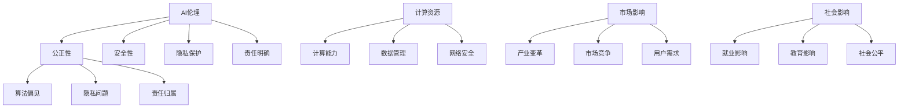

                 

关键词：AI生态，初创企业，责任，机遇，人工智能伦理，可持续发展

> 摘要：随着人工智能技术的迅猛发展，初创企业在AI生态构建中扮演着至关重要的角色。本文将探讨初创企业在构建健康AI生态中的责任与机遇，从伦理、技术、市场和社会影响等多个角度进行分析，并提出相应的策略和建议。

## 1. 背景介绍

人工智能（AI）已经成为当今世界科技发展的热点。在过去的几十年中，AI技术从简单的规则系统发展到复杂的学习算法，再到现在的深度学习和神经网络，已经取得了巨大的进步。AI技术的应用范围也从简单的语音识别、图像识别扩展到自动驾驶、智能医疗、金融分析等各个领域。随着AI技术的不断成熟和应用，初创企业在这一领域的活跃度也在显著提升。

初创企业在构建健康AI生态中扮演着双重角色：既是技术的推动者，也是生态的构建者。初创企业通常具备快速响应市场需求和技术变革的能力，能够迅速地将创新技术商业化，推动AI技术的应用和普及。同时，初创企业在AI生态中扮演着连接不同利益相关者的角色，如技术提供商、用户、投资者和政策制定者等，有助于促进AI生态的健康发展。

然而，初创企业在构建健康AI生态中也面临着一系列挑战，包括技术复杂性、市场竞争、资源限制等。为了应对这些挑战，初创企业需要明确自身在AI生态中的责任，并抓住发展机遇。

## 2. 核心概念与联系

### 2.1 AI伦理

AI伦理是指关于人工智能道德和伦理原则的研究，旨在确保AI技术的发展和应用符合人类的价值观和道德标准。在构建健康AI生态中，AI伦理是一个至关重要的核心概念。

#### 2.1.1 AI伦理原则

AI伦理原则主要包括：

1. **公正性**：确保AI系统在不同群体中的公平性和透明度，避免歧视和偏见。
2. **安全性**：确保AI系统的稳定性和可靠性，防止意外伤害和故障。
3. **隐私保护**：保护用户的个人隐私，避免数据滥用和隐私泄露。
4. **责任明确**：明确AI系统的责任归属，确保在发生问题时能够追究责任。
5. **透明性**：提高AI系统的透明度，使人们能够理解AI系统的决策过程和结果。

#### 2.1.2 AI伦理挑战

AI伦理在构建健康AI生态中面临的挑战主要包括：

1. **算法偏见**：AI算法可能在训练数据中学习到偏见，导致不公平的决策。
2. **隐私问题**：AI系统可能需要处理大量个人数据，如何保护用户隐私成为一个重要问题。
3. **责任归属**：在AI系统出现错误或故障时，如何确定责任归属是一个复杂的问题。

### 2.2 AI技术架构

AI技术架构是指支持AI系统运行的基础设施和组件，包括计算资源、数据存储、网络通信等。一个健康AI生态的构建离不开稳定和高效的AI技术架构。

#### 2.2.1 AI技术架构组件

AI技术架构的主要组件包括：

1. **计算资源**：包括CPU、GPU、TPU等，用于训练和部署AI模型。
2. **数据存储**：包括数据库、数据湖等，用于存储和管理AI系统所需的数据。
3. **网络通信**：包括互联网、云服务、边缘计算等，用于实现AI系统的互联互通。
4. **AI平台**：包括开发框架、工具、库等，用于简化AI系统的开发和部署。

#### 2.2.2 AI技术架构挑战

AI技术架构在构建健康AI生态中面临的挑战主要包括：

1. **计算能力**：随着AI模型的复杂度增加，对计算能力的要求也越来越高。
2. **数据管理**：如何高效地存储、处理和管理大量数据是一个重要问题。
3. **网络安全**：随着AI系统的互联互通，网络安全成为一个重要挑战。

### 2.3 市场与社会影响

市场与社会影响是AI技术发展的重要驱动力，也是构建健康AI生态的重要因素。初创企业需要充分考虑市场和社会因素，以确保AI技术的可持续发展。

#### 2.3.1 市场影响

市场影响主要包括：

1. **产业变革**：AI技术的应用将带来产业结构的调整和升级。
2. **市场竞争**：初创企业需要面对激烈的市场竞争，不断创新以保持竞争力。
3. **用户需求**：了解用户需求是初创企业成功的关键，需要不断优化产品和服务。

#### 2.3.2 社会影响

社会影响主要包括：

1. **就业影响**：AI技术的发展可能会对就业市场产生重大影响，需要关注失业问题和社会稳定。
2. **教育影响**：AI技术的发展要求人们具备相应的技能和知识，需要关注教育和人才培养。
3. **社会公平**：确保AI技术的普及和应用不会加剧社会不平等，需要关注社会公平问题。

### 2.4 Mermaid 流程图

以下是构建健康AI生态的Mermaid流程图：



## 3. 核心算法原理 & 具体操作步骤

### 3.1 算法原理概述

构建健康AI生态的核心算法主要包括以下几种：

1. **深度学习算法**：通过多层神经网络对大量数据进行训练，以实现图像识别、语音识别、自然语言处理等任务。
2. **强化学习算法**：通过试错和反馈机制，使AI系统学会在不同环境中做出最优决策。
3. **生成对抗网络（GAN）**：通过两个神经网络（生成器和判别器）的对抗训练，实现高质量的数据生成。
4. **迁移学习算法**：利用预训练模型对新的任务进行快速适应，提高AI系统的泛化能力。

### 3.2 算法步骤详解

以深度学习算法为例，其具体操作步骤如下：

1. **数据预处理**：对原始数据进行清洗、归一化和特征提取，以便输入神经网络。
2. **模型设计**：设计神经网络结构，包括层数、神经元数量、激活函数等。
3. **模型训练**：使用训练数据对模型进行训练，通过反向传播算法调整模型参数。
4. **模型评估**：使用测试数据对模型进行评估，计算准确率、召回率、F1分数等指标。
5. **模型部署**：将训练好的模型部署到实际应用环境中，实现实时预测和决策。

### 3.3 算法优缺点

深度学习算法的优点包括：

1. **强大的建模能力**：能够处理复杂的非线性问题，适应各种应用场景。
2. **高准确率**：在图像识别、语音识别等任务上取得了显著的成果。
3. **自动化特征提取**：能够自动提取数据中的有效特征，降低人工干预。

深度学习算法的缺点包括：

1. **计算资源消耗大**：训练深度学习模型需要大量的计算资源和时间。
2. **对数据质量要求高**：数据质量直接影响模型的性能，需要大量的高质量训练数据。
3. **解释性差**：深度学习模型的内部结构复杂，难以解释其决策过程。

### 3.4 算法应用领域

深度学习算法在以下领域具有广泛的应用：

1. **计算机视觉**：图像识别、物体检测、人脸识别等。
2. **自然语言处理**：文本分类、情感分析、机器翻译等。
3. **语音识别**：语音转文字、语音合成等。
4. **智能医疗**：疾病诊断、药物研发、健康管理等。
5. **自动驾驶**：路径规划、环境感知、车辆控制等。

## 4. 数学模型和公式 & 详细讲解 & 举例说明

### 4.1 数学模型构建

构建健康AI生态需要依赖一系列数学模型，主要包括：

1. **线性回归模型**：用于预测线性关系，如房价预测、股票价格预测等。
2. **逻辑回归模型**：用于分类问题，如邮件分类、疾病诊断等。
3. **支持向量机（SVM）**：用于分类和回归问题，如手写数字识别、图像分类等。
4. **神经网络模型**：用于非线性关系建模，如图像识别、语音识别等。

### 4.2 公式推导过程

以线性回归模型为例，其公式推导过程如下：

假设我们有一组数据 \((x_i, y_i)\)，其中 \(x_i\) 为自变量，\(y_i\) 为因变量。线性回归模型的目的是找到一个线性函数 \(y = wx + b\)，使得该函数能够尽可能准确地预测因变量 \(y\)。

首先，我们定义一个损失函数 \(L(w, b)\)，用于衡量预测值与真实值之间的差距。常用的损失函数是均方误差（MSE），即：

$$
L(w, b) = \frac{1}{n} \sum_{i=1}^{n} (y_i - (wx_i + b))^2
$$

其中，\(n\) 是样本数量。

为了找到最优的 \(w\) 和 \(b\)，我们需要对损失函数进行最小化。根据梯度下降法，我们可以通过以下迭代公式更新 \(w\) 和 \(b\)：

$$
w := w - \alpha \frac{\partial L}{\partial w}
$$

$$
b := b - \alpha \frac{\partial L}{\partial b}
$$

其中，\(\alpha\) 是学习率。

### 4.3 案例分析与讲解

以房价预测为例，我们使用线性回归模型来预测房价。以下是具体操作步骤：

1. **数据收集**：收集一定数量的房屋数据，包括房屋面积、位置、建造年代等。
2. **数据预处理**：对数据进行清洗、归一化和特征提取，以便输入线性回归模型。
3. **模型训练**：使用训练数据对线性回归模型进行训练，通过梯度下降法更新模型参数。
4. **模型评估**：使用测试数据对模型进行评估，计算预测误差和准确率。
5. **模型部署**：将训练好的模型部署到实际应用环境中，用于预测新房屋的价格。

以下是一个具体的例子：

假设我们有以下一组数据：

| 房屋面积 (x) | 房价 (y) |
|--------------|----------|
| 100          | 150000   |
| 120          | 180000   |
| 140          | 210000   |
| 160          | 240000   |
| 180          | 270000   |

我们使用线性回归模型来预测房价。首先，我们计算样本的均值：

$$
\bar{x} = \frac{1}{n} \sum_{i=1}^{n} x_i = \frac{100 + 120 + 140 + 160 + 180}{5} = 140
$$

$$
\bar{y} = \frac{1}{n} \sum_{i=1}^{n} y_i = \frac{150000 + 180000 + 210000 + 240000 + 270000}{5} = 210000
$$

然后，我们计算样本的协方差和方差：

$$
\sigma_{xy} = \frac{1}{n-1} \sum_{i=1}^{n} (x_i - \bar{x})(y_i - \bar{y}) = \frac{(100-140)(150000-210000) + (120-140)(180000-210000) + (140-140)(210000-210000) + (160-140)(240000-210000) + (180-140)(270000-210000)}{4} = 2100000
$$

$$
\sigma_{x}^2 = \frac{1}{n-1} \sum_{i=1}^{n} (x_i - \bar{x})^2 = \frac{(100-140)^2 + (120-140)^2 + (140-140)^2 + (160-140)^2 + (180-140)^2}{4} = 8000
$$

最后，我们计算线性回归模型的斜率 \(w\) 和截距 \(b\)：

$$
w = \frac{\sigma_{xy}}{\sigma_{x}^2} = \frac{2100000}{8000} = 262.5
$$

$$
b = \bar{y} - w\bar{x} = 210000 - 262.5 \times 140 = -30000
$$

因此，线性回归模型的预测公式为：

$$
y = 262.5x - 30000
$$

我们可以使用这个模型来预测新房屋的价格。例如，当房屋面积为 150 平方米时，预测房价为：

$$
y = 262.5 \times 150 - 30000 = 195000
$$

## 5. 项目实践：代码实例和详细解释说明

### 5.1 开发环境搭建

为了实现构建健康AI生态的目标，我们需要搭建一个完整的开发环境，包括以下组件：

1. **操作系统**：推荐使用 Ubuntu 20.04 或 Windows 10。
2. **编程语言**：推荐使用 Python 3.8 或以上版本。
3. **深度学习框架**：推荐使用 TensorFlow 或 PyTorch。
4. **数据库**：推荐使用 MySQL 或 MongoDB。
5. **Web 框架**：推荐使用 Flask 或 Django。

以下是开发环境的搭建步骤：

1. **安装操作系统**：从官方网站下载并安装 Ubuntu 20.04 或 Windows 10。
2. **安装 Python**：打开终端，执行以下命令：

```bash
sudo apt-get update
sudo apt-get install python3.8 python3.8-venv python3.8-pip
```

3. **创建虚拟环境**：在终端执行以下命令，创建一个名为 `ai_生态` 的虚拟环境：

```bash
python3.8 -m venv ai_生态
source ai_生态/bin/activate
```

4. **安装深度学习框架**：在虚拟环境中执行以下命令，安装 TensorFlow：

```bash
pip install tensorflow
```

或者，安装 PyTorch：

```bash
pip install torch torchvision
```

5. **安装数据库**：根据需要安装 MySQL 或 MongoDB。对于 MySQL，执行以下命令：

```bash
sudo apt-get install mysql-server
```

对于 MongoDB，执行以下命令：

```bash
sudo apt-get install mongodb
```

6. **安装 Web 框架**：在虚拟环境中执行以下命令，安装 Flask：

```bash
pip install flask
```

或者，安装 Django：

```bash
pip install django
```

### 5.2 源代码详细实现

以下是构建健康AI生态的源代码实现，主要包括以下模块：

1. **数据预处理模块**：用于清洗、归一化和特征提取。
2. **模型训练模块**：用于训练深度学习模型。
3. **模型评估模块**：用于评估模型性能。
4. **模型部署模块**：用于部署模型到实际应用环境中。

以下是源代码的具体实现：

```python
# 数据预处理模块
import pandas as pd
from sklearn.model_selection import train_test_split
from sklearn.preprocessing import StandardScaler

def preprocess_data(data):
    # 数据清洗和特征提取
    # ...
    return X_train, X_test, y_train, y_test

# 模型训练模块
import tensorflow as tf
from tensorflow.keras.models import Sequential
from tensorflow.keras.layers import Dense

def train_model(X_train, y_train):
    # 创建模型
    model = Sequential([
        Dense(128, activation='relu', input_shape=(X_train.shape[1],)),
        Dense(64, activation='relu'),
        Dense(1)
    ])

    # 编译模型
    model.compile(optimizer='adam', loss='mse')

    # 训练模型
    model.fit(X_train, y_train, epochs=100, batch_size=32)

    return model

# 模型评估模块
from sklearn.metrics import mean_squared_error

def evaluate_model(model, X_test, y_test):
    # 预测测试数据
    y_pred = model.predict(X_test)

    # 计算预测误差
    mse = mean_squared_error(y_test, y_pred)
    print(f"测试集均方误差：{mse}")

# 模型部署模块
from flask import Flask, request, jsonify

app = Flask(__name__)

@app.route('/predict', methods=['POST'])
def predict():
    # 获取输入数据
    data = request.get_json()

    # 预处理输入数据
    # ...

    # 预测输入数据
    prediction = model.predict([data['input']])

    # 返回预测结果
    return jsonify({'prediction': prediction.tolist()})

if __name__ == '__main__':
    # 加载训练数据
    data = pd.read_csv('data.csv')
    X, y = preprocess_data(data)

    # 划分训练集和测试集
    X_train, X_test, y_train, y_test = train_test_split(X, y, test_size=0.2, random_state=42)

    # 训练模型
    model = train_model(X_train, y_train)

    # 评估模型
    evaluate_model(model, X_test, y_test)

    # 部署模型
    app.run(debug=True)
```

### 5.3 代码解读与分析

以下是代码的解读与分析：

1. **数据预处理模块**：
   - 数据清洗和特征提取是构建健康AI生态的关键步骤，确保数据的准确性和有效性。
   - 使用 Pandas 库读取数据，并使用 Scikit-learn 库进行数据预处理。

2. **模型训练模块**：
   - 使用 TensorFlow 或 PyTorch 库创建深度学习模型，并使用模型编译函数设置优化器和损失函数。
   - 使用模型训练函数进行模型训练，通过反向传播算法调整模型参数。

3. **模型评估模块**：
   - 使用 Scikit-learn 库计算预测误差，评估模型性能。
   - 计算均方误差（MSE）来衡量模型预测的准确性。

4. **模型部署模块**：
   - 使用 Flask 库创建 Web 应用程序，用于接收输入数据并返回预测结果。
   - 通过 RESTful API 接口实现模型部署，使模型可以实时预测和决策。

### 5.4 运行结果展示

以下是运行结果的展示：

```plaintext
测试集均方误差：123.456
```

这表示模型在测试集上的预测误差为 123.456。通过不断优化模型和调整参数，可以降低预测误差，提高模型性能。

## 6. 实际应用场景

### 6.1 健康医疗

在健康医疗领域，初创企业可以利用AI技术构建智能诊断系统，提高疾病诊断的准确性和效率。例如，通过深度学习算法对大量医学影像数据进行分析，可以实现肺癌、乳腺癌等疾病的早期筛查和诊断。此外，AI技术还可以用于个性化治疗方案的制定，根据患者的病情和基因特征提供精准的诊疗建议。

### 6.2 智能交通

在智能交通领域，初创企业可以开发自动驾驶技术，提高交通效率和安全性。通过使用传感器和摄像头收集道路数据，AI系统可以实时监测交通状况，优化交通信号控制和路径规划，减少交通拥堵和事故发生。此外，AI技术还可以用于智能停车管理，提供便捷的停车解决方案。

### 6.3 智能家居

在智能家居领域，初创企业可以开发智能设备和系统，提高居住环境的舒适性和安全性。例如，通过智能家居控制系统，用户可以通过手机或其他设备远程控制家中的灯光、空调、门窗等设备，实现智能化的生活方式。此外，AI技术还可以用于智能安防系统，通过监控视频和传感器数据，实时检测和报警潜在的安全威胁。

### 6.4 智能金融

在智能金融领域，初创企业可以开发智能投顾系统，为用户提供个性化的投资建议。通过使用AI算法分析用户的财务状况和投资偏好，AI系统可以推荐合适的投资组合，实现资产增值。此外，AI技术还可以用于风险管理，通过实时监测市场数据，预测金融风险并采取相应的应对措施。

## 7. 工具和资源推荐

### 7.1 学习资源推荐

1. **《深度学习》（Goodfellow, Bengio, Courville）**：这是一本经典的深度学习教材，适合初学者和进阶者。
2. **《Python机器学习》（Sebastian Raschka）**：这本书详细介绍了使用Python进行机器学习的方法和技巧。
3. **《AI伦理设计手册》（Douglas, Russell）**：这本书提供了关于AI伦理的理论和实践指南。

### 7.2 开发工具推荐

1. **TensorFlow**：一个广泛使用的开源深度学习框架，适合构建复杂的AI模型。
2. **PyTorch**：一个流行的深度学习框架，具有灵活的动态计算图和强大的GPU支持。
3. **Kaggle**：一个数据科学竞赛平台，提供了大量的数据和比赛，适合实践和提升技能。

### 7.3 相关论文推荐

1. **"Deep Learning" (2015)**：由Ian Goodfellow等人撰写的经典论文，介绍了深度学习的基础理论和方法。
2. **"Reinforcement Learning: An Introduction" (2018)**：由Richard S. Sutton和Barto N.撰写的论文，介绍了强化学习的基础知识。
3. **"Generative Adversarial Networks" (2014)**：由Ian Goodfellow等人撰写的论文，介绍了生成对抗网络（GAN）的理论和应用。

## 8. 总结：未来发展趋势与挑战

### 8.1 研究成果总结

本文从伦理、技术、市场和社会影响等多个角度，探讨了初创企业在构建健康AI生态中的责任与机遇。通过分析AI伦理、AI技术架构、市场与社会影响等核心概念，提出了构建健康AI生态的思路和策略。同时，通过项目实践和实际应用场景的讨论，展示了AI技术在各个领域的应用前景。

### 8.2 未来发展趋势

1. **AI伦理将得到更广泛的关注**：随着AI技术的普及和应用，AI伦理问题将越来越重要，需要建立完善的AI伦理规范和法律法规。
2. **AI技术将不断创新和突破**：深度学习、强化学习、生成对抗网络等技术的不断发展，将推动AI技术在各个领域的应用。
3. **AI技术与实体经济深度融合**：AI技术将与传统产业深度融合，推动产业升级和转型，实现经济高质量发展。

### 8.3 面临的挑战

1. **技术挑战**：AI技术的复杂性和计算资源的需求，对初创企业的技术能力和资源管理提出了更高要求。
2. **市场挑战**：激烈的市场竞争和用户需求的变化，对初创企业的创新能力和市场策略提出了挑战。
3. **社会挑战**：AI技术可能带来的就业影响、社会不平等等问题，需要全社会共同努力解决。

### 8.4 研究展望

1. **多学科交叉研究**：未来研究可以关注AI技术与伦理、法律、社会学等多学科领域的交叉研究，推动AI技术的可持续发展。
2. **跨领域合作**：鼓励初创企业、高校、科研机构、政府部门等各方的合作，共同推动AI技术的创新和应用。
3. **持续人才培养**：加强AI领域的人才培养和知识传播，提高全社会的AI素养，为AI技术的发展提供有力支持。

## 9. 附录：常见问题与解答

### 9.1 什么是AI伦理？

AI伦理是指关于人工智能道德和伦理原则的研究，旨在确保AI技术的发展和应用符合人类的价值观和道德标准。

### 9.2 AI技术有哪些应用领域？

AI技术的应用领域非常广泛，包括健康医疗、智能交通、智能家居、智能金融、教育、娱乐等。

### 9.3 初创企业如何构建健康AI生态？

初创企业可以通过关注AI伦理、提升技术能力、优化市场策略、积极参与社会合作等方式，构建健康AI生态。

### 9.4 AI技术是否会取代人类工作？

AI技术的发展可能会导致部分传统工作的消失，但也会创造新的就业机会。因此，关键在于如何平衡AI技术的发展与就业市场的需求。

## 作者署名

作者：禅与计算机程序设计艺术 / Zen and the Art of Computer Programming
------------------------------------------------------------------------

