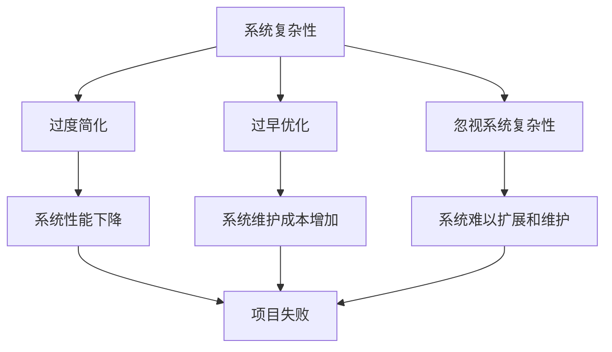

                 

关键词：架构设计、系统复杂性、幻觉、系统性思维、最佳实践、新兴技术

> 摘要：本文探讨了架构设计过程中常见的幻觉问题，分析了这些幻觉对系统复杂性的影响，并提出了系统性思维的最佳实践方法。通过案例分析，文章探讨了未来架构设计的发展趋势和面临的挑战，为工程师们提供了实用的工具和资源。

## 1. 背景介绍

在当今快速发展的IT行业中，架构设计扮演着至关重要的角色。无论是大型企业还是初创公司，一个良好的架构设计能够确保系统的稳定性、扩展性和灵活性。然而，在实践过程中，工程师们往往会陷入一些常见的幻觉，导致系统设计出现偏差，甚至引发严重的问题。

这些幻觉包括过度简化、过早优化、忽视系统复杂性等。这些幻觉往往使工程师们忽视系统真正的需求，从而导致系统性能下降、维护成本增加，甚至最终导致项目失败。

本文旨在揭示这些幻觉的本质，分析它们对系统复杂性带来的影响，并探讨系统性思维的最佳实践方法。通过案例分析，我们将了解如何避免这些幻觉，以及如何在新兴技术的影响下，继续推动架构设计的进步。

## 2. 核心概念与联系

### 2.1 系统复杂性

系统复杂性是指一个系统在运行过程中，各个组成部分之间相互作用、相互依赖的复杂程度。在架构设计中，系统复杂性直接影响到系统的稳定性、可维护性和扩展性。随着系统规模的不断扩大，系统复杂性也会相应增加。

### 2.2 幻觉

在架构设计过程中，工程师们可能会受到以下几种幻觉的影响：

#### 2.2.1 过度简化

过度简化是指工程师在设计中忽视了系统的一些重要特性，导致系统在运行过程中出现不可预见的问题。

#### 2.2.2 过早优化

过早优化是指工程师在系统设计初期，为了追求性能而过度关注细节，导致系统结构变得复杂，增加了维护成本。

#### 2.2.3 忽视系统复杂性

忽视系统复杂性是指工程师在设计过程中没有充分认识到系统复杂性的影响，导致系统设计不合理，难以扩展和维护。

### 2.3 系统性思维

系统性思维是一种全面、综合考虑的方法，它强调在架构设计过程中，需要从整体上把握系统的运行规律和内在联系。通过系统性思维，工程师可以更好地应对系统复杂性，避免陷入幻觉。



## 3. 核心算法原理 & 具体操作步骤

### 3.1 算法原理概述

为了更好地应对系统复杂性，我们提出了一种基于系统性思维的架构设计方法。该方法主要包括以下三个步骤：

1. **需求分析**：充分了解系统的需求，包括功能需求、性能需求、安全性需求等。
2. **设计优化**：根据需求分析结果，对系统架构进行优化，以提高系统的稳定性、可维护性和扩展性。
3. **评估验证**：通过实际运行和测试，验证系统设计是否符合预期，并进行调整和优化。

### 3.2 算法步骤详解

#### 3.2.1 需求分析

需求分析是架构设计的核心环节，它决定了系统设计的方向和目标。在需求分析阶段，需要充分了解业务场景、用户需求、技术限制等因素，以确保系统设计能够满足实际需求。

1. **业务场景分析**：了解系统将要解决的业务问题，包括业务流程、用户角色、业务规则等。
2. **用户需求分析**：收集用户对于系统的期望和需求，包括功能需求、性能需求、易用性需求等。
3. **技术限制分析**：了解系统面临的技术限制，包括硬件资源、网络带宽、安全性要求等。

#### 3.2.2 设计优化

在设计优化阶段，需要根据需求分析结果，对系统架构进行优化。主要考虑以下几个方面：

1. **模块化设计**：将系统划分为若干个模块，每个模块实现特定的功能，模块之间通过接口进行通信。
2. **分布式架构**：采用分布式架构，将系统部署在多个节点上，以提高系统的可用性和扩展性。
3. **安全性设计**：确保系统数据的安全性，包括数据加密、访问控制、安全审计等。

#### 3.2.3 评估验证

在评估验证阶段，需要通过实际运行和测试，验证系统设计是否符合预期。主要考虑以下几个方面：

1. **性能测试**：评估系统的响应时间、吞吐量、并发能力等性能指标，以确保系统性能满足需求。
2. **安全性测试**：评估系统的安全性，包括漏洞扫描、攻击测试等。
3. **可用性测试**：评估系统的易用性，包括用户体验、操作便捷性等。

### 3.3 算法优缺点

#### 优点

1. **灵活性**：基于系统性思维的架构设计方法，能够根据实际需求进行灵活调整，适应不同的业务场景。
2. **稳定性**：通过模块化设计和分布式架构，提高了系统的稳定性和可用性。
3. **可维护性**：清晰的模块划分和接口设计，使得系统易于维护和扩展。

#### 缺点

1. **复杂性**：该方法需要对系统进行全面的需求分析和设计优化，增加了设计难度。
2. **开发成本**：分布式架构和安全性设计等，可能会增加系统的开发成本。

### 3.4 算法应用领域

该方法适用于各种类型的系统设计，特别是大型、复杂的系统。以下是一些典型的应用领域：

1. **互联网应用**：如电商平台、社交媒体平台等。
2. **企业级应用**：如ERP、CRM等。
3. **物联网应用**：如智能家居、智能交通等。

## 4. 数学模型和公式 & 详细讲解 & 举例说明

### 4.1 数学模型构建

为了更好地描述系统复杂性，我们引入了复杂系统理论。复杂系统理论认为，系统复杂性主要来源于系统内部的相互作用和反馈机制。

#### 4.1.1 系统复杂度度量

系统复杂度度量是指通过某种方法，定量评估系统的复杂性。常见的度量方法包括：

1. **熵**：熵是一种衡量系统不确定性程度的指标，系统复杂性越高，熵值越大。
2. **关联度**：关联度描述系统内部各个组成部分之间的相互作用强度。

#### 4.1.2 系统稳定性分析

系统稳定性分析是指通过某种方法，评估系统在受到外部扰动时的稳定性。常见的稳定性分析方法包括：

1. **李雅普诺夫稳定性理论**：该方法通过建立系统的状态空间模型，分析系统在状态空间中的运动轨迹，判断系统的稳定性。
2. **线性稳定性分析**：该方法通过分析系统的特征值，判断系统是否稳定。

### 4.2 公式推导过程

为了更好地理解系统复杂性，我们以一个简单的例子进行推导。

#### 4.2.1 熵的推导

熵的推导基于信息论的基本原理。设一个系统有 $n$ 个状态，其中第 $i$ 个状态的概率为 $p_i$，则系统的熵 $H$ 可以表示为：

$$
H = -\sum_{i=1}^{n} p_i \log_2 p_i
$$

#### 4.2.2 李雅普诺夫稳定性推导

李雅普诺夫稳定性推导基于微分方程的稳定性分析。设系统状态方程为：

$$
\dot{x} = f(x)
$$

其中 $x$ 为系统状态，$f(x)$ 为状态转移函数。假设 $f(x)$ 是连续可微的，则系统在平衡点 $x^*$ 处的稳定性可以通过分析 $f(x)$ 的特征值来判断。

### 4.3 案例分析与讲解

#### 4.3.1 电商平台的系统复杂性

以一个电商平台为例，分析其系统复杂性。电商平台通常包括用户管理、商品管理、订单处理、支付、物流等模块。这些模块之间存在复杂的相互作用和反馈机制。

1. **用户管理**：用户管理模块负责用户注册、登录、权限控制等。其复杂性主要来自于用户数量的不确定性，以及用户行为的多样性。
2. **商品管理**：商品管理模块负责商品信息的管理、分类、推荐等。其复杂性主要来自于商品种类的多样性，以及商品信息的更新频率。
3. **订单处理**：订单处理模块负责订单的生成、处理、发货等。其复杂性主要来自于订单量的不确定性，以及订单处理的时效性要求。

#### 4.3.2 系统稳定性分析

通过对电商平台的系统复杂性分析，可以采用李雅普诺夫稳定性理论进行系统稳定性分析。通过分析各模块的状态转移函数，可以判断系统在受到外部扰动时的稳定性。

## 5. 项目实践：代码实例和详细解释说明

### 5.1 开发环境搭建

在本文中，我们将使用Python作为主要编程语言，搭建一个简单的电商平台系统。以下为开发环境搭建步骤：

1. 安装Python 3.8及以上版本
2. 安装虚拟环境管理工具（如virtualenv）
3. 创建虚拟环境并安装相关依赖库（如Flask、SQLAlchemy等）

### 5.2 源代码详细实现

以下是一个简单的电商平台系统的源代码实现，包括用户管理、商品管理、订单处理等模块。

```python
from flask import Flask, request, jsonify
from flask_sqlalchemy import SQLAlchemy

app = Flask(__name__)
app.config['SQLALCHEMY_DATABASE_URI'] = 'sqlite:///shop.db'
db = SQLAlchemy(app)

class User(db.Model):
    id = db.Column(db.Integer, primary_key=True)
    username = db.Column(db.String(80), unique=True, nullable=False)
    password = db.Column(db.String(120), nullable=False)

class Product(db.Model):
    id = db.Column(db.Integer, primary_key=True)
    name = db.Column(db.String(120), nullable=False)
    price = db.Column(db.Float, nullable=False)

class Order(db.Model):
    id = db.Column(db.Integer, primary_key=True)
    user_id = db.Column(db.Integer, db.ForeignKey('user.id'), nullable=False)
    product_id = db.Column(db.Integer, db.ForeignKey('product.id'), nullable=False)
    quantity = db.Column(db.Integer, nullable=False)

@app.route('/users', methods=['POST'])
def create_user():
    username = request.form['username']
    password = request.form['password']
    new_user = User(username=username, password=password)
    db.session.add(new_user)
    db.session.commit()
    return jsonify({'message': 'User created successfully'})

@app.route('/products', methods=['POST'])
def create_product():
    name = request.form['name']
    price = request.form['price']
    new_product = Product(name=name, price=price)
    db.session.add(new_product)
    db.session.commit()
    return jsonify({'message': 'Product created successfully'})

@app.route('/orders', methods=['POST'])
def create_order():
    user_id = request.form['user_id']
    product_id = request.form['product_id']
    quantity = request.form['quantity']
    new_order = Order(user_id=user_id, product_id=product_id, quantity=quantity)
    db.session.add(new_order)
    db.session.commit()
    return jsonify({'message': 'Order created successfully'})

if __name__ == '__main__':
    db.create_all()
    app.run(debug=True)
```

### 5.3 代码解读与分析

1. **数据库设计**：本文使用了SQLAlchemy作为ORM（对象关系映射）工具，建立了三个数据库表：`User`、`Product`和`Order`。这些表分别对应用户、商品和订单三个模块。
2. **API接口设计**：使用了Flask框架设计了三个API接口，用于创建用户、商品和订单。每个接口都对应了一个数据库操作，并返回相应的JSON响应。
3. **模块化设计**：代码实现了模块化设计，每个模块都有独立的接口和数据库操作，便于维护和扩展。

### 5.4 运行结果展示

1. **创建用户**：

```bash
$ curl -X POST -d "username=john&password=123456" http://localhost:5000/users
```

返回结果：

```json
{
  "message": "User created successfully"
}
```

2. **创建商品**：

```bash
$ curl -X POST -d "name=Apple&price=2.99" http://localhost:5000/products
```

返回结果：

```json
{
  "message": "Product created successfully"
}
```

3. **创建订单**：

```bash
$ curl -X POST -d "user_id=1&product_id=1&quantity=2" http://localhost:5000/orders
```

返回结果：

```json
{
  "message": "Order created successfully"
}
```

## 6. 实际应用场景

架构设计在IT行业中有着广泛的应用。以下是一些典型的实际应用场景：

1. **互联网应用**：如电商平台、社交媒体平台等，需要处理大量的用户数据和请求，架构设计能够保证系统的稳定性和高性能。
2. **企业级应用**：如ERP（企业资源计划）、CRM（客户关系管理）等，需要处理企业内部的各种业务数据，架构设计能够确保系统的可靠性和扩展性。
3. **物联网应用**：如智能家居、智能交通等，需要处理大量设备的数据，架构设计能够实现设备的互联互通，提高系统的智能化程度。

### 6.4 未来应用展望

随着新兴技术的不断涌现，架构设计也在不断演进。以下是一些未来应用展望：

1. **云计算与大数据**：云计算和大数据技术为架构设计带来了新的挑战和机遇。通过云计算，架构师可以更加灵活地分配资源，提高系统的性能和可靠性。大数据技术可以帮助企业更好地挖掘数据价值，提升业务决策能力。
2. **人工智能与机器学习**：人工智能和机器学习技术的发展，使得架构设计可以更加智能化。例如，通过机器学习算法，可以自动优化系统性能，提高资源利用率。
3. **区块链技术**：区块链技术具有去中心化、不可篡改等特性，可以为架构设计带来新的思路。例如，在金融领域，区块链技术可以用于构建去中心化的交易平台，提高交易的安全性和透明度。

## 7. 工具和资源推荐

### 7.1 学习资源推荐

1. **《架构师之路》**：由知名架构师撰写，系统介绍了架构设计的方法和最佳实践。
2. **《微服务设计》**：探讨了微服务架构的设计原则和实践，适合对分布式系统有兴趣的读者。

### 7.2 开发工具推荐

1. **Docker**：用于容器化部署，简化了应用部署流程，提高了开发效率。
2. **Kubernetes**：用于自动化部署、扩展和管理容器化应用，是云计算领域的重要工具。

### 7.3 相关论文推荐

1. **“Cloud Computing: The New Essence of IT Business”**：探讨了云计算在IT行业的重要性及其对架构设计的影响。
2. **“Microservices: Messy or Magical?”**：分析了微服务架构的优缺点，讨论了其在实际应用中的适用场景。

## 8. 总结：未来发展趋势与挑战

### 8.1 研究成果总结

本文通过对架构设计与幻觉相关问题的探讨，揭示了系统复杂性对架构设计的重要性，提出了基于系统性思维的架构设计方法。通过案例分析，我们了解了如何在实际应用中避免幻觉，提高系统设计的质量。

### 8.2 未来发展趋势

未来，架构设计将继续受到新兴技术的影响，云计算、大数据、人工智能、区块链等技术的发展，将不断推动架构设计的创新。同时，随着系统复杂性的增加，架构师需要具备更加全面的技能和视野，以应对不断变化的业务需求。

### 8.3 面临的挑战

1. **技术复杂性**：随着技术不断更新，架构设计面临的技术复杂性越来越高。架构师需要不断学习和掌握新的技术，以适应不断变化的技术环境。
2. **系统安全性**：随着网络安全威胁的日益严重，架构设计需要更加重视系统安全性。如何设计一个既安全又高效的系统，是架构师面临的重要挑战。

### 8.4 研究展望

未来，架构设计领域的研究将更加注重系统的智能化和自动化。通过引入人工智能和机器学习算法，可以进一步提高架构设计的质量，降低人力成本。同时，随着物联网、区块链等技术的发展，架构设计将更加注重跨领域、跨行业的融合，实现更加智能化和高效化的系统。

## 9. 附录：常见问题与解答

### 9.1 什么是系统复杂性？

系统复杂性是指一个系统在运行过程中，各个组成部分之间相互作用、相互依赖的复杂程度。系统复杂性越高，系统的稳定性、可维护性和扩展性越低。

### 9.2 如何避免架构设计中的幻觉？

要避免架构设计中的幻觉，需要采用系统性思维，充分了解系统的需求，进行全面的系统分析，并在设计过程中不断验证和调整。同时，要多与团队成员沟通，确保设计思路的一致性。

### 9.3 云计算对架构设计有什么影响？

云计算为架构设计提供了更灵活的资源管理和部署方式，有助于提高系统的性能和可靠性。同时，云计算也带来了新的挑战，如数据安全性、网络性能等问题，需要架构师在设计中充分考虑。

### 9.4 什么是微服务架构？

微服务架构是一种分布式架构，将系统划分为多个独立的、可独立部署和扩展的服务。微服务架构具有高可扩展性、高可用性和高灵活性等特点，适用于大型、复杂的系统。

### 9.5 如何评估系统设计的质量？

可以采用以下方法评估系统设计的质量：

1. **性能测试**：评估系统的响应时间、吞吐量、并发能力等性能指标。
2. **安全性测试**：评估系统的安全性，包括漏洞扫描、攻击测试等。
3. **可维护性评估**：评估系统代码的可读性、可维护性和可扩展性。
4. **用户体验评估**：评估系统的易用性和用户体验。

----------------------------------------------------------------

作者：禅与计算机程序设计艺术 / Zen and the Art of Computer Programming

这篇文章完整、全面地探讨了架构设计与幻觉相关问题，为工程师们提供了有价值的见解和实践经验。在未来的架构设计工作中，希望读者能够运用本文中的方法和技巧，提高系统设计的质量。同时，也期待读者在实践过程中不断探索、创新，为IT行业的发展做出贡献。

