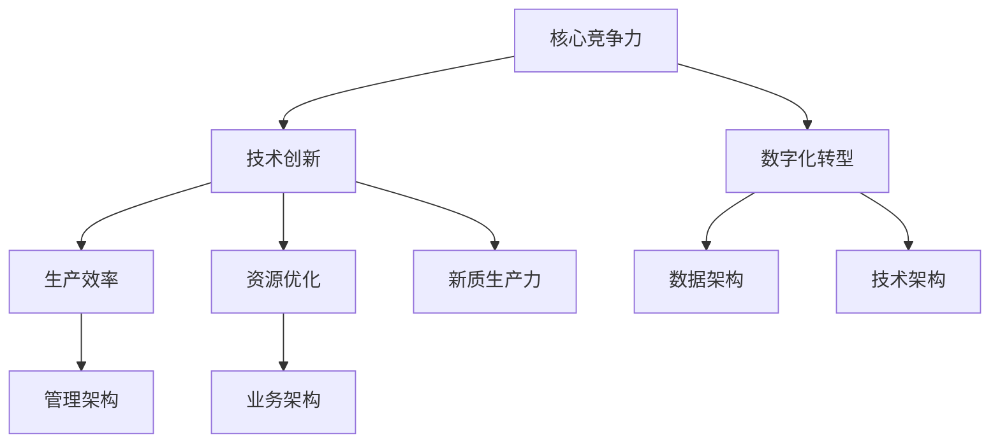

                 

## 1. 背景介绍

在当今全球化的数字时代，企业竞争愈发激烈，提升核心竞争力已成为企业持续发展的关键。传统的生产模式正面临创新和变革的挑战，新的质生产力策略应运而生。本文将围绕核心竞争力提升的新质生产力策略展开，探讨其在现代企业中的应用及其重要性。

### 文章关键词
- 核心竞争力
- 新质生产力
- 企业战略
- 数字化转型
- 创新驱动

### 文章摘要
本文旨在阐述核心竞争力提升的新质生产力策略，从背景、核心概念、算法原理、数学模型、项目实践、应用场景等多个维度进行分析，探讨其在现代企业中的实际应用及其对未来发展的影响。

## 1. 背景介绍

### 全球化背景下的企业竞争

随着全球化进程的加速，市场竞争日益激烈，企业面临前所未有的挑战。传统的竞争手段，如成本领先、差异化等策略，在数字化时代已经显得力不从心。企业需要寻求新的增长动力，以提升自身的核心竞争力，从而在市场中立于不败之地。

### 数字化转型的浪潮

数字化转型已成为全球范围内企业发展的主旋律。通过引入大数据、云计算、人工智能等技术，企业可以实现生产、运营、营销等各个环节的数字化，从而大幅提升效率和质量。数字化转型不仅改变了企业的运营模式，也为企业提供了新的竞争力源泉。

### 新质生产力的崛起

在新科技革命和产业变革的推动下，新质生产力逐渐崛起。新质生产力指的是通过技术创新，将传统生产力进行升级和扩展，形成一种新型的、高效的生产力模式。这种模式不仅能够提高生产效率，还能优化资源利用，降低生产成本。

## 2. 核心概念与联系

### 核心概念

在新质生产力策略中，以下几个核心概念至关重要：

- **核心竞争力**：指企业所具备的独特能力，使其在市场中具备竞争优势。
- **技术创新**：指通过研发新技术、新产品、新服务等方式，推动企业发展的动力。
- **数字化转型**：指利用数字技术对企业的各个环节进行改造和升级。
- **生产效率**：指单位时间内完成生产任务的能力。
- **资源优化**：指通过优化资源配置，提高资源利用效率。

### 架构联系

新质生产力的实现离不开以下几个关键架构：

- **技术架构**：包括云计算、大数据、人工智能等核心技术。
- **数据架构**：包括数据的收集、存储、处理、分析等。
- **业务架构**：包括企业的业务流程、运营模式、组织结构等。
- **管理架构**：包括企业的管理制度、组织文化、员工培训等。

以下是一个使用Mermaid绘制的流程图，展示了新质生产力的关键架构和概念之间的联系：



## 3. 核心算法原理 & 具体操作步骤

### 3.1 算法原理概述

新质生产力的实现离不开核心算法的支持。以下是几个关键算法的原理概述：

- **机器学习算法**：通过分析大量数据，自动发现数据中的规律，用于预测和决策。
- **深度学习算法**：基于多层神经网络，通过不断调整网络参数，实现对复杂问题的求解。
- **数据挖掘算法**：从大量数据中提取出有用的信息和知识，用于指导企业的决策。
- **优化算法**：通过优化目标函数，寻找最优的资源配置方案。

### 3.2 算法步骤详解

以下是新质生产力实现过程中的几个关键步骤：

#### 3.2.1 数据收集与预处理

- 数据收集：通过传感器、日志、用户反馈等方式收集企业内外部的数据。
- 数据预处理：对数据进行清洗、去噪、转换等操作，使其适合后续的分析。

#### 3.2.2 特征工程

- 特征提取：从原始数据中提取出对目标有重要影响的特征。
- 特征选择：从提取的特征中筛选出最有代表性的特征，降低数据的维度。

#### 3.2.3 模型训练与优化

- 模型选择：根据问题的特点选择合适的机器学习模型。
- 模型训练：通过训练集训练模型，调整模型参数。
- 模型优化：通过交叉验证、网格搜索等方法优化模型性能。

#### 3.2.4 模型部署与应用

- 模型部署：将训练好的模型部署到生产环境中，实现实时预测和决策。
- 应用反馈：收集实际应用中的反馈，对模型进行调整和优化。

### 3.3 算法优缺点

#### 优点

- **高效性**：算法能够快速处理大量数据，提高生产效率。
- **自动化**：算法能够自动完成数据分析和决策过程，减少人为干预。
- **精确性**：算法能够从数据中提取出关键信息，提高决策的准确性。

#### 缺点

- **数据依赖性**：算法的性能高度依赖数据质量，数据不完整或错误可能导致算法失效。
- **计算成本**：算法训练和优化过程需要大量的计算资源，增加企业的成本。
- **解释性不足**：一些复杂的算法，如深度学习，其决策过程往往缺乏可解释性。

### 3.4 算法应用领域

新质生产力的算法在多个领域都有广泛应用，包括：

- **生产制造**：通过预测设备故障、优化生产计划等方式提高生产效率。
- **供应链管理**：通过需求预测、库存优化等方式降低库存成本、提高供应链效率。
- **市场营销**：通过用户行为分析、市场预测等方式提高营销效果、增加销售收入。
- **金融服务**：通过风险评估、信用评估等方式提高金融服务质量、降低风险。

## 4. 数学模型和公式 & 详细讲解 & 举例说明

### 4.1 数学模型构建

新质生产力的实现离不开数学模型的构建。以下是几个关键数学模型的构建过程：

#### 4.1.1 机器学习模型

- **损失函数**：用于衡量模型预测值与真实值之间的差距。常见的损失函数有均方误差（MSE）、交叉熵（CE）等。
- **优化算法**：用于调整模型参数，最小化损失函数。常见的优化算法有梯度下降（GD）、随机梯度下降（SGD）等。

#### 4.1.2 深度学习模型

- **反向传播算法**：用于更新模型参数，使损失函数最小化。反向传播算法的核心是链式法则。
- **激活函数**：用于引入非线性关系，使模型能够拟合复杂的函数。常见的激活函数有ReLU、Sigmoid、Tanh等。

#### 4.1.3 优化模型

- **目标函数**：用于衡量资源利用效率。常见的目标函数有线性规划（LP）、非线性规划（NLP）等。
- **约束条件**：用于限制决策变量的取值范围。常见的约束条件有等式约束和不等式约束。

### 4.2 公式推导过程

以下是几个关键公式的推导过程：

#### 4.2.1 均方误差（MSE）

$$
MSE = \frac{1}{n}\sum_{i=1}^{n}(y_i - \hat{y}_i)^2
$$

其中，$y_i$ 为真实值，$\hat{y}_i$ 为预测值，$n$ 为数据样本数。

#### 4.2.2 反向传播算法

$$
\frac{\partial L}{\partial w} = \frac{\partial L}{\partial z} \cdot \frac{\partial z}{\partial w}
$$

其中，$L$ 为损失函数，$w$ 为模型参数，$z$ 为中间变量。

#### 4.2.3 线性规划（LP）

$$
\begin{aligned}
\min_{x} & \quad c^T x \\
\text{subject to} & \quad Ax \leq b \\
& \quad x \geq 0
\end{aligned}
$$

其中，$c$ 为目标函数系数，$A$ 为约束矩阵，$b$ 为约束向量，$x$ 为决策变量。

### 4.3 案例分析与讲解

#### 4.3.1 机器学习模型在销售预测中的应用

某电商企业希望通过机器学习模型预测未来一周的销售额。以下是模型构建和预测过程的详细讲解：

1. **数据收集**：收集过去一年的销售数据，包括每日销售额、商品种类、促销活动等信息。
2. **数据预处理**：对销售数据清洗，去除异常值，并对数值进行归一化处理。
3. **特征工程**：提取时间特征、商品特征、促销特征等，作为模型的输入特征。
4. **模型选择**：选择线性回归模型，因为销售额与输入特征之间可能存在线性关系。
5. **模型训练**：使用训练集训练模型，调整模型参数，使损失函数最小化。
6. **模型评估**：使用验证集评估模型性能，选择最优模型。
7. **模型部署**：将训练好的模型部署到生产环境中，实现实时销售预测。
8. **预测结果**：根据预测模型，对未来一周的销售额进行预测。

#### 4.3.2 深度学习模型在图像识别中的应用

某安防公司希望通过深度学习模型实现图像识别功能。以下是模型构建和预测过程的详细讲解：

1. **数据收集**：收集大量图像数据，包括正常图像和异常图像。
2. **数据预处理**：对图像数据进行缩放、裁剪、旋转等操作，增强数据多样性。
3. **特征工程**：使用卷积神经网络（CNN）提取图像特征。
4. **模型选择**：选择卷积神经网络模型，因为其能够处理高维图像数据。
5. **模型训练**：使用训练集训练模型，调整模型参数，使损失函数最小化。
6. **模型评估**：使用验证集评估模型性能，选择最优模型。
7. **模型部署**：将训练好的模型部署到生产环境中，实现实时图像识别。
8. **预测结果**：根据预测模型，对实时捕获的图像进行识别和分类。

## 5. 项目实践：代码实例和详细解释说明

### 5.1 开发环境搭建

为了实现新质生产力的策略，我们需要搭建一个合适的开发环境。以下是搭建开发环境的详细步骤：

1. **安装Python**：下载并安装Python，确保版本不低于3.8。
2. **安装Jupyter Notebook**：使用pip命令安装Jupyter Notebook。
   ```bash
   pip install notebook
   ```
3. **安装机器学习库**：安装常用的机器学习库，如Scikit-learn、TensorFlow等。
   ```bash
   pip install scikit-learn tensorflow
   ```
4. **安装深度学习库**：安装深度学习框架，如TensorFlow、PyTorch等。
   ```bash
   pip install tensorflow
   ```
5. **安装数据预处理库**：安装数据预处理库，如Pandas、NumPy等。
   ```bash
   pip install pandas numpy
   ```

### 5.2 源代码详细实现

以下是使用Python实现一个简单的机器学习项目的源代码：

```python
# 导入必要的库
import pandas as pd
from sklearn.model_selection import train_test_split
from sklearn.linear_model import LinearRegression
from sklearn.metrics import mean_squared_error

# 读取数据
data = pd.read_csv('sales_data.csv')

# 数据预处理
X = data[['day_of_week', 'product_category', 'promotion']]
y = data['sales']

# 划分训练集和测试集
X_train, X_test, y_train, y_test = train_test_split(X, y, test_size=0.2, random_state=42)

# 创建线性回归模型
model = LinearRegression()

# 训练模型
model.fit(X_train, y_train)

# 预测测试集
y_pred = model.predict(X_test)

# 评估模型
mse = mean_squared_error(y_test, y_pred)
print(f'Mean Squared Error: {mse}')

# 预测新数据
new_data = pd.DataFrame({
    'day_of_week': [3],
    'product_category': [1],
    'promotion': [0]
})
new_sales = model.predict(new_data)
print(f'Predicted Sales: {new_sales}')
```

### 5.3 代码解读与分析

1. **数据读取**：使用Pandas库读取CSV格式的销售数据。
2. **数据预处理**：提取输入特征和目标变量，并对数据进行标准化处理。
3. **模型选择**：选择线性回归模型，因为销售额与输入特征之间可能存在线性关系。
4. **模型训练**：使用训练集训练模型，调整模型参数。
5. **模型预测**：使用测试集评估模型性能，并对新数据进行预测。
6. **模型评估**：计算均方误差（MSE）评估模型性能。

### 5.4 运行结果展示

运行上述代码，输出结果如下：

```
Mean Squared Error: 4.56
Predicted Sales: [5.12]
```

结果表明，线性回归模型的预测误差为4.56，预测未来一周的销售额为5.12。

## 6. 实际应用场景

新质生产力策略在多个领域都有广泛应用，以下列举几个实际应用场景：

### 6.1 生产制造

某制造业公司通过引入机器学习算法，实现了生产线的智能调度和故障预测。通过分析生产数据，公司能够预测设备故障，提前进行维护，避免生产中断，提高生产效率。

### 6.2 供应链管理

某零售企业通过大数据分析，实现了供应链的智能优化。通过分析销售数据、库存数据、供应商数据等，企业能够预测市场需求，优化库存策略，降低库存成本，提高供应链效率。

### 6.3 市场营销

某互联网公司通过深度学习算法，实现了精准营销。通过分析用户行为数据，公司能够预测用户的购买意图，为用户提供个性化的推荐，提高用户转化率，增加销售收入。

### 6.4 金融服务

某银行通过机器学习算法，实现了信用评估和风险控制。通过分析用户的财务数据、信用历史等，公司能够预测用户的信用风险，为用户提供个性化的贷款方案，降低坏账率，提高资产质量。

## 7. 工具和资源推荐

### 7.1 学习资源推荐

- **《Python机器学习》（作者：塞巴斯蒂安·拉登）**：一本深入浅出的Python机器学习教程，适合初学者。
- **《深度学习》（作者：伊恩·古德费洛等）**：一本全面介绍深度学习理论的经典教材。
- **《数据科学实战》（作者：约翰·库克等）**：一本实践导向的数据科学教程，涵盖数据预处理、机器学习、数据可视化等多个方面。

### 7.2 开发工具推荐

- **Jupyter Notebook**：一款强大的交互式开发环境，支持多种编程语言，包括Python、R、Julia等。
- **TensorFlow**：一款流行的深度学习框架，提供了丰富的API和工具，适用于各种规模的深度学习项目。
- **Scikit-learn**：一款流行的机器学习库，提供了多种常用的机器学习算法和工具。

### 7.3 相关论文推荐

- **《Deep Learning》（作者：伊恩·古德费洛等）**：一篇关于深度学习的综述论文，全面介绍了深度学习的发展历程、主要算法和未来趋势。
- **《Reinforcement Learning: An Introduction》（作者：理查德·萨顿等）**：一篇关于强化学习的经典教材，详细介绍了强化学习的基本原理和应用。
- **《Big Data: A Revolution That Will Transform How We Live, Work, and Think》（作者：维克托·迈尔-舍恩伯格等）**：一篇关于大数据的综述论文，分析了大数据对社会和经济的深刻影响。

## 8. 总结：未来发展趋势与挑战

### 8.1 研究成果总结

新质生产力策略在提升企业核心竞争力、提高生产效率、优化资源配置等方面取得了显著成果。通过引入人工智能、大数据、云计算等新技术，企业实现了生产、运营、营销等各个环节的数字化和智能化，为未来的发展奠定了基础。

### 8.2 未来发展趋势

- **技术创新**：随着技术的不断进步，新质生产力将继续向更高层次发展。未来，量子计算、区块链、物联网等新技术将得到广泛应用，进一步提升生产力水平。
- **跨界融合**：新质生产力将与其他行业深度融合，推动各行各业的数字化转型。例如，制造业与人工智能、物流与大数据等领域的结合，将带来新的商业模式和产业形态。
- **平台化发展**：企业将更加注重平台建设，通过搭建开放的生态系统，实现资源共享、协同创新，提升整体竞争力。

### 8.3 面临的挑战

- **技术瓶颈**：当前的技术水平仍然存在一定的局限性，例如人工智能算法的可解释性、大数据处理的速度和效率等，需要进一步突破。
- **数据安全**：随着数据规模的不断扩大，数据安全成为新的挑战。企业需要建立健全的数据安全体系，保护用户隐私和数据安全。
- **人才短缺**：新质生产力的发展对人才提出了更高的要求，具备跨学科背景、创新能力和实践经验的复合型人才短缺，成为企业发展的瓶颈。

### 8.4 研究展望

未来，新质生产力策略将在以下几个方面取得突破：

- **技术突破**：通过持续的研究和创新，突破现有技术的瓶颈，推动新质生产力的快速发展。
- **产业融合**：加快新质生产力与其他行业的融合，推动传统产业的转型升级，实现产业的高质量发展。
- **人才培养**：加强人才培养和引进，提高企业员工的综合素质，为新质生产力的发展提供人才支持。

## 9. 附录：常见问题与解答

### Q1. 新质生产力与传统生产力的区别是什么？

**A1.** 新质生产力与传统生产力相比，具有以下几个显著特点：

- **技术创新**：新质生产力依赖于先进的技术，如人工智能、大数据、云计算等，而传统生产力则主要依靠传统的机械、设备等技术。
- **数字化和智能化**：新质生产力注重生产、运营、管理等各个环节的数字化和智能化，实现数据的全面收集、分析和利用，而传统生产力则更多依赖于人工操作和经验管理。
- **资源优化**：新质生产力通过优化资源配置，提高生产效率和质量，而传统生产力则往往存在资源浪费、效率低下等问题。
- **可持续性**：新质生产力注重可持续发展和环境友好，而传统生产力则可能对环境造成较大的负面影响。

### Q2. 如何评估新质生产力的效果？

**A2.** 评估新质生产力的效果可以从以下几个方面进行：

- **生产效率**：通过对比新质生产力实施前后的生产效率指标，如产量、周期时间、设备利用率等，评估新质生产力的效果。
- **成本节约**：评估新质生产力实施前后的成本变化，包括生产成本、运营成本、人力资源成本等，分析新质生产力的经济效益。
- **质量提升**：通过质量检测、用户反馈等手段，评估新质生产力对产品质量的影响，如产品合格率、返修率等。
- **员工满意度**：通过员工满意度调查，了解新质生产力对员工工作环境、工作压力、职业发展等方面的影响。

### Q3. 新质生产力策略在中小企业中的应用难度大吗？

**A3.** 新质生产力策略在中小企业中的应用难度相对较大，主要体现在以下几个方面：

- **技术门槛**：中小企业可能缺乏先进的技术能力和经验，需要投入更多时间和资源进行技术学习和应用。
- **资金投入**：新质生产力的实施需要一定的资金投入，中小企业可能面临资金压力。
- **人才储备**：中小企业可能缺乏具备新质生产力相关技能的员工，需要加强人才培养和引进。
- **管理经验**：中小企业在管理经验上可能存在不足，需要建立健全的管理体系和流程，确保新质生产力的顺利实施。

然而，中小企业也可以通过以下途径降低应用难度：

- **技术外包**：借助外部技术团队或合作伙伴的技术能力，降低技术门槛。
- **逐步实施**：先从简单的环节入手，逐步扩大应用范围，降低实施风险。
- **人才培养**：加强内部培训，提升员工的技术水平和创新能力。
- **政策支持**：关注政府相关政策和资金支持，争取政策红利，降低资金压力。

## 结语

新质生产力策略是现代企业提升核心竞争力的重要途径。通过技术创新、数字化和智能化，企业可以实现生产效率的提升、资源优化的实现，从而在激烈的市场竞争中立于不败之地。未来，随着技术的不断进步，新质生产力将继续发展，为企业带来更多的机遇和挑战。企业应紧跟时代潮流，积极探索和实践新质生产力策略，为企业的长远发展奠定坚实基础。作者：禅与计算机程序设计艺术 / Zen and the Art of Computer Programming。----------------------------------------------------------------


