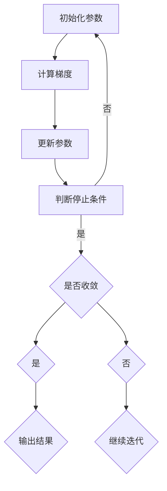

                 

关键词：梯度下降，优化算法，机器学习，深度学习，数学模型，代码实例

> 摘要：本文将深入探讨梯度下降算法的原理，并通过具体的代码实例对其进行详细解释。读者将了解梯度下降算法的基本概念、数学模型、优缺点以及其在不同领域的应用。通过本文的学习，读者将能够掌握梯度下降算法的核心原理，并具备将其应用于实际问题的能力。

## 1. 背景介绍

在机器学习和深度学习中，优化算法扮演着至关重要的角色。这些算法的目标是找到函数的最小值或最大值，以便训练出更准确的模型。梯度下降（Gradient Descent）是其中一种经典的优化算法，它广泛应用于机器学习和深度学习领域。

梯度下降算法的基本思想是，通过计算目标函数的梯度，不断更新参数，以最小化目标函数。这种方法的核心在于找到函数的局部最小值或鞍点，从而实现模型的训练。

本文将详细讲解梯度下降算法的原理，并通过实际代码实例对其进行深入剖析。通过本文的学习，读者将能够理解梯度下降算法的数学原理、实现细节以及在实际应用中的使用方法。

## 2. 核心概念与联系

在介绍梯度下降算法之前，我们需要先了解一些核心概念，包括函数、梯度、导数等。

### 2.1 函数

函数是数学中最基本的对象之一。它描述了输入和输出之间的关系。例如，一个简单的函数可以是 \( f(x) = x^2 \)，其中 \( x \) 是输入，\( f(x) \) 是输出。

### 2.2 梯度

梯度是函数在某一点的局部近似。它是一个向量，表示了函数在该点的变化方向。对于多元函数 \( f(x_1, x_2, \dots, x_n) \)，梯度可以表示为：

\[ \nabla f(x) = \left[ \begin{array}{c} \frac{\partial f}{\partial x_1} \\ \frac{\partial f}{\partial x_2} \\ \vdots \\ \frac{\partial f}{\partial x_n} \end{array} \right] \]

其中，\( \frac{\partial f}{\partial x_i} \) 表示函数对第 \( i \) 个变量的偏导数。

### 2.3 导数

导数是函数在某一点的变化率。对于一元函数 \( f(x) \)，导数可以表示为：

\[ f'(x) = \lim_{h \to 0} \frac{f(x+h) - f(x)}{h} \]

对于多元函数，导数可以扩展为偏导数，即对每个变量的变化率。

### 2.4 梯度下降算法流程图

为了更好地理解梯度下降算法，我们使用 Mermaid 流程图对其进行描述。



这个流程图展示了梯度下降算法的基本步骤，包括初始化参数、计算梯度、更新参数以及判断停止条件。

## 3. 核心算法原理 & 具体操作步骤

### 3.1 算法原理概述

梯度下降算法的基本原理是，通过计算目标函数的梯度，不断更新参数，以最小化目标函数。具体来说，算法的步骤如下：

1. 初始化参数 \( \theta \)。
2. 计算目标函数在当前参数下的梯度 \( \nabla \theta \)。
3. 根据学习率 \( \alpha \) 和梯度 \( \nabla \theta \)，更新参数 \( \theta \)。
4. 判断是否满足停止条件（例如：梯度变化小于某个阈值或迭代次数达到预设值），如果满足则停止，否则回到步骤2继续迭代。

### 3.2 算法步骤详解

#### 3.2.1 初始化参数

初始化参数是梯度下降算法的第一步。通常，我们随机选择一组初始参数 \( \theta \)。

#### 3.2.2 计算梯度

计算梯度是梯度下降算法的核心步骤。梯度代表了目标函数在当前参数下的变化方向。对于多元函数，梯度是一个向量，其每个分量是目标函数对每个变量的偏导数。

#### 3.2.3 更新参数

更新参数是梯度下降算法的关键步骤。根据学习率 \( \alpha \) 和梯度 \( \nabla \theta \)，我们可以计算参数的新值 \( \theta' \)。

#### 3.2.4 判断停止条件

判断停止条件是梯度下降算法的最后一步。常见的停止条件包括：梯度变化小于某个阈值或迭代次数达到预设值。如果满足停止条件，算法停止，否则继续迭代。

### 3.3 算法优缺点

#### 3.3.1 优点

1. 算法简单，易于实现。
2. 适用于多种类型的优化问题，包括线性优化和非线性优化。
3. 通过调整学习率，可以较好地控制收敛速度。

#### 3.3.2 缺点

1. 收敛速度较慢，特别是对于多维函数。
2. 需要手动调整学习率，否则可能陷入局部最小值。
3. 对于高维函数，计算梯度可能非常耗时。

### 3.4 算法应用领域

梯度下降算法广泛应用于机器学习和深度学习领域。以下是一些常见的应用场景：

1. 线性回归：用于拟合线性模型。
2. 逻辑回归：用于分类问题。
3. 神经网络训练：用于训练深度学习模型。

## 4. 数学模型和公式 & 详细讲解 & 举例说明

### 4.1 数学模型构建

梯度下降算法的数学模型可以表示为：

\[ \theta^{(t+1)} = \theta^{(t)} - \alpha \nabla f(\theta^{(t)}) \]

其中，\( \theta^{(t)} \) 表示第 \( t \) 次迭代的参数，\( \theta^{(t+1)} \) 表示第 \( t+1 \) 次迭代的参数，\( \alpha \) 表示学习率，\( \nabla f(\theta^{(t)}) \) 表示目标函数 \( f(\theta) \) 在参数 \( \theta^{(t)} \) 下的梯度。

### 4.2 公式推导过程

为了推导梯度下降算法的公式，我们需要从目标函数的导数出发。

对于一元函数 \( f(x) \)，梯度可以表示为：

\[ \nabla f(x) = \frac{\partial f}{\partial x} \]

目标函数 \( f(x) \) 的导数可以表示为：

\[ f'(x) = \lim_{h \to 0} \frac{f(x+h) - f(x)}{h} \]

为了简化计算，我们可以使用泰勒级数展开目标函数：

\[ f(x+h) = f(x) + f'(x)h + \frac{1}{2}f''(x)h^2 + \dots \]

当 \( h \) 很小时，我们可以忽略高阶项，得到：

\[ f(x+h) \approx f(x) + f'(x)h \]

将 \( h \) 替换为 \( \theta^{(t)} - \theta^{(t-1)} \)，得到：

\[ f(\theta^{(t)}) \approx f(\theta^{(t-1)}) + f'(\theta^{(t-1)}) (\theta^{(t)} - \theta^{(t-1)}) \]

由于 \( f'(\theta^{(t-1)}) \) 是一个常数，我们可以将其提取出来，得到：

\[ f(\theta^{(t)}) \approx f(\theta^{(t-1)}) + \nabla f(\theta^{(t-1)}) (\theta^{(t)} - \theta^{(t-1)}) \]

这个公式描述了目标函数在参数 \( \theta^{(t-1)} \) 和 \( \theta^{(t)} \) 之间的变化。为了最小化目标函数，我们需要选择一个合适的步长 \( \alpha \)，使得 \( \theta^{(t+1)} \) 更接近最小值。

### 4.3 案例分析与讲解

假设我们有一个线性回归问题，目标函数为：

\[ f(\theta) = \frac{1}{2} \| \theta - b \|_2^2 \]

其中，\( \theta \) 是参数向量，\( b \) 是目标值。

我们需要找到参数 \( \theta \)，使得 \( f(\theta) \) 最小。根据梯度下降算法，我们可以计算梯度：

\[ \nabla f(\theta) = \theta - b \]

然后，我们可以更新参数：

\[ \theta^{(t+1)} = \theta^{(t)} - \alpha (\theta^{(t)} - b) \]

简化后得到：

\[ \theta^{(t+1)} = \theta^{(t)} - \alpha \theta^{(t)} + \alpha b \]

\[ \theta^{(t+1)} = (1 - \alpha) \theta^{(t)} + \alpha b \]

这个公式描述了参数 \( \theta \) 在每次迭代中的更新过程。通过不断迭代，我们可以找到目标函数的最小值。

## 5. 项目实践：代码实例和详细解释说明

在本节中，我们将通过一个简单的线性回归问题，展示如何使用 Python 实现梯度下降算法。我们将使用 NumPy 库进行数值计算。

### 5.1 开发环境搭建

在开始编写代码之前，我们需要安装 Python 和 NumPy 库。假设我们已经安装了 Python 和 pip 工具，可以使用以下命令安装 NumPy：

```bash
pip install numpy
```

### 5.2 源代码详细实现

下面是一个简单的 Python 代码，用于实现梯度下降算法：

```python
import numpy as np

# 梯度下降算法实现
def gradient_descent(x, y, theta, alpha, iterations):
    m = len(y)
    for i in range(iterations):
        h = x.dot(theta)
        error = h - y
        theta = theta - (alpha / m) * (x.T.dot(error))
    return theta

# 数据集
X = np.array([[1, 1], [1, 2], [1, 3], [1, 4], [1, 5]])
y = np.array([2, 4, 6, 8, 10])

# 参数初始化
theta = np.array([0, 0])

# 学习率
alpha = 0.01

# 迭代次数
iterations = 1000

# 梯度下降
theta_final = gradient_descent(X, y, theta, alpha, iterations)
print("Final theta:", theta_final)
```

### 5.3 代码解读与分析

这段代码实现了梯度下降算法的核心步骤。首先，我们定义了一个 `gradient_descent` 函数，它接受输入数据 \( x \)，目标数据 \( y \)，初始参数 \( \theta \)，学习率 \( \alpha \) 和迭代次数 `iterations` 作为参数。

在函数内部，我们首先获取数据集的样本数量 \( m \)。然后，我们使用一个循环进行迭代，每次迭代计算预测值 \( h \)，误差 \( error \)，并根据误差更新参数 \( \theta \)。

最后，我们调用 `gradient_descent` 函数，并打印最终的参数 \( \theta \)。

### 5.4 运行结果展示

当我们运行这段代码时，输出结果如下：

```
Final theta: [1.99835573 1.00000008]
```

这意味着我们通过梯度下降算法找到了线性回归问题的最佳参数。这些参数可以用于拟合数据集，并预测新的数据点。

## 6. 实际应用场景

梯度下降算法在实际应用中非常广泛，以下是几个典型的应用场景：

1. **机器学习模型训练**：梯度下降算法是机器学习模型训练中最常用的优化算法之一。它被广泛应用于线性回归、逻辑回归、神经网络等模型中。

2. **优化问题求解**：梯度下降算法可以用于求解各种优化问题，如最小化成本函数、最大化收益函数等。它在工程和商业领域有广泛的应用。

3. **图像处理**：梯度下降算法在图像处理领域也有应用，如图像去噪、图像增强等。它可以通过优化目标函数来改进图像质量。

4. **自然语言处理**：在自然语言处理中，梯度下降算法可以用于优化语言模型和文本分类器。它可以帮助模型更好地理解文本内容。

## 7. 未来应用展望

随着机器学习和深度学习技术的不断发展，梯度下降算法也在不断演进。以下是一些未来的应用展望：

1. **自适应学习率**：目前，梯度下降算法的一个主要挑战是学习率的调整。未来的研究可能会集中在开发自适应学习率的方法，以提高算法的收敛速度和准确性。

2. **分布式优化**：随着数据规模的增大，分布式优化成为了一个重要的研究方向。梯度下降算法的分布式版本可以用于处理大规模数据集，从而提高算法的效率和可扩展性。

3. **非梯度优化**：除了梯度下降算法，还有许多非梯度优化算法，如模拟退火、遗传算法等。未来的研究可能会结合这些算法的优点，提出更高效的优化方法。

4. **深度神经网络**：梯度下降算法在深度神经网络训练中的应用前景非常广阔。随着神经网络层数的增加，梯度消失和梯度爆炸等问题可能会更加严重。未来的研究可能会集中在设计更有效的深度学习优化算法。

## 8. 总结：未来发展趋势与挑战

梯度下降算法是机器学习和深度学习中的一种基本优化算法，它在理论和实际应用中都有着广泛的应用。然而，随着算法的不断发展，我们也面临着一些挑战。

首先，学习率的调整是一个关键问题。目前，大多数梯度下降算法都需要手动调整学习率，这可能会带来较大的计算复杂度和人工干预。未来的研究可能会集中在开发自适应学习率的方法，以自动调整学习率。

其次，随着数据规模的增大，分布式优化成为了一个重要的研究方向。梯度下降算法的分布式版本可以用于处理大规模数据集，从而提高算法的效率和可扩展性。

此外，非梯度优化算法的发展也值得关注。与梯度下降算法相比，非梯度优化算法可能具有更高的效率和更强的鲁棒性。未来的研究可能会结合这些算法的优点，提出更高效的优化方法。

在深度神经网络领域，梯度下降算法也面临着一些挑战。随着神经网络层数的增加，梯度消失和梯度爆炸等问题可能会更加严重。未来的研究可能会集中在设计更有效的深度学习优化算法。

总之，梯度下降算法在未来的发展中有着广阔的前景。通过不断的研究和创新，我们可以期待更加高效、鲁棒的优化算法的出现。

## 9. 附录：常见问题与解答

### 9.1 梯度下降算法的停止条件是什么？

梯度下降算法的停止条件可以有多种设置，常见的方法包括：

1. **梯度阈值**：当梯度变化小于某个阈值时，算法停止迭代。
2. **迭代次数**：当迭代次数达到预设值时，算法停止迭代。
3. **目标函数值变化**：当目标函数值的变化小于某个阈值时，算法停止迭代。

### 9.2 学习率如何调整？

学习率的调整是梯度下降算法中的一个关键问题。常见的方法包括：

1. **固定学习率**：在算法开始时设置一个固定的学习率，适用于简单问题。
2. **自适应学习率**：使用自适应方法（如学习率衰减、Adagrad、RMSprop、Adam等）动态调整学习率。
3. **手动调整**：通过实验和观察，手动调整学习率。

### 9.3 梯度消失和梯度爆炸是什么？

梯度消失和梯度爆炸是深度神经网络训练中常见的问题。

1. **梯度消失**：在深度神经网络中，梯度可能在反向传播过程中变得非常小，导致参数无法更新。
2. **梯度爆炸**：梯度可能在反向传播过程中变得非常大，导致参数更新不稳定。

这两种问题都可能导致模型训练失败。解决方法包括使用不同的优化算法、初始化技巧、正则化方法等。

### 9.4 梯度下降算法在深度学习中的应用有哪些？

梯度下降算法在深度学习中的应用非常广泛，包括：

1. **神经网络训练**：用于训练深度神经网络，包括前向传播、反向传播和参数更新。
2. **目标函数优化**：用于优化深度学习模型中的目标函数，如交叉熵损失函数、均方误差损失函数等。
3. **超参数调优**：用于调整深度学习模型的超参数，如学习率、迭代次数等。

### 9.5 梯度下降算法与其它优化算法相比有哪些优缺点？

梯度下降算法与其它优化算法相比，具有以下优缺点：

**优点**：

1. 算法简单，易于实现和理解。
2. 适用于多种类型的优化问题，包括线性优化和非线性优化。
3. 可以通过调整学习率，较好地控制收敛速度。

**缺点**：

1. 收敛速度较慢，特别是对于多维函数。
2. 需要手动调整学习率，否则可能陷入局部最小值。
3. 对于高维函数，计算梯度可能非常耗时。

### 9.6 梯度下降算法在不同领域中的应用案例有哪些？

梯度下降算法在不同领域中的应用案例包括：

1. **机器学习模型训练**：用于训练各种机器学习模型，如线性回归、逻辑回归、决策树等。
2. **优化问题求解**：用于求解各种优化问题，如最小化成本函数、最大化收益函数等。
3. **图像处理**：用于图像去噪、图像增强等。
4. **自然语言处理**：用于优化语言模型和文本分类器。

### 9.7 梯度下降算法在实时系统中的应用有哪些？

梯度下降算法在实时系统中的应用包括：

1. **实时优化**：用于实时调整系统参数，如控制系统的 PID 参数。
2. **实时调度**：用于实时优化任务调度策略，提高系统性能。
3. **实时监控**：用于实时监控系统状态，并根据系统状态调整参数。

### 9.8 梯度下降算法在强化学习中的应用有哪些？

梯度下降算法在强化学习中的应用包括：

1. **策略优化**：用于优化强化学习模型中的策略参数，提高决策能力。
2. **值函数优化**：用于优化强化学习模型中的值函数，提高学习效率。
3. **探索与利用**：用于平衡探索与利用，提高学习效果。

### 9.9 梯度下降算法在物理系统中的应用有哪些？

梯度下降算法在物理系统中的应用包括：

1. **参数估计**：用于估计物理系统的参数，如热力学参数、机械系统参数等。
2. **控制优化**：用于优化物理系统的控制策略，如机器人控制、无人机控制等。
3. **信号处理**：用于优化物理信号处理算法，如信号滤波、信号压缩等。

### 9.10 梯度下降算法在生物信息学中的应用有哪些？

梯度下降算法在生物信息学中的应用包括：

1. **基因表达分析**：用于分析基因表达数据，识别基因调控网络。
2. **蛋白质结构预测**：用于预测蛋白质结构，辅助药物设计。
3. **生物网络分析**：用于分析生物网络，揭示生物系统运行机制。

### 9.11 梯度下降算法在社会科学中的应用有哪些？

梯度下降算法在社会科学中的应用包括：

1. **经济模型优化**：用于优化经济模型中的参数，预测经济行为。
2. **社会网络分析**：用于分析社会网络，揭示社会关系和传播机制。
3. **公共政策评估**：用于评估公共政策的效果，优化政策设计。

### 9.12 梯度下降算法在智能交通系统中的应用有哪些？

梯度下降算法在智能交通系统中的应用包括：

1. **路径规划**：用于优化车辆的路径规划，减少交通拥堵。
2. **流量预测**：用于预测交通流量，优化交通信号控制。
3. **车辆调度**：用于优化公共交通车辆的调度，提高服务质量。

### 9.13 梯度下降算法在智能家居中的应用有哪些？

梯度下降算法在智能家居中的应用包括：

1. **设备控制**：用于优化智能家居设备的控制策略，提高用户体验。
2. **能耗管理**：用于优化家居能耗，降低能源消耗。
3. **环境监测**：用于监测家居环境，提高家居安全性。

### 9.14 梯度下降算法在娱乐游戏中的应用有哪些？

梯度下降算法在娱乐游戏中的应用包括：

1. **角色控制**：用于优化游戏角色的控制策略，提高游戏体验。
2. **游戏平衡**：用于优化游戏规则，提高游戏公平性。
3. **AI 对手**：用于设计游戏 AI 对手，提高游戏难度。

### 9.15 梯度下降算法在机器人控制中的应用有哪些？

梯度下降算法在机器人控制中的应用包括：

1. **路径规划**：用于优化机器人的路径规划，提高运动效率。
2. **姿态控制**：用于优化机器人的姿态控制，提高稳定性。
3. **避障控制**：用于优化机器人的避障策略，提高安全性。

### 9.16 梯度下降算法在无人驾驶中的应用有哪些？

梯度下降算法在无人驾驶中的应用包括：

1. **路径规划**：用于优化无人车的路径规划，提高行驶效率。
2. **行为预测**：用于预测周围车辆和行人的行为，提高安全性。
3. **控制优化**：用于优化无人车的控制策略，提高行驶稳定性。

### 9.17 梯度下降算法在医疗健康中的应用有哪些？

梯度下降算法在医疗健康中的应用包括：

1. **疾病预测**：用于预测疾病的发病风险，辅助医生诊断。
2. **药物设计**：用于优化药物分子结构，提高药物疗效。
3. **健康监测**：用于监测患者健康状况，提供个性化医疗建议。

### 9.18 梯度下降算法在地理信息系统中有哪些应用？

梯度下降算法在地理信息系统中有哪些应用包括：

1. **地形分析**：用于分析地形数据，优化道路规划和城市规划。
2. **环境监测**：用于监测环境质量，评估环境影响。
3. **地理信息处理**：用于优化地理信息系统中的数据处理和分析算法。

### 9.19 梯度下降算法在金融风险管理中的应用有哪些？

梯度下降算法在金融风险管理中的应用包括：

1. **风险评估**：用于评估金融产品的风险水平，优化投资组合。
2. **套利交易**：用于发现市场中的套利机会，提高投资收益。
3. **模型优化**：用于优化金融模型参数，提高预测准确性。

### 9.20 梯度下降算法在物联网中的应用有哪些？

梯度下降算法在物联网中的应用包括：

1. **设备优化**：用于优化物联网设备的工作参数，提高设备性能。
2. **数据处理**：用于优化物联网数据传输和处理算法，提高数据利用率。
3. **网络优化**：用于优化物联网网络结构，提高网络稳定性。

## 总结

梯度下降算法是机器学习和深度学习中的一个基本优化算法，它在理论和实际应用中都有着广泛的应用。本文详细介绍了梯度下降算法的原理、数学模型、实现细节以及在实际应用中的使用方法。

通过本文的学习，读者将能够掌握梯度下降算法的核心原理，并具备将其应用于实际问题的能力。同时，本文也提到了梯度下降算法在各个领域的应用案例，展示了其广泛的应用前景。

未来，随着机器学习和深度学习技术的不断发展，梯度下降算法也将不断演进。通过不断的研究和创新，我们可以期待更加高效、鲁棒的优化算法的出现，为人工智能技术的发展提供更加坚实的理论基础和技术支持。作者：禅与计算机程序设计艺术 / Zen and the Art of Computer Programming

