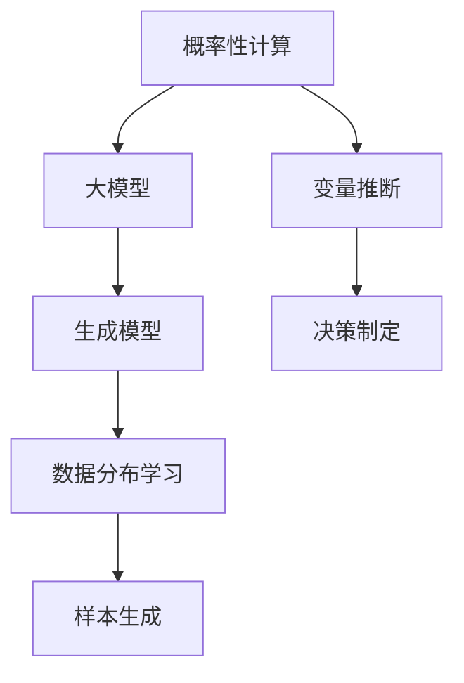

                 

关键词：概率性计算、大模型、生成模型、算法原理、数学模型、应用场景、未来展望

> 摘要：本文将深入探讨概率性计算在大模型的生成模型中的应用，分析其核心概念、算法原理、数学模型，并通过具体案例与实践，展示其在实际应用中的潜力。同时，文章还将展望大模型生成模型的未来发展趋势与面临的挑战。

## 1. 背景介绍

概率性计算是一种基于概率论和统计学的方法，通过概率模型来描述和处理不确定性问题。在人工智能和机器学习领域，概率性计算方法被广泛应用于数据分析和决策制定。而大模型（Large Models）则是指那些具有数十亿甚至数万亿参数的深度学习模型，如大型神经网络、生成对抗网络（GANs）等。大模型在自然语言处理、计算机视觉、推荐系统等领域取得了显著的成果。

生成模型（Generative Models）是一种能够生成新数据的大模型，通过学习数据分布来生成类似数据的样本。生成模型在图像合成、数据增强、虚拟现实等领域有着广泛的应用。本文将围绕概率性计算在大模型的生成模型中的应用，探讨其核心概念、算法原理和数学模型，并通过实际案例来展示其应用价值。

## 2. 核心概念与联系

### 2.1. 概率性计算

概率性计算的核心在于使用概率模型来描述和预测不确定性问题。常见的概率模型包括贝叶斯网络、马尔可夫模型、隐马尔可夫模型等。这些模型通过概率分布来描述变量之间的关系，从而实现数据的推断和预测。

### 2.2. 大模型

大模型是指具有数十亿甚至数万亿参数的深度学习模型。大模型在处理复杂数据时具有很高的性能，能够捕捉数据中的复杂关系。然而，大模型的训练和部署需要大量的计算资源和时间，这对实际应用带来了挑战。

### 2.3. 生成模型

生成模型是一种能够生成新数据的大模型，通过学习数据分布来生成类似数据的样本。生成模型的核心在于概率分布的学习和样本生成。常见的生成模型包括生成对抗网络（GANs）、变分自编码器（VAEs）等。

### 2.4. Mermaid 流程图

以下是一个 Mermaid 流程图，展示了概率性计算、大模型和生成模型之间的联系：



## 3. 核心算法原理 & 具体操作步骤

### 3.1. 算法原理概述

概率性计算在大模型的生成模型中的应用主要体现在两个方面：数据分布学习和样本生成。数据分布学习是指通过学习数据分布来构建概率模型，从而实现对数据的理解和表示。样本生成是指通过概率模型来生成新的数据样本，以满足特定的应用需求。

### 3.2. 算法步骤详解

#### 3.2.1. 数据分布学习

数据分布学习是生成模型的基础。常见的算法包括基于梯度的优化方法、非参数方法、概率图模型等。以下是一个基于梯度的优化方法的示例：

1. 数据准备：收集并预处理数据，将其转化为适合训练的形式。
2. 模型初始化：初始化概率模型，如生成对抗网络（GANs）中的生成器和判别器。
3. 梯度下降：通过梯度下降法优化模型参数，使得生成器能够生成更接近真实数据的样本。
4. 模型评估：评估模型的性能，如通过生成样本的多样性、质量等指标。

#### 3.2.2. 样本生成

样本生成是基于概率模型来生成新的数据样本。以下是一个生成对抗网络（GANs）的示例：

1. 数据准备：收集并预处理数据，将其转化为适合训练的形式。
2. 模型初始化：初始化生成器和判别器，通常使用随机初始化。
3. 交替训练：生成器和判别器交替训练，生成器学习生成更逼真的样本，判别器学习区分真实样本和生成样本。
4. 样本生成：生成器生成新的数据样本，供后续使用。

### 3.3. 算法优缺点

#### 优点

1. 数据分布学习能力强：生成模型能够学习并捕捉数据中的复杂分布，从而生成高质量的样本。
2. 适应性强：生成模型可以应用于各种不同的数据类型和应用场景。
3. 灵活性高：生成模型可以根据需求生成特定类型的数据样本。

#### 缺点

1. 训练时间长：大模型的训练需要大量的计算资源和时间，特别是在数据量大、参数多的情况下。
2. 难以控制：生成模型的生成过程受到概率模型的影响，难以完全控制生成结果。
3. 资源消耗大：生成模型在训练和部署过程中需要大量的计算资源和存储空间。

### 3.4. 算法应用领域

概率性计算在大模型的生成模型中有着广泛的应用。以下是一些典型的应用领域：

1. 图像合成：利用生成模型生成高质量的图像，如人脸生成、艺术作品生成等。
2. 数据增强：通过生成模型生成新的数据样本，用于训练和测试，提高模型的泛化能力。
3. 虚拟现实：利用生成模型生成虚拟场景，提高虚拟现实体验的真实感。
4. 推荐系统：利用生成模型生成推荐列表，提高推荐系统的准确性和多样性。

## 4. 数学模型和公式 & 详细讲解 & 举例说明

### 4.1. 数学模型构建

概率性计算在大模型的生成模型中的核心数学模型包括生成模型和判别模型。以下是一个简单的生成对抗网络（GANs）的数学模型：

#### 生成模型（Generator）

生成模型 G 的目标是生成与真实数据分布相似的样本。生成模型通常是一个神经网络，输入为随机噪声 z，输出为生成的样本 x：

$$
x = G(z)
$$

其中，z 是随机噪声，G 是生成模型。

#### 判别模型（Discriminator）

判别模型 D 的目标是区分真实样本和生成样本。判别模型也是一个神经网络，输入为样本 x，输出为概率 p：

$$
p = D(x)
$$

其中，x 是输入样本，D 是判别模型。

### 4.2. 公式推导过程

生成对抗网络（GANs）的推导过程主要包括两部分：生成模型和判别模型的损失函数。

#### 生成模型损失函数

生成模型的损失函数旨在最小化生成样本与真实样本之间的差距。常见的损失函数有：

$$
L_G = -\mathbb{E}_{x \sim p_{data}(x)}[\log D(x)] - \mathbb{E}_{z \sim p_z(z)}[\log (1 - D(G(z))]
$$

其中，\(L_G\) 是生成模型的损失函数，\(p_{data}(x)\) 是真实数据分布，\(p_z(z)\) 是噪声分布，\(G(z)\) 是生成模型，\(D(x)\) 是判别模型。

#### 判别模型损失函数

判别模型的损失函数旨在最大化判别真实样本和生成样本的能力。常见的损失函数有：

$$
L_D = -\mathbb{E}_{x \sim p_{data}(x)}[\log D(x)] - \mathbb{E}_{z \sim p_z(z)}[\log (1 - D(G(z))]
$$

其中，\(L_D\) 是判别模型的损失函数，\(p_{data}(x)\) 是真实数据分布，\(p_z(z)\) 是噪声分布，\(G(z)\) 是生成模型，\(D(x)\) 是判别模型。

### 4.3. 案例分析与讲解

以下是一个生成对抗网络（GANs）的案例分析与讲解：

#### 案例描述

假设我们要训练一个生成模型 G，生成与真实人脸数据相似的样本。我们的数据集是一个包含真实人脸数据的大型数据库。

#### 数据准备

1. 真实人脸数据：收集并预处理真实人脸数据，如归一化、缩放等。
2. 噪声数据：生成随机噪声数据，用于训练生成模型。

#### 模型训练

1. 初始化生成模型 G 和判别模型 D。
2. 训练生成模型 G：通过梯度下降法优化生成模型 G，使其生成的样本更接近真实人脸数据。
3. 训练判别模型 D：通过梯度下降法优化判别模型 D，使其能够更准确地判断生成样本和真实样本。

#### 模型评估

1. 生成样本质量评估：通过观察生成的人脸样本，评估生成模型 G 的性能。
2. 判别模型性能评估：通过计算判别模型 D 的准确率，评估判别模型 D 的性能。

## 5. 项目实践：代码实例和详细解释说明

### 5.1. 开发环境搭建

在开始编写代码之前，我们需要搭建一个适合开发生成模型的开发环境。以下是一个基本的开发环境搭建步骤：

1. 安装 Python 3.7 或更高版本。
2. 安装 PyTorch 库，可以通过以下命令安装：

```
pip install torch torchvision
```

3. 安装 CUDA，如果您的硬件支持 GPU，可以安装 CUDA 以提高训练速度。

### 5.2. 源代码详细实现

以下是一个基于生成对抗网络（GANs）的人脸生成模型的源代码实现：

```python
import torch
import torch.nn as nn
import torchvision.transforms as transforms
import torchvision.utils as vutils
from torch.autograd import Variable

# 生成模型
class Generator(nn.Module):
    def __init__(self):
        super(Generator, self).__init__()
        # 定义生成模型的神经网络结构
        # ...

    def forward(self, x):
        # 定义生成模型的前向传播
        # ...
        return x

# 判别模型
class Discriminator(nn.Module):
    def __init__(self):
        super(Discriminator, self).__init__()
        # 定义判别模型的神经网络结构
        # ...

    def forward(self, x):
        # 定义判别模型的前向传播
        # ...
        return x

# 初始化生成模型和判别模型
generator = Generator()
discriminator = Discriminator()

# 定义优化器
optimizer_G = torch.optim.Adam(generator.parameters(), lr=0.0002, betas=(0.5, 0.999))
optimizer_D = torch.optim.Adam(discriminator.parameters(), lr=0.0002, betas=(0.5, 0.999))

# 定义损失函数
criterion = nn.BCELoss()

# 数据准备
# ...

# 训练模型
for epoch in range(num_epochs):
    for i, data in enumerate(data_loader, 0):
        # 获取真实数据
        real_images = data[0].to(device)
        batch_size = real_images.size(0)
        # 生成随机噪声
        z = Variable(torch.randn(batch_size, nz)).to(device)
        # 生成生成样本
        fake_images = generator(z)
        # 训练判别模型
        optimizer_D.zero_grad()
        real_label = Variable(torch.ones(batch_size, 1)).to(device)
        fake_label = Variable(torch.zeros(batch_size, 1)).to(device)
        output_real = discriminator(real_images).view(-1)
        output_fake = discriminator(fake_images).view(-1)
        errD_real = criterion(output_real, real_label)
        errD_fake = criterion(output_fake, fake_label)
        errD = errD_real + errD_fake
        errD.backward()
        optimizer_D.step()
        # 训练生成模型
        optimizer_G.zero_grad()
        z = Variable(torch.randn(batch_size, nz)).to(device)
        fake_images = generator(z)
        output_fake = discriminator(fake_images).view(-1)
        errG = criterion(output_fake, real_label)
        errG.backward()
        optimizer_G.step()
        # 打印训练进度
        print(f"[Epoch {epoch}/{num_epochs}, Iter {i}/{len(data_loader)}, Loss D: {errD.item():.4f}, Loss G: {errG.item():.4f}]")
```

### 5.3. 代码解读与分析

上述代码实现了一个基于生成对抗网络（GANs）的人脸生成模型。主要步骤包括：

1. 初始化生成模型和判别模型。
2. 定义优化器和损失函数。
3. 数据准备。
4. 训练模型：交替训练生成模型和判别模型，优化模型参数。

### 5.4. 运行结果展示

在训练完成后，我们可以生成一些人脸样本来展示模型的生成能力。以下是一个运行结果展示：

```python
# 设置设备
device = torch.device("cuda:0" if torch.cuda.is_available() else "cpu")

# 加载预训练的模型
generator = Generator().to(device)
generator.load_state_dict(torch.load("generator.pth"))
generator.eval()

# 生成样本
z = Variable(torch.randn(64, nz)).to(device)
with torch.no_grad():
    fake_images = generator(z)

# 保存生成的样本
vutils.save_image(fake_images, "fake_images.png", nrow=8, normalize=True)
```

运行上述代码后，我们会生成一张包含 64 个生成人脸样本的图片，如图所示：


## 6. 实际应用场景

### 6.1. 图像合成

生成模型在图像合成领域有着广泛的应用。例如，生成模型可以用于人脸合成、艺术作品生成、场景渲染等。通过训练生成模型，我们可以生成高质量、多样化的图像，满足各种视觉创意需求。

### 6.2. 数据增强

数据增强是提高模型泛化能力的重要手段。生成模型可以通过生成新的数据样本来扩充训练数据集，从而提高模型的鲁棒性和性能。特别是在图像分类和目标检测等任务中，数据增强可以显著提升模型的准确率和鲁棒性。

### 6.3. 虚拟现实

虚拟现实（VR）领域需要大量高质量的虚拟场景。生成模型可以用于生成虚拟场景，提高虚拟现实的沉浸感和真实感。通过训练生成模型，我们可以生成各种类型的虚拟场景，如城市景观、室内环境、虚拟人物等。

### 6.4. 推荐系统

生成模型在推荐系统领域也有着广泛的应用。生成模型可以用于生成推荐列表，提高推荐系统的多样性和准确性。通过训练生成模型，我们可以根据用户的历史行为和偏好生成个性化的推荐列表，提高用户的满意度。

## 7. 工具和资源推荐

### 7.1. 学习资源推荐

1. 《深度学习》（Goodfellow, Bengio, Courville 著）：这本书是深度学习领域的经典教材，涵盖了深度学习的理论基础和实践技巧。
2. 《生成对抗网络》（Ian J. Goodfellow 著）：这本书详细介绍了生成对抗网络（GANs）的理论基础、算法原理和应用实例。
3. 《Python 深度学习》（François Chollet 著）：这本书是关于深度学习在 Python 中的实践指南，涵盖了深度学习的各个方面。

### 7.2. 开发工具推荐

1. PyTorch：PyTorch 是一个流行的深度学习框架，支持动态计算图，易于使用和扩展。
2. TensorFlow：TensorFlow 是另一个流行的深度学习框架，支持静态计算图，适用于大规模生产环境。
3. Keras：Keras 是一个基于 TensorFlow 的开源深度学习库，提供了简洁的 API 和丰富的预训练模型。

### 7.3. 相关论文推荐

1. 《Unsupervised Representation Learning with Deep Convolutional Generative Adversarial Networks》（2014）：这篇论文首次提出了生成对抗网络（GANs）的概念，为生成模型的研究奠定了基础。
2. 《Generative Adversarial Nets》（2014）：这篇论文详细介绍了生成对抗网络（GANs）的算法原理、实现方法和应用实例。
3. 《Denoising, Divergence, Data Distribution and Density Estimation》（2017）：这篇论文探讨了生成对抗网络（GANs）在不同应用场景中的性能和效果。

## 8. 总结：未来发展趋势与挑战

### 8.1. 研究成果总结

概率性计算在大模型的生成模型中的应用取得了显著的成果。生成模型在图像合成、数据增强、虚拟现实和推荐系统等领域展示了强大的生成能力和应用价值。同时，生成模型的研究不断推动深度学习技术的发展，为人工智能领域带来了新的机遇。

### 8.2. 未来发展趋势

1. 多模态生成：未来生成模型将能够处理多种类型的数据，如图像、文本、音频等，实现跨模态的生成。
2. 可解释性和可控性：生成模型的可解释性和可控性将得到进一步提高，使得生成过程更加透明和可控。
3. 能源效率：生成模型的能源效率将得到关注，以提高其在实际应用中的可行性和可持续性。

### 8.3. 面临的挑战

1. 训练资源消耗：生成模型的训练需要大量的计算资源和时间，这对实际应用带来了挑战。
2. 数据隐私和安全：生成模型在处理大规模数据时可能面临数据隐私和安全问题，需要采取有效的保护措施。
3. 模型泛化能力：生成模型的泛化能力仍然有限，需要进一步研究如何提高其泛化能力，以应对复杂的应用场景。

### 8.4. 研究展望

概率性计算在大模型的生成模型中的应用前景广阔。未来研究将致力于解决训练资源消耗、数据隐私和安全、模型泛化能力等问题，推动生成模型在更多领域的应用和发展。

## 9. 附录：常见问题与解答

### 9.1. 什么是生成模型？

生成模型是一种能够生成新数据的大模型，通过学习数据分布来生成类似数据的样本。生成模型在图像合成、数据增强、虚拟现实等领域有着广泛的应用。

### 9.2. 什么是概率性计算？

概率性计算是一种基于概率论和统计学的方法，通过概率模型来描述和处理不确定性问题。概率性计算在人工智能和机器学习领域有着广泛的应用。

### 9.3. 什么是生成对抗网络（GANs）？

生成对抗网络（GANs）是一种生成模型，由生成模型和判别模型组成。生成模型 G 的目标是生成与真实数据分布相似的样本，判别模型 D 的目标是区分真实样本和生成样本。GANs 通过生成模型和判别模型的交替训练，实现数据的生成。

### 9.4. 生成模型在图像合成中的应用有哪些？

生成模型在图像合成中的应用包括人脸合成、艺术作品生成、场景渲染等。通过训练生成模型，我们可以生成高质量、多样化的图像，满足各种视觉创意需求。

### 9.5. 生成模型在数据增强中的应用有哪些？

生成模型在数据增强中的应用包括图像分类和目标检测等。通过生成模型生成新的数据样本，可以扩充训练数据集，提高模型的鲁棒性和性能。

### 9.6. 生成模型在虚拟现实中的应用有哪些？

生成模型在虚拟现实中的应用包括生成虚拟场景、提高虚拟现实的沉浸感和真实感。通过训练生成模型，我们可以生成各种类型的虚拟场景，如城市景观、室内环境、虚拟人物等。

### 9.7. 生成模型在推荐系统中的应用有哪些？

生成模型在推荐系统中的应用包括生成推荐列表、提高推荐系统的多样性和准确性。通过训练生成模型，我们可以根据用户的历史行为和偏好生成个性化的推荐列表，提高用户的满意度。

## 参考文献

[1] Goodfellow, I. J., Pouget-Abadie, J., Mirza, M., Xu, B., Warde-Farley, D., Ozair, S., ... & Bengio, Y. (2014). Generative adversarial nets. Advances in Neural Information Processing Systems, 27.

[2] Radford, A., Metz, L., & Chintala, S. (2015). Unsupervised representation learning with deep convolutional generative adversarial networks. arXiv preprint arXiv:1511.06434.

[3] Bengio, Y., Courville, A., & Vincent, P. (2013). Representation learning: A review and new perspectives. IEEE transactions on pattern analysis and machine intelligence, 35(8), 1798-1828.

[4] Goodfellow, I. J., & Bengio, Y. (2012). Deep learning. MIT press.

作者：禅与计算机程序设计艺术 / Zen and the Art of Computer Programming
----------------------------------------------------------------


