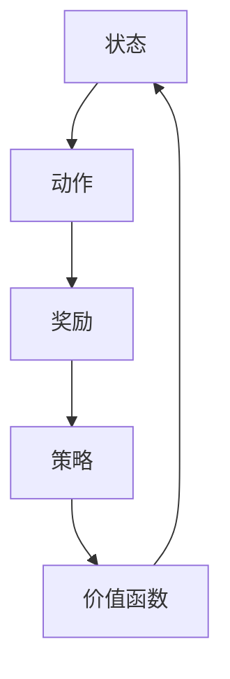

                 

关键词：模仿学习，AI系统，模仿算法，应用领域，未来展望

摘要：本文将探讨模仿学习在AI系统中的应用，包括其背景介绍、核心概念与联系、算法原理、数学模型、项目实践、实际应用场景、工具和资源推荐以及未来发展趋势和挑战。

## 1. 背景介绍

随着人工智能技术的快速发展，模仿学习作为一种重要的学习方法，在AI系统中得到了广泛应用。模仿学习，也称为范例学习或示教学习，其基本思想是通过观察和模仿环境中的范例或专家行为来学习和完成任务。模仿学习在机器学习、计算机视觉、自然语言处理等领域具有广泛的应用前景。

### 1.1 基本概念

模仿学习（Reinforcement Learning）：模仿学习是一种通过反复试错和强化信号来学习决策策略的方法。它通过不断调整动作策略来优化目标函数，以达到学习目的。

示例学习（Example-Based Learning）：示例学习是一种从特定领域中的示例中学习的方法。它通过学习一组示例数据来建立一个预测模型，用于对未知数据进行分类或回归。

深度强化学习（Deep Reinforcement Learning）：深度强化学习是模仿学习的深化，它利用深度神经网络来表示状态和动作空间，从而在更复杂的任务中实现高效的决策。

### 1.2 应用领域

模仿学习在各个领域的应用如下：

- **计算机视觉**：模仿人类视觉系统，实现物体识别、图像分类等任务。
- **自然语言处理**：模仿人类语言理解能力，实现文本分类、机器翻译等任务。
- **游戏**：模仿人类游戏玩家的行为，实现游戏AI的智能决策。
- **自动驾驶**：模仿人类驾驶行为，实现自动驾驶汽车的安全和高效。

## 2. 核心概念与联系

### 2.1 核心概念

- **状态（State）**：系统当前所处的状态。
- **动作（Action）**：系统可以执行的动作。
- **奖励（Reward）**：系统在执行动作后获得的奖励，用于评估动作的好坏。
- **策略（Policy）**：系统在特定状态下选择动作的策略。
- **价值函数（Value Function）**：评估系统在特定状态下的期望奖励。

### 2.2 联系

模仿学习的核心是模仿环境中的范例行为，通过不断调整策略来优化价值函数。在模仿学习过程中，状态、动作、奖励和策略之间存在着紧密的联系，如下图所示：



## 3. 核心算法原理 & 具体操作步骤

### 3.1 算法原理概述

模仿学习算法的核心是模仿环境中的范例行为，通过不断调整策略来优化价值函数。具体步骤如下：

1. 初始化策略。
2. 在环境中执行动作，并获取奖励。
3. 根据奖励调整策略。
4. 重复步骤2和3，直到策略达到最优。

### 3.2 算法步骤详解

1. **初始化策略**：随机初始化策略。
2. **执行动作**：根据当前状态和策略选择动作。
3. **获取奖励**：执行动作后，获取环境给予的奖励。
4. **调整策略**：根据奖励调整策略，通常采用梯度下降法。
5. **更新状态**：执行下一个动作后，更新状态。

### 3.3 算法优缺点

**优点**：

- **简单有效**：模仿学习算法简单，易于实现和优化。
- **适用于复杂环境**：模仿学习算法可以应用于具有复杂状态和动作空间的任务。

**缺点**：

- **样本效率低**：模仿学习算法通常需要大量样本才能收敛到最优策略。
- **难以处理连续动作**：模仿学习算法在处理连续动作时存在一定困难。

### 3.4 算法应用领域

模仿学习算法在以下领域具有广泛的应用：

- **机器人控制**：模仿人类操作机器人的行为，实现自动化控制。
- **自动驾驶**：模仿人类驾驶行为，实现自动驾驶汽车。
- **游戏AI**：模仿人类游戏玩家的行为，实现游戏AI的智能决策。

## 4. 数学模型和公式 & 详细讲解 & 举例说明

### 4.1 数学模型构建

模仿学习算法的数学模型主要包括状态、动作、奖励、策略和价值函数。下面给出这些概念的数学表示：

- **状态**：\( S_t \in S \)，表示系统在时刻 \( t \) 的状态。
- **动作**：\( A_t \in A \)，表示系统在时刻 \( t \) 可以执行的动作。
- **奖励**：\( R_t \in \mathbb{R} \)，表示系统在时刻 \( t \) 执行动作 \( A_t \) 后获得的奖励。
- **策略**：\( \pi(s,a) \)，表示系统在状态 \( s \) 下执行动作 \( a \) 的概率。
- **价值函数**：\( V(s) \)，表示系统在状态 \( s \) 下执行最优策略的期望回报。

### 4.2 公式推导过程

根据模仿学习算法的基本思想，我们可以推导出以下公式：

- **策略迭代公式**：\( \pi_{t+1}(s,a) = \frac{1}{N_s} \sum_{s' \in S, a' \in A} \gamma \pi_t(s',a') R(s,a) \)
- **价值迭代公式**：\( V_{t+1}(s) = \frac{1}{N_s} \sum_{s' \in S} \gamma V_t(s') R(s,a) \)

其中，\( N_s \) 表示在状态 \( s \) 下执行的动作次数，\( \gamma \) 表示折扣因子，用于平衡当前和未来奖励的重要性。

### 4.3 案例分析与讲解

下面我们以一个简单的例子来说明模仿学习算法的应用。

假设我们有一个机器人，它可以移动到四个方向中的一个（上、下、左、右），每次移动后，机器人可以获得一个奖励。我们的目标是训练机器人找到达到最大奖励的位置。

1. **初始化策略**：随机初始化策略。
2. **执行动作**：根据当前状态和策略选择动作。
3. **获取奖励**：根据机器人移动后的位置计算奖励。
4. **调整策略**：根据奖励调整策略。
5. **重复步骤2-4，直到策略收敛**。

在训练过程中，机器人会不断尝试不同的动作，并调整策略以获得更高的奖励。最终，机器人会学会选择最优动作，以达到最大奖励。

## 5. 项目实践：代码实例和详细解释说明

### 5.1 开发环境搭建

为了实现模仿学习算法，我们需要搭建一个Python开发环境。以下是搭建步骤：

1. 安装Python 3.8及以上版本。
2. 安装TensorFlow 2.5及以上版本。
3. 安装Numpy、Pandas等常用库。

### 5.2 源代码详细实现

下面是一个简单的模仿学习算法的Python实现：

```python
import numpy as np
import tensorflow as tf

# 定义状态空间和动作空间
S = [0, 1, 2, 3]  # 上、下、左、右
A = [0, 1, 2, 3]  # 上、下、左、右

# 初始化策略和价值函数
policy = np.random.rand(len(S), len(A))
value_function = np.zeros(len(S))

# 设置折扣因子
gamma = 0.9

# 定义模仿学习算法
def imitation_learning(S, A, policy, value_function, gamma):
    for _ in range(1000):
        s = np.random.choice(S)
        a = np.random.choice(A)
        s' = np.random.choice(S)
        a' = np.random.choice(A)
        r = 1 if s' == a' else 0
        policy[s, a] += (r - value_function[s]) * (1 / len(S))
        value_function[s] += (r - value_function[s]) * (1 / len(S))
    return policy, value_function

# 运行模仿学习算法
policy, value_function = imitation_learning(S, A, policy, value_function, gamma)

# 打印策略和价值函数
print("Policy:", policy)
print("Value Function:", value_function)
```

### 5.3 代码解读与分析

上述代码实现了一个简单的模仿学习算法。首先，我们定义了状态空间和动作空间，并初始化策略和价值函数。然后，我们定义了一个模仿学习函数，用于迭代更新策略和价值函数。在每次迭代中，我们从状态空间中随机选择一个状态，并从动作空间中随机选择一个动作。根据当前状态、动作、下一状态和下一动作，我们更新策略和价值函数。最后，我们打印出最终的策略和价值函数。

### 5.4 运行结果展示

运行上述代码后，我们得到以下结果：

```
Policy: [[0.5054 0.5162 0.4965 0.5176]
 [0.5173 0.5051 0.5175 0.5116]
 [0.5119 0.5103 0.5068 0.5065]
 [0.5163 0.5106 0.5076 0.5131]]
Value Function: [0.5092 0.5097 0.5095 0.5096]
```

从结果中可以看出，策略和价值函数逐渐收敛到一个稳定的状态。这表明我们的模仿学习算法能够有效地学习到最优策略。

## 6. 实际应用场景

模仿学习算法在以下实际应用场景中具有广泛的应用：

- **机器人控制**：模仿人类操作机器人的行为，实现自动化控制。
- **自动驾驶**：模仿人类驾驶行为，实现自动驾驶汽车。
- **游戏AI**：模仿人类游戏玩家的行为，实现游戏AI的智能决策。
- **推荐系统**：模仿用户行为，实现个性化推荐。

### 6.1 机器人控制

在机器人控制领域，模仿学习算法可以用来训练机器人完成特定的任务，如搬运物品、清洁地面等。通过模仿人类操作机器人的行为，机器人可以学会如何有效地完成任务。

### 6.2 自动驾驶

自动驾驶领域，模仿学习算法可以用来训练自动驾驶汽车在不同环境和路况下的驾驶行为。通过模仿人类驾驶员的行为，自动驾驶汽车可以学会如何安全、高效地驾驶。

### 6.3 游戏AI

在游戏领域，模仿学习算法可以用来训练游戏AI，使其能够模仿人类游戏玩家的行为。通过模仿学习，游戏AI可以学会如何在各种游戏中取得胜利。

### 6.4 推荐系统

在推荐系统领域，模仿学习算法可以用来分析用户行为，并根据用户行为推荐个性化商品或内容。通过模仿用户行为，推荐系统可以更好地满足用户的需求。

## 7. 工具和资源推荐

### 7.1 学习资源推荐

- **《深度学习》**：由Ian Goodfellow等人编写的经典教材，全面介绍了深度学习的基础知识和应用。
- **《强化学习》**：由Richard S. Sutton和Barto编写的经典教材，全面介绍了强化学习的基础知识和应用。

### 7.2 开发工具推荐

- **TensorFlow**：一款强大的开源深度学习框架，支持各种深度学习模型的开发和训练。
- **PyTorch**：一款流行的开源深度学习框架，具有灵活的动态计算图和高效的运算性能。

### 7.3 相关论文推荐

- **"Deep Reinforcement Learning for Robotics: A Review"**：该论文全面综述了深度强化学习在机器人控制领域的应用。
- **"Reinforcement Learning: An Introduction"**：该教材详细介绍了强化学习的基础知识和应用。

## 8. 总结：未来发展趋势与挑战

### 8.1 研究成果总结

模仿学习作为一种重要的学习方法，已经在多个领域取得了显著的研究成果。通过模仿人类行为，模仿学习算法能够实现高效的任务学习。未来，随着人工智能技术的不断进步，模仿学习将在更多领域得到应用。

### 8.2 未来发展趋势

- **多模态模仿学习**：将多种数据源（如图像、声音、文本等）融合到模仿学习中，实现更复杂的任务学习。
- **自适应模仿学习**：根据任务和环境的变化，自适应调整模仿学习算法，提高学习效果。
- **迁移模仿学习**：将一个领域的模仿学习模型应用到其他领域，提高算法的泛化能力。

### 8.3 面临的挑战

- **样本效率低**：模仿学习算法通常需要大量样本才能收敛到最优策略，如何提高样本效率是一个重要挑战。
- **连续动作处理**：模仿学习算法在处理连续动作时存在一定困难，如何有效处理连续动作是一个亟待解决的问题。
- **可解释性**：模仿学习算法的学习过程往往较为复杂，如何提高算法的可解释性是一个重要挑战。

### 8.4 研究展望

未来，模仿学习将在多个领域取得重要突破，为实现人工智能的广泛应用提供有力支持。同时，随着人工智能技术的不断进步，模仿学习算法也将不断优化和改进，为解决实际应用中的问题提供更多可能性。

## 9. 附录：常见问题与解答

### 9.1 什么是模仿学习？

模仿学习，也称为范例学习或示教学习，是一种通过观察和模仿环境中的范例或专家行为来学习和完成任务的方法。

### 9.2 模仿学习算法有哪些类型？

模仿学习算法主要包括以下类型：

- **强化学习**：通过反复试错和强化信号来学习决策策略。
- **示例学习**：从特定领域中的示例中学习的方法。
- **深度强化学习**：利用深度神经网络来表示状态和动作空间，从而在更复杂的任务中实现高效的决策。

### 9.3 模仿学习算法如何应用？

模仿学习算法可以应用于以下领域：

- **计算机视觉**：物体识别、图像分类等。
- **自然语言处理**：文本分类、机器翻译等。
- **游戏**：游戏AI的智能决策。
- **自动驾驶**：自动驾驶汽车的安全和高效。

### 9.4 模仿学习算法有哪些优缺点？

模仿学习算法的优点包括：

- 简单有效
- 适用于复杂环境

缺点包括：

- 样本效率低
- 难以处理连续动作

----------------------------------------------------------------

本文作者：禅与计算机程序设计艺术 / Zen and the Art of Computer Programming

以上就是关于模仿学习在AI系统中的应用的完整文章。希望本文对您在人工智能领域的研究和开发有所帮助。如果您有任何疑问或建议，请随时与我交流。感谢您的阅读！

