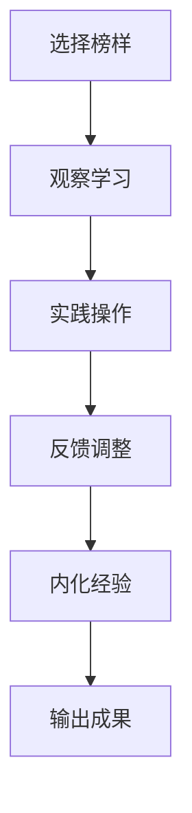

                 

关键词：模仿式工作流、学习效率、学习策略、IT领域、专业成长

> 摘要：本文将探讨模仿式工作流这一最快的学习方法，通过深入分析其在IT领域的应用，为读者提供一套行之有效的学习策略，助力专业人士在技术领域实现快速成长。

## 1. 背景介绍

在信息技术迅猛发展的时代，学习新技术的压力与日俱增。对于IT从业者而言，如何在有限的时间内掌握更多的技能，成为了亟待解决的问题。模仿式工作流作为一种高效的学习方法，因其能够快速复制并内化他人的经验，而广受关注。

### 什么是模仿式工作流？

模仿式工作流，顾名思义，是指通过模仿他人的工作方式、流程和方法，来实现自我提升的学习过程。它不仅仅是对技术的模仿，更是对思维方式、解决问题能力的模仿。

### 模仿式工作流的优势

1. **快速掌握知识**：通过模仿，可以快速获取到他人的经验，从而缩短学习曲线。
2. **节省时间成本**：不必从零开始构建知识体系，可以站在巨人的肩膀上。
3. **提高实践能力**：模仿的过程中，可以实际操作，从而提高实践能力。
4. **拓展视野**：通过模仿不同领域的工作流，可以拓宽自己的视野，丰富知识结构。

## 2. 核心概念与联系

### 模仿式工作流的架构

为了更好地理解模仿式工作流，我们需要了解其核心概念和流程。以下是一个简化的Mermaid流程图，展示了模仿式工作流的主要步骤：



### 模仿式工作流的核心概念

1. **选择榜样**：选择一个值得模仿的榜样，可以是同行、前辈或者业界专家。
2. **观察学习**：观察榜样的工作方式、流程和方法，理解其背后的逻辑和原理。
3. **实践操作**：将观察到的内容实际操作一遍，通过实践来加深理解。
4. **反馈调整**：根据实践结果，对模仿的过程进行调整，以优化效果。
5. **内化经验**：通过反复的模仿和实践，将他人的经验内化为自己的能力。
6. **输出成果**：将内化的经验转化为自己的成果，如编写代码、撰写文章等。

## 3. 核心算法原理 & 具体操作步骤

### 3.1 算法原理概述

模仿式工作流的算法原理是基于“知识传递”和“能力培养”的结合。通过以下步骤实现：

1. **知识传递**：通过观察和学习，将他人的知识传递到自己的大脑中。
2. **能力培养**：通过实践操作，将知识转化为实际能力。

### 3.2 算法步骤详解

1. **选择榜样**：确定一个值得模仿的榜样，可以是同行、前辈或者业界专家。
2. **观察学习**：观察榜样的工作方式、流程和方法，理解其背后的逻辑和原理。
3. **实践操作**：选择一个实际项目或任务，按照榜样的方式操作一遍。
4. **反馈调整**：根据实践结果，对操作过程进行反馈和调整。
5. **内化经验**：通过反复的模仿和实践，将榜样的经验内化为自己的能力。
6. **输出成果**：将内化的经验转化为自己的成果，如编写代码、撰写文章等。

### 3.3 算法优缺点

**优点**：

- 快速掌握知识
- 提高实践能力
- 节省时间成本

**缺点**：

- 可能缺乏深度思考
- 需要选择合适的榜样

### 3.4 算法应用领域

模仿式工作流在IT领域有广泛的应用，特别是在软件开发、系统架构设计、数据库管理等方向。通过模仿优秀开发者的代码风格、系统设计理念，可以快速提升自己的技术水平。

## 4. 数学模型和公式 & 详细讲解 & 举例说明

### 4.1 数学模型构建

模仿式工作流可以抽象为一个数学模型，其核心是“知识传递”和“能力培养”的结合。

假设：

- \( K \) 表示知识量
- \( A \) 表示能力值
- \( T \) 表示时间

模型公式：

\[ A = f(K, T) \]

其中，\( f \) 表示知识转化为能力的过程。

### 4.2 公式推导过程

1. **知识传递**：

   知识传递可以通过以下公式表示：

   \[ K_{in} = K_{out} + \alpha \cdot (K_{model} - K_{out}) \]

   其中，\( K_{in} \) 表示输入的知识量，\( K_{out} \) 表示输出的知识量，\( K_{model} \) 表示榜样的知识量，\( \alpha \) 表示学习效率。

2. **能力培养**：

   能力培养可以通过以下公式表示：

   \[ A = \beta \cdot K_{out} \]

   其中，\( \beta \) 表示知识转化为能力的效率。

### 4.3 案例分析与讲解

假设一个开发者，他的知识量 \( K \) 为100，他选择了一个经验丰富的开发者作为榜样，该榜样的知识量 \( K_{model} \) 为200。他的学习效率 \( \alpha \) 为0.8，知识转化为能力的效率 \( \beta \) 为0.6。

根据模型公式，我们可以计算出他在不同时间点的能力值：

- \( t = 0 \) 时，\( A = 0 \)
- \( t = 1 \) 时，\( K_{out} = 80 \)，\( A = 0.6 \cdot 80 = 48 \)
- \( t = 2 \) 时，\( K_{out} = 144 \)，\( A = 0.6 \cdot 144 = 86.4 \)

通过这个案例，我们可以看到，模仿式工作流在短期内能够显著提升个人的能力。

## 5. 项目实践：代码实例和详细解释说明

### 5.1 开发环境搭建

为了演示模仿式工作流在项目实践中的应用，我们选择了一个简单的Python项目——一个基于HTTP协议的简易Web服务器。

1. **安装Python**：确保你的系统中安装了Python 3.8及以上版本。
2. **安装依赖库**：使用pip安装必要的库，如`http.server`。

```bash
pip install http.server
```

### 5.2 源代码详细实现

下面是一个简单的Python Web服务器代码示例：

```python
from http.server import HTTPServer, BaseHTTPRequestHandler
import socket

class SimpleHTTPRequestHandler(BaseHTTPRequestHandler):

    def do_GET(self):
        self.send_response(200)
        self.send_header('Content-type', 'text/html')
        self.end_headers()
        self.wfile.write(b'Hello, world!')

def run(server_class=HTTPServer, handler_class=SimpleHTTPRequestHandler, port=8000):
    server_address = ('', port)
    httpd = server_class(server_address, handler_class)
    print(f'Starting httpd server on port {port}...')
    httpd.serve_forever()

if __name__ == '__main__':
    run()
```

### 5.3 代码解读与分析

这段代码定义了一个简单的HTTP请求处理器，当接收到GET请求时，它会返回一个“Hello, world!”的响应。

- **类定义**：`SimpleHTTPRequestHandler` 继承自`BaseHTTPRequestHandler`，这是Python内置的HTTP请求处理基类。
- **方法实现**：`do_GET` 方法处理GET请求，它设置了HTTP响应状态码、内容类型，并写入响应内容。
- **主函数**：`run` 函数创建一个HTTP服务器实例，并无限期运行。

### 5.4 运行结果展示

1. **启动服务器**：运行上面的Python脚本，服务器会启动并监听指定端口。

```bash
python simple_http_server.py
```

2. **访问服务器**：在浏览器中输入`http://localhost:8000`，你会看到“Hello, world!”的响应。

通过这个简单的项目，我们可以看到模仿式工作流在实际中的应用。选择一个现有的Web服务器实现作为榜样，通过观察、实践和调整，我们能够快速构建一个自己的Web服务器。

## 6. 实际应用场景

### 6.1 软件开发

在软件开发领域，模仿式工作流可以帮助开发者快速掌握优秀代码风格、设计模式和框架使用。例如，通过阅读GitHub上的开源项目，开发者可以学习到最佳实践。

### 6.2 系统架构设计

系统架构设计需要丰富的经验和深刻的理解。通过模仿业界专家的架构设计，可以迅速提升自己的架构设计能力。例如，学习Amazon、Netflix等公司的架构文档，可以理解大规模系统的设计理念。

### 6.3 数据库管理

数据库管理需要深入理解数据库原理和性能优化技巧。通过模仿优秀数据库管理员的工作流，可以快速提升自己的数据库管理能力。例如，学习MySQL社区文档，可以掌握MySQL的优化技巧。

### 6.4 未来应用展望

随着人工智能和自动化技术的发展，模仿式工作流的应用前景将更加广阔。未来，我们可以通过智能算法和大数据分析，更精准地选择合适的榜样，实现个性化学习。

## 7. 工具和资源推荐

### 7.1 学习资源推荐

- **GitHub**: 提供了大量的开源代码，是学习的好资源。
- **Stack Overflow**: 全球最大的开发者社区，可以解答编程问题。
- **MIT OpenCourseWare**: 提供了大量的MIT课程资源，涵盖计算机科学的方方面面。

### 7.2 开发工具推荐

- **Visual Studio Code**: 非常流行的跨平台代码编辑器。
- **Jenkins**: 自动化构建和持续集成工具。
- **Docker**: 容器化技术，方便部署和迁移应用。

### 7.3 相关论文推荐

- **"The Art of Computer Programming" by Donald E. Knuth**: 计算机程序设计的经典之作。
- **"Design Patterns: Elements of Reusable Object-Oriented Software" by Erich Gamma et al.**: 设计模式的核心著作。
- **"Big Data: A Revolution That Will Transform How We Live, Work, and Think" by Viktor Mayer-Schönberger and Kenneth Cukier**: 大数据时代的深度探讨。

## 8. 总结：未来发展趋势与挑战

### 8.1 研究成果总结

模仿式工作流作为一种高效的学习方法，已经在多个领域取得了显著成果。通过模仿他人的经验，可以快速提升个人的能力和技术水平。

### 8.2 未来发展趋势

随着人工智能技术的发展，模仿式工作流有望变得更加智能化和个性化。未来，通过大数据分析和机器学习，我们可以更精准地选择榜样，实现高效学习。

### 8.3 面临的挑战

- **选择合适的榜样**：选择合适的榜样是模仿式工作流成功的关键。
- **个性化调整**：每个人学习的方式不同，如何实现个性化调整是一个挑战。

### 8.4 研究展望

未来，模仿式工作流的研究将继续深入，特别是在人工智能和大数据分析的推动下，我们将看到更多创新和突破。

## 9. 附录：常见问题与解答

### 9.1 如何选择合适的榜样？

- 研究榜样的背景和成就，确保其具有代表性。
- 了解榜样的工作方式和流程，确保其适用于自己的学习目标。

### 9.2 模仿式工作流是否适合所有人？

- 模仿式工作流适合大多数希望快速提升自己能力的人。
- 对于追求独特性和创新性的人来说，模仿式工作流可能不是最佳选择。

通过模仿式工作流，我们可以快速掌握新技术，提升自己的能力。希望本文能为你的学习之路提供一些启示和帮助。

## 附录：进一步阅读

- **《深度学习》by Ian Goodfellow, Yoshua Bengio, Aaron Courville**: 详细介绍了深度学习的基本概念和应用。
- **《计算机程序设计艺术》by Donald E. Knuth**: 计算机科学的经典著作，对程序设计有深刻的见解。
- **《设计模式：可复用的面向对象软件的基础》by Erich Gamma, Richard Helm, Ralph Johnson, and John Vlissides**: 设计模式的权威指南。
- **《数据科学入门》by Joel Grus**: 介绍数据科学的基本概念和方法。

---

**作者：禅与计算机程序设计艺术 / Zen and the Art of Computer Programming**

