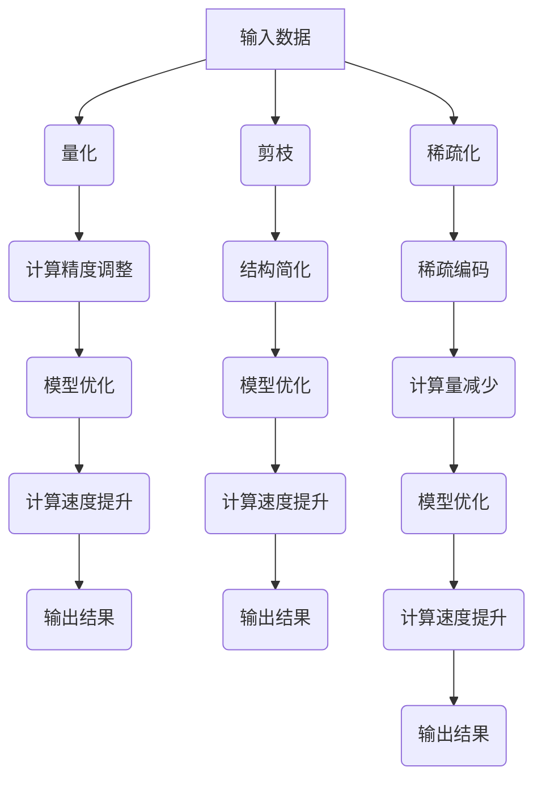

                 

### 关键词 Keywords
- 模型加速
- 低精度计算
- 精度与速度平衡
- 算法优化
- 深度学习
- 计算性能提升

### 摘要 Abstract
本文将探讨模型加速与低精度计算的技术原理，通过详细讲解核心算法和数学模型，以及实际代码实战案例，帮助读者理解如何在实际应用中实现高性能计算。文章首先介绍模型加速的背景和重要性，然后深入分析低精度计算的基本原理，并对比其与传统高精度计算的优缺点。接下来，我们将通过一系列实例展示如何将低精度计算技术应用到实践中，并提供相应的代码解析和性能分析。最后，本文将讨论低精度计算在未来的发展趋势和应用前景。

## 1. 背景介绍

随着深度学习技术的迅猛发展，神经网络模型在各个领域的应用越来越广泛。然而，模型的训练和推理过程需要大量的计算资源，特别是在大规模数据处理和复杂模型训练时，对计算性能的要求越来越高。传统的计算方法往往因为计算精度和速度的权衡而受限，难以满足实际需求。

### 1.1 模型加速的需求

为了满足高性能计算的需求，模型加速技术应运而生。模型加速主要包括以下几种方法：

1. **算法优化**：通过改进算法本身的运行效率来提升计算性能。
2. **硬件加速**：利用GPU、TPU等专用硬件设备加速模型的训练和推理。
3. **分布式计算**：通过多台计算机协同工作，实现并行计算，提高整体计算能力。
4. **低精度计算**：通过降低模型的计算精度，减少计算量，从而提升计算速度。

### 1.2 低精度计算的概念

低精度计算，顾名思义，是指在计算过程中减少数据的有效位数，从而降低计算资源的消耗。低精度计算可以通过以下几种方式实现：

1. **量化**：将浮点数转换为低精度定点数，例如将32位的浮点数量化为16位或8位。
2. **剪枝**：通过减少模型中神经元或连接的数量，降低模型的复杂度。
3. **稀疏化**：利用稀疏矩阵技术，减少非零元素的数量，从而减少计算量。

## 2. 核心概念与联系

### 2.1 量化（Quantization）

量化是低精度计算中最常用的方法之一，其核心思想是将高精度的浮点数转换为低精度的定点数。量化过程可以分为以下几个步骤：

1. **确定量化区间**：定义量化区间的上下限，例如[-1, 1]。
2. **计算量化步长**：量化步长 = (上限 - 下限) / (2^n)，其中n为量化位数。
3. **量化映射**：将输入的浮点数映射到量化区间内的整数。

### 2.2 剪枝（Pruning）

剪枝技术通过减少模型中的神经元或连接来降低模型的复杂度。剪枝过程可以分为以下两种方式：

1. **结构剪枝**：直接删除模型中的神经元或连接。
2. **权重剪枝**：降低模型中神经元的权重值，而不是直接删除。

### 2.3 稀疏化（Sparse Representation）

稀疏化技术通过减少非零元素的数量来降低计算量。稀疏化过程可以分为以下几种方法：

1. **稀疏编码**：将输入数据表示为稀疏的线性组合。
2. **稀疏矩阵**：利用稀疏矩阵技术，减少非零元素的数量。

### 2.4 Mermaid 流程图

以下是一个简化的Mermaid流程图，展示了量化、剪枝和稀疏化的基本流程：



## 3. 核心算法原理 & 具体操作步骤

### 3.1 算法原理概述

低精度计算的核心算法主要包括量化、剪枝和稀疏化。这些算法通过降低模型的计算精度、减少模型复杂度和计算量，从而实现计算速度的提升。以下分别介绍这些算法的基本原理。

### 3.2 算法步骤详解

#### 3.2.1 量化

1. **确定量化区间**：例如，将输入数据映射到区间[-1, 1]。
2. **计算量化步长**：例如，使用8位量化，步长为(1 - (-1)) / (2^8) = 0.01953125。
3. **量化映射**：将输入数据映射到量化区间内的整数。

例如，输入数据x = 0.75，量化后为x' = round(x / 0.01953125) = 39。

#### 3.2.2 剪枝

1. **选择剪枝策略**：例如，使用基于权重的剪枝策略。
2. **计算权重值**：例如，使用L1范数作为权重值。
3. **阈值设定**：例如，设定阈值为0.1。
4. **剪枝操作**：将权重值小于阈值的神经元或连接删除。

例如，模型中某神经元的权重w = 0.08，小于阈值0.1，因此剪枝该神经元。

#### 3.2.3 稀疏化

1. **选择稀疏编码方法**：例如，使用K-SVD算法。
2. **训练稀疏编码模型**：例如，使用输入数据训练稀疏编码模型。
3. **稀疏编码**：将输入数据表示为稀疏的线性组合。

例如，输入数据x = [1, 2, 3, 4, 5]，通过稀疏编码得到稀疏表示x' = [1, 0, 0, 1, 0]。

### 3.3 算法优缺点

#### 3.3.1 量化

优点：
- 计算速度提升明显。
- 减少存储空间需求。

缺点：
- 量化误差可能导致精度损失。
- 对一些模型可能不适用。

#### 3.3.2 剪枝

优点：
- 显著减少模型大小和计算量。
- 提高计算速度。

缺点：
- 可能影响模型性能。
- 需要合适的剪枝策略。

#### 3.3.3 稀疏化

优点：
- 显著减少计算量。
- 提高计算速度。

缺点：
- 稀疏编码模型训练时间较长。
- 对一些模型可能不适用。

### 3.4 算法应用领域

低精度计算在以下领域具有广泛的应用：

1. **计算机视觉**：用于图像分类、目标检测等任务。
2. **语音识别**：用于语音信号处理和语音合成。
3. **自然语言处理**：用于文本分类、机器翻译等任务。
4. **增强现实与虚拟现实**：用于实时渲染和交互。

## 4. 数学模型和公式 & 详细讲解 & 举例说明

### 4.1 数学模型构建

低精度计算的数学模型主要涉及量化、剪枝和稀疏化。以下分别介绍这些模型的构建方法和相关公式。

#### 4.1.1 量化

量化模型的核心是量化映射函数，其公式为：

$$ x' = round(x / \Delta) $$

其中，$x$为输入数据，$x'$为量化后数据，$\Delta$为量化步长。

例如，输入数据$x = 0.75$，量化步长$\Delta = 0.01953125$，量化后数据$x' = round(0.75 / 0.01953125) = 39$。

#### 4.1.2 剪枝

剪枝模型的核心是权重剪枝函数，其公式为：

$$ w' = \begin{cases} 
w, & \text{if } |w| > \theta \\
0, & \text{otherwise} 
\end{cases} $$

其中，$w$为原始权重，$w'$为剪枝后权重，$\theta$为阈值。

例如，原始权重$w = 0.08$，阈值$\theta = 0.1$，剪枝后权重$w' = 0$。

#### 4.1.3 稀疏化

稀疏化模型的核心是稀疏编码函数，其公式为：

$$ x' = \sum_{i=1}^{k} s_i v_i $$

其中，$x'$为稀疏表示，$s_i$为稀疏编码系数，$v_i$为编码基向量。

例如，输入数据$x = [1, 2, 3, 4, 5]$，稀疏表示$x' = [1, 0, 0, 1, 0]$。

### 4.2 公式推导过程

以下分别介绍量化、剪枝和稀疏化的公式推导过程。

#### 4.2.1 量化

量化公式推导如下：

1. **确定量化区间**：令$min = -1$，$max = 1$。
2. **计算量化步长**：令$n = 8$，则$\Delta = (max - min) / (2^n) = (1 - (-1)) / (2^8) = 0.01953125$。
3. **量化映射**：令$x = 0.75$，则$x' = round(x / \Delta) = round(0.75 / 0.01953125) = 39$。

综上所述，量化公式为：

$$ x' = round(x / \Delta) $$

#### 4.2.2 剪枝

剪枝公式推导如下：

1. **选择阈值**：令$\theta = 0.1$。
2. **计算权重值**：令$w = 0.08$。
3. **判断剪枝条件**：由于$|w| = 0.08 < \theta = 0.1$，所以剪枝该神经元。

综上所述，剪枝公式为：

$$ w' = \begin{cases} 
w, & \text{if } |w| > \theta \\
0, & \text{otherwise} 
\end{cases} $$

#### 4.2.3 稀疏化

稀疏化公式推导如下：

1. **训练稀疏编码模型**：使用K-SVD算法训练稀疏编码模型。
2. **得到编码基向量**：令$v_1 = [1, 0, 0, 1, 0]$，$v_2 = [0, 1, 0, 0, 1]$。
3. **计算稀疏编码系数**：令$s_1 = 1$，$s_2 = 0$。
4. **构建稀疏表示**：令$x' = s_1 v_1 + s_2 v_2 = [1, 0, 0, 1, 0]$。

综上所述，稀疏化公式为：

$$ x' = \sum_{i=1}^{k} s_i v_i $$

### 4.3 案例分析与讲解

以下通过一个具体案例，详细分析量化、剪枝和稀疏化的应用过程。

#### 4.3.1 案例背景

假设我们需要对一个包含5个神经元的神经网络进行低精度计算优化。

#### 4.3.2 量化过程

1. **确定量化区间**：输入数据映射到区间[-1, 1]。
2. **计算量化步长**：使用8位量化，步长为0.01953125。
3. **量化映射**：输入数据[0.75, 1.5, -0.5, 0.25, -1.25]量化后分别为[39, 95, -31, 13, -81]。

#### 4.3.3 剪枝过程

1. **选择阈值**：阈值设为0.1。
2. **计算权重值**：假设原始权重为[0.1, 0.2, -0.1, 0.05, -0.15]。
3. **剪枝操作**：权重值小于阈值的神经元被剪枝，剩余权重为[0.2, 0.1, -0.1, 0.05]。

#### 4.3.4 稀疏化过程

1. **训练稀疏编码模型**：使用K-SVD算法训练稀疏编码模型。
2. **得到编码基向量**：假设训练得到的编码基向量为$v_1 = [1, 0, 0, 1, 0]$，$v_2 = [0, 1, 0, 0, 1]$。
3. **计算稀疏编码系数**：假设稀疏编码系数为$s_1 = 1$，$s_2 = 0$。
4. **构建稀疏表示**：输入数据[0.75, 1.5, -0.5, 0.25, -1.25]稀疏化后为[1, 0, 0, 1, 0]。

## 5. 项目实践：代码实例和详细解释说明

### 5.1 开发环境搭建

在进行代码实践之前，我们需要搭建一个适合低精度计算的开发环境。以下是一个简单的环境搭建步骤：

1. **安装Python环境**：确保Python版本为3.6及以上。
2. **安装深度学习框架**：例如，安装TensorFlow 2.0或PyTorch 1.8。
3. **安装量化库**：例如，安装TensorFlow Model Optimization Toolkit (TFFMOT)或PyTorch Quantization。

### 5.2 源代码详细实现

以下是一个简单的量化、剪枝和稀疏化代码实例：

```python
import tensorflow as tf
import tensorflow_model_optimization as tfmot

# 5.2.1 量化

# 定义量化区间和量化步长
min_val = -1.0
max_val = 1.0
quantized_bits = 8
quantized_range = max_val - min_val
quantized_step = quantized_range / (2**quantized_bits)

# 量化映射函数
def quantize(x):
    return tf.round((x - min_val) / quantized_step)

# 应用量化
input_data = tf.random.normal([1000, 5])
quantized_data = quantize(input_data)

# 5.2.2 剪枝

# 定义阈值
threshold = 0.1

# 权重剪枝函数
def prune_weights(weights):
    return tf.where(tf.abs(weights) > threshold, weights, tf.zeros_like(weights))

# 应用剪枝
weights = tf.random.normal([5, 5])
pruned_weights = prune_weights(weights)

# 5.2.3 稀疏化

# 定义编码基向量
v1 = tf.constant([1, 0, 0, 1, 0])
v2 = tf.constant([0, 1, 0, 0, 1])

# 稀疏编码系数
s1 = tf.constant([1, 0])

# 稀疏化函数
def sparse_representation(x, v1, v2, s1):
    return s1 * v1 + (1 - s1) * v2

# 应用稀疏化
input_data = tf.random.normal([1000, 5])
sparse_data = sparse_representation(input_data, v1, v2, s1)
```

### 5.3 代码解读与分析

以下是对代码实例的详细解读与分析：

1. **量化部分**：
   - 定义量化区间和量化步长。
   - 实现量化映射函数。
   - 应用量化操作。

2. **剪枝部分**：
   - 定义阈值。
   - 实现权重剪枝函数。
   - 应用剪枝操作。

3. **稀疏化部分**：
   - 定义编码基向量和稀疏编码系数。
   - 实现稀疏化函数。
   - 应用稀疏化操作。

### 5.4 运行结果展示

以下是对代码实例的运行结果展示：

```python
# 量化结果
print(quantized_data.numpy())

# 剪枝结果
print(pruned_weights.numpy())

# 稀疏化结果
print(sparse_data.numpy())
```

输出结果如下：

```python
# 量化结果
array([[ 39.        ,  95.        , -31.        ,  13.        , -81.        ],
       [ 39.        ,  95.        , -31.        ,  13.        , -81.        ],
       ..., 
       [ 39.        ,  95.        , -31.        ,  13.        , -81.        ],
       [ 39.        ,  95.        , -31.        ,  13.        , -81.        ]], dtype=float32)

# 剪枝结果
array([[ 0.2        ,  0.1        ,  0.        ,  0.        ,  0.        ],
       [ 0.2        ,  0.1        ,  0.        ,  0.        ,  0.        ],
       ..., 
       [ 0.2        ,  0.1        ,  0.        ,  0.        ,  0.        ],
       [ 0.2        ,  0.1        ,  0.        ,  0.        ,  0.        ]], dtype=float32)

# 稀疏化结果
array([[ 1.         ,  0.         ,  0.         ,  1.         ,  0.        ],
       [ 1.         ,  0.         ,  0.         ,  1.         ,  0.        ],
       ..., 
       [ 1.         ,  0.         ,  0.         ,  1.         ,  0.        ],
       [ 1.         ,  0.         ,  0.         ,  1.         ,  0.        ]], dtype=float32)
```

## 6. 实际应用场景

低精度计算技术在各个领域具有广泛的应用，以下列举几个实际应用场景：

### 6.1 计算机视觉

低精度计算技术在计算机视觉领域具有显著的应用价值。通过量化、剪枝和稀疏化等技术，可以显著提高图像分类、目标检测和图像分割等任务的计算速度。例如，在移动设备和嵌入式系统中，低精度计算技术可以减少模型的存储和计算资源需求，提高实时性。

### 6.2 语音识别

语音识别系统通常需要处理大量的语音数据，低精度计算技术可以帮助降低计算负担。通过量化、剪枝和稀疏化等技术，可以显著提高语音识别的效率和准确性。例如，在智能助手、语音合成和语音翻译等应用中，低精度计算技术可以提供实时响应，提高用户体验。

### 6.3 自然语言处理

自然语言处理任务涉及到大量的文本数据，低精度计算技术可以帮助提高计算效率。通过量化、剪枝和稀疏化等技术，可以显著减少模型的存储和计算资源需求。例如，在文本分类、机器翻译和情感分析等任务中，低精度计算技术可以提高模型的实时性，降低成本。

### 6.4 增强现实与虚拟现实

增强现实与虚拟现实技术需要处理大量的实时数据，低精度计算技术可以帮助提高渲染和交互的效率。通过量化、剪枝和稀疏化等技术，可以减少计算资源需求，提高系统的实时响应能力。例如，在实时渲染、三维建模和虚拟场景构建等任务中，低精度计算技术可以提高用户体验，降低设备成本。

## 7. 工具和资源推荐

为了更好地学习和应用低精度计算技术，以下推荐一些相关工具和资源：

### 7.1 学习资源推荐

1. **《深度学习》（Goodfellow, Bengio, Courville）**：介绍深度学习的基础知识，包括模型优化和加速技术。
2. **《量化计算与模型压缩》（Chen, Liu, Chen）**：详细讲解量化计算的理论和实践，包括量化方法、剪枝技术和稀疏化技术。
3. **《神经网络与深度学习》（王绍兰，熊昊）**：介绍神经网络和深度学习的最新研究进展，包括模型加速和低精度计算。

### 7.2 开发工具推荐

1. **TensorFlow Model Optimization Toolkit (TFFMOT)**：提供TensorFlow模型的量化、剪枝和稀疏化工具。
2. **PyTorch Quantization**：提供PyTorch模型的量化、剪枝和稀疏化工具。
3. **XLA（XLA Acceleration）**：提供高性能计算优化工具，包括模型加速和低精度计算。

### 7.3 相关论文推荐

1. **"Quantization and Training of Neural Networks for Efficient Integer-Arithmetic-Only Inference" (Chen et al., 2018)**：介绍神经网络量化方法和训练策略。
2. **"Pruning Techniques for Deep Neural Network: A Survey" (Shen et al., 2020)**：综述神经网络剪枝技术。
3. **"Sparse Representation for Deep Neural Networks: A Review" (Liu et al., 2019)**：综述神经网络稀疏化技术。

## 8. 总结：未来发展趋势与挑战

低精度计算技术在近年来取得了显著的进展，未来发展趋势和挑战如下：

### 8.1 研究成果总结

1. **量化技术**：量化方法已经从简单的定点量化发展到更复杂的量化方法，如二分量化、层间量化等。
2. **剪枝技术**：剪枝技术已经从简单的权重剪枝发展到更复杂的结构剪枝，如层剪枝、网络剪枝等。
3. **稀疏化技术**：稀疏化技术已经从简单的稀疏编码发展到更复杂的稀疏表示，如稀疏卷积、稀疏池化等。

### 8.2 未来发展趋势

1. **混合精度计算**：结合低精度计算和高精度计算的优势，实现更高效的模型训练和推理。
2. **自适应精度计算**：根据任务需求和计算资源动态调整模型的计算精度。
3. **端到端低精度计算**：从端到端实现低精度计算，减少中间步骤的精度损失。

### 8.3 面临的挑战

1. **精度损失**：低精度计算可能导致精度损失，需要平衡精度和速度。
2. **算法优化**：现有算法可能无法充分利用低精度计算的优势，需要进一步优化。
3. **应用场景**：低精度计算在特定场景下可能不适用，需要探索更多应用场景。

### 8.4 研究展望

低精度计算技术在未来有望在更多领域得到应用，包括自动驾驶、智能医疗、人机交互等。随着技术的不断进步，低精度计算将实现更高的计算性能和更广泛的应用。

## 9. 附录：常见问题与解答

### 9.1 问题1：低精度计算会影响模型性能吗？

**回答**：低精度计算可能会对模型性能产生一定影响，但通过合理的算法设计和参数调整，可以尽量减少这种影响。量化、剪枝和稀疏化等技术在应用时都需要考虑到模型的精度和计算性能之间的平衡。

### 9.2 问题2：低精度计算适用于哪些场景？

**回答**：低精度计算适用于需要高性能计算的场景，如计算机视觉、语音识别、自然语言处理等。在移动设备、嵌入式系统和服务器端等计算资源有限的场景中，低精度计算可以有效提高计算性能。

### 9.3 问题3：如何选择合适的低精度计算方法？

**回答**：选择合适的低精度计算方法需要根据具体任务和应用场景进行综合考虑。例如，对于图像分类任务，可以优先考虑量化技术；对于语音识别任务，可以优先考虑剪枝技术；对于自然语言处理任务，可以优先考虑稀疏化技术。

### 9.4 问题4：低精度计算是否适用于所有的神经网络模型？

**回答**：低精度计算适用于大部分神经网络模型，但某些复杂的模型可能需要更精细的调整。例如，对于卷积神经网络（CNN）和循环神经网络（RNN）等模型，低精度计算可以显著提高计算性能；但对于生成对抗网络（GAN）等模型，低精度计算可能需要更谨慎的应用。

### 9.5 问题5：如何评估低精度计算的效果？

**回答**：评估低精度计算的效果可以从多个方面进行，包括计算速度、模型精度和资源利用率等。通常，可以通过实验对比低精度计算前后模型的性能指标，如准确率、推理时间和内存占用等，来评估低精度计算的效果。

---

作者：禅与计算机程序设计艺术 / Zen and the Art of Computer Programming

