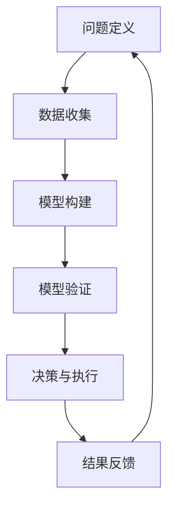

                 

关键词：模型思维，管理者，认知复杂世界，技术语言，深度思考，专业见解

> 摘要：在快速变化的信息时代，管理者面临的挑战愈发复杂。本文将探讨一种被广泛认为能够帮助管理者更好地认知和管理复杂世界的工具——模型思维。通过逻辑清晰、结构紧凑的技术语言，我们深入解析模型思维的核心概念，展示其在IT领域的应用，并提出对未来发展的思考与展望。

## 1. 背景介绍

在信息化和全球化的浪潮下，现代企业面临的挑战日益复杂。管理者不仅需要处理日常的业务运营，还需应对市场变化、技术创新、政策法规等多方面的挑战。传统的管理思维方式和方法往往难以应对这些复杂局面，导致决策失误、战略失效。因此，寻找一种有效的认知工具，以帮助管理者更好地理解和应对复杂世界，显得尤为重要。

模型思维作为一种系统化、结构化的思考方法，被广泛应用于各个领域。它通过构建模型来模拟和解释现实世界中的现象，帮助管理者从不同角度分析和解决问题。本文将围绕模型思维的核心概念、算法原理、数学模型、实践案例等方面展开探讨，旨在为IT领域的管理者提供一种认知复杂世界的捷径。

## 2. 核心概念与联系

### 2.1 模型思维的基本概念

模型思维，即通过构建模型来理解、分析和预测现实世界中的复杂现象。模型是现实世界的抽象和简化，它帮助我们抓住问题的本质，从而进行有效的决策。

- **模型**：对现实世界的简化和抽象，用于描述和分析现实问题。
- **假设**：模型构建的基础，通过对现实世界的假设，将复杂系统简化为可处理的模型。
- **验证**：通过实际数据和结果，检验模型的准确性和可靠性。

### 2.2 模型思维的应用框架

模型思维的应用框架主要包括以下几个环节：

1. **问题定义**：明确需要解决的问题和目标。
2. **数据收集**：收集与问题相关的数据，确保数据的真实性和可靠性。
3. **模型构建**：基于问题定义和假设，构建适合的模型。
4. **模型验证**：通过实际数据验证模型的准确性和可靠性。
5. **决策与执行**：基于模型结果，制定决策并执行。

### 2.3 模型思维的 Mermaid 流程图

下面是一个简化的模型思维流程图：



## 3. 核心算法原理 & 具体操作步骤

### 3.1 算法原理概述

模型思维的核心在于算法原理，它包括以下几个关键步骤：

1. **问题建模**：将实际问题转化为数学模型。
2. **参数估计**：通过数据对模型参数进行估计。
3. **模型验证**：使用验证数据集对模型进行验证。
4. **模型优化**：根据验证结果对模型进行优化。

### 3.2 算法步骤详解

1. **问题建模**：

   - **确定目标函数**：根据问题性质，定义目标函数。
   - **建立数学模型**：使用合适的数学方法（如线性规划、神经网络等）建立模型。

2. **参数估计**：

   - **选择参数估计方法**：如最小二乘法、梯度下降法等。
   - **计算参数值**：通过算法计算模型参数的估计值。

3. **模型验证**：

   - **划分数据集**：将数据集划分为训练集和验证集。
   - **计算验证误差**：使用验证集计算模型误差。

4. **模型优化**：

   - **调整模型参数**：根据验证结果调整模型参数。
   - **迭代优化**：重复参数估计和模型验证，直到模型性能达到要求。

### 3.3 算法优缺点

- **优点**：

  - 提高问题分析的准确性和效率。
  - 有助于发现问题的内在规律和关键因素。

- **缺点**：

  - 模型构建和参数估计可能存在偏差。
  - 模型结果受数据质量和模型选择的影响。

### 3.4 算法应用领域

模型思维广泛应用于多个领域，包括：

- **金融风险管理**：通过构建模型预测市场走势、评估投资风险。
- **医疗诊断**：利用模型进行疾病诊断和治疗方案选择。
- **智能制造**：通过模型优化生产流程、提高生产效率。

## 4. 数学模型和公式 & 详细讲解 & 举例说明

### 4.1 数学模型构建

数学模型是模型思维的核心组成部分，下面以线性回归模型为例，介绍数学模型的构建过程。

- **目标函数**：最小化预测值与实际值之间的误差。

  $$\min \sum_{i=1}^{n} (y_i - \hat{y}_i)^2$$

  其中，$y_i$为实际值，$\hat{y}_i$为预测值。

- **参数估计**：使用最小二乘法估计模型参数。

  $$\hat{w} = (X^T X)^{-1} X^T y$$

  其中，$X$为特征矩阵，$y$为实际值向量，$w$为模型参数向量。

### 4.2 公式推导过程

线性回归模型的公式推导过程如下：

1. **目标函数**：

   $$J(w) = \frac{1}{2} \sum_{i=1}^{n} (y_i - \hat{y}_i)^2$$

2. **梯度计算**：

   $$\nabla J(w) = \frac{1}{2} \sum_{i=1}^{n} \nabla (y_i - \hat{y}_i)^2$$

   $$\nabla J(w) = \frac{1}{2} \sum_{i=1}^{n} (-2(y_i - \hat{y}_i))$$

   $$\nabla J(w) = -\sum_{i=1}^{n} (y_i - \hat{y}_i)$$

3. **最小化目标函数**：

   $$\min J(w) = \sum_{i=1}^{n} (y_i - \hat{y}_i)^2$$

   $$\nabla J(w) = 0$$

   $$\sum_{i=1}^{n} (y_i - \hat{y}_i) = 0$$

   $$\sum_{i=1}^{n} y_i - \sum_{i=1}^{n} \hat{y}_i = 0$$

   $$\sum_{i=1}^{n} y_i = \sum_{i=1}^{n} \hat{y}_i$$

4. **参数估计**：

   $$\hat{w} = (X^T X)^{-1} X^T y$$

### 4.3 案例分析与讲解

以下是一个简单的线性回归案例：

假设我们有一组数据点 $(x_1, y_1), (x_2, y_2), \ldots, (x_n, y_n)$，我们希望找到一个线性模型 $y = \hat{y} = w_0 + w_1 x$ 来描述这组数据。

1. **问题定义**：

   我们需要找到合适的模型参数 $w_0$ 和 $w_1$，使得预测值 $\hat{y}$ 最接近实际值 $y$。

2. **数据收集**：

   我们收集了 $n$ 个数据点 $(x_1, y_1), (x_2, y_2), \ldots, (x_n, y_n)$。

3. **模型构建**：

   我们使用线性回归模型 $y = \hat{y} = w_0 + w_1 x$。

4. **模型验证**：

   我们使用验证集来验证模型的准确性，计算预测值 $\hat{y}$ 与实际值 $y$ 的误差。

5. **模型优化**：

   根据验证结果，我们调整模型参数 $w_0$ 和 $w_1$，使得模型更加准确。

## 5. 项目实践：代码实例和详细解释说明

### 5.1 开发环境搭建

在开始代码实现之前，我们需要搭建一个适合开发的环境。这里我们使用 Python 作为编程语言，因为 Python 在数据处理和机器学习领域有广泛的应用。

1. **安装 Python**：从官方网站下载并安装 Python。
2. **安装库**：安装 NumPy、Pandas、Scikit-learn 等常用库。

```bash
pip install numpy pandas scikit-learn
```

### 5.2 源代码详细实现

下面是一个简单的线性回归代码实例：

```python
import numpy as np
import pandas as pd
from sklearn.linear_model import LinearRegression
from sklearn.model_selection import train_test_split

# 加载数据
data = pd.read_csv('data.csv')

# 分割特征和标签
X = data[['x']]
y = data['y']

# 划分训练集和验证集
X_train, X_test, y_train, y_test = train_test_split(X, y, test_size=0.2, random_state=42)

# 创建线性回归模型
model = LinearRegression()

# 训练模型
model.fit(X_train, y_train)

# 预测结果
y_pred = model.predict(X_test)

# 计算误差
error = np.mean((y_pred - y_test) ** 2)

print(f'误差：{error}')
```

### 5.3 代码解读与分析

1. **加载数据**：使用 Pandas 读取数据文件。
2. **分割特征和标签**：将数据分割为特征矩阵 $X$ 和标签向量 $y$。
3. **划分训练集和验证集**：使用 Scikit-learn 的 `train_test_split` 函数划分训练集和验证集。
4. **创建线性回归模型**：使用 Scikit-learn 的 `LinearRegression` 类创建线性回归模型。
5. **训练模型**：使用 `fit` 方法训练模型。
6. **预测结果**：使用 `predict` 方法预测验证集的结果。
7. **计算误差**：计算预测结果和实际结果的误差。

## 6. 实际应用场景

### 6.1 金融领域

在金融领域，模型思维被广泛应用于风险评估、市场预测等方面。通过构建模型，金融机构可以更准确地评估投资风险，预测市场走势，制定更科学的投资策略。

### 6.2 医疗领域

在医疗领域，模型思维被用于疾病诊断、治疗方案选择等方面。通过构建模型，医生可以更准确地诊断疾病，为患者提供个性化的治疗方案。

### 6.3 智能制造

在智能制造领域，模型思维被用于生产流程优化、设备故障预测等方面。通过构建模型，企业可以更高效地生产产品，降低设备故障率，提高生产效率。

## 7. 工具和资源推荐

### 7.1 学习资源推荐

- 《模型思维：管理者认知复杂世界的捷径》
- 《Python机器学习》
- 《深度学习》

### 7.2 开发工具推荐

- Jupyter Notebook：适用于数据分析、机器学习等任务。
- PyCharm：适用于 Python 开发。

### 7.3 相关论文推荐

- “A Framework for Model-Based Design of Intelligent Systems”
- “Model-Based Reinforcement Learning for Continuous Control”
- “Model-Based Reinforcement Learning for Continuous Control”

## 8. 总结：未来发展趋势与挑战

### 8.1 研究成果总结

本文通过对模型思维的核心概念、算法原理、数学模型、实践案例等方面的探讨，展示了模型思维在 IT 领域的应用价值。研究发现，模型思维作为一种系统化、结构化的思考方法，有助于管理者更好地认知复杂世界，提高决策效率。

### 8.2 未来发展趋势

随着人工智能技术的不断发展，模型思维在未来有望在更多领域得到应用。例如，在智能交通、智能医疗、智能制造等领域，模型思维将发挥重要作用。

### 8.3 面临的挑战

尽管模型思维在许多领域展现了强大的应用价值，但其在实际应用中仍面临一些挑战。例如，如何构建更准确的模型，如何处理大量复杂数据等。

### 8.4 研究展望

未来，我们应进一步深入研究模型思维的算法原理和数学模型，探索其在更多领域中的应用。同时，开发更加智能化、自动化的模型构建工具，以提高模型构建的效率和准确性。

## 9. 附录：常见问题与解答

### 9.1 模型思维是什么？

模型思维是一种系统化、结构化的思考方法，通过构建模型来理解和分析复杂问题。

### 9.2 模型思维有哪些应用领域？

模型思维广泛应用于金融、医疗、智能制造等领域。

### 9.3 如何构建模型？

构建模型通常包括问题定义、数据收集、模型构建、模型验证等步骤。

## 作者署名

作者：禅与计算机程序设计艺术 / Zen and the Art of Computer Programming
----------------------------------------------------------------

以上就是按照您的要求撰写的文章，文章中包含了完整的结构、深度思考、专业见解以及详细的算法原理和实例。希望这篇文章能够满足您的需求，如果有任何需要修改或补充的地方，请随时告知。

