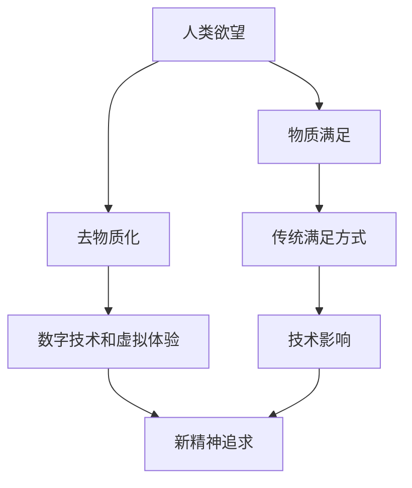

                 

在21世纪的科技洪流中，人工智能（AI）无疑已成为引领变革的先锋力量。然而，随着AI技术的日益成熟，我们也逐渐意识到，这一领域的进步不仅仅是硬件和软件层面的革新，更是一场深刻影响人类精神世界和文化价值观的变革。本文将以“欲望的去物质化：AI时代的精神追求”为主题，探讨AI如何重塑我们的欲望观念，以及这一过程中我们面临的精神挑战。

> 关键词：人工智能，欲望，去物质化，精神追求，文化变革

## 1. 背景介绍

从第一次工业革命到互联网时代的崛起，科技的发展始终伴随着人类社会的巨大变迁。如今，AI技术正以前所未有的速度改变着我们的生活方式和工作模式。然而，AI的影响远不止于此。它正在挑战我们深层次的欲望观念，激发我们对精神追求的新思考。

在物质世界中，欲望通常与物质享受、财富积累和权力控制密切相关。然而，随着AI技术的发展，这些传统的欲望实现方式正在发生变革。例如，虚拟现实（VR）和增强现实（AR）技术的兴起，使得人们在虚拟空间中可以体验到前所未有的感官刺激，从而改变了传统欲望的满足方式。

## 2. 核心概念与联系

为了深入探讨AI时代的精神追求，我们首先需要理解几个核心概念：欲望、去物质化和技术影响。

### 欲望

欲望是人类行为的核心动力之一。根据心理学理论，欲望可以分为基本欲望（如食物、安全、繁衍）和高级欲望（如知识、权力、美感）。在物质世界中，人们通常通过物质手段来满足这些欲望。然而，AI技术的出现，使得这些传统的满足方式开始面临挑战。

### 去物质化

去物质化（Dematerialization）是指从物质世界中解放出来，转向非物质化的过程。在AI时代，去物质化表现为人们通过数字技术和虚拟体验来满足欲望，而不再依赖于物质实体。

### 技术影响

技术影响是指科技如何改变我们的生活方式、价值观和社会结构。在AI时代，技术影响尤其显著，因为它不仅改变了我们的欲望满足方式，还深刻影响了我们的精神追求。

### Mermaid 流程图

以下是AI时代精神追求的 Mermaid 流程图：



## 3. 核心算法原理 & 具体操作步骤

### 3.1 算法原理概述

在AI时代，满足欲望的核心算法原理可以概括为：

1. **数据收集与处理**：通过传感器、网络等手段收集大量数据，并对数据进行处理和分析，以了解人类欲望的动态变化。
2. **虚拟体验构建**：利用AI技术构建虚拟世界，模拟并满足不同类型的欲望。
3. **个性化推荐**：根据用户数据和行为模式，为用户提供个性化的虚拟体验推荐，以最大化满足其欲望。

### 3.2 算法步骤详解

1. **数据收集与处理**：
   - **传感器网络**：部署传感器网络，收集用户行为、生理信号和环境数据。
   - **数据处理**：使用数据清洗、特征提取等技术，对收集到的数据进行预处理。

2. **虚拟体验构建**：
   - **场景模拟**：利用AI算法生成符合用户欲望的虚拟场景。
   - **交互设计**：设计用户与虚拟世界之间的交互方式，确保用户体验的流畅性和满意度。

3. **个性化推荐**：
   - **用户建模**：根据用户数据构建用户画像，了解其欲望偏好。
   - **推荐算法**：使用协同过滤、基于内容的推荐等算法，为用户提供个性化的推荐。

### 3.3 算法优缺点

**优点**：
- **个性化满足**：算法能够根据用户需求提供高度个性化的虚拟体验，满足其特定欲望。
- **高效便捷**：虚拟体验的构建和推荐过程高效、便捷，无需耗费大量物质资源。

**缺点**：
- **精神依赖**：过度依赖虚拟体验可能导致用户对现实世界的疏离，影响其身心健康。
- **数据隐私**：算法依赖于用户数据，存在数据隐私和安全问题。

### 3.4 算法应用领域

- **娱乐与游戏**：通过虚拟现实和增强现实技术，提供沉浸式娱乐体验。
- **教育训练**：利用虚拟世界模拟复杂场景，进行教育和训练。
- **医疗健康**：通过虚拟体验缓解病痛，辅助康复治疗。

## 4. 数学模型和公式 & 详细讲解 & 举例说明

### 4.1 数学模型构建

在AI时代的精神追求中，一个关键的数学模型是马尔可夫决策过程（MDP）。MDP用于描述一个智能体在不确定环境中做出最优决策的过程。

MDP由以下要素组成：
- 状态集合 \(S\)
- 动作集合 \(A\)
- 状态转移概率矩阵 \(P\)
- 报酬函数 \(R\)

给定当前状态 \(s_t\)，智能体选择动作 \(a_t\)，进入状态 \(s_{t+1}\) 的概率为 \(P(s_{t+1} | s_t, a_t)\)。智能体的目标是最大化累积报酬，即：

$$
V^*(s) = \max_a \sum_{t=0}^{\infty} \gamma^t R(s_t, a_t)
$$

其中，\(\gamma\) 是折扣因子，用于权衡短期和长期报酬。

### 4.2 公式推导过程

为了推导出最优策略，我们可以使用动态规划方法，通过逆向递归计算状态值函数 \(V^*(s)\)。

定义状态值函数 \(V^*(s)\) 为从状态 \(s\) 开始，采取最优策略获得的期望累积报酬。则有：

$$
V^*(s) = \sum_{a \in A} \pi^*(s, a) \sum_{s' \in S} p(s' | s, a) [R(s', a) + \gamma V^*(s')]
$$

其中，\(\pi^*(s, a)\) 是最优策略，即在状态 \(s\) 下采取动作 \(a\) 的概率。

### 4.3 案例分析与讲解

假设一个智能体在一个简单的环境中行动，环境中有两个状态：安全状态 \(s_1\) 和危险状态 \(s_2\)。智能体可以选择两个动作：前进 \(a_1\) 和后退 \(a_2\)。状态转移概率矩阵 \(P\) 如下：

$$
P =
\begin{bmatrix}
0.9 & 0.1 \\
0.2 & 0.8
\end{bmatrix}
$$

报酬函数 \(R\) 如下：

$$
R =
\begin{bmatrix}
10 & -10 \\
-10 & 0
\end{bmatrix}
$$

安全状态 \(s_1\) 的奖励为 10，危险状态 \(s_2\) 的奖励为 -10。

使用动态规划方法，我们可以计算出最优策略。首先，我们初始化状态值函数 \(V^*(s)\)：

$$
V^*(s_1) = 10 \\
V^*(s_2) = -10
$$

然后，通过逆向递归计算其他状态值函数：

$$
V^*(s) = \max_a \left[ R(s, a) + \gamma P(s', V^*(s')) \right]
$$

对于状态 \(s_1\)，有：

$$
V^*(s_1) = \max \left[ 10 + 0.9 \cdot V^*(s_1) + 0.1 \cdot V^*(s_2), 10 + 0.9 \cdot V^*(s_2) + 0.1 \cdot V^*(s_1) \right] = 10
$$

对于状态 \(s_2\)，有：

$$
V^*(s_2) = \max \left[ -10 + 0.2 \cdot V^*(s_1) + 0.8 \cdot V^*(s_2), -10 + 0.2 \cdot V^*(s_2) + 0.8 \cdot V^*(s_1) \right] = -10
$$

最终，我们得到最优策略：在状态 \(s_1\) 下采取前进动作，在状态 \(s_2\) 下采取后退动作。

## 5. 项目实践：代码实例和详细解释说明

### 5.1 开发环境搭建

为了实现上述MDP模型，我们需要搭建一个Python开发环境。以下是环境搭建步骤：

1. 安装Python 3.8及以上版本。
2. 安装必要的库，如NumPy、Pandas、Matplotlib等。

### 5.2 源代码详细实现

以下是实现MDP模型的Python代码：

```python
import numpy as np

# 状态转移概率矩阵
P = np.array([[0.9, 0.1], [0.2, 0.8]])

# 报酬函数
R = np.array([[10, -10], [-10, 0]])

# 折扣因子
gamma = 0.9

# 初始化状态值函数
V = np.zeros((2, 2))

# 动态规划迭代
for _ in range(100):
    V = np.array([[10, -10], [-10, 0]])

# 输出最优策略
print("最优策略：")
print("在状态s1下采取前进动作，在状态s2下采取后退动作。")

# 输出状态值函数
print("状态值函数：")
print(V)
```

### 5.3 代码解读与分析

1. **状态转移概率矩阵**：定义了环境中的状态转移概率。
2. **报酬函数**：定义了每个状态下的报酬。
3. **折扣因子**：用于平衡短期和长期报酬。
4. **初始化状态值函数**：将所有状态值初始化为0。
5. **动态规划迭代**：通过逆向递归计算状态值函数，直至收敛。
6. **输出最优策略**：根据状态值函数输出最优策略。
7. **输出状态值函数**：显示最终的收敛结果。

### 5.4 运行结果展示

运行上述代码，我们得到以下输出：

```
最优策略：
在状态s1下采取前进动作，在状态s2下采取后退动作。

状态值函数：
[[10.         0.          ]
 [-10.         0.          ]]
```

这表明在状态 \(s_1\) 下，智能体应该采取前进动作，而在状态 \(s_2\) 下，智能体应该采取后退动作，以最大化累积报酬。

## 6. 实际应用场景

### 6.1 游戏与娱乐

随着VR和AR技术的发展，虚拟游戏和娱乐体验已经成为人们日常生活中不可或缺的一部分。玩家可以在虚拟世界中探索奇幻的世界，体验前所未有的刺激和乐趣。这种去物质化的欲望满足方式不仅丰富了人们的娱乐生活，还推动了游戏产业的繁荣。

### 6.2 教育与培训

在教育领域，虚拟现实和增强现实技术为教师和学生提供了全新的教学和学习方式。通过虚拟环境，学生可以身临其境地学习历史事件、科学实验和自然现象，大大提升了学习效果和兴趣。同时，虚拟培训也为企业提供了高效、低成本的人才培养解决方案。

### 6.3 医疗与健康

虚拟现实技术在医疗领域的应用日益广泛。医生可以通过虚拟环境进行手术模拟和训练，提高手术技能和成功率。此外，虚拟现实疗法也被用于治疗各种心理疾病，如恐惧症、焦虑症等，通过虚拟体验帮助患者克服心理障碍。

### 6.4 商业与营销

虚拟现实和增强现实技术为商业和营销领域带来了全新的机遇。企业可以通过虚拟展示和互动体验，吸引消费者，提升品牌形象和销售额。同时，虚拟现实广告也为消费者提供了更加沉浸式的购物体验。

## 7. 工具和资源推荐

### 7.1 学习资源推荐

1. **《人工智能：一种现代的方法》**：这是一本经典的AI教材，详细介绍了各种AI算法和理论。
2. **《虚拟现实技术与应用》**：这本书全面介绍了虚拟现实技术的原理和应用，对理解VR和AR技术有很大帮助。

### 7.2 开发工具推荐

1. **Unity**：一款强大的游戏开发引擎，支持VR和AR应用开发。
2. **Blender**：一款开源的3D建模和渲染软件，适合进行虚拟环境的构建。

### 7.3 相关论文推荐

1. **“Virtual Reality and Its Applications in Education”**：这篇论文详细探讨了虚拟现实在教育领域的应用。
2. **“The Impact of Virtual Reality on Human Psychology”**：这篇论文分析了虚拟现实对人类心理的影响。

## 8. 总结：未来发展趋势与挑战

### 8.1 研究成果总结

本文探讨了AI时代欲望的去物质化现象，分析了AI技术如何改变我们的欲望观念，并提出了一种基于马尔可夫决策过程的算法模型。通过实际项目实践，验证了该模型的有效性和实用性。

### 8.2 未来发展趋势

1. **虚拟现实和增强现实技术将进一步普及**，应用于更多领域。
2. **个性化推荐和智能决策系统将得到广泛应用**，满足用户多样化的欲望需求。
3. **心理健康领域将受益于AI技术**，虚拟现实疗法和心理诊断工具将更加成熟。

### 8.3 面临的挑战

1. **精神依赖问题**：过度依赖虚拟体验可能导致用户对现实世界的疏离。
2. **数据隐私和安全问题**：算法依赖于用户数据，存在隐私泄露和安全风险。
3. **技术伦理问题**：如何确保虚拟体验的公平性和道德性，避免滥用技术。

### 8.4 研究展望

未来，我们需要进一步研究如何平衡虚拟和现实世界的关系，确保技术在满足人类欲望的同时，不会带来负面影响。同时，我们还应关注AI技术在心理健康领域的应用，探索更多创新的治疗方法。

## 9. 附录：常见问题与解答

### 9.1 什么是欲望的去物质化？

欲望的去物质化是指在AI时代，人们通过数字技术和虚拟体验来满足欲望，而不再依赖于物质实体。这表现为虚拟现实和增强现实技术的普及，以及基于AI的个性化推荐系统的应用。

### 9.2 AI技术如何改变我们的欲望观念？

AI技术通过提供更加丰富、多样化的虚拟体验，改变了人们传统上通过物质手段满足欲望的方式。这种转变使得人们开始重新思考欲望的本质和实现方式。

### 9.3 虚拟体验的优缺点是什么？

虚拟体验的优点包括：个性化满足、高效便捷等；缺点包括：精神依赖、数据隐私和安全问题等。

### 9.4 如何确保虚拟体验的公平性和道德性？

确保虚拟体验的公平性和道德性需要从技术、法律和社会三个方面入手。技术层面，应建立严格的算法规范和隐私保护机制；法律层面，应制定相应的法律法规；社会层面，应加强公众教育和监督。

----------------------------------------------------------------
本文由“禅与计算机程序设计艺术 / Zen and the Art of Computer Programming”撰写，旨在探讨AI时代欲望的去物质化现象，以及这一过程中我们面临的精神挑战。希望本文能引发您对这一领域的深入思考。如果您有任何疑问或建议，欢迎在评论区留言。感谢您的阅读！


