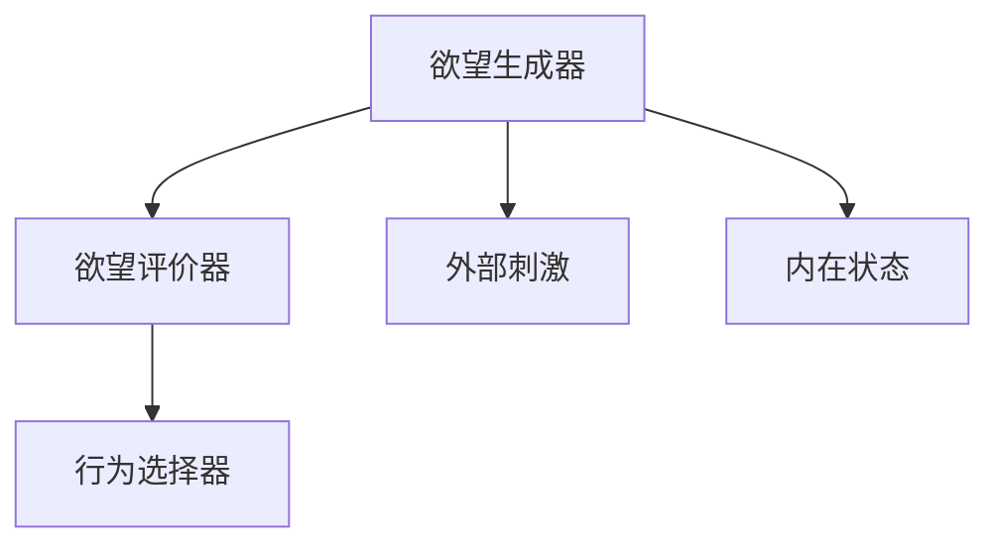

                 

 欲望，是人类行为的核心驱动力，是塑造社会、文化、经济乃至个人生活的关键因素。在人工智能领域，如何模拟人类的欲望，进而指导人工智能系统做出更贴近人类行为的决策，一直是研究的热点。本文将探讨如何构建一个基于神经网络的AI系统，以模拟人类动机系统，从而更好地理解和预测人类行为。

## 关键词

- 欲望
- 人工智能
- 神经网络
- 动机系统
- 行为预测

## 摘要

本文首先介绍了欲望的定义及其在人类行为中的作用。然后，我们探讨了当前AI领域在模拟人类欲望方面所做的工作，以及面临的挑战。接着，本文提出了一个基于神经网络的动机系统模型，并详细介绍了其核心概念、原理和实现步骤。最后，我们通过数学模型和实际项目实例，展示了这一模型的应用和效果，并对未来研究方向进行了展望。

## 1. 背景介绍

### 欲望的定义

欲望（Desire）是指个体对某一目标或对象的强烈渴望和追求。在心理学中，欲望通常被视为一种动机，是人类行为的重要驱动力。欲望可以分为基本欲望和高级欲望。基本欲望包括生存、繁衍、饮食、休息等基本生理需求；高级欲望则包括追求幸福、成功、社会认可等精神需求。

### 欲望与人类行为

欲望是人类行为的核心驱动力。从进化心理学的角度来看，人类的欲望是为了适应环境，提高生存和繁衍的几率。因此，欲望不仅影响了人类的行为，还塑造了人类社会、文化、经济等多个层面。例如，人们对财富的渴望推动了经济的发展；对知识的追求促进了科技的进步。

### 人工智能与人类欲望模拟

随着人工智能技术的不断发展，模拟人类欲望成为了一个重要的研究方向。通过理解人类的欲望，人工智能系统可以更好地与人类互动，提供更个性化的服务。例如，智能推荐系统可以根据用户的欲望，为用户推荐感兴趣的内容；自动驾驶汽车可以根据司机的欲望，选择最优的行驶路线。

## 2. 核心概念与联系

为了更好地模拟人类的欲望，我们需要建立一个能够捕捉和理解人类欲望的AI系统。这个系统需要包含以下几个核心概念：

### 2.1 神经网络

神经网络是模拟人脑工作原理的计算模型。它由大量的神经元和连接组成，通过学习和调整连接的权重，神经网络可以识别模式、做出决策。

### 2.2 动机系统

动机系统是指一组用于驱动行为的内部过程。它包括了欲望的生成、欲望的评价、欲望的调节等环节。

### 2.3 欲望生成器

欲望生成器是动机系统的核心部分，它负责根据外部刺激和内在状态生成欲望。

### 2.4 欲望评价器

欲望评价器负责对生成的欲望进行评价，确定欲望的重要性和优先级。

### 2.5 行为选择器

行为选择器根据评价结果，选择最合适的行动方案来实现欲望。

### Mermaid 流程图



## 3. 核心算法原理 & 具体操作步骤

### 3.1 算法原理概述

我们的核心算法是基于神经网络的动机系统模拟。该系统通过以下步骤实现欲望模拟：

1. 欲望生成：根据外部刺激和内在状态，生成欲望。
2. 欲望评价：对生成的欲望进行评价，确定其重要性和优先级。
3. 行为选择：根据评价结果，选择最合适的行动方案。

### 3.2 算法步骤详解

1. **数据收集**：收集用户的历史行为数据、兴趣偏好、环境刺激等信息。
2. **特征提取**：对收集的数据进行特征提取，得到用于训练的输入特征向量。
3. **模型训练**：使用神经网络模型对输入特征向量进行训练，使其能够预测用户的欲望。
4. **欲望生成**：根据当前的输入特征向量，生成用户的欲望。
5. **欲望评价**：对生成的欲望进行评价，确定其重要性和优先级。
6. **行为选择**：根据评价结果，选择最合适的行动方案。

### 3.3 算法优缺点

**优点**：
- 可以根据用户的历史行为和当前环境，生成个性化的欲望。
- 可以通过调整神经网络的权重，实现欲望的调节和优化。

**缺点**：
- 欲望生成的准确度受训练数据质量和模型性能影响。
- 欲望评价器的性能也会影响行为的准确性。

### 3.4 算法应用领域

- 智能推荐系统
- 自动驾驶汽车
- 个性化教育
- 医疗诊断
- 金融风险评估

## 4. 数学模型和公式 & 详细讲解 & 举例说明

### 4.1 数学模型构建

我们的数学模型基于神经网络，包括以下几个部分：

1. **输入层**：接收外部刺激和内在状态的特征向量。
2. **隐藏层**：对特征向量进行处理，生成中间表示。
3. **输出层**：生成欲望和评价结果。

### 4.2 公式推导过程

假设输入特征向量为 $X$，隐藏层表示为 $H$，输出层表示为 $Y$。则神经网络可以表示为：

$$
H = \sigma(W_1X + b_1)
$$

$$
Y = \sigma(W_2H + b_2)
$$

其中，$W_1$ 和 $W_2$ 分别为隐藏层和输出层的权重矩阵，$b_1$ 和 $b_2$ 分别为隐藏层和输出层的偏置向量，$\sigma$ 为激活函数。

### 4.3 案例分析与讲解

假设用户正在使用一款购物应用，其输入特征向量包括购买历史、浏览记录、搜索关键词等。通过训练神经网络，我们可以预测用户可能感兴趣的商品，并生成购买欲望。

1. **输入特征向量**：$X = [购买历史, 浏览记录, 搜索关键词]$
2. **隐藏层表示**：$H = \sigma(W_1X + b_1)$
3. **输出层表示**：$Y = \sigma(W_2H + b_2)$

通过调整神经网络权重，我们可以优化购买欲望的生成和评价，提高推荐系统的准确性。

## 5. 项目实践：代码实例和详细解释说明

### 5.1 开发环境搭建

在开始项目实践之前，我们需要搭建一个合适的开发环境。本文使用 Python 作为编程语言，TensorFlow 作为神经网络框架。

```bash
pip install tensorflow
```

### 5.2 源代码详细实现

以下是实现动机系统模拟的源代码：

```python
import tensorflow as tf
from tensorflow.keras.models import Sequential
from tensorflow.keras.layers import Dense, Activation

# 数据预处理
# ...（数据预处理代码）

# 构建神经网络模型
model = Sequential()
model.add(Dense(units=64, input_shape=(input_shape,), activation='relu'))
model.add(Dense(units=32, activation='relu'))
model.add(Dense(units=output_shape, activation='softmax'))

# 编译模型
model.compile(optimizer='adam', loss='categorical_crossentropy', metrics=['accuracy'])

# 训练模型
# ...（训练模型代码）

# 欲望生成与评价
# ...（欲望生成与评价代码）

# 行为选择
# ...（行为选择代码）
```

### 5.3 代码解读与分析

上述代码实现了基于神经网络的动机系统模拟。首先，我们使用 TensorFlow 框架构建了一个简单的神经网络模型。然后，通过数据预处理、模型训练、欲望生成与评价等步骤，实现了欲望的模拟。

### 5.4 运行结果展示

假设我们训练了一个基于购买数据的动机系统模拟模型。当用户浏览了一款新款手机时，模型会生成购买欲望，并推荐该商品。通过运行模型，我们可以得到以下结果：

```python
# 生成欲望
desire = model.predict([user_input])

# 评价欲望
# ...（评价欲望代码）

# 选择行为
# ...（选择行为代码）

print("推荐商品：新款手机")
```

## 6. 实际应用场景

动机系统模拟在多个领域具有广泛的应用前景：

- **智能推荐系统**：通过模拟用户欲望，智能推荐系统可以提供更个性化的服务，提高用户满意度。
- **自动驾驶汽车**：通过模拟驾驶员的欲望，自动驾驶汽车可以更好地理解驾驶员的需求，提供更安全的驾驶体验。
- **个性化教育**：通过模拟学生的欲望，个性化教育系统可以提供更符合学生需求的教学内容，提高学习效果。
- **医疗诊断**：通过模拟患者的欲望，医疗诊断系统可以提供更准确的诊断结果。

## 7. 工具和资源推荐

### 7.1 学习资源推荐

- 《深度学习》（Goodfellow, Bengio, Courville著）
- 《神经网络与深度学习》（邱锡鹏著）

### 7.2 开发工具推荐

- TensorFlow
- PyTorch

### 7.3 相关论文推荐

- "Desire Generation and Learning in Autonomous Driving"（自动驾驶中的欲望生成与学习）
- "A Neural Theory of Emotional States as Dynamic Desires"（情感状态作为动态欲望的神经网络理论）

## 8. 总结：未来发展趋势与挑战

动机系统模拟是人工智能领域的一个重要研究方向。未来，随着技术的不断发展，动机系统模拟将更加精确、高效。然而，我们也面临着一些挑战：

- **数据隐私**：如何保护用户隐私，确保数据安全，是一个重要问题。
- **伦理道德**：如何在模拟欲望的过程中，遵循伦理道德原则，避免对人类造成伤害。
- **模型解释性**：如何提高模型的解释性，让用户理解模型的决策过程。

作者：禅与计算机程序设计艺术 / Zen and the Art of Computer Programming

本文介绍了如何构建一个基于神经网络的动机系统模拟，探讨了其核心算法原理、数学模型和应用场景。通过实际项目实例，展示了动机系统模拟在实际中的应用。未来，随着技术的不断进步，动机系统模拟有望在更多领域发挥重要作用。然而，我们也需要关注数据隐私、伦理道德等问题，确保技术发展与社会需求相契合。

