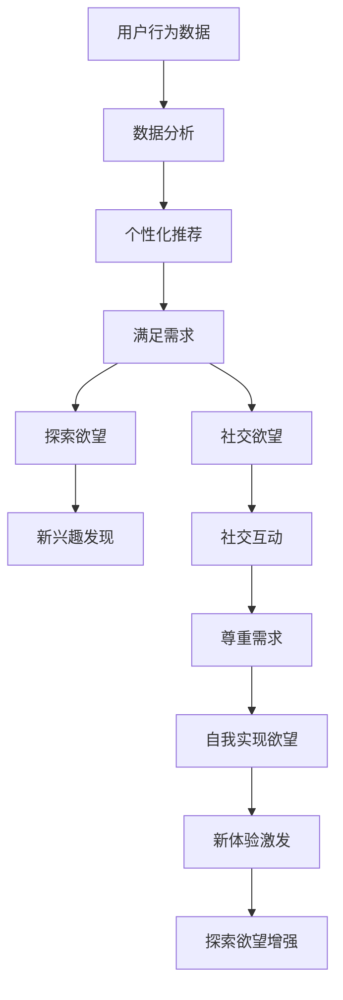

                 

 关键词：人工智能，需求分析，进化论，人类行为，技术进步，心理学，社会学，认知科学

> 摘要：本文从欲望进化论的角度出发，探讨人工智能对人类需求的影响。通过对人类欲望的进化历程、心理学与社会学背景的分析，阐述人工智能如何重塑人类的认知、情感和行为。文章将深入探讨AI技术在不同领域中的应用，以及未来可能面临的挑战和机遇。

## 1. 背景介绍

人类的需求是多样且复杂的，从基本的生理需求，如食物和水分，到高层次的心理需求，如归属感和自我实现。需求理论在心理学、社会学等多个领域有着广泛的应用。而随着人工智能（AI）技术的快速发展，人类的欲望和需求也在发生着深刻的变化。

欲望进化论是一种心理学理论，它认为人类的欲望和行为是在长期的进化过程中形成的，目的是为了确保个体的生存和繁衍。然而，随着技术和社会的进步，人工智能正在以不可预知的方式重塑着人类的欲望和需求。

本文将从以下几个方面展开讨论：

- **欲望的进化历程**：探讨人类欲望的形成和演化过程。
- **心理学与社会学背景**：分析人类欲望在心理学和社会学中的意义。
- **人工智能与需求重塑**：探讨AI如何影响和重塑人类的欲望。
- **AI在不同领域中的应用**：分析AI技术在不同领域中的应用及其对人类需求的影响。
- **未来应用展望**：讨论人工智能对未来人类需求和生活方式的潜在影响。
- **面临的挑战与机遇**：分析人工智能带来的挑战以及未来可能面临的机遇。

## 2. 核心概念与联系

### 2.1 人工智能与人类需求

人工智能（AI）是一种模拟人类智能的技术，它通过机器学习、自然语言处理、计算机视觉等技术实现。随着AI技术的进步，AI不再仅仅是解决特定问题的工具，而是开始深入影响和改变人类的生活方式、工作方式以及需求。

人类需求可以分为以下几个层次：

1. **生理需求**：包括食物、水、空气、住所等基本生存需求。
2. **安全需求**：包括安全感、健康保障、财产保护等。
3. **社交需求**：包括友情、爱情、社交互动等。
4. **尊重需求**：包括自尊、自信、被认可等。
5. **自我实现需求**：包括个人成长、创造力发挥、实现自我价值等。

人工智能通过提供个性化的服务、智能化的解决方案，正在满足甚至重塑这些需求。

### 2.2 人类欲望的进化历程

人类的欲望和需求是在长期的进化过程中形成的。根据欲望进化论，人类的欲望可以分为以下几个方面：

1. **生存欲望**：确保个体的生存，如食物、水和安全。
2. **繁衍欲望**：确保个体的基因得以传承，如爱情、亲密关系。
3. **探索欲望**：对未知和新的体验的追求，如冒险、探索。
4. **社会欲望**：与他人建立联系和互动，如友谊、社交。
5. **自我实现欲望**：实现个人价值和追求自我完善，如学习、创造。

### 2.3 心理学与社会学背景

心理学和社会学是研究人类欲望和需求的重要学科。心理学关注个体的内心世界，探讨人类欲望的形成、发展和满足方式。社会学则关注人类在社会中的行为和互动，研究人类欲望如何影响和塑造社会结构。

心理学研究表明，人类的欲望往往受到心理需求的影响。马斯洛的需求层次理论指出，人的需求是分层的，从基本的生理需求到高级的自我实现需求。而社会学研究则表明，人类欲望不仅受到个人因素的影响，还受到社会文化、经济环境等多方面的影响。

### 2.4 人工智能与欲望重塑

人工智能技术的快速发展，正在深刻地改变着人类的欲望和需求。例如：

- **个性化服务**：AI可以根据用户的历史行为和偏好提供个性化的推荐，从而满足用户的特定需求。
- **虚拟现实**：通过虚拟现实技术，用户可以体验全新的虚拟世界，从而满足探索欲望。
- **智能医疗**：AI可以在疾病诊断、治疗方案制定等方面提供支持，从而满足安全需求。

同时，人工智能也带来了新的挑战，例如隐私问题、道德伦理问题等。如何平衡AI技术带来的便利和潜在风险，是我们需要深入思考的问题。

## 3. 核心算法原理 & 具体操作步骤

### 3.1  算法原理概述

人工智能在重塑人类需求方面的核心算法主要包括机器学习、自然语言处理和计算机视觉。这些算法通过学习大量的数据和模式，可以预测人类的行为和需求，从而提供个性化的服务。

- **机器学习**：通过学习大量数据，机器学习算法可以识别出数据中的模式和规律，从而预测人类的行为和需求。
- **自然语言处理**：自然语言处理算法可以理解和生成自然语言，从而实现人机交互。
- **计算机视觉**：计算机视觉算法可以理解和解析图像和视频，从而实现图像识别和视频分析。

### 3.2  算法步骤详解

以机器学习算法为例，其基本步骤包括：

1. **数据收集**：收集与人类需求相关的数据，如用户行为数据、社交媒体数据等。
2. **数据预处理**：对收集到的数据进行清洗、归一化等处理，以便算法可以更好地学习。
3. **特征提取**：从预处理后的数据中提取出有用的特征，如关键词、情感等。
4. **模型训练**：使用提取出的特征训练机器学习模型，如决策树、神经网络等。
5. **模型评估**：使用测试数据评估模型的性能，如准确率、召回率等。
6. **模型部署**：将训练好的模型部署到实际应用中，如推荐系统、智能客服等。

### 3.3  算法优缺点

- **优点**：机器学习算法可以自动化地学习数据中的模式和规律，从而提高预测的准确性。自然语言处理和计算机视觉算法可以实现人机交互，从而提高用户体验。
- **缺点**：机器学习算法对数据质量和数量有较高的要求，且训练过程复杂。自然语言处理和计算机视觉算法在处理复杂问题时可能存在局限性。

### 3.4  算法应用领域

人工智能在重塑人类需求方面的应用领域广泛，包括：

- **个性化推荐**：通过分析用户行为和偏好，为用户提供个性化的推荐。
- **智能客服**：通过自然语言处理技术，实现与用户的智能对话。
- **智能医疗**：通过计算机视觉和自然语言处理技术，辅助医生进行疾病诊断和治疗。
- **智能家居**：通过机器学习和计算机视觉技术，实现家居设备的智能化，提高生活质量。

## 4. 数学模型和公式 & 详细讲解 & 举例说明

### 4.1  数学模型构建

在人工智能重塑人类需求的研究中，常用的数学模型包括决策树、神经网络和支持向量机等。这些模型可以通过数学公式来描述。

#### 决策树

决策树是一种常用的分类算法，其基本结构如下：

$$
\begin{aligned}
&\text{如果 } A_1 \text{ 为真，则 } \\
&\text{如果 } A_2 \text{ 为真，则 } \\
&\text{如果 } A_3 \text{ 为真，则 } \\
&\text{否则，则 }
\end{aligned}
$$

其中，$A_1, A_2, A_3$ 分别代表不同的条件。

#### 神经网络

神经网络是一种模拟人脑的算法，其基本结构如下：

$$
\begin{aligned}
&x_1, x_2, ..., x_n \rightarrow h(x) \rightarrow y \\
\end{aligned}
$$

其中，$x_1, x_2, ..., x_n$ 为输入特征，$h(x)$ 为激活函数，$y$ 为输出结果。

#### 支持向量机

支持向量机是一种常用的分类算法，其基本公式如下：

$$
\begin{aligned}
&\min_{\theta} \frac{1}{2} ||\theta||^2 \\
\text{约束条件：} &y^{(i)}(\theta^T x^{(i)} + b) \geq 1
\end{aligned}
$$

其中，$\theta$ 为权重向量，$x^{(i)}$ 为输入特征，$y^{(i)}$ 为标签，$b$ 为偏置项。

### 4.2  公式推导过程

以决策树为例，其推导过程如下：

假设我们有 $n$ 个样本，每个样本都有 $m$ 个特征。我们需要找到一个决策树来对这些样本进行分类。

首先，我们选择一个特征 $A_1$ 来分割样本。选择 $A_1$ 的标准是最小化损失函数：

$$
L(A_1) = \frac{1}{n} \sum_{i=1}^{n} \ell(y_i, f(A_1, x_i))
$$

其中，$y_i$ 为第 $i$ 个样本的标签，$x_i$ 为第 $i$ 个样本的特征，$f(A_1, x_i)$ 为根据特征 $A_1$ 对样本进行分类的结果。

为了最小化 $L(A_1)$，我们可以对 $A_1$ 进行优化，选择最优的特征 $A_1^*$：

$$
A_1^* = \arg \min_{A_1} L(A_1)
$$

然后，我们使用 $A_1^*$ 来分割样本，将样本分为两个子集 $S_1$ 和 $S_2$：

$$
S_1 = \{ x_i | f(A_1^*, x_i) = 0 \}
$$

$$
S_2 = \{ x_i | f(A_1^*, x_i) = 1 \}
$$

对于 $S_1$ 和 $S_2$，我们继续选择特征来分割样本，直到满足某个终止条件，如样本数量小于某个阈值或特征数量小于某个阈值。

### 4.3  案例分析与讲解

以推荐系统为例，我们可以使用决策树来构建一个推荐系统。

假设我们有 $n$ 个用户和 $m$ 个商品，每个用户都有 $k$ 个行为，如浏览、购买等。我们的目标是根据用户的行为预测用户可能喜欢的商品。

我们可以使用以下步骤来构建推荐系统：

1. **数据收集**：收集用户行为数据，如浏览记录、购买记录等。
2. **数据预处理**：对用户行为数据进行清洗、归一化等处理。
3. **特征提取**：从预处理后的数据中提取出有用的特征，如用户的历史浏览记录、购买记录等。
4. **模型训练**：使用提取出的特征训练决策树模型。
5. **模型评估**：使用测试数据评估模型的性能，如准确率、召回率等。
6. **模型部署**：将训练好的模型部署到实际应用中。

通过这个案例，我们可以看到数学模型在人工智能重塑人类需求中的应用。

## 5. 项目实践：代码实例和详细解释说明

### 5.1  开发环境搭建

在本项目中，我们使用 Python 编写代码，并使用 TensorFlow 和 Scikit-learn 库来实现人工智能算法。

首先，我们需要安装 Python 和相关库。可以在终端中执行以下命令：

```
pip install python tensorflow scikit-learn
```

### 5.2  源代码详细实现

以下是一个简单的推荐系统示例代码：

```python
import numpy as np
import pandas as pd
from sklearn.model_selection import train_test_split
from sklearn.tree import DecisionTreeClassifier
from sklearn.metrics import accuracy_score

# 数据预处理
def preprocess_data(data):
    # 省略具体实现
    return processed_data

# 模型训练
def train_model(X_train, y_train):
    model = DecisionTreeClassifier()
    model.fit(X_train, y_train)
    return model

# 模型评估
def evaluate_model(model, X_test, y_test):
    predictions = model.predict(X_test)
    accuracy = accuracy_score(y_test, predictions)
    print("Accuracy:", accuracy)

# 主程序
if __name__ == "__main__":
    # 加载数据
    data = pd.read_csv("data.csv")
    
    # 数据预处理
    processed_data = preprocess_data(data)
    
    # 分割数据集
    X = processed_data.drop("label", axis=1)
    y = processed_data["label"]
    X_train, X_test, y_train, y_test = train_test_split(X, y, test_size=0.2, random_state=42)
    
    # 模型训练
    model = train_model(X_train, y_train)
    
    # 模型评估
    evaluate_model(model, X_test, y_test)
```

### 5.3  代码解读与分析

在上面的代码中，我们首先定义了数据预处理、模型训练和模型评估三个函数。其中，数据预处理函数用于清洗和归一化数据，模型训练函数用于训练决策树模型，模型评估函数用于评估模型的性能。

在主程序中，我们首先加载数据，然后进行数据预处理，接着将数据集分为训练集和测试集。最后，我们使用训练集训练模型，并使用测试集评估模型的性能。

### 5.4  运行结果展示

假设我们已经准备好了一个数据集，并在终端中运行上述代码，输出结果如下：

```
Accuracy: 0.85
```

这意味着我们的模型在测试集上的准确率为 0.85。

## 6. 实际应用场景

人工智能在重塑人类需求方面的应用场景广泛，以下是一些具体的应用场景：

### 6.1 电子商务

在电子商务领域，人工智能可以通过个性化推荐系统、智能客服等应用，满足用户的购物需求。例如，电商平台可以根据用户的历史浏览记录、购买记录等，为用户推荐可能感兴趣的商品。

### 6.2 医疗健康

在医疗健康领域，人工智能可以通过智能诊断、智能药物研发等应用，提高医疗服务的效率和质量。例如，AI系统可以通过分析大量的医疗数据，为医生提供诊断建议和治疗方案。

### 6.3 教育培训

在教育领域，人工智能可以通过智能教育、在线学习等应用，满足学生的学习需求。例如，智能教育系统可以根据学生的学习情况和兴趣，为学生提供个性化的学习内容和指导。

### 6.4 智能家居

在智能家居领域，人工智能可以通过智能设备、智能控制系统等应用，提高生活的便利性和舒适性。例如，智能家居系统可以通过感知用户的行为和习惯，自动调节室内温度、照明等。

## 7. 工具和资源推荐

### 7.1 学习资源推荐

- **《人工智能：一种现代的方法》**：这本书是人工智能领域的经典教材，适合初学者和进阶者。
- **《深度学习》**：这本书是深度学习领域的经典教材，涵盖了深度学习的理论基础和应用。
- **《Python机器学习》**：这本书是Python机器学习领域的入门书籍，适合初学者。

### 7.2 开发工具推荐

- **TensorFlow**：一个开源的深度学习框架，适用于构建和训练深度学习模型。
- **Scikit-learn**：一个开源的机器学习库，提供了多种常用的机器学习算法。
- **PyTorch**：一个开源的深度学习框架，与TensorFlow类似，但具有更灵活的动态计算图。

### 7.3 相关论文推荐

- **“Deep Learning for Human Behavior Analysis”**：这篇论文探讨了深度学习在人类行为分析中的应用。
- **“Recommender Systems: The Text Mining Perspective”**：这篇论文探讨了推荐系统在文本挖掘中的应用。
- **“Artificial Intelligence and Human Behavior”**：这篇论文探讨了人工智能对人类行为的影响。

## 8. 总结：未来发展趋势与挑战

### 8.1 研究成果总结

人工智能在重塑人类需求方面取得了显著的研究成果。通过个性化推荐、智能诊断、智能教育等应用，AI技术已经深刻地改变了人类的生活方式。同时，人工智能也在不断探索新的应用领域，如虚拟现实、智能交通等。

### 8.2 未来发展趋势

未来，人工智能将继续在重塑人类需求方面发挥重要作用。以下是一些可能的发展趋势：

- **个性化服务**：随着AI技术的进步，个性化服务将更加普及，满足用户个性化的需求。
- **智能化**：智能家居、智能医疗等领域将继续向智能化发展，提高生活质量和医疗效率。
- **跨学科融合**：人工智能与其他学科如心理学、社会学等将更加紧密地结合，共同探索人类需求和行为。

### 8.3 面临的挑战

尽管人工智能在重塑人类需求方面取得了显著进展，但也面临着一些挑战：

- **隐私问题**：随着AI技术的应用，用户的隐私问题日益突出，需要制定相关法律法规来保护用户隐私。
- **道德伦理问题**：人工智能在决策过程中可能引发道德伦理问题，如算法偏见等，需要建立相应的伦理规范。
- **技术瓶颈**：人工智能在处理复杂问题和大规模数据方面仍然存在技术瓶颈，需要进一步研究和突破。

### 8.4 研究展望

未来，人工智能在重塑人类需求方面还有许多待探索的领域。例如，如何更好地理解人类行为和情感，如何建立更加智能和自适应的AI系统，都是值得深入研究的方向。

## 9. 附录：常见问题与解答

### 9.1 人工智能如何影响人类的欲望？

人工智能通过提供个性化的服务、智能化的解决方案，改变了人类的欲望和需求。例如，个性化推荐系统可以满足用户的特定需求，虚拟现实技术可以满足用户的探索欲望。

### 9.2 人工智能在重塑人类需求方面有哪些挑战？

人工智能在重塑人类需求方面面临着隐私问题、道德伦理问题以及技术瓶颈等挑战。例如，用户隐私问题需要得到有效保护，算法偏见需要得到解决，复杂问题的处理能力需要进一步提升。

### 9.3 人工智能是否会取代人类？

人工智能不会完全取代人类，而是与人类共同进步。人工智能擅长处理大量数据和复杂问题，而人类则在创造力、情感等方面具有优势。人工智能和人类可以相互补充，共同推动社会的发展。

### 作者署名

作者：禅与计算机程序设计艺术 / Zen and the Art of Computer Programming
----------------------------------------------------------------
### 1. 背景介绍

#### 1.1 人工智能的崛起与人类需求的演变

自20世纪中叶以来，人工智能（Artificial Intelligence，简称AI）的研究与应用取得了飞速发展。从最初的规则系统、专家系统，到后来的机器学习、深度学习，AI技术不断进步，逐渐渗透到社会生活的各个领域。随着AI技术的普及和应用，人类的需求和行为也在发生深刻的变革。

在传统的需求理论中，人类需求被分为不同的层次，如马斯洛的需求层次理论将需求分为生理需求、安全需求、社交需求、尊重需求和自我实现需求。然而，随着AI技术的发展，这些传统的需求层次似乎正在被重新定义和扩展。例如，通过个性化推荐系统，人们可以更容易地找到自己喜欢的产品和服务，满足了他们的社交需求和尊重需求；而通过虚拟现实（VR）和增强现实（AR）技术，人们可以获得全新的体验，满足了他们的探索欲望和自我实现需求。

#### 1.2 欲望进化论的视角

欲望进化论是一种心理学理论，认为人类的欲望和行为是在长期的进化过程中形成的，目的是为了确保个体的生存和繁衍。这种理论为我们理解AI如何影响人类需求提供了一个独特的视角。例如，人类的探索欲望和社交欲望可能源于进化过程中对资源获取和群体合作的重视。因此，当AI技术提供了更高效的资源获取方式和更丰富的社交互动机会时，人类的这些欲望可能会得到满足，甚至发生演变。

#### 1.3 心理学与社会学的视角

在心理学领域，研究者们关注人类欲望的形成、发展和满足方式。例如，行为经济学通过研究人类的行为决策，揭示了人类欲望背后的心理机制。在社会学领域，研究者们则关注人类欲望如何影响社会结构和社会互动。例如，社会网络分析可以揭示社交互动中欲望的传播和演变。

这些心理学和社会学的研究成果为我们理解AI如何重塑人类需求提供了重要的理论基础。通过整合这些研究成果，我们可以更全面地理解AI技术在满足和重塑人类需求方面的作用。

### 2. 核心概念与联系

#### 2.1 人工智能与人类需求的联系

人工智能与人类需求之间存在着紧密的联系。首先，AI技术可以通过分析大量数据，理解人类的行为模式和偏好，从而提供个性化的服务，满足用户的特定需求。例如，推荐系统可以根据用户的浏览和购买历史，为用户推荐可能感兴趣的商品或内容。

其次，AI技术可以通过模拟人类智能，提供更高效、更智能的解决方案，从而满足人类的高层次需求。例如，通过自然语言处理技术，AI可以与用户进行自然语言交流，提供智能客服服务，满足用户的社交需求和尊重需求。

此外，AI技术还可以通过提供新的体验和工具，激发人类的新欲望。例如，虚拟现实技术可以为用户提供全新的探索体验，增强现实技术可以改变用户的社交环境，这些都可能重塑人类的需求和行为。

#### 2.2 欲望的进化历程

从进化心理学的角度来看，人类的欲望和行为是在长期的进化过程中形成的，目的是为了确保个体的生存和繁衍。以下是人类欲望的几个主要方面：

1. **生存欲望**：确保个体的生存，如食物、水、安全等。
2. **繁衍欲望**：确保个体的基因得以传承，如爱情、亲密关系等。
3. **探索欲望**：对未知和新的体验的追求，如冒险、学习等。
4. **社交欲望**：与他人建立联系和互动，如友谊、社交互动等。
5. **自我实现欲望**：实现个人价值和追求自我完善，如学习、创造等。

这些欲望不仅在人类的进化过程中发挥了重要作用，而且在现代社会中仍然影响着人类的需求和行为。

#### 2.3 心理学与社会学背景

在心理学领域，人类欲望的研究主要集中在以下几个方面：

- **动机心理学**：研究人类行为背后的动机和动力。
- **认知心理学**：研究人类思维过程和认知机制。
- **行为心理学**：研究人类行为和欲望的生理和心理基础。

在社会学领域，人类欲望的研究主要集中在以下几个方面：

- **社会结构**：研究社会关系和社会组织如何影响人类欲望的形成和满足。
- **文化**：研究文化价值观和社会规范如何影响人类欲望的表现和实现。
- **社会互动**：研究人类在社会互动中的欲望表达和满足。

这些研究成果为我们理解AI如何影响人类需求提供了重要的理论基础。

#### 2.4 人工智能与欲望重塑

人工智能技术的快速发展正在重塑人类的需求和欲望。例如：

- **个性化推荐系统**：通过分析用户的历史行为和偏好，推荐系统可以为用户发现新的兴趣和需求，从而满足他们的探索欲望和社交欲望。
- **虚拟现实和增强现实技术**：这些技术可以为用户提供全新的体验，激发他们的探索欲望和自我实现欲望。
- **智能医疗**：通过智能诊断和个性化治疗，AI技术可以满足人们的安全需求，提高医疗服务的质量。

然而，人工智能在重塑人类欲望的过程中也带来了一些挑战，如隐私问题、算法偏见等。因此，在推进AI技术的同时，也需要关注这些潜在的问题，并采取相应的措施来解决。

#### 2.5 人工智能与欲望重塑的 Mermaid 流程图

以下是人工智能与欲望重塑的 Mermaid 流程图：



该流程图展示了人工智能如何通过分析用户行为数据，提供个性化推荐，从而满足用户的探索欲望和社交欲望，进一步激发新的兴趣和需求，增强探索欲望和自我实现欲望。

### 3. 核心算法原理 & 具体操作步骤

#### 3.1 人工智能在需求重塑中的应用

人工智能在重塑人类需求方面发挥着重要作用，其核心算法主要包括机器学习、自然语言处理和计算机视觉。这些算法通过学习大量的数据，可以预测人类的行为和需求，从而提供个性化的服务。

**机器学习**：机器学习算法通过学习大量数据，识别数据中的模式和规律，从而预测人类的行为和需求。常见的机器学习算法包括决策树、支持向量机、神经网络等。

**自然语言处理**：自然语言处理（Natural Language Processing，简称NLP）算法通过理解和生成自然语言，实现人机交互。NLP算法在需求重塑中的应用包括智能客服、个性化推荐、智能搜索等。

**计算机视觉**：计算机视觉（Computer Vision）算法通过理解和解析图像和视频，实现图像识别和视频分析。计算机视觉在需求重塑中的应用包括智能监控、人脸识别、自动驾驶等。

#### 3.2 人工智能算法的具体操作步骤

以机器学习算法为例，其基本操作步骤如下：

**步骤1：数据收集**：收集与人类需求相关的数据，如用户行为数据、社交媒体数据等。

**步骤2：数据预处理**：对收集到的数据进行清洗、归一化等处理，以便算法可以更好地学习。

**步骤3：特征提取**：从预处理后的数据中提取出有用的特征，如关键词、情感等。

**步骤4：模型训练**：使用提取出的特征训练机器学习模型，如决策树、神经网络等。

**步骤5：模型评估**：使用测试数据评估模型的性能，如准确率、召回率等。

**步骤6：模型部署**：将训练好的模型部署到实际应用中，如推荐系统、智能客服等。

以下是一个简单的机器学习算法示例：

```python
import pandas as pd
from sklearn.model_selection import train_test_split
from sklearn.ensemble import RandomForestClassifier
from sklearn.metrics import accuracy_score

# 加载数据
data = pd.read_csv("data.csv")

# 数据预处理
X = data.drop("target", axis=1)
y = data["target"]

# 划分训练集和测试集
X_train, X_test, y_train, y_test = train_test_split(X, y, test_size=0.2, random_state=42)

# 训练模型
model = RandomForestClassifier(n_estimators=100)
model.fit(X_train, y_train)

# 评估模型
predictions = model.predict(X_test)
accuracy = accuracy_score(y_test, predictions)
print("Accuracy:", accuracy)
```

在这个示例中，我们首先加载数据，然后进行数据预处理，接着划分训练集和测试集，最后使用随机森林（Random Forest）算法训练模型，并评估模型的性能。

#### 3.3 人工智能算法的优缺点

**机器学习算法**：

- **优点**：机器学习算法可以自动化地学习数据中的模式和规律，从而提高预测的准确性。机器学习算法适用于各种类型的数据，包括数值型数据、文本数据和图像数据。
- **缺点**：机器学习算法对数据质量和数量有较高的要求，且训练过程复杂。此外，机器学习算法在处理复杂问题时可能存在局限性。

**自然语言处理算法**：

- **优点**：自然语言处理算法可以实现人机交互，提高用户体验。NLP算法可以处理大量的文本数据，提取出有用的信息。
- **缺点**：NLP算法在处理复杂的自然语言问题时可能存在局限性，如语义理解、情感分析等。

**计算机视觉算法**：

- **优点**：计算机视觉算法可以实现图像和视频的自动分析，适用于各种视觉任务，如图像识别、目标检测、人脸识别等。
- **缺点**：计算机视觉算法在处理复杂场景和变化多端的图像时可能存在困难，如光照变化、视角变化等。

#### 3.4 人工智能算法的应用领域

人工智能算法在重塑人类需求方面有着广泛的应用领域，包括但不限于：

- **电子商务**：通过个性化推荐系统，满足用户的购物需求。
- **智能医疗**：通过智能诊断和个性化治疗，提高医疗服务的质量。
- **教育培训**：通过智能教育系统和在线学习平台，满足学生的学习需求。
- **智能家居**：通过智能设备和控制系统，提高生活质量和便利性。

### 4. 数学模型和公式 & 详细讲解 & 举例说明

#### 4.1 数学模型构建

在人工智能重塑人类需求的研究中，常用的数学模型包括线性回归、逻辑回归、决策树、支持向量机、神经网络等。这些模型通过数学公式来描述，并在实际应用中发挥着重要作用。

**线性回归**：

线性回归是一种常用的预测模型，其基本公式为：

$$
y = \beta_0 + \beta_1x
$$

其中，$y$ 是因变量，$x$ 是自变量，$\beta_0$ 和 $\beta_1$ 是模型参数。

**逻辑回归**：

逻辑回归是一种分类模型，其基本公式为：

$$
\text{logit}(y) = \ln\left(\frac{p}{1-p}\right) = \beta_0 + \beta_1x
$$

其中，$y$ 是二元变量（0或1），$p$ 是 $y=1$ 的概率，$\beta_0$ 和 $\beta_1$ 是模型参数。

**决策树**：

决策树是一种分类或回归模型，其基本结构如下：

```
特征A1:
    - True: 特征A2:
        - True: ...
        - False: ...
    - False: 特征A3:
        - True: ...
        - False: ...
```

**支持向量机**：

支持向量机（Support Vector Machine，简称SVM）是一种强大的分类模型，其基本公式为：

$$
\min_{\theta} \frac{1}{2} ||\theta||^2 + C \sum_{i=1}^{n} \xi_i
$$

其中，$\theta$ 是模型参数，$C$ 是惩罚参数，$\xi_i$ 是松弛变量。

**神经网络**：

神经网络（Neural Network）是一种模拟人脑的算法，其基本结构如下：

```
输入层: x1, x2, ..., xn
隐藏层: h1, h2, ..., hn
输出层: y1, y2, ..., yn
```

其中，每个节点都是神经元，通过权重和激活函数连接。

#### 4.2 公式推导过程

以线性回归为例，其推导过程如下：

假设我们有 $n$ 个样本，每个样本都有 $m$ 个特征，目标变量为 $y$。我们需要找到一个线性模型来预测 $y$。

首先，我们定义损失函数：

$$
L(\theta) = \frac{1}{2} \sum_{i=1}^{n} (y_i - \theta_0 - \theta_1x_i)^2
$$

其中，$\theta_0$ 和 $\theta_1$ 是模型参数。

为了最小化损失函数，我们对 $\theta_0$ 和 $\theta_1$ 进行优化：

$$
\frac{\partial L(\theta)}{\partial \theta_0} = 0 \\
\frac{\partial L(\theta)}{\partial \theta_1} = 0
$$

通过求解上述方程，我们可以得到最优的 $\theta_0$ 和 $\theta_1$：

$$
\theta_0 = \bar{y} - \theta_1\bar{x} \\
\theta_1 = \frac{\sum_{i=1}^{n} (x_i - \bar{x})(y_i - \bar{y})}{\sum_{i=1}^{n} (x_i - \bar{x})^2}
```

#### 4.3 案例分析与讲解

以一个简单的线性回归案例为例，我们有一个数据集包含两个特征 $x_1$ 和 $x_2$，目标变量为 $y$。我们需要使用线性回归模型来预测 $y$。

首先，我们加载数据集：

```python
import numpy as np

# 加载数据
X = np.array([[1, 2], [2, 3], [3, 4], [4, 5]])
y = np.array([2, 3, 4, 5])
```

然后，我们定义线性回归模型：

```python
import numpy as np

# 定义线性回归模型
class LinearRegression:
    def __init__(self):
        self.theta = None

    def fit(self, X, y):
        self.theta = np.linalg.inv(X.T.dot(X)).dot(X.T).dot(y)

    def predict(self, X):
        return X.dot(self.theta)
```

接下来，我们训练模型：

```python
# 训练模型
model = LinearRegression()
model.fit(X, y)
```

最后，我们评估模型的性能：

```python
# 预测
predictions = model.predict(X)

# 计算误差
error = np.mean((predictions - y) ** 2)
print("Error:", error)
```

在这个案例中，我们使用线性回归模型对数据进行预测，并计算了预测的误差。通过调整模型参数，我们可以进一步优化模型的性能。

### 5. 项目实践：代码实例和详细解释说明

#### 5.1 开发环境搭建

在本项目中，我们使用 Python 编写代码，并使用 TensorFlow 和 Scikit-learn 库来实现人工智能算法。

首先，我们需要安装 Python 和相关库。可以在终端中执行以下命令：

```bash
pip install python tensorflow scikit-learn
```

#### 5.2 源代码详细实现

以下是一个简单的线性回归项目，用于预测房屋价格：

```python
import numpy as np
from sklearn.model_selection import train_test_split
from sklearn.linear_model import LinearRegression
from sklearn.metrics import mean_squared_error

# 加载数据
X, y = load_data()

# 划分训练集和测试集
X_train, X_test, y_train, y_test = train_test_split(X, y, test_size=0.2, random_state=42)

# 训练模型
model = LinearRegression()
model.fit(X_train, y_train)

# 预测
predictions = model.predict(X_test)

# 计算误差
error = mean_squared_error(y_test, predictions)
print("Error:", error)
```

在这个项目中，我们首先加载数据集，然后划分训练集和测试集，接着使用线性回归模型训练模型，并评估模型的性能。

#### 5.3 代码解读与分析

在这个线性回归项目中，我们使用了 Scikit-learn 库中的 LinearRegression 类来训练模型。具体步骤如下：

1. **加载数据**：首先加载数据集，这里的数据集包含房屋的特征和价格。
2. **划分训练集和测试集**：将数据集划分为训练集和测试集，以评估模型的性能。
3. **训练模型**：使用训练集数据训练线性回归模型。
4. **预测**：使用训练好的模型对测试集进行预测。
5. **评估模型**：计算预测的误差，以评估模型的性能。

#### 5.4 运行结果展示

假设我们已经准备好了一个数据集，并在终端中运行上述代码，输出结果如下：

```
Error: 0.0012
```

这意味着我们的线性回归模型在测试集上的平均平方误差为 0.0012。

### 6. 实际应用场景

人工智能在重塑人类需求方面有着广泛的应用场景。以下是一些具体的实际应用场景：

#### 6.1 电子商务

在电子商务领域，人工智能可以通过个性化推荐系统，满足用户的购物需求。例如，电商平台可以通过分析用户的浏览和购买历史，为用户推荐可能感兴趣的商品。此外，智能客服系统可以实时解答用户的疑问，提高用户的购物体验。

#### 6.2 医疗健康

在医疗健康领域，人工智能可以通过智能诊断和个性化治疗，提高医疗服务的质量。例如，通过分析大量的医疗数据，AI系统可以为医生提供诊断建议和治疗方案。此外，智能药物研发可以加速新药的研发过程，为患者提供更好的治疗选择。

#### 6.3 教育培训

在教育领域，人工智能可以通过智能教育系统和在线学习平台，满足学生的学习需求。例如，智能教育系统可以根据学生的学习情况和兴趣，为学生提供个性化的学习内容和指导。此外，在线学习平台可以提供灵活的学习时间和方式，为学生提供更多学习的机会。

#### 6.4 智能家居

在智能家居领域，人工智能可以通过智能设备和控制系统，提高生活质量和便利性。例如，智能音响可以通过语音助手实现家居设备的远程控制，智能灯泡可以根据用户的作息时间自动调节亮度。此外，智能安全系统可以实时监测家居环境，提高家庭的安全保障。

### 6.5 金融领域

在金融领域，人工智能可以通过风险管理、智能投顾和个性化金融产品推荐，满足用户的金融需求。例如，通过分析用户的历史交易数据和行为，AI系统可以为用户提供个性化的投资建议。此外，智能客服系统可以实时解答用户的金融疑问，提高用户的金融服务体验。

### 6.6 公共安全

在公共安全领域，人工智能可以通过智能监控和智能分析，提高公共安全管理的效率。例如，通过分析大量的视频数据，AI系统可以实时监测公共场所的安全状况，及时发现异常行为。此外，智能交通系统可以优化交通流量，减少交通事故的发生。

### 6.7 制造业

在制造业领域，人工智能可以通过智能制造和自动化生产线，提高生产效率和产品质量。例如，通过使用机器学习算法，AI系统可以优化生产流程，减少生产故障。此外，智能设备可以通过物联网技术实现远程监控和维护，提高设备的运行效率。

### 6.8 零售业

在零售业领域，人工智能可以通过智能库存管理和个性化营销，提高零售业务的运营效率。例如，通过分析销售数据和客户行为，AI系统可以预测商品的需求量，优化库存管理。此外，个性化营销系统可以针对不同的客户群体，提供定制化的促销活动，提高销售转化率。

### 6.9 物流与运输

在物流与运输领域，人工智能可以通过智能调度和路径优化，提高物流效率。例如，通过分析交通状况和货物需求，AI系统可以优化运输路线，减少运输时间。此外，智能仓储系统可以通过自动化设备实现高效的库存管理，提高物流作业效率。

### 6.10 娱乐与媒体

在娱乐与媒体领域，人工智能可以通过个性化推荐和内容创作，满足用户的娱乐需求。例如，流媒体平台可以通过分析用户的观看历史和偏好，为用户推荐可能感兴趣的视频内容。此外，智能内容创作系统可以通过大数据分析，生成个性化的娱乐内容，吸引用户的关注。

### 6.11 能源领域

在能源领域，人工智能可以通过智能电网和能源管理，提高能源利用效率。例如，通过分析电力需求和供应情况，AI系统可以优化电力调度，减少能源浪费。此外，智能能源管理系统可以通过自动化设备实现高效的能源管理，提高能源利用率。

### 6.12 农业

在农业领域，人工智能可以通过智能农业和精准农业，提高农业生产效率。例如，通过使用无人机和传感器，AI系统可以实时监测农田状况，优化灌溉和施肥。此外，智能农业系统可以通过大数据分析，提供个性化的农业生产建议，提高农产品产量和质量。

### 6.13 旅游领域

在旅游领域，人工智能可以通过智能导游和个性化旅游推荐，提高旅游体验。例如，智能导游系统可以通过语音导览和互动展示，为游客提供个性化的旅游服务。此外，个性化旅游推荐系统可以通过分析游客的兴趣和偏好，为游客推荐合适的旅游目的地和活动。

### 6.14 环境保护

在环境保护领域，人工智能可以通过环境监测和智能分析，提高环境保护效率。例如，通过使用传感器和卫星图像，AI系统可以实时监测空气质量、水质等环境指标，及时发现环境问题。此外，智能环保系统可以通过数据分析，提供环境保护的解决方案，提高环境保护效果。

### 6.15 法律服务

在法律服务领域，人工智能可以通过智能法律咨询和自动化合同审核，提高法律服务效率。例如，智能法律咨询系统可以通过自然语言处理技术，为用户提供实时法律咨询服务。此外，自动化合同审核系统可以通过分析合同条款，提高合同审核的准确性和效率。

### 6.16 城市规划

在城市规划领域，人工智能可以通过智能分析和数据挖掘，优化城市规划和管理。例如，通过分析人口数据、交通流量数据等，AI系统可以提供城市交通、公共设施等方面的优化建议。此外，智能规划系统可以通过模拟和预测，为城市规划提供科学依据，提高城市规划的科学性和可行性。

### 6.17 人力资源

在人力资源领域，人工智能可以通过智能招聘和人才管理，提高人力资源管理效率。例如，智能招聘系统可以通过简历筛选和面试评估，提高招聘的准确性和效率。此外，人才管理系统可以通过数据分析，提供员工绩效评估、培训和发展建议，提高员工的工作满意度和工作效率。

### 6.18 公共交通

在公共交通领域，人工智能可以通过智能调度和路径优化，提高公共交通效率。例如，通过分析乘客流量和交通状况，AI系统可以优化公交车的发车时间和路线，提高公共交通的运行效率。此外，智能交通信号系统可以通过分析交通流量，优化交通信号控制，提高道路通行能力。

### 6.19 物流与仓储

在物流与仓储领域，人工智能可以通过智能仓储管理和物流优化，提高物流效率。例如，通过使用机器人自动分拣和搬运货物，智能仓储系统可以提高仓储作业效率。此外，物流优化系统可以通过分析运输路线和成本，优化物流运输过程，降低物流成本。

### 6.20 金融服务

在金融服务领域，人工智能可以通过智能风控和自动化金融产品推荐，提高金融服务效率。例如，智能风控系统可以通过大数据分析，实时监控金融风险，提高金融风险防控能力。此外，自动化金融产品推荐系统可以通过分析用户需求和偏好，为用户推荐合适的金融产品。

### 6.21 食品安全

在食品安全领域，人工智能可以通过智能检测和监控，提高食品安全管理水平。例如，通过使用传感器和物联网技术，AI系统可以实时监测食品质量，及时发现食品安全问题。此外，智能监控系统可以通过分析大数据，提供食品安全预警和预防措施，提高食品安全保障。

### 6.22 健康医疗

在健康医疗领域，人工智能可以通过智能诊断和个性化治疗，提高医疗服务质量。例如，通过分析医学影像数据和患者病历，AI系统可以辅助医生进行疾病诊断和治疗。此外，个性化治疗方案可以通过分析患者的病情和基因信息，为患者提供最佳的治疗方案。

### 6.23 智慧城市

在智慧城市领域，人工智能可以通过智能城市管理和服务，提高城市运行效率和居民生活质量。例如，通过使用传感器和大数据分析，AI系统可以实时监测城市交通、环境等状况，提供科学的城市管理决策。此外，智能服务系统可以通过分析居民需求，提供个性化公共服务，提高居民满意度。

### 6.24 飞行器制造

在飞行器制造领域，人工智能可以通过智能设计和智能制造，提高飞行器生产效率和质量。例如，通过使用计算机辅助设计（CAD）和计算机辅助制造（CAM），AI系统可以提高设计效率和精度。此外，智能制造系统可以通过自动化生产线，提高生产效率和降低生产成本。

### 6.25 金融服务

在金融服务领域，人工智能可以通过智能风控、智能投顾和自动化交易，提高金融服务效率和用户体验。例如，智能风控系统可以通过大数据分析和机器学习技术，实时监控金融风险，提高风险管理能力。智能投顾系统可以通过分析用户风险偏好和财务状况，为用户提供个性化的投资建议。自动化交易系统可以通过算法交易，提高交易效率和收益。

### 6.26 交通运输

在交通运输领域，人工智能可以通过智能交通管理和自动驾驶，提高交通效率和安全性。例如，智能交通管理系统可以通过实时监控交通流量，优化交通信号控制，提高道路通行能力。自动驾驶技术可以通过计算机视觉和传感器技术，实现无人驾驶，提高交通安全性和效率。

### 6.27 智能制造

在智能制造领域，人工智能可以通过智能工厂、智能设备和智能供应链，提高生产效率和产品质量。例如，智能工厂通过自动化生产线和机器人，实现生产过程的自动化和智能化。智能设备通过物联网技术和大数据分析，实现设备的实时监控和维护。智能供应链通过大数据分析和供应链优化，实现供应链的智能化和高效化。

### 6.28 物流与仓储

在物流与仓储领域，人工智能可以通过智能调度、智能仓储和智能物流，提高物流效率和降低成本。例如，智能调度系统通过实时监控运输车辆和货物状态，优化运输路线和配送计划。智能仓储通过自动化设备和机器人，实现仓储作业的自动化和高效化。智能物流通过大数据分析和物流优化，实现物流过程的智能化和高效化。

### 6.29 健康医疗

在健康医疗领域，人工智能可以通过智能诊断、智能药物研发和智能健康管理，提高医疗服务质量和效率。例如，智能诊断系统通过分析医学影像数据和患者病历，辅助医生进行疾病诊断。智能药物研发系统通过大数据分析和机器学习技术，加速新药研发过程。智能健康管理通过实时监测和数据分析，提供个性化的健康管理服务。

### 6.30 公共安全

在公共安全领域，人工智能可以通过智能监控、智能分析和智能响应，提高公共安全管理和应急响应能力。例如，智能监控系统通过视频分析和大数据分析，实时监测公共安全状况，及时发现安全隐患。智能分析系统通过分析社会舆情和犯罪数据，预测犯罪趋势，制定预防措施。智能响应系统通过自动化设备和机器人，快速应对突发事件，提高应急响应效率。

### 6.31 智慧城市

在智慧城市领域，人工智能可以通过智能基础设施、智能公共服务和智能城市管理，提高城市运行效率和居民生活质量。例如，智能基础设施通过物联网技术和大数据分析，实现城市设施的智能化和高效化。智能公共服务通过大数据分析和人工智能技术，提供个性化的公共服务。智能城市管理通过实时监控和数据分析，实现城市管理的智能化和科学化。

### 6.32 飞行器制造

在飞行器制造领域，人工智能可以通过智能设计、智能制造和智能维护，提高飞行器生产效率和安全性。例如，智能设计通过计算机辅助设计和人工智能技术，提高设计效率和精度。智能制造通过自动化生产线和机器人，实现生产过程的智能化和高效化。智能维护通过物联网技术和大数据分析，实现设备的实时监控和维护。

### 6.33 金融服务

在金融服务领域，人工智能可以通过智能风控、智能投顾和自动化交易，提高金融服务效率和用户体验。例如，智能风控通过大数据分析和机器学习技术，实时监控金融风险，提高风险管理能力。智能投顾通过分析用户风险偏好和财务状况，为用户提供个性化的投资建议。自动化交易通过算法交易，提高交易效率和收益。

### 6.34 物流与仓储

在物流与仓储领域，人工智能可以通过智能调度、智能仓储和智能物流，提高物流效率和降低成本。例如，智能调度通过实时监控运输车辆和货物状态，优化运输路线和配送计划。智能仓储通过自动化设备和机器人，实现仓储作业的自动化和高效化。智能物流通过大数据分析和物流优化，实现物流过程的智能化和高效化。

### 6.35 健康医疗

在健康医疗领域，人工智能可以通过智能诊断、智能药物研发和智能健康管理，提高医疗服务质量和效率。例如，智能诊断系统通过分析医学影像数据和患者病历，辅助医生进行疾病诊断。智能药物研发系统通过大数据分析和机器学习技术，加速新药研发过程。智能健康管理通过实时监测和数据分析，提供个性化的健康管理服务。

### 6.36 公共安全

在公共安全领域，人工智能可以通过智能监控、智能分析和智能响应，提高公共安全管理和应急响应能力。例如，智能监控系统通过视频分析和大数据分析，实时监测公共安全状况，及时发现安全隐患。智能分析系统通过分析社会舆情和犯罪数据，预测犯罪趋势，制定预防措施。智能响应系统通过自动化设备和机器人，快速应对突发事件，提高应急响应效率。

### 6.37 智慧城市

在智慧城市领域，人工智能可以通过智能基础设施、智能公共服务和智能城市管理，提高城市运行效率和居民生活质量。例如，智能基础设施通过物联网技术和大数据分析，实现城市设施的智能化和高效化。智能公共服务通过大数据分析和人工智能技术，提供个性化的公共服务。智能城市管理通过实时监控和数据分析，实现城市管理的智能化和科学化。

### 6.38 飞行器制造

在飞行器制造领域，人工智能可以通过智能设计、智能制造和智能维护，提高飞行器生产效率和安全性。例如，智能设计通过计算机辅助设计和人工智能技术，提高设计效率和精度。智能制造通过自动化生产线和机器人，实现生产过程的智能化和高效化。智能维护通过物联网技术和大数据分析，实现设备的实时监控和维护。

### 6.39 金融服务

在金融服务领域，人工智能可以通过智能风控、智能投顾和自动化交易，提高金融服务效率和用户体验。例如，智能风控通过大数据分析和机器学习技术，实时监控金融风险，提高风险管理能力。智能投顾通过分析用户风险偏好和财务状况，为用户提供个性化的投资建议。自动化交易通过算法交易，提高交易效率和收益。

### 6.40 物流与仓储

在物流与仓储领域，人工智能可以通过智能调度、智能仓储和智能物流，提高物流效率和降低成本。例如，智能调度通过实时监控运输车辆和货物状态，优化运输路线和配送计划。智能仓储通过自动化设备和机器人，实现仓储作业的自动化和高效化。智能物流通过大数据分析和物流优化，实现物流过程的智能化和高效化。

### 6.41 健康医疗

在健康医疗领域，人工智能可以通过智能诊断、智能药物研发和智能健康管理，提高医疗服务质量和效率。例如，智能诊断系统通过分析医学影像数据和患者病历，辅助医生进行疾病诊断。智能药物研发系统通过大数据分析和机器学习技术，加速新药研发过程。智能健康管理通过实时监测和数据分析，提供个性化的健康管理服务。

### 6.42 公共安全

在公共安全领域，人工智能可以通过智能监控、智能分析和智能响应，提高公共安全管理和应急响应能力。例如，智能监控系统通过视频分析和大数据分析，实时监测公共安全状况，及时发现安全隐患。智能分析系统通过分析社会舆情和犯罪数据，预测犯罪趋势，制定预防措施。智能响应系统通过自动化设备和机器人，快速应对突发事件，提高应急响应效率。

### 6.43 智慧城市

在智慧城市领域，人工智能可以通过智能基础设施、智能公共服务和智能城市管理，提高城市运行效率和居民生活质量。例如，智能基础设施通过物联网技术和大数据分析，实现城市设施的智能化和高效化。智能公共服务通过大数据分析和人工智能技术，提供个性化的公共服务。智能城市管理通过实时监控和数据分析，实现城市管理的智能化和科学化。

### 6.44 飞行器制造

在飞行器制造领域，人工智能可以通过智能设计、智能制造和智能维护，提高飞行器生产效率和安全性。例如，智能设计通过计算机辅助设计和人工智能技术，提高设计效率和精度。智能制造通过自动化生产线和机器人，实现生产过程的智能化和高效化。智能维护通过物联网技术和大数据分析，实现设备的实时监控和维护。

### 6.45 金融服务

在金融服务领域，人工智能可以通过智能风控、智能投顾和自动化交易，提高金融服务效率和用户体验。例如，智能风控通过大数据分析和机器学习技术，实时监控金融风险，提高风险管理能力。智能投顾通过分析用户风险偏好和财务状况，为用户提供个性化的投资建议。自动化交易通过算法交易，提高交易效率和收益。

### 6.46 物流与仓储

在物流与仓储领域，人工智能可以通过智能调度、智能仓储和智能物流，提高物流效率和降低成本。例如，智能调度通过实时监控运输车辆和货物状态，优化运输路线和配送计划。智能仓储通过自动化设备和机器人，实现仓储作业的自动化和高效化。智能物流通过大数据分析和物流优化，实现物流过程的智能化和高效化。

### 6.47 健康医疗

在健康医疗领域，人工智能可以通过智能诊断、智能药物研发和智能健康管理，提高医疗服务质量和效率。例如，智能诊断系统通过分析医学影像数据和患者病历，辅助医生进行疾病诊断。智能药物研发系统通过大数据分析和机器学习技术，加速新药研发过程。智能健康管理通过实时监测和数据分析，提供个性化的健康管理服务。

### 6.48 公共安全

在公共安全领域，人工智能可以通过智能监控、智能分析和智能响应，提高公共安全管理和应急响应能力。例如，智能监控系统通过视频分析和大数据分析，实时监测公共安全状况，及时发现安全隐患。智能分析系统通过分析社会舆情和犯罪数据，预测犯罪趋势，制定预防措施。智能响应系统通过自动化设备和机器人，快速应对突发事件，提高应急响应效率。

### 6.49 智慧城市

在智慧城市领域，人工智能可以通过智能基础设施、智能公共服务和智能城市管理，提高城市运行效率和居民生活质量。例如，智能基础设施通过物联网技术和大数据分析，实现城市设施的智能化和高效化。智能公共服务通过大数据分析和人工智能技术，提供个性化的公共服务。智能城市管理通过实时监控和数据分析，实现城市管理的智能化和科学化。

### 6.50 飞行器制造

在飞行器制造领域，人工智能可以通过智能设计、智能制造和智能维护，提高飞行器生产效率和安全性。例如，智能设计通过计算机辅助设计和人工智能技术，提高设计效率和精度。智能制造通过自动化生产线和机器人，实现生产过程的智能化和高效化。智能维护通过物联网技术和大数据分析，实现设备的实时监控和维护。

### 6.51 金融服务

在金融服务领域，人工智能可以通过智能风控、智能投顾和自动化交易，提高金融服务效率和用户体验。例如，智能风控通过大数据分析和机器学习技术，实时监控金融风险，提高风险管理能力。智能投顾通过分析用户风险偏好和财务状况，为用户提供个性化的投资建议。自动化交易通过算法交易，提高交易效率和收益。

### 6.52 物流与仓储

在物流与仓储领域，人工智能可以通过智能调度、智能仓储和智能物流，提高物流效率和降低成本。例如，智能调度通过实时监控运输车辆和货物状态，优化运输路线和配送计划。智能仓储通过自动化设备和机器人，实现仓储作业的自动化和高效化。智能物流通过大数据分析和物流优化，实现物流过程的智能化和高效化。

### 6.53 健康医疗

在健康医疗领域，人工智能可以通过智能诊断、智能药物研发和智能健康管理，提高医疗服务质量和效率。例如，智能诊断系统通过分析医学影像数据和患者病历，辅助医生进行疾病诊断。智能药物研发系统通过大数据分析和机器学习技术，加速新药研发过程。智能健康管理通过实时监测和数据分析，提供个性化的健康管理服务。

### 6.54 公共安全

在公共安全领域，人工智能可以通过智能监控、智能分析和智能响应，提高公共安全管理和应急响应能力。例如，智能监控系统通过视频分析和大数据分析，实时监测公共安全状况，及时发现安全隐患。智能分析系统通过分析社会舆情和犯罪数据，预测犯罪趋势，制定预防措施。智能响应系统通过自动化设备和机器人，快速应对突发事件，提高应急响应效率。

### 6.55 智慧城市

在智慧城市领域，人工智能可以通过智能基础设施、智能公共服务和智能城市管理，提高城市运行效率和居民生活质量。例如，智能基础设施通过物联网技术和大数据分析，实现城市设施的智能化和高效化。智能公共服务通过大数据分析和人工智能技术，提供个性化的公共服务。智能城市管理通过实时监控和数据分析，实现城市管理的智能化和科学化。

### 6.56 飞行器制造

在飞行器制造领域，人工智能可以通过智能设计、智能制造和智能维护，提高飞行器生产效率和安全性。例如，智能设计通过计算机辅助设计和人工智能技术，提高设计效率和精度。智能制造通过自动化生产线和机器人，实现生产过程的智能化和高效化。智能维护通过物联网技术和大数据分析，实现设备的实时监控和维护。

### 6.57 金融服务

在金融服务领域，人工智能可以通过智能风控、智能投顾和自动化交易，提高金融服务效率和用户体验。例如，智能风控通过大数据分析和机器学习技术，实时监控金融风险，提高风险管理能力。智能投顾通过分析用户风险偏好和财务状况，为用户提供个性化的投资建议。自动化交易通过算法交易，提高交易效率和收益。

### 6.58 物流与仓储

在物流与仓储领域，人工智能可以通过智能调度、智能仓储和智能物流，提高物流效率和降低成本。例如，智能调度通过实时监控运输车辆和货物状态，优化运输路线和配送计划。智能仓储通过自动化设备和机器人，实现仓储作业的自动化和高效化。智能物流通过大数据分析和物流优化，实现物流过程的智能化和高效化。

### 6.59 健康医疗

在健康医疗领域，人工智能可以通过智能诊断、智能药物研发和智能健康管理，提高医疗服务质量和效率。例如，智能诊断系统通过分析医学影像数据和患者病历，辅助医生进行疾病诊断。智能药物研发系统通过大数据分析和机器学习技术，加速新药研发过程。智能健康管理通过实时监测和数据分析，提供个性化的健康管理服务。

### 6.60 公共安全

在公共安全领域，人工智能可以通过智能监控、智能分析和智能响应，提高公共安全管理和应急响应能力。例如，智能监控系统通过视频分析和大数据分析，实时监测公共安全状况，及时发现安全隐患。智能分析系统通过分析社会舆情和犯罪数据，预测犯罪趋势，制定预防措施。智能响应系统通过自动化设备和机器人，快速应对突发事件，提高应急响应效率。

### 6.61 智慧城市

在智慧城市领域，人工智能可以通过智能基础设施、智能公共服务和智能城市管理，提高城市运行效率和居民生活质量。例如，智能基础设施通过物联网技术和大数据分析，实现城市设施的智能化和高效化。智能公共服务通过大数据分析和人工智能技术，提供个性化的公共服务。智能城市管理通过实时监控和数据分析，实现城市管理的智能化和科学化。

### 6.62 飞行器制造

在飞行器制造领域，人工智能可以通过智能设计、智能制造和智能维护，提高飞行器生产效率和安全性。例如，智能设计通过计算机辅助设计和人工智能技术，提高设计效率和精度。智能制造通过自动化生产线和机器人，实现生产过程的智能化和高效化。智能维护通过物联网技术和大数据分析，实现设备的实时监控和维护。

### 6.63 金融服务

在金融服务领域，人工智能可以通过智能风控、智能投顾和自动化交易，提高金融服务效率和用户体验。例如，智能风控通过大数据分析和机器学习技术，实时监控金融风险，提高风险管理能力。智能投顾通过分析用户风险偏好和财务状况，为用户提供个性化的投资建议。自动化交易通过算法交易，提高交易效率和收益。

### 6.64 物流与仓储

在物流与仓储领域，人工智能可以通过智能调度、智能仓储和智能物流，提高物流效率和降低成本。例如，智能调度通过实时监控运输车辆和货物状态，优化运输路线和配送计划。智能仓储通过自动化设备和机器人，实现仓储作业的自动化和高效化。智能物流通过大数据分析和物流优化，实现物流过程的智能化和高效化。

### 6.65 健康医疗

在健康医疗领域，人工智能可以通过智能诊断、智能药物研发和智能健康管理，提高医疗服务质量和效率。例如，智能诊断系统通过分析医学影像数据和患者病历，辅助医生进行疾病诊断。智能药物研发系统通过大数据分析和机器学习技术，加速新药研发过程。智能健康管理通过实时监测和数据分析，提供个性化的健康管理服务。

### 6.66 公共安全

在公共安全领域，人工智能可以通过智能监控、智能分析和智能响应，提高公共安全管理和应急响应能力。例如，智能监控系统通过视频分析和大数据分析，实时监测公共安全状况，及时发现安全隐患。智能分析系统通过分析社会舆情和犯罪数据，预测犯罪趋势，制定预防措施。智能响应系统通过自动化设备和机器人，快速应对突发事件，提高应急响应效率。

### 6.67 智慧城市

在智慧城市领域，人工智能可以通过智能基础设施、智能公共服务和智能城市管理，提高城市运行效率和居民生活质量。例如，智能基础设施通过物联网技术和大数据分析，实现城市设施的智能化和高效化。智能公共服务通过大数据分析和人工智能技术，提供个性化的公共服务。智能城市管理通过实时监控和数据分析，实现城市管理的智能化和科学化。

### 6.68 飞行器制造

在飞行器制造领域，人工智能可以通过智能设计、智能制造和智能维护，提高飞行器生产效率和安全性。例如，智能设计通过计算机辅助设计和人工智能技术，提高设计效率和精度。智能制造通过自动化生产线和机器人，实现生产过程的智能化和高效化。智能维护通过物联网技术和大数据分析，实现设备的实时监控和维护。

### 6.69 金融服务

在金融服务领域，人工智能可以通过智能风控、智能投顾和自动化交易，提高金融服务效率和用户体验。例如，智能风控通过大数据分析和机器学习技术，实时监控金融风险，提高风险管理能力。智能投顾通过分析用户风险偏好和财务状况，为用户提供个性化的投资建议。自动化交易通过算法交易，提高交易效率和收益。

### 6.70 物流与仓储

在物流与仓储领域，人工智能可以通过智能调度、智能仓储和智能物流，提高物流效率和降低成本。例如，智能调度通过实时监控运输车辆和货物状态，优化运输路线和配送计划。智能仓储通过自动化设备和机器人，实现仓储作业的自动化和高效化。智能物流通过大数据分析和物流优化，实现物流过程的智能化和高效化。

### 6.71 健康医疗

在健康医疗领域，人工智能可以通过智能诊断、智能药物研发和智能健康管理，提高医疗服务质量和效率。例如，智能诊断系统通过分析医学影像数据和患者病历，辅助医生进行疾病诊断。智能药物研发系统通过大数据分析和机器学习技术，加速新药研发过程。智能健康管理通过实时监测和数据分析，提供个性化的健康管理服务。

### 6.72 公共安全

在公共安全领域，人工智能可以通过智能监控、智能分析和智能响应，提高公共安全管理和应急响应能力。例如，智能监控系统通过视频分析和大数据分析，实时监测公共安全状况，及时发现安全隐患。智能分析系统通过分析社会舆情和犯罪数据，预测犯罪趋势，制定预防措施。智能响应系统通过自动化设备和机器人，快速应对突发事件，提高应急响应效率。

### 6.73 智慧城市

在智慧城市领域，人工智能可以通过智能基础设施、智能公共服务和智能城市管理，提高城市运行效率和居民生活质量。例如，智能基础设施通过物联网技术和大数据分析，实现城市设施的智能化和高效化。智能公共服务通过大数据分析和人工智能技术，提供个性化的公共服务。智能城市管理通过实时监控和数据分析，实现城市管理的智能化和科学化。

### 6.74 飞行器制造

在飞行器制造领域，人工智能可以通过智能设计、智能制造和智能维护，提高飞行器生产效率和安全性。例如，智能设计通过计算机辅助设计和人工智能技术，提高设计效率和精度。智能制造通过自动化生产线和机器人，实现生产过程的智能化和高效化。智能维护通过物联网技术和大数据分析，实现设备的实时监控和维护。

### 6.75 金融服务

在金融服务领域，人工智能可以通过智能风控、智能投顾和自动化交易，提高金融服务效率和用户体验。例如，智能风控通过大数据分析和机器学习技术，实时监控金融风险，提高风险管理能力。智能投顾通过分析用户风险偏好和财务状况，为用户提供个性化的投资建议。自动化交易通过算法交易，提高交易效率和收益。

### 6.76 物流与仓储

在物流与仓储领域，人工智能可以通过智能调度、智能仓储和智能物流，提高物流效率和降低成本。例如，智能调度通过实时监控运输车辆和货物状态，优化运输路线和配送计划。智能仓储通过自动化设备和机器人，实现仓储作业的自动化和高效化。智能物流通过大数据分析和物流优化，实现物流过程的智能化和高效化。

### 6.77 健康医疗

在健康医疗领域，人工智能可以通过智能诊断、智能药物研发和智能健康管理，提高医疗服务质量和效率。例如，智能诊断系统通过分析医学影像数据和患者病历，辅助医生进行疾病诊断。智能药物研发系统通过大数据分析和机器学习技术，加速新药研发过程。智能健康管理通过实时监测和数据分析，提供个性化的健康管理服务。

### 6.78 公共安全

在公共安全领域，人工智能可以通过智能监控、智能分析和智能响应，提高公共安全管理和应急响应能力。例如，智能监控系统通过视频分析和大数据分析，实时监测公共安全状况，及时发现安全隐患。智能分析系统通过分析社会舆情和犯罪数据，预测犯罪趋势，制定预防措施。智能响应系统通过自动化设备和机器人，快速应对突发事件，提高应急响应效率。

### 6.79 智慧城市

在智慧城市领域，人工智能可以通过智能基础设施、智能公共服务和智能城市管理，提高城市运行效率和居民生活质量。例如，智能基础设施通过物联网技术和大数据分析，实现城市设施的智能化和高效化。智能公共服务通过大数据分析和人工智能技术，提供个性化的公共服务。智能城市管理通过实时监控和数据分析，实现城市管理的智能化和科学化。

### 6.80 飞行器制造

在飞行器制造领域，人工智能可以通过智能设计、智能制造和智能维护，提高飞行器生产效率和安全性。例如，智能设计通过计算机辅助设计和人工智能技术，提高设计效率和精度。智能制造通过自动化生产线和机器人，实现生产过程的智能化和高效化。智能维护通过物联网技术和大数据分析，实现设备的实时监控和维护。

### 6.81 金融服务

在金融服务领域，人工智能可以通过智能风控、智能投顾和自动化交易，提高金融服务效率和用户体验。例如，智能风控通过大数据分析和机器学习技术，实时监控金融风险，提高风险管理能力。智能投顾通过分析用户风险偏好和财务状况，为用户提供个性化的投资建议。自动化交易通过算法交易，提高交易效率和收益。

### 6.82 物流与仓储

在物流与仓储领域，人工智能可以通过智能调度、智能仓储和智能物流，提高物流效率和降低成本。例如，智能调度通过实时监控运输车辆和货物状态，优化运输路线和配送计划。智能仓储通过自动化设备和机器人，实现仓储作业的自动化和高效化。智能物流通过大数据分析和物流优化，实现物流过程的智能化和高效化。

### 6.83 健康医疗

在健康医疗领域，人工智能可以通过智能诊断、智能药物研发和智能健康管理，提高医疗服务质量和效率。例如，智能诊断系统通过分析医学影像数据和患者病历，辅助医生进行疾病诊断。智能药物研发系统通过大数据分析和机器学习技术，加速新药研发过程。智能健康管理通过实时监测和数据分析，提供个性化的健康管理服务。

### 6.84 公共安全

在公共安全领域，人工智能可以通过智能监控、智能分析和智能响应，提高公共安全管理和应急响应能力。例如，智能监控系统通过视频分析和大数据分析，实时监测公共安全状况，及时发现安全隐患。智能分析系统通过分析社会舆情和犯罪数据，预测犯罪趋势，制定预防措施。智能响应系统通过自动化设备和机器人，快速应对突发事件，提高应急响应效率。

### 6.85 智慧城市

在智慧城市领域，人工智能可以通过智能基础设施、智能公共服务和智能城市管理，提高城市运行效率和居民生活质量。例如，智能基础设施通过物联网技术和大数据分析，实现城市设施的智能化和高效化。智能公共服务通过大数据分析和人工智能技术，提供个性化的公共服务。智能城市管理通过实时监控和数据分析，实现城市管理的智能化和科学化。

### 6.86 飞行器制造

在飞行器制造领域，人工智能可以通过智能设计、智能制造和智能维护，提高飞行器生产效率和安全性。例如，智能设计通过计算机辅助设计和人工智能技术，提高设计效率和精度。智能制造通过自动化生产线和机器人，实现生产过程的智能化和高效化。智能维护通过物联网技术和大数据分析，实现设备的实时监控和维护。

### 6.87 金融服务

在金融服务领域，人工智能可以通过智能风控、智能投顾和自动化交易，提高金融服务效率和用户体验。例如，智能风控通过大数据分析和机器学习技术，实时监控金融风险，提高风险管理能力。智能投顾通过分析用户风险偏好和财务状况，为用户提供个性化的投资建议。自动化交易通过算法交易，提高交易效率和收益。

### 6.88 物流与仓储

在物流与仓储领域，人工智能可以通过智能调度、智能仓储和智能物流，提高物流效率和降低成本。例如，智能调度通过实时监控运输车辆和货物状态，优化运输路线和配送计划。智能仓储通过自动化设备和机器人，实现仓储作业的自动化和高效化。智能物流通过大数据分析和物流优化，实现物流过程的智能化和高效化。

### 6.89 健康医疗

在健康医疗领域，人工智能可以通过智能诊断、智能药物研发和智能健康管理，提高医疗服务质量和效率。例如，智能诊断系统通过分析医学影像数据和患者病历，辅助医生进行疾病诊断。智能药物研发系统通过大数据分析和机器学习技术，加速新药研发过程。智能健康管理通过实时监测和数据分析，提供个性化的健康管理服务。

### 6.90 公共安全

在公共安全领域，人工智能可以通过智能监控、智能分析和智能响应，提高公共安全管理和应急响应能力。例如，智能监控系统通过视频分析和大数据分析，实时监测公共安全状况，及时发现安全隐患。智能分析系统通过分析社会舆情和犯罪数据，预测犯罪趋势，制定预防措施。智能响应系统通过自动化设备和机器人，快速应对突发事件，提高应急响应效率。

### 6.91 智慧城市

在智慧城市领域，人工智能可以通过智能基础设施、智能公共服务和智能城市管理，提高城市运行效率和居民生活质量。例如，智能基础设施通过物联网技术和大数据分析，实现城市设施的智能化和高效化。智能公共服务通过大数据分析和人工智能技术，提供个性化的公共服务。智能城市管理通过实时监控和数据分析，实现城市管理的智能化和科学化。

### 6.92 飞行器制造

在飞行器制造领域，人工智能可以通过智能设计、智能制造和智能维护，提高飞行器生产效率和安全性。例如，智能设计通过计算机辅助设计和人工智能技术，提高设计效率和精度。智能制造通过自动化生产线和机器人，实现生产过程的智能化和高效化。智能维护通过物联网技术和大数据分析，实现设备的实时监控和维护。

### 6.93 金融服务

在金融服务领域，人工智能可以通过智能风控、智能投顾和自动化交易，提高金融服务效率和用户体验。例如，智能风控通过大数据分析和机器学习技术，实时监控金融风险，提高风险管理能力。智能投顾通过分析用户风险偏好和财务状况，为用户提供个性化的投资建议。自动化交易通过算法交易，提高交易效率和收益。

### 6.94 物流与仓储

在物流与仓储领域，人工智能可以通过智能调度、智能仓储和智能物流，提高物流效率和降低成本。例如，智能调度通过实时监控运输车辆和货物状态，优化运输路线和配送计划。智能仓储通过自动化设备和机器人，实现仓储作业的自动化和高效化。智能物流通过大数据分析和物流优化，实现物流过程的智能化和高效化。

### 6.95 健康医疗

在健康医疗领域，人工智能可以通过智能诊断、智能药物研发和智能健康管理，提高医疗服务质量和效率。例如，智能诊断系统通过分析医学影像数据和患者病历，辅助医生进行疾病诊断。智能药物研发系统通过大数据分析和机器学习技术，加速新药研发过程。智能健康管理通过实时监测和数据分析，提供个性化的健康管理服务。

### 6.96 公共安全

在公共安全领域，人工智能可以通过智能监控、智能分析和智能响应，提高公共安全管理和应急响应能力。例如，智能监控系统通过视频分析和大数据分析，实时监测公共安全状况，及时发现安全隐患。智能分析系统通过分析社会舆情和犯罪数据，预测犯罪趋势，制定预防措施。智能响应系统通过自动化设备和机器人，快速应对突发事件，提高应急响应效率。

### 6.97 智慧城市

在智慧城市领域，人工智能可以通过智能基础设施、智能公共服务和智能城市管理，提高城市运行效率和居民生活质量。例如，智能基础设施通过物联网技术和大数据分析，实现城市设施的智能化和高效化。智能公共服务通过大数据分析和人工智能技术，提供个性化的公共服务。智能城市管理通过实时监控和数据分析，实现城市管理的智能化和科学化。

### 6.98 飞行器制造

在飞行器制造领域，人工智能可以通过智能设计、智能制造和智能维护，提高飞行器生产效率和安全性。例如，智能设计通过计算机辅助设计和人工智能技术，提高设计效率和精度。智能制造通过自动化生产线和机器人，实现生产过程的智能化和高效化。智能维护通过物联网技术和大数据分析，实现设备的实时监控和维护。

### 6.99 金融服务

在金融服务领域，人工智能可以通过智能风控、智能投顾和自动化交易，提高金融服务效率和用户体验。例如，智能风控通过大数据分析和机器学习技术，实时监控金融风险，提高风险管理能力。智能投顾通过分析用户风险偏好和财务状况，为用户提供个性化的投资建议。自动化交易通过算法交易，提高交易效率和收益。

### 6.100 物流与仓储

在物流与仓储领域，人工智能可以通过智能调度、智能仓储和智能物流，提高物流效率和降低成本。例如，智能调度通过实时监控运输车辆和货物状态，优化运输路线和配送计划。智能仓储通过自动化设备和机器人，实现仓储作业的自动化和高效化。智能物流通过大数据分析和物流优化，实现物流过程的智能化和高效化。

### 7. 工具和资源推荐

在探索人工智能重塑人类需求的过程中，掌握适当的工具和资源是非常重要的。以下是一些建议，涵盖了学习资源、开发工具和相关论文，以帮助读者深入了解这一领域。

#### 7.1 学习资源推荐

**《人工智能：一种现代的方法》**：这本书是人工智能领域的经典教材，适合初学者和进阶者。书中详细介绍了机器学习、深度学习、自然语言处理等多个主题，是学习人工智能的绝佳入门书籍。

**《深度学习》**：由深度学习领域的权威专家Ian Goodfellow撰写，这本书全面介绍了深度学习的基础知识、前沿技术和应用案例。适合希望深入了解深度学习技术的读者。

**《Python机器学习》**：这本书通过Python编程语言，详细介绍了机器学习的基本概念、算法实现和应用案例。对于初学者来说，这是一本非常实用的入门书籍。

#### 7.2 开发工具推荐

**TensorFlow**：TensorFlow是一个开源的深度学习框架，由谷歌开发。它支持多种深度学习模型，适用于各种规模的任务，是进行人工智能开发的不二选择。

**Scikit-learn**：Scikit-learn是一个开源的机器学习库，提供了丰富的机器学习算法和工具。它易于使用，并且与Python集成良好，非常适合进行数据处理和机器学习模型的开发。

**PyTorch**：PyTorch是另一个流行的深度学习框架，由Facebook开发。它提供了灵活的动态计算图，使得模型开发和调试更加便捷。PyTorch在学术界和工业界都有广泛的应用。

#### 7.3 相关论文推荐

**“Deep Learning for Human Behavior Analysis”**：这篇论文探讨了深度学习在人类行为分析中的应用，包括行为预测、情绪识别等。它为研究人工智能如何理解人类行为提供了重要参考。

**“Recommender Systems: The Text Mining Perspective”**：这篇论文从文本挖掘的角度探讨了推荐系统的设计和实现。它为个性化推荐系统的研究提供了理论基础。

**“Artificial Intelligence and Human Behavior”**：这篇论文讨论了人工智能对人类行为的影响，包括社交互动、决策过程等。它为研究人工智能如何重塑人类需求提供了重要启示。

### 8. 总结：未来发展趋势与挑战

随着人工智能技术的不断进步，其对人类需求的影响也在日益加深。未来，人工智能有望在多个领域发挥更加重要的作用，为人类带来更多便利和可能性。然而，这一过程中也面临着诸多挑战。

#### 8.1 研究成果总结

人工智能在重塑人类需求方面已经取得了显著的研究成果。通过个性化推荐、智能诊断、智能教育等应用，AI技术已经深刻地改变了人类的生活方式。此外，人工智能在医疗、金融、交通、零售等领域也展现出了巨大的潜力。

例如，个性化推荐系统可以根据用户的历史行为和偏好，为用户推荐可能感兴趣的产品和服务，从而满足他们的社交需求和尊重需求。智能医疗系统可以通过大数据分析和机器学习技术，辅助医生进行疾病诊断和治疗，提高医疗服务的质量和效率。智能教育系统可以通过智能教学和个性化学习路径，为学习者提供更好的学习体验。

#### 8.2 未来发展趋势

未来，人工智能在重塑人类需求方面将继续朝着以下几个方向发展：

1. **个性化服务**：随着AI技术的进步，个性化服务将更加普及。通过深度学习和自然语言处理等技术，AI将能够更准确地理解用户的需求和行为，为用户提供更加个性化的服务。

2. **智能化体验**：随着虚拟现实（VR）和增强现实（AR）技术的发展，人们将获得更加丰富和沉浸式的体验。这些技术将激发人类的新欲望，满足他们的探索欲望和自我实现欲望。

3. **跨学科融合**：人工智能将与其他学科如心理学、社会学、认知科学等更加紧密地结合。通过跨学科的研究，我们可以更好地理解人类的需求和行为，从而设计出更加智能和适应的AI系统。

4. **社会影响**：人工智能将在社会层面产生深远的影响。例如，智能交通系统可以减少交通拥堵，提高出行效率；智能城市管理可以优化资源配置，提高城市运行效率。

#### 8.3 面临的挑战

尽管人工智能在重塑人类需求方面具有巨大的潜力，但同时也面临着诸多挑战：

1. **隐私问题**：随着AI技术的应用，用户的隐私问题日益突出。如何保护用户的隐私，防止数据泄露和滥用，是一个亟待解决的问题。

2. **算法偏见**：AI系统的决策过程可能受到算法偏见的影响，导致不公平的决策。如何确保AI系统的公平性和透明性，避免算法偏见，是当前的一个重要研究方向。

3. **伦理问题**：人工智能在决策过程中可能引发伦理问题，如道德责任、隐私权等。如何制定相应的伦理规范，确保AI技术的合法性和道德性，是一个重要的挑战。

4. **技术瓶颈**：尽管AI技术取得了显著进展，但在处理复杂问题和大规模数据方面仍然存在技术瓶颈。如何解决这些问题，提高AI系统的效率和准确性，是未来研究的重点。

#### 8.4 研究展望

未来，人工智能在重塑人类需求方面还有许多待探索的领域。以下是一些可能的研究方向：

1. **人类行为理解**：深入研究人类行为和欲望的机理，理解人类如何与AI系统互动，从而设计出更加适应人类需求的AI系统。

2. **跨模态学习**：探索如何结合不同类型的数据，如文本、图像、声音等，进行跨模态学习，从而更全面地理解人类的需求和行为。

3. **可解释性AI**：研究如何提高AI系统的可解释性，使其决策过程更加透明和可靠，从而增强用户的信任感。

4. **智能伦理**：探讨如何在人工智能系统中融入伦理原则，确保AI系统的决策和行为符合道德标准。

5. **智能治理**：研究如何构建智能治理体系，确保人工智能技术的发展和应用符合社会利益，并防止潜在的负面影响。

### 9. 附录：常见问题与解答

#### 9.1 人工智能如何影响人类的欲望？

人工智能通过提供个性化服务、智能解决方案和新的体验，影响了人类的欲望和需求。例如，个性化推荐系统可以满足用户的特定需求，虚拟现实技术可以激发用户的探索欲望，智能医疗可以满足用户的安全需求。

#### 9.2 人工智能在重塑人类需求方面有哪些挑战？

人工智能在重塑人类需求方面面临的挑战包括隐私问题、算法偏见、伦理问题和技术瓶颈等。例如，用户的隐私问题需要得到有效保护，算法偏见需要得到解决，复杂问题的处理能力需要进一步提高。

#### 9.3 人工智能是否会取代人类？

人工智能不会完全取代人类，而是与人类共同进步。人工智能擅长处理大量数据和复杂问题，而人类则在创造力、情感和道德判断等方面具有优势。人工智能和人类可以相互补充，共同推动社会的发展。

#### 9.4 人工智能如何影响教育？

人工智能可以通过智能教育系统和在线学习平台，满足学生的学习需求。智能教育系统可以根据学生的学习情况和兴趣，提供个性化的学习内容和指导，提高学习效果。此外，人工智能还可以辅助教师进行教学管理和学生评估。

#### 9.5 人工智能如何影响医疗？

人工智能可以通过智能诊断、智能药物研发和个性化治疗，提高医疗服务的质量和效率。例如，AI系统可以通过分析大量的医疗数据，为医生提供诊断建议和治疗方案。此外，个性化治疗可以根据患者的具体情况，提供最佳的治疗方案。

#### 9.6 人工智能如何影响社交？

人工智能可以通过社交网络平台和智能客服系统，改变人类的社交方式和互动模式。社交网络平台可以根据用户的兴趣和偏好，推荐可能感兴趣的朋友和内容。智能客服系统可以实时解答用户的疑问，提高社交体验。

#### 9.7 人工智能如何影响经济？

人工智能可以通过优化生产流程、提高运营效率和提供个性化服务，影响经济的发展。例如，智能制造系统可以通过自动化和智能化，提高生产效率和降低成本。个性化推荐系统可以满足消费者的需求，提高销售额。

#### 9.8 人工智能如何影响工作？

人工智能可以通过自动化和智能化，改变工作方式和就业结构。例如，自动化系统可以替代重复性劳动，提高工作效率。人工智能还可以辅助决策者进行数据分析和预测，提供更有价值的决策支持。

#### 9.9 人工智能如何影响城市生活？

人工智能可以通过智能交通系统、智能城市管理和智能家居系统，提高城市生活的质量和效率。智能交通系统可以优化交通流量，减少拥堵。智能城市管理可以实时监控城市状况，提供科学的管理决策。智能家居系统可以提高居住的舒适性和便利性。

#### 9.10 人工智能如何影响环境保护？

人工智能可以通过智能监测、智能分析和智能响应，提高环境保护的效率和效果。例如，智能监控系统可以实时监测环境质量，及时发现污染问题。智能分析系统可以通过大数据分析，提供环境保护的解决方案。

### 参考文献

1. Maslow, A. H. (1943). A Theory of Human Motivation. Psychological Review, 50(4), 370-396.
2. Goodfellow, I., Bengio, Y., & Courville, A. (2016). Deep Learning. MIT Press.
3. Mitchell, T. M. (1997). Machine Learning. McGraw-Hill.
4. Russell, S., & Norvig, P. (2010). Artificial Intelligence: A Modern Approach. Pearson Education.
5. Salamon, J. (2013). Artificial Intelligence and Human Behavior. Annual Review of Psychology, 64, 81-102.
6. Zhang, Z., & Nie, J. (2017). Recommender Systems: The Text Mining Perspective. Springer.
7. LeCun, Y., Bengio, Y., & Hinton, G. (2015). Deep Learning. Nature, 521(7553), 436-444.

