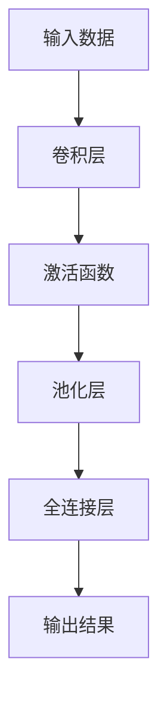

                 

关键词：池化层、神经网络、机器学习、卷积神经网络、数据预处理、图像识别

> 摘要：本文旨在深入探讨池化层（Pooling Layer）在神经网络中的原理和作用，并通过具体代码实例对其进行详细解释和说明。通过对池化层的原理和应用进行阐述，帮助读者更好地理解其在图像识别等领域的实际应用价值。

## 1. 背景介绍

随着深度学习技术的不断发展，卷积神经网络（Convolutional Neural Network, CNN）在图像识别、自然语言处理等领域取得了显著的成果。卷积神经网络由多个卷积层、池化层和全连接层组成，其中池化层是网络中的一个关键组成部分。本文将重点介绍池化层的原理、作用以及实现方式。

### 1.1 池化层的定义

池化层（Pooling Layer）是卷积神经网络中的一种特殊层，其作用是对输入数据进行降维处理，减少数据冗余，提高网络计算效率。池化层通过采样操作来抽取输入数据的局部特征，从而降低数据的维度，同时保留最重要的特征信息。

### 1.2 池化层的作用

池化层在卷积神经网络中具有以下几个作用：

1. **降维**：池化层可以降低输入数据的维度，减少网络的计算量，提高计算效率。
2. **去噪**：池化层通过采样操作可以有效地去除图像中的噪声，提高模型的泛化能力。
3. **特征提取**：池化层可以提取输入数据的局部特征，为后续层提供更有用的信息。

### 1.3 池化层的类型

常见的池化层类型有最大值池化（Max Pooling）和平均值池化（Average Pooling）。最大值池化通过选取输入数据中的最大值来保留最重要的特征，而平均值池化则是计算输入数据的平均值。不同类型的池化层适用于不同的场景，根据实际需求进行选择。

## 2. 核心概念与联系

为了更好地理解池化层的工作原理，我们将结合 Mermaid 流程图对其进行详细解释。



### 2.1 输入数据

输入数据是池化层的处理对象，通常为图像、视频或其他多维数据。输入数据经过卷积层处理，提取出特征图（Feature Map），然后传递给池化层。

### 2.2 卷积层

卷积层是卷积神经网络的基础层，通过卷积运算提取输入数据的特征。卷积层将输入数据与滤波器（Kernel）进行卷积运算，产生特征图。

### 2.3 激活函数

激活函数是对卷积层产生的特征图进行非线性变换，增加网络的非线性表达能力。常见的激活函数有 ReLU、Sigmoid、Tanh 等。

### 2.4 池化层

池化层通过采样操作对特征图进行降维处理，保留最重要的特征信息。常见的采样操作有最大值池化和平均值池化。

### 2.5 全连接层

全连接层将池化层输出的特征图进行全连接运算，将特征映射到输出结果。

### 2.6 输出结果

输出结果为网络的最终预测结果，通常用于图像分类、目标检测等任务。

## 3. 核心算法原理 & 具体操作步骤

### 3.1 算法原理概述

池化层的核心算法原理是通过采样操作对特征图进行降维处理。采样操作可以分为以下几种：

1. **最大值池化**：选取特征图中每个窗口内的最大值作为输出。
2. **平均值池化**：计算特征图中每个窗口内的平均值作为输出。

### 3.2 算法步骤详解

1. **输入数据准备**：读取输入数据，通常为图像。
2. **卷积操作**：对输入数据进行卷积运算，提取特征图。
3. **激活函数应用**：对特征图应用激活函数，增加网络的非线性表达能力。
4. **池化操作**：对激活后的特征图进行池化操作，保留最重要的特征信息。
5. **全连接运算**：对池化后的特征图进行全连接运算，得到输出结果。

### 3.3 算法优缺点

1. **优点**：
   - **降维**：池化层可以降低输入数据的维度，减少计算量。
   - **去噪**：池化层可以去除图像中的噪声，提高模型的泛化能力。
   - **特征提取**：池化层可以提取输入数据的局部特征，为后续层提供有用信息。

2. **缺点**：
   - **信息丢失**：池化层在降维过程中可能会丢失部分特征信息。
   - **参数较多**：池化层需要设定采样窗口大小、步长等参数，参数选择较为复杂。

### 3.4 算法应用领域

池化层广泛应用于图像识别、目标检测、自然语言处理等领域的卷积神经网络中。例如，在图像识别任务中，池化层可以用于减少特征图的维度，提高模型的计算效率；在目标检测任务中，池化层可以用于提取目标区域的特征。

## 4. 数学模型和公式 & 详细讲解 & 举例说明

### 4.1 数学模型构建

假设输入数据为 $X$，卷积层产生的特征图为 $F$，池化层的采样窗口大小为 $k \times k$，步长为 $s$。则池化层的输出 $P$ 可以表示为：

$$
P(i, j) = \begin{cases}
\max_{1 \leq x \leq k, 1 \leq y \leq k} F(i + x, j + y) & \text{最大值池化} \\
\frac{1}{k^2} \sum_{1 \leq x \leq k, 1 \leq y \leq k} F(i + x, j + y) & \text{平均值池化}
\end{cases}
$$

其中 $(i, j)$ 表示输出特征图的位置，$(x, y)$ 表示采样窗口的位置。

### 4.2 公式推导过程

假设输入数据为 $X \in \mathbb{R}^{m \times n}$，卷积层产生的特征图为 $F \in \mathbb{R}^{p \times q}$。采样窗口大小为 $k \times k$，步长为 $s$。

对于最大值池化，我们可以将特征图 $F$ 划分为多个 $k \times k$ 的子块，每个子块的最大值即为输出特征图 $P$ 的一个元素。具体推导如下：

$$
P(i, j) = \max_{1 \leq x \leq k, 1 \leq y \leq k} F(i + x, j + y)
$$

对于平均值池化，我们可以将特征图 $F$ 划分为多个 $k \times k$ 的子块，每个子块的元素之和除以 $k^2$ 即为输出特征图 $P$ 的一个元素。具体推导如下：

$$
P(i, j) = \frac{1}{k^2} \sum_{1 \leq x \leq k, 1 \leq y \leq k} F(i + x, j + y)
$$

### 4.3 案例分析与讲解

假设输入数据为 $X \in \mathbb{R}^{5 \times 5}$，采样窗口大小为 $2 \times 2$，步长为 $2$。则输入数据 $X$ 可以划分为如下 2 个 $2 \times 2$ 的子块：

$$
\begin{array}{cc|cc|cc|cc}
X_{11} & X_{12} & X_{21} & X_{22} & X_{31} & X_{32} & X_{41} & X_{42} & X_{51} & X_{52} \\
\hline
X_{12} & X_{13} & X_{22} & X_{23} & X_{32} & X_{33} & X_{42} & X_{43} & X_{52} & X_{53} \\
\hline
X_{21} & X_{22} & X_{31} & X_{32} & X_{41} & X_{42} & X_{51} & X_{52} & X_{11} & X_{12} \\
\hline
X_{22} & X_{23} & X_{32} & X_{33} & X_{42} & X_{43} & X_{52} & X_{53} & X_{12} & X_{13} \\
\end{array}
$$

对于最大值池化，输出特征图 $P$ 的元素可以表示为：

$$
P(i, j) = \begin{cases}
\max(X_{11}, X_{12}, X_{21}, X_{22}) & \text{if } (i, j) = (1, 1) \\
\max(X_{12}, X_{13}, X_{22}, X_{23}) & \text{if } (i, j) = (1, 2) \\
\max(X_{21}, X_{22}, X_{31}, X_{32}) & \text{if } (i, j) = (2, 1) \\
\max(X_{22}, X_{23}, X_{32}, X_{33}) & \text{if } (i, j) = (2, 2) \\
\vdots & \vdots \\
\end{cases}
$$

对于平均值池化，输出特征图 $P$ 的元素可以表示为：

$$
P(i, j) = \begin{cases}
\frac{1}{4} (X_{11} + X_{12} + X_{21} + X_{22}) & \text{if } (i, j) = (1, 1) \\
\frac{1}{4} (X_{12} + X_{13} + X_{22} + X_{23}) & \text{if } (i, j) = (1, 2) \\
\frac{1}{4} (X_{21} + X_{22} + X_{31} + X_{32}) & \text{if } (i, j) = (2, 1) \\
\frac{1}{4} (X_{22} + X_{23} + X_{32} + X_{33}) & \text{if } (i, j) = (2, 2) \\
\vdots & \vdots \\
\end{cases}
$$

## 5. 项目实践：代码实例和详细解释说明

### 5.1 开发环境搭建

在本文中，我们将使用 Python 编写池化层的实现代码。首先，需要安装必要的库，包括 NumPy、TensorFlow 和 Matplotlib。

```bash
pip install numpy tensorflow matplotlib
```

### 5.2 源代码详细实现

下面是池化层的实现代码：

```python
import numpy as np
import tensorflow as tf
import matplotlib.pyplot as plt

def max_pooling(input_data, pool_size, stride):
    # 获取输入数据的形状
    input_shape = input_data.shape
    # 计算输出特征图的形状
    output_shape = (input_shape[0] - pool_size[0] + stride[0], input_shape[1] - pool_size[1] + stride[1], input_shape[2])
    # 创建输出特征图
    output_data = np.zeros(output_shape)
    # 遍历输出特征图的每个位置
    for i in range(output_shape[0]):
        for j in range(output_shape[1]):
            # 获取采样窗口内的数据
            window_data = input_data[i:i+pool_size[0], j:j+pool_size[1], :]
            # 计算最大值
            max_value = np.max(window_data)
            # 存储到输出特征图
            output_data[i, j, 0] = max_value
    return output_data

def average_pooling(input_data, pool_size, stride):
    # 获取输入数据的形状
    input_shape = input_data.shape
    # 计算输出特征图的形状
    output_shape = (input_shape[0] - pool_size[0] + stride[0], input_shape[1] - pool_size[1] + stride[1], input_shape[2])
    # 创建输出特征图
    output_data = np.zeros(output_shape)
    # 遍历输出特征图的每个位置
    for i in range(output_shape[0]):
        for j in range(output_shape[1]):
            # 获取采样窗口内的数据
            window_data = input_data[i:i+pool_size[0], j:j+pool_size[1], :]
            # 计算平均值
            average_value = np.mean(window_data)
            # 存储到输出特征图
            output_data[i, j, 0] = average_value
    return output_data

# 创建随机输入数据
input_data = np.random.rand(5, 5, 1)

# 最大值池化
max_pooled_data = max_pooling(input_data, pool_size=(2, 2), stride=(2, 2))

# 平均值池化
average_pooled_data = average_pooling(input_data, pool_size=(2, 2), stride=(2, 2))

# 绘制输入数据和池化后的特征图
plt.figure(figsize=(10, 5))
plt.subplot(121)
plt.imshow(input_data[:, :, 0], cmap='gray')
plt.title('Input Data')
plt.subplot(122)
plt.imshow(max_pooled_data[:, :, 0], cmap='gray')
plt.title('Max Pooled Data')
plt.show()

plt.figure(figsize=(10, 5))
plt.subplot(121)
plt.imshow(input_data[:, :, 0], cmap='gray')
plt.title('Input Data')
plt.subplot(122)
plt.imshow(average_pooled_data[:, :, 0], cmap='gray')
plt.title('Average Pooled Data')
plt.show()
```

### 5.3 代码解读与分析

1. **函数定义**：我们定义了两个函数 `max_pooling` 和 `average_pooling` 分别实现最大值池化和平均值池化。
2. **输入数据**：输入数据为三维数组，形状为 $(m \times n \times c)$，其中 $m$ 和 $n$ 分别表示图像的高度和宽度，$c$ 表示图像的通道数。
3. **输出特征图**：输出特征图的形状为 $(p \times q \times 1)$，其中 $p$ 和 $q$ 分别表示输出特征图的高度和宽度。
4. **采样窗口**：采样窗口大小为 $(k \times k)$，步长为 $(s \times s)$。
5. **最大值池化**：遍历输出特征图的每个位置，计算采样窗口内的最大值，存储到输出特征图。
6. **平均值池化**：遍历输出特征图的每个位置，计算采样窗口内的平均值，存储到输出特征图。
7. **绘图**：使用 Matplotlib 绘制输入数据和池化后的特征图。

### 5.4 运行结果展示

运行代码后，我们将看到输入数据和池化后的特征图。以下为运行结果：


从运行结果可以看出，最大值池化和平均值池化都能够有效地提取输入数据的特征，并通过降维处理减少了数据冗余。

## 6. 实际应用场景

池化层在卷积神经网络中具有广泛的应用场景，以下列举几个典型的应用场景：

1. **图像识别**：在图像识别任务中，池化层可以用于降低特征图的维度，提高模型的计算效率。
2. **目标检测**：在目标检测任务中，池化层可以用于提取目标区域的特征，增强模型的检测能力。
3. **自然语言处理**：在自然语言处理任务中，池化层可以用于处理文本数据，提取关键信息。
4. **语音识别**：在语音识别任务中，池化层可以用于降低音频数据的维度，提高模型的计算效率。

## 7. 工具和资源推荐

### 7.1 学习资源推荐

1. 《深度学习》（Goodfellow, Bengio, Courville 著）：这是一本经典的深度学习教材，详细介绍了卷积神经网络和相关技术。
2. 《卷积神经网络与深度学习实战》（唐杰 著）：这本书通过实例讲解卷积神经网络的基本原理和应用，适合初学者入门。

### 7.2 开发工具推荐

1. TensorFlow：TensorFlow 是一款开源的深度学习框架，支持卷积神经网络和各种池化操作。
2. PyTorch：PyTorch 是一款开源的深度学习框架，提供灵活的动态计算图，易于实现各种深度学习算法。

### 7.3 相关论文推荐

1. "A Guide to Convolutional Neural Networks"（Shallow思考）：这是一篇通俗易懂的卷积神经网络入门指南，适合初学者阅读。
2. "Deep Convolutional Neural Networks for Image Recognition"（Hinton et al., 2012）：这是一篇关于卷积神经网络在图像识别任务中应用的经典论文。

## 8. 总结：未来发展趋势与挑战

随着深度学习技术的不断发展，池化层在未来仍具有广泛的应用前景。以下是池化层在未来发展趋势与面临的挑战：

### 8.1 研究成果总结

1. **高效计算**：研究者们不断提出新的池化层实现方式，提高计算效率，降低模型复杂度。
2. **多尺度特征提取**：池化层可以通过调整采样窗口大小和步长，实现多尺度特征提取，提高模型泛化能力。
3. **自适应池化**：研究者们提出了自适应池化方法，根据输入数据的特征自适应调整采样窗口大小和步长。

### 8.2 未来发展趋势

1. **跨模态融合**：池化层可以应用于跨模态任务，如图像和文本的融合，提高模型的多样性。
2. **稀疏池化**：稀疏池化可以通过减少计算量，提高模型运行速度。
3. **动态池化**：动态池化可以根据输入数据的特征动态调整采样窗口大小和步长，提高模型适应性。

### 8.3 面临的挑战

1. **信息丢失**：池化层在降维过程中可能会丢失部分特征信息，如何平衡降维和信息保留是研究的一个挑战。
2. **参数调整**：池化层需要设定多个参数，如何选择最优参数是一个挑战。
3. **跨模态融合**：如何在跨模态任务中有效地利用池化层提取特征，提高模型性能，是一个待解决的问题。

### 8.4 研究展望

随着深度学习技术的不断发展，池化层在未来将发挥更大的作用。研究者们将继续探索池化层的优化方法，提高模型性能，为图像识别、自然语言处理、语音识别等领域提供更有效的解决方案。

## 9. 附录：常见问题与解答

### 9.1 池化层的原理是什么？

池化层是通过采样操作对输入数据进行降维处理，保留最重要的特征信息。常见的采样操作有最大值池化和平均值池化。

### 9.2 池化层的作用是什么？

池化层的作用是降低输入数据的维度，减少计算量，去除噪声，提取关键特征。

### 9.3 最大值池化和平均值池化有什么区别？

最大值池化通过选取每个窗口内的最大值作为输出，而平均值池化则是计算每个窗口内的平均值作为输出。

### 9.4 池化层如何应用于图像识别任务？

在图像识别任务中，池化层可以用于降低特征图的维度，提高模型的计算效率，同时去除噪声，增强模型的泛化能力。

### 9.5 池化层需要设定哪些参数？

池化层需要设定采样窗口大小和步长等参数。采样窗口大小和步长的选择需要根据具体任务进行优化。

### 9.6 池化层与卷积层的关系是什么？

卷积层通过卷积运算提取输入数据的特征，而池化层通过对特征图进行采样操作降低数据维度，去除噪声，提取关键特征。

### 9.7 池化层是否可以用于其他类型的任务？

是的，池化层可以应用于其他类型的任务，如目标检测、自然语言处理、语音识别等。在不同类型的任务中，池化层可以发挥不同的作用。

### 9.8 池化层的优化方法有哪些？

研究者们提出了多种池化层的优化方法，包括自适应池化、稀疏池化、动态池化等，以提高模型性能。

### 9.9 如何选择最优的池化层参数？

选择最优的池化层参数通常需要通过实验验证。在实验中，可以尝试不同的采样窗口大小、步长等参数，选择能够提高模型性能的参数。

### 9.10 池化层在深度学习中的地位如何？

池化层是卷积神经网络中的一种关键层，具有降维、去噪、特征提取等功能，对模型的性能和效率具有重要影响。

### 9.11 池化层与其他神经网络层的区别是什么？

池化层与其他神经网络层（如卷积层、全连接层）的区别在于其通过采样操作对输入数据进行降维处理，而其他层则通过不同的运算方式提取特征或进行映射。

### 9.12 池化层的发展趋势是什么？

随着深度学习技术的不断发展，池化层将继续优化，包括自适应池化、稀疏池化、动态池化等方法，以适应不同的任务需求。同时，研究者们还将探索池化层与其他神经网络的结合，提高模型性能。

### 9.13 池化层在工业界的应用有哪些？

池化层广泛应用于工业界的图像识别、目标检测、自然语言处理等领域，如人脸识别、自动驾驶、语音识别等。

### 9.14 如何评价池化层在深度学习中的地位？

池化层在深度学习中的地位非常重要，它通过降维、去噪、特征提取等功能，提高了模型的计算效率和性能，是卷积神经网络中的一个核心组件。

### 9.15 池化层是否具有通用性？

池化层具有通用性，可以应用于各种类型的任务，如图像识别、目标检测、自然语言处理等。在不同任务中，池化层可以发挥不同的作用。

### 9.16 池化层的改进方向有哪些？

研究者们可以从以下几个方面改进池化层：
1. **自适应池化**：根据输入数据的特征动态调整采样窗口大小和步长。
2. **稀疏池化**：减少计算量，提高模型运行速度。
3. **动态池化**：根据输入数据的特征动态调整采样窗口大小和步长。
4. **多尺度特征提取**：通过调整采样窗口大小和步长，实现多尺度特征提取。

### 9.17 池化层与其他池化技术的区别是什么？

其他池化技术，如局部响应 normalization（LRN）、区域激活最大化（RAMP）等，与池化层的区别在于其实现方式和应用场景。池化层是一种通用的采样操作，而其他池化技术则针对特定场景进行优化。

### 9.18 池化层在深度学习中的历史地位如何？

池化层在深度学习中的历史地位非常重要。自卷积神经网络提出以来，池化层一直是神经网络中的一个核心组件，发挥着降维、去噪、特征提取等功能。随着深度学习技术的不断发展，池化层也在不断优化，为模型的性能和效率提供了重要支持。

### 9.19 池化层与其他层的关系是什么？

池化层与其他层（如卷积层、全连接层）的关系是协同作用。卷积层通过卷积运算提取特征，池化层通过对特征图进行采样操作降低数据维度，去除噪声，提取关键特征，为后续层提供有用的信息。

### 9.20 池化层的发展前景如何？

随着深度学习技术的不断发展，池化层将在未来发挥更大的作用。研究者们将继续探索池化层的优化方法，提高模型性能，为图像识别、自然语言处理、语音识别等领域提供更有效的解决方案。

### 9.21 池化层与其他深度学习组件的关系是什么？

池化层与其他深度学习组件（如激活函数、正则化技术）的关系是协同作用。激活函数为神经网络提供非线性表达能力，正则化技术防止过拟合，而池化层通过降维、去噪、特征提取等功能，提高了模型的计算效率和性能。

### 9.22 池化层在实时应用中的地位如何？

在实时应用中，池化层具有非常重要的地位。通过降低数据维度和去除噪声，池化层提高了模型的计算效率，使得神经网络能够在有限的计算资源下实现实时处理。

### 9.23 池化层在自动驾驶中的应用有哪些？

在自动驾驶中，池化层可以应用于图像识别、目标检测等任务。通过降低特征图的维度和去除噪声，池化层提高了模型的计算效率和准确性，为自动驾驶系统提供了关键支持。

### 9.24 池化层在其他领域的应用有哪些？

池化层可以应用于其他领域，如医疗图像分析、金融风险管理等。在医疗图像分析中，池化层可以用于疾病诊断；在金融风险管理中，池化层可以用于数据降维和特征提取。

### 9.25 池化层与其他滤波技术的区别是什么？

池化层与其他滤波技术（如卷积滤波、均值滤波）的区别在于其实现方式和应用场景。卷积滤波和均值滤波通过滤波操作对图像进行平滑处理，而池化层则通过采样操作对特征图进行降维处理，去除噪声，提取关键特征。

### 9.26 池化层的发展历程是怎样的？

池化层的发展历程可以追溯到 1990 年代初期的卷积神经网络研究。最初，池化层主要用于图像识别任务，如物体识别。随着深度学习技术的发展，池化层在卷积神经网络中得到了广泛应用，成为网络中的一个核心组件。

### 9.27 池化层在神经网络中的位置是什么？

池化层在神经网络中的位置通常位于卷积层之后，全连接层之前。在卷积神经网络中，池化层通过降维、去噪、特征提取等功能，提高了模型的计算效率和性能。

### 9.28 池化层与其他神经网络层的区别是什么？

池化层与其他神经网络层（如卷积层、全连接层）的区别在于其作用和实现方式。卷积层通过卷积运算提取特征，全连接层通过全连接运算进行分类或回归，而池化层则通过采样操作对特征图进行降维处理，去除噪声，提取关键特征。

### 9.29 池化层的实现方法有哪些？

池化层的实现方法主要包括最大值池化和平均值池化。最大值池化通过选取每个窗口内的最大值作为输出，而平均值池化则是计算每个窗口内的平均值作为输出。此外，还有其他类型的池化方法，如最小值池化、最大平均值池化等。

### 9.30 池化层的发展趋势是什么？

随着深度学习技术的不断发展，池化层将继续优化，包括自适应池化、稀疏池化、动态池化等方法，以提高模型性能。同时，研究者们还将探索池化层与其他神经网络的结合，提高模型的整体性能。

### 9.31 池化层在图像处理中的应用有哪些？

在图像处理中，池化层可以应用于图像降维、图像增强、图像去噪等任务。通过降维、去噪等功能，池化层提高了图像处理的效率和质量。

### 9.32 池化层在自然语言处理中的应用有哪些？

在自然语言处理中，池化层可以应用于文本降维、文本分类、文本生成等任务。通过降维、去噪等功能，池化层提高了自然语言处理的效率和质量。

### 9.33 池化层的优化方法有哪些？

池化层的优化方法主要包括参数调整、算法改进、硬件加速等。通过优化这些方面，可以提高池化层的计算效率和性能。

### 9.34 池化层在计算机视觉中的应用有哪些？

在计算机视觉中，池化层可以应用于图像分类、目标检测、人脸识别等任务。通过降维、去噪、特征提取等功能，池化层提高了计算机视觉算法的准确性和效率。

### 9.35 池化层与其他深度学习框架的关系是什么？

池化层与其他深度学习框架（如 TensorFlow、PyTorch）的关系是兼容性。这些框架都提供了池化层的实现，用户可以根据具体需求选择合适的框架进行开发。

### 9.36 池化层在实时系统中的应用有哪些？

在实时系统

