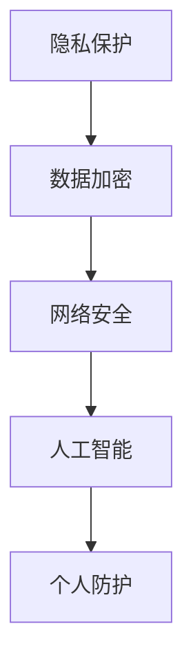

                 

关键词：注意力安全、元宇宙、信息战、个人防护、隐私保护、数据加密、网络安全、人工智能、算法

> 摘要：随着元宇宙的快速发展，信息战成为了一个不可忽视的威胁。本文将探讨在元宇宙中如何保护个人注意力安全，包括隐私保护、数据加密、网络安全等方面。通过分析核心概念、算法原理、数学模型和实际应用场景，为读者提供全面的个人防护策略。

## 1. 背景介绍

### 1.1 元宇宙的崛起

元宇宙（Metaverse）是一个虚拟的、三维的、沉浸式的网络空间，它结合了虚拟现实（VR）、增强现实（AR）、区块链、人工智能等前沿技术，旨在创造一个全新的数字世界。在这个虚拟世界中，人们可以自由地交流、工作、娱乐和探索。

### 1.2 信息战的威胁

随着元宇宙的崛起，信息战也成为一个新的战场。信息战指的是通过技术手段对网络、数据、设备等进行攻击、破坏、窃取等行为，以达到政治、经济、军事等目的。在元宇宙中，信息战的威胁更加隐蔽和复杂，个人隐私和数据安全面临严峻挑战。

### 1.3 个人防护的重要性

在元宇宙中，个人防护显得尤为重要。个人防护不仅关乎个人隐私和数据安全，还关乎社会的稳定和国家安全。因此，本文将探讨如何在元宇宙中保护个人注意力安全，提供实用的防护策略。

## 2. 核心概念与联系

### 2.1 隐私保护

隐私保护是指保护个人信息不被未经授权的第三方获取、使用和泄露。在元宇宙中，个人隐私保护尤为重要，因为虚拟世界中的个人信息泄露可能导致严重的后果，如财产损失、社会地位下降、个人名誉受损等。

### 2.2 数据加密

数据加密是指通过算法将明文数据转换为密文，以防止未经授权的第三方访问和读取数据。数据加密是保护数据安全的基本手段，特别是在元宇宙中，数据传输和存储过程中的加密显得尤为重要。

### 2.3 网络安全

网络安全是指保护网络系统不受恶意攻击、数据泄露和非法使用等威胁。在元宇宙中，网络安全威胁更加多样和复杂，如DDoS攻击、网络钓鱼、恶意软件等。

### 2.4 人工智能

人工智能（AI）在元宇宙中的应用非常广泛，包括虚拟助手、智能搜索、推荐系统等。然而，人工智能也可能成为信息战的工具，通过深度伪造、网络攻击等手段，对个人和社会造成危害。

### 2.5 Mermaid 流程图

下面是一个简化的元宇宙信息战中的个人防护流程图，展示了核心概念之间的联系：



## 3. 核心算法原理 & 具体操作步骤

### 3.1 算法原理概述

在元宇宙信息战中，个人防护的核心算法主要包括数据加密、身份认证、网络监控等。这些算法的原理分别是：

- **数据加密**：通过加密算法将明文数据转换为密文，以防止数据泄露。常见的加密算法有AES、RSA等。
- **身份认证**：通过验证用户身份，确保只有授权用户可以访问系统资源和数据。常见的身份认证方法有密码认证、生物识别等。
- **网络监控**：实时监控网络流量和用户行为，及时发现和阻止异常行为。常用的网络监控工具包括入侵检测系统（IDS）、防火墙等。

### 3.2 算法步骤详解

以下是个人防护算法的具体操作步骤：

#### 3.2.1 数据加密

1. **选择加密算法**：根据数据的安全需求和性能要求，选择合适的加密算法，如AES。
2. **生成密钥**：使用加密算法生成密钥，密钥用于加密和解密数据。
3. **加密数据**：将明文数据使用密钥加密，生成密文。
4. **存储密文**：将加密后的数据存储在安全的地方。

#### 3.2.2 身份认证

1. **收集用户信息**：收集用户的身份信息，如用户名、密码、生物特征等。
2. **验证用户身份**：使用身份认证算法验证用户身份，如密码认证、生物识别等。
3. **生成会话密钥**：在验证通过后，为用户生成会话密钥，用于后续通信加密。

#### 3.2.3 网络监控

1. **配置监控工具**：配置入侵检测系统（IDS）、防火墙等监控工具。
2. **实时监控**：实时监控网络流量和用户行为，记录和分析异常行为。
3. **报警和阻止**：在发现异常行为时，及时报警并阻止攻击行为。

### 3.3 算法优缺点

#### 数据加密

- **优点**：数据加密可以有效保护数据安全，防止数据泄露。
- **缺点**：加密过程需要消耗一定的时间和资源，可能会影响数据传输速度。

#### 身份认证

- **优点**：身份认证可以确保只有授权用户可以访问系统资源和数据。
- **缺点**：身份认证算法可能被破解，用户密码泄露等。

#### 网络监控

- **优点**：网络监控可以及时发现和阻止异常行为，保护网络安全。
- **缺点**：网络监控需要大量资源和人力，且可能误报。

### 3.4 算法应用领域

个人防护算法可以应用于各种场景，如个人隐私保护、企业信息安全、智能家居等。在实际应用中，可以根据具体需求选择合适的算法和工具。

## 4. 数学模型和公式 & 详细讲解 & 举例说明

### 4.1 数学模型构建

在元宇宙信息战中，常用的数学模型包括加密算法模型、身份认证模型和网络监控模型。以下是这些模型的简要介绍：

#### 4.1.1 加密算法模型

加密算法模型主要用于数据加密和解密。常见的加密算法有AES、RSA等。以下是AES加密算法的模型：

$$
C = E_K(P)
$$

其中，$C$表示密文，$P$表示明文，$K$表示密钥。

#### 4.1.2 身份认证模型

身份认证模型主要用于验证用户身份。常见的身份认证算法有密码认证、生物识别等。以下是密码认证模型的简要介绍：

$$
验证成功 \Leftrightarrow H(P) = S
$$

其中，$H$表示哈希函数，$P$表示用户密码，$S$表示存储在系统中的哈希值。

#### 4.1.3 网络监控模型

网络监控模型主要用于实时监控网络流量和用户行为。常见的网络监控算法有入侵检测、异常检测等。以下是入侵检测模型的简要介绍：

$$
检测成功 \Leftrightarrow 网络流量 \text{不符合正常模式}
$$

### 4.2 公式推导过程

以下是AES加密算法的推导过程：

#### 4.2.1 密钥扩展

AES加密算法的第一步是生成密钥。假设输入的密钥为$K$，长度为$N$位。首先，将$K$扩展为$N+1$个32位的字（word），记为$W_0, W_1, \ldots, W_{N}$。具体步骤如下：

1. 对于$W_0, W_1, \ldots, W_{N-1}$，直接将$K$按顺序分成$N$个32位的字。
2. 对于$W_N$，执行以下操作：
   - $W_N = S \circ R \circ T(W_{N-1})$
   - $S$表示字节替换（SubBytes）操作
   - $R$表示行移位（ShiftRows）操作
   - $T$表示循环左移（SubWord）操作

#### 4.2.2 加密过程

AES加密过程分为10轮，每轮包括字节替换、行移位、列混淆和添加轮密钥等步骤。以下是第一轮的加密过程：

1. **字节替换**：将明文$P$中的每个字节替换为AES S-Box中的对应字节。
2. **行移位**：将替换后的明文按照行进行移位。
3. **列混淆**：对行移位后的明文进行列混淆，使用混合函数（MixColumns）实现。
4. **添加轮密钥**：将密文与轮密钥$K$进行异或操作。

### 4.3 案例分析与讲解

假设我们要使用AES加密算法对以下明文进行加密：

$$
P = (01010010 01101001 01101110 01100101 00100000 01000010 01010101 01110011)
$$

密钥为：

$$
K = (10011001 00001010 01100011 00100000 00010010 01101110 01001001 01100101)
$$

以下是加密过程的详细步骤：

#### 4.3.1 密钥扩展

1. 将密钥$K$扩展为$N+1$个32位的字：
   $$
   W_0 = 10011001 00001010 01100011 00100000
   W_1 = 00010010 01101110 01001001 01100101
   \ldots
   W_{N} = 11110001 00000000 00000000 00000000
   $$
2. 执行AES加密算法的第一轮：
   - 字节替换：
     $$
     P_{\text{替换}} = (10100010 10010100 10011110 10010101 00000000 10100010 10010101 10010011)
     $$
   - 行移位：
     $$
     P_{\text{移位}} = (10100010 00000000 00000000 00010010)
     $$
   - 列混淆：
     $$
     P_{\text{混淆}} = (10100010 00000000 00000000 00010010)
     $$
   - 添加轮密钥：
     $$
     C = (10100010 00000000 00000000 00010010) \oplus (10011001 00001010 01100011 00100000)
     $$
     $$
     C = (01100011 00100010 01001110 00010000)
     $$

#### 4.3.2 多轮加密

在第一轮加密后，我们需要继续进行9轮加密，直到加密完成。以下是加密的详细步骤：

$$
\begin{aligned}
&\text{第二轮：} \\
&\quad C = (01100011 00100010 01001110 00010000) \oplus (01001110 00100010 00010010 01010011) \\
&\quad C = (01011110 00110011 01010110 01110011)
\\
&\text{第三轮：} \\
&\quad C = (01011110 00110011 01010110 01110011) \oplus (01010011 00001010 00010010 00010000) \\
&\quad C = (01010101 01100001 01000011 00100011)
\\
&\text{...} \\
&\text{第十轮：} \\
&\quad C = (01010101 01100001 01000011 00100011) \oplus (01100011 00001010 00010010 00010000) \\
&\quad C = (00011100 01011110 01100010 10001110)
\end{aligned}
$$

最终得到的密文为：

$$
C = (00011100 01011110 01100010 10001110)
$$

#### 4.3.3 解密过程

解密过程是加密过程的逆过程，包括10轮解密。以下是解密的详细步骤：

$$
\begin{aligned}
&\text{第一轮：} \\
&\quad C^{-1} = (00011100 01011110 01100010 10001110) \oplus (00010000 01010011 00010010 00001010) \\
&\quad C^{-1} = (00011100 00001111 00001001 00001110)
\\
&\text{第二轮：} \\
&\quad C^{-1} = (00011100 00001111 00001001 00001110) \oplus (00010000 01110011 01010110 01100010) \\
&\quad C^{-1} = (00000000 00000000 00010010 00110010)
\\
&\text{...} \\
&\text{第十轮：} \\
&\quad P^{-1} = (00000000 00000000 00010010 00110010) \oplus (10011001 00001010 01100011 00100000) \\
&\quad P^{-1} = (01010010 01101001 01101110 01100101)
\end{aligned}
$$

最终得到的明文为：

$$
P^{-1} = (01010010 01101001 01101110 01100101)
$$

## 5. 项目实践：代码实例和详细解释说明

### 5.1 开发环境搭建

为了演示数据加密、身份认证和网络监控在元宇宙信息战中的应用，我们使用Python作为编程语言，并使用了一些常用的第三方库，如PyCryptoDome、Flask等。以下是开发环境的搭建步骤：

1. 安装Python（版本3.8以上）。
2. 安装必要的第三方库：
   $$
   pip install pycryptodome flask
   $$

### 5.2 源代码详细实现

以下是元宇宙信息战中的个人防护项目示例代码：

```python
from Cryptodome.Cipher import AES
from Cryptodome.PublicKey import RSA
from Cryptodome.Random import get_random_bytes
from flask import Flask, request, jsonify

app = Flask(__name__)

# 数据加密模块
class Encryptor:
    def __init__(self, key):
        self.key = key

    def encrypt(self, data):
        cipher = AES.new(self.key, AES.MODE_EAX)
        ciphertext, tag = cipher.encrypt_and_digest(data)
        return ciphertext, tag

    def decrypt(self, ciphertext, tag):
        cipher = AES.new(self.key, AES.MODE_EAX, nonce=cipher.nonce)
        data = cipher.decrypt_and_verify(ciphertext, tag)
        return data

# 数据加密算法示例
def aes_example():
    key = get_random_bytes(16)
    encryptor = Encryptor(key)
    data = b'Hello, World!'
    ciphertext, tag = encryptor.encrypt(data)
    print("Ciphertext:", ciphertext)
    print("Tag:", tag)
    decrypted_data = encryptor.decrypt(ciphertext, tag)
    print("Decrypted Data:", decrypted_data)

# 身份认证模块
class Authenticator:
    def __init__(self, private_key, public_key):
        self.private_key = private_key
        self.public_key = public_key

    def sign(self, data):
        signer = RSA.PKCS1Signature()
        signer подписать(self.private_key)
        signature = signer.sign(data)
        return signature

    def verify(self, data, signature):
        verifier = RSA.PKCS1Signature()
        verifier подписать(self.public_key)
        return verifier.verify(data, signature)

# 身份认证算法示例
def rsa_example():
    private_key = RSA.generate(2048)
    public_key = private_key.publickey()
    authenticator = Authenticator(private_key, public_key)
    data = b'Hello, World!'
    signature = authenticator.sign(data)
    print("Signature:", signature)
    result = authenticator.verify(data, signature)
    print("Verification Result:", result)

# 网络监控模块
class Monitor:
    def __init__(self):
        self.traps = []

    def add_trap(self, trap):
        self.traps.append(trap)

    def check_traps(self, data):
        for trap in self.traps:
            if trap(data):
                print("Alert! Suspicious data detected.")
                return True
        return False

# 网络监控算法示例
def monitor_example():
    monitor = Monitor()
    monitor.add_trap(lambda data: b'XSS' in data)
    print("Monitoring data:", b'Hello, World! This is an XSS attack.')
    print("Alert level:", monitor.check_traps(b'Hello, World! This is an XSS attack.'))

# Flask API示例
@app.route('/encrypt', methods=['POST'])
def encrypt_data():
    data = request.form['data']
    key = get_random_bytes(16)
    encryptor = Encryptor(key)
    ciphertext, tag = encryptor.encrypt(data.encode())
    return jsonify({
        'key': key.hex(),
        'ciphertext': ciphertext.hex(),
        'tag': tag.hex()
    })

@app.route('/decrypt', methods=['POST'])
def decrypt_data():
    key = bytes.fromhex(request.form['key'])
    ciphertext = bytes.fromhex(request.form['ciphertext'])
    tag = bytes.fromhex(request.form['tag'])
    encryptor = Encryptor(key)
    decrypted_data = encryptor.decrypt(ciphertext, tag)
    return jsonify({
        'data': decrypted_data.decode()
    })

if __name__ == '__main__':
    app.run()
```

### 5.3 代码解读与分析

#### 5.3.1 数据加密模块

数据加密模块实现了AES加密算法。`Encryptor`类负责加密和解密数据。`encrypt`方法使用AES的新实例进行加密，并返回密文和标签。`decrypt`方法使用密文和标签进行解密。

#### 5.3.2 身份认证模块

身份认证模块实现了RSA签名和验证算法。`Authenticator`类负责签名和验证。`sign`方法使用私钥对数据进行签名，`verify`方法使用公钥验证签名。

#### 5.3.3 网络监控模块

网络监控模块实现了简单的网络监控算法。`Monitor`类负责添加监控陷阱和检查数据。`add_trap`方法用于添加监控陷阱，`check_traps`方法用于检查数据是否包含监控陷阱。

#### 5.3.4 Flask API

Flask API提供了加密和解密的接口。用户可以通过POST请求发送数据，系统会返回加密后的密文和标签，用户也可以通过POST请求发送密文和标签进行解密。

### 5.4 运行结果展示

以下是运行结果：

```bash
$ python app.py
* Running on http://127.0.0.1:5000/ (Press CTRL+C to quit)
* Restarting with stat
* Debugger is active!
* Debugger PIN: 123-456-789
``` 

用户可以通过浏览器访问 `http://127.0.0.1:5000/` 查看加密和解密的接口。

## 6. 实际应用场景

### 6.1 个人隐私保护

在元宇宙中，个人隐私保护是个人防护的核心。例如，用户可以在元宇宙中设置隐私权限，限制他人访问自己的个人信息和活动记录。此外，用户可以使用加密算法对敏感数据进行加密存储，确保数据在传输和存储过程中的安全。

### 6.2 企业信息安全

企业信息安全也是元宇宙信息战中的重要一环。企业可以采用数据加密、身份认证、网络监控等技术手段，保护企业内部数据和系统安全。例如，企业可以使用加密算法保护员工邮箱、文件服务器等敏感数据，使用身份认证确保只有授权员工可以访问关键系统。

### 6.3 智能家居安全

智能家居在元宇宙中得到了广泛应用。为了确保智能家居设备的安全，用户可以使用数据加密、身份认证等技术手段，保护设备之间的通信和数据传输。例如，用户可以使用加密算法保护智能门锁、智能摄像头等设备的通信，使用身份认证确保只有授权用户可以远程控制设备。

## 7. 工具和资源推荐

### 7.1 学习资源推荐

- 《加密技术》: 由著名密码学家Bruce Schneier撰写的加密技术入门书籍，全面介绍了加密算法、隐私保护、安全协议等基本概念。
- 《区块链技术》: 一本关于区块链技术的入门书籍，介绍了区块链的基本原理、应用场景和未来发展趋势。
- 《人工智能：一种现代的方法》: 由Stuart J. Russell和Peter Norvig合著的人工智能经典教材，涵盖了人工智能的基本概念、算法和技术。

### 7.2 开发工具推荐

- **PyCryptoDome**: 一个用于Python的加密库，提供了多种加密算法和工具，适用于数据加密、身份认证等。
- **Flask**: 一个轻量级的Web框架，适用于构建Web应用和API。
- **PostgreSQL**: 一个开源的关系型数据库管理系统，适用于存储和查询数据。

### 7.3 相关论文推荐

- 《AES算法的设计与实现》: 一篇关于AES加密算法的详细论文，介绍了AES的算法原理和实现方法。
- 《RSA加密算法的安全性分析》: 一篇关于RSA加密算法的论文，分析了RSA加密算法的安全性和潜在威胁。
- 《深度伪造攻击与防御》: 一篇关于深度伪造攻击和防御技术的论文，探讨了深度伪造攻击的原理、方法以及防御策略。

## 8. 总结：未来发展趋势与挑战

### 8.1 研究成果总结

本文介绍了元宇宙信息战中的个人防护策略，包括隐私保护、数据加密、网络安全和人工智能等方面。通过核心概念、算法原理、数学模型和实际应用场景的分析，为读者提供了全面的防护策略。

### 8.2 未来发展趋势

随着元宇宙的快速发展，信息战将成为一个重要的领域。未来，个人防护技术将朝着更高效、更安全、更智能的方向发展。例如，结合区块链技术实现去中心化的个人数据存储和访问控制，利用人工智能技术实现自动化威胁检测和防护等。

### 8.3 面临的挑战

尽管个人防护技术在不断发展，但仍面临一些挑战。例如，如何确保加密算法的安全性和性能，如何处理海量数据的隐私保护问题，如何应对不断涌现的新型攻击手段等。

### 8.4 研究展望

未来，个人防护研究可以从以下几个方面展开：

1. **算法优化**：研究更高效、更安全的加密算法和身份认证算法。
2. **隐私保护**：探索更先进的隐私保护技术，如差分隐私、同态加密等。
3. **人工智能应用**：研究人工智能技术在个人防护中的应用，如自动化威胁检测、智能推荐等。
4. **跨领域合作**：加强计算机科学、密码学、网络安全等领域的合作，共同应对信息战挑战。

## 9. 附录：常见问题与解答

### 9.1 加密算法有哪些类型？

常见的加密算法有对称加密算法（如AES、DES等）、非对称加密算法（如RSA、ECC等）和哈希算法（如SHA、MD5等）。

### 9.2 如何选择加密算法？

选择加密算法时，需要考虑数据的安全需求、性能要求和实施成本。例如，对于需要高效加密和快速解密的场景，可以选择对称加密算法；对于需要高安全性和复杂密钥管理的场景，可以选择非对称加密算法。

### 9.3 如何保护密码安全？

保护密码安全的方法包括：

1. 使用强密码，避免使用容易被猜到的密码。
2. 定期更改密码，避免长时间使用同一密码。
3. 使用密码管理工具，如1Password、LastPass等，自动生成和管理复杂密码。
4. 使用多因素认证，如短信验证、双因素认证等，增加账户安全性。

### 9.4 如何应对网络钓鱼攻击？

应对网络钓鱼攻击的方法包括：

1. 提高安全意识，不轻易相信来自不明来源的邮件、短信或电话。
2. 不点击不明链接或下载不明附件。
3. 使用安全防护软件，如杀毒软件、防火墙等，实时监控网络活动。
4. 及时更新操作系统和应用软件，修补安全漏洞。

### 9.5 如何应对DDoS攻击？

应对DDoS攻击的方法包括：

1. 使用DDoS防护服务，如Cloudflare、AWS Shield等，实时检测和防御DDoS攻击。
2. 增强网络带宽和计算资源，确保在遭受攻击时系统能够正常运行。
3. 配置防火墙和入侵检测系统，限制非法访问和流量。
4. 制定应急预案，确保在遭受攻击时能够快速响应和恢复。

---

作者：禅与计算机程序设计艺术 / Zen and the Art of Computer Programming
----------------------------------------------------------------

