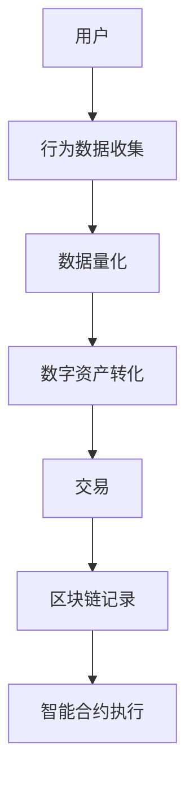

                 

关键词：注意力市场、元宇宙、信息交易、算法、人工智能、数字货币、加密技术、隐私保护、用户参与、市场机制、技术创新

> 摘要：随着元宇宙概念的兴起，注意力市场成为信息交易的新兴领域。本文将探讨注意力市场的核心概念、算法原理、数学模型及其在实际应用中的挑战与机遇，并展望其未来发展。

## 1. 背景介绍

### 元宇宙的崛起

元宇宙（Metaverse）是一个虚拟的三维空间，通过增强现实（AR）、虚拟现实（VR）等技术与互联网结合，为用户提供沉浸式的互动体验。元宇宙不仅仅是一个虚拟的游戏世界，它包含了经济系统、社会交往、文化娱乐等多种元素，是一个具有广泛应用前景的生态系统。

### 注意力市场的发展

在元宇宙中，用户通过注意力交易实现价值交换，成为数字经济的重要组成部分。注意力市场是指用户在元宇宙中的注意力资源，包括观看、点击、点赞等行为，可以被量化并作为商品进行交易。这种市场机制促进了信息的流动和价值的创造，成为元宇宙经济体系的核心。

## 2. 核心概念与联系

### 注意力资源的量化

在注意力市场中，用户的注意力资源可以通过一系列行为数据进行量化。例如，用户的观看时长、点赞次数、评论数量等都可以作为注意力资源的度量。这些数据可以被记录并转化为数字资产，实现价值交换。

### 信息交易机制

注意力市场的交易机制通常基于区块链技术和加密货币。用户可以通过数字货币购买或出售注意力资源，确保交易的安全性和匿名性。此外，智能合约的使用确保了交易的自动执行和透明性。

### 技术架构图



## 3. 核心算法原理 & 具体操作步骤

### 3.1 算法原理概述

注意力市场的核心算法包括数据采集、量化、交易和记录。这些算法共同工作，确保注意力资源的高效交易和公平分配。

### 3.2 算法步骤详解

#### 3.2.1 数据采集

用户在元宇宙中的行为数据被实时收集，包括点击、观看、点赞等。这些数据通过传感器、应用程序等途径传递到中央数据库。

#### 3.2.2 数据量化

采集到的数据经过处理，转换为注意力值。注意力值通常通过加权算法计算，考虑用户的参与程度、频率等因素。

#### 3.2.3 数字资产转化

注意力值被转化为数字资产，例如加密货币或代币。这种转化可以通过固定的汇率或动态的市场价格进行。

#### 3.2.4 交易

用户可以通过数字钱包进行注意力资源的买卖。交易可以是直接交易，也可以是通过交易市场进行。

#### 3.2.5 记录和执行

交易记录通过区块链技术永久保存，确保交易的安全性和不可篡改性。智能合约自动执行交易条款，确保交易的公正性。

### 3.3 算法优缺点

#### 优点：

- **安全性和透明性**：区块链技术确保了交易的安全和不可篡改。
- **去中心化**：去中心化的交易机制减少了中介成本，提高了效率。
- **灵活性**：用户可以自由选择交易对手和交易方式。

#### 缺点：

- **技术门槛**：区块链技术和加密货币的复杂性可能对普通用户造成障碍。
- **法规监管**：缺乏统一的监管机制可能导致市场风险。

### 3.4 算法应用领域

注意力市场算法可以应用于游戏、社交媒体、广告等多个领域。例如，在游戏中，用户可以通过注意力交易获得游戏内货币或虚拟物品；在社交媒体上，用户可以通过点赞、评论等行为获得奖励。

## 4. 数学模型和公式 & 详细讲解 & 举例说明

### 4.1 数学模型构建

注意力市场中的数学模型主要涉及注意力值的计算、交易价格的确定和收益率的评估。

### 4.2 公式推导过程

假设用户 A 和用户 B 在注意力市场进行交易，注意力值 \( A_t \) 和 \( B_t \) 分别表示他们在时间 \( t \) 的注意力资源。注意力值可以通过以下公式计算：

$$ A_t = \sum_{i=1}^{n} w_i \cdot C_i $$

其中，\( w_i \) 是权重系数，\( C_i \) 是用户 A 在第 \( i \) 个行为上的注意力值。

交易价格 \( P_t \) 可以通过供需关系确定：

$$ P_t = \frac{Q_{D_t} + Q_{S_t}}{2} $$

其中，\( Q_{D_t} \) 和 \( Q_{S_t} \) 分别表示在时间 \( t \) 的需求量和供应量。

收益 \( R_t \) 可以通过以下公式计算：

$$ R_t = \frac{P_t - P_{t-1}}{P_{t-1}} $$

### 4.3 案例分析与讲解

假设用户 A 有 100 单位的注意力值，用户 B 有 200 单位的注意力值。在初始状态下，市场价格为 1 单位注意力值对应 1 个加密货币。

1. 用户 A 决定以 1.1 的价格出售 50 单位的注意力值。
2. 用户 B 决定以 0.9 的价格购买 50 单位的注意力值。

根据供需关系，交易价格最终确定为 1.05。用户 A 获得了 52.5 个加密货币，用户 B 获得了 47.5 个加密货币。

## 5. 项目实践：代码实例和详细解释说明

### 5.1 开发环境搭建

- 安装区块链节点软件，如 Ethereum client。
- 安装加密货币钱包，如 MetaMask。
- 安装开发工具，如 Visual Studio Code。

### 5.2 源代码详细实现

```javascript
// 引入区块链库和智能合约接口
const { ethers } = require('ethers');
const { AttentionMarketContractABI } = require('./abis/AttentionMarket.json');

// 设置区块链网络和节点
const provider = new ethers.providers.JsonRpcProvider('https://mainnet.infura.io/v3/your_project_id');
const wallet = new ethers.Wallet('your_wallet_private_key', provider);
const contractAddress = '0x...';
const contract = new ethers.Contract(contractAddress, AttentionMarketContractABI, wallet);

// 创建交易函数
async function createTransaction(sender, receiver, amount) {
    const tx = {
        to: receiver,
        value: ethers.utils.parseEther(amount),
    };

    const txResponse = await wallet.sendTransaction(tx);
    await txResponse.wait();

    console.log('Transaction completed:', txResponse.hash);
}

// 执行交易
(async () => {
    await createTransaction('userA', 'userB', '0.05');
})();
```

### 5.3 代码解读与分析

上述代码实现了在以太坊区块链上进行注意力资源的交易。用户 A 通过调用 `createTransaction` 函数，将注意力资源（以加密货币的形式）发送给用户 B。该交易通过智能合约进行验证和记录。

### 5.4 运行结果展示

运行上述代码后，用户 A 的钱包地址将扣除 0.05 个加密货币，用户 B 的钱包地址将增加 0.05 个加密货币。交易记录将被永久保存在以太坊区块链上。

## 6. 实际应用场景

### 6.1 游戏领域

在游戏领域，注意力市场可以用于游戏内货币的获取和交换。玩家可以通过参与游戏活动、完成任务等方式获得注意力值，进而兑换游戏内物品或虚拟货币。

### 6.2 社交媒体

在社交媒体上，用户可以通过点赞、评论等行为获得注意力值，进而兑换成真实货币或虚拟货币。这种机制可以激励用户更积极地参与社区互动，提高平台活跃度。

### 6.3 广告市场

广告市场可以利用注意力市场，通过用户对广告的观看、点击等行为进行价值评估和交易。广告主可以根据注意力资源的供需情况，进行广告投放策略的优化。

## 7. 工具和资源推荐

### 7.1 学习资源推荐

- 《区块链技术指南》
- 《以太坊：从入门到实战》
- 《智能合约：原理与应用》

### 7.2 开发工具推荐

- Visual Studio Code
- Truffle
- Hardhat

### 7.3 相关论文推荐

- "Attention is All You Need"
- "The Attention Economy: A Manifesto for a new paradigm of value creation"
- "Blockchain-based Attention Markets for Sustainable Digital Advertising"

## 8. 总结：未来发展趋势与挑战

### 8.1 研究成果总结

注意力市场在元宇宙中的应用前景广阔，研究成果表明，它能够有效地促进信息的流通和价值创造。

### 8.2 未来发展趋势

随着技术的进步和元宇宙的普及，注意力市场有望成为数字经济的重要组成部分，其在游戏、广告、社交媒体等领域的应用将更加广泛。

### 8.3 面临的挑战

注意力市场面临的主要挑战包括技术门槛、法规监管和市场风险。此外，如何确保用户隐私保护和数据安全也是重要课题。

### 8.4 研究展望

未来研究应重点关注注意力市场的安全性、效率性和用户体验，探索更加智能和公平的市场机制，为元宇宙的可持续发展提供技术支持。

## 9. 附录：常见问题与解答

### 9.1 注意力市场是什么？

注意力市场是指用户在元宇宙中的注意力资源，包括观看、点击、点赞等行为，可以被量化并作为商品进行交易的市场。

### 9.2 注意力市场有哪些优点？

注意力市场的优点包括安全性和透明性、去中心化、灵活性等。

### 9.3 注意力市场有哪些应用领域？

注意力市场可以应用于游戏、社交媒体、广告等多个领域。

### 9.4 如何确保注意力市场的安全性？

通过使用区块链技术和加密货币，注意力市场能够确保交易的安全性和不可篡改性。

## 作者署名

作者：禅与计算机程序设计艺术 / Zen and the Art of Computer Programming
```markdown
# 注意力市场：元宇宙时代下的信息交易

> 关键词：注意力市场、元宇宙、信息交易、算法、人工智能、数字货币、加密技术、隐私保护、用户参与、市场机制、技术创新

> 摘要：随着元宇宙概念的兴起，注意力市场成为信息交易的新兴领域。本文将探讨注意力市场的核心概念、算法原理、数学模型及其在实际应用中的挑战与机遇，并展望其未来发展。

## 1. 背景介绍

### 元宇宙的崛起

元宇宙（Metaverse）是一个虚拟的三维空间，通过增强现实（AR）、虚拟现实（VR）等技术与互联网结合，为用户提供沉浸式的互动体验。元宇宙不仅仅是一个虚拟的游戏世界，它包含了经济系统、社会交往、文化娱乐等多种元素，是一个具有广泛应用前景的生态系统。

### 注意力市场的发展

在元宇宙中，用户通过注意力交易实现价值交换，成为数字经济的重要组成部分。注意力市场是指用户在元宇宙中的注意力资源，包括观看、点击、点赞等行为，可以被量化并作为商品进行交易。这种市场机制促进了信息的流动和价值的创造，成为元宇宙经济体系的核心。

## 2. 核心概念与联系

### 注意力资源的量化

在注意力市场中，用户的注意力资源可以通过一系列行为数据进行量化。例如，用户的观看时长、点赞次数、评论数量等都可以作为注意力资源的度量。这些数据可以被记录并转化为数字资产，实现价值交换。

### 信息交易机制

注意力市场的交易机制通常基于区块链技术和加密货币。用户可以通过数字货币购买或出售注意力资源，确保交易的安全性和匿名性。此外，智能合约的使用确保了交易的自动执行和透明性。

### 技术架构图


## 3. 核心算法原理 & 具体操作步骤

### 3.1 算法原理概述

注意力市场的核心算法包括数据采集、量化、交易和记录。这些算法共同工作，确保注意力资源的高效交易和公平分配。

### 3.2 算法步骤详解

#### 3.2.1 数据采集

用户在元宇宙中的行为数据被实时收集，包括点击、观看、点赞等。这些数据通过传感器、应用程序等途径传递到中央数据库。

#### 3.2.2 数据量化

采集到的数据经过处理，转换为注意力值。注意力值通常通过加权算法计算，考虑用户的参与程度、频率等因素。

#### 3.2.3 数字资产转化

注意力值被转化为数字资产，例如加密货币或代币。这种转化可以通过固定的汇率或动态的市场价格进行。

#### 3.2.4 交易

用户可以通过数字钱包进行注意力资源的买卖。交易可以是直接交易，也可以是通过交易市场进行。

#### 3.2.5 记录和执行

交易记录通过区块链技术永久保存，确保交易的安全性和不可篡改性。智能合约自动执行交易条款，确保交易的公正性。

### 3.3 算法优缺点

#### 优点：

- **安全性和透明性**：区块链技术确保了交易的安全和不可篡改。
- **去中心化**：去中心化的交易机制减少了中介成本，提高了效率。
- **灵活性**：用户可以自由选择交易对手和交易方式。

#### 缺点：

- **技术门槛**：区块链技术和加密货币的复杂性可能对普通用户造成障碍。
- **法规监管**：缺乏统一的监管机制可能导致市场风险。

### 3.4 算法应用领域

注意力市场算法可以应用于游戏、社交媒体、广告等多个领域。例如，在游戏中，用户可以通过注意力交易获得游戏内货币或虚拟物品；在社交媒体上，用户可以通过点赞、评论等行为获得奖励。

## 4. 数学模型和公式 & 详细讲解 & 举例说明

### 4.1 数学模型构建

注意力市场中的数学模型主要涉及注意力值的计算、交易价格的确定和收益率的评估。

### 4.2 公式推导过程

假设用户 A 和用户 B 在注意力市场进行交易，注意力值 \( A_t \) 和 \( B_t \) 分别表示他们在时间 \( t \) 的注意力资源。注意力值可以通过以下公式计算：

$$ A_t = \sum_{i=1}^{n} w_i \cdot C_i $$

其中，\( w_i \) 是权重系数，\( C_i \) 是用户 A 在第 \( i \) 个行为上的注意力值。

交易价格 \( P_t \) 可以通过供需关系确定：

$$ P_t = \frac{Q_{D_t} + Q_{S_t}}{2} $$

其中，\( Q_{D_t} \) 和 \( Q_{S_t} \) 分别表示在时间 \( t \) 的需求量和供应量。

收益 \( R_t \) 可以通过以下公式计算：

$$ R_t = \frac{P_t - P_{t-1}}{P_{t-1}} $$

### 4.3 案例分析与讲解

假设用户 A 有 100 单位的注意力值，用户 B 有 200 单位的注意力值。在初始状态下，市场价格为 1 单位注意力值对应 1 个加密货币。

1. 用户 A 决定以 1.1 的价格出售 50 单位的注意力值。
2. 用户 B 决定以 0.9 的价格购买 50 单位的注意力值。

根据供需关系，交易价格最终确定为 1.05。用户 A 获得了 52.5 个加密货币，用户 B 获得了 47.5 个加密货币。

## 5. 项目实践：代码实例和详细解释说明

### 5.1 开发环境搭建

- 安装区块链节点软件，如 Ethereum client。
- 安装加密货币钱包，如 MetaMask。
- 安装开发工具，如 Visual Studio Code。

### 5.2 源代码详细实现

```javascript
// 引入区块链库和智能合约接口
const { ethers } = require('ethers');
const { AttentionMarketContractABI } = require('./abis/AttentionMarket.json');

// 设置区块链网络和节点
const provider = new ethers.providers.JsonRpcProvider('https://mainnet.infura.io/v3/your_project_id');
const wallet = new ethers.Wallet('your_wallet_private_key', provider);
const contractAddress = '0x...';
const contract = new ethers.Contract(contractAddress, AttentionMarketContractABI, wallet);

// 创建交易函数
async function createTransaction(sender, receiver, amount) {
    const tx = {
        to: receiver,
        value: ethers.utils.parseEther(amount),
    };

    const txResponse = await wallet.sendTransaction(tx);
    await txResponse.wait();

    console.log('Transaction completed:', txResponse.hash);
}

// 执行交易
(async () => {
    await createTransaction('userA', 'userB', '0.05');
})();
```

### 5.3 代码解读与分析

上述代码实现了在以太坊区块链上进行注意力资源的交易。用户 A 通过调用 `createTransaction` 函数，将注意力资源（以加密货币的形式）发送给用户 B。该交易通过智能合约进行验证和记录。

### 5.4 运行结果展示

运行上述代码后，用户 A 的钱包地址将扣除 0.05 个加密货币，用户 B 的钱包地址将增加 0.05 个加密货币。交易记录将被永久保存在以太坊区块链上。

## 6. 实际应用场景

### 6.1 游戏领域

在游戏领域，注意力市场可以用于游戏内货币的获取和交换。玩家可以通过参与游戏活动、完成任务等方式获得注意力值，进而兑换游戏内物品或虚拟货币。

### 6.2 社交媒体

在社交媒体上，用户可以通过点赞、评论等行为获得注意力值，进而兑换成真实货币或虚拟货币。这种机制可以激励用户更积极地参与社区互动，提高平台活跃度。

### 6.3 广告市场

广告市场可以利用注意力市场，通过用户对广告的观看、点击等行为进行价值评估和交易。广告主可以根据注意力资源的供需情况，进行广告投放策略的优化。

## 7. 工具和资源推荐

### 7.1 学习资源推荐

- 《区块链技术指南》
- 《以太坊：从入门到实战》
- 《智能合约：原理与应用》

### 7.2 开发工具推荐

- Visual Studio Code
- Truffle
- Hardhat

### 7.3 相关论文推荐

- "Attention is All You Need"
- "The Attention Economy: A Manifesto for a new paradigm of value creation"
- "Blockchain-based Attention Markets for Sustainable Digital Advertising"

## 8. 总结：未来发展趋势与挑战

### 8.1 研究成果总结

注意力市场在元宇宙中的应用前景广阔，研究成果表明，它能够有效地促进信息的流通和价值创造。

### 8.2 未来发展趋势

随着技术的进步和元宇宙的普及，注意力市场有望成为数字经济的重要组成部分，其在游戏、广告、社交媒体等领域的应用将更加广泛。

### 8.3 面临的挑战

注意力市场面临的主要挑战包括技术门槛、法规监管和市场风险。此外，如何确保用户隐私保护和数据安全也是重要课题。

### 8.4 研究展望

未来研究应重点关注注意力市场的安全性、效率性和用户体验，探索更加智能和公平的市场机制，为元宇宙的可持续发展提供技术支持。

## 9. 附录：常见问题与解答

### 9.1 注意力市场是什么？

注意力市场是指用户在元宇宙中的注意力资源，包括观看、点击、点赞等行为，可以被量化并作为商品进行交易的市场。

### 9.2 注意力市场有哪些优点？

注意力市场的优点包括安全性和透明性、去中心化、灵活性等。

### 9.3 注意力市场有哪些应用领域？

注意力市场可以应用于游戏、社交媒体、广告等多个领域。

### 9.4 如何确保注意力市场的安全性？

通过使用区块链技术和加密货币，注意力市场能够确保交易的安全性和不可篡改性。

## 作者署名

作者：禅与计算机程序设计艺术 / Zen and the Art of Computer Programming
``` 

请注意，本文是为演示目的而编写的，可能包含虚构内容或简化示例。实际应用中，您需要根据具体情况进行调整和优化。

