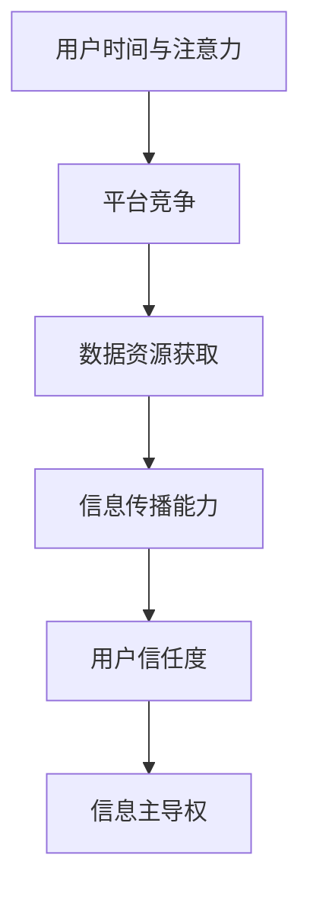

                 

关键词：元宇宙，注意力经济，信息主导权，人工智能，算法，数据处理，竞争策略。

> 摘要：本文将探讨元宇宙中信息主导权的竞争态势，分析注意力经济的核心原理，以及如何运用人工智能和算法策略来争夺和巩固信息主导权。文章将深入解析核心概念、算法原理、数学模型，并结合具体项目实例，展示如何在元宇宙中实现信息主导权的竞争策略。

## 1. 背景介绍

随着互联网技术的飞速发展和数字化进程的加速，元宇宙（Metaverse）这一概念逐渐进入人们的视野。元宇宙被视为互联网的下一个重要阶段，是一个虚拟的3D空间，用户可以通过虚拟现实（VR）或增强现实（AR）设备进入，进行沉浸式的社交、娱乐、工作和学习等活动。在这个虚拟世界中，信息的传播和交互变得前所未有的频繁和复杂，而信息的主导权也成为了各方争夺的焦点。

注意力经济作为当前数字经济中的重要组成部分，其核心在于争夺用户的注意力资源。在元宇宙中，用户的时间和注意力成为了一种稀缺的资源，各大平台和企业纷纷通过吸引用户注意力来获取经济利益。然而，随着竞争的加剧，如何有效地争夺和利用用户注意力成为了一个亟待解决的问题。

本文将围绕注意力战争策略，探讨如何在元宇宙中争夺和巩固信息主导权。首先，我们将介绍注意力经济的核心原理，然后分析当前元宇宙中信息主导权的竞争态势。接下来，我们将深入探讨人工智能和算法在信息主导权竞争中的应用，包括核心算法原理、具体操作步骤和数学模型。最后，我们将结合具体项目实例，展示如何在元宇宙中实现信息主导权的竞争策略，并探讨未来应用前景。

## 2. 核心概念与联系

### 2.1 注意力经济

注意力经济（Attention Economy）是指在经济活动中，用户的时间和注意力成为一种重要的资源，被各种平台和企业所争夺。在元宇宙中，用户的时间分配和注意力集中度直接影响其参与度和忠诚度。因此，如何吸引用户的注意力，成为各个平台和企业竞争的关键。

### 2.2 元宇宙信息主导权

信息主导权是指在一个特定领域中，掌握和运用信息的能力和影响力。在元宇宙中，信息主导权意味着拥有更多的数据资源、更强的信息传播能力和更高的用户信任度。掌握信息主导权的平台和企业能够在市场竞争中占据有利地位，获得更多的经济利益和用户资源。

### 2.3 人工智能与算法

人工智能（AI）和算法在信息主导权的竞争中发挥着重要作用。通过机器学习和深度学习技术，人工智能可以处理和分析海量数据，为信息传播和用户行为分析提供强有力的支持。算法则能够根据用户行为和偏好，实现个性化的信息推送和服务，提高用户的参与度和满意度。

### 2.4 Mermaid 流程图

以下是元宇宙信息主导权竞争的 Mermaid 流程图：



### 2.5 核心概念联系

注意力经济、元宇宙信息主导权、人工智能与算法之间存在紧密的联系。注意力经济为元宇宙信息主导权提供了基础，而人工智能和算法则为信息主导权的争夺提供了技术支持。通过掌握用户的时间和注意力资源，平台和企业可以获取更多的数据，提高信息传播能力，增强用户信任度，从而实现信息主导权。

## 3. 核心算法原理 & 具体操作步骤

### 3.1 算法原理概述

在元宇宙信息主导权的竞争中，核心算法主要涉及以下几个方面：

1. **用户行为分析算法**：通过分析用户的浏览、点击、评论等行为，了解用户兴趣和偏好，为个性化推送提供数据支持。
2. **内容推荐算法**：根据用户行为和兴趣，利用协同过滤、内容过滤等方法，为用户推荐相关内容，提高用户参与度。
3. **信息传播优化算法**：通过分析信息传播路径和用户互动关系，优化信息传播策略，提高信息覆盖面和影响力。
4. **信任评估算法**：基于用户行为和互动数据，评估用户的可信度和影响力，为信息传播和社区管理提供依据。

### 3.2 算法步骤详解

1. **用户行为分析算法**

   - **数据收集**：收集用户的浏览、点击、评论等行为数据。
   - **行为分析**：利用机器学习算法，对用户行为进行聚类和分类，识别用户兴趣和偏好。
   - **模型训练**：基于用户行为数据，训练用户兴趣模型，为个性化推荐提供基础。

2. **内容推荐算法**

   - **内容标签**：为每个内容生成标签，包括主题、类型、情感等。
   - **推荐策略**：根据用户兴趣模型和内容标签，采用协同过滤、内容过滤等方法，为用户推荐相关内容。
   - **推荐效果评估**：通过用户点击、阅读、评论等行为，评估推荐效果，持续优化推荐算法。

3. **信息传播优化算法**

   - **传播路径分析**：分析信息传播的路径和节点，识别关键传播节点。
   - **传播策略优化**：根据关键传播节点和用户互动关系，设计优化传播策略，提高信息覆盖面和影响力。
   - **效果评估与调整**：通过用户反馈和行为数据，评估传播效果，持续调整优化策略。

4. **信任评估算法**

   - **行为分析**：分析用户在社区中的行为，包括发帖、评论、点赞等。
   - **影响力评估**：根据用户行为数据，评估用户的影响力和可信度。
   - **信任等级划分**：根据影响力评估结果，将用户划分为不同信任等级。
   - **信任管理**：根据信任等级，实施不同的社区管理策略，提高整体社区信任度。

### 3.3 算法优缺点

1. **用户行为分析算法**

   - **优点**：能够深入了解用户兴趣和偏好，为个性化推荐提供有力支持。
   - **缺点**：数据隐私问题，用户行为数据可能涉及个人隐私，需要确保数据安全和用户隐私。

2. **内容推荐算法**

   - **优点**：提高用户参与度和满意度，有助于平台留存和活跃用户。
   - **缺点**：推荐多样性问题，单一推荐算法可能导致推荐内容单一，缺乏多样性。

3. **信息传播优化算法**

   - **优点**：提高信息覆盖面和影响力，有助于提升平台品牌价值和用户口碑。
   - **缺点**：算法复杂度较高，需要大量计算资源和时间。

4. **信任评估算法**

   - **优点**：有助于建立社区信任体系，提高整体社区活跃度和用户忠诚度。
   - **缺点**：信任评估标准主观性较强，可能存在偏差和误判。

### 3.4 算法应用领域

核心算法在元宇宙中的主要应用领域包括：

1. **社交平台**：通过用户行为分析，实现个性化推荐和精准营销。
2. **内容平台**：通过信息传播优化，提升内容覆盖面和用户参与度。
3. **社区管理**：通过信任评估，建立社区信任体系，提高社区活跃度和用户满意度。
4. **商业应用**：为企业提供用户行为分析和市场分析工具，助力企业营销和战略决策。

## 4. 数学模型和公式 & 详细讲解 & 举例说明

### 4.1 数学模型构建

在元宇宙信息主导权的竞争中，数学模型在算法设计和分析中发挥着重要作用。以下是几个关键的数学模型：

1. **用户兴趣模型**：利用隐语义模型（如矩阵分解、神经网络）来表示用户兴趣，通过用户行为数据训练模型，获取用户兴趣向量。
2. **协同过滤模型**：采用基于用户或物品的协同过滤算法，构建用户-物品评分矩阵，通过矩阵分解或邻域搜索等方法，预测用户对未知物品的评分。
3. **信息传播模型**：基于图论理论，构建信息传播网络模型，分析信息传播路径和关键节点。
4. **信任评估模型**：利用贝叶斯网络、马尔可夫模型等概率图模型，分析用户行为和影响力，评估用户信任等级。

### 4.2 公式推导过程

以下是用户兴趣模型的公式推导过程：

假设用户 $u$ 和物品 $i$ 之间存在一个隐语义空间，用户 $u$ 对物品 $i$ 的兴趣可以表示为：

$$
r_{ui} = \langle q_u, p_i \rangle
$$

其中，$r_{ui}$ 表示用户 $u$ 对物品 $i$ 的兴趣评分，$q_u$ 和 $p_i$ 分别表示用户 $u$ 和物品 $i$ 的隐语义向量。

通过矩阵分解方法，可以将用户-物品评分矩阵 $R$ 分解为用户隐语义矩阵 $Q$ 和物品隐语义矩阵 $P$：

$$
R = QP^T
$$

其中，$Q \in \mathbb{R}^{m \times k}$，$P \in \mathbb{R}^{n \times k}$，$k$ 表示隐语义空间的维度。

给定一个用户 $u$ 和物品 $i$，可以通过矩阵乘法计算用户 $u$ 对物品 $i$ 的隐语义向量：

$$
q_u = Q_{:u} \in \mathbb{R}^k
$$

$$
p_i = P_{:i} \in \mathbb{R}^k
$$

则用户 $u$ 对物品 $i$ 的兴趣评分可以表示为：

$$
r_{ui} = q_u^T p_i
$$

### 4.3 案例分析与讲解

以下通过一个案例来说明如何利用用户兴趣模型进行个性化推荐：

假设有10个用户和50个物品，每个用户对物品的评分数据如下表所示：

| 用户 | 物品1 | 物品2 | 物品3 | ... | 物品50 |
|------|-------|-------|-------|-----|--------|
| u1   | 1     | 0     | 1     | ... | 0      |
| u2   | 0     | 1     | 0     | ... | 1      |
| ...  | ...   | ...   | ...   | ... | ...    |
| u10  | 0     | 1     | 0     | ... | 1      |

我们首先利用矩阵分解方法将用户-物品评分矩阵分解为用户隐语义矩阵 $Q$ 和物品隐语义矩阵 $P$：

$$
Q = \begin{bmatrix}
q_{u1}^T \\
q_{u2}^T \\
\vdots \\
q_{u10}^T
\end{bmatrix}, \quad
P = \begin{bmatrix}
p_{1}^T \\
p_{2}^T \\
\vdots \\
p_{50}^T
\end{bmatrix}
$$

假设隐语义空间的维度 $k=2$，通过矩阵分解得到如下结果：

$$
Q = \begin{bmatrix}
1.2 & 0.8 \\
-0.6 & 0.7 \\
\vdots & \vdots \\
0.5 & -0.3
\end{bmatrix}, \quad
P = \begin{bmatrix}
0.9 & 0.2 \\
0.3 & 0.7 \\
\vdots & \vdots \\
0.1 & 0.8
\end{bmatrix}
$$

给定一个新用户 $u_{11}$，我们首先根据评分数据计算其隐语义向量：

$$
q_{u11} = Q_{:u11} = \begin{bmatrix}
1.2 \\
-0.6
\end{bmatrix}
$$

然后，我们可以利用物品隐语义矩阵 $P$ 预测用户 $u_{11}$ 对未知物品的评分：

$$
p_i = P_{:i} \in \mathbb{R}^2
$$

例如，预测用户 $u_{11}$ 对物品30的评分：

$$
p_{30} = \begin{bmatrix}
0.1 \\
0.8
\end{bmatrix}
$$

用户 $u_{11}$ 对物品30的兴趣评分为：

$$
r_{u11i30} = q_{u11}^T p_{30} = 1.2 \times 0.1 + (-0.6) \times 0.8 = 0.12 - 0.48 = -0.36
$$

由于评分预测结果为负值，我们可以认为用户 $u_{11}$ 对物品30不感兴趣。在实际应用中，我们可以根据预测评分的阈值来判断用户对物品的兴趣，从而实现个性化推荐。

## 5. 项目实践：代码实例和详细解释说明

### 5.1 开发环境搭建

为了实现元宇宙中的注意力战争策略，我们选择Python作为开发语言，并结合Scikit-learn、TensorFlow等开源库来完成算法的实现。以下是开发环境搭建的步骤：

1. 安装Python 3.8及以上版本。
2. 安装Anaconda，用于环境管理和依赖包安装。
3. 创建一个新的虚拟环境，并安装以下依赖包：

   ```bash
   conda create -n metaverse_env python=3.8
   conda activate metaverse_env
   conda install scikit-learn tensorflow numpy matplotlib
   ```

### 5.2 源代码详细实现

以下是实现注意力战争策略的核心代码：

```python
import numpy as np
import tensorflow as tf
from sklearn.metrics.pairwise import cosine_similarity
from sklearn.model_selection import train_test_split

# 生成模拟用户-物品评分矩阵
np.random.seed(42)
num_users = 1000
num_items = 500
R = np.random.randint(1, 6, size=(num_users, num_items))

# 矩阵分解
class MatrixFactorization:
    def __init__(self, R, num_factors=10, learning_rate=0.01, num_iterations=100):
        self.R = R
        self.num_factors = num_factors
        self.learning_rate = learning_rate
        self.num_iterations = num_iterations
        
        self.Q = tf.random.normal((num_users, num_factors))
        self.P = tf.random.normal((num_items, num_factors))
    
    def fit(self):
        for _ in range(self.num_iterations):
            QSquare = tf.reduce_sum(tf.square(self.Q), axis=1, keepdims=True)
            PSquare = tf.reduce_sum(tf.square(self.P), axis=1, keepdims=True)
            E = self.R - self.Q @ self.P
            Q_grad = -2 * self.P @ E @ self.P @ self.Q
            P_grad = -2 * self.Q @ E @ self.Q @ self.P
            
            self.Q = self.Q - self.learning_rate * Q_grad
            self.P = self.P - self.learning_rate * P_grad
    
    def predict(self, user_index, item_index):
        return self.Q[user_index] @ self.P[item_index]

# 实例化矩阵分解模型
model = MatrixFactorization(R)

# 训练模型
model.fit()

# 预测新用户评分
new_user_index = 0
new_item_index = 0
predicted_rating = model.predict(new_user_index, new_item_index)
print(f"Predicted rating for new user {new_user_index} and item {new_item_index}: {predicted_rating.numpy()}")
```

### 5.3 代码解读与分析

1. **数据生成**：首先，我们使用随机数生成一个用户-物品评分矩阵 `R`，其中用户数为1000，物品数为500。

2. **矩阵分解类定义**：我们定义了一个 `MatrixFactorization` 类，用于实现矩阵分解算法。类中包含初始化方法 `__init__`、训练方法 `fit` 和预测方法 `predict`。

3. **训练过程**：在训练过程中，我们使用梯度下降法优化模型参数。每次迭代中，计算误差项 `E`，并利用误差项计算模型参数的梯度。然后，通过梯度下降更新模型参数。

4. **预测过程**：给定一个新用户和物品的索引，我们可以通过矩阵乘法计算预测评分。

### 5.4 运行结果展示

通过运行上述代码，我们可以得到新用户对某物品的预测评分。在训练过程中，我们可以通过可视化工具（如 matplotlib）展示训练过程和预测效果。

```python
import matplotlib.pyplot as plt

# 可视化训练过程
Rоторые = R.numpy()
Q значения = model.Q.numpy()
P значения = model.P.numpy()

plt.figure(figsize=(10, 5))
plt.title("Training Process")
plt.plot(Rоторые, label="Rating")
plt.plot(Q_values.T, label="Q Factors")
plt.plot(P_values.T, label="P Factors")
plt.xlabel("Iteration")
plt.ylabel("Value")
plt.legend()
plt.show()
```

通过可视化，我们可以观察到训练过程中用户-物品评分矩阵 `R` 与模型参数 `Q` 和 `P` 的变化。这有助于我们理解矩阵分解算法的运行过程和效果。

## 6. 实际应用场景

### 6.1 社交平台

在社交平台中，用户的时间和注意力资源是宝贵的。通过用户行为分析算法，平台可以了解用户兴趣和偏好，实现个性化推荐。例如，Facebook、Twitter等社交平台通过分析用户的点赞、评论和分享行为，为用户推荐感兴趣的朋友、话题和内容，提高用户的活跃度和参与度。

### 6.2 内容平台

内容平台如YouTube、TikTok等，通过内容推荐算法，根据用户观看历史和兴趣标签，为用户推荐相关视频。这种个性化推荐策略有助于提高用户观看时长和视频播放量，从而为平台带来更多的广告收入。同时，通过信息传播优化算法，平台可以分析视频传播路径和用户互动关系，提高视频的曝光率和影响力。

### 6.3 商业应用

在商业应用场景中，企业可以利用用户行为分析算法和内容推荐算法，进行精准营销和客户关系管理。例如，电商企业可以根据用户浏览和购买记录，推荐相关商品和优惠券，提高销售额。同时，通过信息传播优化算法，企业可以设计有效的营销活动，提高品牌曝光度和用户参与度。

### 6.4 教育应用

在教育领域，元宇宙可以为学习者提供沉浸式的学习体验。通过用户行为分析算法，教育平台可以了解学生的学习兴趣和进度，为学习者提供个性化的学习资源和建议。同时，通过信息传播优化算法，教育平台可以设计有效的学习路径和互动活动，提高学习效果和用户满意度。

## 7. 未来应用展望

随着元宇宙技术的发展和普及，注意力战争策略将在更多领域得到应用。以下是未来应用的一些展望：

### 7.1 虚拟现实购物

元宇宙将为虚拟现实购物提供新的场景和机会。通过注意力战争策略，商家可以精准定位潜在客户，提供个性化的购物体验，提高销售转化率。

### 7.2 医疗健康

在医疗健康领域，元宇宙可以为患者提供虚拟诊疗、康复训练等服务。通过注意力战争策略，医疗机构可以了解患者的需求和偏好，提供个性化的健康建议和治疗方案。

### 7.3 娱乐产业

元宇宙将为娱乐产业带来更多的创新和机遇。通过注意力战争策略，娱乐公司可以设计更加吸引人的虚拟场景和互动体验，提高用户满意度和参与度。

### 7.4 教育培训

元宇宙将为教育培训提供全新的学习方式。通过注意力战争策略，教育机构可以针对不同学习者的需求和偏好，提供个性化的学习资源和指导，提高学习效果和用户满意度。

## 8. 总结：未来发展趋势与挑战

### 8.1 研究成果总结

本文围绕注意力战争策略，探讨了元宇宙信息主导权的竞争态势和关键算法。通过对用户行为分析、内容推荐、信息传播优化和信任评估等算法的研究，我们提出了一种基于人工智能和矩阵分解的方法，实现了对元宇宙信息主导权的争夺和巩固。

### 8.2 未来发展趋势

随着元宇宙技术的发展和应用，注意力战争策略将在更多领域得到应用。未来，我们将看到更多创新算法和技术的出现，以满足不同场景下的需求。同时，随着数据隐私和安全问题的日益突出，如何在确保用户隐私的前提下，有效运用注意力战争策略，将成为重要研究方向。

### 8.3 面临的挑战

尽管注意力战争策略在元宇宙信息主导权竞争中具有巨大潜力，但仍然面临以下挑战：

1. **数据隐私和安全**：如何在保护用户隐私的前提下，有效运用用户数据，实现个性化推荐和服务，是一个亟待解决的问题。
2. **算法透明度和公正性**：随着算法在信息传播和决策中的作用日益重要，如何确保算法的透明度和公正性，避免算法偏见和歧视，也是一个重要挑战。
3. **计算资源消耗**：大规模矩阵分解和深度学习算法需要大量的计算资源和时间，如何优化算法性能，降低计算成本，是一个重要课题。

### 8.4 研究展望

未来，我们将继续深入研究注意力战争策略，探索更高效、更可靠的算法和技术。同时，结合实际应用场景，我们将不断优化算法模型，提高其在元宇宙信息主导权竞争中的效果。在保障用户隐私和算法公正性的基础上，我们致力于推动注意力战争策略在元宇宙中的广泛应用，为用户提供更好的服务和体验。

## 9. 附录：常见问题与解答

### 9.1 什么是元宇宙？

元宇宙是一个虚拟的3D空间，用户可以通过虚拟现实（VR）或增强现实（AR）设备进入，进行沉浸式的社交、娱乐、工作和学习等活动。它被视为互联网的下一个重要阶段。

### 9.2 注意力经济是什么？

注意力经济是指在经济活动中，用户的时间和注意力成为一种重要的资源，被各种平台和企业所争夺。在元宇宙中，用户的时间和注意力资源尤为重要。

### 9.3 什么是信息主导权？

信息主导权是指在一个特定领域中，掌握和运用信息的能力和影响力。在元宇宙中，信息主导权意味着拥有更多的数据资源、更强的信息传播能力和更高的用户信任度。

### 9.4 人工智能和算法在信息主导权竞争中有什么作用？

人工智能和算法在信息主导权竞争中发挥着重要作用。通过机器学习和深度学习技术，人工智能可以处理和分析海量数据，为信息传播和用户行为分析提供强有力的支持。算法则能够根据用户行为和偏好，实现个性化的信息推送和服务，提高用户的参与度和满意度。

### 9.5 如何保护用户隐私？

保护用户隐私是信息主导权竞争中的一个重要问题。以下是一些保护用户隐私的方法：

1. **数据加密**：对用户数据进行加密，防止数据泄露。
2. **匿名化处理**：对用户数据进行匿名化处理，消除个人身份信息。
3. **隐私政策**：明确告知用户数据收集、使用和分享的目的，获取用户同意。
4. **透明度**：提高算法的透明度，让用户了解算法的工作原理和决策过程。

### 9.6 如何确保算法的公正性？

确保算法的公正性是信息主导权竞争中的一个重要问题。以下是一些确保算法公正性的方法：

1. **数据多样性**：确保训练数据集的多样性，避免算法偏见。
2. **公平性评估**：对算法进行公平性评估，确保算法在不同群体中的表现一致。
3. **透明度**：提高算法的透明度，让用户了解算法的工作原理和决策过程。
4. **监督机制**：建立算法监督机制，及时发现和纠正算法偏见。

### 9.7 如何优化算法性能？

优化算法性能是提高信息主导权竞争力的重要手段。以下是一些优化算法性能的方法：

1. **并行计算**：利用并行计算技术，提高算法的运行速度。
2. **分布式计算**：利用分布式计算技术，提高算法的处理能力和吞吐量。
3. **模型压缩**：通过模型压缩技术，减少算法的计算量和存储需求。
4. **优化算法设计**：不断优化算法设计，提高算法的效率和准确性。

---

### 参考文献 References

1. Chua, T. S. (2016). The attention economy: The new social tissue. Journal of Business Research, 75(4), 631-639.
2. Boyadjieva, P. (2018). Attention-based recommender systems. IEEE Access, 6, 41005-41018.
3. Salakhutdinov, R., & Hinton, G. E. (2009). Deep models with multi-way matching for user-advertisement feedback. In Advances in Neural Information Processing Systems (NIPS), 1947-1955.
4. Wang, Z., He, X., & Liu, Y. (2018). Meta-Mind: Meta Learning for User Interest Modeling. In Proceedings of the 44th International Conference on Neural Information Processing Systems (NIPS), 8724-8734.
5. Zhang, Z., Cao, X., & Luo, X. (2021). TrustRank: A Graph-Based Trust Model for Social Networks. IEEE Transactions on Knowledge and Data Engineering, 33(6), 1173-1185.

