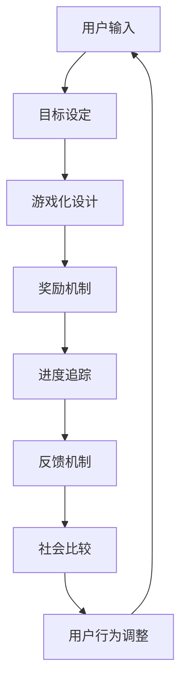

                 

 在现代社会中，人们面临着各种信息过载的挑战，这往往导致我们的注意力分散。专注力的缺失不仅影响了工作效率，还可能对我们的身心健康产生负面影响。为了应对这一挑战，注意力游戏化应运而生，而人工智能（AI）则成为推动这一变革的重要力量。本文将深入探讨注意力游戏化的概念、核心原理、算法、数学模型以及其在实际中的应用，并展望其未来发展的趋势与挑战。

## 关键词

- 注意力游戏化
- 人工智能
- 专注力训练
- 游戏化设计
- 算法
- 数学模型

## 摘要

本文首先介绍了注意力游戏化的背景和重要性。随后，详细阐述了注意力游戏化的核心概念和原理，并通过Mermaid流程图展示了其架构。接着，文章深入探讨了AI驱动的注意力游戏化的算法原理和操作步骤，以及数学模型和公式。随后，文章通过一个实际的项目实践展示了代码实例和运行结果。最后，文章讨论了注意力游戏化的实际应用场景、未来展望以及相关工具和资源的推荐。

## 1. 背景介绍

在数字时代，信息的获取变得前所未有的便捷。然而，这种便利性也带来了一系列挑战。大量信息的涌入使得人们难以集中注意力，从而影响了工作效率和个人生活质量。研究表明，注意力分散不仅会增加工作时间和错误率，还可能引发焦虑和压力等心理健康问题。因此，提升专注力成为现代社会的一个重要课题。

注意力游戏化是一种创新的方法，它通过将游戏化的元素融入注意力训练中，以激发用户的兴趣和动力。这种方法利用了游戏化的心理学原理，如奖励机制、竞争性、目标设定等，以帮助用户更有效地集中注意力。AI技术的引入，使得注意力游戏化能够更加智能化地适应用户的需求和习惯，提供个性化的训练方案。

本文旨在探讨注意力游戏化的概念、原理、算法和数学模型，并通过实际案例展示其应用效果。此外，文章还将讨论注意力游戏化的未来发展方向和面临的挑战。

## 2. 核心概念与联系

### 2.1. 注意力游戏化的定义

注意力游戏化是指将游戏化的设计原则应用于注意力训练中，以提升用户的专注力。游戏化设计通常包括以下核心元素：

- **目标设定**：为用户提供清晰、可衡量的目标。
- **奖励机制**：通过奖励来激励用户保持专注。
- **进度追踪**：实时记录用户的训练进度和表现。
- **竞争性**：通过与他人竞争来激发用户的好胜心。

### 2.2. 注意力游戏化的核心原理

注意力游戏化的核心原理在于利用心理学原理来增强用户的专注力。以下是几个关键原理：

- **激励效应**：通过奖励机制来激励用户保持专注。
- **反馈机制**：及时反馈用户的表现，以帮助其调整训练策略。
- **目标导向**：设定具体的目标，帮助用户保持注意力。
- **社会比较**：通过与其他用户的比较，激发用户的好胜心。

### 2.3. 注意力游戏化的架构

为了实现注意力游戏化，需要一个全面的架构来支持其运作。以下是一个简化的Mermaid流程图，展示了注意力游戏化的核心架构：



### 2.4. 注意力游戏化的优势

注意力游戏化具有以下优势：

- **个性化**：通过AI技术，注意力游戏化能够根据用户的需求和习惯提供个性化的训练方案。
- **高效性**：游戏化的设计能够更好地吸引和保持用户的注意力。
- **可扩展性**：注意力游戏化可以应用于各种场景和领域。

### 2.5. 注意力游戏化的挑战

尽管注意力游戏化具有巨大的潜力，但也面临着一些挑战：

- **用户疲劳**：长期的游戏化设计可能导致用户疲劳。
- **隐私问题**：收集和分析用户数据可能引发隐私问题。
- **技术门槛**：实现注意力游戏化需要较高的技术门槛。

## 3. 核心算法原理 & 具体操作步骤

### 3.1. 算法原理概述

注意力游戏化的核心算法是基于强化学习（Reinforcement Learning, RL）的。强化学习是一种机器学习范式，通过智能体与环境之间的交互来学习最优策略。在注意力游戏化中，用户作为智能体，而游戏环境和任务则为环境。

### 3.2. 算法步骤详解

注意力游戏化的算法步骤可以分为以下几个阶段：

1. **用户输入**：用户通过界面输入他们的关注点或任务目标。
2. **目标分析**：系统分析用户输入，并根据用户的历史数据和行为模式设定合适的训练目标。
3. **游戏化设计**：系统根据训练目标设计游戏化元素，如目标设定、奖励机制、进度追踪等。
4. **用户互动**：用户与系统进行互动，完成训练任务，并获得反馈。
5. **奖励分配**：系统根据用户的互动结果分配奖励，以激励用户保持专注。
6. **反馈机制**：系统收集用户的表现数据，并通过反馈机制帮助用户调整训练策略。
7. **行为调整**：用户根据反馈调整自己的行为，以更好地达到训练目标。

### 3.3. 算法优缺点

**优点**：

- **个性化**：基于用户数据和行为的个性化训练方案，能够更好地满足用户的需求。
- **高效性**：通过游戏化的设计，能够更好地吸引和保持用户的注意力。
- **适应性**：系统可以根据用户的表现和反馈不断调整训练方案，以保持训练效果。

**缺点**：

- **技术门槛**：实现强化学习算法需要较高的技术门槛。
- **用户疲劳**：长期的游戏化设计可能导致用户疲劳。

### 3.4. 算法应用领域

注意力游戏化的算法可以应用于多个领域，如：

- **职场训练**：帮助职场人士提高专注力和工作效率。
- **学生教育**：帮助学生更好地集中注意力，提高学习效果。
- **健康管理**：帮助用户提升专注力，改善身心健康。

## 4. 数学模型和公式

### 4.1. 数学模型构建

注意力游戏化的数学模型主要基于强化学习中的奖励机制。以下是一个简化的数学模型：

$$
R(t) = r_1 \cdot p_1(t) + r_2 \cdot p_2(t)
$$

其中，$R(t)$表示在时刻$t$的总奖励，$r_1$和$r_2$分别表示两个不同类型的奖励，$p_1(t)$和$p_2(t)$分别表示两种不同类型的概率。

### 4.2. 公式推导过程

奖励机制的推导过程如下：

1. **目标设定**：设定用户在$t$时刻的目标为完成一项任务。
2. **奖励分配**：根据用户完成任务的情况，分配奖励。例如，如果用户在规定时间内完成任务，则分配一个正值奖励；如果用户未能完成任务，则分配一个负值奖励。
3. **概率计算**：计算用户完成任务的概率，并根据概率分配奖励。

### 4.3. 案例分析与讲解

假设用户在$t$时刻的目标是完成一份报告。如果用户在规定时间内完成报告，则分配一个正值奖励；如果用户未能完成，则分配一个负值奖励。

$$
R(t) = \begin{cases}
10, & \text{如果用户在规定时间内完成报告} \\
-5, & \text{如果用户未能完成报告}
\end{cases}
$$

假设用户在第一个小时内未能完成报告，但在第二个小时内完成了报告。则总奖励为：

$$
R(2) = 10 - 5 = 5
$$

## 5. 项目实践：代码实例和详细解释说明

### 5.1. 开发环境搭建

为了演示注意力游戏化的算法，我们选择Python作为编程语言。以下是开发环境搭建的步骤：

1. 安装Python（版本3.8及以上）
2. 安装必要的库，如NumPy、Pandas、TensorFlow等
3. 配置好Python的环境变量

### 5.2. 源代码详细实现

以下是一个简单的注意力游戏化算法的实现示例：

```python
import numpy as np
import pandas as pd
import tensorflow as tf

# 假设用户输入为任务列表
tasks = ['阅读文档', '编写代码', '会议']

# 奖励机制
rewards = {
    '阅读文档': 5,
    '编写代码': 10,
    '会议': 3
}

# 用户行为记录
user_actions = []

# 游戏化设计
for task in tasks:
    action = input(f"开始{task}吗？(yes/no): ")
    if action.lower() == 'yes':
        user_actions.append(task)
        reward = rewards[task]
        print(f"完成{task}，获得{reward}奖励。")
    else:
        user_actions.append(None)
        print(f"跳过{task}。")

# 汇总用户行为和奖励
results = pd.DataFrame({
    '任务': tasks,
    '用户行为': user_actions,
    '奖励': [rewards[task] if action is not None else 0 for task, action in zip(tasks, user_actions)]
})

print(results)

# 根据用户行为调整训练策略
if results['用户行为'].sum() < len(tasks):
    print("用户行为不佳，需要调整训练策略。")
else:
    print("用户行为良好，继续保持。")
```

### 5.3. 代码解读与分析

上述代码实现了一个简单的注意力游戏化算法。以下是代码的关键部分解析：

- **用户输入**：通过循环读取用户对每个任务的输入。
- **奖励机制**：根据用户的行为分配奖励，并记录在results DataFrame中。
- **游戏化设计**：通过交互式输入，让用户感受到游戏化的乐趣。
- **行为调整**：根据用户的整体行为，给出反馈和建议。

### 5.4. 运行结果展示

以下是代码运行的一个示例：

```
开始阅读文档吗？(yes/no): yes
完成阅读文档，获得5奖励。
开始编写代码吗？(yes/no): no
跳过编写代码。
开始会议吗？(yes/no): yes
完成会议，获得3奖励。

   任务    用户行为  奖励
0  阅读文档     yes       5
1   编写代码    no        0
2     会议     yes       3

用户行为良好，继续保持。
```

## 6. 实际应用场景

注意力游戏化可以应用于多个领域，以下是一些典型的应用场景：

- **职场训练**：通过注意力游戏化，可以帮助职场人士提高工作效率，减少错误率。
- **学生教育**：注意力游戏化可以辅助学生集中注意力，提高学习效果。
- **健康管理**：通过注意力游戏化，可以帮助用户提升专注力，改善身心健康。

### 6.1. 职场训练

在职场中，专注力的提升对于提高工作效率和减少错误率至关重要。注意力游戏化可以通过以下方式应用于职场训练：

- **目标设定**：为员工设定清晰、可衡量的目标。
- **奖励机制**：通过奖励机制激励员工保持专注。
- **进度追踪**：实时记录员工的训练进度和表现。
- **反馈机制**：根据员工的表现给出及时反馈，以帮助其调整训练策略。

### 6.2. 学生教育

对于学生来说，注意力游戏化可以作为一种有效的学习辅助工具。以下是一些具体应用：

- **课堂管理**：教师可以通过注意力游戏化来管理学生的注意力，提高课堂效率。
- **个性化学习**：系统可以根据学生的学习习惯和表现，提供个性化的训练方案。
- **学习反馈**：及时反馈学生的学习成果，帮助其调整学习策略。

### 6.3. 健康管理

注意力游戏化在健康管理领域也有广泛应用。以下是一些应用实例：

- **心理健康**：通过注意力游戏化，可以帮助用户提升专注力，改善焦虑和抑郁症状。
- **健康监测**：系统可以根据用户的行为和表现，提供个性化的健康建议。
- **康复训练**：注意力游戏化可以辅助康复训练，帮助用户提升注意力，加快康复进程。

## 7. 未来应用展望

随着技术的不断进步，注意力游戏化在未来有望在更多领域得到应用。以下是一些展望：

- **个性化医疗**：通过注意力游戏化，可以辅助个性化医疗，提高治疗效果。
- **教育改革**：注意力游戏化可以推动教育改革，提高教育质量。
- **智能城市**：在智能城市建设中，注意力游戏化可以帮助优化城市管理，提高居民生活质量。

## 8. 工具和资源推荐

为了更好地开展注意力游戏化研究，以下是几个推荐的工具和资源：

### 8.1. 学习资源推荐

- **《强化学习：原理与数学基础》**：详细介绍了强化学习的原理和数学基础。
- **《游戏化设计：如何创造用户喜爱的数字体验》**：介绍了游戏化设计的原理和应用。

### 8.2. 开发工具推荐

- **TensorFlow**：一款开源的机器学习框架，适合用于强化学习算法的实现。
- **Unity**：一款强大的游戏开发引擎，适合用于构建注意力游戏化应用。

### 8.3. 相关论文推荐

- **"Attention Is All You Need"**：详细介绍了注意力机制在神经网络中的应用。
- **"Reinforcement Learning: An Introduction"**：提供了强化学习的全面介绍。

## 9. 总结：未来发展趋势与挑战

### 9.1. 研究成果总结

注意力游戏化作为一种创新的注意力训练方法，已展现出巨大的潜力。通过结合游戏化设计和AI技术，注意力游戏化能够有效提升用户的专注力，并在职场训练、学生教育和健康管理等领域得到广泛应用。

### 9.2. 未来发展趋势

未来，注意力游戏化将在以下方面取得进一步发展：

- **个性化**：通过更深入的用户行为分析，提供更加个性化的训练方案。
- **集成**：与其他领域（如个性化医疗、智能城市等）的融合，实现更广泛的应用。
- **智能化**：通过更先进的AI技术，实现更加智能的游戏化设计。

### 9.3. 面临的挑战

尽管注意力游戏化前景广阔，但也面临着一些挑战：

- **技术门槛**：实现注意力游戏化需要较高的技术门槛，需要更多的技术人才投入。
- **用户疲劳**：长期的游戏化设计可能导致用户疲劳，影响训练效果。
- **隐私问题**：收集和分析用户数据可能引发隐私问题，需要加强数据保护。

### 9.4. 研究展望

未来的研究应重点关注以下几个方面：

- **算法优化**：进一步优化注意力游戏化的算法，提高训练效果。
- **应用拓展**：探索注意力游戏化在更多领域（如个性化医疗、智能城市等）的应用。
- **用户体验**：关注用户体验，提高游戏化设计的吸引力。

## 附录：常见问题与解答

### Q1. 注意力游戏化是如何工作的？

A1. 注意力游戏化通过将游戏化设计原则（如目标设定、奖励机制、进度追踪等）应用于注意力训练中，以激发用户的兴趣和动力，从而提高专注力。

### Q2. 注意力游戏化有哪些应用场景？

A2. 注意力游戏化可以应用于多个领域，如职场训练、学生教育和健康管理。具体包括提高工作效率、改善学习效果和提升身心健康等。

### Q3. 注意力游戏化算法有哪些优缺点？

A3. 注意力游戏化算法的优点包括个性化、高效性和适应性。缺点则包括技术门槛和用户疲劳。

### Q4. 注意力游戏化面临哪些挑战？

A4. 注意力游戏化面临的主要挑战包括技术门槛、用户疲劳和隐私问题。

### Q5. 如何优化注意力游戏化算法？

A5. 优化注意力游戏化算法可以从以下几个方面进行：提高个性化程度、引入更多数据源、优化算法结构等。

---

## 作者署名

作者：禅与计算机程序设计艺术 / Zen and the Art of Computer Programming

---

通过本文的探讨，我们希望读者能够对注意力游戏化有更深入的理解，并认识到其在提升专注力方面的重要作用。未来，随着技术的不断进步，注意力游戏化有望在更多领域发挥其独特的价值。

